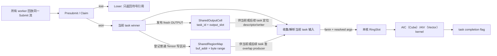
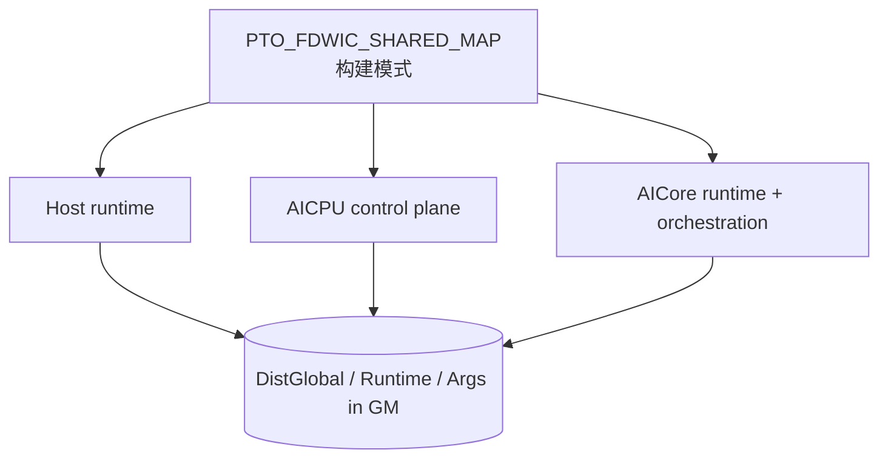
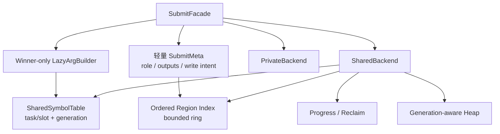

# A5 FDWIC Shared TensorMap 分支架构审查记录

本文审查
[`poursoul/simpler:fdwic-shared-tensormap`](https://github.com/poursoul/simpler/tree/fdwic-shared-tensormap)
在 A5 FDWIC runtime 中实现的 shared TensorMap 方案，并与当前分支准备采用的
方案比较。本文用于后续开发决策，不表示目标分支已经合入，也不把分支文档中的
实验记录自动当成当前分支的性能结论。

## 1. 审查快照与证据口径

| 项目 | 本次固定值 |
| ---- | ---------- |
| 审查日期 | 2026-07-24 |
| 目标提交 | `2866ad73b4f15a4f6fa292af5b7d546e8f972f8d` |
| 当前分支提交 | `1726a774826b20f14fbd8c8fcfb54cdbc525f49f` |
| 两分支 merge-base | `599703f5b153a3a0fd2a3516dff4efd49be3f00a` |
| shared 功能序列首提交 | `67d9d186` |
| 首提交父提交 | `f5da1a2e` |
| 重点审查差异 | `f5da1a2e..2866ad73`，42 个文件 |

目标分支和当前分支在较早位置已经分叉。若直接审查
`HEAD...poursoul/fdwic-shared-tensormap`，会把 131 个文件的两边独立演进都
误算成 shared TensorMap 改动。因此本文以 shared 功能序列的父提交
`f5da1a2e` 为功能基线，同时用当前分支
`docs/fully_distributed_within_core.md` 第 12 章校准预期协议。

本文使用四种证据标记：

- **代码事实**：可由目标提交源码直接证明；
- **本次验证**：本机执行过编译探针或 Git 检查；
- **分支记录**：目标分支文档记录的 sim、上板或性能结果，本次没有重跑；
- **审查推断**：由并发顺序和状态不变式推出，仍应由定向测试验证。

本次没有修改目标 worktree，没有重跑 A5/A5sim 全量用例，也没有复测目标分支
性能。实际执行了 private/shared 布局探针和 profile-off 头文件编译探针。

## 2. 先给结论

这份实现不是“把现有 per-core TensorMap 换成一份共享 ring”，而是一套
**性能优先的双通道依赖协议**：

1. fresh `OUTPUT` 使用 `(producer_task_id, output_slot)` 直接索引
   `SharedOutputCell`；
2. 普通 Tensor 或既有 Tensor 的重叠写依赖使用 append-only
   `SharedRegionMap`；
3. shared API 支持把 Claim 提到重参数构造之前；PA 调用点把完整参数构造放入
   `tok.won` 分支，loser 只返回符号引用。其他调用点若在 presubmit 前已经构造
   `L0TaskArgs`，并不会自动获得这部分收益。

这个方向有真实价值。尤其是 winner-first、PA loser 轻路径、fresh output 的
O(1) 符号定位、显式 DCache flush/invalidate，以及 MIX follower 由 winner
统一解析输入的基础机制，都值得复用。

但它目前还不适合作为最终 shared TensorMap 整体移植，主要阻断点是：

1. private/shared 会生成 ABI 不兼容的三镜像，但构建缓存身份没有包含模式；
2. writer intent 是调用方可选 API，真实 PA 的 INOUT 路径没有使用它；
3. shared heap、region map 和 task table 没有 generation、reclaim 和可证明的
   有界复用协议；
4. shared 模式下 `fatal_set()` 恒为 false，容量错误可能退化成永久轮询；
5. shared output 每 task 物理上限为 8，但公共接口允许构造最多 32 个输出。

因此建议是：

> 不整段 cherry-pick。先复用“winner-first + 符号引用 + 显式缓存维护”的设计
> 资产，再把构建身份、写入顺序、generation/reclaim、错误传播和容量断言补成
> 可证明的协议，最后迁移 PA。

## 3. 目标分支的实际逻辑架构

### 3.1 它是两个索引，不是一张共享 TensorMap



核心状态位于
`src/a5/runtime/fully_distributed_within_core/runtime/dist_engine/common/state.h`：

| 状态 | 组织方式 | 当前语义 |
| ---- | -------- | -------- |
| `shared_outputs[kFlagCap]` | task id 直达数组 | fresh output descriptor 与最新 writer |
| `SharedOutputCell::published[8]` | 每项独占 cacheline | descriptor 发布完成标志 |
| `SharedOutputCell::last_writer[8]` | 每项独占 cacheline | INPUT/INOUT 的 writer 链 |
| `SharedRegionMap::buckets` | 8192 个桶头 | 普通 Tensor 地址哈希 |
| `SharedRegionMap::entries` | 65536 个 append-only entry | 重叠 byte range 及 producer |
| `shared_heap_cursor[8]` | task id 分片 | winner 输出 heap 分配 |
| `tasks[kFlagCap]` | 65536 个 task cell | 完成、vend、依赖准备标志 |

因此“shared map”这个名字容易造成误解：

- fresh output 根本不进入 region map；
- region map 不是 ring，没有 per-slot `seq`，没有回收；
- task id 达到 `kFlagCap=65536` 时直接报错，不支持代际复用；
- 零输出 task 仍必须发布 task completion；它只是不需要发布
  `SharedOutputCell` 或 region delta，因为实现里没有全局 map append 前沿。

### 3.2 fresh output 快路径

producer winner 的关键顺序在
`runtime/dist_engine/aicore/submit_core.h:668-759`：

```text
reserve shared heap
  -> for each output:
       materialize Tensor descriptor
       copy descriptor to SharedOutputCell.tensors[slot]
       CCEC flush descriptor + DSB
       fetch_max(last_writer, producer_task_id)
  -> after all outputs: store_barrier
  -> for each output:
       release publish published[slot] = producer_task_id
```

在 PA 这类把参数构造放到 `tok.won` 后的调用点，loser 不构造
`TensorCreateInfo` 和完整参数，只通过 `rt_submit_loser(tok, output_count)`
返回 `FdwicOutputRef`。`shared_symbol_smoke` 和 `submit_dependency_smoke`
部分 wrapper 在 presubmit 前已有完整 `args`，不能把这项收益外推到所有调用点。
引用本身包含 `producer_task_id`、`output_slot` 和有限的一维 view 信息。

consumer winner 的行为是：

- `INPUT`：读取 `last_writer`，无有效 writer 时回退到原 producer；
- `INOUT` / `OUTPUT_EXISTING`：对 `last_writer` 做
  `atomic_exchange(current_task_id)`，返回旧 writer 作为 fanin；
- resolve：等待指定 `published[slot]`，invalidate descriptor cacheline，
  再把 Tensor descriptor 拷入执行侧 `RingSlot` 或 `BuiltSubtask`。

相较统一 region lookup，这条路径的优势明确：

- 索引为 O(1)，没有桶扫描；
- loser 不必等待全局 task 发布前缀；
- descriptor 身份与逻辑 writer 分开；
- producer materialize 较晚时，`fetch_max` 不会覆盖已经到达的更大 writer。

### 3.3 普通 Tensor 的 region 慢路径

普通 Tensor 的地址依赖由
`submit_core.h:854-940` 处理：

1. 按 buffer 地址选 bucket；
2. 遍历单向 entry 链；
3. 对每个 entry 做 CCEC invalidate；
4. 在重叠区间中选择 `producer < current_task_id` 的最大 producer；
5. writer 使用 `high_water.fetch_add()` 取得永久 entry；
6. 通过 bucket 的 `-2` sentinel 独占插入，再 flush entry 并发布新桶头。

它是 append-only 表，不是当前文档第 12 章描述的
ring-per-bucket：

- lookup 窗口是所有已插入的 `< N` producer，不是 `[N-H, N)`；
- 没有 `head`、generation、per-slot `seq` 或 min-progress reclaim；
- 同一 buffer 的长写链会让 bucket 扫描不断变深；
- 容量耗尽后只能 `set_fatal()`。

`insert_lock` 字段和全局 lock helper 仍存在，但实际插入使用的是每 bucket
sentinel。它目前是死字段候选；应先完成 Host/AICPU/AICore 三镜像的 ABI、
初始化和布局审计，再单独决定清理或补充用途，不能顺手删除。

### 3.4 region intent 是可选调用协议

目标分支为写依赖增加了
`rt_presubmit_*_with_region_intent()`：

```mermaid
sequenceDiagram
    participant W as task N winner
    participant L as task N losers
    participant S as shared dependency state

    L->>S: wait deps_prepared[N]
    W->>W: collect fanin
    W->>W: register writer regions
    W->>S: publish deps_prepared[N]
    S-->>L: wait released; writer intent visible
    W->>W: continue winner build
    L->>L: continue replay
```

意图是防止 task N 的 losers 在 N 的 writer 尚未登记时继续跑到 task N+1。
但该语义没有收进 runtime 的统一入口，而是由 orchestration/codegen 判断是否
调用：

- `submit_dependency_smoke` 的 wrapper 会扫描参数 tag 并选择 intent API；
- PA 的 QK/SF/PV/Update 都调用普通 `rt_presubmit_*`；
- PA Update 甚至在 presubmit 之后、且仅在 winner 分支内才构造四个 INOUT。

这意味着 PA 无法在 Claim 前依据尚未构造的参数发布 writer intent。目标分支
计划文档也承认该能力仍依赖 codegen 显式接入。

### 3.5 MIX/joint 路径

最新代码已补上一部分 shared MIX 基础机制：

1. anchor winner 先收集 fanin 并 resolve shared descriptor；
2. fanin ready 后才发布 follower 的 `BuiltSubtask`；
3. follower 直接消费 winner 已解析的 payload，shared follower fanin 清零；
4. `joint_launch_expected/drained` 防止最终退出早于迟到的 follower launch；
5. 所有参与 lane 完成后仍只发布一个 task completion。

`0f9862a2` 和 `d618589f` 修正了 winner 侧 shared-ref resolve 以及
launch/drain 门控，但还不能称为完整闭环。目标分支文档仍列有 MIX output
publisher、MIX INOUT/OUTPUT_EXISTING、连续 MIX、容量/反压和完整 stress
缺口。准确结论是：基础 handoff 已存在，部分关键路径已修正，通用语义和压力
验证仍未完成。

### 3.6 初始化和运行生命周期

主要生命周期路径已经接通：

- host 在 runtime 创建/setup 路径预留并清零固定 runtime arena；
- AICPU register 重置 cursor、task cell、shared output flag、region bucket、
  heap cursor、joint counter、fatal 和 replay 状态；
- AICore attach 重置本核 slot/counter；
- AICPU 唤醒 worker 前 flush runtime arena；
- executor 结束后复位控制状态。

每轮 executor 正确性应依赖 AICPU 对 publication flag、bucket、high-water 等
控制状态的复位，不能依赖“每轮一定重新执行 host 全量 memset”。陈旧
descriptor/entry 本体没有逐项清零，但控制状态复位后，正常路径不会在重新发布
前消费它们。error、容量耗尽和跨代复用生命周期仍没有闭环。

非 Submit 热区有一个明显成本：AICPU 每轮会 flush 固定 1056 MiB
（约 1.1 GB）的 `dist_global` arena。它不应混进约 5 ms Submit 指标，但会
影响 case 启动时间。

## 4. 开发视图与构建边界

### 4.1 三镜像必须是同一模式

A5 FDWIC 是三个独立程序共同解释 GM ABI：



宏默认值为 0，位于 `runtime/pto_types.h:69-71`。clean build 时，
环境变量 `CXXFLAGS=-DPTO_FDWIC_SHARED_MAP=1` 原则上能传播到：

- direct sim/host/orchestration 编译；
- A5 onboard AICore 的 CCEC 自定义命令；
- AICPU 和 runtime CMake target。

但它仍只是 ambient `CXXFLAGS`，不是显式的 runtime variant。任何一个镜像
漏掉宏，都将用不同字段偏移解释同一块 GM。

### 4.2 private/shared ABI 实测

本次用目标提交真实头文件编译了两个布局探针：

| 类型或字段 | private | shared |
| ---------- | ------: | -----: |
| `TensorRef` | 16 B | 24 B |
| `L0TaskArgs` | 1,024 B | 1,280 B |
| `L2TaskArgs` | 3,840 B | 4,864 B |
| `RingSlot` | 4,864 B | 5,440 B |
| `DistCore` | 9,231,488 B | 8,464,832 B |
| `DistGlobal` | 1,007,102,208 B | 1,080,630,976 B |
| `Runtime` | 69,952 B | 70,976 B |
| `DistCore::slots` 偏移 | 823,424 | 64 |
| `DistGlobal::heap_base` 偏移 | 4,197,504 | 143,176,000 |
| `DistGlobal::cores` 偏移 | 10,101,504 | 166,429,120 |

变化来自：

- shared 的 `kPrivateSlots` 从 4 增至 14；
- shared 移除 `DistCore::map`；
- shared 在 `DistGlobal` 中插入约 128 MiB output table、region map、heap
  和 joint 状态；
- `TensorRef` union 增加 `FdwicOutputRef`。

固定 arena `0x42000000` 只保证两种布局各自不越界，不表示 ABI 相同。若把当前
private map 和 shared 状态机械组成一个 superset，估算会比现有 arena 多约
62.3 MiB，因此“直接保留两套所有字段”并不是合理修法。

更合适的结构是固定小型控制头：

```text
DistRuntimeHeader {
    magic
    abi_version
    map_mode
    profile_mode
    state_size
    backend_state_ptr
}

backend_state_ptr -> PrivateBackendState 或 SharedBackendState
```

或者把两种模式作为完全独立、带 mode/ABI tag 的 artifact family。两种办法都
比当前“字段偏移变化但无握手”可靠。

### 4.3 构建缓存会制造混合镜像

`simpler_setup/runtime_builder.py:307-329` 的 baseline runtime 缓存 stamp
只有 Git HEAD，输出目录也不包含 shared/profile 模式。与此同时，
per-callable AICore stale state 已包含 `CXXFLAGS`。

因此同一 commit 下先编 private、再改 `CXXFLAGS` 编 shared 时，可能出现：

```text
baseline Host/AICPU = 旧 private artifact
per-callable AICore = 新 shared artifact
```

目标分支文档要求切模式前手工删除
`build/cache/a5/{sim,onboard}`，正说明当前构建身份不完整。手工清缓存可以帮助
实验，但不能成为架构正确性条件。

### 4.4 profile 与 map 模式当前不正交

本次对以下两个组合做了头文件编译：

- `PTO_FDWIC_SHARED_MAP=0, PTO2_PROFILING=0`；
- `PTO_FDWIC_SHARED_MAP=1, PTO2_PROFILING=0`。

两者都在 `pto_types.h:906-908` 失败，`L0TaskArgs` 和 L2 Arg 对 64 取模均为
32。原因是 `DumpArgSelection` 被条件编译去除后，固定 padding 没有同步调整。

这与 `docs/profiling_levels.md` 给出的 profile-off 构建方式不一致，也说明
测试矩阵没有覆盖 `{private, shared} × {profile on, off}`。

## 5. 与预期架构的逐项比较

这里的“预期”由两部分组成：

1. 用户要求：以宏保留 private/shared 双模式，先保证 private 基线；
2. 当前 `docs/fully_distributed_within_core.md:1272-2068` 的协议约束：
   task-order 发布、`[N-H,N)` 查找、generation、progress/reclaim 和有界反压。

| 维度 | 原预期 | 目标分支实际实现 | 评价 |
| ---- | ------ | ---------------- | ---- |
| 默认模式 | private | 宏默认 0 | 符合 |
| 切换方式 | 明确构建模式 | ambient `CXXFLAGS` | 形式符合，工程不完整 |
| 上层 API | facade 内切后端 | public 返回类型和 submit 协议都变化 | 差异较大 |
| loser 路径 | 尽量轻 | API 支持；PA 做到 winner-only 构参 | PA 路径优于朴素预期 |
| fresh output | 可走快路径 | task/slot 直达表 | 值得保留 |
| 普通区域依赖 | 统一有界 ring | append-only bucket 链 | 不符合 |
| writer 顺序 | runtime 自动保证 task order | 可选 intent API | 不符合 |
| 发布前沿 | 零 entry task 也推进 | 没有全局 map 前沿 | 架构不同 |
| lookup 窗口 | `[N-H,N)` | 所有已发布且 `<N` 的 entry | 不符合 |
| generation/reuse | per-slot seq | 以 65536 task 硬上限规避 | 不符合 |
| reclaim | min progress 驱动 | region/output table 不回收 | 不符合 |
| heap 复用 | generation + 有界反压 | shard cursor + task frontier | 证明不足 |
| cache 可见性 | 显式 flush/invalidate | descriptor/region 已实现 | 基本符合 |
| MIX | winner 发布、follower 消费 | resolve/launch 基础机制已实现 | 部分符合，尚未闭环 |
| ABI | 稳定头或明确隔离 | 两套布局、无 mode 握手 | 不符合 |
| profile 正交 | 四组合可构建 | profile-off 两模式均失败 | 不符合 |
| A5/A5sim | 同一模式定义 | clean build 可传播，路径不同 | 部分符合 |

### 5.1 哪些差异是合理取舍

不能因为它不等于统一 ring，就把所有差异都判为错误：

- PA 的 fresh output 占主路径，用符号直达表避开 region 扫描是合理的分层；
- Claim 前移使调用点可以消掉 loser 参数构造；PA 已这样使用，但 runtime
  不会自动改写 presubmit 前已经构造的 `args`；
- descriptor identity 与 `last_writer` 分离，适合表达 fresh output 的后续 INOUT；
- 编译期产生两套后端也可以接受，前提是 artifact identity 和 ABI tag 完整；
- 零输出 task 仍发布 completion，但在直达表中无需发布空 map delta，这是
  该结构自然得出的结论。

原先“一个巨大稳定 superset ABI”的设想也应修正：实测尺寸表明机械 superset
会突破当前 arena。应追求的是**稳定控制 ABI + 模式后端隔离**，不是所有数据
字段永远同时驻留。

### 5.2 哪些差异不能只解释成性能取舍

以下内容会改变正确性或构建确定性，不能用“PA 当前能跑”代替协议证明：

- writer task 到达顺序与 `atomic_exchange(last_writer)` 顺序不一致；
- heap 物理区间复用没有 generation；
- region map 永久增长；
- shared fatal 无法被等待方观察；
- build cache 可能混合 private/shared 镜像；
- 公共 output_count 与物理数组上限不一致。

## 6. 正确性与可维护性风险

### 6.1 P0：移植前必须解决

#### P0-1 构建模式未进入 artifact 身份

三镜像 ABI 不同，但 baseline cache key、输出目录和 runtime 握手都没有
shared/profile 维度。错误组合不会明确失败，而会读写错误偏移。

**建议**：先把 mode/profile 加入所有 cache key、输出目录和 ABI header，再做
任何 runtime 移植。

#### P0-2 PA 绕过 writer-intent 顺序

shared ref writer 使用无条件
`atomic_exchange(last_writer, current_task_id)`。假设后 task M 的 winner 先于
前 task N 到达：

```text
M exchange: last_writer = M，返回旧 producer
N exchange: last_writer = N，返回 M
```

N 会依赖“未来”的 M，writer 链也被较小 task id 覆盖。producer 的
`fetch_max` 只防止 producer 晚 materialize 覆盖更晚 writer，不能解决
writer-vs-writer 的乱序。

pure INPUT 还有同源风险：它直接读取当前 `last_writer`，没有
`writer < current_task_id` 过滤，也没有历史版本。若未来 writer M 先更新，
较早 reader N 可能直接依赖未来 M，而不是 N 时刻应看到的前一 writer。

普通 region 也有同类窗口：后 task lookup 时，较早 writer 的 entry 可能尚未
insert，`producer < N` 过滤无法补回不存在的历史项。

PA Update 使用普通 presubmit，且只有 winner 才在 Claim 后构造 INOUT 参数，
所以现有 intent barrier 没有参与 PA。这个问题需要定向交错测试，不应由普通
golden 多次通过来推翻。

#### P0-3 启用 shared heap wrap 时缺少可证明复用条件

heap 按 `task_id % 8` 选 shard，再用 `fetch_add` 分配。cursor 第一圈之后仅等待
`frontier >= task_id-H`，但没有记录即将覆盖的物理区间属于哪个 task/generation。

winner materialize 顺序可以和 task id 顺序不同，因此“当前 task 已跨 H 窗口”
不能直接证明该物理区间的上一任已经无人引用。当前只检查单 task 输出不超过
shard span，也没有证明 H 窗口内同 shard 累计 live bytes 一定装得下。

对“启用 wrap 或长期复用”的实现，这是移植前 P0。若第一阶段明确禁止 wrap，
并在容量边界可靠终止，则该项可以降为通用化前 P1，但不能在没有 generation
证明时悄悄复用。

#### P0-4 fatal 写入后等待方仍看不到

`runtime_state.h:40-47` 在 shared 模式下让 `fatal_set()` 固定返回 false，而
`set_fatal()` 仍写 `g_dist.fatal`。task cap、region cap、heap retry 或 resolve
错误发生后，其他核可能继续轮询，无法可靠结束。

#### P0-5 输出上限 8 与接口上限 32 不一致

`SharedOutputCell` 的三个数组长度都是 8，但：

- `SharedTaskOutputs::add_output_ref()` 只检查 `MAX_TENSOR_ARGS`；
- `rt_count_outputs()` 可以返回大于 8；
- materialize 按实际 output ordinal 直接索引 shared cell。

第 9 个 output 起可能越界，且发生在后续 resolve 的 8 上限断言之前。

### 6.2 P1：通用化前补齐

| 风险 | 代码事实或待证点 | 建议验证 |
| ---- | ---------------- | -------- |
| task/region 容量 | task 上限 65536；region 是 65536 entry，不是 65536 task | 多区域 task 的 cap 边界 |
| external RAW | owner 无效的 external pure INPUT 确定跳过 region lookup | 查 API 禁令；无禁令则补 RAW |
| region 合并读 | lookup 只返回一个最大 producer，可能漏掉另一不重叠 writer | 两 writer + 横跨两区 reader |
| fanin 截断 | 第 17 个不同 producer 被静默丢弃 | 17 producer golden + 明确报错 |
| scalar data access | shared 下 `get/set_tensor_data` 不等待 producer | orchestration 读取前 task scalar |
| generic submit | shared 的 `dist_submit_impl()` 直接 assert | 建立统一 facade 或编译期禁用 |
| dummy submit | dummy 不分配 task id、依赖或 completion | 明确其 shared 语义 |
| view | `FdwicOutputRef::view()` 只允许 1D | 多维/嵌套 view |
| view 并行度 | `last_writer` 粒度为整个 output slot，不区分不重叠子 view | 两子 view 并行写的依赖图 |
| atomic 顺序 | CCEC wrapper 丢弃 `memorder` 参数 | 查 A5 ISA 文档并做微基准 |
| initial value | 写输出 data 后未见同等级显式 data flush | 上板 producer/consumer 可见性测试 |

external RAW 的代码行为已经明确：owner 无效的 external pure INPUT 会跳过
region lookup。待证的是公共 API 是否明确禁止“external Tensor 先作为 INOUT，
后作为 pure INPUT”。若没有该禁令，这就是语义缺口，不只是测试不足。

region map 还有一个独立的表达能力问题：假设 task A、B 分别写同一 buffer 的
两个不重叠子区，task C 再读取横跨两区的范围；如果 A、B 之间没有传递依赖，
lookup 只返回最大 producer B，不能保证 C 同时等待 A。应在决定 region 数据
结构前先用定向 golden 固定“一个读取区间是否允许需要多个 producer”的语义。

shared-ref view 则偏向保守：`last_writer` 的粒度是整个
`(producer_task_id, output_slot)`，两个不重叠一维子 view 的写也会串在同一
writer 链上。它通常不破坏结果，但会比普通 region byte-range 语义损失并行度。

### 6.3 P2：性能和工程清理

- `SharedRegionMap` 同桶链越长，lookup 的 invalidate + DSB 次数越多；
- shared 模式把私有 slot 从 4 增到 14，`drain_phase_b()` 的扫描地板上升；
- cursor 分片减少相邻 task 的 cacheline 冲突，但同一 task 的所有候选仍竞争
  一个 atomic；
- 同一个 shared ref 重复出现时，descriptor resolve/invalidate 可能重复；
- shared heap 同时付出 shard cursor 和全局 vend 两次原子更新；
- 1056 MiB runtime arena 的全量 reset/flush 影响启动；
- `worker_state.h` 中巨大的 fallback `DistGlobal` 会增加 BSS/虚拟地址压力；
- 宏分散在 runtime API、state 和多个业务 orchestration 中，后续维护成本高。

## 7. 性能证据应该怎样解读

目标分支文档记录：

- shared PA Case1 上板生成过
  `outputs/TestPagedAttentionUnroll_Case1_20260723_150651/merged_swimlane.json`；
- 脚本记录的 `global_span_us` 为 `2285.352 us`；
- 按需 EfDrain 前后约为 `2.540 ms -> 2.318 ms`；
- 错误的全局 prefix 退出方案曾把约 `2.3 ms` 劣化到约 `7.2 ms`。

这些是**分支记录**，不是本次验证。目标分支没有提交对应 raw/swimlane artifact，
所以本次无法重新计算事件数、统计窗口和 instrumentation 开销。

它也不能直接与当前分支约 5 ms 的 PA 基线相减，原因包括：

- 两分支从较早提交分叉，runtime 和 PA orchestration 不同；
- target 使用 winner-first shared API，当前基线仍有另一套观察代码；
- 目标脚本的 `global_span_us` 是所有 `ph == "X"` 事件的最早开始到最晚结束，
  不是严格的“首个 Submit 入口到最后一个 Submit 返回”；
- 目标数字来自带 L2 swimlane 的 shared ELF，不能与当前 perf-clock、普通
  swimlane 或 atomic-swimlane ELF 互减；
- 目标记录缺少可复算 raw 证据。

合理表述只能是：

> 目标分支记录表明该结构有较强性能潜力，尤其 loser 轻路径已经改变了复杂度；
> 但不能据此宣称相对当前 5 ms 基线获得确定百分比收益。

目标提交的多个 commit message 还分别记录了 `2285.352`、`2299.227`、
`2330.192` 和 `2293.923 us`。这些是不同提交的单次作者记录，不是同一版本的
重复样本，不能据此计算 median、min/max 或置信区间。

时钟口径也不能混用：目标泳道的 SYS_CNT raw tick 为 1 ns，换算基准为
1 GHz；这不是 scalar core 主频。约 1.65 GHz 是本机校准得到的 PMU cycle
频率。converter 已按 raw metadata 换算 SYS_CNT，不能再用 1.65 GHz 对目标
分支的 2.3 ms 做二次缩放。

迁移时仍应固定三条互不混算的证据链：

1. `perf-clock`：决定候选保留或撤销；
2. `swimlane`：解释业务区域和 atomic 变化；
3. `submit-pmu`：辅助解释 scalar busy、I-cache request/miss。

三种 ELF 只做同类前后对照，不能跨构建直接相减。

## 8. 测试证据与证明边界

### 8.1 已有覆盖

| 测试 | 数量/平台 | 主要覆盖 |
| ---- | --------- | -------- |
| `shared_symbol_smoke` | 11 例：7 个 sim-only、4 个 manual A5 | AIC/AIV 跨角色、双输出 slot1、heap shard、dual AIV |
| `submit_dependency_smoke` | 84 例：38 sim、45 A5、1 双平台；46 manual | INOUT、overlap/view、alloc、heap、DCCI、长链 |
| `simple_orch_smoke` | 24 例：12 个 sim-only、12 个 A5-only；14 个 manual | joint、WonSlot、基础 orchestration |
| `benchmark_bgemm` | 7 例；当前只算 private/default 相关基线 | orchestration 未适配 shared 新 API，不能算 shared 覆盖 |
| PA | 3 例均声明双平台；Case2/3 为 manual | 真实业务 golden；Case1 是分支性能工作负载 |

前三类 smoke 和 PA 调用生产 runtime，不是脱离实现的模型测试，这是优点。
`benchmark_bgemm` 仍直接使用 shared 宏下不存在的旧 submit API，当前只能列作
private/default 相关工作负载，不能包装成 shared 集成证据。

### 8.2 当前证据仍不能证明什么

1. Python case 没有设置或断言 `PTO_FDWIC_SHARED_MAP=1`。宏默认 0，
   `shared_symbol_smoke` 还有 private fallback；测试名字本身不能证明产物是
   shared build。
2. 可信的 shared 结果依赖外部 `CXXFLAGS` 和手工 clean cache。
3. 许多 A5 case 标记为 manual；默认 CI 不等于执行了硬件矩阵。
4. delayed region intent 的 mode 32/33 只有 sim，没有对应 A5 case。
5. sim 不能证明 A5 非一致缓存、DCCI/DSB 和原子竞争语义。
6. 没有生产协议的确定性交错单测，也没有负向容量测试。

至少还缺：

- 9 个 output；
- 17 个不同 fanin；
- task/region cap 边界；
- heap shard 多次 wrap；
- stale generation ref；
- writer task 逆序到达；
- reader task 与未来 writer 逆序到达；
- 两个独立 writer 后的合并区域 reader；
- external INOUT 后 pure INPUT；
- fatal 后所有核有限时间退出；
- shared/profile 四组合构建；
- private/shared 镜像 mode 不一致时的显式拒绝。

## 9. 目标分支文档自身的一致性

两份设计文档各有价值：

- `high_perf_shared_map_plan.md` 较准确地记录了 winner-first 目标、手工 clean
  cache、task cap 和 intent 仍依赖 codegen 等限制；
- `current_shared_map_runtime_design.md` 对数据结构和性能演进写得很完整。

但后者不能完全作为最新代码真相：

- 开头称 MIX 未闭环的总判断仍成立；最新两个提交缩小了 follower
  resolve/launch 方面的具体缺口，但没有完成通用 MIX 语义；
- 第 9 部分引用的一批短 commit id 在当前目标提交对象库中不存在，可能来自
  rebase 前历史，无法直接追溯；
- 文档对 `last_writer` 的顺序解释默认了 writer 按 task id 到达，没有覆盖 PA
  绕过 intent 的实际调用方式；
- 性能数字只有文字记录，没有随分支提交 raw artifact。

后续开发文档应固定“代码提交 + 原始证据目录 + 生成命令”，避免设计说明和实际
分支继续漂移。

## 10. 建议的目标架构

建议保留双通道思想，但把它放入一个有统一正确性底座的结构：



关键设计点：

1. **统一 facade**：业务代码不直接散布 private/shared 的返回类型和流程宏。
2. **轻量元数据与重参数分离**：Claim 前能获得 role、output_count 和写意图，
   winner 后才构造完整 `L0TaskArgs`。
3. **fresh symbol 作为优化层**：继续保留 O(1) task/slot 定位；完整 resolve
   仍可能等待 published，并执行 invalidate、DSB 和 descriptor copy。
4. **writer 顺序由 runtime 保证**：不能让调用方选择是否正确。
5. **有界 region backend**：使用 task-order delta + per-slot generation，
   或另一套能证明 writer 全序的协议。
6. **统一 progress/reclaim**：region、symbol generation、heap 复用共享同一组
   可证明的活跃窗口约束。
7. **稳定控制 ABI**：mode/version/size 可在 Host、AICPU、AICore 启动时互检。

writer intent 的实现需要在开发前明确二选一：

- **方案 A，推荐**：轻量 `SubmitMeta` 在 Claim 前表达写集合，由 runtime 按
  task id 发布 dependency delta；零 delta 也推进 sequencer。
- **方案 B**：设计 per-object 的有序 writer CAS/版本协议，证明乱序 winner
  最终仍形成 task-id 顺序。

当前无条件 `atomic_exchange(last_writer)` 加可选 intent barrier 不能作为最终
方案。

## 11. 分阶段移植计划

每一阶段独立提交，上一阶段验证通过后再进入下一阶段。实施顺序固定为：

> 先在 `tests/atomic_probe/pa_scheduler` 完整证明，再迁移到
> `src/a5/runtime/fully_distributed_within_core` 和真实 PA。standalone 尚未
> 闭环时，不允许用“顺便对接真实路径”扩大修改面。

### 阶段 S0：standalone 构建身份和 ABI

- `run.sh` 增加 first-class `--tensormap private|shared`，默认 private；
- CCEC、AscendC、CPU 构建都显式传
  `PTO_FDWIC_SHARED_MAP=0/1`，产物目录包含 backend、mode 和诊断 variant；
- CCEC host、AIC/AIV、callback runtime、callback finish 必须属于同一模式；
- `RunConfig` 使用原有尾部空间保存 magic/version/mode/`sizeof(SchedulerState)`；
- CCEC swimlane、submit-pmu manifest 都记录模式并校验整套产物；
- 修复 PMU 配置使用 `reserved[4]` 越过 `RunConfig`、覆盖
  `WinnerWorkloadConfig::mode` 的问题，改为独立 cache-line sidecar。

**Gate**：默认 private 的 CPU b1 全断言不变；脚本语法检查通过；shared backend
尚未接入时必须在编译期明确失败；故意混用模式或校验和必须在启动前失败。

### 阶段 S1：standalone private map 先同构为 ring

- 保持 `TensorMap`、`WorkerState` 和真实 private DistCore 的既有 size/offset；
- 把 private linked map 改为文档第 12 章的 ring-per-bucket；
- private 仍然每 worker 独占，不引入 atomic，不同时改构参、heap 或输出引用；
- 用统一的逻辑记录
  `(buffer_addr, lo, hi, producer)` 作为后续 private/shared 对比口径。

**Gate**：逐 task fanin 与旧 private 一致；Case1 保持每 batch 5 条 fanin、
每 worker 每 batch 4 次 region insert；定向覆盖窗口边界、同地址区间重叠、
retire、容量耗尽和复用；容量不足必须显式失败，不能静默漏依赖。

### 阶段 S2：standalone shared 有序 ring

第一版 shared 只切换 map 的副本数、写入主体和并发纪律，暂时保留 eager 构参和
每核 private heap，避免在一个提交里同时改三个协议面：

- 在完整 private DistGlobal 镜像之后增加 64B 对齐 shared sidecar，不移动生产
  prefix 和 WorkerState offset；
- shared 只有 winner 追加 region，零 insert task 也必须提交空 delta；
- 所有 worker 按 task id 顺序观察同一个 append 前沿，loser 在本 task 发布后
  才能继续；
- lookup 只接受 `producer ∈ [N-H, N)`；
- slot 带绝对 seq，覆写前先失效，写入后再发布 seq；
- reclaim 由 `min(core_progress)-H-1` 推动；
- overflow/fatal 对所有等待者可见，等待路径带 watchdog，并可协作 drain。

**Gate**：每 task 恰好一次 commit，最终 sequencer 等于 task_count；逆序 winner、
慢核 progress、零 entry task、seq wrap、future/stale 过滤、tiny-cap overflow
全部通过；private/shared 的 sorted logical-map hash 和全局 dependency signature
一致。

### 阶段 S3：standalone winner-only 与 fresh symbol

- 引入轻量 `SubmitMeta`，把 active role、output count 和 writer delta 与完整
  `TaskArgs` 分离；
- Claim 后只有 winner 构造完整参数、Materialize、Register 和 Build；
- loser 只携带 `(task_id, output_slot, generation)` 符号引用；
- fresh descriptor table 只负责 descriptor identity，writer 顺序仍进入统一
  ordered region ring；
- 输出物理容量与 32 tensor 公共上限一致，或在构参边界明确拒绝，不能晚报越界；
- 再单独引入 generation-aware shared heap 和有界 wrap 反压。

**Gate**：private 模式工作量计数保持原值；shared 的完整构参/Materialize 从
“每 worker 每 task”下降为“每 task winner”；9 outputs、17 fanin、stale ref、
writer/reader 逆序、heap wrap 和 fatal 传播有确定性用例。

### 阶段 S4：standalone 三后端验收

- CPU 用于确定性交错、ABA、容量和逻辑 differential 测试，不作为 A5 性能证据；
- CCEC 先做 b1 正确性和泳道，再做一次 b256 阶段出口验证；
- AscendC 在 CCEC 协议闭环后接入，不能反向定义 shared 语义；
- 性能继续分开使用 `perf-clock`、`swimlane`、`submit-pmu` 三条证据链；
- 新增等待轮询使用聚合记录，不能把约 300 MiB raw 继续无界放大。

**Gate**：private/shared 产生同一 PA Case1 task/fanin/kernel/completion 拓扑，
shared 没有 future/stale 依赖、silent overflow 或永久等待；同构 `perf-clock`
结果达到可迁移标准。目标分支的 2.3 ms 只作为潜力参考，不作验收阈值。

### 阶段 R0：迁移真实 simpler

只有 S0～S4 全部闭环后，才按已验证结构依次迁移：

1. 真实构建身份、缓存隔离和三镜像 ABI 握手；
2. private ring 同构化；
3. shared ordered ring 与统一 facade；
4. PA winner-only/fresh symbol/shared heap；
5. MIX 与 A5 非一致缓存语义；
6. PA Case1 a5sim golden；
7. PA Case1 A5 b1；
8. `perf-clock` 多轮配对，随后用 `swimlane`、`submit-pmu` 解释变化；
9. private 默认路径完整回归。

真实路径的每一步都应能追溯到 standalone 已通过的协议测试；不得直接
cherry-pick 参考分支的 append-only map、可选 writer intent 或无 generation
heap。

## 12. 可直接复用与不应直接复用的清单

### 12.1 建议复用

- Claim-first API，以及 PA 已验证的 winner-only 重参数构造方式；
- loser 返回符号 output ref 的轻路径；
- `(task_id, output_slot)` fresh output 快路径；
- descriptor 普通写后 flush，consumer invalidate 后读取；
- `last_writer` 与 immutable descriptor 分离；
- wrong-role worker 跳过无意义 Claim；
- 空 EfDrain 按需跳过；
- MIX winner 先 resolve、再发布 follower 的基础 handoff；
- shared/private 默认隔离，private 保持默认。

### 12.2 不应原样复用

- 仅靠 ambient `CXXFLAGS` 切 ABI；
- 仅靠手工删除 cache 防止混合镜像；
- 业务 orchestration 大量散布 `#if PTO_FDWIC_SHARED_MAP`；
- 调用方可选的 `_with_region_intent` 正确性入口；
- append-only `SharedRegionMap`；
- 65536 task 的无 generation 直达大表；
- 无 generation 的 heap shard wrap；
- shared `fatal_set() == false`；
- output_count 手填且不校验；
- 第 17 个 fanin 静默丢弃；
- 没有 raw artifact 支撑的性能结论。

## 13. 本次验证命令摘要

目标分支以独立 ref 和 detached worktree 审查，没有切换当前开发分支。

功能差异范围：

```bash
git diff --stat f5da1a2e..2866ad73
git log --oneline f5da1a2e..2866ad73
```

布局探针分别使用：

```bash
g++ -std=c++17 -D__CPU_SIM ... -o /tmp/fdwic_layout_private
g++ -std=c++17 -D__CPU_SIM -DPTO_FDWIC_SHARED_MAP=1 \
  ... -o /tmp/fdwic_layout_shared
```

profile-off 最小复现：

```bash
printf '#include "pto_types.h"\n' |
  g++ -std=c++17 -D__CPU_SIM -DPTO2_PROFILING=0 \
    -I... -x c++ -fsyntax-only -
```

shared 组合再增加 `-DPTO_FDWIC_SHARED_MAP=1`。两次返回码均为 1，失败位置为
`pto_types.h:906-908`，断言实际值均为 `(32 == 0)`。

## 14. 后续决策摘要

后续开发的第一目标不是马上把 PA 改成 shared，而是先在 standalone 回答四个
问题：

1. 三镜像如何证明自己属于同一个 map/profile ABI？
2. private/shared 如何基于同构 ring 生成可比较的逻辑依赖结果？
3. 任意 winner 到达顺序下，writer 链如何仍严格遵守 task 顺序？
4. region、symbol 和 heap 如何在有界内存中安全复用并可靠终止？

这四个问题和 standalone 三后端验收闭环后，目标分支的 winner-first 和符号
快路径才适合进入真实代码。否则即使某次 PA 上板更快，也只能说明特定
workload 没触发协议边界，不能说明 shared TensorMap 已经具备可维护、可扩展
的架构。

## 15. 当前分支实施记录

### 2026-07-24：S0 模式身份与 ABI

本阶段只修改 `tests/atomic_probe/pa_scheduler`，没有修改
`src/a5/runtime/fully_distributed_within_core` 或真实 PA。

已完成：

- `run.sh` 增加 `--tensormap private|shared`，默认 private，并从 benchmark
  参数中消费该选项；
- 三后端产物按 `<backend>/<mode>/<variant>` 隔离；
- CCEC swimlane 与 submit-pmu 使用同一 manifest schema，固定
  mode、variant、phase 和完整运行件 SHA256；
- `RunConfig` 在原有 16B 尾部写入 magic、ABI version、mode 和
  `sizeof(SchedulerState)`，device 在解释 worker 状态前核对；
- 发现并修复旧 PMU `reserved[4]` 越界：原数组只有四项，索引 4 实际落入
  相邻 `WinnerWorkloadConfig::mode`；现已迁到独立 64B
  `PmuProbeConfig`；
- shared backend 尚未接入时保留编译期门禁，不生成伪 shared 产物。

验证结果：

| 检查 | 结果 |
| ---- | ---- |
| CPU private build + PollBatch 自测 | PASS |
| CPU private b1 smoke | 全部语义断言 PASS |
| CCEC private swimlane 编译 | PASS |
| CCEC private submit-pmu none 编译 | PASS |
| 两类 CCEC manifest/SHA256 启动前校验 | PASS |
| shared CPU fail-closed，且无 executable | PASS |
| 重复/非法 mode、缺失 shared 产物负测 | PASS |
| standalone Python 回归（用户 `.venv`） | 100 passed |
| 四个 shell 脚本 `bash -n` | PASS |
| `git diff --check` | PASS |

本阶段没有运行 A5/A5sim。S0 不改变 TensorMap 算法，也不声称有性能收益；
CCEC 编译只证明三镜像能够用同一模式构建。下一阶段 S1 才会在 private
standalone 中把 linked map 同构为 ring-per-bucket。
