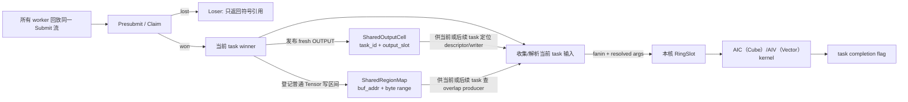
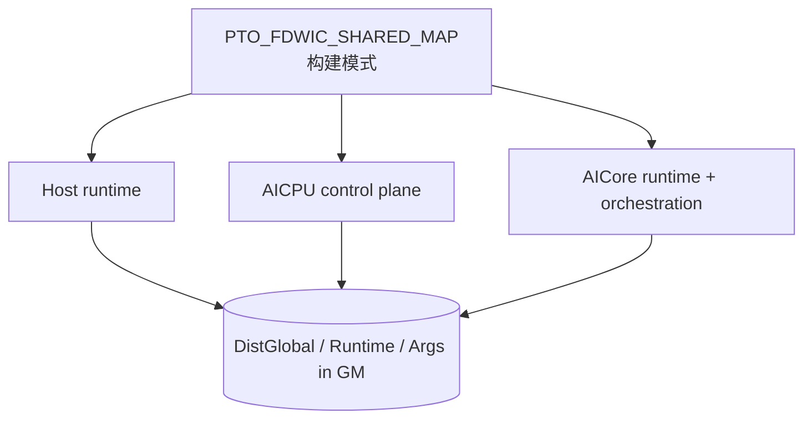
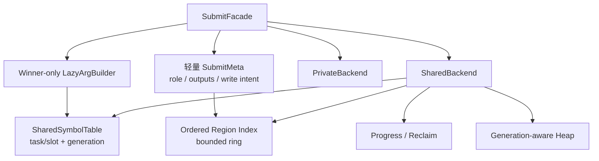

<!-- markdownlint-disable MD060 -->

# A5 FDWIC Shared TensorMap 分支架构审查记录

本文审查
[`poursoul/simpler:fdwic-shared-tensormap`](https://github.com/poursoul/simpler/tree/fdwic-shared-tensormap)
在 A5 FDWIC runtime 中实现的 shared TensorMap 方案，并与当前分支 standalone
方案比较。本文用于后续开发决策，不表示目标分支已经合入，也不把分支文档中的
实验记录自动当成当前分支的性能结论；当前分支 S0～S4.14b 的保留结果及
S4.15/S4.16 正确性成立、性能否决记录另记于第 15 节。当前有效 shared
性能基线为已撤销 S4.15a 源码的 `319077a9`，其运行行为回到
`ee42b8c1`；继续开发和验收的后端范围固定为 CPU/CCEC。

后续每个实现小步都必须先对照参考提交：可直接复用的机制要说明复用位置；
有意不同的顺序、ABI、失败语义或性能取舍要在本文记录证据和复核条件，不能只
留在代码或会话里。参考代码“基本流程已跑通”本身是正向证据；暂不照搬某项
机制只表示当前小步需要隔离变量，不表示否定其架构价值。

## 1. 审查快照与证据口径

| 项目 | 本次固定值 |
| ---- | ---------- |
| 审查日期 | 2026-07-24 |
| 目标提交 | `2866ad73b4f15a4f6fa292af5b7d546e8f972f8d` |
| 当前分支提交 | `1726a774826b20f14fbd8c8fcfb54cdbc525f49f` |
| 两分支 merge-base | `599703f5b153a3a0fd2a3516dff4efd49be3f00a` |
| shared 功能序列首提交 | `67d9d186` |
| 首提交父提交 | `f5da1a2e` |
| 重点审查差异 | `f5da1a2e..2866ad73`，42 个文件 |

目标分支和当前分支在较早位置已经分叉。若直接审查
`HEAD...poursoul/fdwic-shared-tensormap`，会把 131 个文件的两边独立演进都
误算成 shared TensorMap 改动。因此本文以 shared 功能序列的父提交
`f5da1a2e` 为功能基线，同时用当前分支
`docs/fully_distributed_within_core.md` 第 12 章校准预期协议。

本文使用四种证据标记：

- **代码事实**：可由目标提交源码直接证明；
- **本次验证**：本机执行过编译探针或 Git 检查；
- **分支记录**：目标分支文档记录的 sim、上板或性能结果，本次没有重跑；
- **审查推断**：由并发顺序和状态不变式推出，仍应由定向测试验证。

本次没有修改目标 worktree，没有重跑 A5/A5sim 全量用例，也没有复测目标分支
性能。实际执行了 private/shared 布局探针和 profile-off 头文件编译探针。

## 2. 先给结论

这份实现不是“把现有 per-core TensorMap 换成一份共享 ring”，而是一套
**性能优先的双通道依赖协议**：

1. fresh `OUTPUT` 使用 `(producer_task_id, output_slot)` 直接索引
   `SharedOutputCell`；
2. 普通 Tensor 或既有 Tensor 的重叠写依赖使用 append-only
   `SharedRegionMap`；
3. shared API 支持把 Claim 提到重参数构造之前；PA 调用点把完整参数构造放入
   `tok.won` 分支，loser 只返回符号引用。其他调用点若在 presubmit 前已经构造
   `L0TaskArgs`，并不会自动获得这部分收益。

这个方向有真实价值。尤其是 winner-first、PA loser 轻路径、fresh output 的
O(1) 符号定位、显式 DCache flush/invalidate，以及 MIX follower 由 winner
统一解析输入的基础机制，都值得复用。

但它目前还不适合作为最终 shared TensorMap 整体移植，主要阻断点是：

1. private/shared 会生成 ABI 不兼容的三镜像，但构建缓存身份没有包含模式；
2. writer intent 是调用方可选 API，真实 PA 的 INOUT 路径没有使用它；
3. shared heap、region map 和 task table 没有 generation、reclaim 和可证明的
   有界复用协议；
4. shared 模式下 `fatal_set()` 恒为 false，容量错误可能退化成永久轮询；
5. shared output 每 task 物理上限为 8，但公共接口允许构造最多 32 个输出。

因此建议是：

> 不整段 cherry-pick。先复用“winner-first + 符号引用 + 显式缓存维护”的设计
> 资产，再把构建身份、写入顺序、generation/reclaim、错误传播和容量断言补成
> 可证明的协议，最后迁移 PA。

## 3. 目标分支的实际逻辑架构

### 3.1 它是两个索引，不是一张共享 TensorMap



核心状态位于
`src/a5/runtime/fully_distributed_within_core/runtime/dist_engine/common/state.h`：

| 状态 | 组织方式 | 当前语义 |
| ---- | -------- | -------- |
| `shared_outputs[kFlagCap]` | task id 直达数组 | fresh output descriptor 与最新 writer |
| `SharedOutputCell::published[8]` | 每项独占 cacheline | descriptor 发布完成标志 |
| `SharedOutputCell::last_writer[8]` | 每项独占 cacheline | INPUT/INOUT 的 writer 链 |
| `SharedRegionMap::buckets` | 8192 个桶头 | 普通 Tensor 地址哈希 |
| `SharedRegionMap::entries` | 65536 个 append-only entry | 重叠 byte range 及 producer |
| `shared_heap_cursor[8]` | task id 分片 | winner 输出 heap 分配 |
| `tasks[kFlagCap]` | 65536 个 task cell | 完成、vend、依赖准备标志 |

因此“shared map”这个名字容易造成误解：

- fresh output 根本不进入 region map；
- region map 不是 ring，没有 per-slot `seq`，没有回收；
- task id 达到 `kFlagCap=65536` 时直接报错，不支持代际复用；
- 零输出 task 仍必须发布 task completion；它只是不需要发布
  `SharedOutputCell` 或 region delta，因为实现里没有全局 map append 前沿。

### 3.2 fresh output 快路径

producer winner 的关键顺序在
`runtime/dist_engine/aicore/submit_core.h:668-759`：

```text
reserve shared heap
  -> for each output:
       materialize Tensor descriptor
       copy descriptor to SharedOutputCell.tensors[slot]
       CCEC flush descriptor + DSB
       fetch_max(last_writer, producer_task_id)
  -> after all outputs: store_barrier
  -> for each output:
       release publish published[slot] = producer_task_id
```

在 PA 这类把参数构造放到 `tok.won` 后的调用点，loser 不构造
`TensorCreateInfo` 和完整参数，只通过 `rt_submit_loser(tok, output_count)`
返回 `FdwicOutputRef`。`shared_symbol_smoke` 和 `submit_dependency_smoke`
部分 wrapper 在 presubmit 前已有完整 `args`，不能把这项收益外推到所有调用点。
引用本身包含 `producer_task_id`、`output_slot` 和有限的一维 view 信息。

consumer winner 的行为是：

- `INPUT`：读取 `last_writer`，无有效 writer 时回退到原 producer；
- `INOUT` / `OUTPUT_EXISTING`：对 `last_writer` 做
  `atomic_exchange(current_task_id)`，返回旧 writer 作为 fanin；
- resolve：等待指定 `published[slot]`，invalidate descriptor cacheline，
  再把 Tensor descriptor 拷入执行侧 `RingSlot` 或 `BuiltSubtask`。

这里的两个目标槽只有 ABI 形状相似，resolve 时机并不相同：普通
`RingSlot` 会先 try-resolve，并允许未就绪引用留到执行前；winner follower
构造 `BuiltSubtask` 时则同步阻塞解析，当前 mask 固定为 0。

相较统一 region lookup，这条路径的优势明确：

- 索引为 O(1)，没有桶扫描；
- loser 不必等待全局 task 发布前缀；
- descriptor 身份与逻辑 writer 分开；
- producer materialize 较晚时，`fetch_max` 不会覆盖已经到达的更大 writer。

### 3.3 普通 Tensor 的 region 慢路径

普通 Tensor 的地址依赖由
`submit_core.h:854-940` 处理：

1. 按 buffer 地址选 bucket；
2. 遍历单向 entry 链；
3. 对每个 entry 做 CCEC invalidate；
4. 在重叠区间中选择 `producer < current_task_id` 的最大 producer；
5. writer 使用 `high_water.fetch_add()` 取得永久 entry；
6. 通过 bucket 的 `-2` sentinel 独占插入，再 flush entry 并发布新桶头。

它是 append-only 表，不是当前文档第 12 章描述的
ring-per-bucket：

- lookup 窗口是所有已插入的 `< N` producer，不是 `[N-H, N)`；
- 没有 `head`、generation、per-slot `seq` 或 min-progress reclaim；
- 同一 buffer 的长写链会让 bucket 扫描不断变深；
- 容量耗尽后只能 `set_fatal()`。

`insert_lock` 字段和全局 lock helper 仍存在，但实际插入使用的是每 bucket
sentinel。它目前是死字段候选；应先完成 Host/AICPU/AICore 三镜像的 ABI、
初始化和布局审计，再单独决定清理或补充用途，不能顺手删除。

### 3.4 region intent 是可选调用协议

目标分支为写依赖增加了
`rt_presubmit_*_with_region_intent()`：

```mermaid
sequenceDiagram
    participant W as task N winner
    participant L as task N losers
    participant S as shared dependency state

    L->>S: wait deps_prepared[N]
    W->>W: collect fanin
    W->>W: register writer regions
    W->>S: publish deps_prepared[N]
    S-->>L: wait released; writer intent visible
    W->>W: continue winner build
    L->>L: continue replay
```

意图是防止 task N 的 losers 在 N 的 writer 尚未登记时继续跑到 task N+1。
但该语义没有收进 runtime 的统一入口，而是由 orchestration/codegen 判断是否
调用：

- `submit_dependency_smoke` 的 wrapper 会扫描参数 tag 并选择 intent API；
- PA 的 QK/SF/PV/Update 都调用普通 `rt_presubmit_*`；
- PA Update 甚至在 presubmit 之后、且仅在 winner 分支内才构造四个 INOUT。

这意味着 PA 无法在 Claim 前依据尚未构造的参数发布 writer intent。目标分支
计划文档也承认该能力仍依赖 codegen 显式接入。

### 3.5 MIX/joint 路径

最新代码已补上一部分 shared MIX 基础机制：

1. anchor winner 先收集 fanin 并 resolve shared descriptor；
2. fanin ready 后才发布 follower 的 `BuiltSubtask`；
3. follower 直接消费 winner 已解析的 payload，shared follower fanin 清零；
4. `joint_launch_expected/drained` 防止最终退出早于迟到的 follower launch；
5. 所有参与 lane 完成后仍只发布一个 task completion。

`0f9862a2` 和 `d618589f` 修正了 winner 侧 shared-ref resolve 以及
launch/drain 门控，但还不能称为完整闭环。目标分支文档仍列有 MIX output
publisher、MIX INOUT/OUTPUT_EXISTING、连续 MIX、容量/反压和完整 stress
缺口。准确结论是：基础 handoff 已存在，部分关键路径已修正，通用语义和压力
验证仍未完成。

### 3.6 初始化和运行生命周期

主要生命周期路径已经接通：

- host 在 runtime 创建/setup 路径预留并清零固定 runtime arena；
- AICPU register 重置 cursor、task cell、shared output flag、region bucket、
  heap cursor、joint counter、fatal 和 replay 状态；
- AICore attach 重置本核 slot/counter；
- AICPU 唤醒 worker 前 flush runtime arena；
- executor 结束后复位控制状态。

每轮 executor 正确性应依赖 AICPU 对 publication flag、bucket、high-water 等
控制状态的复位，不能依赖“每轮一定重新执行 host 全量 memset”。陈旧
descriptor/entry 本体没有逐项清零，但控制状态复位后，正常路径不会在重新发布
前消费它们。error、容量耗尽和跨代复用生命周期仍没有闭环。

非 Submit 热区有一个明显成本：AICPU 每轮会 flush 固定 1056 MiB
（约 1.1 GB）的 `dist_global` arena。它不应混进约 5 ms Submit 指标，但会
影响 case 启动时间。

## 4. 开发视图与构建边界

### 4.1 三镜像必须是同一模式

A5 FDWIC 是三个独立程序共同解释 GM ABI：



宏默认值为 0，位于 `runtime/pto_types.h:69-71`。clean build 时，
环境变量 `CXXFLAGS=-DPTO_FDWIC_SHARED_MAP=1` 原则上能传播到：

- direct sim/host/orchestration 编译；
- A5 onboard AICore 的 CCEC 自定义命令；
- AICPU 和 runtime CMake target。

但它仍只是 ambient `CXXFLAGS`，不是显式的 runtime variant。任何一个镜像
漏掉宏，都将用不同字段偏移解释同一块 GM。

### 4.2 private/shared ABI 实测

本次用目标提交真实头文件编译了两个布局探针：

| 类型或字段 | private | shared |
| ---------- | ------: | -----: |
| `TensorRef` | 16 B | 24 B |
| `L0TaskArgs` | 1,024 B | 1,280 B |
| `L2TaskArgs` | 3,840 B | 4,864 B |
| `RingSlot` | 4,864 B | 5,440 B |
| `DistCore` | 9,231,488 B | 8,464,832 B |
| `DistGlobal` | 1,007,102,208 B | 1,080,630,976 B |
| `Runtime` | 69,952 B | 70,976 B |
| `DistCore::slots` 偏移 | 823,424 | 64 |
| `DistGlobal::heap_base` 偏移 | 4,197,504 | 143,176,000 |
| `DistGlobal::cores` 偏移 | 10,101,504 | 166,429,120 |

变化来自：

- shared 的 `kPrivateSlots` 从 4 增至 14；
- shared 移除 `DistCore::map`；
- shared 在 `DistGlobal` 中插入约 128 MiB output table、region map、heap
  和 joint 状态；
- `TensorRef` union 增加 `FdwicOutputRef`。

固定 arena `0x42000000` 只保证两种布局各自不越界，不表示 ABI 相同。若把当前
private map 和 shared 状态机械组成一个 superset，估算会比现有 arena 多约
62.3 MiB，因此“直接保留两套所有字段”并不是合理修法。

更合适的结构是固定小型控制头：

```text
DistRuntimeHeader {
    magic
    abi_version
    map_mode
    profile_mode
    state_size
    backend_state_ptr
}

backend_state_ptr -> PrivateBackendState 或 SharedBackendState
```

或者把两种模式作为完全独立、带 mode/ABI tag 的 artifact family。两种办法都
比当前“字段偏移变化但无握手”可靠。

### 4.3 构建缓存会制造混合镜像

`simpler_setup/runtime_builder.py:307-329` 的 baseline runtime 缓存 stamp
只有 Git HEAD，输出目录也不包含 shared/profile 模式。与此同时，
per-callable AICore stale state 已包含 `CXXFLAGS`。

因此同一 commit 下先编 private、再改 `CXXFLAGS` 编 shared 时，可能出现：

```text
baseline Host/AICPU = 旧 private artifact
per-callable AICore = 新 shared artifact
```

目标分支文档要求切模式前手工删除
`build/cache/a5/{sim,onboard}`，正说明当前构建身份不完整。手工清缓存可以帮助
实验，但不能成为架构正确性条件。

### 4.4 profile 与 map 模式当前不正交

本次对以下两个组合做了头文件编译：

- `PTO_FDWIC_SHARED_MAP=0, PTO2_PROFILING=0`；
- `PTO_FDWIC_SHARED_MAP=1, PTO2_PROFILING=0`。

两者都在 `pto_types.h:906-908` 失败，`L0TaskArgs` 和 L2 Arg 对 64 取模均为
32。原因是 `DumpArgSelection` 被条件编译去除后，固定 padding 没有同步调整。

这与 `docs/profiling_levels.md` 给出的 profile-off 构建方式不一致，也说明
测试矩阵没有覆盖 `{private, shared} × {profile on, off}`。

## 5. 与预期架构的逐项比较

这里的“预期”由两部分组成：

1. 用户要求：以宏保留 private/shared 双模式，先保证 private 基线；
2. 当前 `docs/fully_distributed_within_core.md:1272-2068` 的协议约束：
   task-order 发布、`[N-H,N)` 查找、generation、progress/reclaim 和有界反压。

| 维度 | 原预期 | 目标分支实际实现 | 评价 |
| ---- | ------ | ---------------- | ---- |
| 默认模式 | private | 宏默认 0 | 符合 |
| 切换方式 | 明确构建模式 | ambient `CXXFLAGS` | 形式符合，工程不完整 |
| 上层 API | facade 内切后端 | public 返回类型和 submit 协议都变化 | 差异较大 |
| loser 路径 | 尽量轻 | API 支持；PA 做到 winner-only 构参 | PA 路径优于朴素预期 |
| fresh output | 可走快路径 | task/slot 直达表 | 值得保留 |
| 普通区域依赖 | 统一有界 ring | append-only bucket 链 | 不符合 |
| writer 顺序 | runtime 自动保证 task order | 可选 intent API | 不符合 |
| 发布前沿 | 零 entry task 也推进 | 没有全局 map 前沿 | 架构不同 |
| lookup 窗口 | `[N-H,N)` | 所有已发布且 `<N` 的 entry | 不符合 |
| generation/reuse | per-slot seq | 以 65536 task 硬上限规避 | 不符合 |
| reclaim | min progress 驱动 | region/output table 不回收 | 不符合 |
| heap 复用 | generation + 有界反压 | shard cursor + task frontier | 证明不足 |
| cache 可见性 | 显式 flush/invalidate | descriptor/region 已实现 | 基本符合 |
| MIX | winner 发布、follower 消费 | resolve/launch 基础机制已实现 | 部分符合，尚未闭环 |
| ABI | 稳定头或明确隔离 | 两套布局、无 mode 握手 | 不符合 |
| profile 正交 | 四组合可构建 | profile-off 两模式均失败 | 不符合 |
| A5/A5sim | 同一模式定义 | clean build 可传播，路径不同 | 部分符合 |

### 5.1 哪些差异是合理取舍

不能因为它不等于统一 ring，就把所有差异都判为错误：

- PA 的 fresh output 占主路径，用符号直达表避开 region 扫描是合理的分层；
- Claim 前移使调用点可以消掉 loser 参数构造；PA 已这样使用，但 runtime
  不会自动改写 presubmit 前已经构造的 `args`；
- descriptor identity 与 `last_writer` 分离，适合表达 fresh output 的后续 INOUT；
- 编译期产生两套后端也可以接受，前提是 artifact identity 和 ABI tag 完整；
- 零输出 task 仍发布 completion，但在直达表中无需发布空 map delta，这是
  该结构自然得出的结论。

原先“一个巨大稳定 superset ABI”的设想也应修正：实测尺寸表明机械 superset
会突破当前 arena。应追求的是**稳定控制 ABI + 模式后端隔离**，不是所有数据
字段永远同时驻留。

### 5.2 哪些差异不能只解释成性能取舍

以下内容会改变正确性或构建确定性，不能用“PA 当前能跑”代替协议证明：

- writer task 到达顺序与 `atomic_exchange(last_writer)` 顺序不一致；
- heap 物理区间复用没有 generation；
- region map 永久增长；
- shared fatal 无法被等待方观察；
- build cache 可能混合 private/shared 镜像；
- 公共 output_count 与物理数组上限不一致。

## 6. 正确性与可维护性风险

### 6.1 P0：移植前必须解决

#### P0-1 构建模式未进入 artifact 身份

三镜像 ABI 不同，但 baseline cache key、输出目录和 runtime 握手都没有
shared/profile 维度。错误组合不会明确失败，而会读写错误偏移。

**建议**：先把 mode/profile 加入所有 cache key、输出目录和 ABI header，再做
任何 runtime 移植。

#### P0-2 PA 绕过 writer-intent 顺序

shared ref writer 使用无条件
`atomic_exchange(last_writer, current_task_id)`。假设后 task M 的 winner 先于
前 task N 到达：

```text
M exchange: last_writer = M，返回旧 producer
N exchange: last_writer = N，返回 M
```

N 会依赖“未来”的 M，writer 链也被较小 task id 覆盖。producer 的
`fetch_max` 只防止 producer 晚 materialize 覆盖更晚 writer，不能解决
writer-vs-writer 的乱序。

pure INPUT 还有同源风险：它直接读取当前 `last_writer`，没有
`writer < current_task_id` 过滤，也没有历史版本。若未来 writer M 先更新，
较早 reader N 可能直接依赖未来 M，而不是 N 时刻应看到的前一 writer。

普通 region 也有同类窗口：后 task lookup 时，较早 writer 的 entry 可能尚未
insert，`producer < N` 过滤无法补回不存在的历史项。

PA Update 使用普通 presubmit，且只有 winner 才在 Claim 后构造 INOUT 参数，
所以现有 intent barrier 没有参与 PA。这个问题需要定向交错测试，不应由普通
golden 多次通过来推翻。

#### P0-3 启用 shared heap wrap 时缺少可证明复用条件

heap 按 `task_id % 8` 选 shard，再用 `fetch_add` 分配。cursor 第一圈之后仅等待
`frontier >= task_id-H`，但没有记录即将覆盖的物理区间属于哪个 task/generation。

winner materialize 顺序可以和 task id 顺序不同，因此“当前 task 已跨 H 窗口”
不能直接证明该物理区间的上一任已经无人引用。当前只检查单 task 输出不超过
shard span，也没有证明 H 窗口内同 shard 累计 live bytes 一定装得下。

对“启用 wrap 或长期复用”的实现，这是移植前 P0。若第一阶段明确禁止 wrap，
并在容量边界可靠终止，则该项可以降为通用化前 P1，但不能在没有 generation
证明时悄悄复用。

#### P0-4 fatal 写入后等待方仍看不到

`runtime_state.h:40-47` 在 shared 模式下让 `fatal_set()` 固定返回 false，而
`set_fatal()` 仍写 `g_dist.fatal`。task cap、region cap、heap retry 或 resolve
错误发生后，其他核可能继续轮询，无法可靠结束。

#### P0-5 输出上限 8 与接口上限 32 不一致

`SharedOutputCell` 的三个数组长度都是 8，但：

- `SharedTaskOutputs::add_output_ref()` 只检查 `MAX_TENSOR_ARGS`；
- `rt_count_outputs()` 可以返回大于 8；
- materialize 按实际 output ordinal 直接索引 shared cell。

第 9 个 output 起可能越界，且发生在后续 resolve 的 8 上限断言之前。

### 6.2 P1：通用化前补齐

| 风险 | 代码事实或待证点 | 建议验证 |
| ---- | ---------------- | -------- |
| task/region 容量 | task 上限 65536；region 是 65536 entry，不是 65536 task | 多区域 task 的 cap 边界 |
| external RAW | owner 无效的 external pure INPUT 确定跳过 region lookup | 查 API 禁令；无禁令则补 RAW |
| region 合并读 | lookup 只返回一个最大 producer，可能漏掉另一不重叠 writer | 两 writer + 横跨两区 reader |
| fanin 截断 | 第 17 个不同 producer 被静默丢弃 | 17 producer golden + 明确报错 |
| scalar data access | shared 下 `get/set_tensor_data` 不等待 producer | orchestration 读取前 task scalar |
| generic submit | shared 的 `dist_submit_impl()` 直接 assert | 建立统一 facade 或编译期禁用 |
| dummy submit | dummy 不分配 task id、依赖或 completion | 明确其 shared 语义 |
| view | `FdwicOutputRef::view()` 只允许 1D | 多维/嵌套 view |
| view 并行度 | `last_writer` 粒度为整个 output slot，不区分不重叠子 view | 两子 view 并行写的依赖图 |
| atomic 顺序 | CCEC wrapper 丢弃 `memorder` 参数 | 查 A5 ISA 文档并做微基准 |
| initial value | 写输出 data 后未见同等级显式 data flush | 上板 producer/consumer 可见性测试 |

external RAW 的代码行为已经明确：owner 无效的 external pure INPUT 会跳过
region lookup。待证的是公共 API 是否明确禁止“external Tensor 先作为 INOUT，
后作为 pure INPUT”。若没有该禁令，这就是语义缺口，不只是测试不足。

region map 还有一个独立的表达能力问题：假设 task A、B 分别写同一 buffer 的
两个不重叠子区，task C 再读取横跨两区的范围；如果 A、B 之间没有传递依赖，
lookup 只返回最大 producer B，不能保证 C 同时等待 A。应在决定 region 数据
结构前先用定向 golden 固定“一个读取区间是否允许需要多个 producer”的语义。

shared-ref view 则偏向保守：`last_writer` 的粒度是整个
`(producer_task_id, output_slot)`，两个不重叠一维子 view 的写也会串在同一
writer 链上。它通常不破坏结果，但会比普通 region byte-range 语义损失并行度。

### 6.3 P2：性能和工程清理

- `SharedRegionMap` 同桶链越长，lookup 的 invalidate + DSB 次数越多；
- shared 模式把私有 slot 从 4 增到 14，`drain_phase_b()` 的扫描地板上升；
- cursor 分片减少相邻 task 的 cacheline 冲突，但同一 task 的所有候选仍竞争
  一个 atomic；
- 同一个 shared ref 重复出现时，descriptor resolve/invalidate 可能重复；
- shared heap 同时付出 shard cursor 和全局 vend 两次原子更新；
- 1056 MiB runtime arena 的全量 reset/flush 影响启动；
- `worker_state.h` 中巨大的 fallback `DistGlobal` 会增加 BSS/虚拟地址压力；
- 宏分散在 runtime API、state 和多个业务 orchestration 中，后续维护成本高。

## 7. 性能证据应该怎样解读

目标分支文档记录：

- shared PA Case1 上板生成过
  `outputs/TestPagedAttentionUnroll_Case1_20260723_150651/merged_swimlane.json`；
- 脚本记录的 `global_span_us` 为 `2285.352 us`；
- 按需 EfDrain 前后约为 `2.540 ms -> 2.318 ms`；
- 错误的全局 prefix 退出方案曾把约 `2.3 ms` 劣化到约 `7.2 ms`。

这些是**分支记录**，不是本次验证。目标分支没有提交对应 raw/swimlane artifact，
所以本次无法重新计算事件数、统计窗口和 instrumentation 开销。

它也不能直接与当前分支约 5 ms 的 PA 基线相减，原因包括：

- 两分支从较早提交分叉，runtime 和 PA orchestration 不同；
- target 使用 winner-first shared API，当前基线仍有另一套观察代码；
- 目标脚本的 `global_span_us` 是所有 `ph == "X"` 事件的最早开始到最晚结束，
  不是严格的“首个 Submit 入口到最后一个 Submit 返回”；
- 目标数字来自带 L2 swimlane 的 shared ELF，不能与当前 perf-clock、普通
  swimlane 或 atomic-swimlane ELF 互减；
- 目标记录缺少可复算 raw 证据。

合理表述只能是：

> 目标分支记录表明该结构有较强性能潜力，尤其 loser 轻路径已经改变了复杂度；
> 但不能据此宣称相对当前 5 ms 基线获得确定百分比收益。

目标提交的多个 commit message 还分别记录了 `2285.352`、`2299.227`、
`2330.192` 和 `2293.923 us`。这些是不同提交的单次作者记录，不是同一版本的
重复样本，不能据此计算 median、min/max 或置信区间。

时钟口径也不能混用：目标泳道的 SYS_CNT raw tick 为 1 ns，换算基准为
1 GHz；这不是 scalar core 主频。约 1.65 GHz 是本机校准得到的 PMU cycle
频率。converter 已按 raw metadata 换算 SYS_CNT，不能再用 1.65 GHz 对目标
分支的 2.3 ms 做二次缩放。

迁移时仍应固定三条互不混算的证据链：

1. `perf-clock`：决定候选保留或撤销；
2. `swimlane`：解释业务区域和 atomic 变化；
3. `submit-pmu`：辅助解释 scalar busy、I-cache request/miss。

三种 ELF 只做同类前后对照，不能跨构建直接相减。

## 8. 测试证据与证明边界

### 8.1 已有覆盖

| 测试 | 数量/平台 | 主要覆盖 |
| ---- | --------- | -------- |
| `shared_symbol_smoke` | 11 例：7 个 sim-only、4 个 manual A5 | AIC/AIV 跨角色、双输出 slot1、heap shard、dual AIV |
| `submit_dependency_smoke` | 84 例：38 sim、45 A5、1 双平台；46 manual | INOUT、overlap/view、alloc、heap、DCCI、长链 |
| `simple_orch_smoke` | 24 例：12 个 sim-only、12 个 A5-only；14 个 manual | joint、WonSlot、基础 orchestration |
| `benchmark_bgemm` | 7 例；当前只算 private/default 相关基线 | orchestration 未适配 shared 新 API，不能算 shared 覆盖 |
| PA | 3 例均声明双平台；Case2/3 为 manual | 真实业务 golden；Case1 是分支性能工作负载 |

前三类 smoke 和 PA 调用生产 runtime，不是脱离实现的模型测试，这是优点。
`benchmark_bgemm` 仍直接使用 shared 宏下不存在的旧 submit API，当前只能列作
private/default 相关工作负载，不能包装成 shared 集成证据。

### 8.2 当前证据仍不能证明什么

1. Python case 没有设置或断言 `PTO_FDWIC_SHARED_MAP=1`。宏默认 0，
   `shared_symbol_smoke` 还有 private fallback；测试名字本身不能证明产物是
   shared build。
2. 可信的 shared 结果依赖外部 `CXXFLAGS` 和手工 clean cache。
3. 许多 A5 case 标记为 manual；默认 CI 不等于执行了硬件矩阵。
4. delayed region intent 的 mode 32/33 只有 sim，没有对应 A5 case。
5. sim 不能证明 A5 非一致缓存、DCCI/DSB 和原子竞争语义。
6. 没有生产协议的确定性交错单测，也没有负向容量测试。

至少还缺：

- 9 个 output；
- 17 个不同 fanin；
- task/region cap 边界；
- heap shard 多次 wrap；
- stale generation ref；
- writer task 逆序到达；
- reader task 与未来 writer 逆序到达；
- 两个独立 writer 后的合并区域 reader；
- external INOUT 后 pure INPUT；
- fatal 后所有核有限时间退出；
- shared/profile 四组合构建；
- private/shared 镜像 mode 不一致时的显式拒绝。

## 9. 目标分支文档自身的一致性

两份设计文档各有价值：

- `high_perf_shared_map_plan.md` 较准确地记录了 winner-first 目标、手工 clean
  cache、task cap 和 intent 仍依赖 codegen 等限制；
- `current_shared_map_runtime_design.md` 对数据结构和性能演进写得很完整。

但后者不能完全作为最新代码真相：

- 开头称 MIX 未闭环的总判断仍成立；最新两个提交缩小了 follower
  resolve/launch 方面的具体缺口，但没有完成通用 MIX 语义；
- 第 9 部分引用的一批短 commit id 在当前目标提交对象库中不存在，可能来自
  rebase 前历史，无法直接追溯；
- 文档对 `last_writer` 的顺序解释默认了 writer 按 task id 到达，没有覆盖 PA
  绕过 intent 的实际调用方式；
- 性能数字只有文字记录，没有随分支提交 raw artifact。

后续开发文档应固定“代码提交 + 原始证据目录 + 生成命令”，避免设计说明和实际
分支继续漂移。

## 10. 建议的目标架构

建议保留双通道思想，但把它放入一个有统一正确性底座的结构：



关键设计点：

1. **统一 facade**：业务代码不直接散布 private/shared 的返回类型和流程宏。
2. **轻量元数据与重参数分离**：Claim 前能获得 role、output_count 和写意图，
   winner 后才构造完整 `L0TaskArgs`。
3. **fresh symbol 作为优化层**：继续保留 O(1) task/slot 定位；完整 resolve
   仍可能等待 published，并执行 invalidate、DSB 和 descriptor copy。
4. **writer 顺序由 runtime 保证**：不能让调用方选择是否正确。
5. **有界 region backend**：使用 task-order delta + per-slot generation，
   或另一套能证明 writer 全序的协议。
6. **统一 progress/reclaim**：region、symbol generation、heap 复用共享同一组
   可证明的活跃窗口约束。
7. **稳定控制 ABI**：mode/version/size 可在 Host、AICPU、AICore 启动时互检。

writer intent 的实现需要在开发前明确二选一：

- **方案 A，推荐**：轻量 `SubmitMeta` 在 Claim 前表达写集合，由 runtime 按
  task id 发布 dependency delta；零 delta 也推进 sequencer。
- **方案 B**：设计 per-object 的有序 writer CAS/版本协议，证明乱序 winner
  最终仍形成 task-id 顺序。

当前无条件 `atomic_exchange(last_writer)` 加可选 intent barrier 不能作为最终
方案。

## 11. 分阶段移植计划

每一阶段独立提交，上一阶段验证通过后再进入下一阶段。实施顺序固定为：

> 先在 `tests/atomic_probe/pa_scheduler` 完整证明，再迁移到
> `src/a5/runtime/fully_distributed_within_core` 和真实 PA。standalone 尚未
> 闭环时，不允许用“顺便对接真实路径”扩大修改面。

### 阶段 S0：standalone 构建身份和 ABI

**状态：已完成；当时的临时 shared fail-closed 门禁已在 S2 删除。**

- `run.sh` 增加 first-class `--tensormap private|shared`，默认 private；
- CCEC、AscendC、CPU 构建都显式传
  `PTO_FDWIC_SHARED_MAP=0/1`，产物目录包含 backend、mode 和诊断 variant；
- CCEC host、AIC/AIV、callback runtime、callback finish 必须属于同一模式；
- `RunConfig` 使用原有尾部空间保存 magic/version/mode/`sizeof(SchedulerState)`；
- CCEC swimlane、submit-pmu manifest 都记录模式并校验整套产物；
- 修复 PMU 配置使用 `reserved[4]` 越过 `RunConfig`、覆盖
  `WinnerWorkloadConfig::mode` 的问题，改为独立 cache-line sidecar。

**Gate**：默认 private 的 CPU b1 全断言不变；脚本语法检查通过；S0 当时
shared backend 尚未接入，必须在编译期明确失败；故意混用模式或校验和必须在
启动前失败。S2 接入真实 shared sidecar 后只删除临时 fail-closed，模式隔离和
混用拒绝继续保留。

### 阶段 S1：standalone private map 先同构为 ring

**状态：已完成。**

- 保持 `TensorMap=823312 B`、`WorkerState=9231296 B`，并保持 standalone
  private DistCore 中 map、ring slot 和 payload 的既有 size/offset；
- 把 private linked map 改为 128 buckets × 128 slots 的
  ring-per-bucket，总 entry 容量仍为 16,384；
- `MapEntry` 保持 48 B，后 16 B 只作 ABI 保留，本阶段不引入 shared seq；
- private 仍然每 worker 独占，不引入 atomic，不同时改构参、heap 或输出引用；
- 每桶 `head/tail` 为普通 `uint64_t`；`AdvanceTensorMap` 用逐 task 精确计数
  推进 logical live window，`RetireBucket` 在该桶下一次 lookup/insert 时
  惰性推进物理 head；
- lookup 扫描全部合法槽并取最大 producer，保留
  `producer >= alive_floor` 边界；
- 用统一的逻辑记录 `(buffer_addr, lo, hi, producer)` 作为后续
  private/shared 对比口径；
- insert/register 逐层返回 bool；满桶不覆写、不推进 tail，由 Submit 发布
  fatal，禁止静默漏依赖。

**Gate**：逐 task fanin 与旧 private 一致；Case1 保持每 batch 5 条 fanin、
每 worker 每 batch 4 次 region insert；定向覆盖窗口边界、同地址区间重叠、
retire、容量耗尽和复用；容量不足必须显式失败，不能静默漏依赖。当前这些
检查均已通过，详细验证记录见第 15 节。

### 阶段 S2：standalone shared 有序 ring

**状态：已完成全核强一致正确性基线；其性能问题已由后续 S2.5 定向处理。**

第一版 shared 只切换 map 的副本数、写入主体和并发纪律，暂时保留 eager 构参和
每核 private heap，避免在一个提交里同时改三个协议面：

- 在完整 production prefix、standalone controls 和 `results` 后追加 64B 对齐、
  2,119,808 bytes 的 shared sidecar，不移动 WorkerState 或既有控制/结果 offset；
- sidecar 保存连续 task commit 前沿、全局 reclaim 前沿、96 条每核 progress、
  128 组分离 cache line 的 head/tail 和 16,384 个共享槽；
- shared 只有 winner 追加 region，零 insert task 也必须提交空 delta；这里的
  winner-only 不包括构参和 Materialize，它们在 S2 仍由所有 worker eager 执行；
- task N lookup 前所有 worker 必须观察到前 N 个 task 连续 commit；winner 完成
  整 task append 后发布 N+1，loser 等待 N+1，随后所有 worker 精确发布 progress=N；
- lookup 只接受 `producer ∈ [max(0, N-H), N)`；
- slot 的 payload 和绝对 `seq` 各占一条 cache line。writer 先失效旧 seq，
  写 payload 并 DCache flush，再发布 seq/tail；reader 原子读 seq、invalidate
  payload、拷贝快照、再次原子读 seq，双检失败即协议错误；
- reclaim 由 `min(core_progress)-H-1` 单调推动；
- 整 task 在任何写入前完成容量预检，普通容量不足保持 all-or-nothing；
  overflow/fatal 对所有等待者可见，等待路径带 watchdog，并可协作 drain；
- host D2H 后独立验证 commit/progress、bucket cursor、seq/payload/hash、
  producer 和最终逻辑窗口，不依赖 device 汇总计数自证。

**Gate**：每 task 恰好一次 commit，最终 sequencer 等于 task_count；逆序 winner、
慢核 progress、零 entry task、seq wrap、future/stale 过滤、tiny-cap overflow
全部通过；private/shared 的规范化 logical-map signature 和全局 dependency
signature 一致。CPU b1/b256 与 CCEC A5 b1/b256 已通过该 Gate；详细证据和
性能边界见第 15 节。

### 阶段 S2.5：ordered-winner reclaim

**状态：已完成 CPU/CCEC b1/b256 闭环；后续实现按当前开发范围不再以
AscendC 为阶段出口。**

S2.5 只改变 sequencer 与 reclaim，不提前混入 fresh symbol、winner-only
Materialize 或 shared heap：

- 只有 task N 的 winner 等待 `committed_tasks == N` 并读取 shared map；
  loser 不再等待 N/N+1，也不发布 per-core progress；
- winner 完成本 task lookup 后，以当前 exact turn 推导
  `reclaim_upto=max(-1,N-H-1)`；因此 sidecar 删除 96 条 progress line，
  从 2,119,808 bytes 缩减为 2,113,664 bytes；
- reclaim refresh 首先验证 exact turn，陈旧、未来或试图回退 reclaim 的
  actor 在任何共享写入前失败；
- 整 task preflight 后若仍容量不足，立即 fatal。当前 turn 的可回收边界
  已经固定，不再等待不可能扩大该边界的慢核进度；
- 零 entry task 仍由唯一 winner 推进 commit 和 reclaim，保证 task-order
  sequencer 连续。

**Gate**：b256 精确达到 `committed_tasks=1280`、
`reclaim_upto=1214`、1,024 次 append、52 条逻辑 live entry；依赖签名
`b7d985d6edb07078` 与逻辑 map 签名 `556bec7ec8d0f323` 均保持不变。
定向测试覆盖 ordered reclaim 边界、逆序 actor、零 entry、三圈绝对 seq、
满桶及“回收 stale 后仍满”的 all-or-nothing。验证和性能数据见第 15 节。

### 阶段 S3：standalone fresh symbol 与 winner-only

S3 继续拆成两个独立提交，不能同时改变引用 ABI 和分配主体。

**S3.1 状态：已完成 CPU/CCEC b1/b256 闭环。**

S3.1 已按参考实现接入 16B `FdwicOutputRef`、8B
`SharedTaskOutputs` 和每 task 2,048B 的 `SharedOutputCell`：

- 本小步仍保留所有 worker 构参和 Materialize，只有 winner 把 8 类 fresh
  output descriptor 发布到 shared cell；
- symbol resolver 只接收 plain ref；INPUT 读取 `last_writer`，三个 Alloc
  INOUT 以返回旧值的 Exchange 声明当前 writer；
- symbol 与 `manual_dep=true` 的 output view 都跳过 region lookup/register，
  因而 Case1 shared region insert 已从 4/batch 精确变成 0；
- 仍保留 S2.5 ordered winner turn，避免把当前 Case1 的单 writer 事实误推广成
  任意多个 INOUT writer 都可乱序。

**S3.1 Gate**：b1/b256 fresh descriptor 发布为 8/2,048，symbol INPUT
load 为 5/1,280，symbol INOUT Exchange 为 3/768，region insert 为 0/0，
fanin 仍为 5/1,280；依赖边和规范化 writer 签名保持与 private 一致。
CPU private/shared b1/b256、定向 sanitizer、Python 100 项和 CCEC
private/shared b1/b256 均通过。此步没有引入 generation、deferred resolve、
shared heap 或 winner-only Materialize；详细结果见第 15 节。

以上是 S3.1 当时的实现与门禁，不是当前协议。S4.5 已把 symbol 解析改成
只读，把 INOUT writer 更新移动到本地执行状态成功建立之后，并用返回旧值的
FetchMax 做构建后提交；当前统计名也已改为 `inout_writer_commits`。

**S3.2 状态：S3.2a shared heap/winner-only Materialize 与 S3.2b
winner-only 重构参均已分别完成 CPU/CCEC 闭环。**

S3.2 继续拆开验证分配主体与构参主体。第一小步只把 Materialize 和堆分配
收敛到 winner，所有 worker 仍保持 S3.1 的 eager 构参；第二小步再把
QK/SF/PV/UP 的重参数构造收敛到 winner，Alloc 保留全核轻参数路径。
shared heap 首版使用 8 shard 绝对递增分配，默认 b256 每 shard 需求
25,821,184B，小于 32MiB shard span；临近 wrap 时显式失败，不能用尚未
证明的 generation 覆盖旧 descriptor。

**S3.2a Gate**：private 工作量计数保持原值；shared 全局 Materialize output
从 b1/b256 的 768/196,608 精确降为 8/2,048，shared heap vend 为
806,912/206,569,472 bytes，region insert 保持 0；CPU 定向测试和 CCEC
A5 b1 当前最终 ELF 已通过；CCEC b256 的规模证据在非法输入预检加固前已
通过，最终 ELF 按后续只跑 b1 的约定没有重复消耗上板时间。

**S3.2b Gate**：shared 的 Alloc 仍保留全员 3 个静态 Output 参数，
QK/SF/PV/UP 的 reset、view/CreateInfo、tensor/scalar 添加只由 winner
执行。全局每 batch 精确闭合为 307 tensor args、9 scalar args、4 reset、
2 view、2 dynamic CreateInfo；Materialize 仍为 8 个 output。CPU guard-page
锁定公共 split-finish loser 路径不访问上一 task 的陈旧 args；CCEC 侧
另由 winner 分支源码审计和 b1 集成回归取证。CCEC split private/shared
均完成编译，shared split 与 inline Materialize/Register 分别通过 b1
运行门禁。

### 阶段 S4：standalone CPU/CCEC 验收

- CPU 用于确定性交错、ABA、容量和逻辑 differential 测试，不作为 A5 性能证据；
- CCEC 先做 b1 正确性和泳道，再做一次 b256 阶段出口验证；
- 性能继续分开使用 `perf-clock`、`swimlane`、`submit-pmu` 三条证据链；
- 新增等待轮询使用聚合记录，不能把约 300 MiB raw 继续无界放大。

**Gate**：private/shared 产生同一 PA Case1 task/fanin/kernel/completion 拓扑，
shared 没有 future/stale 依赖、silent overflow 或永久等待；同构 `perf-clock`
结果达到可迁移标准。目标分支的 2.3 ms 只作为潜力参考，不作验收阈值。

#### S4.1 独立 `perf-clock` 证据链

2026-07-24 先补齐了此前缺失的 standalone 低扰动性能构建。它不是在
swimlane ELF 上运行时传 `--no-swimlane`：后者仍会保留各阶段
`TraceTimestamp` 和 atomic 包围计时。新变体使用独立
`PA_BUILD_PERF_CLOCK=1`，并在编译期统一消去：

- 普通阶段记录、PollBatch、atomic 开始/结束时间及返回依赖观察；
- phase-profile 累计；
- submit-PMU counter reader 与 owner；
- Kernel/Commit、startup/final lifecycle 和 ClockBaseline 计时。

首个 Submit 在 `BeginCallbackSubmit()` 已确定 task 0 后、EfDrain 前调用
专用 `PerfClockNow()`；末个 Submit 在 register/winner 或 loser 尾动作、
`submits++` 之后、返回前调用第二次。结果继续复用既有
`WorkerResult::submit_begin/submit_end/submits`，没有扩大 trace buffer 或
增加逐 Submit 记录。S4.1 当时的 shared exact-turn 与 startup 屏障都保留
时间 watchdog；S4.6 已删除前者，当前只剩 per-slot symbol 等实际等待和
startup 屏障使用同类 watchdog。每个等待窗口先读取一次超时起点，之后每
1024 次未完成轮询复查一次。它是正确性超时，不属于新增性能观察，因而只声称
“每核两个专用性能边界”，不声称最终 ELF 物理上只会读取两次系统时钟。

构建身份 ABI 从 3 升到 4，并复用 `PmuProbeConfig` 的一个保留槽加入
`swimlane=1 / submit-pmu=2 / perf-clock=3` 握手。这样即使绕过
`run.sh` 和 manifest，host/kernel 变体不一致也会在解释 worker 状态前
fail-closed。CCEC perf-clock 保持现有 split-finish 形状，只生成
host/kernel 两件套；最终 ELF 不得含 `WritePollBatchRecordRaw`，也不放置
会改变后续热函数 I-cache 对齐的可执行 marker。CPU 使用独立产物目录，并逐线程断言专用
性能时钟恰好调用 2 次、全局共 192 次；CPU 仍不作为 A5 性能证据。

本小步先按既定规则只做 b1 门禁：

| 门禁 | 结果 |
| --- | --- |
| CPU private/shared perf-clock 严格构建 | 系统 g++ 13.3.0 下全部独立自测 PASS |
| CPU private/shared b1 real-compute | 96 核、每核 5 Submit、专用读钟 192/192、全部语义与数值断言 PASS |
| CCEC private/shared mixed ELF | split caller/runtime/finish、无 trace writer、LOCAL helper、无残留 relocation、manifest 全部 PASS |
| CCEC private b1 real-compute | 最终代码全部断言 PASS；单个结构样本 `66.620 us` |
| CCEC shared b1 real-compute | 最终代码全部断言 PASS；单个结构样本 `81.714 us` |
| 既有普通构建回归 | CPU private 与 CCEC private swimlane b1 全部断言 PASS |
| 既有 submit-PMU 回归 | CCEC private `none` 构建、96 核身份/窗口、PMU 清理与 b1 语义全部 PASS |
| 变体交叉运行负向门禁 | perf-clock host 搭配 swimlane kernel 被 ABI4 `build_variant` 握手拒绝 |

两个 CCEC 数值来自不同 ELF 的各一个独立 b1 进程，只证明边界和产物可用，
不能据此判断 shared 快慢。正式性能结论仍需冻结两份 perf-clock ELF 后做
平衡顺序的 b256 private/shared 配对；swimlane 与 submit-PMU 只负责解释，
不得和 perf-clock 的绝对时间互减。当前 S4 尚未因为这两个 b1 样本而宣告完成。
本阶段只实现和验收 CCEC、CPU 两条路径，不新增 AscendC perf-clock。

#### S4.2 `perf-clock` 规模门禁否定全局 exact-turn

冻结 `bb482001` 对应的 private/shared CCEC perf-clock 两份 ELF 后，先按
`private -> shared -> shared -> private` 做独立进程交错。b1 全部语义断言
通过：

| 模式 | 两个独立 b1 样本 | 平均值 |
| --- | --- | ---: |
| private | `65.808 us`、`67.343 us` | `66.576 us` |
| shared | `77.823 us`、`78.893 us` | `78.358 us` |

shared b1 平均多约 `11.783 us`，即 `17.7%`。这个结果只说明短序列差异
方向稳定，不能替代规模门禁。

同一组冻结 ELF 随后只做一轮 b256 ABBA。private 两次均通过，分别为
`3.810849 ms` 和 `4.920407 ms`；shared 两次都不是性能样本：

| shared 样本 | watchdog 退出 | `committed_tasks` | 语义 |
| --- | ---: | ---: | --- |
| 第一次 | `2.006839 s` | 19 | FAIL |
| 第二次 | `2.008819 s` | 29 | FAIL |

两个失败都恰好命中 2 秒 watchdog。96 个 worker 全部未完成，最快与最慢
worker 的 Submit 进度相差 116，且很多 future winner 已经取得 Claim。
因此这不是普通的 Claim 漏选，而是当前结构形成了 winner convoy：

1. 分片 Claim 允许快核提前取得 future task；
2. winner 随后在原调用栈等待全局 `committed_tasks == task_id`；
3. shared loser 不等待并继续前冲，最终更多 winner 占住 worker；
4. CCEC `SpinHint()` 为空，所有 future winner 持续对同一 cache line 发
   atomic load，下一 turn 的 winner受到严重争用和饥饿；
5. Case1 的 region ring 明明恒为空，shared heap、descriptor 发布、symbol
   resolve 和 register 仍被放进同一条全局串行链。

参考分支的高性能设计已经明确禁止该结构：fresh output 按
`(producer_task_id, output_slot)` 独立发布，consumer 只等待自己实际消费的
symbol；ordinary region 才进入 bucket 局部协议，不能在 shared winner
入口统一等待全局发布前缀。当前 standalone exact-turn 既与该目标冲突，
也已被 b256 反例否定，不能迁移到真实 simpler。

后续修正按以下独立小步推进：

1. 先把 fresh descriptor 提前到 winner 物化后独立发布，并让 symbol
   resolver 只等待实际 producer slot；保留 watchdog 和逐字段校验；
2. 把 shared heap 的 8-shard FetchAdd 改成允许合法并发 allocator，
   删除只在“全局唯一 writer”前提下成立的预检快照与回滚；
3. PA Case1 的 region entry 数必须继续严格为 0，并绕过全局 ordered
   sequencer；非空 region 在 bucket 局部并发协议完成前显式拒绝；
4. 依次通过 CPU 定向测试、CCEC b1、CCEC b256 语义与签名，再重新做
   private/shared perf-clock 交错比较。

S4 因此保持未完成。当前优先级是修复 shared 长序列活性，而不是根据失败的
b256 运行估算性能；本阶段范围仍只有 CCEC 与 CPU。

#### S4.3 fresh symbol 从全局 ordered commit 中拆出

第一项结构修正只拆 fresh descriptor 的发布与消费，不同时改 shared heap
或 region ring，避免把多个并发协议混进一个提交。以下顺序是 S4.3 当时的
中间状态，随后已由 S4.5 的“构建后封口”协议替代：

- winner 完成 descriptor 物化后，立即按 `(producer_task_id, output_slot)`
  发布 `TensorDesc`、`last_writer` 和 `published`；
- `AppendSharedTaskOrdered()` 不再代发 fresh symbol，只保留 ordinary region
  delta 与旧全局 commit；
- consumer 解析真实 `FdwicOutputRef` 时先读取对应 `published` cell。已就绪
  快路径只做一次 atomic load；只有首次观察到 `-1` 才读取 watchdog 起点，
  随后只轮询该 producer/slot，每 1,024 次复查 fatal 和 2 秒超时；
- 任意非 `-1` 且非预期 producer 的值都按协议错误 fail-closed，不能退回
  ordinary region 查找掩盖 symbol 状态破坏。

S4.3 当时的 descriptor 发布继续落在 `Materialize` 业务区间。泳道的
`TracePhase::Materialize` 与 submit-PMU 的 `materialize` 起止点同步覆盖
descriptor 构造、DCCI flush 和 `published` 原子发布，避免分段泳道已经计入
发布、I-cache 窗口却提前关闭的边界错位。

CPU 新增确定性延迟发布测试：publisher 必须等 consumer 已经至少观察一次
未发布状态后才执行发布；consumer 随后必须完成多次读取、取得正确 descriptor
与 producer fanin，且 ordinary lookup 为 0、fatal 保持 0。该测试与既有
shared symbol、ordered ring、heap、Materialize、loser stale-args 自测全部
通过，CPU shared b1 的依赖签名、heap 终态和规范化 writer 签名也全部闭合。

CCEC 使用最终代码完成以下 b1 门禁：

| 构建 | 结果 |
| --- | --- |
| shared perf-clock real-compute | 全部语义与输出断言 PASS；单个可执行性样本 `81.801 us` |
| shared submit-PMU materialize | 96/96 PMU 边界、phase shadow、owner restore/cleanup 与全部语义断言 PASS |

submit-PMU 样本中 `materialize` 为 480 次固定边界，phase time 占完整 Submit
PMU 窗口约 7.69%；该数字只验证新边界可采集且完整闭合，不用于判断结构收益。
本小步仍保留 winner 入口的全局 exact-turn，因此没有声称 S4.2 的 b256
convoy 已解决，也不运行会重复证明旧失败结构的 b256。下一小步先把 8-shard
heap 改成合法并发分配，再单独移除 PA Case1 的空 region 全局 sequencer。
在移除 exact-turn 前还必须补齐两项协议：`last_writer` 的 per-symbol 有序
更新，以及 producer 已发布 descriptor、但后续 fanin/register 失败时的
terminal abort 闭环。当前 per-slot wait 不能单独替代全局 sequencer。
本步只对 CCEC 与 CPU 做专项实现和验证，未做 AscendC 适配或验证。

S4.5 已进一步把 `published` 收紧为“producer Submit 已封口”，因此当前
Materialize 只负责 reserve 和 descriptor 构造；writer 提交、turn 释放和
最终 descriptor 发布位于 WinnerBuild/Commit 之后。当前边界与门禁见
S4.5，不应继续用本节的 S4.3 中间顺序解释最新 ELF。

#### S4.4 shared 8-shard heap 建立并发合法性

第二项结构修正只改变 allocator、CPU 定向测试和 host oracle，暂不移动
`FinishCallbackSubmitBody()` 中 Materialize 前的 exact-turn。这样先证明
heap 本身允许并发，再单独处理仍依赖 task 顺序的 `last_writer` 与发布后
失败终止协议。

新的 no-wrap allocator 契约为：

1. `task_id % 8` 只决定 shard，物理 `task_base` 由该 shard cursor 的
   `FetchAdd` 返回旧值决定；
2. 前置 Load 只拒绝当时已经可见的负值、未对齐、容量耗尽等损坏状态，
   不能要求后续 FetchAdd old 与该快照相等；
3. `shared_heap_vend` 是另一条独立 FetchAdd 的全局已分配字节前缀，不是
   物理地址，也不是 task-id prefix；cursor 与 vend 的线性化顺序可以不同；
4. 零输出 task 不执行 RMW，只读取当时 vend，因此在 empty/tiny heap 上
   合法返回 0；多个零输出 task 也可以观察到相同 vend；
5. 可用总容量为
   `align_down(heap_size / 8, 1 KiB) * 8`，原始 heap 的分片尾部不能被 vend
   当成容量；
6. 若容量竞争在 cursor FetchAdd 后才暴露，本次返回 false 并由上层把整轮
   置为 terminal fatal。越界 cursor 作为现场保留，绝不能 Exchange 回预检
   快照或用负 FetchAdd 回滚，否则会覆盖其他 winner 的合法区间。

CPU heap 定向测试由旧的“异常 old value 必须回滚”改为真实并发契约：

- 64 个线程使用 1～4 KiB 变长 reserve，同时覆盖 8 个 shard；排序后每个
  shard 的物理区间必须唯一、无重叠且无空洞；
- 非零 reserve 的 aggregate vend 返回值转换成全局字节区间后也必须唯一
  且无空洞；零输出 Load 可重复同一 prefix；
- 用 `HeapInterleaveOps` 定向注入 cursor 已推进、vend 尚未推进的原子交错，
  证明两条原子序可以解耦并在静止后重新闭合；
- 用同一注入器模拟 shard 尾部容量竞争，验证失败者保留 overrun、竞争者
  进度不被回滚；
- 额外覆盖 empty zero-output、tiny heap zero-output、excluded heap tail、
  满 shard、负值、未对齐、溢出及 b1/b256 最终业务字节分布。

host 不再用 `ExpectedSharedTaskBase(task_id)` 重建并发物理地址。它从每个
已发布 task 的首个 descriptor 反推实际 task base，验证 task 内 output
偏移/shape/size 后，结合 PA Case1 的预期 output 字节数计算逐 output 1 KiB
对齐 reserve span，再按 shard 对所有区间排序并要求从 shard 起点连续覆盖。
当前不是从任意 descriptor 形状重新推导通用 reserve 大小；结论只覆盖
Case1。最终必须三向闭合：

```text
descriptor-derived task base + expected Case1 aligned span == actual cursor
    == expected PA aligned reserve bytes
sum(expected Case1 aligned reserve span) == sum(cursor)
    == actual aggregate vend == expected aligned reserve total
```

shared `TaskCell::vend` 只要求覆盖本 task 自身非零 reserve、对齐且不超过最终
vend；allocator helper 可为 0，S4.4～S4.5 的 exact-turn 完整流程实际为
非零；S4.6 删除 turn 后，零输出 task 的 winner 快照也可合法为 0。worker
的 `final_heap_next` 不再与 task-id prefix
集合比较：纯 loser 必须为 0，赢过非零输出 task 的 worker 必须非零且至少
覆盖本核自身 reserve 总量。跨 private/shared 的 normalized writer signature
仍使用 canonical 连续地址，但只有实际 descriptor/cursor/vend 校验通过后
才允许计算，不能让规范化签名掩盖物理错址。

当前门禁：

- CPU private/shared 严格构建与全部公共自测 PASS；
- CPU shared b1 的 heap、descriptor、依赖、writer 签名与 real-compute
  输出全部 PASS；
- shared heap 并发定向测试在 ASan/UBSan/leak 检查下 PASS。
- CCEC shared perf-clock mixed ELF 构建与 b1 全部断言 PASS；新 descriptor
  非重叠覆盖 oracle、cursor/vend、规范化签名和 real-compute 输出均闭合，
  最终工作树单个可执行性样本为 `81.699 us`。

本小步的完整运行仍被旧 exact-turn 串行保护，因此这些结果证明的是
“allocator 与 oracle 已允许合法并发”，不声称 A5 已发生同 shard 乱序。
b1 四个非零输出 task 还恰好落在四个不同 shard；真正移除 turn 后必须用
CCEC b256 覆盖多个同-shard reserve，并验证运行中实际产生的任意物理次序，
不能预设单次运行必然出现乱序。本步只对 CCEC 与 CPU 做专项实现和验证，
未做 AscendC 适配或验证。

#### S4.5 shared symbol 构建后封口

第三项结构修正只处理 symbol 的业务提交点与失败闭环，仍暂时保留 exact
turn。目标是先证明“可执行状态成功建立”与“允许后继消费”之间存在唯一、
可审计的封口顺序，再在 S4.6 删除全局 sequencer。

PA Case1 当前采用固定 symbol 拓扑：

- QK0 的 fresh output 只由 SF 消费；
- SF0 只由 PV 消费；
- SF1、SF2 和 PV0 只由 UP 消费；
- Alloc0、Alloc1、Alloc2 由 UP 以 INOUT 消费；
- 当前不存在一个 fresh symbol 被多个后继 writer 连续改写的链。

这不是通用 shared TensorMap 保证。为防止把固定拓扑误推广，当前 resolver
要求每个 Input/Inout/OutputExisting 所见 `last_writer` 精确等于
`FdwicOutputRef.producer_task_id`。`CollectSharedFanin()` 的第一遍只等待并
读取 producer slot、验证引用和重复写引用、构造 fanin；全部成功后才复制
descriptor 与提交读取统计，不再在解析阶段改写 writer。

winner 的正常顺序现在固定为：

```text
Wait exact turn
  -> Materialize：reserve shared heap，构造本地 descriptor
  -> CollectSharedFanin：只读解析 symbol
  -> PrepareSharedTaskOrdered：准备空 ordinary-region delta，不释放 turn
  -> CompleteTask(Alloc) / BuildWinner(QK/SF/PV/UP)
  -> CommitSharedFaninWriters：FetchMax 提交 INOUT writer
  -> ReleaseSharedTaskTurn：推进 committed_tasks
  -> PublishSharedTaskOutputs：复制、flush、barrier、发布 producer slot
```

turn 必须持有到 writer commit 完成；否则另一个 future writer 可能先推进同一
symbol。turn 在最终 output publish 前释放是有意设计：下一 task 即使取得
turn，也必须在自己实际依赖的 `(producer,slot).published` 上等待。因此
`published=N` 现在明确表示 producer 的本地执行状态已经建立，且它消费的
writer 已完成提交，而不再只是“descriptor 已物化”。

`CommitSharedFaninWriters()` 使用返回旧值的 FetchMax，并要求旧值精确等于
producer。失败后不执行负向 RMW 回滚：该 RMW 已经线性化，且多 symbol
提交不是事务；盲目写回旧值会伪造原子历史并抹掉终止现场。实现保留该现场、
广播 fatal，并使整轮结果失效。多 INOUT task 若在后项失败，前项已成功的
commit 同样保留；
统计 `shared_symbol_inout_commits` 只计成功项，host 输出
`inout_writer_commits`。`WorkerResult` 的 896B 大小和该字段 888 偏移不变。

PA Case1 的普通 region entry 必须严格为 0。Register 仍执行共享引用过滤，
但任何非零 `shared_entry_count` 都立即失败；当前 empty delta 只为下一阶段
移除 sequencer 保留对照，不把实际 region 业务悄悄接入全局 turn。

构建后封口失败时，QK/SF/PV/UP 已占用的本地执行 slot 会由
`DiscardBuiltTask()` 撤销，避免 FinalDrain 执行一个未完成 shared 封口的任务。
Alloc 的 `CompleteTask()` 已发布 ready flag，无法事务性撤回；该路径只会由
shared invariant 损坏触发，fatal 使整轮无效，不能局部回滚后继续调度。
final publication 异常会清除本 producer cell 的 published/writer/descriptor，
但 writer commit 的 terminal 现场不回滚。

CPU 定向测试覆盖：

- 只读解析不修改 writer，显式 commit 才推进 writer；
- 不属于当前 Case1 的 `producer -> INOUT -> 后继 INPUT` 链被显式拒绝；
- writer 缺失、future writer、多 INOUT 中途失败和重复写引用；
- 构建 slot 撤销；
- writer 提交失败、turn release 失败、turn 释放后 publication 失败和成功
  封口四种顺序；异常 release 会恢复观测到的旧前沿，不能覆盖或倒退；
- 真实 `FinishCallbackSubmitBody()` 下的 Alloc/QK publication 故障与 UP
  第二个 writer commit 故障，分别核对 fatal、不可逆 Alloc ready、turn、
  slot、task flag、统计和保留现场。

最新 `test_shared_output_symbols` 与 `test_shared_loser_finish` 均通过
ASan/UBSan/leak；CPU private/shared 严格构建和 b1 全部断言 PASS。
CCEC shared perf-clock、submit-PMU materialize、submit-PMU register 与
swimlane 四种 ELF 均完成构建和 A5 b1：

| 证据链 | 结果 |
| --- | --- |
| perf-clock | 全部语义、依赖、heap、writer 与 real-compute 断言 PASS；最终冷失败加固后单次可执行性样本 `80.032 us` |
| submit-PMU materialize | 480 次边界闭合；phase time 约占 Submit `3.56%`；owner restore/cleanup PASS |
| submit-PMU register | 480 次边界闭合；phase time 约占 Submit `1.16%`；owner restore/cleanup PASS |
| swimlane | 4,265 条阶段记录、0 drop；atomic 逻辑/物理批量记录闭合；单次结构样本 `100.249 us` |

这些数值来自不同观测 ELF，只用于证明各自边界可执行，不能相互做绝对时间
加减，也不用于宣称 S4.5 性能收益。Materialize/Register/泳道样本采于最终
turn-release 冷失败恢复前；该加固不改变三个业务边界，最终 CCEC 编译与
perf-clock b1 已再次通过，但没有把旧观测数冒充成最终 ELF 的性能结果。
S4.5 仍保留全局 exact turn 和每 task 空 region commit，因此没有声称 S4.2
的 b256 convoy 已修复。S4.6 将只删除 PA Case1 热路径上的
`WaitForSharedTaskTurn()`、空 region prepare/release 及对应 host 期望，再用
CPU/CCEC b1/b256 证明 per-slot 依赖协议能够独立闭环。

##### 与参考分支的继承和有意差异

参考提交 `2866ad73` 已经跑通 shared TensorMap 基本流程，且其目标更接近
真实 runtime；因此当前 standalone 不是另起炉灶。已经直接继承或保持同构的
机制包括：

- `FdwicOutputRef(producer,slot)` 直接寻址，以及每 task 物理 cell 配置 8 个
  output slot；
- `published`、`last_writer`、descriptor 三块分离且控制字独占 cache line；
- consumer 只等待自己消费的 slot，就绪后 invalidate 再复制 descriptor；
- fresh symbol 绕过 ordinary region map；
- 8 个 shared heap shard cursor 加一条 aggregate vend，并以原子分配支持
  不同 winner 并发。

这些机制分别可在参考分支
`common/state.h:305-322,356-360`、
`common/runtime_state.h:78-80`、
`aicore/submit_core.h:626-656,788-821` 找到；standalone 的对应实现位于
`pa_model.h`、`pa_shared_heap.h` 和
`pa_scheduler_core.h:875-1194`。它们是后续迁移真实 simpler 时优先复用的
公共骨架，不因当前发现局部问题而推翻。

当前与参考实现存在以下有意差异：

| 主题 | 参考提交的实际实现 | standalone 当前意见与边界 |
| --- | --- | --- |
| output 数量门禁 | `common/state.h:305-315` 的物理 cell 只有 8 个 slot，但 `runtime/pto_types.h:119-124` 的 `SharedTaskOutputs::add_output_ref()` 只按 `MAX_TENSOR_ARGS` 检查，`pto_orchestration_api.h:42-48` 又按调用方 count 循环。当前 PA 每 task 最多 3 个 output，基本流程不会触发不一致 | `pa_frontend.h:97-105` 在句柄追加时显式限制 `kSharedOutputMaxPerTask=8`，最终发布再次核对 count。迁移必须保留 API/存储同上限门禁，不能因参考 PA 当前规模没越界而照搬这一处接口缝隙 |
| output 发布时机 | `submit_core.h:743-758` 在 Materialize 内复制/flush descriptor、初始化 writer 并发布；`submit_runtime.h:524-552` 随后才进入 Register/Fanin/Build | S4.5 先采用 Build/Complete → writer FetchMax → release turn → `published`；S4.6 删除 turn 后为 Build/Complete → writer FetchMax → `published`。这样 `published` 直接表示可执行状态已建立，失败闭环更清楚；但它可能延迟 consumer，最终真实路径是否保持该顺序必须由 perf-clock 配对决定，不能仅凭 standalone 偏好否定参考快路径 |
| 引用解析位置与执行槽 ABI | 参考 `common/state.h:126-140,153-167` 在 `RingSlot` 和 `BuiltSubtask` 的 ABI 中都保留 `shared_ref_mask/shared_refs`。但当前 HEAD 只有普通 `RingSlot` 路径真正延迟解析：`submit_core.h:990-1001` 先 try-resolve，未就绪引用由 `113-121,216-218` 在执行前等待。winner follower 自 `0f9862a2` 起在 `489-499` 构造 `BuiltSubtask` 时同步调用阻塞式 resolver，并把 mask 固定为 0；不能把字段存在误写成该路径也已 deferred。实测 `RingSlot` 因 shared 形态从 4,864B 增至 5,440B。presubmit 还复用 64B task cell 中的 `deps_prepared`，并在 `DistGlobal` 增加每 worker `prepared_deps`（`common/state.h:292-296,389`） | standalone S4.8 仍在 `CollectSharedFanin()` 内完成 eager publication 等待，但已采用参考 ready-ref 的优点：验证后从 shared cell 直写既有 `LocalSlot`，不再经过 `TaskPayload`。它保持 4,824B slot ABI和 Submit 内集中失败点，却仍会阻塞 producer publication。PA Case1 是普通单-lane slot，参考 deferred resolve 仍是已跑通且很有价值的下一候选；但 standalone 不应为了表面对齐给未使用的 `BuiltSubtask` 增加冗余状态。迁移时还要同时量 Submit 缩短、GM slot 搬运/I-cache、slot 容量与执行前失败语义 |
| writer intent | `submit_runtime.h:302-311` 在 fanin 收集时用 Exchange claim writer，旧值为负则以 producer 作为 fanin；producer 在 `submit_core.h:748-750` 用 FetchMax 初始化，因此不会把已经提前写入的更大 writer 倒退。`345-385,493-507` 还提供 presubmit intent，让唯一 winner 预备依赖、loser 等待。`submit_dependency_smoke` 会调用该 API，但真实 PA 的 `paged_attention_orch.cpp:345` 当前仍调用普通 `rt_presubmit_aiv_task` | “Exchange claim + producer FetchMax”是参考代码很有价值的通用机制，允许 writer intent 早于 descriptor 发布并表达多级 writer 链；不能把“intent API/烟测可用”误写成“参考 PA 已接入该 API”。当前固定 PA Case1 先等待 published、要求 `writer==producer`，再 post-build FetchMax，限制更保守也可能产生性能差。迁移真实 simpler 时应重点配对验证参考组合，并补齐发布后失败和多 writer 顺序证明，而不是把 Case1 限制推广成通用设计 |
| symbol view | `submit_core.h:810-820,840-849` 已处理一维 view flags | standalone ABI 保留字段但 plain ref 之外显式失败；当前 Case1 的 output view 走 `manual_dep`，未提供足够业务用例证明 shared-symbol view。真实迁移需要复用参考 view 语义并增加边界测试 |
| heap 复用 | `submit_core.h:630-651` 支持 shard 取模、等待 H 窗口和最多 64 次 wrap 调整 | standalone b256 有界容量足够，先使用绝对 no-wrap cursor，避免在 generation/复用条件未证明时覆盖旧 descriptor。参考的 wrap 思路应保留为长期方案，但不能只移植取模而省略复用证明 |
| output cell 生命周期 | `runtime_state.h:78-80` 的地址计算带 `task_id & (kFlagCap-1)`，但 `submit_core.h:576-587` 拒绝单轮 `task_id >= kFlagCap`，`control_plane.h:62-68` 在每轮启动时重置全部 cell | 寻址形式不同，但参考与 standalone 当前都依赖“单轮 task id 有界”而不是 generation 实现跨代复用。standalone 直接按最多 1,280 个 task 寻址。真实长期 runtime 若要在同一轮跨 cap，双方都必须补 generation 或等价协议；不能把参考代码中的按位与本身解释成已经支持 ABA-safe 复用 |
| ordinary region | 参考 `state.h:324-343` 和 `submit_core.h:861-929` 使用全局 high-water、bucket 链和 append-only entry，无 H reclaim/绝对 seq；presubmit intent 可提前登记非 symbol INOUT。standalone `pa_model.h:730-763`、`pa_shared_tensormap.h` 使用 per-bucket head/tail ring、绝对 seq 双检和 H reclaim | standalone PA Case1 的 region entry 被严格证明为 0；S4.6 已绕过这条用不到的热路径，但不宣称保留的 ring 原型已成为通用并发 region 算法。真实迁移仍应复用参考的 symbol/region 分流思想，再根据长期容量、回收、ABA 和并发登记证据选择或重构数据结构 |
| 异常路径 | 参考 Materialize 依赖唯一 producer 等业务不变量，writer/published 原子返回值不逐项检查；且 `runtime_state.h:40-47` 在 shared 模式把 `fatal_set()` 固定为 false，即等待方不会消费已写入的 fatal | standalone 增加全量预检、terminal fatal、slot 撤销和故障注入，但不是全事务回滚：output publication 的 cell 可在冷失败清理，writer FetchMax 与 heap FetchAdd 则保留 terminal 现场。真实迁移必须先修复 fatal 广播可见性；诊断逻辑是否原样保留则应冷路径外提并由 perf-clock 判断成本 |

因此当前结论不是“standalone 顺序优于参考实现”，而是：参考分支已经验证了
per-slot symbol、writer intent、shared heap 和 region 分流的架构方向；
standalone 负责把当前 PA Case1 的成功/失败边界逐项证明清楚。两边发生差异
时必须像上表一样记录证据、适用拓扑和性能复核条件。后续若数据证明参考分支
的提前发布或 intent 路径在同等正确性门禁下更快，应回收 standalone 的保守
中间实现，而不是为了维护已写代码拒绝更优方案。

#### S4.6 PA Case1 去除全局 sequencer

本步只删除已经被证明恒为空的全局串行路径，不顺带重写 symbol writer、
发布时机或普通 region 算法。源码变更边界为：

- `FinishCallbackSubmitBody()` 不再调用 `WaitForSharedTaskTurn()`；
- Register 用 `ValidateEmptySharedRegistration()` 只读核对
  `SharedOutputRef` 和 `manual_dep`，发现任意非空 ordinary-region writer
  立即 fail-closed，不再构造空 `SharedRegionValue[]`；
- 删除 Case1 调用的 `PrepareSharedTaskOrdered()` /
  `ReleaseSharedTaskTurn()`，构建后封口收敛为
  `CommitSharedFaninWriters()` → `PublishSharedTaskOutputs()`；
- `committed_tasks/reclaim_upto`、全部 region bucket/slot 必须保持初始化
  状态；worker 的 map 摘要同样全部为 0；
- 通用 ordered-ring 原语和隔离自测继续保留，供未来非空 ordinary region
  研究，但不再把该自测当成 PA Case1 运行证据。

这项删除由固定业务 DAG 支撑，而不是把全局顺序拍脑袋换成“没有顺序”：

```text
Alloc ────────────────┐
QK -> SF -> PV ───────┼-> UP
          └───────────┘
```

host oracle 固定核对每 batch 五条依赖：
`SF←QK`、`PV←SF`、`UP←SF/PV/Alloc`；symbol resolver 又要求
`producer_task_id < consumer_task_id`，所以当前图无环。descriptor 就绪由
每个 `(producer,slot).published` 保证，真正 kernel 执行仍由 slot fanin
对应的 task completion flag 保证。8-shard no-wrap allocator 不依赖 task
顺序；UP 对三个 Alloc symbol 分别是唯一 writer，不需要全局 turn 排序多个
writer。

泳道暂时保留每 Submit 一条 `PrepareMap`，但它是
`begin=end=materialize_end` 的零时长结构 marker：不额外读钟、不访问
sidecar，只为复用当前 raw schema、固定记录数和 analyzer 的 required-phase
契约。perf-clock 与 submit-PMU 不实例化该 trace 写入。若未来要彻底删除
marker，必须同时模式化 raw metadata、host record oracle、converter 和
analyzer；这不属于本次协议小步，不能为追求表面整洁扩大修改面。

CPU 定向测试和提交前只读审查新增以下直接证据：

- `committed_tasks=0` 时，future QK task 6 可直接完成完整 split-finish、
  BuildWinner 和 output publication，task 0～5 无需先推进全局前沿；
- shared symbol writer 与 `manual_dep` Local/GM writer 通过空 region 验证，
  非 `manual_dep` Local/GM writer 和越界 register mask 在 ordinary-region
  append 前失败；Materialize 和 fanin 仍可能在此前访问 shared heap 或读取
  region bucket，因此不能把该门禁误写成 sidecar 零访问；
- 预置 `fatal` 模拟另一核已经广播终止态，winner 在 heap reserve、slot、
  completion 和 symbol 任一副作用前退出；这只保留旧 exact-turn 成功出口
  原有的终止态检查，不恢复 global sequencer，也不新增 atomic 泳道记录；
- host 复用既有 raw 扫描逐核闭合
  `Claim -> Materialize -> PrepareMap -> Submit` 身份和严格递增 task
  序列，要求 shared `PrepareMap` 的起止都锚定 matching
  `Materialize.end`、flags/aux 合法且每 Submit 恰一条；尾部数量再由既有
  逐核 Submit 数和精确记录数闭合，不增加 raw 字段。

当前结果：

| 门禁 | 结果 |
| --- | --- |
| shared 严格构建及 symbol/split-finish/ring/heap/materialize 自测 | PASS |
| shared b1 scalar-nop0 / real-compute | 全部语义、descriptor、writer、heap 与计算结果 PASS |
| shared b256 scalar-nop0 | 1,280 tasks 全部完成，原 2 秒 convoy 未复现 |
| b256 symbol/依赖 | published 2,048，input loads 1,280，writer commits 768，fanin edges 1,280 |
| b256 region 终态 | committed 0，reclaim -1，bucket/slot 全空 |
| b256 heap | 8 shard 各 25,821,184B，总 vend 206,569,472B |
| private b1/b256 宏隔离 | 全部断言 PASS |
| shared b1 raw → converter → exclusive analyzer | 记录数精确、0 drop、转换与分析 PASS |
| ASan/UBSan/leak | 最新 symbol 与完整 split-finish/故障路径均 PASS |
| CCEC shared b1 real-compute | 最终 terminal-fatal 门禁 ELF 全部语义与 4 个 active tile PASS；perf-clock 单样本 70.279 us |
| CCEC shared b256 scalar-nop0 | 提交前审查前的 S4.6 ELF：96 核全部活跃，1,280 tasks 完成；perf-clock 单样本 3,228.844 us |
| CCEC shared b256 real-compute | 提交前审查前的 S4.6 ELF：192 个 active tile 全部 PASS；perf-clock 单样本 5,982.840 us |
| CCEC private b1 real-compute / b256 scalar-nop0 | 全部断言 PASS；单样本 70.707 us / 3,300.478 us |
| CCEC shared swimlane b1 | 最终 ELF 4,168 records，expected 4,168，0 drop；零时长 marker、converter/analyzer PASS |
| CCEC shared submit-PMU register b1 | 480 calls 精确；phase time share 0.8020%；owner restore/cleanup PASS |

最终 shared 泳道位于
`outputs/pa_scheduler_shared_swimlane_20260725_062217_2130280/ccec/`。
`PrepareMap` 记录仍在，但所有该 phase 的 begin/end 相同；host 总记录数、
raw marker validator、converter 与 exclusive analyzer 均闭合。其中
converter/analyzer 负责结构配对，host validator 额外保证 shared marker
严格为零时长、匹配同 task 的 `Materialize.end`，并按每核 task 0..N-1
顺序出现。

##### 与参考分支的继续对齐和暂不照搬

参考提交本身没有 PA 全局 exact-turn，因此 S4.6 是向参考架构靠拢：fresh
symbol 只按 per-slot 状态同步，ordinary region 走另一套结构。以下两点是
参考实现已经跑通、且可能比 standalone 更有性能价值的机制，但本步有意不
混入：

1. 参考 `submit_core.h:994-1001` 允许未就绪 ref 留在 ring slot，执行前再
   resolve；standalone 当前仍在 `CollectSharedFanin()` 内阻塞 Submit。
   deferred resolve 可能缩短 Submit，但会改变 slot payload 与执行前失败
   边界，必须另做一小步和 perf-clock 配对。
2. 参考 consumer 在 `submit_runtime.h:302-311` 用 Exchange 声明 writer，
   producer 再在 `submit_core.h:748-750` 用 FetchMax 初始化，允许 writer
   intent 先于 producer publish。standalone 当前只支持 Case1 单后继 writer
   并在 Build 后提交。参考组合是通用多级 writer 链的重要候选，不能因为
   standalone 当前故障闭环更保守就忽略；也不能在没有补齐多 writer 顺序、
   fatal 可见性和发布后失败测试前直接照搬。

所以本步的意见差异不是反对参考方案，而是把变量隔离：先证明删除 global
sequencer 本身，再分别测 deferred resolve 和提前 writer intent。当前
CCEC b256 已证明 A5 DCache/DCCI、per-slot 等待、writer commit 和真实
计算能够在无全局前沿时闭合。3.229 ms/5.983 ms 与历史 exact-turn 数字来自
不同阶段的独立 ELF，只能说明 convoy 已从结构和活性上消失，不能直接当成
纯 sequencer 的稳定净收益；后续性能结论仍用冻结 ELF 做配对多轮。本阶段
只覆盖 CPU 与 CCEC，不做 AscendC。

##### S4.7 冻结配对与后续参考机制验证顺序

S4.7 在 clean 提交 `dc22d076` 上连续构建 private/shared CCEC perf-clock，
随后复制为只读冻结件；循环内没有重编译。private/shared mixed ELF 的
`.text + .rodata` 分别为 126,052B/133,208B，kernel SHA256 分别为
`f64b87e...1c46a`/`a414beb...d7402`。冻结路径为：

```text
outputs/perf_clock_freeze_dc22d076_20260725_065902/
```

每个 batches 先运行不计入统计的 warm-up ABBA，再运行
`ABBA/BAAB` 交替的 6 个正式 block；每个 block 各含两个 private 和 shared
独立进程，所以每模式有 12 个正式样本。56 个进程全部闭合模式、负载、
manifest 和语义断言，正式样本结果如下：

| batches | 模式 | 最小值 | 中位数 | 最大值 |
| ---: | --- | ---: | ---: | ---: |
| 1 | private | 62.923 us | 66.557 us | 70.749 us |
| 1 | shared | 64.641 us | 65.361 us | 70.824 us |
| 256 | private | 4,072.002 us | 5,003.790 us | 5,726.435 us |
| 256 | shared | 6,050.200 us | 7,209.016 us | 7,622.198 us |

配对差值以每 block 的
`mean(shared 两样本) - mean(private 两样本)` 计算。b1 的差值中位数为
`-0.458 us`，范围 `-1.414～+0.084 us`，没有固定成本退化；b256 六个
block 全部是 shared 更慢，差值中位数 `+2,149.766 us`，范围
`+1,491.463～+3,000.363 us`，相对差中位数 `+43.430%`。原始 56 份日志、
逐样本 JSON 和配对摘要保存在冻结目录的
`runs/paired_real_compute/`。

因此 S4.6 的准确结论是：global convoy 和活性问题已经消失，但 shared
consumer 在 Submit 内等待 producer `published` 的规模效应仍然显著。
`[METRIC] fanin_loads` 只统计 task completion flag 轮询，不包含
`WaitForSharedOutputPublished()` 的 direct `Ops::Load`；b256 shared 该字段
更小不能解释成总等待更少。

最新 shared b1 诊断样本中，QK/SF/PV/UP 的 Fanin 约为
`2.031/10.708/30.913/44.673 us`。它与上述 perf-clock 使用不同 ELF，
只能定性支持 publication 等待方向，不能做数值相减。当前每 batch 发布
8 个 descriptor、消费 5 个纯 INPUT，并提交 3 个 UP INOUT writer；b256
对应 2,048/1,280/768。

冻结后的低风险到高风险顺序固定为：

1. **ready ref 直接落 slot**：published 等待和 writer 语义不变，只把
   descriptor 的搬运从
   `shared cell -> TaskPayload -> LocalSlot` 缩成
   `shared cell -> LocalSlot`。这一步不增加 slot ABI、不改 atomic，先单独
   判断 2,048 个 shared ref 的 128B 中间复制是否值得删除。
2. **只延迟纯 INPUT**：shared-only `LocalSlot` 增加 mask/ref；已经 published
   的 ref 仍直接解析，未发布的纯 INPUT 才随 slot 进入执行前 resolver。
   INOUT/OUTPUT_EXISTING 保持 eager 等待和 Build 后 FetchMax，避免把 resolve
   时机与 writer 协议混成一个变量。
3. **按数据调整在途容量**：只有 RingBackpressure 证明确有需要时才单独改变
   slot 数。standalone 当前 4 slot、实际最多 2 个可用，参考 shared 为
   14 slot；不能与 deferred resolve 同笔修改，否则无法归因。
4. **迁移真实 simpler**：以上边界一旦在 standalone 闭合，就复用参考分支
   已跑通的普通 `RingSlot` resolver 骨架进入真实路径，不继续在 standalone
   扩展当前 PA 不使用的通用 MIX 或多 writer 能力。

deferred 版本必须新增故障门禁：fanin flag 已 ready 但 published 缺失/错误
时立即 fatal；resolver 失败后清空 slot 且 `occupied_count` 只减一次；不得
执行 kernel 或发布 completion；多 ref mask、非法 ref、view、slot 复用和
延迟 publisher 都要覆盖。参考 `submit_core.h:216-219` 的
`execute_slot()` 在 resolver 返回 false 时直接返回，而后续 drain 仍会减少
occupied 计数，slot 本体没有在该点清除；基本 PA 成功流程不会触发，但该冷
失败路径不能原样照搬。

提前 writer intent 暂不排在真实 PA 迁移之前。当前 Case1 没有多级 writer
链，提前移动 b256 的 768 次 RMW 不会减少 atomic 数量，UP 后也没有新的
consumer 可被提前解锁。将来研究时还必须把“winner fanin 阶段的
Exchange(last_writer)”与可选 presubmit
`deps_prepared/prepared_deps` barrier 分开；参考真实 PA 目前只用了前者，
后者主要由 smoke 接入。逆序 writer、未来 writer 越过早期 reader、多 symbol
部分提交、fatal 释放 loser 和 task-id 复用没有证明前，不能把 Case1 的单
后继事实推广成通用协议。

deferred 还可能只是把工作从 Submit 移到执行/FinalDrain。后续配对除了
`first-submit-begin -> last-submit-end` 主值，还要用不含泳道/PMU 的独立
干净边界核对 finish/最终 drain；若 Submit 降低而后者等量增加，只能记为
工作后移，不能记成整体性能收益。参考 `RingSlot` 从 4,864B 增至 5,440B，
每槽多 576B；相应 GM 搬运、slot 容量和 I-cache 代价都要实测，不能由源码
大小推断。

### 阶段 R0：迁移真实 simpler

只有 S0～S4.7 全部闭环后，才按已验证结构依次迁移：

1. 真实构建身份、缓存隔离和 CPU/CCEC ABI 握手；
2. private ring 同构化；
3. shared facade 与经独立证明的 ordinary-region backend；当前 ordered
   ring 只是隔离原型，不能重新接成 PA 全局 sequencer；
4. PA winner-only/fresh symbol/shared heap；
5. MIX 与 A5 非一致缓存语义；
6. PA Case1 a5sim golden；
7. PA Case1 A5 b1；
8. `perf-clock` 多轮配对，随后用 `swimlane`、`submit-pmu` 解释变化；
9. private 默认路径完整回归。

真实路径的每一步都应能追溯到 standalone 已通过的协议测试；不得直接
cherry-pick 参考分支的 append-only map、可选 writer intent 或无 generation
heap。

## 12. 可直接复用与不应直接复用的清单

### 12.1 建议复用

- Claim-first API，以及 PA 已验证的 winner-only 重参数构造方式；
- loser 返回符号 output ref 的轻路径；
- `(task_id, output_slot)` fresh output 快路径；
- descriptor 普通写后 flush，consumer invalidate 后读取；
- `last_writer` 与 immutable descriptor 分离；
- wrong-role worker 跳过无意义 Claim；
- 空 EfDrain 按需跳过；
- MIX winner 先 resolve、再发布 follower 的基础 handoff；
- shared/private 默认隔离，private 保持默认。

### 12.2 不应原样复用

- 仅靠 ambient `CXXFLAGS` 切 ABI；
- 仅靠手工删除 cache 防止混合镜像；
- 业务 orchestration 大量散布 `#if PTO_FDWIC_SHARED_MAP`；
- 调用方可选的 `_with_region_intent` 正确性入口；
- append-only `SharedRegionMap`；
- 65536 task 的无 generation 直达大表；
- 无 generation 的 heap shard wrap；
- shared `fatal_set() == false`；
- output_count 手填且不校验；
- 第 17 个 fanin 静默丢弃；
- 没有 raw artifact 支撑的性能结论。

## 13. 本次验证命令摘要

目标分支以独立 ref 和 detached worktree 审查，没有切换当前开发分支。

功能差异范围：

```bash
git diff --stat f5da1a2e..2866ad73
git log --oneline f5da1a2e..2866ad73
```

布局探针分别使用：

```bash
g++ -std=c++17 -D__CPU_SIM ... -o /tmp/fdwic_layout_private
g++ -std=c++17 -D__CPU_SIM -DPTO_FDWIC_SHARED_MAP=1 \
  ... -o /tmp/fdwic_layout_shared
```

profile-off 最小复现：

```bash
printf '#include "pto_types.h"\n' |
  g++ -std=c++17 -D__CPU_SIM -DPTO2_PROFILING=0 \
    -I... -x c++ -fsyntax-only -
```

shared 组合再增加 `-DPTO_FDWIC_SHARED_MAP=1`。两次返回码均为 1，失败位置为
`pto_types.h:906-908`，断言实际值均为 `(32 == 0)`。

## 14. S4.6 阶段决策摘要与当时尚未闭环的问题

截至 S4.6，standalone 已经证明：

1. private/shared 构建身份、产物目录、manifest 和 host/device ABI 不能混用；
2. private ring 以及 shared PA Case1 的 per-slot symbol、8-shard no-wrap
   heap、winner-only 构参/物化能够生成可比较的依赖和 writer 签名；
3. 固定 Case1 DAG 在没有 global sequencer 时可在 CPU/CCEC b1、b256 闭合；
4. 构建后 writer commit 与 output publication 的正常/终止边界已由故障注入
   固化。

这些结论只覆盖固定 PA Case1，尤其不能改写成“任意 winner 到达顺序下的通用
多级 writer 链已解决”。进入真实 simpler 前仍有以下独立问题：

1. **非空 ordinary region**：现有 ordered ring 只是隔离原型，PA 热路径没有
   接入；需在参考 append-only map、当前绝对 seq ring 或新方案之间用真实
   容量、回收、ABA 和并发登记证据做选择。
2. **resolve 时机**：standalone 在 Submit 的 `CollectSharedFanin()` 阻塞，
   参考实现把 shared ref 保留到 ring slot 并在执行前 resolve。后者可能更快，
   但会扩大 slot ABI并改变执行前失败边界，必须独立验证。
3. **通用 writer intent**：当前只支持 Case1 单后继 writer；参考的 consumer
   Exchange + producer FetchMax 以及 presubmit intent 能表达多级链，但还需
   补 fatal 可见性、多个 writer 顺序和 publication 失败测试。
4. **跨代复用**：`shared_outputs[1280]` 和 no-wrap heap 只覆盖当前单轮上限，
   没有 generation，也不能从参考代码的 task-id 取模推断已经 ABA-safe。
5. **真实路径终止语义**：参考 shared `fatal_set()` 当前不会广播，迁移前必须
   修正；standalone 的诊断与冷失败逻辑是否保留则由 perf-clock 判断成本。
6. **性能定案**：先冻结 private/shared perf-clock ELF 做配对多轮，再决定
   是否采用参考的提前发布、deferred resolve 与 writer intent；泳道和 PMU
   只解释变化，不直接与 perf-clock 数字相减。

因此迁移目标是复用参考分支已跑通的架构骨架，并把上述未证明部分拆成独立
小步；不能重新接回已经被 S4.2/S4.6 否定的 PA 全局 sequencer，也不能因
standalone 当前故障门禁更完整就排斥参考实现的高性能路径。

## 15. 当前分支实施记录

### 2026-07-24：S0 模式身份与 ABI

本阶段只修改 `tests/atomic_probe/pa_scheduler`，没有修改
`src/a5/runtime/fully_distributed_within_core` 或真实 PA。

已完成：

- `run.sh` 增加 `--tensormap private|shared`，默认 private，并从 benchmark
  参数中消费该选项；
- CPU/CCEC 产物按 `<backend>/<mode>/<variant>` 隔离；
- CCEC swimlane 与 submit-pmu 使用同一 manifest schema，固定
  mode、variant、phase 和完整运行件 SHA256；
- `RunConfig` 在原有 16B 尾部写入 magic、ABI version、mode 和
  `sizeof(SchedulerState)`，device 在解释 worker 状态前核对；
- 发现并修复旧 PMU `reserved[4]` 越界：原数组只有四项，索引 4 实际落入
  相邻 `WinnerWorkloadConfig::mode`；现已迁到独立 64B
  `PmuProbeConfig`；
- S0 当时在 shared backend 尚未接入时保留编译期门禁，不生成伪 shared
  产物；S2 已用真实 sidecar 替换该门禁，这不是当前运行限制。

验证结果：

| 检查 | 结果 |
| ---- | ---- |
| CPU private build + PollBatch 自测 | PASS |
| CPU private b1 smoke | 全部语义断言 PASS |
| CCEC private swimlane 编译 | PASS |
| CCEC private submit-pmu none 编译 | PASS |
| 两类 CCEC manifest/SHA256 启动前校验 | PASS |
| S0 历史 shared CPU fail-closed，且无 executable | PASS；该门禁已在 S2 删除 |
| 重复/非法 mode、缺失 shared 产物负测 | PASS |
| standalone Python 回归（用户 `.venv`） | 100 passed |
| 四个 shell 脚本 `bash -n` | PASS |
| `git diff --check` | PASS |

本阶段没有运行 A5/A5sim。S0 不改变 TensorMap 算法，也不声称有性能收益；
CCEC 编译只证明三镜像能够用同一模式构建。S1 已在后续阶段中完成，
见下节。

### 2026-07-24：S1 standalone private ring-per-bucket

本阶段仍只修改 `tests/atomic_probe/pa_scheduler`，没有修改
`src/a5/runtime/fully_distributed_within_core`、真实 PA 或其他 simpler
runtime 路径。

实现布局：

| 项目 | S1 布局或语义 |
| ---- | ---- |
| bucket / slot | 128 buckets × 128 slots，总容量 16,384 |
| `MapEntry` | 48 B；前 32 B 为 region + producer，后 16 B 仅 ABI 保留 |
| `TensorMap` | 823,312 B，保持原 size |
| `WorkerState` | 9,231,296 B，map/slot/payload 后续 offset 不变 |
| private 并发纪律 | 单 worker 独占；普通 `uint64_t head/tail`，无 atomic/seq |
| 逻辑回收 | `task_entry_counts[1024]` 精确维护 `live_count`，同步推进 `alive_floor/cleaned_upto` |
| 物理回收 | lookup/insert 访问桶时执行 lazy `RetireBucket` |
| lookup | 扫描全部合法槽，过滤 `producer < alive_floor`，取最大重叠 producer |
| overflow | bool 逐层返回；不覆写、不推进 tail，Submit 设置 fatal |

保持整个 `TensorMap` 大小的同时，head/tail 放在旧 entries 后；30 KiB ABI
保留区让 `task_entry_counts` 继续位于旧 `task_heads` offset，四个控制字仍
位于原尾部 16 B。shared 所需的 per-slot seq 没有借用 `MapEntry` 保留区，
避免尚未验证的并发协议污染 private 基线。

`H=64` 的 PA Case1 最多只有 52 个 logical live entry，因此当前每桶 128
槽不会溢出；这个上界只服务当前 Case1。通用图和 shared 模式仍必须根据活跃
跨度单独证明容量，不能把本结论外推为固定配置。

验证结果：

| 检查 | 结果 |
| ---- | ---- |
| private ring 独立 ABI/区间/retire/wrap/overflow/differential | PASS |
| 独立测试 ASan/UBSan | PASS |
| CPU private build + PollBatch 自测 | PASS |
| CPU private b1 smoke 全部调度语义断言 | PASS |
| CPU private b256、零计算、关闭泳道的完整语义回归 | PASS |
| CCEC private swimlane 三镜像、mixed ELF 与 manifest 编译 | PASS |
| `git diff --check` | PASS |

A5 本轮均使用 CCEC private、关闭泳道、`real-compute`。两组 b1 来自同一
构建变体，比较 Submit host span；这些小样本只用于检查明显回退：

| 样本 | `submit_span_us` |
| ---- | ----: |
| S0 b1 median | 64.173 |
| S1 b1 median | 61.666 |
| S1 b256 单次 | 3,862.246 |

b1 只有小样本，2.507 us 差值不能解释成稳定性能收益；当前只能得出
private ring 没有表现出回退。b256 只作协议和规模回归记录，不是性能基线。
后续是否保留性能结论仍由相同 ELF 口径的多轮配对测试决定，不能与带泳道、
submit-pmu 或真实 PA 的绝对时间直接相减。

### 2026-07-24：S2 standalone shared ordered ring

本阶段仍严格限定在 `tests/atomic_probe/pa_scheduler`，没有修改
`src/a5/runtime/fully_distributed_within_core`、真实 PA 或其他 simpler
runtime 路径。S2 的目标是先得到可证明、可失败终止、可与 private 比较的
shared region map 正确性基线，不在同一阶段同时改 winner-only 构参、fresh
symbol 或 shared heap。

#### 数据布局与发布协议

shared 构建在完整 production prefix、standalone controls 和 `results` 之后
追加 `SharedTensorMapSidecar`。它为 64B 对齐、2,119,808 bytes，既有
`WorkerState`、`RunConfig` 和结果 offset 均不移动：

| sidecar 项 | 数量与语义 |
| ---- | ---- |
| `committed_tasks` | 连续发布的 task 数；初始 0，task N 完成后为 N+1 |
| `reclaim_upto` | 可回收 producer 的 inclusive 上界；初始 -1 |
| `core_progress` | 96 条独占 atomic cache line；每核精确记录最后观察完的 task |
| bucket state | 128 个桶；head/tail 各占独立 64B cache line |
| region slot | 128×128=16,384 个；64B payload 与 64B 绝对 `seq` 分离 |

S2 仍保留 compete-first eager 参数构造、所有核 Materialize 和 per-worker
heap。“winner-only”只发生在共享 region 写入：每个 task 只有 winner 收集
register entries 并追加，零 entry task 也必须发布一次空 commit。所有 worker
遵守同一 task 顺序边界：

1. task N 的 lookup 前等待 `committed_tasks >= N`，确认前 N 个 task
   已连续发布；
2. winner 在持有 N 的 append turn 时先预检整 task 容量，再追加全部 entry，
   最后以返回值参与判断的 Exchange 把 commit 从 N 推进到 N+1；
3. loser 等待 N+1，winner 直接使用自己的发布结果；随后每个 worker 都把
   本核 progress 从 N-1 精确推进到 N。

lookup 只接受 `producer ∈ [max(0, N-H), N)`，从协议上同时排除 stale 与
future producer。slot 复用不只依赖环下标：writer 先把旧绝对 `seq` 失效，
对 payload 执行 invalidate、普通字段写和 DCache flush，再发布新 `seq` 与
tail；reader 执行“第一次原子读 `seq` → DCache invalidate payload → 拷贝
本地快照 → 第二次原子读 `seq`”。CCEC/AscendC 的 region hook 逐 cache line
执行 `dcci` 并以 `dsb` 收口；CPU hook 只模拟顺序。两次 seq 不等、payload
非法或 cursor 破坏都属于协议错误，不能静默当成 lookup miss。

reclaim candidate 按 `min(core_progress)-H-1` 计算并只允许单调推进。append
在写任何槽之前检查本 task 的全部目标桶、容量和预期旧 seq；容量暂时不足时
等待慢核 progress，并在循环中协作 drain。预检可以先推进已经满足 reclaim
条件的 bucket head；这只清除已过期历史，不会发布当前 task 的部分 entry，
所以普通容量不足仍保持当前 task 的 all-or-nothing。协议破坏、fatal 或
watchdog 会让运行显式失败。

#### host 独立校验与跨模式签名

host 初始化 sidecar 后将它作为独立 H2D 区段传输；运行后再独立 D2H。最终
校验不信任 device 汇总字段，而是直接遍历 sidecar，检查：

- `committed_tasks == task_count`，且 96 条 progress 都等于最后一个 task；
- reclaim 不回退且不越过由最终 progress 推导出的上界；
- 每桶 `0 <= tail-head <= 128`，每个 live slot 的 `seq` 与绝对 cursor
  一致；
- payload 区间、producer、reserved 和地址 hash 都合法；
- 最终逻辑窗口只保留预期 UP entries，entry 数和 producer 分布准确。

private 与 shared 都按
`(bucket, buffer_addr, lo, hi, producer)` 生成同一规范化逻辑 map 签名；
每条 PA fanin 又按 `(consumer, producer)` 生成与存储布局无关的依赖边签名。
签名不是替代逐字段断言，而是在上述独立校验之后锁定两种实现生成了同一逻辑
结果。

#### 验证证据

| 场景 | 结果 | dependency signature | logical map signature |
| ---- | ---- | ---- | ---- |
| CPU private/shared b1 | 全部语义与终态断言 PASS | `5cb454393ed48dcb` | `3a3d526c9b23c3db` |
| CPU private/shared b256 | 全部语义与终态断言 PASS | `b7d985d6edb07078` | `556bec7ec8d0f323` |
| CCEC A5 private/shared b1 | 全部语义与终态断言 PASS | `5cb454393ed48dcb` | `3a3d526c9b23c3db` |
| CCEC A5 private/shared b256 | 全部语义与终态断言 PASS | `b7d985d6edb07078` | `556bec7ec8d0f323` |
| AscendC A5 shared b1 | 全部语义与终态断言 PASS；Submit `231.884 us` | `5cb454393ed48dcb` | `3a3d526c9b23c3db` |

定向 shared ring 用例还覆盖零 entry ordered commit、同桶多 entry、多桶
lookup、`[N-H,N)` 边界、慢核 reclaim、三圈 seq 复用、确定性 ABA 注入、
满桶预检 all-or-nothing、逆序 actor 到达和逻辑 tuple differential，并通过
ASan/UBSan。CPU 在这里证明的是原子调用顺序、状态机、容量和逻辑差分；
它不具备 A5 非一致缓存，不能证明设备 DCache/DCCI 或 A5 原子竞争行为。
CCEC 上板 b1/b256 与 AscendC shared b1 PASS 才是当前设备缓存协议的验证证据。

#### 性能边界与已撤回实验

同源 CCEC `--no-swimlane` 构建各取一个 b256 单进程单次诊断：

| 模式 | `submit_span` |
| ---- | ----: |
| private | 3.816830 ms |
| shared S2 | 68.796708 ms |

这不是多轮性能统计，不能把 64.979878 ms 差值细分成某条指令的稳定成本；
但数量级差异已经足以说明 S2 这套“96 核逐 task commit 前后强一致”只能作为
正确性基线，性能不可接受，不能直接迁移到真实 simpler。

曾做过一次过程实验：只让 winner 承担 commit 前等待，b1 得到 76.558 us；
同一改法在 b256 只推进到 `committed_tasks=819` 就触发 watchdog。该结果证明
简单删除 loser 的前置顺序边界会破坏长序列活性，不能当成性能优化。实验代码
已完整撤回，不属于 S2 提交，也不改变上述 private/shared 正确性签名。

S2/S2.5 shared sidecar 的原子调用会落入既有 Submit 与业务阶段 span，但还没有
逐条接入 atomic 泳道 wrapper。因此现阶段泳道不能用来声称“shared 协议原子
已经全量可见”；这项观察能力留到后续独立小步补齐。本阶段的正确性证据来自
host 对 sidecar 的逐字段校验、依赖边签名和规范化 logical-map 签名。

### 2026-07-24：S2.5 ordered-winner reclaim

S2 的 b1 过程实验已经提示 loser 全局等待很重，但直接让 loser 前跑后，
`min(core_progress)` 仍由最慢核决定，b256 最终停在 commit 819。S2.5 没有
把该失败补丁原样恢复，而是重新建立只依赖 ordered winner 的回收证明：

1. shared map 的唯一 reader/writer 是 task winner；
2. winner N 只在 `committed_tasks == N` 时进入 lookup，commit N 证明
   所有更早 winner 已结束 map 访问；
3. winner N 完成本 task lookup 后，未来 task 的合法查询下界为 N-H；
4. 因而当前 turn 可以回收 `producer <= N-H-1`，不需要等待 loser replay
   或 96 核 progress。

落地改动严格限定在该证明内：

- PrepareMap 只有 winner 等 exact turn；如果看到 commit 已越过 N，按重复或
  迟到 actor 显式失败，不能把 `>=` 当成成功；
- loser 在 Register 不再读写 shared sidecar；
- `SharedRefreshReclaimForTask()` 先核对 exact turn，再以 signed 64-bit
  计算 `max(-1,N-H-1)`；candidate 回退、陈旧 actor 和 future actor 都在
  任何共享写入前失败；
- 删除 `core_progress[96]`，sidecar 从 2,119,808 bytes 缩至
  2,113,664 bytes；bucket 和 slot offset 分别变为 128、16,512；
- preflight 仍可以发布已经安全的 stale-head 回收，但容量检查失败时不发布
  当前 task 的 payload、seq、tail 或 commit。exact turn 的回收上界已经
  固定，容量仍不足时直接 fatal，不再无意义地 spin/drain 到 watchdog；
- 零 entry task 仍 refresh reclaim 并提交 N+1，保持 sequencer 连续。

#### 正确性与活性结果

定向 ring 用例更新为 ordered-turn 口径，覆盖：

- `N=0`、`N=H`、`N=H+1` 和 Case1 最后 task 的 reclaim 边界；
- 零 entry commit、陈旧/future actor、reclaim 回退拒绝；
- 同桶三圈绝对 seq、ABA 注入、逆序 actor 到达；
- 满桶 all-or-nothing，以及合法回收 stale head 后仍然满的失败路径。

CPU private/shared b1/b256、ASan/UBSan、leak 检查和 100 项 Python 测试均
通过。CCEC A5 shared b1/b256 的关键结果为：

| 场景 | Submit | commit/reclaim | append/live | dependency/map signature |
| ---- | ----: | ---- | ---- | ---- |
| b1 | 74.683 us | `5 / -1` | `4 / 4` | `5cb454393ed48dcb` / `3a3d526c9b23c3db` |
| b256 | 26.556193 ms | `1280 / 1214` | `1024 / 52` | `b7d985d6edb07078` / `556bec7ec8d0f323` |

b256 本轮观察到的 `physical_entries=142` 大于逻辑 live 52 并非泄漏：
bucket head 只在
该桶下次被触达时惰性推进，host 仍按 `logical_floor=1215` 过滤旧 producer。
历史 append 总数取 tail 求和，物理驻留取 `tail-head`，逻辑窗口按 producer
过滤，三者不能混用。

与 S2 同源 CCEC 单样本相比，b1 从 248.477 us 降到 74.683 us，b256 从
68.796708 ms 降到 26.556193 ms，后者下降约 61.4%。这些不是多轮稳定性能
统计，不能继续拆成单条 atomic 的稳定成本；但 b256 已完整跨过此前的 819
停点，并保持所有逻辑签名不变，足以证明 ordered-winner reclaim 同时恢复
活性并消除了主要结构性等待。相对 private b256 3.816830 ms 仍有明显差距，
下一阶段应转向 fresh-output symbol 与 winner-only Materialize，不把 S2.5
误写成性能终态。

### 2026-07-24：S3.1 fresh-output symbol

本阶段只在 standalone 中迁移 fresh-output symbol，没有同时改变分配主体。
开发和验收范围明确为 CPU/CCEC。

#### ABI 与状态布局

shared 模式新增的稳定引用与返回句柄为：

| 类型/状态 | 当前布局 |
| --- | --- |
| `FdwicOutputRef` | 16B；保存 producer、output slot 和预留的一维 view 字段 |
| `SharedTaskOutputs` | 8B；保存 producer 和连续 output count |
| `SharedOutputCell` | 2,048B；8 个 publish line、8 个 writer line、8 个 descriptor |
| `shared_outputs` | 1,280 个 cell，共 2,621,440B，按 task id 直接寻址 |

`shared_outputs` 追加在 S2.5 的 region ring 之后，offset 为 2,113,664。
因此 shared sidecar 从 S2.5 的 2,113,664B 扩为 4,735,104B；region ring 的
committed/reclaim、bucket 和 slot offset 均未改变。完整 shared
`SchedulerState` 在 CPU 非 split 构建中为 1,011,851,072B，在 CCEC split
构建中为 1,011,857,216B。构建身份 ABI 版本同步推进到 2，host/device
继续核对 mode、版本和完整 state size。

这里没有 generation：standalone 最多 1,280 个 task，输出表不取模，也不
复用 task id。它是本阶段明确的有界条件，不应被外推为真实 runtime 的长期
复用方案。

#### 发布、解析与 writer 链

所有 worker 仍执行 eager 构参、Materialize 和 per-worker private heap
分配；b1/b256 的全局 Materialize output 数仍是 768/196,608。只有 ordered
winner 持有 task N 的 exact turn 后执行以下动作：

1. 只读预检本 task 全部 output slot 的 source、`published` 和
   `last_writer`；
2. 用 FetchMax 把全部 `last_writer` 从 -1 初始化为 N；
3. 将已经物化的 descriptor 复制到 `shared_outputs[N]` 并逐个 flush；
4. store barrier 后发布每个 `published`；
5. 提交空/非空 region delta，把 `committed_tasks` 从 N 推进为 N+1。

预检失败时没有共享写入；预留阶段的异常旧值会撤回本 task 已预留的前槽。
发布位 Exchange 若在 exact-turn 契约外观察到异常旧值，则冷路径撤回全部
published/last_writer 并清空、flush 本 task descriptor。因此不同 descriptor
的重复发布和后槽异常都不会污染既有 descriptor 或留下多输出 task 的部分
控制状态。

consumer 只接受 flags/view 全零的 plain `FdwicOutputRef`。第一遍先校验
全部引用，读取每个 symbol 的 `published`，并只对 `INPUT` 读取
`last_writer`；它不修改 writer、payload、统计或输出 fanin。全部通过后才对
`INOUT`/`OUTPUT_EXISTING` 执行返回旧值的 Exchange、复制 descriptor，并
一次性发布计数与 fanin。
writer 必须处于 `[0,current_task)`，同一 task 的重复写引用会被拒绝，再通过
既有 `AddFanin` 去重。带 view 的引用目前显式失败，没有 deferred resolve
或静默回退。

实现过程中实际遇到 CCEC 编译器拒绝 `[[block_local]]` runtime state 包含
非平凡构造函数。正确修复不是使用 `block-local-init` 绕过，而是让
`FdwicOutputRef` 和 `SharedTaskOutputs` 保持 trivial POD，以显式
`InvalidSharedOutputRef()` 工厂构造非法值，并用 trivial
`static_assert` 固化约束。

#### 与 private TensorMap 的可比口径

PA Case1 的 fresh symbol 和 `manual_dep=true` output view 都跳过 shared
region lookup/register，所以 S3.1 的 shared region raw ring 为空：

- b1/b256 的 region append、physical entry、logical entry 均为 0；
- raw 空表签名固定为 `14650fb0739d0383`；
- ordered commit/reclaim 继续由每 task 的空 delta 推进，b256 终态为
  `committed_tasks=1280`、`reclaim_upto=1214`。

private 仍在 region ring 中保存三个 Alloc writer 和 manual output view。
因此不能直接比较两种 raw 表。host 使用同一规范化 writer 口径：shared 从
实际回读的三个 Alloc symbol cell 投影最终 writer，再按 Case1 约定补入
manual output view；private 使用其 raw logical writer。两者按相同
bucket/order 计算后必须得到同一签名：

| 规模 | dependency signature | normalized writer signature |
| --- | --- | --- |
| b1 | `5cb454393ed48dcb` | `3a3d526c9b23c3db` |
| b256 | `b7d985d6edb07078` | `556bec7ec8d0f323` |

其中 fresh-symbol writer 来自 shared 执行终态的独立校验；manual view
则是约定补齐，不是从 shared 执行态独立取证。因此该签名证明的是 PA Case1
已观测 fresh-symbol writer 与约定 manual-view 投影的一致性，不声称
shared raw region 与 private raw region 具有相同物理内容，也不把它作为
manual view 单项对等证据。

#### 正确性与性能结果

门禁结果：

- CPU private/shared b1、b256：全部调度、输出、fanin、map 和终态断言 PASS；
- 新增 shared symbol 定向测试与 shared ring：ASan/UBSan/leak PASS；
- standalone Python：100 项 PASS；
- CCEC shared `submit-pmu none` b1：调度、symbol、PMU owner
  restore/cleanup 全部 PASS；
- CCEC private/shared b1、b256：全部断言 PASS。

shared symbol 计数严格闭合：

| 规模 | published outputs | INPUT loads | INOUT exchanges |
| --- | ---: | ---: | ---: |
| b1 | 8 | 5 | 3 |
| b256 | 2,048 | 1,280 | 768 |

同一阶段取得的 CCEC 单进程单次结果为：

| 模式 | b1 Submit | b256 Submit |
| --- | ---: | ---: |
| private | 73.318 us | 3.808011 ms |
| shared S3.1（fail-closed 修正后） | 86.552 us | 27.094219 ms |

S2.5 shared b256 的同类单样本为 26.556193 ms。S3.1 在正确性审计前曾取得
23.562916 ms，但当时重复发布和后置非法引用的失败路径可能留下部分共享
状态；补齐全量发布预检与两遍 resolver 后，最终同类单样本为
27.094219 ms。相对 S2.5 约 +2.03%，但这不是多轮稳定性能基线，不能据此
宣称稳定回退；
被撤销的 23.562916 ms 也不能作为有效 S3.1 基线。当前所有 worker 仍重复
Materialize 和 private heap 分配。S3.2 应继续以独立提交收敛 winner-only
Materialize 与 shared heap，不在该步夹带 generation、deferred view 或真实
simpler 迁移。

### 2026-07-25：S3.2a shared heap 与 winner-only Materialize

本小步只改变 shared 模式的输出物化和 heap 主体，所有 worker 的
`BuildCallbackSubmitArgs` 仍保持 eager。这样可以先证明物理地址、发布顺序
和 loser 空路径，再在下一提交单独衡量重构参收敛，避免两个性能变量混算。
private 的 Materialize、per-worker ring heap、HeapGuard 和构参计数均未改变。

#### 顺序与分配协议

shared winner 在 Materialize 前等待
`committed_tasks == task_id`，并一直持有 exact turn 到 descriptor 发布、
region 空/非空 delta 写入和 commit 完成。这个顺序同时保证：

1. 同一 task 只有 winner 读取 `TaskArgs`、写 payload 和物化 descriptor；
2. loser 仍闭合 split-finish、固定阶段和 Submit 计数，但不读取 args，
   不触碰 shared heap/map，也不发布输出；
3. 同 shard 的 task 以 task id 顺序推进，host 可以独立重建确定的物理地址；
4. consumer 在后继 task 收集 fanin 前，必定先观察到 producer 的 descriptor
   和连续 commit。

shared sidecar 在 S3.1 output table 后追加 8 条 cache-line cursor 和 1 条
aggregate vend。当前 ABI 为：

| 项目 | 数值 |
| --- | ---: |
| `shared_heap_cursor` offset | 4,735,104B |
| `shared_heap_vend` offset | 4,735,616B |
| `SharedTensorMapSidecar` | 4,735,680B |
| CPU non-split `SchedulerState` | 1,011,851,648B |
| CCEC split `SchedulerState` | 1,011,857,792B |
| 构建身份 ABI | 3 |

heap 被均分为 8 个 1KiB 对齐的物理 shard。每个非空 output task 先在
`task_id % 8` 的 cursor 上 FetchAdd，再推进 aggregate vend；零输出 UP
只读取当前 vend，不执行 RMW。`aggregate_vend` 是所有 shard 已分配字节之和，
不是物理地址，不能拿来替代 shard base。首版不 wrap：任何 cursor 或 vend
越界都在写入前失败。两个 FetchAdd 若观察到与 exact-turn 预检不同的旧值，
冷路径恢复预检快照并返回失败；该无条件恢复只在“没有合法并发 allocator”
的 exact-turn 契约下成立。

这里的回滚边界只覆盖 reserve 内部两个原子操作观测到异常旧值的情形。
一旦 reserve 成功，后续 resolver、append 或 descriptor build 异常会设置
整轮 terminal fatal，并保留已经推进的分配状态供 host 取证；当前协议没有
把一次 Submit 包装成可回收 heap 的完整事务，不能把它描述为全路径回滚。

shared 不再调用 private `HeapGuard`。旧 guard 使用 per-worker 单调 ring
坐标，而 shared cursor/vend 属于全局分片坐标，混用会制造错误等待。host
分别验证两种地址口径：

- shared 实际 descriptor 必须匹配 8-shard 物理地址；
- 跨 private/shared 的 normalized writer signature 仍投影到同一连续
  canonical 地址，只比较业务 writer 拓扑，不把物理分片差异误判为语义差异。

#### 预检与失败不污染

winner 在任一 cursor 推进前校验参数数量、builder error、空 result、
Output 引用类型、CreateInfo rank/dtype/连续布局、shape/stride 上界和
`heap_base + heap_size` 地址可表达性。shape 乘积直接按 `TensorDesc`
的 32-bit stride 上界检查；最初的通用 64-bit 乘法溢出写法会使 CCEC
生成设备 ELF 不提供的 `__multi3`，因此不能保留。

CPU 新增两个独立定向门禁：

- shared heap reserve：b1/b256 精确分片、对齐、满 shard、零输出、
  vend/cursor 的负值/未对齐/越界、aggregate 容量耗尽，以及零/非零快照上的
  cursor/vend 原子异常回滚；
- shared Materialize：合法 QK 物化、shape 乘积和 stride 溢出、非法计数、
  builder error、非空 result、错误/空 CreateInfo 引用、非法 tag 和 heap
  地址溢出；所有失败都必须保持 cursor、vend 与 worker heap 快照不变。

host 还要求 `(claim_wins == 0) == (final_heap_next == 0)`，防止纯 loser
误写任一看似合法的 aggregate prefix 后仍通过。shared 的 profile-phase
oracle 同步改为 `HeapGuard=0`；private 仍为 `4*batches`。

#### 当前闭环结果

| 规模 | 8 个 shard cursor | aggregate vend | Materialize outputs |
| --- | --- | ---: | ---: |
| b1 | `10240,524288,264192,8192,0,0,0,0` | 806,912B | 8 |
| b256 | 每 shard 25,821,184B | 206,569,472B | 2,048 |

CPU private/shared 严格构建、shared b1/b256、profile-phase 和新增定向用例
全部通过；CCEC private/shared 两种 ELF 均完成链接与 manifest 校验，shared
A5 b1 的全部调度、symbol、heap、descriptor、依赖和签名断言通过。
最终加固后的 b1 `real-compute-count=1` Submit 单样本为 92.412us，只是正确性
运行，不与历史默认 workload 性能相减。加固非法输入预检前还执行过一次
CCEC b256 `scalar-nop-count=1`，Submit 为 58.371217ms，8 个 cursor 均为
25,821,184B、vend 为 206,569,472B，全部语义断言通过；后续改动只增加
reserve 前的拒绝条件和 host 断言，按只跑 b1 的约定未把该数字冒充最终
ELF 复测值。

S3.2a 当时的 atomic 泳道不是 shared 协议全量清单：exact-turn 的 load，
以及 shared heap cursor/vend 的 Load/FetchAdd/Exchange 直接调用 `Ops`，
尚未进入既有 `AtomicSite` wrapper。S4.6 已删除 exact-turn load；heap、
symbol writer/published 仍未进入 wrapper。它们已经计入 Submit/阶段总时间
和 host 终态校验，但现有 atomic trace 不能用于拆分这些单指令成本。

S3.2a 到此仍保留所有 worker eager 构参；随后由独立的 S3.2b 提交收敛
QK/SF/PV/UP 重构参。

### 2026-07-25：S3.2b winner-only 重构参

本小步不再改 heap、Materialize、symbol、ordered commit 或 ticket ABI，
只改变 shared 的 `BuildCallbackSubmitArgs()` 调用主体：

- Alloc 继续由所有 worker 构造 3 个静态 Output 参数，用于对齐参考
  `alloc_tensors(args)` 调用形状，并把本小步变量限定在四个重构参 task；
- QK/SF/PV/UP 只有 `claim.won` 时才执行 reset、view/CreateInfo 构造以及
  tensor/scalar 参数添加；
- private 的五类 task 仍由所有 worker eager 构参，执行路径不变；
- output symbol 继续在构参分支前由所有 worker 独立声明，故 loser 后续
  orchestration 不依赖 winner 私有 descriptor。

Alloc 全员构参不是 standalone 符号协议的永久要求。这里是与参考路径对齐
和单变量验证策略，后续若要收敛 Alloc，必须另做提交和计数门禁，不能把它
伪装成 S3.2b 的顺手修改。

#### 精确计数

设单 worker 的 Alloc/QK/SF/PV/UP 获胜次数为 `A/Q/S/P/U`，batch 数为 `B`：

| 计数 | shared 逐核期望 |
| --- | ---: |
| context read | `B` |
| view | `Q + U` |
| dynamic CreateInfo | `Q + S` |
| reset | `Q + S + P + U` |
| tensor args | `3B + 4Q + 4S + 4P + 7U` |
| scalar args | `2Q + 3S + 2P + 2U` |
| Materialize outputs | `3A + Q + 3S + P` |

每类 task 全局恰有 `B` 个 winner，因此 shared 全局每 batch 为
`context=96, view=2, dynamic=2, reset=4, tensor=307, scalar=9,
materialized=8`。b1 即 `96/2/2/4/307/9/8`。host 按逐核 wins 核对，
既能防止全局总数碰巧相等，也能发现某个 loser 意外恢复构参。

#### stale args 与 split-finish 门禁

split ABI 仍要求传非空 `&args`。每批 Alloc 会先在所有 worker 上
`ConstructTaskArgs()`，所以 heavy-task loser 传入的是生命周期有效但内容
属于上一 task 的陈旧对象，不是空指针或悬空对象。shared finish 中
Materialize、fanin/register 和 winner build 的每个 args 读取都由 winner
分支支配。

CPU 新增 guard-page 定向测试：在匿名页上建立 `TaskArgs` 后填入毒值并设为
`PROT_NONE`，再让 Alloc/QK/SF/PV/UP 五个 loser 逐一通过真实
`FinishSplitCallbackSubmitFromRuntime()`。测试同时要求 finish 次数为 5、
protocol error/materialized/map insert/fatal 全为 0；任何 args 字段读取都会
立即触发失败。约 1 GiB 的 `SchedulerState` 只用 `MAP_NORESERVE` 建立稀疏
虚拟对象，不提交无关物理页。

#### 当前闭环结果

- CPU private/shared 严格构建和 b1 完整语义回归通过；
- guard-page split-finish loser 定向测试通过；
- CCEC private/shared split swimlane 两种 ELF 均完成 AIC/AIV 链接、符号
  和 manifest 校验；
- shared inline-finish 的 submit-PMU Materialize/Register 两种 ELF 均完成
  编译，并分别执行 A5 b1，PMU owner 恢复和全部语义/计数断言通过；
- shared split CCEC A5 b1 的 symbol、heap、descriptor、依赖、前端计数和
  real-compute 输出断言通过，`real-compute-count=1` Submit 单样本为
  98.664us。

以上 b1 数字只证明最终 S3.2b ELF 可执行，不与 S3.2a 的单样本相减，也不
宣称 winner-only 构参已经获得稳定性能收益。性能判断仍须使用同一
`perf-clock` 构建做配对多轮；swimlane 与 submit-PMU 只负责解释。

### 2026-07-25：S4.3～S4.5 从提前发布收敛到构建后封口

S4.2 的 b256 活性反例证明全局 exact turn 不能成为最终架构，但不能据此把
所有顺序一次性删除。这里按三个独立提交逐层解除旧前提：

1. S4.3 先让 consumer 只等待实际 `(producer,slot)`，把 fresh symbol 的
   消费从全局 committed prefix 中拆开；当时 descriptor 仍在 Materialize
   内提前发布；
2. S4.4 再把 8-shard allocator 改成真正允许 FetchAdd 合法并发，host 从
   实际 descriptor 重建物理区间，不再按 task id 猜地址；
3. S4.5 最后把 descriptor 发布移动到本地执行状态建立、INOUT writer 提交
   之后，使 `published` 成为 producer Submit 的最终封口。

S4.5 同时把 ordered append 拆成 `PrepareSharedTaskOrdered()` 与
`ReleaseSharedTaskTurn()`。前者只准备 ordinary-region delta，后者只推进
`committed_tasks`；这样 writer commit 仍在 exact turn 内完成，而后继 task
取得 turn 后只能等待 producer 的最终 publish。Materialize 和 Register 的
PMU/泳道边界随业务职责同步调整：Materialize 只覆盖 reserve/descriptor，
Register 覆盖空 region prepare，不把 writer commit 和最终 publish 混进
I-cache 局部窗口。

resolver 的当前契约为“全量只读校验，再复制 descriptor”；writer 的当前
契约为“Build/Complete 成功后，用 FetchMax 返回旧值做精确 producer
提交”。早期 S3.1 的 resolver 内 Exchange 已成为历史实现，不能用其计数名
或失败回滚语义解释当前 ELF。

本阶段没有扩大 `WorkerResult` 或 trace record。原字段改名为
`shared_symbol_inout_commits` 后仍位于 888 偏移，结构总长仍为 896B；泳道
继续复用既有 WinnerBuild/Commit 与阶段记录。失败路径通过已有 fatal 加一个
本地 slot 撤销 helper 闭合，没有新增逐 atomic 区域字段。

完成的验证包括：

- CPU shared symbol 定向测试、真实 split-finish 故障注入和
  ASan/UBSan/leak；
- CPU private/shared 严格构建及 b1，证明 shared 宏分支没有改写 private；
- CCEC shared perf-clock、submit-PMU materialize/register、swimlane 的
  mixed ELF 构建与 A5 b1；
- 96 核、8 个 descriptor、5 次 symbol input load、3 次 inout writer
  commit、5 条 fanin 边、8-shard cursor/vend、规范化 writer 签名与
  real-compute 输出全部闭合。

提交前审查还加固了两个只在 invariant 损坏时进入的分支：ordered commit
的 Exchange 旧值不匹配时恢复原前沿，避免覆盖/倒退；本地 occupied 计数若
已经损坏，仍先清除失败 slot 再返回计数异常。对应测试覆盖重复/越级 commit、
turn-release 故障、损坏计数和 Alloc completion 已不可逆的 publication 故障。

S4.5 的结论是封口基础协议已经可用，不是最终性能结论。下一提交只处理
PA Case1 恒为空的全局 sequencer；非空 ordinary region 的通用并发算法仍未
实现，不能借 S4.6 的 Case1 结果宣称已经支持。

### 2026-07-25：S4.6 从 PA Case1 热路径移除全局 sequencer

本阶段严格沿用 S4.5 已证明的 Build 后封口，不改发布时机、不引入参考分支
的 deferred resolve，也不改 writer intent。唯一协议变量是删除每个 winner
对 `committed_tasks==task_id` 的等待、空 region prepare 和 turn release。

实现完成后，shared winner 的业务顺序为：

```text
Materialize shared descriptor
  -> CollectSharedFanin 等待并读取实际 per-slot symbol
  -> ValidateEmptySharedRegistration
  -> CompleteTask / BuildWinner
  -> CommitSharedFaninWriters
  -> PublishSharedTaskOutputs
```

host 不再按 task 数推导 shared reclaim；它要求 sequencer、bucket 和 slot
保持初始化状态。worker 的 `map_alive_floor/map_cleaned_upto` 也改为 0，
而跨 private/shared 的 normalized writer signature 仍使用逻辑 floor 做
规范化投影。两者在源码注释和断言中分开，避免再次把比较坐标冒充物理
sidecar 状态。

实现过程中查档发现现有 analyzer 把 `PrepareMap` 列为 required phase。
本步没有为此新增 mode 字段或分叉 converter，而是在 shared swimlane 中
复用 `materialize_end` 写零时长 marker。它不读取 SYS_CNT、不访问 region
控制字；perf-clock/submit-PMU 中模板实例化为 false。这样维持原 raw schema
和六条每 Submit 固定记录，也没有扩大约 400MB 的 trace buffer。

新增或修正的定向门禁包括：

- future task 6 在全局前沿为 0 时完成完整 QK finish 和 publication；
- shared symbol、manual-dep Local/GM writer、非 manual-dep Local/GM
  ordinary writer 与非法 register mask 的空 region 判断；
- 预置 `fatal` 模拟另一核已广播终止态，winner 在 heap reserve、slot、
  completion 和 symbol 任一副作用前退出；
- writer failure、writer 成功后 publication failure、publication preflight
  failure 和成功封口均证明 sequencer 不变；
- Alloc/QK publication 与 UP 第二 writer 故障的完整 finish 继续核对
  fatal、不可逆 ready、slot 撤销和 terminal writer 现场；
- 最新 symbol 与 split-finish 用例通过 ASan/UBSan/leak。

CPU 回归结果：

| 构建/负载 | 结果 |
| --- | --- |
| shared/private perf-clock 严格构建 | 公共自测全部 PASS |
| shared PrepareMap raw-marker 负向自测 | 非零时长、task 序列/身份/flags/aux 漂移、Materialize 锚点错误、缺失和重复记录均被拒绝 |
| shared b1 scalar-nop0 / real-compute | 96 worker 全部语义、descriptor、writer、heap 与计算结果 PASS |
| shared b256 scalar-nop0 | 1,280 task 完成，published/input/writer/fanin 为 2,048/1,280/768/1,280，region 保持初始化状态 |
| private b1/b256 scalar-nop0 | 全部断言 PASS，证明 shared 宏分支未改写 private |
| shared b1 raw 后处理 | 3,089/3,089 records，0 drop；零时长 PrepareMap 门禁、converter、exclusive analyzer PASS |

A5 上板结果：

| 构建/负载 | 结果 |
| --- | --- |
| shared perf-clock b1 real-compute | 最终 terminal-fatal 门禁 ELF 为 70.279 us，语义与 4 个 active tile PASS |
| shared perf-clock b256 scalar-nop0 | 提交前审查前的 S4.6 ELF 为 3,228.844 us，96 核活跃，全部 1,280 task PASS |
| shared perf-clock b256 real-compute | 提交前审查前的 S4.6 ELF 为 5,982.840 us，192 个 active tile PASS |
| private perf-clock b1 real-compute | 70.707 us，全部断言 PASS |
| private perf-clock b256 scalar-nop0 | 3,300.478 us，全部断言 PASS |
| shared swimlane b1 real-compute | 最终 ELF 4,168/4,168 records，0 drop，零时长 marker、转换与排他分析 PASS |
| shared submit-PMU register b1 | 480 calls，phase share 0.8020%，owner cleanup PASS |

b256 shared 同时闭合 published 2,048、symbol input load 1,280、writer commit
768、fanin edge 1,280、8 shard 各 25,821,184B、总 vend 206,569,472B，
且 `committed=0/reclaim=-1/region=empty`。这些证据共同证明原 global
convoy 已消失，不依赖某个固定毫秒阈值。

参考提交没有 global sequencer，并采用 consumer Exchange + producer
FetchMax 的 writer intent。它还在普通 `RingSlot` 路径把未 resolve 的 ref
留到执行前；但当前 winner follower 会在构造 `BuiltSubtask` 时同步等待，
`shared_ref_mask` 保持 0，所以不能把 ordinary-slot 的能力外推成参考 PA
winner 路径已经 deferred。`RingSlot/BuiltSubtask` ABI 都保留
`shared_ref_mask/shared_refs`，writer intent 另引入
`deps_prepared/prepared_deps`；这些机制有明确性能价值，也有 GM 搬运、I-cache
和槽容量成本。当前不照搬的原因是隔离变量和补齐失败边界，不是认为参考代码
没有价值；冻结 ELF 后应先确认实际命中的 slot 路径，再用数据决定复用并删除
standalone 的保守过程态。

### 2026-07-25：S4.7 冻结 S4.6 并完成 private/shared 配对

提交 `dc22d076` 后工作树 clean；private/shared CCEC perf-clock 从同一 HEAD
连续重建，manifest 和 host/kernel SHA256 在冻结前、运行前与 56 轮结束后
均通过。冻结件、完整日志和机器可读汇总位于：

```text
outputs/perf_clock_freeze_dc22d076_20260725_065902/
```

正式口径为 b1、b256 各 6 个 ABBA/BAAB block，每模式 12 个独立进程样本；
每个规模另有 4 个不计入统计的 warm-up。b1 配对差值中位数
`-0.458 us`，没有稳定 fixed cost；b256 private/shared 样本中位数为
`5,003.790/7,209.016 us`，六个 block 的 shared-private 差值全部为正，
配对差中位数 `+2,149.766 us`（`+43.430%`）。

这轮把先前不同 ELF 的单样本疑问收敛成了同一提交、冻结产物和固定负载的
稳定结论：去 sequencer 修复了 convoy 和正确性活性，但 shared 的规模化
Submit 仍有约 2.15ms 中位差。下一步先做不改变 atomic/slot ABI 的 ready-ref
直落 slot，再只对纯 INPUT 验证 deferred resolve；不先改 writer intent，也
不把参考 MIX `BuiltSubtask` 的同步 resolve 误写成普通 `RingSlot` 的
deferred 行为。

### 2026-07-25：S4.8 ready shared descriptor 直写 LocalSlot

#### 参考实现中复用的机制

参考分支的 `dist_try_resolve_shared_output_ref()` 把已经发布的 descriptor
直接写入 `RingSlot::tensors[i]`；只有尚未发布的普通 RingSlot 引用才写入
`shared_ref_mask/shared_refs`，留到 kernel 前解析。这一“ready ref 不经过
submit payload”的数据路径是可直接复用的优点：descriptor 最终本来就必须
成为 slot 的独立快照，中间 4 KiB `TaskPayload` 并不承载额外协议语义。

standalone 当前没有原样照搬参考代码的两个部分：

- 本阶段不引入 deferred mask/ref，也不扩大 `LocalSlot`。先只消除 ready
  路径的冗余搬运，避免把直写收益与延迟解析、更多在途 slot 混在一起；
- 不增加参考 helper 中的第二次 `published` atomic load。当前生产链由
  `MaterializeTask()` 先校验 producer 对应业务 task 的声明 output 上限，
  `CollectSharedFanin()` 再完成 acquire 等待、plain-view、物理 slot、
  `published` 和 `last_writer` 校验；在合法、非 fatal 的成功发布路径中，
  fresh output descriptor 随后不再改写。紧接着进入同一 winner 的 Build
  阶段时重读控制字只增加观察不到新状态的 atomic 成本。

以上差异不是否定参考实现。参考代码同时支持“ready 或 deferred”两条
RingSlot 路径，所以 try-resolve 必须自行判断 publication；standalone
S4.8 仍是纯 eager 前提，两者的 helper 责任不同。后续 S4.9 验证纯 INPUT
deferred 时，必须重新引入执行前 acquire 校验，不能把 S4.8 的前置条件
外推到未等待的引用。

参考 builder 先复制普通参数和 Output，再单独覆盖 shared ref；standalone
为保持现有 builder 接口，先把 shared ref 直写 slot，再由
`PopulateSlotPayload()` 填普通参数和 Output。两类索引互斥，正确性等价，
但写流顺序可能影响 cache 行为；是否有净收益由同一 perf-clock 配对判定，
不能仅凭少一次拷贝就预设结论。

参考实现和 standalone 都允许多 output 发布中的冷故障回滚此前短暂发布的
descriptor；一旦发生，整轮由 terminal fatal 作废。S4.8 没有新增这个窗口，
旧 eager payload copy 也不能把它变成可恢复事务；额外一次 `published` 重读
同样无法证明读后不会回滚。因此本阶段保持既有 terminal 语义，不为故障注入
给正常热路径增加 atomic。

#### 单一变量与实现边界

S4.7 每个 shared ref 有两次 128B descriptor 搬运：

```text
published SharedOutputCell
  -> CollectSharedFanin: TaskPayload scratch
  -> PopulateSlotPayload: LocalSlot
```

S4.8 改为：

```text
CollectSharedFanin: 只做全量协议校验和 fanin 收集
  -> BuildWinner: invalidate published descriptor 并直写 LocalSlot
  -> PopulateSlotPayload: 只把 slot descriptor 地址写入 dispatch args
```

PA Case1 每 batch 有 8 个 shared refs，因此删除 8 次 shared-cell 到
TaskPayload 的 128B 中间拷贝；b256 共删除 2,048 次，即 256 KiB
descriptor 写入及其对应读取。`shared_symbol_input_loads` 在第一遍验证中
先累计到局部量，只有所有引用成功后才一次提交；这样保留 late-failure
all-or-nothing，同时删除原来仅为提交该统计而执行的第二遍 tensor 扫描。

分段观察口径也随实现职责变化：剩余的一次 invalidate + descriptor copy
从 `Fanin` 移到 `WinnerBuild`。因此新泳道可能表现为 Fanin 缩短而
WinnerBuild 增长；这只表示工作归属移动，净收益仍由无泳道、无 PMU 的
perf-clock 完整 Submit 配对决定。

这一步明确没有改变：

- `published` 等待、fanin、INOUT writer FetchMax 和最终封口顺序；
- `TaskPayload`、`LocalSlot`、`SubmitContext`、`WorkerResult` 或 trace ABI；
- `slot_tensor_copies=19*batches`、`input_loads=5*batches`、
  `writer_commits=3*batches` 的既有统计口径；
- private 构建的数据路径。

公共 frontend 原有的五参 compatibility builder 仍允许“调用方预填
TaskPayload”后构建 slot。生产 `BuildWinner` 通过编译期模板参数选择
direct-to-slot 实例；CCEC 不承担运行时布尔分支，兼容接口也没有被静默
改写。没有增加新的 profiling 字段或 raw 记录。

#### 正确性门禁

CPU 定向测试覆盖：

- 普通 INPUT、INOUT 和延迟 publication 均保持整个 TaskPayload poison
  不变，最终 LocalSlot descriptor 和 dispatch args 精确；
- 真实 `FinishCallbackSubmitBody -> Collect -> Register -> BuildWinner`
  正向链证明生产接线，而不是只测试独立 helper；
- “合法 INPUT 后跟非法 future ref”不会泄露局部 input 计数或 fanin；
- 原有“合法 INOUT 后跟非法 ref”继续证明 writer、payload、统计和 fanin
  均无半次提交；
- compatibility builder 仍能从预填 payload 构建正确 descriptor；
- private/shared 严格 CPU 构建、shared/private b1、symbol 与完整
  split-finish 用例均通过，两个定向用例通过 ASan/UBSan/leak。

CCEC shared perf-clock 完成 AIC/AIV 编译、mixed ELF 链接和 manifest 校验；
A5 b1 默认 real-compute 的 96 核语义、8/5/3 symbol 计数、5 条 fanin、
shared heap、writer signature 和输出 tile 全部 PASS，Submit 单样本
70.265us。该单样本只作为最终 ELF 正确性门禁；性能结论必须继续与冻结的
S4.6 shared ELF 做同负载 ABBA/BAAB 配对，不能和 private 或历史单样本直接
相减。

#### 冻结配对结果与下一步收紧

S4.8 代码提交为 `2514ef10`。从该 clean commit 重建 shared perf-clock，
冻结 host/kernel/manifest 后，与 `dc22d076` 的 S4.6 shared 冻结件交错
运行。b1、b256 各先跑 4 个不计入统计的 warm-up，再跑 6 个
ABBA/BAAB block；每模式每规模 12 个正式样本，56 个独立进程全部通过
负载身份和完整语义门禁。冻结信息、日志和机器可读汇总位于：

```text
outputs/perf_clock_freeze_2514ef10_20260725_074116/
```

| 规模 | S4.6 中位数 | S4.8 中位数 | block 配对差中位数 | 配对差范围 | S4.8 更慢 block |
| --- | ---: | ---: | ---: | ---: | ---: |
| b1 | 66.214us | 66.332us | +0.825us（+1.244%） | -3.283～+2.418us | 4/6 |
| b256 | 7,117.583us | 7,313.766us | -121.994us（-1.654%） | -1,462.169～+1,311.427us | 2/6 |

b1 没有稳定 fixed-cost 方向。b256 虽有 4/6 block 为 S4.8 更快，配对差
中位数约 -122us，但极差约 2.77ms；S4.8 样本中位数更高，而样本均值
7,233.971us 又略低于 S4.6 的 7,249.306us。波动远大于候选差值，因此只能
记为“没有证明稳定提速，也没有证明稳定回退”，不能把机械上少 256 KiB
中转直接写成性能收益。

统一用 `size -A` 核对后，S4.8 mixed ELF `.text=134,456B`，S4.6 为
132,920B，纯代码增加 1,536B；两者 `.rodata` 均为 288B，所以
`.text + .rodata` 也同样增加 1,536B。`nm -S` 将增量定位到 split finish
AIC/AIV，分别 +752/+780B，合计 1,532B，剩余 4B 来自布局对齐。当前
helper 在 BuildWinner 中另扫一次 tensor，随后
`PopulateSlotPayload()` 又遍历全部 tensor。下一小步先在不改协议/ABI的
前提下把 direct copy 折叠进既有 slot 填充扫描，单独核对 CCEC `.text` 和
配对方向；解释这项代码布局成本后，再进入纯 INPUT deferred resolve。

### 2026-07-25：S4.8b 把 ready descriptor 直写融合进既有 slot 扫描

S4.8 已消除 `SharedOutputCell -> TaskPayload -> LocalSlot` 的中间搬运，但
实现上仍由 `CopyValidatedSharedDescriptorsToSlot()` 先独立扫描全部 tensor，
随后 `PopulateSlotPayload()` 再扫描一次普通参数和 Output。S4.8b 不改变
协议，只把前者的 invalidate 和 128B copy 合并到后者已有的逐 tensor 分支：

```text
BuildWinner
  -> PopulateSlotPayload 单次扫描
       普通参数/Output：沿用 TaskPayload -> LocalSlot
       ready shared ref：SharedOutputCell -> LocalSlot
```

生产 shared builder 以编译期模板参数选择 direct 分支，并显式接收非空
`SharedTensorMapSidecar&`；private 保留原函数签名和实现。五参兼容入口仍
走“调用方已填 TaskPayload”的 false 实例，`if constexpr` 在编译期删除
shared map 访问，不增加运行时判断。这样既没有为公共接口引入可空 map
约定，也没有把 shared 模板扩散到 private 构建。

这一融合使每个 shared ref 的 invalidation/copy 与 slot 参数指针建立发生
在同一索引分支。不同索引写入互不重叠，因而相对 S4.8 只改变独立扫描与
代码布局，不改变以下内容：

- `Materialize -> CollectSharedFanin -> Register -> BuildWinner` 的协议边界；
- acquire 等待、published/last_writer 校验、INOUT writer 和最终发布顺序；
- `TaskPayload`、`LocalSlot`、sidecar、result 和 trace ABI；
- `slot_tensor_copies`、8/5/3 shared symbol 计数和 5 条 fanin；
- compatibility builder 与 private 数据路径。

CPU shared/private perf-clock 严格构建和 b1 全部通过；shared symbol 的普通
与 split-finish 用例通过 ASan/UBSan/leak。CCEC shared/private 均完成
AIC/AIV 编译、mixed ELF 链接和 manifest 校验。shared mixed ELF 的
`.text` 从 S4.8 的 134,456B 降至 134,200B，减少 256B；split finish
AIC/AIV 主体分别减少 96B 和 88B。A5 shared b1 默认 real-compute 为
65.734us，96 核语义、8/5/3 symbol、5 条 fanin、heap、writer signature
和输出 tile 全部 PASS。该 b1 单样本仍只作为正确性门禁，不能据此声称
相对 S4.8 的性能收益；冻结后的 b256 配对与参考分支同口径对照另行记录。

### 2026-07-25：S4.8b 与参考 shared 分支的同机近似对照

#### 对照来源和环境适配

参考实现固定为 `fdwic-shared-tensormap` 的 `2866ad73`，shared 编译开关
查档确认是：

```bash
CXXFLAGS='-DPTO_FDWIC_SHARED_MAP=1'
```

参考 checkout 原始 Case1 写死 `block_dim=36`，而本机 device 0 报告
`cube=32/vector=64`，所以只在 `/tmp` 测试配置中临时改为 32；这也使实际
worker 拓扑与 standalone 的 32 AIC + 64 AIV 对齐。参考提交还没有旧驱动
`CPU_TOPO=65534` 的兼容分支，因此临时移入当前 simpler 已有的
“ACL AICPU 核数与 OCCUPY 位图相等才允许平铺拓扑”host fallback。该补丁
只决定 AICPU 线程可见性，不进入 AICore Submit/shared TensorMap 热路径。

构建过程还复用了 CANN 9.1 自带 `llvm-strip` 处理 AArch64 dispatcher，
因为参考脚本会错误地让 x86 `/usr/bin/strip` 处理该 so 并硬失败。PTO-ISA
直接复用本机完全相同的 `ddafa8da9c760ecd13fe9fe2833d6ee55fb20bd8`
checkout。以上均是让旧参考提交在本机启动的工具链或平台适配，不是性能
实现移植。

参考 PA Case1 使用 batch=256、每 batch 5 个 Alloc/QK/SF/PV/UP task，
真实执行 4 类 PA kernel，并开启 level-4 L2 泳道。用例 golden 通过；
原始和合并泳道冻结在：

```text
tests/atomic_probe/pa_scheduler/outputs/
  reference_compare_2866ad73_20260725_082426/
```

#### 时间结果和口径限制

standalone `d0042690` 从 clean shared perf-clock ELF 先跑 3 次 warm-up，
再跑 12 个独立 b256 real-compute 进程。正式样本的首个 Submit 起点到
最后一个 Submit 返回为：

| 数据 | min | median | max | mean |
| --- | ---: | ---: | ---: | ---: |
| standalone perf-clock | 4.031ms | 6.874ms | 7.721ms | 6.580ms |

参考分支本机泳道有 97,500 条 X 事件，所有事件最早起点到最晚终点为
2.541ms。表面上它比 standalone 中位数少 4.334ms，standalone/reference
约为 2.70 倍；参考文档此前在 device 6 的单次记录为 2.285～2.330ms，
本机这次约慢 11%。

这个差值只能用来判断优化方向，不能当作严格方案收益：

- standalone 窗口是每核 task0 的 Submit 边界到 task1279 的 Submit 尾动作，
  且 perf-clock 编译期去掉泳道、atomic trace 和 PMU；
- 参考 2.541ms 是全部已记录 X 事件的 global span，既包含 Kernel、Commit
  和末端 drain，又不包含未打点的 orchestration 构参；
- 参考执行真实 PA kernel/内存流，standalone 使用
  `real-compute/6,28,4,1` 的引擎负载模型；
- 参考分支没有现成 first-to-last Submit 计时，不能把现有逐调用
  `prof_submit_task` 累计冒充 wall window。

尽管绝对值不能直接相减，重计算负载并不是当前 2.7 倍表面差异的合理主因。
standalone b1 泳道的 QK/SF/PV/UP 分别约
42.062/53.712/28.658/3.332us；参考本机 256 个同类真实 kernel 的中位数
分别为 47.131/54.857/29.370/1.742us。三个重任务在参考中反而略慢或接近，
说明需要优先审查 scheduler 协议，而不是继续盲调 NOP/compute 次数。

#### 已确认的结构性差异

1. **参考在 shared Alloc 前先做唯一候选过滤。**
   参考实际 Claim 为 49,408 次，精确等于
   `256 + 2×256×32 + 2×256×64`。standalone 为 73,728 次，多出的
   `24,320 = 256×(96-1)` 全是 Alloc 的非候选竞争。参考在候选判断失败后
   立即返回，既不发 Claim atomic，也不进入 Materialize/Submit 主体。
   但参考的 orchestration 已在调用 `dist_alloc_outputs_impl()` 前构造好
   三个 Output 参数；standalone 的全员 Alloc 轻构参对应这个调用方成本，
   不能误写成参考早退一并删除。这项可直接复用的优点首先是内部
   winner-first 过滤，不是删掉调用方参数。

2. **参考 shared 正常完成不推进全局 frontier。**
   `complete_executed_task()` 只在 private 宏分支调用
   `advance_frontier()`；本次 PA Case1/b256 容量内的 8 个 32MiB shard
   没有触发 wrap，fanin 直接依赖 per-task flag，所以正常路径不需要连续
   完成前沿。参考实现允许未来回绕，并在复用慢路径按需推进回收前沿。
   standalone 本次仍执行 1,280 次 initial load、32,861 次 flag load 和
   31,581 次 FetchMax，共 65,722 个 frontier atomic，占自身
   `submit_completion_ops=176,930` 的 37.1%。这不是参考实现的细枝末节，
   而是当前 standalone 尚未剥离的 private ring 时代协议。

3. **参考 shared 把私有 ring 从 4 槽扩到 14 槽。**
   standalone 保持 4 个 `LocalSlot`，扣除 2 个协议预留后普通任务只有
   2 槽；参考 14 槽同样扣除 2 个预留后仍有 12 槽。参考编译期
   移除每核 private TensorMap 后，即使 `RingSlot` 因 deferred ref 从
   4,864B 增到 5,440B，仍为每核配置 14 槽。更深的在途窗口能减少
   RingBackpressure，并让构建与真实 kernel 更充分重叠。这部分有状态体积、
   槽回收和执行顺序风险，不能与前两项一次合并验证。

4. **参考对未发布 INPUT 使用执行前 deferred resolve。**
   本机参考泳道实际出现 491 条 Resolve 区间，并完成 2,048 次 descriptor
   copy/invalidate，证明 ready/deferred 两条路径都命中。standalone 仍在
   `CollectSharedFanin()` 中同步等 publication；本次 perf-clock 有
   34,920 次 fanin load，其中 25,457 次 not-ready。standalone 随后又在
   slot 执行前检查 fanin flag，因此 eager 等待既限制提交超前，也没有替代
   执行门禁。S4.8b 只对齐了 ready descriptor 直写，没有对齐 deferred。

5. **两者的 shared 输出分配方向已经接近，但状态裁剪程度不同。**
   两者都按 task shard 预留 output heap，也都让 ready descriptor 直接落
   slot。standalone 仍保留大块 per-worker private TensorMap/TaskPayload
   形态和 4 槽 ABI；参考把 shared 编译期状态作为整体重新布局。后续不能只
   比一条 copy 指令就声称两套架构已经对等。

#### 对后续顺序的影响

本次对照改变后续优先级。纯 INPUT deferred 仍是目标，但在它之前已有两项
更小、参考代码和本机计数都直接支持的变量：

1. shared no-wrap PA 先停止每 task frontier helping，并把 host 断言改为
   “flag 全 ready、frontier 保持初始化”；单独做 CPU/CCEC/A5 和 frozen
   perf-clock 配对；
2. shared Alloc 先只过滤 95/96 actor 的 Claim，保持调用方全员轻构参和
   现有观察边界；验证后再单独把非候选早退前移到 EfDrain 之前；
3. 再独立比较 4→14 或分档 ring 深度，不能和 deferred 同时改；
4. 最后接纯 INPUT deferred resolve，保留 INOUT writer 等待和完整故障门禁。

这个顺序不是照抄参考提交：shared heap 一旦允许 wrap，frontier 或等价
generation/reclaim 协议仍必须恢复；14 槽也必须按本机状态预算验证。复用的
是已被参考实跑证明的主路径机制，差异和限制继续在本文件逐阶段记录。

### 2026-07-25：S4.9 shared no-wrap 完成路径停止推进 private frontier

#### 采用参考机制，但明确收窄适用边界

参考 `2866ad73` 的 `complete_executed_task()` 在 shared 构建中不调用
`advance_frontier()`。逐条审计 standalone 后确认，当前 shared Case1
同样满足这一前提：

- fanin 只 acquire-load producer 的 per-task `flag`；
- kernel 和 Alloc 完成都先发布 `vend`，经 store barrier 后发布 `flag`；
- shared Materialize 使用 8 个不回绕 shard，容量不足是 terminal failure；
- shared BuildWinner/Alloc 已不调用 private `HeapGuard`；
- 最终退出依赖 replay barrier、本核 slot 清空和 fanin ready，不读 frontier。

因此 S4.9 只在 `PTO_FDWIC_SHARED_MAP=1` 时编译期去掉
`CompleteTask()` 末尾的 `AdvanceFrontier()` 调用。vend、barrier、flag、
`AdvanceFrontier` 实现、AtomicSite 编号、`SchedulerState::frontier` 和
`WorkerResult` ABI 全部保留；private 仍执行原协议。这里不同意把参考代码的
“shared 不推进 frontier”无条件推广为通用结论：参考实现在 shared heap
真正回绕的慢路径仍会推进回收前沿，standalone 以后若允许 wrap 或 task-cell
复用，也必须恢复 frontier 或等价 generation/reclaim 协议。

host oracle 按模式闭合：

- shared 每核和聚合的 initial/update/terminal 三类计数必须全为 0，
  `state.frontier` 必须保持初值 `-1`；
- private 继续要求 initial/terminal 与完成数相等、update 不少于 task 数，
  最终 frontier 为 `task_count - 1`；
- shared 失败诊断改为输出 8 个 shard cursor、aggregate vend 和容量状态，
  不再用只对 private ring 有意义的 `frontier-H` 解释回收。

新增 shared 定向测试直接调用 `CompleteTask()`，分别锁定 vend、flag 已发布，
frontier 仍为 `-1`，三个 frontier 计数和 CAS retry 均为 0。没有新增
profiling 字段或 raw 记录。

#### 正确性与初步性能结果

CPU shared/private 的 strict `-Werror` 构建和 b1/b256 均 PASS。shared
完整运行的三个 frontier 计数严格为 0；private 的旧计数身份和最终值保持
不变。CCEC shared/private perf-clock 均完成 AIC/AIV 编译、mixed ELF 链接和
manifest 校验。S4.9 shared perf-clock `.text` 为 129,080B，相对
`d0042690` 冻结件的 134,200B 减少 5,120B（3.815%）；`.rodata` 大小均为
288B，但内容会随代码布局控制表变化，不能写成逐字节相同。四个 AIC/AIV
orchestration/finish 主函数合计减少 4,880B，其余 240B 来自链接布局/对齐。
A5 默认 real-compute：

- shared b1 为 65.563us，private b1 为 66.801us，均通过 96 核、fanin、
  heap/TensorMap 签名和真实输出 tile 门禁；
- shared b256 单样本为 3.218ms，`frontier_initial/frontier_flag/`
  `frontier_ready_fetch_max/frontier_terminal` 全为 0，全部语义门禁 PASS；
- shared b1 atomic 泳道 4,130 条 raw 记录、849 条 atomic 物理记录、零丢失，
  不再出现 FrontierInitial/FrontierFlag/FrontierMax/HeapFrontier 调用，
  completion vend/flag 发布仍各 5 次；private b1 泳道继续得到
  `initial/flag/FetchMax/terminal = 5/10/5/5`，trace 闭合且零丢失。

#### 冻结配对和参考时间对照

S4.9 代码提交为 `e8320280`。从该 clean commit 重建并冻结
host/kernel/manifest，再与仓内标记的 `d0042690` 冻结件交错运行；manifest
本身只固化 mode/variant/phase 和文件 SHA，不单独证明 Git provenance。
两版各先预热 2 次，再跑 6 个交替 ABBA/BAAB block，每版共 12 个正式
b256 独立进程，所有运行均通过完整语义门禁。冻结件和逐轮日志位于：

```text
outputs/perf_clock_freeze_e8320280_20260725_090120/
outputs/perf_clock_pair_e8320280_vs_d0042690_20260725_090233/
```

| 版本 | min | median | mean | max | 标准差 |
| --- | ---: | ---: | ---: | ---: | ---: |
| `d0042690` | 3.233ms | 7.495ms | 6.938ms | 8.562ms | 1.635ms |
| `e8320280` | 3.229ms | 3.243ms | 3.243ms | 3.265ms | 0.013ms |

样本中位数减少 4.252ms（56.74%）。6/6 个 block 均为 S4.9 更快；
每 block 两个样本先求均值后，配对差中位数为
`-4.155ms / -56.19%`。旧版仍偶发 3.233ms 快样本，但大多数运行进入
5～8.6ms 长路径；S4.9 的 12 个正式样本全部落在 36us 窄区间。结合基线
取证轮记录并被删除的 65,722 次动态 frontier atomic，可以确认该候选在本轮
同口径配置下有效，而不仅是一次幸运样本；本轮样本中的旧版长尾随修改消失，
与全局前沿竞争的机制判断一致，但 12+12 个样本不能单独证明旧版全部长尾都
来自 frontier。

参考分支本机 97,500 条泳道事件的 global span 为 2.541ms。当前 S4.9 中位数
仍多 0.702ms，standalone/reference 约 1.276 倍；相比 S4.8b 的表面
2.70 倍已经显著靠近。这个 27.6% 剩余差值仍不是严格收益口径，因为参考值
不是 first-to-last Submit perf-clock，并且两边 ELF、构参覆盖和执行模型不同。
它只用于决定下一步优先级：先迁移参考分支已证明的 Alloc 唯一候选早退，
再单独评估 ring 深度和纯 INPUT deferred resolve，不能把三项一起修改。

### 2026-07-25：S4.10a 先收敛 shared Alloc 的 Claim 候选

#### 为什么没有机械照搬参考的候选公式

参考 `2866ad73` 使用 `alloc_cursor[3 lanes][8 shards]`，其候选是：

```text
shard = task_id & 7
target_lane = task_id % 3
target_block = shard % num_blocks
```

同一个 `(lane, shard)` cursor 始终由同一物理 worker 按本地 task 顺序
推进。standalone 为保持当前生产基线 ABI，仍是单层
`alloc_cursor[4]`。如果只复制 `task_id % 3` 的 lane 规则，同一 4-shard
cursor 会被不同 worker 推进；快 worker 可能先把后续 task atomicMax 到
cursor，慢 worker 再处理较早 task 时会观察到 `old >= task_id`，导致较早
task 永久没有 winner。

因此本阶段保留 4-shard 状态布局，把每个 shard 固定绑定到一个 worker：

| shard | block/lane | standalone worker |
| ---: | --- | ---: |
| 0 | block 0 / AIC lane 0 | 0 |
| 1 | block 1 / AIV0 lane 1 | 34 |
| 2 | block 2 / AIV1 lane 2 | 37 |
| 3 | block 3 / AIC lane 0 | 3 |

设备拓扑固定为 32 AIC + 64 AIV，因此热路径直接使用
`target_block=shard`、`target_lane=shard%3`，不新增 GM `num_blocks`
读取或动态除法。`static_assert(kCursorShards <= kAicWorkers)` 锁定每个
cursor 都有物理 block owner。这个映射保留了参考实现真正重要的单调性
不变量，但没有伪称两边 cursor ABI 已相同。

#### 本小步明确保留和删除的内容

候选判断只放在 shared `Claim()` 的 Alloc 分支内：

- 非候选仍进入 EfDrain 和 Claim span，但 `attempted=false`，不发
  `ClaimMax`；
- 唯一候选继续对原 `alloc_cursor[task_id%4]` 执行 atomicMax；
- 全员仍建立相同 shared output handles、构造三个 Alloc Output 参数、
  进入 generic finish 并闭合 Materialize/PrepareMap/Register/Submit；
- `submits`、split-finish 调用次数、PMU 窗口和普通泳道固定记录数不变；
- private 完全保持 96-worker Alloc 竞争。

固定 owner 按本地顺序执行时必须赢。若出现 `attempted && !won`，说明 cursor
继承了旧状态或已经被越序推进；把它当普通 replay 会让本 task 永久没有
completion owner，因此 shared Alloc 在 Claim 记录闭合后立即广播 fatal。

本阶段没有增加 WorkerResult、TraceRecord 或 raw 字段。新增纯 CPU 定向测试
逐 task 枚举唯一候选、锁定 `[0,34,37,3]` owner 表、验证同 shard 的
`0→20→40` 连续 Claim 均获胜、非候选不改 cursor，并构造 `20→0` 反例证明
为什么 candidate loss 必须终止。host 又逐 worker 复算候选次数，防止只看
全局 49,408 而漏掉 owner 分布错误。

#### 正确性和单轮观测

CPU shared/private strict 构建及 b1/b256 全部 PASS。Claim 次数精确闭合为：

| 模式 | b1 | b256 |
| --- | ---: | ---: |
| shared | 193 | 49,408 |
| private | 288 | 73,728 |

shared b256 相对旧实现删除
`73,728 - 49,408 = 24,320 = 95×256` 次 Alloc `ClaimMax`；winner、
四个 cursor 终值、全部 completion、8-shard heap、symbol 8/5/3 计数、
依赖签名和输出 tile 均不变。CCEC shared/private 的 swimlane 与 perf-clock
均完成 AIC/AIV 编译、mixed ELF、导出符号和 manifest 门禁。

A5 shared b1 atomic 泳道有 4,026 条 raw 记录、0 drop；其中
`ClaimMax` 恰为 193 条，普通 Claim/EfDrain/Materialize/PrepareMap/
Register/Submit 仍各 480 条，证明本小步只删 atomic，没有偷偷改变阶段
边界。产物位于：

```text
outputs/pa_scheduler_shared_swimlane_20260725_101155_2313002/
```

A5 shared b256 的一轮普通构建为 3.417ms，perf-clock 为 3.300ms；
private b256 分别为 3.884ms 和 3.630ms。所有语义门禁通过。这些是构建与
正确性阶段的单样本，不能与 S4.9 的 12 样本中位数直接相减。当前 shared
perf-clock `.text=129,336B`，相对 S4.9 的 129,080B 增加 256B；下一提交
会冻结本阶段 clean ELF，与 `e8320280` 做交错配对后再判断这 24,320 次
atomic 消减是否转化为稳定墙钟收益。

#### S4.10a 冻结配对：atomic 次数下降，但完整 Submit 稳定回退

S4.10a 实现提交为 `e83283f6`。从 clean 提交重新构建并冻结 shared
perf-clock 三件套，与 S4.9 的 `e8320280` 冻结件运行完全相同的 device 0、
b256、`real-compute/6,28,4,1`。每版先运行 2 个不计入统计的 warm-up，
再运行 6 个交替 ABBA/BAAB block；每版共 12 个正式独立进程，全部通过
shared heap、symbol、依赖、输出 tile 和构建身份门禁。产物和机器可读结果
位于：

```text
outputs/perf_clock_freeze_e83283f6_20260725_102242/
outputs/perf_clock_pair_e83283f6_vs_e8320280_20260725_102404/
```

| 版本 | 最小值 | 中位数 | 均值 | 最大值 | 样本标准差 |
| --- | ---: | ---: | ---: | ---: | ---: |
| `e8320280` | 3.217ms | 3.252ms | 3.248ms | 3.269ms | 0.017ms |
| `e83283f6` | 3.259ms | 3.296ms | 3.295ms | 3.321ms | 0.018ms |

6/6 个 block 都是 S4.10a 更慢。每个 block 内先分别对两个样本求均值，
候选减基线的配对差中位数为 `+49.152us / +1.514%`，范围为
`+19.811～+71.417us`。因此本轮必须把结果记为稳定回退，不能因为
`ClaimMax` 数量更少就宣称优化有效。

两版的全局 task/kernel 数、依赖签名、heap/symbol 终态和数值输出门禁均
通过；winner 落点与动态轮询量并不相同。配对日志可核实以下伴随变化：

- `claims` 从 73,728 精确降到 49,408，少 24,320；代表原定的 atomic
  消减确实生效；
- 12 个正式样本的 `max_wins_per_worker` 从基线 32～37 增至
  候选 75～81。S4.10a 的 4-shard 固定 owner 把 256 个 Alloc winner 集中到
  4 个 worker，而参考
  `[lane][8]` 候选可落到最多 24 个 `(block,lane)` owner；这是两种架构
  不能混称等价的直接证据；
- `fanin_loads` 从基线 22,958～23,349（中位数 23,181）变为候选
  20,225～21,357（中位数 20,598）；real-compute 活跃输出 tile 则从
  189～192 变为 186～189。它们说明固定 Alloc owner 已经改变后续任务
  winner 分布和依赖就绪时机，即使全局任务数和数值结果仍然正确；
- mixed ELF `.text` 从 129,080B 增至 129,336B。AIC/AIV orchestration
  主体分别增加 48B/120B，其余 88B 是链接布局和对齐的净变化；
  `.rodata` 大小仍为 288B。

perf-clock 不能把 49us 唯一归因到 winner 集中或代码布局，因此这里只把
这些数据列为已证实的伴随变化，不把相关性写成单一因果。更重要的是，本小步
仍让 95 个非候选执行 EfDrain、普通阶段空包围和 generic finish，只消除了
Claim atomic，没有取得参考实现“候选判断失败后立即返回”的主体裁剪。

下一小步继续保持单一变量：在相同 4-shard owner 规则上把 shared Alloc
非候选早退前移，删除其 EfDrain、Claim 后半段和 generic finish，同时保留
调用方已经构造的三个 Output 参数，并为所有 actor 建立
`PrepareSharedTaskOutputs/shared_result` 符号句柄，保证非候选返回后仍能
为后续 QK/SF/PV/UP 建立输入引用。外层 `submits` 和 perf-clock 首末边界
继续覆盖完整 5-task 回放；split-finish calls/task-id sum、普通
trace/profile 和局部 PMU phase 调用数则按真实跳过的非候选精确减少，并同步
修改 host/analyzer oracle，不增加 raw 字段。

完整早退版必须同时对照两条基线：与 `e83283f6` 配对只隔离早退本身的增量，
最终保留判据必须是与 `e8320280` 配对后取得净收益。若它仍不能抵消本轮
回退，就撤销整个 S4.10 候选方案，而不是为了 atomic 数字好看而保留回退
代码。后续若要采用参考的 24-owner 分散方式，必须单独修改 cursor ABI 和
host oracle，不能塞进本次早退验证。

### 2026-07-25：S4.10b 完整早退验证及 S4.10 架构撤销

#### 完整早退版实际改了什么

S4.10b 提交 `f41e2833` 没有继续改 cursor ABI，而是在 S4.10a 的
4-shard/4-owner 映射上验证参考分支另一项关键差异：shared Alloc 非候选在
准备好稳定 output handle 后立即返回。具体边界为：

1. 每个 worker 仍创建逻辑 task，外层 `submits` 仍累计 `5×batches`；
2. 调用方仍构造三个 Alloc Output 参数，所有 actor 都执行
   `PrepareSharedTaskOutputs`，因此后续 task 的 symbol 引用不依赖 owner
   是否已经跑完；
3. 非 owner 不再进入 EfDrain、Claim 和 generic finish；
4. owner 继续执行完整路径，并保持 vend、flag、barrier、heap 和真实计算
   语义；
5. first/last perf-clock 与完整 Submit PMU 边界仍覆盖全部逻辑 Submit；
   普通泳道和局部 PMU 只记录实际 full-path 调用。

因此 b256 的 full-path 调用数从 122,880 降为 98,560：

```text
92 个非 owner × 1,024 + 4 个 owner × 1,088 = 98,560
```

为避免把跳过的逻辑 Alloc 伪装成有普通阶段记录，converter 和 exclusive
analyzer 一度支持精确的 shared 稀疏 task 集合；首个被跳过的 Alloc 归入
OrchestrationSetup，后续跳过项归入 BetweenSubmitResidual。没有增加
TraceRecord/raw 列，仅在 metadata 透传 `tensor_map_mode`。private 仍要求
每核完整连续 task stream。

#### 正确性取证

完整早退版完成了以下门禁：

- 95 项 converter/analyzer/PMU Python 测试全部通过；
- CPU shared/private strict 构建以及 b1/b4/b256 通过；
- CCEC shared/private 的 swimlane、perf-clock、五种 submit-PMU phase，
  共 14/14 构建通过；
- A5 shared b1 泳道有 3,458 条 raw、零 drop，EfDrain/Claim/Materialize/
  PrepareMap/Register/Submit 各 385 条，ClaimMax 为 193 条；
- A5 shared b256 claim PMU 精确得到 92 核各 1,024 次、4 核各 1,088 次，
  合计 98,560；
- shared/private 的 heap、TensorMap signature、symbol 8/5/3、依赖签名、
  split-finish、任务 id 和真实输出 tile 门禁均通过。

这些结果证明 early-return 和稀疏观察工具在功能上自洽。它们不证明性能
收益，最终仍必须服从冻结 ELF 的成对墙钟结果。

#### 两级配对结果

clean `f41e2833` 冻结件 manifest 和 SHA 均在运行前复核，kernel
`.text=130,104B`。每组比较都先各预热 2 次，再做 6 个交替
ABBA/BAAB block，每版 12 个正式 b256 独立进程：

| 对照 | 基线 min/median/max | S4.10b min/median/max | block 配对差中位数 | 结论 |
| --- | --- | --- | ---: | --- |
| S4.10a `e83283f6` | 3.265/3.292/3.316ms | 3.257/3.310/3.336ms | `+17.885us / +0.543%` | 1/6 block 更快 |
| S4.9 `e8320280` | 3.222/3.250/3.276ms | 3.271/3.315/3.348ms | `+62.879us / +1.934%` | 0/6 block 更快 |

原始数据：

```text
outputs/perf_clock_pair_f41e2833_vs_e83283f6_20260725_112141/
outputs/perf_clock_pair_f41e2833_vs_e8320280_20260725_112548/
```

S4.10a 本身相对 S4.9 已回退约 49us，S4.10b 相对 S4.10a 又回退约
18us；两段增量与最终相对 S4.9 的约 63us 回退方向和量级一致。与此同时，
`.text` 从 S4.9 的 129,080B 增至 S4.10a 的 129,336B，再增至
S4.10b 的 130,104B；固定 4-owner 也使 winner 明显集中。代码尺寸、
winner 分布、fanin 和活跃 tile 都是已观测到的伴随变量，但当前证据不能把
约 63us 唯一归因于其中任何一个。

#### 保留与撤销决定

按实施前声明的规则，最终判断必须比较 S4.10b 与 S4.9，而不是用 ClaimMax
从 73,728 降至 49,408 代替墙钟收益。由于 6/6 block 稳定回退约 1.93%，
本轮撤销：

- S4.10a 的 4-owner 固定 Alloc 候选；
- S4.10b 的非候选完整早退；
- 为该稀疏 full-path 形态增加的 converter/analyzer/PMU 分支和测试。

实现恢复到 S4.9 的 96-worker Alloc Claim 与完整连续观测路径。本文保留
S4.10 的设计和失败证据，因为参考分支的唯一候选思想仍有架构价值；真正
值得重试的方向是同步迁移多 lane×多 shard cursor、分散到更多 owner，再
作为独立阶段验证，而不是在单层 4-shard ABI 上继续叠加局部条件分支。

#### 撤销后的等价性与上板回归

撤销完成后，除本记录和 atomic 记录外，工作树与 S4.9 `e8320280`
逐字节一致。回归结果为：

- 用户 `.venv` 下 PMU/converter/exclusive analyzer 共 85 项测试通过；
- CPU shared/private strict 构建与 b1/b256 回放通过；
- CCEC shared/private 的普通、perf-clock 共 4/4 构建通过；
- shared perf-clock `.text=129,080B`、`.rodata=288B`，重建
  host/kernel SHA 与 `e8320280` 冻结件完全一致；
- A5 shared b1、shared b256、private b1 的真实计算与全部语义门禁通过；
- A5 shared b256 perf-clock 单轮 3.233ms，Claim=73,728，
  `active_workers=96`、`max_wins_per_worker=35`，四类 frontier 计数仍为 0。

严格的源码与 ELF 等价证明已恢复 S4.9 实现身份；3.233ms 单轮仅验证设备上
的性能量级，没有被拿来替代此前冻结件 12+12 样本的保留/撤销判据。

### 2026-07-25：S4.11 候选收敛到 pure INPUT deferred resolve

#### 不把参考的 14 slot 当成当前 Case1 优化

重新核对后，参考 shared 的 14 和 standalone 的 4 都是每核 kernel 执行
slot 数，不是 ordinary-region TensorMap ring 深度。当前 4 slot 扣除两个
BlockWon 预留后有两个普通 slot；参考 14 slot 则有 12 个普通 slot。但当前
Case1 和参考 PA 都只提交单 lane task，standalone 也没有实现 BlockWon
执行路径。

更关键的是，S4.9 冻结配对中 12/12 个正式 b256 样本均为
`RingBp=0`。当前两个可用 slot 已经没有容量等待，把 4 改成 14 不会删除
任何已观测开销，反而会：

- 把 `DrainReady()` 和 `FindFreeSlot()` 的扫描上限从 4 增至 14；
- 每核增加十个 4,824B slot，并移动 WorkerState 后续字段；
- 破坏 standalone 固定的 production prefix 和 `kRealDistGlobalBytes`；
- 把状态布局、代码生成和扫描成本混进容量实验，无法解释因果。

因此本阶段不实现、不编译也不上板比较 4→14。只有未来接入多 lane
BlockWon、实测持续出现 RingBp，或整体迁移参考 shared DistCore ABI 时，
才重新建立独立容量实验。

#### pure INPUT 为什么是下一项单变量

S4.9 的 pure INPUT 当前走：

```text
Submit 内等待 shared-output published
→ invalidate/copy 128B descriptor 到 LocalSlot
→ 执行前再次等待 producer task flag
→ Kernel
```

前一个等待只保证 descriptor 已发布，后一个 flag 才保证 producer kernel
数据完成。参考路径在 Build 时先 try-resolve：ready 就直接复制，未发布就把
句柄随 slot 保存；drain 在 fanin flag ready 后、Kernel 前完成解析。

参考泳道的 491 个 Resolve task 中，若只延迟 pure INPUT，仍覆盖 490 个，
约 99.8%；共可延迟 872 个实际未就绪 pure INPUT ref，同时把 720 个
INOUT deferred 排除在本轮之外。全量 b256 逻辑图有 1,280 个 pure INPUT
descriptor：SF 256、PV 256、UP 768。由此可在不迁移 writer intent 的前提下
验证绝大部分调度超前价值。

本阶段边界固定为：

- 只有 plain `SharedOutputRef + Input` 可 deferred；
- INOUT/OutputExisting 继续在 Submit 内等待 publication、校验
  `last_writer==producer`，并保持
  `BuildWinner → FetchMax writer commit → publish outputs`；
- deferred INPUT 仍把原 producer 加入 fanin，不能删除执行门禁；
- resolver 必须位于 fanin flag ready 后、Kernel 前；
- 非法 ref、错误 published/writer 或解析失败必须广播 fatal、只释放一次
  slot，禁止 Kernel 和 completion；
- 不改 Claim、shared heap、ordinary region、slot 数、trace/raw、PMU 和
  private 路径。

#### standalone 复用现有 slot 存储，不扩 production prefix

参考 production ABI 在 RingSlot 中有独立
`shared_ref_mask/shared_refs[32]`；机械照搬会让 standalone 每个 slot
增加约 520B，并移动固定的 WorkerState/DistGlobal 边界。这会使性能差异
同时包含 GM 状态体积和缓存布局，不适合作为单变量验证。

standalone 首版采用等价协议、不同存储编码：

- 复用 `LocalSlot.function_padding` 的 4B 保存 32-bit deferred mask；
- 某 tensor 未解析时，其 `slot.tensors[i]` 本来还没有有效 descriptor，
  用 `buffer_addr/buffer_size` 两个既有 `uint64_t` 暂存完整 16B
  `FdwicOutputRef`；
- pack/unpack 使用显式位运算，不用跨类型指针别名；
- resolver 先把两个 word 解码到局部 ref，再 invalidate/copy 完整 128B
  descriptor 原地覆盖；既有 `slot.args[i]=&slot.tensors[i]` 无需重建；
- 每次 Build 先清 mask，成功 resolve、正常释放和失败释放都清 mask，
  防止 slot 复用继承旧状态。

这样 `sizeof(LocalSlot)==4,824B`、WorkerState 全部 offset 和完整
production prefix 保持不变。它只用于 standalone 隔离验证 deferred 协议，
不能伪称等同参考的 typed slot ABI；若候选有效，迁移真实 simpler 时应复用
其已有 typed storage，并重新做性能配对。

#### 实施与保留门槛

先用 CPU 定向测试覆盖 ready/deferred 混合、多 mask 位、pack/unpack、
延迟发布、错误 publication/writer、INOUT 仍 eager、slot 脏状态复用以及
失败不执行 Kernel/Completion；再跑 CPU shared/private b1/b256 和
CCEC shared/private 构建。A5 先做 b1/b256 语义门禁，最后冻结 clean
perf-clock ELF，与 S4.9 `e8320280` 做相同 ABBA/BAAB 配对。

主判据仍是完整 Submit；同时用同口径正常构建检查最终 drain/完整 launch。
若 Submit 变短但最终 drain 等量变长，只能记录为工作后移。只有正确性闭合且
冻结配对取得净收益才保留；否则像 S4.10 一样完整撤销。

#### S4.11 实现、两轮冻结配对与撤销结论

S4.11a 曾按上述边界完整实现 pure INPUT deferred resolve：

- `CollectSharedFanin()` 不再在 Submit 内同步等待 pure INPUT
  publication，仍保留 producer fanin；
- Build 对 ready descriptor 直接复制，对未发布引用复用
  `LocalSlot.function_padding` 与 TensorDesc 前 16B 保存 mask/ref；
- Drain 在 fanin ready 后、Kernel 前确认 publication/writer 并复制完整
  descriptor；INOUT/OutputExisting 始终保持 eager；
- `LocalSlot==4,824B`、WorkerState offset、slot 数、raw/PMU/trace ABI、
  Claim、heap 和 ordinary region 均未改变。

定向审查还发现并修复了失败收敛缺口：resolver 终止状态必须同时被 EfDrain、
RingBackpressure 和 FinalDrain 消费；远端 fatal 在持续无进展时低频检查，
清槽后禁止 BuildWinner 继续建 slot。测试覆盖 ready/delayed 混合、bit31、
越界 mask、脏 slot、非法 publication/writer、INOUT eager、成功/失败
Drain，以及两个满 slot 依赖失败 task 的终止收敛。CPU shared/private、
CCEC normal/perf-clock、A5 shared b1/b256 与 private b1 均通过；b256
继续精确保持 2,048 次 output publication、1,280 个 logical INPUT、
768 次 INOUT writer commit，以及依赖/heap/writer 签名。

第一版 clean 提交为 `b516409e`。它把 resolver 内联到 14 个调用点，使
shared perf-clock mixed `.text` 从 S4.9 的 129,080B 增至 157,496B。
与 `e8320280` 做同一 device 0、b256、`real-compute/6,28,4,1`、2 次
warm-up/版本、6 个 ABBA/BAAB block 后：

| 版本 | 中位数 | 均值 | 标准差 | block 胜负 | 配对差中位数 |
| --- | ---: | ---: | ---: | ---: | ---: |
| S4.9 `e8320280` | 3.247ms | 3.248ms | 0.010ms | - | - |
| S4.11a `b516409e` | 3.259ms | 3.261ms | 0.034ms | 2 快 / 4 慢 | `+11.105us / +0.342%` |

符号与 DWARF 审计证明四个大函数和四份
`ConvergeFatalStall` 解释 99.68% 的 `.text` 增量，其中 14 份 resolver
约占 14.6KB。S4.11b `6275e328` 因此只增加 mask guard 并把 resolver
固定 noinline；重建后精确得到 AIC/AIV orchestration/finish 共 4 份
904B helper，perf-clock `.text` 降至 144,440B。协议没有变化，CPU/CCEC/
A5 门禁再次通过。第二轮同口径配对为：

| 版本 | 中位数 | 均值 | 标准差 | block 胜负 | 配对差中位数 |
| --- | ---: | ---: | ---: | ---: | ---: |
| S4.9 `e8320280` | 3.2452ms | 3.2436ms | 0.0150ms | - | - |
| S4.11b `6275e328` | 3.2451ms | 3.2484ms | 0.0334ms | 1 快 / 5 慢 | `+10.326us / +0.318%` |

冻结件与逐样本证据位于：

```text
outputs/perf_clock_freeze_b516409e_20260725_123109/
outputs/perf_clock_pair_b516409e_vs_e8320280_20260725_123124/
outputs/perf_clock_freeze_6275e328_20260725_124242/
outputs/perf_clock_pair_6275e328_vs_e8320280_20260725_124301/
```

两轮方向一致：代码体积收敛有效，但没有把 deferred 协议转化为稳定完整
Submit 收益。候选 normal/perf-clock 单样本还稳定出现约 88～93 次 RingBp，
而 S4.9 冻结样本为 0。这证明提交确实更早把未就绪任务放进两个可用 slot，
同时把同步 publication 等待转化成了 slot 背压；它是已观测到的伴随机制，
不能据此把约 10us 回退唯一归因给 RingBp、函数调用或 I-cache。

按实施前声明的门槛，本提交完整撤销 S4.11 代码，恢复 S4.9 eager pure
INPUT 路径；保留本节设计、正确性补强和失败证据。若未来重试，不能再把
deferred 当作独立必胜优化：应在参考 typed ref storage 与更深执行 slot
已经就位后，将“deferred + 容量”作为明确耦合的架构候选重新冻结配对；
也不能因为参考使用 14 slot 就在当前 eager 基线上单独扩大状态。

撤销后四个实现/测试文件与 `e8320280` 逐字节一致。CPU shared/private
strict 与 b256、用户 `.venv` 下 100 项观测工具测试、CCEC
shared/private normal/perf-clock 4/4 构建，以及 A5 shared b1/b256、
private b1 real-compute 均通过。shared b256 恢复 `RingBp=0`，1,280 task
和 192 active tile 完整正确。

恢复后的 shared perf-clock `.text=129,080B`；当前 host/kernel 与 S4.9
冻结件分别做 SHA256 和 `cmp`，两者均逐字节相同。A5 shared b256 普通
构建单样本为 3.344ms，仅作恢复量级检查；S4.11 撤销依据仍是上面两轮
12+12 冻结配对，而不是这一次运行。

### 2026-07-25：S4.12 先裁掉 shared loser 的空 finish 外壳

#### 重新核对参考调用链后的优先级修正

S4.10 和 S4.11 撤销后，重新逐行核对参考提交 `2866ad73` 的
`pto_orchestration_api.h` 与 `submit_runtime.h`。参考 shared 路径把一次
kernel submit 拆为：

```text
rt_presubmit_task()
  -> EfDrain
  -> role/candidate 路由
  -> Claim
  -> SubmitToken

winner -> rt_submit_winner(tok, args)
          -> Materialize/Register/Fanin/Build
loser  -> rt_submit_loser(tok, output_count)
          -> 只按 (task_id, output_count) 返回 SharedTaskOutputs
```

参考源码在 shared 宏下根本不编译 `dist_submit_loser_impl()`；loser 不会
为了闭合一个通用接口再进入 Materialize、Register 或 split finish。其稳定
返回值来自 task/output-slot 符号，而不是 winner 的物理 descriptor。

standalone 当前已经做到了“kernel winner 才构造重参数”，但 Claim loser
在 `PrepareSharedTaskOutputs()` 之后仍构造 `CallbackSubmitTicket`，调用
`FinishCallbackSubmitBody()`。在 perf-clock 构建里，大部分 trace/PMU
模板会被编译删除，然而 generic finish 的控制流、跨 TU 调用和若干空阶段
仍真实存在。b256 每核回放 1,280 个逻辑 task，96 核共有：

```text
逻辑 Submit       = 96 × 1,280 = 122,880
唯一 winner       = 1,280
当前 loser finish = 122,880 - 1,280 = 121,600
```

这项差异比下一步直接修改 cursor ABI 更适合作为独立候选：

- 不改变 Claim 候选集合、winner 分布和任何 atomic 次数；
- 不改变 shared heap、symbol、fanin、slot 或 WorkerState；
- 不引入 S4.10 已观测到的 4-owner winner 集中；
- 不重上 S4.11 的 deferred 协议，也不依赖尚未证明的 slot 深度。

因此把原计划中的 `alloc_cursor[3][8]` 后移一阶段。这个调整来自参考源码
调用链，而不是根据单次时间猜测。

#### S4.12a 的固定边界

本阶段只裁 shared loser 的 **Claim 之后、generic finish 之前** 的空路径：

1. 所有 worker 仍执行现有 EfDrain 和 Claim；Alloc 仍由 96 核竞争，
   QK/PV 仍由 32 个 AIC 竞争，SF/UP 仍由 64 个 AIV 竞争；
2. 每个 actor 都先建立相同的 `SharedTaskOutputs`，保证后续 orchestration
   得到完全一致的 `(task_id, output_slot)`；
3. Alloc 的三个静态 Output 参数仍由所有 actor 构造，因为参考
   `alloc_tensors(args)` 的参数构造发生在 inner submit 入口外；不能借
   loser 早退偷删这部分调用方成本；
4. kernel loser 不构重参数，并在稳定符号建立后直接做逻辑收尾；只有
   1,280 个 winner 进入 `FinishCallbackSubmitBody()` 和 split finish；
5. 每核 `submits` 仍必须等于 `5*batches`。若末个 UP 是本核 loser，
   早退路径仍负责记录该核最后一个 Submit 的 perf-clock/PMU 结束边界；
6. private 路径逐字节保持原控制流，不共享 shared 的早退分支。

成功路径不为这项优化增加新的 fatal load，也不新增 raw 字段。异常路径
仍是有限回放：任何 winner 或既有协议检查发布 fatal 后，本轮结果整体
无效；loser 快返不能发布 descriptor、task flag 或 completion，因而不会
把错误路径误提交为可执行任务。

#### 观察口径必须跟真实路径一起收敛

不能为了让旧工具继续看到整齐矩形而给 loser 伪造零时长
Materialize/Register/Submit。S4.12a 的泳道应真实呈现：

| 阶段 | b256 预计调用数 |
| --- | ---: |
| 逻辑 Submit | 122,880 |
| EfDrain | 122,880 |
| Claim span | 122,880 |
| 实际 ClaimMax | 73,728 |
| Materialize/PrepareMap/Register/Submit span | 1,280 |
| split finish | 1,280 |

`submit-pmu none` 仍覆盖每核完整 orchestration/Submit 窗口；`claim` 和
`efdrain` 局部变体仍覆盖所有逻辑 task；`materialize` 和 `register`
只覆盖 winner。converter/exclusive analyzer 根据已有 Claim winner
信息接受这种稀疏主体，不新增 device 记录字段。泳道空白继续归入既有
`BetweenSubmitResidual`，不能另造 loser replay 区域扩大 raw。

#### 正确性、性能门禁和后续顺序

实现后先用 CPU 定向锁定：

- 五类 loser 都返回正确 output symbol，且不改变 heap、publication、
  writer、slot、completion 和依赖状态；
- Alloc loser 仍精确构造三项静态 Output 参数；
- split finish 调用数和 task-id 和只等于本核 winner 集合，逻辑 submits
  仍为完整 `5*batches`；
- 末 task loser 仍闭合首末性能边界；
- private 的 eager loser finish 与原计数不变。

随后运行 Python converter/analyzer/PMU 测试、CPU shared/private b1/b256、
CCEC shared/private normal/perf-clock/submit-PMU 构建以及 A5 shared
b1/b256 和 private b1。clean 实现提交冻结后，与 S4.9 `e8320280` 使用
同一 device、两次预热、六个 ABBA/BAAB block 做 12+12 正式配对。

只有正确性闭合且完整 Submit 取得稳定净收益才保留 S4.12a。若无收益则
完整撤销，不以“少了 121,600 次函数调用”替代墙钟结果。若保留，再分开
验证：

1. S4.12b：把 single-lane wrong-role 判断前移，减少无资格 actor 的
   Claim/EfDrain 外壳；
2. S4.13：参考的 `alloc_cursor[3 lanes][8 shards]` 与 24-owner 映射；
3. 再比较 kernel cursor 8/16 分片；
4. 最后用独立四格实验评估 eager/deferred 与 4/14 slot 的耦合关系。

上述四项不能合成一个提交，否则无法判断收益来自 loser 裁剪、winner
分布、cursor cacheline 冲突还是在途容量。

#### S4.12a 实测结论：路径正确，但墙钟中性，已撤销

候选提交 `b2fe435f` 按上述边界完成了 shared loser 快返。CPU guard-page
测试证明 loser 在构造稳定输出引用后不再读取 TaskArgs 后半区；Host
oracle、split finish、raw 泳道、局部 PMU 和 Python 工具也都收敛为
winner-only 的 Materialize/PrepareMap/Register/Submit。验证覆盖：

- 用户 `.venv` 下 114 项 converter、exclusive analyzer 和 PMU 测试；
- CPU private/shared b1、shared b256 及 perf-clock；
- CCEC private/shared 的 swimlane、perf-clock 和五种 submit-PMU，
  共 14 种构建；
- A5 shared/private b1 泳道，以及 shared Materialize/Register PMU；
  b1 的五个 winner 分散在五个核，其余 91 核为合法零调用。

这些结果证明路径与观察契约正确，但不能替代性能门槛。候选 shared
perf-clock `.text` 从 S4.9 的 129,080B 增至 130,360B。冻结
`e8320280` 与 `b2fe435f` 后，在同一 device 上各预热两次，再执行六个
ABBA/BAAB 区组；每版包含 12 个独立 b256 正式进程，范围均为
`real-compute 6,28,4,1`、`two-16`，计时边界为首个 Submit 起点到最后
一个 Submit 返回：

| 指标 | S4.9 `e8320280` | S4.12a `b2fe435f` |
| --- | ---: | ---: |
| 正式样本数 | 12 | 12 |
| 最小值 | 3,213.912us | 3,210.795us |
| 中位数 | 3,243.442us | 3,242.090us |
| 均值 | 3,241.991us | 3,240.591us |
| 最大值 | 3,279.896us | 3,256.256us |
| 标准差 | 16.733us | 14.042us |

候选均值表面快 1.400us（约 0.043%），但六个区组恰好 3 快、3 慢，
区组配对差中位数仅为 `-0.477us / -0.015%`。该差异远小于样本波动，
只能判定为中性，不能宣称减少 121,600 次源码级 generic finish 调用带来
了可测收益。原始日志与机器可读汇总位于：

```text
outputs/perf_clock_pair_e8320280_vs_b2fe435f_20260725_135812/
```

因此按预先声明的净收益门槛撤销 `b2fe435f`，同时撤销为稀疏 loser
泳道和 PMU 新增的工具分支。撤销后重新构建的 Host 与 S4.9 冻结件 SHA
一致；device ELF 的完整文件因调试/符号信息存在构建差异，但实际执行的
`.text=129,080B` 与 `.rodata=288B` 均逐字节一致。后续不再开展
S4.12b，因为它仍只裁剪同一类空外壳；撤销时确定的下一候选是会改变共享
状态访问形状的 `alloc_cursor[3][8]`，其正确性、winner 分布和性能在
下节作为独立阶段重新验证。

### 2026-07-25：S4.13 `3×8` Alloc cursor 功能闭合但性能中性，已撤销

#### 参考实现、候选边界与正确性

重新按提交核对参考分支后，确认 shared Alloc 的最终形态由两个提交组成：

- `0350b558` 把 `DistGlobal::alloc_cursor` 改成三条物理 lane、每条八个
  shard，并在 Claim 中按 `task_id%3` 选择 lane；
- `076f1265` 再按 `task_id&7` 选择 shard、按
  `shard%num_blocks` 选择唯一 block，并把非候选早退前移到 EfDrain 之前。

S4.13 候选 `327de856` 只迁移 `3×8` cursor 和 24-owner Claim 拓扑，
不同时迁移 pre-EfDrain 早退、cube/vector cursor、slot 深度、延迟解析或
shared heap。standalone 固定 32 个 mixed block，八个 shard 均小于 block
数，因此映射精确为：

```text
lane  = task_id % 3
shard = task_id & 7
block = shard
```

新 cursor 追加在 shared-only sidecar 尾部，既有 production prefix、
region、output 和 heap 字段 offset 不动；这只声明访问拓扑与参考一致，
不伪称参考 `DistGlobal` 字节布局一致。全部 96 个 actor 仍保留 EfDrain、
Claim span、参数构造、generic finish、Submit、perf-clock 和 PMU 边界，
非 owner 只在 Claim 内返回 `attempted=false`。固定 owner 若发起 FetchMax
后仍未获胜会发布 fatal，避免把状态未复位或越序推进静默解释成 Replay。

物理 Claim 从 `288B` 降到 `193B`，所以 b256 从 73,728 精确降到
49,408，删除 24,320 次 Alloc `ClaimMax`。256 个 Alloc winner 分散到
24 个 owner，其中 16 个 owner 各 11 个、8 个 owner 各 10 个；这与
S4.10 集中到四个 owner 的候选不同。

新增定向测试覆盖唯一 owner、物理 worker 映射、非 owner 零 FetchMax、
同 cursor 的 `0→120→240`、`120→0` 乱序 fatal，以及 QK/SF 仍使用原
cube/vector cursor。功能门禁包括：

- 用户 `.venv` 下 100 项 Python 测试；
- CPU shared/private strict 构建，shared b1/b24/b256 与 private
  b1/b256 完整回放；
- CCEC shared/private 的 swimlane、perf-clock 和五种 submit-PMU，
  共 14 种构建及 manifest SHA；
- A5 shared b1 atomic 泳道、shared b24 perf-clock 和 private b1
  perf-clock。

shared b1 raw 共 4,034 条且零丢失；193 条 `ClaimMax` 与 Claim
attempted 一一闭合，按 Alloc/QK/SF/PV/UP 分为 `1/32/64/32/64`，
全部是 `return_ready` 边界。候选 shared perf-clock `.text=129,592B`，
比 S4.9 增加 512B，`.rodata` 同为 288B。功能取证泳道位于：

```text
outputs/pa_scheduler_shared_swimlane_20260725_143815_2563482/ccec/
```

#### 冻结配对与撤销判定

clean 候选冻结在：

```text
outputs/perf_clock_freeze_327de856_20260725_145606/
```

与 S4.9 `e8320280` 在同一 device 0 上各预热两次，再执行六个
ABBA/BAAB 区组；每版 12 个正式 b256 独立进程，均使用
`real-compute 6,28,4,1`、`two-16`，计时范围为首个 Submit 起点到最后
一个 Submit 返回。全部样本都满足 `active_workers=96`、`RingBp=0` 和
完整语义断言。

| 指标 | S4.9 `e8320280` | S4.13 `327de856` |
| --- | ---: | ---: |
| ClaimMax | 73,728 | 49,408 |
| 最小值 | 3,224.547us | 3,219.012us |
| 中位数 | 3,242.079us | 3,244.868us |
| 均值 | 3,247.788us | 3,245.274us |
| 最大值 | 3,284.128us | 3,268.426us |
| 标准差 | 19.917us | 15.907us |
| `max_wins_per_worker` 范围 | 29～42 | 27～32 |

候选均值表面快 2.514us，但中位数慢 2.789us；六个区组恰好 3 快、3 慢，
区组配对差中位数为 `+3.666us / +0.113%`。winner 集中度和 atomic 次数
都按设计下降，但完整 Submit 没有稳定同向收益。按实施前声明的门槛，
`0～3/6` 区组更快且配对差中位数非负时直接撤销，不启动第二轮，也不叠加
参考的 pre-EfDrain 早退来掩盖本候选结果。

原始日志、逐样本表和机器可读汇总位于：

```text
outputs/perf_clock_pair_327de856_vs_e8320280_20260725_145751/
```

因此完整撤销 `327de856` 的 source、ABI、测试和当前行为文档，恢复 S4.9
的四 shard/96-worker Alloc Claim。保留本节作为负结果：`3×8`/24-owner
确实解决了 S4.10 的 winner 集中并消减 24,320 次 return-ready FetchMax，
但在当前代码布局和调度路径中仍不足以形成可测净收益。以后若研究参考的
pre-EfDrain 早退，必须把它作为新的独立候选相对 S4.9 冻结配对，不能把
本轮 atomic 消减记成已保留的性能优化。

撤销后，非文档源码与 `e8320280` 逐字节一致；用户 `.venv` 下 100 项
Python 测试、CPU shared strict/perf-clock 构建和 b256 完整回放再次通过。
重建的 shared perf-clock Host 与 S4.9 冻结件 SHA 完全相同；device ELF
因调试/符号节存在构建差异，但实际执行的 `.text=129,080B` 和
`.rodata=288B` 内容逐字节一致。因此当前运行身份确实回到 S4.9，而不是
只在源码表面删除了候选分支。

### 2026-07-25：S4.14a shared Vector cursor 迁址对照

#### 为什么不能直接照搬参考的 `cube=8/vector=16`

重新逐提交审查参考历史与本仓旧实验后，得到以下边界：

- 参考 `e49f73a3` 把 cube/vector/alloc 一起从四分片改为八分片，同时还
  修改延迟 shared ref 解析、BlockWon drain、fatal/frontier 和 trace；
- 参考 `0350b558` 再把 vector 从八分片改为十六分片，但同一提交还引入
  `alloc_cursor[3][8]` 并删除 shared completion frontier；
- 本仓 `2e92da17` 记录的 A5 sweep 也让 cube/vector/alloc 三类 cursor
  同时选择 `G=1/4/8/16`。standalone 的 `G4→G8` 虽然是
  `-176.631us/-4.632%`、7/7 配对更快，但 fanin loads 同时从
  29,504 降到 24,601，不能把收益归因给某一类 cursor；真实 simpler
  的 `G4→G8` 只有三个样本且为 `+0.526%`，只能判定没有可辨认变化。

因此参考配置只证明可运行形态，不能作为独立收益证据。进一步审查还确认：
若直接把 shared Vector 从 production prefix 的四分片改成 sidecar
八分片，会同时改变 cursor 地址、页/cache 映射和分片数，仍不能把结果
单独归因给 `4→8`。

S4.14 因而拆成两步。S4.14a 只做迁址对照：sidecar 预留八条物理
cache line，但 active shards 保持 4，SF/UP 仍按 `%4` 映射。
Cube、Alloc、private、frontier、task 图、观察器和 Claim 候选集合全部
不变。后续 S4.14b 才在相同 sidecar 地址、物理容量和代码骨架下只把
有效分片数和取模从 4 改为 8。

选择 Vector 作为后续首个分片候选，是因为 b256 中 SF/UP 固定执行：

```text
64 AIV × 2 tasks/batch × 256 batches = 32,768 ClaimMax
```

而 QK/PV 的 Cube ClaimMax 为 16,384 次。S4.14a 尚未改变分片，所以
四条 active Vector cursor 每条仍承担 8,192 次 ClaimMax，另外四条
物理线保持 -1。未来 S4.14b 才会把每条流量降到 4,096，但即使届时也
不会减少：

- 总计 32,768 次 Vector ClaimMax；
- 每个 SF/UP task 的 64 路同地址竞争；
- 73,728 次全局 ClaimMax；
- winner、fanin、completion 或 kernel 数量。

本阶段只量同样四分片从 prefix 搬到 sidecar 的影响，不把它描述成
atomic 次数消减或分片收益。

#### ABI 与实现边界

production prefix 的 `cube_cursor[4]`、`vector_cursor[4]` 和
`alloc_cursor[4]` 均不移动。shared-only sidecar 尾部追加完整的
`shared_vector_cursor[8]`，SF/UP 在 shared 编译中按
`task_id % kSharedVectorCursorShards` 访问当前四条 active line；
这与 S4.9 的 `%4` 源码运算形态一致。private 继续使用 prefix
`vector_cursor[4]`。这样保持 private 与现有 production offset 冻结，
也为下一步同址 `4→8` 建立严格对照；不伪称 sidecar 地址等于参考
`DistGlobal` 地址。

sidecar 从 4,735,680B 增至 4,736,192B，既有 region/output/heap 字段
offset 均不变。Host 仍通过 `SharedSidecarBytes()` 整块 H2D/D2H；
每轮把新八条 cursor 初始化为 -1，终态 oracle 要求：

- 四条 active cursor 精确等于 b1/b256 最终 task 高水位，另外四条
  始终为 -1；
- 旧 prefix `vector_cursor[4]` 在 shared 中始终为 -1；
- Cube/Alloc 仍按原四分片达到精确终值。

没有新增 trace、PMU、WorkerResult、span 或 atomic 记录字段。

#### 候选正确性取证

新增 CPU 定向测试不只读取最终值，还在每次 attempted 后核对 FetchMax
地址并累计次数。它锁定：

- task 2 与 task 14 迁址后仍同属 sidecar shard 2，证明映射仍为四分片；
- AIC 对 SF/UP 不发 FetchMax，shared Vector 不触碰旧 prefix；
- Cube/Alloc 继续访问 production-prefix 四分片；
- b256 每个 SF/UP 恰有 64 个 AIV attempted 和一个 winner，合计
  32,768 次 Vector ClaimMax；四条 active 高水位与四条 inactive -1
  精确闭合。

这里的定向用例按顺序模拟路由、地址与计数；真正的并发唯一 winner 由
完整 CPU 96-worker b1/b256 回放验证，不能把两种证据混成一个结论。

当前已通过：

- 用户 `$HOME/.venv` 下 100 项 Python converter/analyzer/PMU
  回归；
- CPU shared 全部定向测试、shared b1/b256 完整回放，以及 private
  strict/perf-clock 回归；
- CCEC private/shared 的 swimlane、perf-clock 和五种 submit-PMU，
  共 14 种构建，全部 manifest 校验通过；
- A5 shared b1 perf-clock 与 atomic 泳道，heap/TensorMap、依赖签名、
  completion、真实计算输出和新 cursor oracle 全部通过。

b1 最终源码泳道共有 4,127 条 raw、零丢失；288 条 `ClaimMax` 仍按
Alloc/QK/SF/PV/UP 精确分为 `96/32/64/32/64`，flags 均为
`0x53 return_ready`。证据位于：

```text
outputs/pa_scheduler_shared_swimlane_20260725_155729_2638154/ccec/
```

迁址对照 shared perf-clock `.text=129,080B`、`.rodata=288B`，大小与 S4.9
相同。private device 的 `.text=125,752B`、`.rodata=300B` 与已有
`dc22d076` 冻结件内容逐字节一致；完整 ELF 只因调试节/对齐多 16B。
private Host 当前使用用户 GCC15，而旧冻结件使用 GCC13.3，因此不把 Host
全文件差异误写成 shared 代码泄漏。

#### 预声明门槛与冻结配对结果

正确性结果本身不代表已有收益。S4.14a 提交为 `e24e579c` 后冻结
clean shared perf-clock ELF，并相对 S4.9 `e8320280` 在 device0 上各预热
两次，再执行六个 ABBA/BAAB 区组、每版 12 个独立 b256 正式进程。

测量前固定迁址对照的数值门槛。首轮六区组按候选减基线计算：

- 任何语义失败，或配对中位数 `>= +0.2%` 且仅 `0～2/6` 区组更快：
  判回退并撤销 sidecar；
- 配对中位数 `<= -0.2%` 且 `6/6` 更快：只把收益记给迁址；
- 配对中位数落在 `(-0.2%, +0.2%)` 且 `2～4/6` 更快：判中性，
  可作为 S4.14b 的同址对照；
- 其他边界组合追加第二轮六区组。

若追加到十二区组，只在 `<=-0.2%` 且至少 `10/12` 更快时判改善；
只在绝对中位差 `<0.2%` 且 `5～7/12` 更快时判中性；其他组合均视为
不适合继续叠加的迁址结果并撤销。这样不会在看到数据后临时放宽“中性”。

S4.14b 使用互斥六区组门槛：任何语义失败、0～3/6 更快或配对差中位数
`>=0` 时直接撤销；6/6 更快且中位数 `<=-0.2%` 时直接保留；其余负向
边界才追加第二轮。合并十二个区组后，仅在至少 10/12 更快且中位数
`<=-0.2%` 时保留，其他结果全部撤销。只有 Vector `4→8` 最终保留后，
才相对新冻结基线单独测试 Cube `4→8`，再测试 Vector `8→16`。任何
一步失败都回到上一冻结基线，不能堆叠后再猜收益来源。

正式六区组结果如下。表中差值均为区组内候选两次均值减去基线两次均值，
不是把两边各 12 个总体中位数直接相减：

| 区组 | S4.9 均值 | S4.14a 均值 | 差值 | 百分差 |
| ---: | ---: | ---: | ---: | ---: |
| 1 | 3,254.115us | 3,085.436us | -168.680us | -5.184% |
| 2 | 3,247.635us | 3,088.239us | -159.396us | -4.908% |
| 3 | 3,255.936us | 3,064.637us | -191.299us | -5.875% |
| 4 | 3,232.131us | 3,072.167us | -159.964us | -4.949% |
| 5 | 3,270.661us | 3,071.275us | -199.387us | -6.096% |
| 6 | 3,239.886us | 3,082.049us | -157.837us | -4.872% |
| 配对中位数 | - | - | **-164.322us** | **-5.066%** |

候选 6/6 区组更快且幅度远超过预声明的 `-0.2%`，因此按门槛直接保留
S4.14a，不追加第二轮。S4.9 的 12 个正式样本中位数为 3,249.714us，
S4.14a 为 3,073.963us；这两个总体中位数仅描述分布，不替代上表的配对
主指标。

28 个独立进程日志经过二次审计，每份都有 42 条 PASS 断言，并统一满足：

- 两版 manifest 身份均为 shared/perf-clock/none，Host 与 kernel SHA
  与各自冻结清单一致；
- 73,728 次 ClaimMax、96 个 active worker、RingBp=0；
- 依赖边 1,280、签名 `b7d985d6edb07078`，QK/SF/PV/UP 各 256 次；
- `global_end_tick - global_start_tick == global_span_ticks`，且 1ns
  SYS_CNT tick 精确对应 `[METRIC] submit_span_us`；
- execution、semantic、postprocess 和真实计算输出全部 PASS。

证据目录：

```text
outputs/perf_clock_freeze_e24e579c_20260725_160026/
outputs/perf_clock_pair_e24e579c_vs_e8320280_20260725_160507/
```

当前证据能归因的是“shared Vector 保持四分片并整体迁到 sidecar”，不能
进一步断言是哪一级 cache、atomic 单元或地址映射带来的收益。新增的 512B
位于 `SchedulerState` 最后；`shared_map` 本就是最后一个字段，所以没有
移动 production prefix、standalone controls、results 或任何既有 shared
字段。额外 H2D/D2H 字节也发生在首末 Submit 窗外。由此当前 standalone
shared 性能基线前移到 `e24e579c`。

下一步 S4.14b 只允许把 `kSharedVectorCursorShards` 从 4 改为 8。
sidecar offset、物理容量、state 大小、初始化、Host 传输和寻址表达式均
冻结不动。若 S4.14b 相对 S4.14a 通过自身门槛，仍需再相对 S4.9 核对
最终净收益，避免把迁址容忍和分片变化叠加后只看局部比较。

### 2026-07-25：S4.14b shared Vector cursor 同址八分片实现与结果

#### 唯一运行时变量

S4.14a 已把 sidecar 地址效应单独量清。S4.14b 以 `e24e579c` 为冻结
基线，只把：

```cpp
kSharedVectorCursorShards = 4
```

改为：

```cpp
kSharedVectorCursorShards = 8
```

`Claim()` 仍使用同一条
`task_id % kSharedVectorCursorShards` 表达式。sidecar 字段 offset
4,735,680B、物理容量 8、`SchedulerState` 大小、Host 初始化和 H2D/D2H
跨度均不变；private、Cube、Alloc、heap、TensorMap、fanin、completion、
观察器和构建身份协议也不动。因此候选 perf-clock 相对 S4.14a 的 device
热路径差异只应来自有效取模范围 4→8。

b256 的总调用和每 task 竞争面保持：

```text
Vector ClaimMax = 64 AIV × 2 tasks/batch × 256 = 32,768
全局 ClaimMax = 73,728
每个 SF/UP = 64 个 attempted、1 个 winner
```

变化只在跨 task 的物理线分布：四分片时每线 8,192 次，八分片时每线
4,096 次。单个 task 的 64 个 AIV 仍竞争同一条线，所以不能把本候选描述成
每 task fan-in 缩小或 atomic 次数消减。

#### 正确性与性能门槛

定向测试同步改为验证 task 2 落 sidecar shard 2、task 14 落 shard 6，
并对 b256 的每一次 attempted FetchMax 核对 `task_id%8` 实际地址。
Host 终态 oracle 从 task 序列重新推导八条高水位；旧 prefix Vector 必须
仍全为 -1，Cube/Alloc 仍为 production-prefix 四分片。

候选提交前必须完成：

- CPU shared 定向测试和 96-worker b1/b256 完整回放；
- 用户 `.venv` 下 100 项观察工具回归；
- CCEC private/shared 的 swimlane、perf-clock 和五种 submit-PMU，
  manifest 全部校验；
- private device 执行节与既有冻结件一致；
- A5 shared b1 perf-clock 与 atomic 泳道，Claim 分布和全部业务 oracle
  闭合。

性能只使用提交后的冻结 shared perf-clock ELF，与 `e24e579c` 做相同
device0、b256、`real-compute 6,28,4,1`、two-16 配对。首轮六区组
门槛按以下互斥顺序执行：

- 任何语义失败、0～3/6 更快或配对百分差中位数 `>=0`：直接撤销；
- 6/6 更快且配对百分差中位数 `<=-0.2%`：直接保留；
- 其余负向边界，即 4～5/6 且中位数 `<0`，或 6/6 但中位数在
  `(-0.2%,0)`：追加第二轮六区组。

合并十二个区组后，只在至少 10/12 更快且配对百分差中位数
`<=-0.2%` 时保留，其他结果全部撤销。

当前正确性证据已经闭合：

- CPU shared 定向测试显式验证 task 2/14 分别落 shard 2/6，b256 每条
  sidecar 线恰有 4,096 次 attempted；shared b1/b256 完整回放通过；
- 用户 `$HOME/.venv` 下 100 项 Python 测试通过；
- CCEC private/shared 的 14 种构建与 manifest 全部通过；shared
  perf-clock `.text=129,080B`、`.rodata=288B`，与 S4.14a 大小相同；
- private perf-clock `.text=125,752B`、`.rodata=300B` 的内容 SHA
  与 `dc22d076` 冻结件逐字节一致；
- A5 shared b1 perf-clock 为 65.435us，全部语义与真实计算输出 PASS；
- 最终 atomic 泳道 raw 4,120 条、drop=0，288 条 ClaimMax 仍按
  Alloc/QK/SF/PV/UP 分为 `96/32/64/32/64`，flags 全为
  `0x53 return_ready`。

另做了编译确定性审计：从提交 `e24e579c` 重新导出源码并重建
perf-clock，`.text/.rodata` 与冻结件逐字节一致，证明 CCEC 本轮可复现。
S4.14b 的 `.rodata` 与 S4.14a 仍逐字节一致，`.text` 大小相同但有
50,103 个字节位置变化。这不是发现了额外源码业务改动，而是静态常量
4→8 经内联和链接后引发的编译布局连锁变化。因此正式配对衡量的是
“生产形态的静态八分片构建”整体效果；即使出现收益，也不能只凭该数字
把它进一步拆成 atomic 竞争收益与 I-cache/代码布局收益。若需要机制取证，
可另做同 ELF selector 辅助实验，但不能用带运行时 selector 的绝对时间
替代静态 perf-clock 定案。

最终源码泳道证据位于：

```text
outputs/pa_scheduler_shared_swimlane_20260725_163417_2671540/ccec/
```

#### 冻结配对结果

S4.14b 提交为 `ee42b8c1` 后冻结 clean ELF。相对同址四分片
`e24e579c` 的正式六区组如下：

| 区组 | 四分片均值 | 八分片均值 | 差值 | 百分差 |
| ---: | ---: | ---: | ---: | ---: |
| 1 | 3,077.091us | 2,353.955us | -723.136us | -23.501% |
| 2 | 3,095.143us | 2,347.295us | -747.847us | -24.162% |
| 3 | 3,075.267us | 2,363.523us | -711.744us | -23.144% |
| 4 | 3,075.176us | 2,354.237us | -720.939us | -23.444% |
| 5 | 3,108.386us | 2,369.363us | -739.023us | -23.775% |
| 6 | 3,060.023us | 2,362.263us | -697.760us | -22.802% |
| 配对中位数 | - | - | **-722.037us** | **-23.472%** |

候选 6/6 更快且远超过 `<=-0.2%` 门槛，直接保留，无需追加第二轮。
四分片 12 个正式样本中位数为 3,082.997us，八分片为
2,356.598us；总体中位数只描述分布，正式判定仍以上表区组配对为准。

由于 S4.14a 本身含一次迁址，随后又把 `ee42b8c1` 直接与 S4.9
`e8320280` 做相同六区组净收益复核：

| 区组 | S4.9 均值 | 当前均值 | 差值 | 百分差 |
| ---: | ---: | ---: | ---: | ---: |
| 1 | 3,256.927us | 2,354.255us | -902.672us | -27.715% |
| 2 | 3,234.991us | 2,361.163us | -873.827us | -27.012% |
| 3 | 3,253.052us | 2,350.930us | -902.122us | -27.732% |
| 4 | 3,247.256us | 2,359.753us | -887.503us | -27.331% |
| 5 | 3,257.834us | 2,358.168us | -899.666us | -27.615% |
| 6 | 3,254.939us | 2,352.250us | -902.689us | -27.733% |
| 配对中位数 | - | - | **-900.894us** | **-27.665%** |

直接净收益同样是 6/6，更快结论不依赖把两个局部百分比相加。S4.9
12 个正式样本中位数为 3,250.591us，当前为 2,357.489us。

两轮各 28 个独立进程都经过与 S4.14a 相同的二次审计：每份 42 条断言
全部 PASS，ClaimMax=73,728、active workers=96、RingBp=0、依赖签名
`b7d985d6edb07078`、QK/SF/PV/UP 各 256，SYS_CNT 首末差与输出
微秒值精确一致。

辅助计数还表明八分片并非通过少做后续工作取巧。相对同址四分片，正式
样本的 fanin loads 中位数从 24,041.5 增至 38,458（+59.965%），
fanin not-ready 从 19,953.5 增至 32,410，EfDrain/FinalDrain 中位数
从 1008/16 变为 995/29，CAS retries 两边仍为 0；同时单核最大 winner
中位数从 35.5 降到 18。也就是说候选在更多 fanin 轮询下仍明显更快，
并改变了 winner 分布。该现象支持“跨 task cursor 冲突/调度形态发生
变化”，但结合前述 50,103 字节代码布局差异，不能把 23.472% 全部
宣称为 atomic 硬件等待下降。

冻结与逐样本证据位于：

```text
outputs/perf_clock_freeze_ee42b8c1_20260725_163655/
outputs/perf_clock_pair_ee42b8c1_vs_e24e579c_20260725_163800/
outputs/perf_clock_pair_ee42b8c1_vs_e8320280_20260725_164329/
```

当前 standalone shared 性能基线前移到 `ee42b8c1`。下一步若测试
Cube `4→8`，不能扩张 production-prefix `cube_cursor[4]` 并移动真实
ABI；应先仿照 S4.14a 在 shared-only sidecar 追加容量 8、active 仍为 4
的 Cube cursor 做迁址对照，再在同址下只改 active 4→8。

### 2026-07-25：S4.15a shared Cube cursor 迁址对照与性能否决

#### 单一变量与布局边界

本节在性能取数前固定候选设计和判据。当前可比较基线是已保留的
S4.14b `ee42b8c1`：shared Vector 已使用 sidecar 中全部八条 active
cursor，Cube/Alloc 仍使用 production prefix 四分片。若直接把 prefix
`cube_cursor[4]` 扩成八条，既会移动 production ABI，又会同时改变地址和
分片数，无法归因。

S4.15a 因此只做 Cube 迁址对照：在现有 sidecar 尾部追加物理容量为 8 的
`shared_cube_cursor`，但 active shards 保持 4，shared QK/PV 仍按
`task_id % 4` 路由。以下部分全部冻结不动：

- production-prefix `cube_cursor[4]`、`vector_cursor[4]` 和
  `alloc_cursor[4]` 的大小、offset 与 private 路由；
- 已保留的 shared `shared_vector_cursor[8]` 地址、八分片路由与终态；
- shared heap、TensorMap、fanin、completion、task 图、winner 候选集合；
- trace、PMU、WorkerResult、span、atomic 记录和构建身份字段的布局与
  握手协议；`scheduler_state_size` 的运行时取值必须随完整 state
  增长 512B，不能伪装成旧大小。

新字段紧接 `shared_vector_cursor[8]`，offset 为 4,736,192B。sidecar
从 4,736,192B 增至 4,736,704B；CPU non-split `SchedulerState` 从
1,011,852,160B 增至 1,011,852,672B，CCEC split `SchedulerState`
从 1,011,858,304B 增至 1,011,858,816B。新增 512B 位于完整 state
末尾，不移动任何旧字段；Host 继续通过 `SharedSidecarBytes()` 整块
初始化和传输。

这仍不是“只换一个 atomic 地址而其余二进制完全相同”的实验。尾部
新增 512B 会改变 GM 分配长度，可能改变基址后的页映射；更新后的
`scheduler_state_size` 也会作为编译期常量进入 AIC/AIV 执行节，并可能
连带改变静态代码布局。因此配对结果只能归因于“shared Cube 四分片
迁址候选整体”，不能直接解释成某条 atomic 的纯硬件等待差。S4.15b
必须复用本阶段同一地址、容量与 state 大小，才可继续隔离 active
分片数 `4→8` 的增量。

#### Atomic 数量与正确性门禁

b256 中 QK/PV 的 Cube ClaimMax 固定为：

```text
32 AIC × 2 tasks/batch × 256 batches = 16,384
```

迁址不减少这 16,384 次 atomic，也不改变每个 QK/PV task 的 32 路
同地址竞争。四条 active sidecar line 各承受 4,096 次 attempted，
另外四条 inactive line 的 attempted 次数必须为 0，cursor 终值保持
初始化值 -1。全局 ClaimMax 仍为 73,728；Vector 仍为 32,768 次并
均分到八条 active sidecar line，Alloc 仍为 prefix 四分片。

候选提交前必须逐项闭合：

- ABI 静态断言锁定新字段 offset、sidecar 和两种 `SchedulerState`
  精确大小，旧字段 offset 全部不变；
- Host 初始化全部八条 Cube 物理线为 -1；终态 oracle 要求旧 prefix
  Cube 在 shared 模式始终为 -1，四条 active sidecar line 达到按 task
  序列推导的精确高水位，四条 inactive line 始终为 -1；
- CPU 定向测试逐次核对 QK/PV FetchMax 的真实地址为
  `shared_cube_cursor[task_id % 4]`，并闭合 16,384 次总量、
  active 每线 4,096 次、inactive 每线 0 次；同一 shared 定向程序
  继续锁定 Vector8 路由与 Alloc task0 的 prefix 地址；
- CPU shared 96-worker b1/b256 完整回放、private 完整回归继续证明
  Alloc 四分片和 private 三类路由不变；用户
  `$HOME/.venv` 下观察工具测试全部通过；
- CCEC private/shared 的 swimlane、perf-clock 和五种 submit-PMU
  共 14 种构建及 manifest 全部通过，private device 执行节与既有
  冻结件逐字节一致；
- A5 shared b1 perf-clock 与 atomic 泳道闭合全部业务 oracle，
  ClaimMax 数量、分类和 `return_ready` 语义不变。

顺序定向测试只证明路由、地址和计数；唯一 winner 与并发闭合仍由
96-worker 完整回放和 A5 结果证明。不得把两种证据互相替代。

#### 冻结配对与预声明性能判据

只有上述正确性门禁全部通过并形成独立提交后，才冻结 S4.15a shared
perf-clock ELF，与 `ee42b8c1` 使用同一 device0、b256、
`real-compute 6,28,4,1`、two-16、独立进程和 ABBA/BAAB 协议配对。
差值统一按“候选减基线”计算；swimlane、submit-PMU 或单次可执行性样本
不参与保留判断。

首轮六区组按以下互斥规则判定：

- 任何语义失败，或配对百分差中位数 `>=+0.2%` 且仅 `0～2/6`
  区组更快：撤销 S4.15a；
- 配对百分差中位数 `<=-0.2%` 且 `6/6` 更快：记为有益的 Cube
  迁址并保留；
- 配对百分差中位数绝对值 `<0.2%` 且 `2～4/6` 更快：记为中性，
  可作为后续同址分片实验的对照；
- 其余组合追加第二轮六区组，不在看到结果后修改门槛。

合并十二个区组后，只在中位数 `<=-0.2%` 且至少 `10/12` 更快时记为
提升；只在中位数绝对值 `<0.2%` 且 `5～7/12` 更快时记为中性；
其他结果全部撤销。只有迁址结果被判为有益或中性，S4.15b 才允许在
相同地址、容量、state 大小和寻址骨架下只把 Cube active shards
从 4 改为 8。

以上内容在测量前完成登记；下面把正确性结果单列记录，但不把 S4.14a
的历史迁址收益外推为 Cube 迁址收益，也不提前填写性能结论。

#### 提交前正确性与构建结果

S4.15a 已按上述单一变量完成实现，提交前门禁结果如下：

- CPU shared 构建中的 ring/ABI、PrepareMap、symbol、heap、
  Cube/Vector Claim cursor、materialize、loser-finish 定向测试全部
  通过；shared b1/b256 `real-compute 6,28,4,1` 的完整 96-worker
  回放全部通过，private b1 回归通过；
- 合并后的 Claim cursor 定向测试逐调用核对 FetchMax 地址；b256
  精确得到 Vector 32,768 次、Cube 16,384 次，两族 active line
  均为每线 4,096 次，Cube 后四条 inactive line 为 0 次且终值 -1；
- 用户 `$HOME/.venv` 下 PMU HTML、PMU sidecar、泳道转换和
  exclusive analyzer 共 100 项 Python 测试通过；
- CCEC private/shared 各自的 swimlane、perf-clock 和
  submit-PMU none/claim/efdrain/materialize/register 共 14 个构建
  全部通过，14 份 manifest 均完成文件哈希校验；private perf-clock
  `.text` 为 125,752B、SHA256
  `94017cdbeb758c0710aec30f238b396d217e648581cc5c67f2deaaa14bca79ef`，
  `.rodata` 为 300B、SHA256
  `31d12b9797d051f1529d1792055ac9f46449022118990ca65f458e41f09bbfea`，
  与 `dc22d076` 冻结件逐字节一致；
- A5 shared b1 perf-clock 完整语义通过，state 大小为
  1,011,858,816B，Submit 冒烟值为 64.594us；该单次 b1 只证明
  可执行性，不进入保留判据；
- A5 shared b1 合并泳道完整语义通过，raw 4,154 条、dropped=0。
  ClaimMax 共 288 次：AIC lane 的 Alloc/QK/PV 各 32 次，两个 AIV
  lane 的 Alloc/SF/UP 各 32 次；全部 flags 为 `0x53`，即 FetchMax、
  返回值参与判断且结束边界为 return-ready。依赖签名保持
  `5cb454393ed48dcb`。

本次 b1 泳道位于：

```text
outputs/pa_scheduler_shared_swimlane_20260725_170632_2702522/ccec/
```

至此正确性门禁闭合，候选形成历史提交 `bab00e30` 并冻结 perf-clock
ELF。上述 b1 数值和泳道记录只证明迁址候选正确、可运行；是否保留仍
只由预登记的 b256 六/十二区组配对决定。

#### 冻结配对结果与回退决定

`bab00e30` 相对当前基线 `ee42b8c1` 各预热两次，再执行六个交替
ABBA/BAAB 区组、每版 12 个独立正式进程。差值统一为候选减基线：

| 区组 | 差值 | 百分差 |
| ---: | ---: | ---: |
| 1 | +18.115us | +0.767% |
| 2 | +22.476us | +0.958% |
| 3 | +8.667us | +0.367% |
| 4 | +22.822us | +0.972% |
| 5 | +7.505us | +0.319% |
| 6 | -5.291us | -0.223% |
| 配对中位数 | **+13.391us** | **+0.567%** |

候选只有 1/6 区组更快，且配对百分差中位数 `>=+0.2%`。这精确命中
测量前登记的首轮撤销条件“`0～2/6` 更快且中位数
`>=+0.2%`”，因此不追加第二轮六区组，不在看到结果后放宽门槛。

四个 warm-up 加 24 个正式样本共 28 个独立进程，每份日志均有 42 条
PASS 断言，并统一满足：

- ClaimMax=73,728、active workers=96、RingBp=0；
- 依赖边 1,280、签名 `b7d985d6edb07078`，QK/SF/PV/UP 各 256；
- `global_end_tick - global_start_tick == global_span_ticks`，SYS_CNT
  与输出微秒值精确闭合；
- execution、semantic、postprocess 和 real-compute 输出全部通过。

候选没有通过少做后续工作制造差值。基线到候选的正式样本中位数变化为：

| 辅助指标 | `ee42b8c1` | `bab00e30` | 变化 |
| --- | ---: | ---: | ---: |
| fanin loads | 38,522 | 39,012 | +490 / +1.272% |
| fanin ready | 6,064 | 6,200 | +136 |
| fanin not-ready | 32,460 | 32,814.5 | +354.5 |
| CAS retries | 0 | 0 | 0 |
| EfDrain / RingBp / FinalDrain | 996 / 0 / 28 | 996 / 0 / 28 | 中位数不变 |

这些计数只说明任务量和 placement 没有缩减，不能单独解释
`+13.391us`。两版 shared perf-clock 的 `.text` 同为 129,080B，
但有 65,665 个字节位置不同；`.rodata` 同为 288B 且逐字节一致。
尾部 state 增长、`scheduler_state_size` 常量和 CCEC 静态布局会共同
改变执行节，因此本次只能评价“shared Cube 四分片迁址候选整体”，
不能把回退或某一项 fanin 变化直接等同为 atomic 硬件延迟。

完整证据位于：

```text
outputs/perf_clock_freeze_bab00e30_20260725_170929/
outputs/perf_clock_pair_bab00e30_vs_ee42b8c1_20260725_171005/
```

`bab00e30` 作为正确但性能未过门槛的历史实现提交保留；随后由
`319077a9` 撤销其 source、ABI、测试和当前行为描述。当前有效 baseline
提交为 `319077a9`，运行行为恢复到 S4.14b `ee42b8c1`：

- sidecar 4,736,192B，CPU non-split `SchedulerState`
  1,011,852,160B，CCEC split `SchedulerState` 1,011,858,304B；
- Cube/Alloc 使用 production-prefix 四分片；
- shared Vector 使用 sidecar 八分片，private 继续使用 prefix
  Vector 四分片。

由于迁址对照已经被首轮门槛否决，不再在其上叠加 Cube 同址
`4→8`；后续若重启 Cube 方向，必须提出新的单变量方案并重新预登记。

### 2026-07-25：S4.16 shared Vector `8→16` 的布局控制与性能预登记

#### 旧实验只能作为弱先验

当时的 S4.16 候选回到 shared Vector，但不能用旧实验替代该次单变量验证。本仓
`2e92da17` 记录的旧 A5 sweep 把 Cube、Vector、Alloc 三类 cursor
一起选择 `G=1/4/8/16`，且以物理容量 16、运行时 mask 和同一个
AICore ELF 比较四档；它不是当前 shared-only sidecar 上的静态
Vector 构建。旧 standalone 中 `G=16-G=8` 的配对中位数为
`-37.935us/-1.043%`，只有 5/7 组更快，95% 置信区间
`[-57.306,+21.706]us` 跨零。该结果只提供“边际收益可能已经接近
饱和”的弱先验，不能预填本轮方向或替代当前冻结配对。

参考分支同样不是独立证据：`e49f73a3` 同时改变三类 cursor 和多项
shared 提交流程，`0350b558` 将 Vector 从 8 改到 16 时又引入
`alloc_cursor[3][8]` 并删除 shared completion frontier。参考实现与旧
sweep 只证明十六分片形态具备可实现性，不证明该次 shared Vector
`8→16` 的净收益。

#### S4.16a 只建立十六条物理线的临时布局控制

当前冻结基线 `319077a9` 的运行布局与 `ee42b8c1` 一致：
`shared_vector_cursor` 物理容量和 active shards 均为 8，数组起点为
sidecar offset 4,735,680B。S4.16a 只把物理容量从 8 扩成 16，
active shards 仍保持 8；设备 Claim 热路径继续执行
`task_id % 8`，数组起点、前八条 cache line 的地址和访问顺序全部
不变。新增加的八条物理线只追加在现有 state 尾部，不新增 trace、
PMU、span、atomic 记录或业务状态。

预登记的精确 ABI 变化如下：

| 项目 | `319077a9` 冻结基线 | S4.16a 临时控制 |
| --- | ---: | ---: |
| Vector 物理容量 | 8 | 16 |
| Vector active shards | 8 | 8 |
| `shared_vector_cursor` 起点 | 4,735,680B | 4,735,680B |
| shared sidecar 大小 | 4,736,192B | 4,736,704B |
| CPU non-split `SchedulerState` | 1,011,852,160B | 1,011,852,672B |
| CCEC split `SchedulerState` | 1,011,858,304B | 1,011,858,816B |

尾增 512B 不移动 production prefix、已有 region/output/heap 字段、
前八条 Vector cursor、standalone 控制区或 `WorkerResult`。但容量变化
仍会改变完整 state 大小、GM 分配/H2D/D2H 长度、
`scheduler_state_size` 握手常量，并可能连带改变页映射与 CCEC 静态
代码布局。因此 S4.16a 的配对只能量化“容量 16、active 8 的静态布局
整体成本”，不能解释成 atomic 等待变化。

S4.16a 是为 S4.16b 建立同址对照的临时控制，不作为一个可独立长期保留
的优化候选。只要语义门禁全部通过，就固定相对 `319077a9` 运行六个
ABBA/BAAB 区组，记录扩容布局成本；无论 S4.16a 单独表现为改善、中性
还是回退，都不据此取消或放宽后续 S4.16b。若语义失败，则不进入性能
比较并完整回退。

#### Atomic 数量与正确性门禁

S4.16a 不改变任何 Claim 的参与者、地址映射或次数。b256 必须精确闭合：

```text
Vector ClaimMax = 64 AIV × 2 tasks/batch × 256 batches = 32,768
全局 ClaimMax = 73,728
前 8 条 Vector line = 每条 4,096 次 attempted
后 8 条 Vector line = 每条 0 次 attempted，终值保持 -1
```

除逐调用地址与 attempted 计数外，Host 终态 oracle 还必须重新推导全部
十六条 cursor：前八条达到各自精确 task 高水位，后八条始终为 -1；
旧 production-prefix Vector 在 shared 模式继续保持 -1，Cube/Alloc
继续使用 production-prefix 四分片。CPU 定向测试和 shared b1/b256
96-worker 回放负责闭合地址、计数、唯一 winner、heap/TensorMap、依赖、
completion 和真实计算输出；private 回归必须证明其状态和路由未受影响。

CCEC 需要重新完成 private/shared 的 swimlane、perf-clock 和五种
submit-PMU 构建及 manifest 身份校验；private 执行节应与冻结件一致。
A5 shared b1 perf-clock 与合并 atomic 泳道只用于证明设备可执行、业务
oracle、ClaimMax 分类、`return_ready` 标志和 `dropped=0` 闭合，不进入
b256 性能保留判定。

#### S4.16a 正确性实测

S4.16a 已按上述边界实现，热路径仍按 active 8 取模，新增容量只改变
sidecar 尾部和完整 state 大小。提交前正确性结果如下：

- CPU shared 定向测试、b1 和 b256 全部通过；b1/b256 分别闭合
  288/73,728 次全局 Claim，b256 的前八条 Vector line 各 4,096 次
  attempted，后八条均为 0 且终值为 -1；
- CPU private b1 仍为 1,007,115,968B，production-prefix 路由和全部
  业务断言通过，证明 shared 尾扩展没有进入 private 状态；
- CCEC shared/private 各自的 swimlane、perf-clock 和五种 submit-PMU
  各 7 个变体、共 14 个构建全部完成，artifact manifest 校验通过；
  private 当前 `.text` 为 125,752B、SHA256
  `94017cdbeb758c0710aec30f238b396d217e648581cc5c67f2deaaa14bca79ef`，
  `.rodata` 为 300B、SHA256
  `31d12b9797d051f1529d1792055ac9f46449022118990ca65f458e41f09bbfea`，
  与文档保存的冻结 private 基线执行节摘要一致；
- A5 shared b1 perf-clock 在 1,011,858,816B split state 上通过执行、
  语义和后处理门禁，功能烟测 Submit 为 `65.105us`；随后合并 atomic
  泳道得到 4,148 条 raw 记录、
  0 丢失和 288 条 `ClaimMax`。其中 Alloc 为 96 条，QK/PV 各 32 条，
  SF/UP 各 64 条，全部 direct atomic flags 为 `0x53`
  （FetchMax、消费返回值、`return_ready`）。全部十六条 cursor 的
  Host 终态 oracle 同时通过。

A5 泳道证据位于：

```text
outputs/pa_scheduler_shared_swimlane_20260725_174924_2741480/ccec/
```

b1 只覆盖 task 0～4，不能单独证明前八条 line 的均匀 attempted 分布；
该分布由 CPU b256 的逐调用地址 oracle 闭合。泳道中的 `81.671us`
只属于带观测的 b1 功能结果，不进入性能保留判定。

#### S4.16a 静态布局成本配对

S4.15a 配对完成后，曾使用 CANN `llvm-objcopy --dump-section` 直接
处理历史 `ee42b8c1` 和 `bab00e30` 冻结 kernel；本机工具会原地
重写输入，导致这两份历史 manifest 后验失配。原配对和 audit 均发生
在重写之前，其历史性能结论不受影响，但被改写的 ELF 不再用于任何
后续配对，也没有通过重算 manifest 掩盖失配。

本轮从精确提交 `319077a9` 的 detached worktree 重新构建 perf-clock。
新冻结件的完整 ELF 哈希与旧文件不同，因此不宣称二者是同一个完整
文件；但使用 `readelf` 给出的 offset/size 和 `dd` 从输入副本提取后，
执行段逐字节命中此前登记的 S4.14b 摘要：

```text
.text   129,080B  90f58e5715112e30f2f57d768ed257580c96ccc187d0c9b7fa4d6a1e9b05fd26
.rodata     288B  239e997707a3090248a65626afca3cfbec89793c703ea05461bfb02789722ded
```

提取前后原始冻结 ELF 哈希不变，两份新冻结件的原生 manifest 均多次
校验通过。本轮冻结和配对证据为：

```text
outputs/perf_clock_freeze_319077a9_rebuild_20260725_180058/
outputs/perf_clock_freeze_e719cd17_20260725_175921/
outputs/perf_clock_pair_e719cd17_vs_319077a9_20260725_180130/
```

配对继续使用 device0、b256、`real-compute 6,28,4,1`、two-16、
PMU off 和独立进程 ABBA/BAAB。差值为 S4.16a 减 `319077a9`：

| 区组 | 差值（us） | 差值（%） | 方向 |
| ---: | ---: | ---: | --- |
| 1 | -19.6755 | -0.8317 | S4.16a 更快 |
| 2 | -25.4500 | -1.0715 | S4.16a 更快 |
| 3 | +4.3705 | +0.1851 | S4.16a 更慢 |
| 4 | -19.6510 | -0.8290 | S4.16a 更快 |
| 5 | +11.4415 | +0.4869 | S4.16a 更慢 |
| 6 | -4.6680 | -0.1982 | S4.16a 更快 |
| 中位数 | **-12.1595** | **-0.5136** | **4/6 更快** |

独立 audit 对 28 个进程逐日志复核：每个进程 42 条断言全部通过，
SYS_CNT 起止与 TSV 精确一致，Claim 固定 73,728、active worker 固定
96、RingBp 与 CAS retry 均为 0，依赖签名固定
`b7d985d6edb07078`，QK/SF/PV/UP 各执行 256 次。辅助计数存在正常
调度时序波动，未出现业务数量或协议语义变化。

该结果只说明“容量 16、active 8、尾增 512B”的静态构建整体在本轮
为 4/6 更快、中位数 `-0.5136%`。按测量前规则，S4.16a 无论改善、
中性或回退都只是 S4.16b 的同址布局控制，不能单独长期保留，也不能
据此取消或放宽 S4.16b 的两级门槛。

#### S4.16b 同址十六分片与两级保留门槛

S4.16b 必须复用 S4.16a 的数组起点、物理容量 16、state 大小、初始化、
Host 传输和寻址骨架，只把 active shards 与热路径取模从 8 改为 16。
届时 Vector ClaimMax 和全局 ClaimMax 仍分别为 32,768 与 73,728；
每个 SF/UP task 仍由 64 个 AIV 竞争同一条 cursor，变化只在跨 task
流量从八条线每条 4,096 次摊到十六条线每条 2,048 次。它不是 atomic
次数消减，也不缩小单 task 的竞争面。

第一层先将冻结的 S4.16b perf-clock ELF 与 S4.16a 做独立进程、
`real-compute 6,28,4,1`、b256、同一 device 的 ABBA/BAAB 配对。
首轮六区组按以下互斥规则判定，差值统一为 S4.16b 减 S4.16a：

- 任一语义失败、只有 `0～3/6` 区组更快，或配对百分差中位数
  `>=0`：判定失败；
- `6/6` 更快且配对百分差中位数 `<=-0.2%`：通过第一层；
- 其余仍为负向的组合，即 `4～5/6` 更快且中位数 `<0`，或
  `6/6` 更快但中位数位于 `(-0.2%,0)`：再追加六个区组。

合并十二个区组后，只有至少 `10/12` 更快且配对百分差中位数
`<=-0.2%` 才通过第一层，其他组合均判定失败，不在看到数据后修改
门槛。

只有第一层通过，才把同一个 S4.16b 冻结 ELF 再与 `319077a9` 做第二层
净收益配对；第二层复用完全相同的首六区组和必要时十二条区组规则。
只有“S4.16b 相对 S4.16a”和“S4.16b 相对 `319077a9`”两层都通过，
才保留最终 capacity 16、active 16 的实现。任一层失败都完整撤销
S4.16a 与 S4.16b，恢复 `319077a9` 的 capacity 8、active 8 布局；
即使 S4.16a 单独更快，也不把临时布局控制留下。

S4.16b 的 active 常量变化会重新触发 CCEC 内联、常量传播和静态布局
变化，因此其结果只能评价“静态 shared Vector16 构建整体”，不能仅凭
墙钟进一步拆分为 atomic 竞争、I-cache、页映射或 winner 到达时序中的
某一项。以上是测量前规则；S4.16a 正确性和静态布局成本配对已经
完成，S4.16b 的当前实现结果如下。

#### S4.16b 正确性实测

S4.16b 已按预登记的同址单变量实现：`kSharedVectorCursorCapacity`
保持 16，只把 `kSharedVectorCursorShards` 从 8 改为 16。
`shared_vector_cursor` 起点、sidecar/state 大小、初始化、传输长度、
production prefix、Cube/Alloc 路由和所有观测字段均未改变。

提交前正确性结果如下：

- 用户目录 GCC 15 会生成当前系统汇编器不识别的 `.base64` 伪指令，
  首次 CPU build 因此失败；其后误启动的旧 CPU 二进制结果全部作废。
  有效 CPU 证据均由显式 `CXX=/usr/bin/g++`、`set -e` 的完整重建产生；
- CPU shared 定向测试逐次证明 task 2/14 命中 shard 2/14、task 4/12
  命中 shard 4/12；shared b1/b256 完整回放通过，b256 的 32,768 次
  Vector Claim 精确摊到十六条线，每线 2,048 次；
- CPU private b1 保持 1,007,115,968B、production-prefix
  `vector_cursor[4]` 路由和全部业务断言；Python 独立测试 100 项通过；
- CCEC private 的 7 个变体全部构建并通过 manifest，perf-clock
  `.text` 仍为 125,752B、
  `94017cdbeb758c0710aec30f238b396d217e648581cc5c67f2deaaa14bca79ef`，
  `.rodata` 仍为 300B、
  `31d12b9797d051f1529d1792055ac9f46449022118990ca65f458e41f09bbfea`，
  与冻结 private 基线逐字节一致；
- CCEC shared 的 7 个变体曾被误并发写入同一构建目录，因此那批产物
  全部作废；随后按 swimlane、perf-clock、五种 submit-PMU 严格串行
  重建，源码 diff 指纹前后均为
  `4c2e9b54c594579fee2a0cafb792a054117e35168e85525f012434c32d0e13ae`，
  7 份 manifest 均独立严格校验通过；
- S4.16b shared perf-clock `.text` 仍为 129,080B，但 SHA256 变为
  `331daafefa3dcb18c047a6333da797caafdfc48f7d1cc78ea3e33b0c39966a15`；
  S4.16a 为 `53f53c4d...6888a64`。`.rodata` 仍为 288B、
  `239e9977...22ded`。这证明 active 常量触发了新的 CCEC 执行代码，
  但不能仅凭代码哈希推导性能方向；
- A5 shared b1 perf-clock 在 1,011,858,816B state 上通过全部门禁，
  功能烟测 Submit 为 `65.757us`；合并 atomic 泳道得到 4,117 条
  raw 记录、0 丢失、288 条 `ClaimMax`，全部 flags 为 `0x53`，
  exclusive validation 通过。

A5 泳道证据位于：

```text
outputs/pa_scheduler_shared_swimlane_20260725_182035_2773375/ccec/
```

b1 的 Vector task 只有 2/4，它们在 `%8` 和 `%16` 下都命中 shard 2/4，
所以这份 b1 raw 和终态不能单独证明后八条线已启用。active16 的地址
语义由 CPU 定向测试和 b256 逐调用 oracle 证明；随后的正式 b256
配对也再次通过十六条线终态和全部业务断言。

#### S4.16b 第一层性能否决与整体回退

正确性提交 `2e7a0c73` 的 perf-clock 冻结件为：

```text
outputs/perf_clock_freeze_2e7a0c73_20260725_182454/
```

冻结件保持 S4.16a 的 1,011,858,816B split state；kernel `.text`
为 129,080B、
`331daafefa3dcb18c047a6333da797caafdfc48f7d1cc78ea3e33b0c39966a15`，
`.rodata` 为 288B、
`239e997707a3090248a65626afca3cfbec89793c703ea05461bfb02789722ded`。
原生 manifest 与提取执行段前后的原始 ELF 哈希均通过校验。

第一层使用 S4.16a `e719cd17` 为 base、S4.16b `2e7a0c73` 为
candidate，继续按预登记的 device0、b256、`real-compute 6,28,4,1`、
two-16、PMU off 和六区组 ABBA/BAAB。差值为 S4.16b 减 S4.16a：

| 区组 | 差值（us） | 差值（%） | 方向 |
| ---: | ---: | ---: | --- |
| 1 | +0.2985 | +0.0127 | S4.16b 更慢 |
| 2 | +12.2665 | +0.5206 | S4.16b 更慢 |
| 3 | -2.0840 | -0.0883 | S4.16b 更快 |
| 4 | +3.2035 | +0.1364 | S4.16b 更慢 |
| 5 | +1.7325 | +0.0734 | S4.16b 更慢 |
| 6 | +7.6325 | +0.3247 | S4.16b 更慢 |
| 中位数 | **+2.4680** | **+0.1049** | **仅 1/6 更快** |

证据位于：

```text
outputs/perf_clock_pair_2e7a0c73_vs_e719cd17_20260725_182506/
```

独立 audit 对 28 个进程逐日志复核：每个进程 42 条断言全部通过，
SYS_CNT 与 TSV 精确一致，Claim 固定 73,728、active worker 固定 96、
RingBp 和 CAS retry 均为 0，依赖签名固定
`b7d985d6edb07078`，四类 kernel 各 256 次。候选的 fanin load 中位数
比 base 多 548.5 次，但该计数受到达时序影响，只作为伴随诊断，不把
`+0.1049%` 因果归给某一类 load。

该结果同时命中预登记的两条第一层失败条件：只有 `0～3/6` 区组更快，
且配对中位数 `>=0`。因此不追加第二轮六区组，也不执行相对
`319077a9` 的第二层净收益配对；不能因为 S4.16a 单独为
`-0.5136%` 就留下临时容量控制。

S4.16a/S4.16b 的源码、ABI 和测试已整体撤销。回退后对
`common/pa_model.h`、`common/host_support.h`、
`test/test_shared_tensor_map_ring.cpp`、
`test/test_shared_vector_claim_cursor.cpp` 和 `cpu/build.sh` 执行
`git diff --exit-code 319077a9 -- ...` 无差异，当前恢复：

```text
shared_vector_cursor capacity = 8
shared_vector_cursor active   = 8
shared sidecar                = 4,736,192B
CPU non-split state           = 1,011,852,160B
CCEC split state              = 1,011,858,304B
```

回退后再次用 `/usr/bin/g++` 完整重建并执行 CPU shared perf-clock：
全部独立自测和 b1 的 42 条调度/业务断言通过。随后用本机 CANN 9.1
串行重建 CCEC shared perf-clock，manifest 严格校验通过；只读复制
kernel 后按 `readelf` 偏移用 `dd` 提取执行节，原始 ELF 提取前后
SHA256 均为
`77dd7f2eef6ac4daf220f166b0d0aef3181478eb2d2b51255ebf1f2d05fb4df6`。
回退件与重建 `319077a9` 冻结基线的执行节逐字节一致：

```text
.text   129,080B  90f58e5715112e30f2f57d768ed257580c96ccc187d0c9b7fa4d6a1e9b05fd26
.rodata     288B  239e997707a3090248a65626afca3cfbec89793c703ea05461bfb02789722ded
```

S4.16 的正确性提交、冻结件和负结果保留用于后续决策，但不属于当前
运行布局或性能收益。

### 2026-07-25：S4.17 shared `WorkerState` 热控制字段前置预登记

S4.16 回退后，当前有效运行身份是 `bf7a7076`，其源码行为与
`319077a9` 的 S4.14b 一致。下一步不继续扩大 cursor 分片，也不叠加
Alloc cursor 迁址、output writer 去 RMW 或 descriptor 提前发布。
S4.17 只验证参考实现 `deb2dfc3` 中一个可以独立抽出的布局假设：
shared 模式把高频访问的 worker 热控制字段移到固定头部，private 模式
保持现有 ABI 逐字节不变。

当前 `WorkerState` 的关键布局为：

| 字段 | 当前 offset |
| --- | ---: |
| `local_index` | 20B |
| `heap_next` | 24B |
| `map` | 32B |
| `slots` | 823,360B |
| `occupied_count` | 842,656B |
| `owned_total` | 842,660B |
| `swimlane_last_cycle` | 842,664B |
| `payloads` | 842,688B |

`DrainReady()` 在每次逻辑 Submit 开头都会先读 `occupied_count`；b256
固定执行 `96 × 1280 = 122,880` 次。当前该字段与 `local_index` 相距
约 823KiB，而 `occupied_count == 0` 又是最常见的快速返回条件之一。
参考实现把这些控制字段放在 map 前方，说明这不是凭空创造的新接口；
但参考实现还同时删除 shared worker 中的 private map、扩大 ring 并
改变发布协议，这些变化不属于本轮。

S4.17 的 shared 候选布局预先固定如下：

| 字段 | 候选 offset | 相对当前 |
| --- | ---: | ---: |
| `local_index` | 20B | 0 |
| `heap_next` | 24B | 0 |
| `occupied_count` | 32B | -842,624B |
| `owned_total` | 36B | -842,624B |
| `swimlane_last_cycle` | 40B | -842,624B |
| `map` | 48B | +16B |
| `slots` | 823,360B | 0 |
| `payloads` | 842,688B | 0 |

计算依据是 `sizeof(TensorMap) == 823,312B`：`48 + 823,312 =
823,360`，因此 shared 模式的 `map` 后不再需要原来的 16B
`slot_padding`；四个 `LocalSlot` 结束于 842,656B，原来位于此处的
16B 控制字段迁走后，以 32B `payload_padding` 保持 payload 起点不变。
候选必须继续满足：

- `sizeof(WorkerState) == 9,231,296B`；
- shared sidecar、CPU/CCEC `SchedulerState`、host-device 传输长度均不变；
- `slots`、`payloads`、task/cursor/frontier/sidecar 的 offset 均不变；
- shared worker 中暂时无用的 private `TensorMap` 仍然保留，本轮不借机
  缩减 state；
- shared 构建身份版本从 v4 推进到 v5，拒绝总大小相同但字段解释不同的
  新旧 host/kernel 混用；该握手发生在首个 Submit 之前；
- private 模式字段顺序、padding、所有 offset、ABI v4 和运行行为不变；
- Claim 地址、分片数、atomic 次数、winner、fanin、heap、依赖和
  kernel 业务逻辑均不变。

这是一项 shared-only 静态布局实验。即使获得墙钟收益，也只能命名为
“`WorkerState` 热控制字段前置整体收益”，不能仅凭结果断言收益一定
来自某一条 cache line、I-cache、页映射或单次 load 延迟。CCEC 可能因
结构体常量 offset 改变而生成不同指令编码，这同样属于候选整体。

#### S4.17 正确性门槛

实现后先以模式化 `static_assert` 锁死上述 shared offset，并继续锁死
private 的现有 offset。随后依次验证：

1. 用 `/usr/bin/g++` 重建 CPU shared，运行独立布局/协议测试和 b1、
   b256 完整回放；42 条业务断言、96 个 active worker、依赖签名
   `b7d985d6edb07078`、QK/SF/PV/UP 各 256 次、三类 placement 总数及
   终态 `occupied_count=0` 必须闭合。CPU 线程调度可能产生 RingBp，
   不能把设备历史值 0 错当成 CPU 正确性门槛；
2. 重建 CPU private 并运行 b1，确认 private 的 production-prefix
   路由、状态大小和全部业务断言未变；
3. 串行重建 CCEC private/shared 构建身份并严格校验 manifest，禁止
   多个变体并发覆盖同一输出目录；
4. A5 shared b1 perf-clock 与合并 atomic 泳道只作为正确性证据，
   atomic raw 必须 0 丢失，所有协议和业务 oracle 必须通过；
5. 任一语义、ABI、manifest 或设备断言失败，直接撤销候选，不进入
   b256 正式性能取数。

#### S4.17 性能口径与保留门槛

正式性能只比较 clean shared perf-clock ELF。基线固定使用从
`319077a9` 重建且未被 `objcopy` 改写的冻结件：

```text
outputs/perf_clock_freeze_319077a9_rebuild_20260725_180058/
```

候选冻结时先只读复制 kernel，再按 `readelf` 给出的 section offset
用 `dd` 提取 `.text/.rodata`；提取前后原始 ELF SHA256 必须一致。
测试固定为 device0、b256、`real-compute 6,28,4,1`、two-16、PMU off，
每版先运行 2 个不计入统计的独立进程预热，再执行 6 个交替
ABBA/BAAB 区组，每版共 12 个正式独立进程。

首轮六区组按以下互斥规则判定，差值统一为候选减基线：

- 任一语义失败、只有 0～3/6 区组更快，或配对中位数百分比 `>= 0`：
  立即撤销；
- 6/6 区组更快且配对中位数百分比 `<= -0.2%`：直接保留；
- 4～5/6 区组更快且中位数为负，或 6/6 更快但中位数落在
  `(-0.2%, 0)`：再追加 6 个交替区组；
- 十二区组累计至少 10/12 更快且中位数百分比 `<= -0.2%` 才保留，
  否则撤销。

当前 S4.14b 的历史正式中位数约 2,357.489us；参考分支
`2866ad73` 的历史合并泳道全局 X-event span 约 2,540.538us。两者
来自不同 ELF、不同观测能力和不同时间边界，不能直接相减或宣称
standalone 已经超过参考实现，只能说明继续做边际实验的价值已经降低。
如果 S4.17 未达到预登记门槛，standalone 的低风险布局探索到此停止，
下一阶段转入真实 simpler shared TensorMap 路径，不再为了追求单个
standalone 数字而重复已否决方向。

#### S4.17 实现与正确性实测

S4.17 已按预登记的 shared-only 布局实现，源码只改动
`common/pa_model.h`：

- shared 的 `occupied_count/owned_total/swimlane_last_cycle` 分别移动到
  32/36/40B，`map` 移到 48B；
- shared 删除 map 后的 16B padding，并以 slots 后的 32B padding 保持
  `slots=823,360B`、`payloads=842,688B`；
- `WorkerState=9,231,296B`、shared sidecar、CPU/CCEC state 和传输长度
  均未改变；
- private 仍是 `map=32B`、`slot_padding=823,344B`、
  `occupied_count=842,656B`、`payloads=842,688B`；
- shared 构建身份为 ABI v5，private 继续为 ABI v4。头部字段、两种
  padding、热控制、map、slots、payloads 和总大小均有模式化
  `static_assert`，没有使用 union、零长数组或 packing。

CPU 证据均使用显式 `CXX=/usr/bin/g++` 完整重建，避免用户 GCC 15
生成本机汇编器不识别的伪指令：

- shared perf-clock 构建中的 PollBatch、shared ordinary-region ring、
  PrepareMap marker、shared output symbol、no-wrap heap、Vector cursor、
  Materialize 和 split-finish loser 定向测试全部通过；
- shared b1/b256 完整回放均通过全部业务断言。b256 为 96 个 active
  worker、73,728 次 Claim、依赖签名 `b7d985d6edb07078`、四类 kernel
  各 256 次；CPU 宿主调度产生
  `EfDrain=572/RingBp=354/FinalDrain=98`，三者精确覆盖 1,024 个
  kernel，不能把该动态 placement 数当作 A5 性能结论；
- private perf-clock 重新构建并通过 PollBatch、private TensorMap ring
  和 b1 全部业务断言，状态仍为 1,007,115,968B；
- 本用户 `$HOME/.venv` 在按仓库文档设置
  `PYTHONPATH=$PWD:$PWD/python` 后，四个泳道/PMU 加工测试共 100 项全部
  通过。第一次未设置项目 `PYTHONPATH` 的调用在 conftest 导入阶段即
  失败，未进入收集，也未被记作测试证据。

本机 CANN 9.1 下，private/shared 的 swimlane、perf-clock 及
none/claim/efdrain/materialize/register 五种 submit-PMU 共 14 个 CCEC
身份严格串行重建；每个目录的 mode、variant、phase 和全部 artifact
SHA 均通过 manifest `--check --strict`。private perf-clock 的执行节
与冻结基线逐字节一致：

```text
.text   125,752B  94017cdbeb758c0710aec30f238b396d217e648581cc5c67f2deaaa14bca79ef
.rodata     300B  31d12b9797d051f1529d1792055ac9f46449022118990ca65f458e41f09bbfea
```

shared 候选 perf-clock 的原始 artifact 和执行节为：

```text
host SHA256    c1d0bb76f13ee6d8dd7d39b2f2d87ba079f8ea8d37402667f373a3bdff4ac912
kernel SHA256  17c2ca88d5e5240d8ca917e33eca4480427e23b6f833f0f57f0af26b22b6d8a4
.text          128,824B  598738d3540d162b0e01bed29651458a4dec879fb56adb7dc5be5ea90d913bbb
.rodata            288B  239e997707a3090248a65626afca3cfbec89793c703ea05461bfb02789722ded
```

相对 `319077a9`，`.text` 减少 256B 且内容变化，`.rodata` 保持逐字节
一致。这只能证明 CCEC 为新 offset/ABI 身份生成了不同代码，不能在
正式配对前据此推导性能方向。

A5 device0 shared b1 的两条正确性证据均通过：

- perf-clock：42 条业务/观测隔离断言闭合，Submit 为 65.249us，
  `RingBp=0`；
- 合并 atomic 泳道：Submit 为 81.664us，raw 4,145 条、0 丢失，
  4,453 次逻辑 atomic 调用闭合为 864 条直接物理记录和 242 条
  PollBatch 记录，严格排他分析通过。

泳道证据位于：

```text
outputs/pa_scheduler_shared_swimlane_20260725_185913_2807044/ccec/
```

构建身份还做了双向真实设备负测：

1. S4.17 v5 host 配 `319077a9` v4 kernel；
2. `319077a9` v4 host 配 S4.17 v5 kernel。

两次都在 0 次 Submit、96 个 worker 均未进入调度时置 `fatal=1`，
进程退出码为 1；没有先按错误 offset 运行后再依赖崩溃兜底。至此
S4.17 的源码、ABI、CPU、Python、14 种 CCEC 身份和 A5 b1 正确性门槛
全部通过，可以形成独立正确性提交；该提交本身不代表性能候选已获保留。

#### S4.17 十二区组性能否决与整体回退

S4.17 正确性提交为：

```text
82c0828d 优化(a5): 前置shared worker热控制字段
```

该 clean commit 的 shared perf-clock 冻结件为：

```text
outputs/perf_clock_freeze_82c0828d_20260725_191346/
```

冻结时先校验原生 manifest，再只读复制 kernel，并按 `readelf` 给出的
offset 用 `dd` 提取执行节；提取前后原始 ELF SHA256 均为
`17c2ca88d5e5240d8ca917e33eca4480427e23b6f833f0f57f0af26b22b6d8a4`，
没有使用 `objcopy` 改写被测件。

第一轮严格使用预登记的 device0、b256、`real-compute 6,28,4,1`、
two-16、PMU off、每版两次预热和六个 ABBA/BAAB 区组。结果为 4/6
区组更快，配对中位数：

```text
-5.117250us / -0.217197%
```

它既不满足 6/6 直接保留，又命中“4～5/6 且中位数为负”的追加条件，
因此不在首轮下结论，原样追加区组 7～12。首轮 28 个独立进程均经过
深审计：每个进程恰有 42 条断言、SYS_CNT 与 TSV 精确一致、Claim
73,728、active worker 96、RingBp=0、依赖签名
`b7d985d6edb07078`，四类 kernel 各 256 次。首轮 samples、summary、
audit 和 diagnostics 已另存为同目录下的 `*_6blocks` 文件。

十二个区组的差值如下，正值表示 S4.17 更慢：

| 区组 | 差值（us） | 差值（%） | 方向 |
| ---: | ---: | ---: | --- |
| 1 | -24.1950 | -1.0207 | S4.17 更快 |
| 2 | +1.6500 | +0.0699 | S4.17 更慢 |
| 3 | -10.2220 | -0.4344 | S4.17 更快 |
| 4 | -1.6900 | -0.0715 | S4.17 更快 |
| 5 | +6.0585 | +0.2577 | S4.17 更慢 |
| 6 | -8.5445 | -0.3629 | S4.17 更快 |
| 7 | +13.3505 | +0.5692 | S4.17 更慢 |
| 8 | +5.6315 | +0.2391 | S4.17 更慢 |
| 9 | -9.0895 | -0.3840 | S4.17 更快 |
| 10 | +1.3045 | +0.0554 | S4.17 更慢 |
| 11 | +0.1300 | +0.0055 | S4.17 更慢 |
| 12 | -17.0740 | -0.7210 | S4.17 更快 |
| 中位数 | **-0.7800** | **-0.0330** | **6 快 / 6 慢** |

十二组的未配对分布也近乎重合：base 24 个正式样本中位数
2,358.174us，candidate 为 2,358.205us。主判据仍是上表的成组配对，
不使用未配对中位数替代。

扩展取数后使用独立加固的 audit 从 `samples.tsv` 重新验证 52 个进程
身份、warm-up/formal 顺序、每个 block 的 ABBA/BAAB position、全部
日志和 SYS_CNT，并重新计算十二个 block 及最终中位数，再逐字段与
`summary.json` 对照。结果仍为 6/12 更快、`-0.0330%`。因此同时未达到
“至少 10/12 更快”和“配对中位数不高于 -0.2%”两条门槛，S4.17
判定为中性噪声内波动，不能保留。

完整证据位于：

```text
outputs/perf_clock_pair_82c0828d_vs_319077a9_20260725_191435/
```

动态诊断中，candidate 的 fanin load 和 `submit_completion_ops` 中位数
均比 base 少 476 次；但它们由 winner 到达和轮询时序决定，固定 Claim、
业务、依赖和 kernel 数并未改变。既然成组墙钟没有稳定收益，不能把这
一伴随变化解释成热字段前置的确定因果。

S4.17 的 shared 字段移动、条件 ABI v5 和新增 offset 断言已全部撤销。
回退后的 `common/pa_model.h` 与 `bf7a7076` 逐字节无差异，当前重新恢复：

```text
shared/private build ABI = v4
map offset               = 32B
slots offset             = 823,360B
occupied_count offset    = 842,656B
payloads offset          = 842,688B
WorkerState              = 9,231,296B
```

回退后再次使用 `/usr/bin/g++` 完整重建 CPU shared，全部独立自测与
b1 业务断言通过；用本机 CANN 9.1 重建 CCEC shared perf-clock，
manifest 通过，执行节与 `319077a9` 重建冻结基线逐字节一致：

```text
.text   129,080B  90f58e5715112e30f2f57d768ed257580c96ccc187d0c9b7fa4d6a1e9b05fd26
.rodata     288B  239e997707a3090248a65626afca3cfbec89793c703ea05461bfb02789722ded
```

最后一次 A5 shared b1 perf-clock 也通过全部门禁，Submit 为 67.668us。
S4.17 的正确性提交、冻结件和负结果继续保留用于后续决策，但其实现
不属于当前运行布局。按照预登记规则，standalone 的低风险热布局边际
探索到此停止，下一步转向真实 simpler shared TensorMap 路径。

### 2026-07-26：R0 真实路径构建身份、缓存隔离与三镜像防混用

本小步严格停在 R0 的第一项：只建立 private/shared 第一等构建身份、
产物隔离和三镜像 ABI 拒绝机制，不迁移 TensorMap 数据结构或 Submit
算法。这样可以先证明后续 shared 代码不会误用 private 缓存、宏或 GM
布局；shared backend 尚未接入时，构建可以完成，但运行必须在 0 次
Submit 前明确失败。

#### 显式构建身份

入口不再依赖参考分支使用的 ambient `CXXFLAGS`。pytest 和 standalone
入口新增：

```text
--fdwic-tensormap private|shared
```

默认值为 `private`。选择会进入以下全部构建链：

1. baseline Host、AICPU inner runtime、AICore；
2. 每 callable 的 AICore extra image；
3. orchestration TU；
4. Worker 选择和 L2 worker pool 身份；
5. submit-PMU 构建 provenance。

安装期 `build_runtimes.py` 也提供可重复的显式入口：

```text
--fdwic-tensormap private
--fdwic-tensormap shared
```

不传时固定只构建 private，且不读取 shell 中可能残留的
`PTO_FDWIC_TENSORMAP_MODE`；重复参数可同时预构建两族。非 A5 或非
FDWIC runtime 永远用 private builder，不会被 shared 选择污染。

三类 runtime image 均收到同一个编译定义：

```text
private -> PTO_FDWIC_SHARED_MAP=0
shared  -> PTO_FDWIC_SHARED_MAP=1
```

onboard AICPU dispatcher 是进程级、模式无关的公共加载器，因此没有
携带该宏；只给真正解释 Runtime ABI 的 inner AICPU image 传入。这一点
与“给所有 AICPU 目标机械加宏”有意不同。

模式同时进入 baseline 和 `aicore-extra` 的目录：

```text
build/cache/a5/{sim,onboard}/fully_distributed_within_core/{private,shared}/
build/lib/a5/{sim,onboard}/fully_distributed_within_core/{private,shared}/
```

baseline FDWIC cache 身份不再只有 Git HEAD，还包含实际 include/source
内容指纹和有效 compile definitions。这样当前 worktree 未提交修改、
profile 宏变化或 private/shared 切换都不会复用旧 image。
`aicore-extra` 会把模式宏和诊断宏合并；同名宏值冲突直接报错，禁止
调用方用后传定义覆盖构建身份。

#### Runtime 稳定控制前缀与失败协议

`Runtime` 首字段新增一条 64B、64B 对齐的 `FdwicBuildIdentity`：

| 字段 | 当前值或语义 |
| --- | --- |
| magic | `FDWICMAP` |
| build ABI | v1 |
| TensorMap mode | private=0，shared=1 |
| runtime bytes | 当前 Host/CPU 两种模式均为 70,080B；真实 A5 private 握手已闭合 |
| DistGlobal layout version | v1 |
| error bits | AICPU mismatch、AICore mismatch、backend unavailable |

Host 构造时生成该身份，绑定 callable 前重新校验并清空本轮错误位。
AICPU 在解释 `DistHandoff/PTO2Runtime` 之前校验；AICore 在进入
`dist_core_main()` 前校验。两种负向路径分别是：

```text
Host 与 AICPU 不一致
  -> AICPU 置 mismatch
  -> 给所有 worker 发布 DIST_ABORT
  -> worker 进入公共 EXIT 握手
  -> 所有 AICPU 线程返回 -1

Host/AICPU 一致、AICore 不一致
  -> AICore 0 发布全局 mismatch，flush + 完成屏障
  -> 全部 AICore 各自发布 FIN
  -> AICPU 等齐后读取错误位
  -> 公共 EXIT 握手
  -> 所有 AICPU 线程返回 -1
```

AICore 错误位只由 `s_block_idx == 0` 发布，避免 96 核争写同一
cacheline。CCEC 使用单 owner 普通写并在错误冷路径执行 cache flush/DSB；
A5sim 使用原子 OR，避免宿主线程数据竞争。该屏障只存在于 ABI 错误路径，
不会进入正常 Submit 热路径。AICPU 各线程在 `runtime_done` 后统一重读
错误位，不依赖未查档证明的 CANN 多 block 返回码聚合行为。

当前机制明确保证 private/shared **控制布局相同**时的防混用，不声称能让
任意旧新 `Runtime` 布局互操作。身份字段以及其后的 `workers`、
`worker_count`、AICPU launch/affinity 字段构成永久公共控制前缀：
AICore 即使发现模式不一致，也必须按该前缀完成 handshake，AICPU 才能
发送 `DIST_ABORT/EXIT`。后续模式化 TensorMap 状态必须放在此前缀之后，
实际 shared backend 继续通过 `dist.shared_addr` 指向。

#### shared fail-closed

本阶段 `kFdwicCompiledBackendReady` 仅对 private 为 true。shared 三镜像
可以独立构建、参与 cache/ABI 负测，但同模式运行会报告：

```text
FDWIC shared TensorMap artifact is ABI-valid but its runtime backend
is not connected yet; aborting before Submit
```

随后给所有 AICore 发布 `DIST_ABORT` 并正常 teardown。没有用 private
TensorMap 冒充 shared 成功，也没有为了让测试变绿提前抄入参考分支的
append-only map、无 generation heap 或可选 writer intent。

#### submit-PMU 联动

submit-PMU provenance 从 v1 推进到 v2，新增 `tensormap_mode`，并要求：

```text
profiled cache key 中的 mode
  == provenance mode
  == PTO_FDWIC_SHARED_MAP 有效定义
  == 实际 Host/inner AICPU/AICore artifact family
```

sidecar 同时冻结最终 AICore、AIC/AIV combined object、Host runtime 和
实际负责 PMU owner/config/restore 的 inner AICPU runtime 的文件及
`.text` 哈希，发布前再检查实物没有变化。HTML 也显示模式和五类实物。
旧 raw 不做兼容分支；当前采集和加工是一体化流程，新 schema 的目标是
拒绝把 private 诊断 image 标成 shared，或反过来。

#### 已完成验证

本用户 Python 环境统一使用 `$HOME/.venv`：

- RuntimeBuilder、安装期预构建入口、KernelCompiler、SceneTest
  cache/CLI 和 submit-PMU provenance 共 387 项非上板测试通过，
  12 项 requires-hardware 项未执行；
- Ruff lint 和 format check 全部通过；
- C++ `test_fdwic_build_identity_private/shared` 两个独立目标均构建通过，
  每个目标 4 项测试通过；测试直接包含生产 `Runtime`，约束 identity 为
  首字段、workers/worker_count/AICPU launch 公共前缀偏移和 70,080B
  当前布局，不再只用假的 runtime size；
- A5sim private/shared baseline 三镜像均构建通过；
- A5 CANN 9.1 CCEC private/shared 的 Host、AICPU、AICore 三镜像均构建
  通过。CCEC 实测确认普通 host inline helper 不能直接从
  `__aicore__` 调用，且该后端不能选择 32 位 GM `__atomic_fetch_or`；
  最终代码按真实 CCEC 接口分别处理，没有用 host 编译成功替代 CCEC 验证；
- A5sim PA Case1 private 在 `--use-example-exec-time` 下通过；
- 真实 A5 private CaseB1 正常 Submit 与 golden 通过；因此当前
  aarch64 Host/inner AICPU 与 CCEC AICore 对 build identity、
  Runtime 大小和公共握手前缀达成一致；
- A5sim shared 同模式在 0 Submit 前按预期返回 -1，四个 AICPU 线程均
  返回失败，且不再输出 `orch_start=0` 的伪超长耗时；
- private Host/AICPU + shared AICore 的真实三镜像混装在所有 AICore
  FIN 后明确返回 -1，没有挂死；
- private Host/AICore + shared AICPU 的真实三镜像混装发布
  `DIST_ABORT` 后明确返回 -1，没有挂死。

本阶段没有运行 shared A5 业务用例，因为 backend 被有意保持为
fail-closed；在接入真实 shared facade/backend 前跑板只能重复证明
“未实现会失败”，不能提供 TensorMap 正确性或性能证据。下一小步应先
抽取 private/shared 共用 facade，并把 standalone 已证明的 private
ring 以不改变默认 private 行为的方式接入；shared 仍保持 fail-closed，
直到它自己的 CPU/CCEC 协议测试闭合。

### 2026-07-26：迁移 review 的适用边界与 standalone 后续顺序

新增审查材料：

```text
shared_tensormap_swimlane_deps_migration_review.md
```

该文档固定审查的是
`fdwic-swimlane-deps@1726a774 -> fdwic-shared-tensormap@351ef62e`
两条 production 分支。它提供了有价值的接口、缓存顺序、DFX 和验证
检查表，但不能直接当成当前 standalone 的缺陷清单：本目录在该快照之后
已经独立完成多轮实现、撤销和 A5 配对，且目标只是对等模拟 PA Case1，
不是宣称覆盖 production 的全部 joint、BlockWon 和动态拓扑。

#### 当前仍成立的问题

第一，shared atomic 观察尚未全量闭合。当前 `AtomicSite` 只有 0～14
共 15 个 common/private 站点；以下 shared Case1 活跃操作仍直接调用
`Ops::*`：

- shared heap cursor/vend 的 load、reserve fetch-add 和 vend fetch-add；
- output `published` 的 probe/wait load 与 publication exchange；
- output `last_writer` 的 load、INPUT writer 更新和 INOUT writer commit。

因此既有 `logical == direct + PollBatch polls` 只证明“已经进入 wrapper 的
调用自洽”，即使 `dropped=0` 也不能解释成真实 shared atomic 全覆盖。
S3.2a 已记录这一限制，本次 review 进一步确认它应成为下一阶段的首要
观察闭环，不再把 shared b1 的既有 atomic 数量写成协议总量。

第二，追加 shared site 前必须先修 PollBatch mask。当前 burst state 已经
按 `AtomicPollBatchIndex()` 使用紧凑的 0～5 下标，但 region enable mask
仍由 `1U << raw_site_id` 构造。只要新增 site 编号达到 32，就会发生错误
移位或启用错误站点。正确顺序是：

```text
S5.1  enable mask 完全改用紧凑 poll index，并补 >31 site 单测
S5.2  只追加 PA Case1 实际活跃的 shared atomic site/wrapper
S5.3  CPU closure + CCEC manifest + shared b1 atomic 泳道
```

wrapper 在 DFX 关闭时必须内联回原始 `Ops`，不得新增 load、分支、屏障，
也不得把 source-issue 操作强行改成 return-ready。

第三，standalone submit-PMU 不能称为“纯 Submit scalar”。硬件 gate
实际从 `InitPaOrchestration()` 前开始，到本 worker 最后一次 Submit
返回后停止；窗口包含 orchestration 初始化，也包含 winner 执行的真实
Cube/Vector workload。目前没有 linked-kernel pause/resume，也没有一份
同 ELF 的 return-ready atomic 排除 sidecar。因此当前 total/scalar/
I-cache 只能解释为该 **PMU gate 全窗** 的原始计数，不能冒充扣除了
kernel、初始化和总线等待后的纯 scalar 代码成本。后续单独处理：

1. 先把 PMU gate 与首/末 Submit 边界对齐；
2. 再在同一 ELF 内建立 linked-kernel pause/resume 计数闭环；
3. return-ready atomic 只有在同构建、同窗口、可闭合时才允许排除，
   不能拿互斥的 atomic-swimlane ELF 跨运行相减；
4. 最后才按当前 span 选择少量局部 phase，不机械复制 production 的
   Resolve/joint 阶段清单。

#### 已完成、不要重做

- private heap H1 首圈快路已经位于 fatal 检查之后并保留；
- TwoLevel16 分层 final barrier 已是 standalone 默认；
- private/shared 已由 `PTO_FDWIC_SHARED_MAP` 生成互斥 CPU/CCEC 变体，
  目录、manifest、ELF hash 和 host/kernel mode 都会闭合；
- S4.9 shared no-wrap、S4.8 descriptor 直写和 S4.14b Vector8 已通过
  A5 配对并保留；
- Alloc 固定候选/早退、pure INPUT deferred、loser shortcut、
  24-owner Alloc、Cube sidecar、Vector16 和 WorkerState 前置均已按
  预登记门槛否决并撤销，不能因 review 读到过程提交而重新实现。

review 建议“所有非 DFX 收敛后才补观察工具”不适用于本次既定开发过程。
用户已明确要求先夯实 scalar/atomic/PMU 观察再优化，且 perf-clock、PMU
构建已经在编译期移除泳道记录路径；S4.9/S4.14 的保留或撤销也依赖这些
证据。正确做法是继续保持三类 ELF 互不混算，而不是删除已经证明有效的
观察基础。

#### 属于能力边界，不是当前 Case1 缺陷

- standalone 明确拒绝 `active_count >= 2`，所以没有 production
  BlockWon/joint/mix_coown；若以后宣称模拟这些业务，必须另立阶段补齐；
- standalone ABI 固定 32 AIC + 64 AIV。production 工具必须支持最多
  108 worker，不代表 PA 专用模型要为了泛化而改变当前可比拓扑；
- task id 不复用、每 task output 上限为 8、shared heap 有界 no-wrap
  都由 API 与 host oracle 显式校验，是模型约束而非静默缺陷；
- ordinary-region ring 是隔离协议测试，PA Case1 不走该热路。其 atomic
  不应伪装成当前漏采的动态调用，也不应先于活跃 output/heap 站点扩展；
- production 原有 phase 14～17 与来源 schema 冲突是未来真实路径迁移
  风险；standalone v4 内部对这些编号已有唯一解释，不存在本目录自冲突。

后续因此先完成 S5.1/S5.2 的观察正确性，再处理 PMU 纯 scalar 口径；
不在同一提交里叠加性能候选，也不把 production 的八组 smoke 门禁、
ambient `CXXFLAGS` 脚本或旧 shared ring oracle 搬进 standalone。

### 2026-07-26：S5.1 PollBatch 启用位改用紧凑索引

本阶段只修正 atomic 观察层的位图语义，不新增 shared 站点，也不修改
调度协议。此前 `AtomicSite` 的 raw 编号同时承担稳定记录身份与
PollBatch enable bit 两种职责；而 burst 计数数组早已按
`AtomicPollBatchIndex()` 的 0～5 紧凑索引存放。两套索引混用会产生
两个问题：

1. raw site 稀疏增长后，32 位 mask 无法表达编号大于等于 32 的站点；
2. enabled mask 的 bit 与 burst 数组槽位不一致，后续扩展 shared site
   时容易启用错误的计数槽。

现将职责明确拆开：

```text
AtomicSite raw id             稳定 raw ABI、站点名称和记录身份
AtomicPollBatchIndex(site)    PollBatch allowlist 内的紧凑 0～N-1 下标
AtomicPollBatchMask(site)     仅由紧凑下标产生 enable bit
```

未登记或超出范围的 site 返回空 mask，不再对 raw id 执行移位；
`kAtomicPollBatchSiteCount` 同时约束不超过 32。Host constexpr 路径和
CCEC device 路径使用相同规则，WaitForSlot、HeapGuard、startup 和
final barrier 的 region mask 均已切换到紧凑索引。

本阶段补充了以下定向断言：

- 非 PollBatch allowlist 的 `FrontierFlagLoad` mask 必须为 0，且仍走
  direct atomic 记录；
- 人工构造 raw site 40 时，compact index 为 -1、mask 为 0，不发生
  32 位错误移位；
- raw id 为 5 的 `FaninFlagLoad` 使用 compact bit 2，证明不再把 raw
  编号直接当 bit 位。

验证结果：

| 验证项 | 结果 |
| --- | --- |
| CPU private：严格告警构建、PollBatch 与 private ring 定向测试 | PASS |
| CPU shared：PollBatch、ordinary ring、PrepareMap、output/heap/Vector/materialize/loser 定向测试 | PASS |
| CPU private/shared b1 real-compute，全部运行断言 | PASS |
| CCEC private/shared swimlane 构建及产物 manifest | PASS |
| `git diff --check` | PASS |

用户目录下抽取的 `g++-15` 在本机调用系统旧 `as` 时不识别编译器输出的
`.base64` 汇编伪指令，因此该组合不能用于本轮 CPU 链接；这属于编译器与
汇编器未配套，不是本次代码错误。CPU 回归使用本项目此前已验证的
`/usr/bin/g++`，CCEC 双模式则由 CANN 9.1 工具链独立完成真实编译。

该修改不会增加 raw record 字段、atomic 调用、load、barrier 或热路径
分支；它是 S5.2 追加 shared 热路径 atomic 站点前必须先完成的观察基础。

### 2026-07-26：S5.2a 接入 shared heap 四类 atomic 观察

本阶段只处理 shared Case1 已经实际执行的 heap reserve，不同时修改
output publication/last-writer。`AtomicSite` 在既有 0～14 后追加：

| id | site | op | 返回值用途 | b1 固定次数 |
| ---: | --- | --- | --- | ---: |
| 15 | `SharedHeapVendLoad` | Load | aggregate vend 合法性、容量与零输出进度 | 5 |
| 16 | `SharedHeapCursorLoad` | Load | 分片 cursor 合法性与 no-wrap 容量 | 4 |
| 17 | `SharedHeapCursorReserve` | FetchAdd | 旧 cursor 决定唯一物理区间 | 4 |
| 18 | `SharedHeapVendAdvance` | FetchAdd | 旧 vend 决定累计进度 | 4 |

UP 的输出字节为 0，仍需要读取 aggregate vend，但不会读取或推进 shard
cursor；因此 vend load 是 `5 × batches`，其他三类各为
`4 × batches`。四类返回值全部参与协议判断，CCEC 记录必须为
return-ready；尤其两个 FetchAdd 显式传入 `result_used=true`，不能沿用
发布型 wrapper 的默认 source-issue 口径。

实现上将 `stats.trace/stats.result` 从 shared `MaterializeTask` 显式传到
`ReserveSharedOutputHeap`。单元测试继续使用模板默认
`ObserveAtomics=false`，真实 scheduler 显式实例化 `true`。perf-clock 与
submit-PMU 的 trace-free 构建中 `TraceAtomic*` 在编译期直接退化为原
`Ops::*`，没有新增 load、运行时开关或 barrier。private 编译不经过该
shared 接口；host schema 也新增模式门禁，private raw 出现 15～18 会被
拒绝。

本次采用 append-only raw site registry，十列 `TraceRecord` 布局和
schema-v4 phase 语义均未改变；0～14 的历史 raw 仍按原义转换。Python raw
当前不携带 TensorMap mode，因此 mode 交叉校验由编译态 host 与 CCEC
artifact manifest 负责，converter 只校验 site/op/result-used。该限制不
应被描述成 Python 已独立证明模式一致。

验证结果：

| 验证 | 结果 |
| --- | --- |
| converter 28 项测试，含四个新 return-ready site 与 Count 外拒绝 | PASS |
| CPU private/shared 严格告警构建与全部定向测试 | PASS |
| CPU private b1 atomic raw 中 shared-only site 行数 | 0 |
| CPU shared b1 atomic raw：5/4/4/4，业务断言、closure、dropped=0 | PASS |
| CCEC private/shared swimlane 与 artifact manifest | PASS |
| CPU/CCEC shared perf-clock；最终 ELF 无泳道 record writer | PASS |
| A5 shared b1：四站点合计 17，全部 return-ready | PASS |
| A5 shared b1：业务/协议断言、raw→merged→exclusive、dropped=0 | PASS |

A5 b1 证据：

```text
outputs/pa_scheduler_shared_swimlane_20260726_034146_3041189/
```

该轮 raw 共 4,143 条，`logical_calls=4,517`、
`physical_records=862`、`batched_poll_calls=3,878`、
`poll_batch_records=223`，满足
`physical = logical - batched + batch_records`。四个 heap site 的
AIC/AIV 合计分别为 5/4/4/4，17 条 direct 记录的 return-ready 比例均为
100%。诊断 Submit 为 84.578us，只用于证明 b1 观察闭环，不能当作关闭
观察后的性能基线。

S5.2a 只关闭 review 中的 shared heap 漏采。`published` 快速 probe/等待、
publication Exchange、`last_writer` load/init/commit 仍是下一小步；
在它们接入前不能宣称 shared atomic 已全量覆盖。

### 2026-07-26：S6.1 建立 shared 多级 writer 原语，保持现有单组热路不变

本阶段处理 PA 正确性边界：如果同一个 accumulator 经过
`producer -> UP0(INOUT) -> UP1(INOUT)`，UP0 winner 必须先完成
fanin 解析和 writer intent 登记；同 task 的 loser 在 writer-ready 发布
前不能返回，否则它可能提前构造 UP1，并把陈旧 producer 当作前驱。
`deps_prepared` 只表示依赖 writer 已登记，不表示 UP0 已执行或完成；
UP1 仍必须通过 fanin 等待 UP0 自己的 completion flag。

先澄清现有 Case1 的覆盖范围。`batches=256` 表示 256 条相互独立的
五 task 链：

```text
Alloc -> QK -> SF -> PV -> UP
```

它不是同一 batch 内的 256 个 block group；每条链的 UP 后没有继续消费
同一 accumulator 的第二个 UP。因此原 B256 不需要执行 writer-ready
atomic，也不能用其通过来证明多级 writer 正确性。private TensorMap 更
没有 shared output cell/`last_writer` 协议，这个问题不属于 private。

本次先在 shared-only common 代码建立四项公共基础：

1. 复用 shared `TaskCell` 的 64B 内部 padding，在 offset 16 放置
   `deps_prepared`；整个 cell 大小和后续生产字段偏移不变，private
   预处理结果仍是原来的 `flag + vend + padding`。
2. `PublishSharedWriterReady()` 在 writer intent 登记后执行 store barrier，再
   把精确 task id 从 `-1` 发布到本 task 独占门；重复发布 fail-closed。
3. `WaitForSharedWriterReady()` 只接受 `-1` 或精确 task id，并保留
   fatal/watchdog；错误值和超时均终止，不能把任意非负值当 ready。
4. `CollectSharedFanin`、`CommitSharedFaninWriters` 增加编译期
   `ChainedWriter` 实例。默认实例继续要求 writer 精确等于 descriptor
   producer；只有显式多级实例才要求 writer 精确等于调用方给出的前一
   writer。范围内但不是前一 writer 的陈旧值也必须拒绝。

定向 CPU 用例构造三个共享 accumulator 加一个 `manual_dep` output view，
验证第一阶段的三个 INOUT writer 提交、loser 在门发布前确实阻塞、门发布
后返回、第二阶段把三个相同前驱去重为一条 fanin、第二次 writer 提交以及
陈旧 writer 拒绝。这里的 `second_up=8` 是协议原语测试 id，不冒充当前
主拓扑中的真实 `TaskKind::Up`；真实双 group 调度仍需下一阶段泛化 task
拓扑后覆盖。

一版过程草案曾提前把 `PaHasFollowingBlockGroup`、ticket byte 和
winner/loser gate 分支接入现有 Submit。虽然 Case1 中条件恒假，CCEC
shared perf-clock 最终 ELF 的 `.text` 仍从 129,080B 增到 129,592B，
无收益地增加 512B。该草案已经撤回。最终阶段只保留 shared ABI/原语和
协议测试，不让单组 B256 为未来拓扑执行恒假分支；重新构建后 `.text`
恢复 129,080B、`.rodata` 保持 288B。detached HEAD 与最终候选重建件
的 `.text` 段 SHA256 还同为 `90f58e...fd26`，`.rodata` 同为
`239e99...2ded`，证明不只是尺寸碰巧相同，而是现有 single-group
shared 性能代码段逐字节不变。

当前验证：

| 项目 | 结果 |
| --- | --- |
| CPU shared 全部严格告警定向测试 | PASS |
| CPU private 全部严格告警定向测试 | PASS |
| CPU shared b1 real-compute 全部业务/协议断言 | PASS |
| shared b1 的 5 个 `deps_prepared` 均保持 `-1` | PASS |
| CCEC shared perf-clock 构建、split finish、混合 ELF 与 manifest | PASS |
| CCEC shared perf-clock `.text/.rodata` | 129,080B / 288B |
| `git diff --check` | PASS |

private 的“无影响”另做了 HEAD/候选逐段对照，而不是只看用例通过：

- private CPU `main.cpp` 在相同宏下的预处理输出逐字节相同，均为
  1,441,443B，SHA256 均为 `09d35006...c013693`；最终可执行文件也
  逐字节相同，`.text=134,616B`、`.rodata=11,984B`，两段 hash 各自
  完全一致。
- private CCEC/swimlane 的 AIC、AIV、两份 finish、两份 runtime 和最终
  mixed kernel 共七个对象，其 `.text/.rodata` 大小与段字节 hash 全部
  一致。最终 mixed kernel 为 `.text=590,392B`、`.rodata=696B`。
- CCEC device `.o` 的整文件 hash 会因 DWARF 内嵌工作树路径和新增
  shared-only 源码推移调试行号而不同；这不是 private 指令变化，不能拿
  manifest 的整对象 hash 代替代码段对照。CCEC host 整文件则仍逐字节
  相同。

下一阶段必须先生成真实的同 batch 双 block-group 拓扑，再把
writer-ready gate 接到非末组 UP 的 winner/loser Submit，并让下一组
显式传入前一 UP task id。届时需要新增调度级 CPU/CCEC/A5 正确性用例；
在此之前不能把本阶段描述成“真实 PA 双组已跑通”。

### 2026-07-26：S6.2 用真实 PA 双组参数验证 shared writer intent

本阶段继续只完善 shared 多级 writer 的正确性基础，不把尚未接通的九
task replay 冒充成完整功能，也不让 private 或现有单组 Case1 执行未来
协议。private TensorMap 没有 shared output cell、`last_writer` 或跨组
writer-ready 问题，所以验收标准是生成代码零变化，而不是“性能影响很小”。

#### 真实混合引用暴露并修正了单参数模型

上一阶段的定向测试只构造了三个 INOUT，容易误以为第二组 UP 的全部
shared 引用都应匹配前一 UP。真实 `BuildCallbackSubmitArgs<Up>()`
生成 7 个 tensor：

```text
SF max INPUT, SF sum INPUT, PV output INPUT,
accumulated output/sum/max INOUT, manual output_view INOUT
```

因此第二组同时包含两类 producer：

- 本组 SF/PV 的 fresh INPUT 必须继续匹配 task 6/7；
- 三个 accumulator 的 descriptor identity 仍为 Alloc task 0，但
  `last_writer` 必须精确匹配前一 UP task 4。

`ChainedWriter` 现显式接收
`(chained_producer_task_id, expected_shared_writer)`。只有原 producer
等于 `chained_producer_task_id` 的 shared ref 才采用前一 writer，其余
ref 仍匹配自身 producer；同时要求
`producer < expected_writer < current_task`，且 selector 至少命中一条
消费引用和一条写引用。传错 selector、`producer == writer`、陈旧 writer
或跳级 writer 均 fail-closed，不能静默退化成默认路径。

#### PA 专用 pre-Build writer-intent 契约

新增的 `PreparePaSharedWriterIntent()` 只供 shared、non-final UP winner
在 Build 前调用，顺序固定为：

```text
校验真实前端状态
  -> CollectSharedFanin，结果写入 SubmitContext::fanin
  -> CommitSharedFaninWriters，登记本 UP 为三个 accumulator 的 writer
  -> StoreBarrier
  -> 发布本 task 的 deps_prepared
```

该 helper 明确拒绝：

- `args.has_error`、越界 tensor/scalar count 或非 winner context；
- shared writer 数量不是恰好三个；
- 除 `manual_dep` output_view 之外的 ordinary-region writer；
- 任何 publication、旧 writer、selector 或 ordinary lookup 异常。

成功只表示 fanin 已解析且 writer intent 已登记，不表示本 UP 的 kernel
已经执行；task completion 仍由原 `flag` 发布。后续 Finish 接线必须复用
`context.fanin` 并跳过第二次 Collect/Commit，确保三个 writer FetchMax
恰好执行一次。当前阶段尚未修改 Finish，因此只把 helper 作为隔离原语
测试，不能在主路径提前调用。

失败语义也按 atomic 线性化边界表述：

- Collect 或参数校验失败时 writer 不变、gate 保持 `-1`；
- Commit 中途失败时，已经线性化的 writer 前缀保留为终止现场，未触碰
  的后缀不变，gate 仍保持 `-1`，随后广播 fatal；
- gate 本身使用 Exchange。若旧 gate 已经异常，它会写入当前 task id 后
  返回失败并广播 fatal；终止态不回滚。不能把这一情形写成“发布失败时
  gate 从未短暂 ready”，除非未来另行引入 CAS，而那会改变成功热路。

#### 当前双组测试证明什么

定向 CPU 测试使用真实 PA 构参器建立：

```text
Alloc0
group0: QK1, SF2, PV3, UP4
group1: QK5, SF6, PV7, UP8
```

它证明：

- UP0 参数为 7 tensors / 2 scalars，`is_first=1,is_last=0`；
- loser 在 UP0 writer intent 发布前不能开始构造第二组；
- UP0 fanin 精确为 `{SF2, PV3, Alloc0}`；
- 发布 gate 后 UP0 completion flag 仍未完成；
- UP1 参数为 7 tensors / 2 scalars，`is_first=0,is_last=1`；
- UP1 fanin 精确为 `{SF6, PV7, UP4}`；
- 两组各登记三个 accumulator writer，最终三槽 writer 均为 UP8；
- 解析失败、第二条 writer 登记故障、缺少 accumulator、前端 error、
  scalar count 越界和 ordinary writer 均不会发布 gate。

它尚未证明默认 main loop 能运行 task 8。现有代码仍把
`task_id % 5` 当作 TaskKind，task 8 会被误判为 PV；Materialize、split
Finish 和 host oracle 也有同类五 task 假设。下一阶段必须为 shared-only
双组测试引入显式 task kind/group 元数据，并证明 early Prepare 后 Finish
只消费已准备的 fanin，不可只在 main 中机械追加四次 Submit。

#### 本阶段回归

| 验证 | 结果 |
| --- | --- |
| CPU shared 全部严格告警定向测试 | PASS |
| CPU shared b1 real-compute，全部业务/协议断言 | PASS |
| single-group shared 的 5 个 `deps_prepared` | 全部保持 `-1` |
| CCEC shared perf-clock 构建与 manifest | PASS |
| CCEC shared single-group `.text/.rodata` | 129,080B / 288B |
| CCEC shared 段 hash | 仍为 `90f58e...fd26` / `239e99...2ded` |
| CPU private 当前/HEAD 可执行文件 | 逐字节相同，SHA256 均为 `ffa19a...fae4` |
| CCEC private perf-clock 七个 device 对象 | `.text/.rodata` 段大小与字节 hash 全部相同 |

上述 shared 代码段与 S6.1 完全相同，证明新增 helper 和测试没有让当前
单组 B256 多出恒假分支。private 的 CPU 整体产物和 CCEC 七个 device
对象代码/常量段也都不变；含 DWARF 的 CCEC 整对象不作为比较口径。

### 2026-07-26：S6.3 接通 shared 显式 Finish 协议并补齐异常收敛门槛

本阶段仍只在 standalone 建立双组调度的公共基础，没有把尚未完成的
九 task main 或 host oracle 冒充成端到端结果。架构边界进一步明确为：

- private 继续使用原五 task、`task_id % 5`、`reserved=0` 和私有
  TensorMap；shared 多组问题不能污染 private。
- 全部 shared 构建统一携带 task kind/group 元数据。现有单组 B256
  自然使用 `group=0,has_following=false`，因此走同一正确性基础但不发布
  writer-ready gate；不能另造一个“多组专用 ELF”回避公共代码。
- shared 实际组数最终来自每 batch 的 `context_lens`。本阶段只接通
  ticket、Materialize、Finish 和异常收敛，主 replay 仍固定五 task。

#### 固定 16B ticket 内的显式 replay 身份

`CallbackSubmitTicket` 没有扩容，只复用最后一个 `reserved` byte：

```text
bits 0..2 : TaskKind
bits 3..4 : group index，最多四组
bit 5     : has-following-group，仅 non-final UP 可置位
bit 6     : 保留，当前必须为 0
bit 7     : shared metadata present
```

解码后由
`batch_start = task_id - SharedPaTaskOffset(kind,group)` 按 ticket
自洽布局反推 batch 起点。`MaterializeTask` 不再在 shared 下使用
`%5`，而是显式接收 `kind/batch_start/group`，并校验所有 producer 都
落在该 batch 已经可见的 replay 前缀内。这样 task 8 会按第二组 UP
处理，不会被误判为 PV。这里还不是独立 task-plan 身份校验；下一阶段
必须让 replay 与 host oracle 共同消费同一 plan，才能从外部证明
`batch_start`，不能把 ticket 的自洽反推冒充成完整 plan 证明。

split Finish 还显式验证：

- winner 的 `function_id` 必须等于 `FunctionId(kind)`；
- loser 的 `function_id` 必须为 `-1`；
- ticket kind 对应的 output count 必须与 `shared_result` 一致；
- metadata present/reserved/kind/group/has-following 组合全部合法。
- `task_id` 必须小于 shared 固定容量 `kMaxTasks`，即使损坏的
  `runtime.task_count` 更大，final loser 也不能绕过 output table 边界。

QK 与 PV 的 output count 同为 1，因此只校验 output count 不足以证明
kind 正确。定向用例专门构造“QK kind + PV function_id”，确认在进入
Finish body、读取 `TaskArgs` 之前就 fail-closed。

#### non-final UP 的 Finish 顺序

shared winner 现在固定按下列顺序推进：

```text
Materialize
  -> CollectSharedFanin，并只折叠一次 dependency signature
  -> ValidateEmptySharedRegistration
  -> non-final UP：登记三个 accumulator writer，发布 gate
  -> BuildWinner
  -> 已提前登记 writer 时跳过第二次 Commit
  -> fresh-output 封口
```

首组 UP 使用普通 `(producer=Alloc,writer=Alloc)` 校验；第二组及后续
UP 使用显式 `(chained_producer=Alloc,expected_writer=上一组UP)`。
final UP 不需要放行下一组，保持 Build 后 writer commit。loser 只有在
`has_following=true` 时等待精确 gate；放行后仍不读取 `TaskArgs`。

`ValidatePaSharedWriterIntentShape()` 也从“shared writer 数量为三个”
收紧为“恰好是本 batch Alloc 的 slot 0/1/2，且三槽各出现一次”，并
要求恰好一个非 symbol、`manual_dep` 的 writer，对应真实 UP 参数中的
output view。当前不凭地址猜测这个 view 的具体对象身份；能够证明的是
缺失/重复 manual-dependency writer、任意三个其他 symbol、重复 slot、
缺槽或 ordinary writer 都不能借 PA 快路发布 gate。

#### 容量与 shared ABI

旧 `kMaxTasks=256×5=1280` 只能覆盖单组，b1 双组测试因 task id 很小
不会暴露这个问题。shared 现按请求上限预留：

```text
max groups per batch = 256 / 64 = 4
max tasks per batch  = 1 + 4 × 4 = 17
shared kMaxTasks     = 256 × 17 = 4352
```

因此 `SharedTensorMapSidecar` 的 output table 扩到 4352 个 cell，
sidecar 大小从 4,736,192B 增到 11,027,648B，shared build identity ABI
从 4 升到 5。region ring、shared-output table 起点及生产前缀偏移不动，
只有其后的 heap/vector sidecar 顺延。private 仍是 1280 个 task、
ABI 4 和原 sidecar 布局。

#### gate 已发布后的终止收敛

gate 在 non-final UP Build 前发布是下一组能正确构参的必要条件，但它
同时形成一个失败窗口：后继 UP slot 可能已经依赖 task4；若 task4 随后
Build/封口失败，其 completion flag 永远不会到达。仅广播 fatal 不够，
旧 `WaitForSlot` 或 `FinalDrain` 都可能永久等待。

shared-only 修正分两层：

1. slot 已满且 `DrainReady()` 连续无进展时，每 1024 次才直接读取一次
   fatal。看到 fatal 后 `WaitForSlot` 返回失败，使本 worker 停止 replay；
   正常 winner 和未进入背压的路径不增加原子读取。
2. 所有 worker 已越过 final replay barrier 后，若本核仍连续无进展，
   同样每 1024 次探测 fatal。确认失败后清除本核四个 slot 的
   `occupied/built` 和 `occupied_count`，但不调用 kernel、
   `CompleteTask` 或 placement 统计。task/fanin 内容保留用于诊断。

清槽只意味着“失败轮次可以退出”，绝不能解释成任务完成。故障用例仍
要求 task4/task8 flag 为 0、kernel/placement 为 0、fatal 为 1。即使
`occupied_count` 已损坏，helper 也先清完所有 slot 再返回计数不一致，
避免错误路径二次卡死。

#### 本阶段门槛结果

| 验证 | 结果 |
| --- | --- |
| CPU shared 全部严格告警门槛测试 | PASS |
| task4 non-final loser：门前轮询、门后仍不读 `PROT_NONE TaskArgs` | PASS |
| task8 final loser：`function_id=-1`，只从 ticket 恢复 UP | PASS |
| task4/8 winner Finish：fanin `{2,3,0}` / `{6,7,4}` | PASS |
| task4/8 单段依赖签名 | `7f405ca7dea83459` / `f772149f1ca20d6b` |
| 非法 reserved、winner/loser function、越界 task、错误 UP writer 形状 | 全部拒绝 |
| fatal 满槽退出、final-barrier 后调用的 blocked-slot 清理原语 | PASS |
| CPU shared b1 real-compute 单组业务/协议回归 | PASS |
| CCEC shared swimlane、split finish、mixed ELF、manifest | PASS |
| A5 CCEC shared b1 单组，96 worker、5 task、4 kernel | PASS |
| A5 b1 shared symbol published/input/commit | `8 / 5 / 3` |
| A5 b1 dependency signature | `5cb454393ed48dcb` |
| A5 b1 writer-ready gate | 五个 task 全部保持 `-1` |
| CPU private 与 `24eb97ed` 同命令完整 ELF | 逐字节相同，SHA256 `ffa19a...fae4` |
| CCEC private 七对象 `.text/.rodata` | 全部逐字节相同 |
| `git diff --check` | PASS |

A5 b1 本轮无泳道、PMU 关闭，`submit_span_us=78.259`，只作为现有单组
设备路径的正确性回归；单次数据不用于判断新 metadata 的性能代价。

本阶段尚未完成的边界必须继续保留：

- `RunSchedulerImpl` 仍以 `batches * 5` 建 task_count，主循环仍只提交
  `Alloc/QK/SF/PV/UP`；
- host oracle、CCEC host 和部分 trace 分析仍存在 `%5`/五 task 假设；
- 尚未得到 b1 九 task 的 864 Submit、480 Claim、8 kernel、
  13 published output、10 fanin/input、6 writer commit 和最终 writer=8
  的完整闭环；
- 尚未在真实九 task 运行中注入“gate 已发布、UP0 封口失败”，当前证明
  是公共 Finish 与终止原语的定向门槛。

下一阶段应集中建立 shared task plan，让 device replay 与 host oracle
共同消费同一布局，再跑完整九 task CPU/CCEC/A5。不能在现有五 task
循环后机械追加四次 Submit，也不能先改 host 期望值来掩盖 device 仍按
`%5` 解释任务。

### 2026-07-26：S6.4a 建立 shared 每批 task plan 的纯函数门槛

本小步只建立后续 device replay 与 host oracle 共用的计划规则，不改
当前 main 行为，也不把 `kTasksPerBatch` 从 5 改成 9。该常量继续表示
五种 `TaskKind`；shared 每批的动态 task 数由输入 `context_len` 推导：

```text
block_count = ceil(context_len / 128)
group_count = ceil(block_count / 64)
task_count  = 1 + 4 × group_count
layout      = Alloc + group_count × (QK/SF/PV/UP)
```

`SharedPaBatchPlan` 保存 `batch_start/group_count/task_count`，
`SharedPaPlannedTaskAt()` 从 batch 内 offset 唯一恢复
`kind/group/has-following/is-last-in-batch`。计划先拒绝超过 PA
`256 blocks/request` 的 context 和越过 shared `kMaxTasks` 的 batch，
再执行向上取整，避免损坏的负 `int32` context 转成巨大无符号数后溢出。

门槛覆盖：

- 空 context 仍有 loop 外的一个 Alloc；
- 64/128/256 blocks 分别得到 5/9/17 task；
- 64 blocks 后多一个 token 立即进入第二组；
- 最大 context 恰好可接受，超过一个 token、`UINT64_MAX` 和最后 batch
  越界全部拒绝；
- 每个 offset 的 kind/group、non-final UP gate 标记和 batch 尾身份
  与 `SharedPaTaskOffset()` 双向一致。

CPU shared 严格告警全门槛通过。下一小步才让 shared `RunSchedulerImpl`
消费该计划；private 五 task replay 保持原预处理结果。

### 2026-07-26：S6.4b 让 shared device replay 消费动态 task plan

本小步只收口 device replay 与跨 TU Finish 协议；host 仍是上一阶段的
单组 oracle，因此当前只把默认 8192-token G1 跑成端到端结果，不把
尚未合并 host plan 的 G0/G2/G4 冒充成已完成。

#### shared replay 从固定五 task 改为 `1+4N`

每个 worker 对每个 batch 只读一次 `context_len`，随后调用
`BuildSharedPaBatchPlan()`，严格按下列顺序提交：

```text
Alloc
for group in [0, group_count):
    PreparePaBlockGroup(group * 64)
    QK -> SF -> PV -> UP
```

每批结束立即检查 `local_index == batch_start + task_count`。所有 batch
回放结束后，再用实际 `local_index` 封口 split runtime 的 task 数，并
与末个 ticket 声明的 `task_id+1` 二次核对。private 的原五次
`SubmitCallbackTask()` 调用完整保留在预处理 `#else` 中。

末次 Submit 身份没有通过 96 个 worker 预扫全部 `context_lens` 获得。
那种做法在 B256 最坏会额外引入 `96×256=24,576` 次 GM load。当前改为
复用 16B ticket 的 bit6：

```text
bits 0..2 : TaskKind
bits 3..4 : group index
bit 5     : has-following-group
bit 6     : global last Submit
bit 7     : shared metadata present
```

因此 S6.3 中“bit6 保留且必须为 0”只描述当时 ABI5 的历史状态；从本
阶段 ABI6 起，bit6 正式承担 global-last 身份。它只允许出现在 Alloc
或 UP，且不能与 has-following 同时出现。

#### metadata 只能由 plan 推导

第一版草案曾让五个调用点分别传入 `group/has-following/last`。只做
编码语法检查无法证明 ticket 与动态 plan 一致，定向测试甚至可以重复
task4、跳过 task5～7 后直接提交 task8，最后仍碰巧得到
`declared_task_count==local_index`。该过程态没有提交。

收口后的 `SubmitCallbackTask()` 只接收
`SharedPaBatchPlan + task_offset`，并在 Claim 前完成四项核对：

- `SharedPaPlannedTaskAt()` 能恢复唯一 task；
- 恢复的 kind 必须等于模板 `TaskKind`；
- `task_id == batch_start + task_offset`；
- global-last 只能由“最后 batch 且 batch 内最后 task”推导。

跨 TU 前，caller 还把 `(task_id, encoded-meta)` 的一次性 binding 写入
已有 split runtime `reserved` 字段。Finish 必须同时满足：

- ticket 与这份 binding 完全一致；
- `task_id == 已成功 Submit 数`，即从 0 严格连续；
- context、winner/function、output count 与 ticket 一致。

Finish 读取后无条件清除 binding，fatal 路也不会留下过程态。最终
split 协议继续要求 `reserved==0`。这样重复、跳号、乱序，以及跨 TU
后把合法 Alloc/UP 改成 early-last 都在读取 `TaskArgs` 前被拒绝。

#### PMU 与实际 task 数的收口顺序

shared submit-PMU 的 phase call 数不再使用 `batches×5`，而是在 Stop
时读取本 worker 已回放的 `local_index`。公共调度先完成：

```text
actual task_count 检查
-> declared last 检查
-> split runtime 封口
-> PmuWindowStop
```

因此 missing/early/duplicate-last 不会先产出看似合法的 phase shape；
Stop 在已经开启窗口的 fatal 路仍无条件执行。host 后续仍需用独立
authoritative plan 对实际 task 数做外部证明，不能把 device
`local_index` 当成期望公式。

#### 新增与修正的门槛

- split loser 改为真实连续 `0..8` 两组序列，task4 等 writer-ready，
  task8 为唯一 global-last；
- `[empty,empty]`、`[G1,empty]`、`[empty,G2]` 验证累计
  `batch_start` 与唯一 global-last；
- 错误 winner/loser function、非法 QK-last、合法 early-last Alloc
  的跨 TU 篡改、shared-output 容量越界全部在保护页 `TaskArgs` 前拒绝；
- task 2047→2048→4096 两次 payload 环绕，证明 2048-slot scratch
  可以复用，而已复制到 `SharedOutputCell` 与 `LocalSlot` 的 descriptor
  不被覆盖。

#### 本阶段结果

| 验证 | 结果 |
| --- | --- |
| CPU shared 全部严格告警门槛 | PASS |
| CPU shared B1/B256 默认 G1 全部业务/协议断言 | PASS |
| CCEC shared swimlane / perf-clock / submit-PMU-none 构建与 manifest | PASS |
| A5 CCEC shared B1 默认 G1 | 96 worker、5 task、4 kernel，全部断言 PASS |
| A5 B1 dependency / shared symbol | `5cb454393ed48dcb` / `8,5,3` |
| A5 B1 单次无泳道 Submit | `75.731 us`，只作正确性证据 |
| CPU private 当前/`ee0fe8c6` 完整 ELF | 逐字节相同，SHA256 均为 `ffa19a...fae4` |
| CCEC private perf-clock 七个 device 对象 | `.text/.rodata` 全部逐字节相同 |
| `git diff --check` | PASS |

本阶段仍未声称：

- host oracle、converter、exclusive analyzer 和 PMU host sidecar 已支持
  动态 plan；
- G0/G2/G4/mixed 已完成 CPU/CCEC/A5 闭环；
- B256 G2/G4 可直接运行。shared heap 当前仍是 256 MiB no-wrap，
  资源准入与回收必须在后续单独处理，不能靠放宽断言掩盖容量不足。

### 2026-07-26：S6.4c 建立独立 host task plan 并闭合动态设备矩阵

本小步把“设备能按动态 plan 执行”提升为“host 能独立证明设备执行的
就是输入要求的 plan”。host 没有 include 或调用
`pa_frontend.h::BuildSharedPaBatchPlan()`，而是只读取 kernel 返回后的
`SchedulerState.context_lens`，独立重算：

```text
context_len -> block_count -> group_count
batch_start -> Alloc + groups × (QK/SF/PV/UP)
```

`SharedHostTaskPlan` 保存每批累计起点、group 数、逐 task kind/group、
partial group block 数、前后组关系、输出字节和 canonical heap prefix。
因此 device 与 host 即使把同一个 group 公式写错，也不会形成“复用同一
helper 后一起通过”的同错 oracle。

#### host 动态校验范围

`Validate()`、raw export 和 raw analyzer 都从上述独立 plan 获取实际
task 身份。host 现在逐项闭合：

- `replay = 96 × total_tasks`，Claim 为
  `96 × batches + 192 × total_groups`；
- Alloc winner 数等于 batch 数，QK/SF/PV/UP winner 与 kernel 数分别
  等于 group 数；
- fresh output、INPUT resolve、INOUT writer commit、slot tensor/scalar
  copy 和 fanin edge 都按动态 group 数推导；
- 后一组 UP 的 accumulator writer 必须是上一组 UP，首组仍指向本批
  Alloc；
- descriptor 的第二维和输出字节按本组真实 block 数重建，partial
  final group 不再被 64-block 固定常量掩盖；
- shared heap 八分片 cursor、aggregate vend、writer-ready gate、
  Claim cursor、逐 worker frontend 计数和动态 trace 总数均由 plan
  推导；
- normalized writer signature 使用 canonical task base，保证 G0/G1/
  G2/G4 与 private 固定五 task 的逻辑投影仍可比较。

`--shared-context-lens` 只用于 standalone shared 测试：一个值广播到
全部 batch，多个值必须与 `--batches` 精确等长；未指定时仍保持生产
默认 8192。private 编译既不接受该参数，也不携带相应容器和解析逻辑。

#### G0/G1/G2/G4 与 mixed 门槛

新增 host-only 定向用例覆盖 G0、G1、G2 partial、G2 full、G4 和
`[G0,G1,G2,G4]` mixed，另覆盖负 context、超过四组、累计容量越界、
CLI 广播/逐 batch/错误长度。CPU shared 完整调度的关键闭合值如下：

| 输入 | tasks | groups | published/input/commit | fanin signature | heap bytes |
| --- | ---: | ---: | ---: | --- | ---: |
| G0：`0` | 1 | 0 | `3/0/0` | `0` | 10,240 |
| G1：`8192` | 5 | 1 | `8/5/3` | `5cb454393ed48dcb` | 806,912 |
| G2 partial：`8193` | 9 | 2 | `13/10/6` | `dda63f4f5405eaf1` | 829,440 |
| G2 full：`16384` | 9 | 2 | `13/10/6` | `dda63f4f5405eaf1` | 1,603,584 |
| G4：`32768` | 17 | 4 | `23/20/12` | `58d7a4b63aac2c4e` | 3,196,928 |
| mixed：`0,8192,8193,32768` | 32 | 7 | `47/35/21` | `6437bff09d8f8a11` | 4,843,520 |

A5 CCEC 无泳道、scalar-nop 为零的正确性矩阵也闭合：

| 输入 | tasks | Claim | kernel | 单次 Submit |
| --- | ---: | ---: | ---: | ---: |
| G0 | 1 | 96 | 0 | 23.882 us |
| G2 partial | 9 | 480 | 8 | 141.658 us |
| G4 | 17 | 864 | 16 | 261.723 us |
| mixed B4 | 32 | 1,728 | 28 | 347.386 us |

四组均通过 host plan、symbol、dependency、descriptor、heap、cursor、
gate、96-worker replay 和最终状态断言。表中时间只说明相应动态路径
确实完成，不是 real-compute 性能基线，也不能跨构建比较。

#### private 身份隔离的二次收口

host plan 初版虽然在业务上只服务 shared，但若把等价 helper、字符串或
临时变量留在 private 的同一翻译单元，GCC 13 的 IPA/内联决策仍会变化：
一次中间构建中 private CPU `.text` 从 `0x20dd8` 增到 `0x21568`，
`FinishCallbackSubmitBody()` 等 device 模拟函数也因 host AST 改变而
选择了不同内联方案。这不是 private 业务语义变化，但不满足本项目的
严格可比门槛。

最终处理不是放宽为“断言通过”，而是让所有 shared host 扩展在预处理
阶段分叉，private `#else` 原样保留 `ee0fe8c6` 的 token path。收口后：

- private CPU 完整预处理输出逐字节相同，SHA256
  `e7f71dc48ebca91ecbf8766a12296f06fafe1f684c836f95214e833c3ab79052`；
- private CPU 完整 ELF 逐字节相同，SHA256
  `ffa19a3ea82cb75a46bb4a061231158818a0610ebc3d075188b986b5ae4bfae4`；
- private CCEC perf-clock 七个 device 对象的 `.text/.rodata`
  全部逐字节相同；
- shared CPU 的预处理输出也与 host plan 初版逐字节相同，证明隔离修正
  没有反向改变已上板的 shared 路径。

下一阶段只处理动态 task identity 在 converter、exclusive analyzer 和
submit-PMU host 加工链中的传播。完成前不做性能优化，也不把固定 `%5`
的旧加工结果当作动态 shared 性能证据。

### 2026-07-26：S6.4d 让泳道加工恢复动态 task identity

本小步只修 raw→merged→exclusive 加工链，不改设备采集 ABI。schema-v4
的每条 Submit 和 Claim 原本就记录了 `is_alloc`，winner 尾动作也原本
就记录了 `WinnerBuild.function_id` 或 `AllocComplete`。因此新增设备
字段或逐事件 metadata 既冗余，也会继续放大接近 300 MiB 的诊断文件。

converter 现在从所有核的既有 Submit 记录独立恢复 task plan：

1. 每核 task ID 必须是相同的连续 `0..N-1`；
2. 同一 task 的 Alloc 标记必须在所有核上一致；
3. task 0 必须是 Alloc；
4. 相邻 Alloc 之间必须严格构成
   `Alloc + 0..4 × (QK,SF,PV,UP)`；
5. Claim/Submit 的 Alloc 与 winner 语义必须一致；
6. winner 尾动作必须与推导出的 kind 对应：
   Alloc 使用 `AllocComplete/-1`，其余使用
   `WinnerBuild/QK|SF|PV|UP function`。

这样固定五 task private、G0、G1、G2、G4 和 mixed 共用同一个离线
校验机制，但不再使用全局 `task_id % 5`。exclusive analyzer 复用同一
推导结果给 Submit 间空白命名；时间闭合公式和报告结构没有变化。动态
mixed 中现在能正确区分：

```text
Alloc -> Alloc    空 batch 后进入下一 batch
UP -> Alloc       一个 batch 结束后进入下一 batch
UP -> QK          同一 batch 继续下一组
```

这一层只恢复 task kind 和 batch/group 边界。仅凭十列 raw，G2 partial
的 8193 与 G2 full 的 16384 具有相同 kind 流，无法恢复末组真实 block
数；本阶段不伪造这项身份。完整 context 身份会在下一步 submit-PMU
host JSON 中由独立 host plan 显式导出，并由 Python 再计算。

#### 回归结果

| 门槛 | 结果 |
| --- | --- |
| converter/exclusive 及目录内全部 Python 单测 | 104 项 PASS |
| CPU shared G0/G1/G2 partial/G2 full/G4 | raw、merged、exclusive 全部 PASS |
| CPU shared mixed `0,8192,8193,32768` | 32 task、7 group，全部 PASS |
| mixed Submit 间边界 | `Alloc->Alloc=96`、`UP->Alloc=192`、`UP->QK=384` |
| private CCEC 既有 raw 重新生成 merged | 与旧文件逐字节相同 |
| private CCEC 既有 raw 重新生成 exclusive | 与旧文件逐字节相同 |

上述 CPU 运行只证明动态采集和离线加工闭合，不把 CPU Submit 时间当作
A5 性能数据。设备 raw 字段数、记录数和 merged 每事件结构均未增加。
下一小步再独立处理 submit-PMU 的 host/Python `batches×5` 固定假设。

### 2026-07-26：S6.4e 让 submit-PMU 使用 shared 动态 task identity

本小步只修 standalone submit-PMU 的期望次数、raw 身份和加工链，不改
device `WorkerResult`、PMU counter、窗口边界或逐核记录布局。shared
kernel 在 S6.4b 已经用实际回放完成后的 `local_index` 写入 phase call；
本阶段补上与它独立的 host/Python 期望值，避免继续用 private 的
`5 × batches` 解释 G0/G2/G4。

#### Host raw：shared schema-v6，private 保持 schema-v5

shared host 在 PMU 校验和 raw 发布前分别从最终
`SchedulerState.context_lens` 重建 `SharedHostTaskPlan`。running phase
的逐核期望调用数改为 `plan.total_tasks`，`none` 仍严格为 0；全局期望
为逐核值乘 96。两次重建结果还会与同一轮 PMU 校验累计值交叉核对，计划
在校验与发布之间不一致时拒绝 raw。

shared raw 使用 schema-v6，并在 configuration 中只增加三项 host 身份：

```json
{
  "tensormap_mode": "shared",
  "shared_context_lens": [0, 8192, 8193, 32768],
  "shared_task_plan": {
    "total_groups": 7,
    "tasks_per_worker": 32
  }
}
```

完整 context 向量是区分 G2 partial/full、重算实际 task 数所必需的输入，
不是逐事件字段；B256 也只增加 256 个整数，不放大 device raw 记录。
private 编译的原 `5 × batches` 分支和 schema-v5 JSON 保持不变，不输出
shared 字段。

#### Python 不信任 host 自报 task 数

analyzer 对 schema-v6 重新执行独立公式：

```text
blocks = ceil(context_len / 128)
groups = ceil(blocks / 64)
tasks_per_worker = batches + 4 × sum(groups)
```

它要求 batches 在 `[1,256]`、context 数量与 batches 相等、每项在
`[0,32768]`，然后同时核对：

- host `shared_task_plan`；
- 每核 `phase_calls/phase_expected_calls`；
- 96 核 validation 总调用数；
- v5 已有的 begin/end、shadow partition 和 phase time 契约。

context 向量、重建后的 plan 和 `final_barrier` 都进入多轮 fingerprint。
同 batches 但不同 group 数不能聚合；即使 task 数相同，`1` 与 `128`
这类不同 context identity 也不能静默聚合。schema-v4/v5 继续使用固定
五 task 规则，并拒绝携带 shared 身份字段；这样默认 G1 恰好也是五 task
时，也不能把误标为 v5 的 shared raw 当成 private。v5 与 v6 同样不能
混合分析。schema-v6 还强制每条 record 和 validation 都携带
`phase_expected_calls`，不把缺字段等同为旧格式兼容。

HTML 只显示每核 task 数、group 总数和 context 最小/最大值，不展开
B256 的完整向量。这样可以看见动态采集身份，又不把报告变成输入转储。

#### 门槛与 A5 证据

| 门槛 | 结果 |
| --- | --- |
| 目录内全部 Python 单测 | 115 项 PASS |
| schema-v6 合成矩阵 | G0/G1/G2 partial/G2 full/G4/mixed 及元数据篡改全部闭合 |
| CCEC shared submit-PMU 构建 | none/claim/efdrain/materialize/register 全部 manifest PASS |
| CCEC private 对照构建 | none/claim manifest PASS |
| A5 shared mixed B4 Claim | 32 calls/核、3,072 calls/96 核、schema-v6、HTML PASS |
| mixed host/device plan | 4 batches、7 groups、32 tasks，Claim 1,728，28 个 kernel |
| A5 private B1 Claim | 5 calls/核、480 calls/96 核、schema-v5、HTML PASS |
| PMU owner | 两次正式样本 configure/restore/cleanup 全部 PASS |
| `git diff --check` | PASS |

mixed A5 raw 与报告位于：

```text
outputs/shared_dynamic_submit_pmu_v6_20260726/
  mixed_claim_icache_raw.json
  mixed_claim_icache_report.html
  private_g1_claim_icache_raw.json
  private_g1_claim_icache_report.html
```

这两次单轮时间只证明采集链可执行，不能用来比较 private/shared 性能。

单独运行 shared G0 时，调度、动态 plan、96 次 Claim、PMU 边界和 owner
恢复全部通过，但通用 real-compute host 校验仍把“0 个计算 task，因此
192 个输出 tile 全为 sentinel”误判为缺失 kernel，故按发布门槛没有
生成 raw。这不是放宽 PMU 契约的理由；下一小步应让 shared G0 明确接受
零 active tile，同时保持 private 和 shared 非零 group 的
`active_tiles != 0` 门槛不变，然后再继续 A5 动态矩阵。

### 2026-07-26：S6.4f 修正 shared G0 的零 compute 输出门槛

S6.4e 的 G0 失败不是 scheduler 或 PMU 错误。`context_len=0` 的权威
计划只有一个 Alloc，四类 compute task 和 kernel 都应为零；device
返回的 192 个 workload output tile 也全部保持 sentinel。真正的问题
是通用 host 输出校验仍带着 private 固定五 task 的旧前提：

```text
active_tiles != 0
```

private 的每个合法 batch 固定包含 QK/SF/PV/UP，这个条件正确；shared
G0 则必须恰好为零。本阶段没有跳过输出校验，也没有伪造 compute task，
而是新增 host-only 的计划一致性判断：

```text
shared: (host plan total_groups != 0) == (active_tiles != 0)
private: active_tiles != 0
```

随后仍逐元素验证所有 active tile 的计算结果和所有 inactive tile 的
sentinel，并要求 `active + inactive == 192`。因此：

- shared G0 必须是零 active，任一被意外改写的 sentinel 仍会失败；
- shared G1/G2/G4/mixed 必须至少有一个 active tile，全零不能冒充 G0；
- private 预处理 `#else` 仍执行原来的 `active_tiles != 0`。

门槛测试直接覆盖 G0 的 192 个 sentinel 输出，以及 G0/G1 对
`active_tiles=0/1` 的相反要求。验证结果：

| 门槛 | 结果 |
| --- | --- |
| CPU shared 全部 host/协议定向门槛 | PASS |
| CPU shared G0 real-compute 完整调度 | 0 kernel、0 active、192 sentinel，PASS |
| CPU private 构建与 ring 定向门槛 | PASS |
| CCEC shared/private submit-PMU Claim 重建与 manifest | PASS |
| A5 shared G0 Claim | 1 call/核、96 calls、0 active、192 sentinel，schema-v6/HTML PASS |
| A5 shared G1 Claim | 5 calls/核、480 calls、4 active、188 sentinel，PASS |
| A5 private B1 Claim | 5 calls/核、480 calls、4 active、188 sentinel，schema-v5 PASS |
| PMU owner configure/restore/cleanup | 三次正式样本全部 PASS |

G0 和 G1 的新证据位于：

```text
outputs/shared_dynamic_submit_pmu_v6_20260726/
  g0_claim_icache_raw.json
  g0_claim_icache_report.html
  g1_claim_icache_raw.json
  g1_claim_icache_report.html
  private_g1_claim_after_g0_raw.json
  private_g1_claim_after_g0_report.html
```

本阶段只改 host 校验和 host-only 定向测试，不改 device 代码、PMU 窗口
或 raw schema。上述单轮 Submit 时间仍只作可执行性证据。

### 2026-07-26：S6.4g 闭合 shared 动态 task 的 A5 submit-PMU 矩阵

本小步不再修改设备协议，只用 S6.4e/f 已建立的 schema-v6 采集链验证
动态计划的边界规模和五种 PMU 构建身份。所有运行都固定 device 0、
单进程、单轮；目的仅是证明 host 独立计划、device 实际 replay、PMU
调用边界和输出结果一致，不能把下表中的单轮 Submit 时间当作正式性能
比较。

#### Claim 动态规模矩阵

| 输入 | group | task/核 | Claim/核 | Claim/96 核 | compute kernel | active/sentinel tile | 结果 |
| --- | ---: | ---: | ---: | ---: | ---: | ---: | --- |
| G0：`0` | 0 | 1 | 1 | 96 | 0 | 0/192 | PASS |
| G1：`8192` | 1 | 5 | 5 | 480 | 4 | 4/188 | PASS |
| G2 partial：`8193` | 2 | 9 | 9 | 864 | 8 | 8/184 | PASS |
| G2 full：`16384` | 2 | 9 | 9 | 864 | 8 | 8/184 | PASS |
| G4：`32768` | 4 | 17 | 17 | 1,632 | 16 | 16/176 | PASS |
| mixed：`0,8192,8193,32768` | 7 | 32 | 32 | 3,072 | 28 | 27/165 | PASS |

mixed 的 28 个 compute kernel 与 27 个 active output tile 并不矛盾：
output tile 按 `(worker,task-kind)` 槽位保存，同一 worker 可以赢得多个
同类 task，后一次结果复用该 worker 的同类输出槽。kernel 总数和每类
`QK/SF/PV/UP=7` 由独立协议计数闭合；逐元素输出校验仍覆盖所有实际
active 槽，其余 165 个槽保持 sentinel。

G2 partial 与 G2 full 刻意保留同一 `2 group/9 task` 拓扑。两者的
canonical heap 分别为 829,440 和 1,603,584 bytes，证明完整
`shared_context_lens` 身份确实参与 host 计划和 raw fingerprint，而
不是只靠 task 数把两个输入误合并。G4 的 canonical heap 为
3,196,928 bytes；上述三组的 heap cursor、vend、descriptor 覆盖和
normalized writer projection 均分别闭合。

host 还用独立公式核对实际 fanin dependency signature：G0/G1/G2/G4/
mixed 的预期值依次为 `0000000000000000`、`5cb454393ed48dcb`、
`dda63f4f5405eaf1`、`58d7a4b63aac2c4e` 和
`6437bff09d8f8a11`，所有运行的等值门槛均 PASS。该签名当前没有直接
写进 raw；这里记录的是 host 执行过的期望值及等值断言，不能误述为从
JSON 字段读取。

#### G2 partial 的五种 PMU 构建身份

| 编译阶段 | phase call/核 | phase call/96 核 | record | 语义/PMU/输出 |
| --- | ---: | ---: | ---: | --- |
| `none` | 0 | 0 | 96 | PASS |
| `claim` | 9 | 864 | 96 | PASS |
| `efdrain` | 9 | 864 | 96 | PASS |
| `materialize` | 9 | 864 | 96 | PASS |
| `register` | 9 | 864 | 96 | PASS |

`none` 仍只保留完整 Submit 前后一次 PMU 开关，内部 phase 边界严格为
零；另外四种构建在每个动态 task 上恰好进入一次对应边界，因此都是
`9 × 96 = 864`。每份 raw 的 `phase_calls` 与
`phase_expected_calls` 相等，96 条 record 都通过 physical owner、
AIC/AIV triplet、begin/end、shadow lower-bound、counter headroom 和
configure/restore/cleanup 校验。五种构建都得到 8 个有效输出和
184 个 sentinel，说明观察阶段没有改变 G2 partial 的计算语义。

private 隔离对照在 shared G0/G1 运行前后各执行一次，均继续输出
schema-v5、固定 5 call/核和 480 call/96 核；它不携带
`tensormap_mode/shared_context_lens/shared_task_plan`，也没有被 shared
G0 的零 compute 规则放宽。

目录内 12 份 raw 都有对应 HTML，报告记录的 raw SHA-256 与实际文件
逐份一致。

本阶段 A5 raw 与自包含 HTML 位于：

```text
outputs/shared_dynamic_submit_pmu_v6_20260726/
  g0_claim_icache_{raw.json,report.html}
  g1_claim_icache_{raw.json,report.html}
  g2_partial_{none,claim,efdrain,materialize,register}_icache_{raw.json,report.html}
  g2_full_claim_icache_{raw.json,report.html}
  g4_claim_icache_{raw.json,report.html}
  mixed_claim_icache_{raw.json,report.html}
  private_g1_claim_icache_{raw.json,report.html}
  private_g1_claim_after_g0_{raw.json,report.html}
```

至此，动态规模正确性不再依赖默认 G1 的“恰好五 task”巧合。下一阶段
只生成真正的 shared B256 泳道：默认 256 个 8192-token batch 应恢复
256 group、1,280 task，并要求 raw 无 dropped、converter/exclusive
按动态 task identity 闭合。该泳道只用于业务区域和 atomic 解释；
正式墙钟仍由无诊断的 perf-clock 构建单独采集。

### 2026-07-26：S6.4h 生成真正的 shared B256 泳道与无诊断基线

本阶段先从当前 HEAD 重新构建 shared `swimlane` 和 `perf-clock` 两套
CCEC 制品，未复用早于 S6.4d～g 的旧 ELF。两套 manifest 分别固定
`mode=shared`、`variant=swimlane/perf-clock`，运行入口在启动前重新核对
所有制品 SHA-256。

#### B256 身份与协议闭合

正式泳道命令显式使用：

```bash
PYTHON="$HOME/.venv/bin/python" \
tests/atomic_probe/pa_scheduler/run.sh swimlane ccec \
  --tensormap shared --device 0 \
  --batches 256 --shared-context-lens 8192 \
  --winner-workload real-compute \
  --real-compute-counts 6,28,4,1
```

运行头和独立 host plan 同时报告：

```text
batches=256
shared_groups=256
tasks=1280
kinds=Alloc:256,QK:256,SF:256,PV:256,UP:256
```

这次不是依赖输出目录名推断规模。设备实际 replay、host 独立计划和离线
analyzer 三层分别确认 1,280 个 task/核；exclusive analysis 还要求 96
核的 task ID 都是同一个连续 `0..1279`，并恢复出 256 组
`Alloc + QK + SF + PV + UP`。

关键门槛结果：

| 项目 | 结果 |
| --- | --- |
| shared heap | vend/expected 均为 206,569,472 bytes，8 shard cursor 完全相等 |
| TensorMap symbol | published 2,048、INPUT load 1,280、INOUT writer commit 768 |
| dependency | 1,280 edges，signature `b7d985d6edb07078` |
| kernel | QK/SF/PV/UP 各 256，共 1,024 |
| 数值输出 | 192 active、0 sentinel，逐元素 PASS |
| trace | 832,263 raw records，expected 832,263，dropped 0 |
| atomic | 95,751 logical calls，90,247 physical records，轮询合批公式闭合 |
| offline | merged 1,200,808 个非 metadata 事件；exclusive validation 全项 PASS |

merged 的 `traceEvents` 数组另含 256 条 `ph=M` metadata，因此数组总长
是 1,201,064。这里显式区分 converter 报告的业务/诊断事件数与 JSON
数组长度，避免把两种口径误判为转换缺失。

exclusive 的 `capture.task_count_per_core=1280`、
`task_ids_contiguous_and_equal_per_core=true` 和
`validation.status=PASS` 是之后辨别 B256 的最低证据，不能再用 B1
产物或仅凭目录名替代。

本次完整产物位于：

```text
outputs/pa_scheduler_shared_swimlane_20260726_100857_3337556/ccec/
  l2_swimlane_records.json             约 53 MiB
  merged_swimlane.json                 约 93 MiB
  swimlane_exclusive_analysis.json     约 115 KiB
```

#### 诊断泳道与 perf-clock 必须分开解释

泳道构建的 first-to-last Submit 是 4,854.651 us。它同时写普通阶段和
atomic 记录，并生成 832,263 条设备记录，只用于解释业务区域、依赖和
atomic，不作为权威性能基线。

perf-clock 构建编译期去除了泳道、atomic 观察和 PMU，只保留每核首个
Submit 起点与最后一个 Submit 终点。相同 device 0、B256、G1 和
`real-compute/6,28,4,1` 下，先丢弃两个独立进程预热
`2392.876/2394.751 us`，随后六个独立正式进程为：

```text
2382.540, 2380.577, 2389.149, 2381.226, 2356.894, 2389.874 us
```

正式样本最小值 2,356.894 us，中位数 2,381.883 us，均值
2,380.043 us，最大值 2,389.874 us，样本标准差 12.028 us；六轮语义、
输出、heap、symbol 和依赖门槛全部 PASS。当前 standalone shared PA
B256 的无诊断量级因此仍是约 2.38 ms，与此前约 2.36 ms 的判断一致。

单次泳道是 perf-clock 中位数的约 2.04 倍。这个差异只能说明完整诊断
构建显著扰动热路径，不能把 2,472.768 us 逐项归因给某一种记录操作，
也不能拿两套 ELF 的绝对时间直接做候选收益。后续性能候选继续只由
perf-clock 决定保留或撤销，泳道只解释收益落点。

### 2026-07-26：S6.4i 在 worker 启动前完成 shared heap 容量准入

S6.4a～h 已经允许 shared PA 按 `context_lens` 生成 G0～G4 动态 task
图，但设备端仍只有固定 256 MiB、8 shard、no-wrap heap。原实现只能等
winner 在设备上执行 `FetchAdd` reserve 时发现单 shard 越界，再广播
terminal fatal。该路径可以阻止越界写，却把一个在 host 已完全可知的
容量错误推迟到 96 个 worker 启动之后。

本阶段没有放宽设备 allocator，也没有把资源判断塞回 task-plan builder。
host 先用同一份权威 `SharedHostTaskPlan` 建图，再执行独立的
`ValidateSharedHostHeapAdmission()`：

```text
shard_span = floor(heap_size / 8 / 1024) * 1024
reserve(task) = ceil(output_bytes / 1024) * 1024
shard(task) = task_id % 8
```

每个 task 只计一次 reservation，不乘 96 个 replay worker；逐 shard
累计值必须不超过 `shard_span`，总 reservation 必须不超过八个可用
shard，且 heap、单次 reserve 和 aggregate vend 都不得越过设备
`int64_t` atomic 的可表达范围。最终累计还必须等于 host plan 的
`canonical_heap_bytes`。这样既能拒绝总量超限，也能拒绝“总量仍够、
但 task 分布偏斜导致某一 shard 先满”的计划。

调用顺序固定为：

```text
InitializeState
→ BuildSharedHostTaskPlan
→ ValidateSharedHostHeapAdmission
→ ConfigureTrace/PMU/workload
→ 启动 CPU threads 或 launch A5 kernel
```

CCEC 的 ACL 资源准备仍发生在 runner 外层，但容量失败不会启动 A5
worker；CPU 容量失败不会创建任何 worker thread。设备端 no-wrap
reserve 校验继续保留为最终正确性防线，不依赖 host 永远无错。

#### 固定 256 MiB heap 的准入矩阵

| 输入 | B1 总 reservation | B1 最大 shard | B256 总 reservation | B256 最大 shard | B256 |
| --- | ---: | ---: | ---: | ---: | --- |
| G0 `0` | 10,240 | 10,240 | 2,621,440 | 327,680 | PASS |
| G1 `8192` | 806,912 | 524,288 | 206,569,472 | 25,821,184 | PASS |
| G2 partial `8193` | 829,440 | 524,288 | 212,336,640 | 26,542,080 | PASS |
| G2 full `16384` | 1,603,584 | 524,288 | 410,517,504 | 51,314,688 | REJECT |
| G4 `32768` | 3,196,928 | 1,048,576 | 818,413,568 | 102,301,696 | REJECT |

单元门槛还覆盖：

- mixed `0,8192,8193,32768` 的 4,843,520 bytes 和八个精确 shard
  累计；
- G1 B256 在恰好 206,569,472-byte heap 上通过、少 1 byte 时因
  shard span 向下对齐而拒绝；
- aggregate 仍小于 usable heap、但 task 0/8 共同压满 shard 0 的偏斜
  计划必须拒绝；
- heap 大于 `INT64_MAX`、output 对齐加法溢出、非连续 task plan 均拒绝。

实际 CCEC shared perf-clock 重新构建后，A5 B1/G1 在 launch 前打印：

```text
[HOST_HEAP_ADMISSION] batches=1 groups=1 tasks=5
total_bytes=806912 max_shard_bytes=524288
shard_capacity=33554432 status=PASS
```

随后 96 worker、5 task、4 kernel、8/5/3 symbol、5 条 dependency、
806,912-byte vend 和真实计算结果全项 PASS。B256/G4 则在 task 1394、
shard 2 首次超过容量时返回非零，`completed_runs=0`，没有 A5
`HOST_PLAN`、worker 断言或 kernel 计数，证明拒绝发生在 device worker
启动前。

CPU 负向实跑曾暴露一个独立收尾缺陷：首轮在准入处退出时，汇总仍把
空 `spans` 交给 `Median()`，导致准入错误之后再触发 SIGSEGV。现已让
两种 CPU summary 显式处理 `completed_runs=0`，输出零耗时并干净返回
`EXIT_FAILURE`；这不是用崩溃代替拒绝。

private CPU/CCEC 都重新构建并通过 B1。private CCEC host 中不存在
`HOST_HEAP_ADMISSION` 和 shared reject 字符串，shared host 中两者均
存在，说明新增准入仍被 `PTO_FDWIC_SHARED_MAP` 编译期隔离。用户已明确
当前只维护 CPU 与 CCEC，因此本阶段不扩展 AscendC。

这项准入没有让 B256 G2 full/G4 “跑通”；它把固定 heap 的真实支持边界
变成确定、可复核的 host 错误。若之后要求这两类 B256 输入运行，需要
单独设计更大 heap、分批生命周期或 generation/reclaim 协议，不能通过
删除设备端容量门槛解决。

### 2026-07-26：S6.4j 闭合 G2 放门后 Build 失败的全局收敛

此前已有两条分开的门槛：

- non-final UP loser 必须等待 `deps_prepared`；
- 已经存在阻塞 slot 时，terminal fatal 会在 final barrier 后撤销执行
  资格。

它们没有证明同一轮真实 96-worker scheduler 能闭合以下连续时序：

```text
task4 winner 提交三个 accumulator writer intent
→ 发布 deps_prepared=4，放行另外 95 个 replay actor
→ 第二组 task8 完成 Build，并把三个 writer 都推进到 8
→ task4 在 Build 前失败并广播 fatal
→ task8 因 fanin task4 未完成而禁止执行
→ 96 worker 全部完成 final barrier 并清空在途 slot
```

G2 的 non-final UP 固定是 task4，final UP 是 task8。`UP` 没有 fresh
Output，因此这次故障必须准确命名为 post-gate Build failure，不能伪称
fresh-output seal failure。

#### 仅测试构建可见的注入边界

公共 `FinishCallbackSubmitBody()` 在
`shared_writers_prepared=true` 之后、`BuildWinner()` 之前增加一个受
`PA_TEST_SHARED_POST_GATE_BUILD_FAILURE` 保护的 Ops hook。正式 CPU、
CCEC、swimlane、perf-clock 和 submit-PMU 都不定义该宏，预处理后没有
该调用和分支；宏只用于 `test_shared_loser_finish`。

故障 Ops 使用 thread-local split runtime 和真实 host atomic 语义启动
32 AIC + 64 AIV。task4 hook 不会立刻失败，而是等待 Alloc task0 的三个
`last_writer` 全部等于 8。必须三条都满足，不能只观察线性提交的第一条
就提前广播 fatal。这个条件同时证明：

1. task4 的 writer-ready 门已经可见；
2. 其他 actor 已进入第二组；
3. 唯一 task8 winner 已建立 slot；
4. task8 的 Build 后 writer commit 已完整结束。

随后 hook 对 task4 返回失败，由真实 `SetFatal`、replay break、分层 final
barrier、`DiscardSharedSlotsAfterReplayFatal()` 完成收敛。hook 自身有
2 秒 wall-clock 取证上限，整个测试进程另由 15 秒 `timeout` 兜底；超时
仍注入 fatal，但最终 oracle 必须失败，不能用“能退出”掩盖 task8 未到达。

#### 故障 oracle

完整门槛要求：

- 96 个 pthread 全部 join，startup=96，two-16 final barrier 精确闭合；
- hook 恰好一次，fault worker 必须是 AIV；该 worker 在 task4 失败前
  `submits=4`、split finish calls 等于该核已经取得的 Claim winner 数、
  task-id sum=10；
- `fatal=1`、`deps_prepared[4]=4`，但 task4/task8 的 flag 和 vend 都为
  0，`deps_prepared[8]` 仍为 -1；
- Alloc 三个 writer 都等于 8，而 task8 自身无 Output 的 publication/
  writer 控制字全部保持 -1；
- 96 核四个 slot 全部 `occupied=false/built=false`、每核
  `occupied_count=0`；
- 全局不存在 task4 诊断 slot，锁定失败发生在 `BuildWinner()` 之前；
- 恰好保留一个已撤销执行资格的 task8 诊断 slot，function 为 UP，
  fanin 精确为 `{6,7,4}`；
- UP kernel 数严格为 0；QK/SF/PV 的完成 flag 分别与各自 kernel 数
  相等，全部 placement 之和等于 kernel 总数，completion duplicate 为
  0。

shared loser 后续已经改为 caller 内轻量返回，不再跨 TU 进入完整 Finish。
因此 split 尾检把两条事实分开证明：`task_id_sum` 必须覆盖该核实际重放的
完整 `0..N-1` 序列；`finish_calls` 只等于该核 Claim winner 数。零 winner
worker 即使完成了全部逻辑 Submit，`finish_state_address` 也应保持 0；
只要至少赢过一次，caller/finish 仍必须指向同一 thread-local runtime。
cookie、owner、task sum 和 reserved 门槛均未放宽。

#### 实测

定向二进制连续运行 30 次，30/30 通过。稳定终态为：

```text
hook=1
task8_seen=1
writers=8,8,8
kernels=2,2,2,0
placements=6
task4_slot=0
task8_slot=1/1
slots_clear=1
split_protocol_errors=0
```

QK/SF/PV 各 2 次属于允许执行的独立上游工作，不依赖 task4；UP 为 0 才是
本故障的关键禁止条件。

测试宏关闭后，普通 CPU shared G2 partial `context_len=8193` 仍得到 9
task、8 kernel、13/10/6 symbol、dependency signature
`dda63f4f5405eaf1`、829,440-byte heap 和真实计算结果全项 PASS。重新
构建的 CCEC shared perf-clock 在 A5 上得到同一 G2 身份和全部语义门槛
PASS，单次 first-to-last Submit 为 137.186 us。该数值只用于确认正式
构建没有被故障 hook 污染，不作为新的性能基线。private CCEC perf-clock
也重新构建，并在 A5 上以 B1 real-compute 通过 96 worker、5 task、
四类 kernel 各 1 次及全部输出校验。

最后对 private/shared 的 CCEC split-finish 翻译单元、swimlane 与
perf-clock 产物做预处理文本和符号审计，故障宏及 hook 命中均为 0；
`PA_TEST_SHARED_POST_GATE_BUILD_FAILURE` 的唯一构建定义仍是 CPU host
self-test。由此把“测试注入能闭合 G2 故障”和“正式 CCEC/private 不带
注入逻辑”作为两条独立证据闭合。

### 2026-07-26：S6.5 冻结 standalone PA 迁移基线

S6.4j 之后重新审查第 8、12 章、standalone 当前实现和迁移 review。
按“真实 PA shared TensorMap 的关键调度依赖”这一既定范围，当前没有
新的 standalone 正确性阻塞项，可以进入真实 simpler。这里的“可以迁移”
只表示 PA 的 symbol/manual-dependency 路径已经闭合，不能扩大为通用
ordinary-region shared TensorMap 已经完成。

#### 迁移前已闭合的 PA 边界

- private/shared 构建身份、产物目录、manifest、host/device ABI 和
  CCEC 测试 hook 隔离均已闭合；
- G0～G4 动态 task plan 由 device replay、独立 host oracle 和离线工具
  共同消费；G2 的 task4/task8 身份不再依赖 `%5` 猜测；
- non-final UP 先提交三个 accumulator writer intent，再发布
  `deps_prepared` 放行 loser；final UP 在 Build 后提交最终 writer；
- G2 task8 的 fanin 精确为 `{6,7,4}`，三个 accumulator writer 最终均为
  8；
- task4 放门后、Build 前失败时，task8 不执行，96 worker 完成 final
  barrier 并清空在途 slot；
- shared fresh output 使用稳定 `(task_id, output_slot)` 引用，只有
  winner 分配和发布 descriptor；
- 8-shard no-wrap heap 在 worker 启动前做独立准入；B256 G1 和 G2
  partial 可运行，固定 256 MiB 下的 G2 full/G4 明确拒绝。

ordinary-region 多版本/generation、长期 task-id 复用、heap wrap/reclaim、
BlockWon/MIX、108-worker 泛化和任意多 writer 链继续保持后置。它们不是
当前 PA Case1/G2 的隐式完成项，也不能为了“功能看起来更多”混入第一轮
真实路径迁移。

#### 同口径 20 轮 perf-clock

在提交 `08d40dd5` 上，private/shared 都重新构建 CCEC `perf-clock`。
固定 device 0、B256、32 AIC + 64 AIV、two-16 和
`real-compute 6,28,4,1`；每种模式先丢弃一个 warm-up，再运行 20 个独立
正式进程。40/40 都闭合 1,280 task、1,024 kernel、依赖签名
`b7d985d6edb07078`、TensorMap 投影签名 `556bec7ec8d0f323` 和真实计算
输出。

| 模式 | 最小值 | 中位数 | 均值 | 最大值 | 样本标准差 |
| --- | ---: | ---: | ---: | ---: | ---: |
| private | 3,648.869 us | 4,821.200 us | 4,857.463 us | 6,599.653 us | 785.201 us |
| shared | 2,362.384 us | 2,384.792 us | 2,383.710 us | 2,416.547 us | 12.713 us |

按中位数，shared 比 private 少 2,436.408 us，缩短 50.535%。private 的
3,648.869 us 是通过全部语义门槛的真实原始样本，但它只是 20 轮中的低
离群值；private 还出现 6,599.653 us，高低范围接近 2.95 ms。因此当前
private 代表值仍采用 4.821 ms 中位数，不能用单轮最低值宣称性能收益。
shared 20 轮范围只有约 54 us，本次对比中稳定性明显更好。

#### 两份真正的 B256 泳道

随后分别用 `swimlane` 独立诊断构建采集 private/shared。两份分析均确认
96 核、每核连续 1,280 task、1,024 kernel、`dropped=0` 和
`validation.status=PASS`：

| 模式 | raw 记录 | 合并事件 | 诊断 Submit |
| --- | ---: | ---: | ---: |
| private | 841,451 | 1,209,996 | 5,258.531 us |
| shared | 832,617 | 1,201,162 | 4,759.560 us |

诊断 Submit 只用于确认泳道身份和大致布局；两种泳道 ELF 都包含普通阶段
及 atomic 记录，不能与 `perf-clock` 相减，也不能代替上述 20 轮性能结论。

加工结果和完整样本记录位于：

```text
tests/atomic_probe/pa_scheduler/test_record/2026-07-26/
```

其中 `private/shared/merged_swimlane.json` 可直接载入 Perfetto，各自的
`swimlane_exclusive_analysis.json` 保存排他闭合结果。两份 raw 继续留在
ignored `outputs/`，没有重复复制到 `test_record`。

#### 真实 simpler 的后续顺序

迁移继续沿用已经建立的 `PTO_FDWIC_SHARED_MAP`、三镜像身份和 fail-closed
机制，不另造模式开关。低风险到高风险顺序固定为：

1. 先把真实默认 private TensorMap 同构为 ring-per-bucket，证明默认路径
   行为、ABI 和性能没有回退；
2. 在同一 region/hash/overlap 语义上增加唯一 shared ring 和真实 CCEC
   缓存发布纪律；
3. 在现有 compete-first Finish 中接入 non-final INOUT writer gate；
4. 新增真实 G2 `context_len=8193` 门槛，重新证明 task4→task8 和终止收敛；
5. shared backend 通过 CPU/CCEC 门槛后才解除 fail-closed；
6. 最后再用真实 PA B1/B256 配对数据决定是否迁移 winner-only
   materialize、shared symbol/heap 等 standalone 性能机制。

standalone 的故障宏、split runtime、固定 96-worker 测试状态、host thread
yield 和模拟负载都不得进入 production。迁移的是已经证明的协议和 oracle，
不是复制测试脚手架。

### 2026-07-26：S6.6 按真实 replay 形态收敛 shared loser，并复核 INOUT region intent

S6.5 冻结时，shared 的 96 个 replay actor 仍会进入同一份完整
`FinishCallbackSubmitBody()`；loser 虽然不执行 Materialize 的主体，却仍
穿过完整函数外壳和矩形观察边界。这既不符合参考实现的轻量 loser 返回形态，
也会让泳道和局部 PMU 把不存在的 shared loser 重活当成业务阶段。本阶段先
修正 standalone，不迁移真实 simpler。

#### 不能照抄参考 PA 的 region-intent 缺口

参考分支已经提供
`rt_presubmit_*_with_region_intent()` 和
`dist_presubmit_task_with_region_intent_impl()`，其通用协议允许 winner
先登记覆盖 writer、发布 `deps_prepared`，loser 等门后返回。但是参考分支
真实
`examples/a5/fully_distributed_within_core/paged_attention_unroll`
在 `FUNC_ONLINE_UPDATE` 的预提交处仍调用普通
`rt_presubmit_aiv_task()`，没有调用 `_with_region_intent`。因此只能复用
它已经证明的协议机制，不能把“API 存在”脑补成“PA 的跨组 INOUT 已接线”。

PA 的约束按业务语义固定为：

```text
每组最后一个 UP 是 accumulator 的 INOUT writer
    ├─ 后面还有组：winner 先登记新 writer 并发布 writer-ready
    │              loser 等门后才返回并构造下一组
    └─ 已是最后一组：没有后继构造者，不增加 writer-ready 门
```

standalone 使用动态 task plan 的 `has_following_group` 表达这一事实，不能
用 `task_id % 5` 或固定 B1 任务数推断。winner 先完成当前 UP 的 fanin 和
registration 校验，再由 `CommitPaSharedWriterIntentAfterFanin()` 将三个
accumulator 的 `last_writer` 更新为本 UP，最后发布
`deps_prepared=task_id`。loser 的
`FinishSharedLoserSubmit()` 只在该位为真时等待门，且不读取 `TaskArgs`；
下一组最终 UP 的 fanin 因而能观察上一组 UP，而不是退回最初 Alloc。
non-final UP 在 Build 后跳过重复 writer commit；final UP 没有门，仍在
Build 成功后提交最终 writer。

两个互补定向 oracle 锁定这条协议：

- G2 `context_len=8193` 的全 loser 回放中，task4 是 non-final INOUT，
  task8 是 final INOUT；loser 在 `deps_prepared[4] == -1` 时不能返回，
  发布为 4 后才能继续，而 `deps_prepared[8]` 始终为 -1。传入的上一任务
  `TaskArgs` 页设为 `PROT_NONE`，完整重放仍通过，证明轻路径没有偷读
  winner-only 参数；
- G4 `context_len=32768` 的显式 winner 链逐组验证
  task4/8/12/16 的 accumulator fanin 分别来自
  Alloc/task4/task8/task12；task4/8/12 依次发布门，final task16 不发布；
- G4 中间 task8 在放门后、Build 前注入 fatal。hook 等到 task12 和
  task16 都已建立依赖 slot 后才失败；两者的 fanin 分别为
  `{10,11,8}`、`{14,15,12}`，但 task8/12/16 都不能执行，96 worker
  最终清空所有在途 slot。

这条门表示“下一任 writer 身份已经登记”，不表示对应 UP kernel 已执行或
完成。后继 slot 仍通过 producer completion flag 保证执行依赖；不能把
`deps_prepared` 冒充 completion。

当前证据也不扩大为三项未完成承诺：fatal 前已经独立就绪的后组
QK/SF/PV 允许按 DAG 语义执行，只保证依赖失败 UP 的后继不执行；G4
故障注入是 CPU 并发门槛，A5 目前只有当前 G2 和此前 G4 正常路径的发布
可见性证据；损坏 gate 的重复发布仍使用 Exchange，可能先短暂放行
waiter 再广播 fatal，
但 completion flag 会阻止其错误执行。若以后要求“非法 gate 绝不放行”
的更强异常态契约，应单独验证 CAS 发布，不能和本次热路径迁移混做。

#### shared replay 与稀疏观察的最终形态

shared 每个 actor 仍按相同 task plan 调用每次逻辑 Submit，以便 loser
取得稳定 `(task_id, output_slot)` 返回值并继续构造后续参数。但实际阶段
改为：

| actor / task | EfDrain | Claim | Submit 父区间 | Materialize | Fanin | Register | Build/Complete |
| --- | ---: | ---: | ---: | ---: | ---: | ---: | ---: |
| loser | 1 | 1 | 1 | 0 | 0 | 0 | 0 |
| Alloc winner | 1 | 1 | 1 | 1 | 0 | 1 | 1 |
| 非 Alloc winner | 1 | 1 | 1 | 1 | 1 | 1 | 1 |

Alloc 暂时仍由所有 actor 构造三个静态输出参数，以保持参考
`alloc_tensors(args)` 的特殊调用形状；其 output symbol 不依赖这次构参。
其他重任务只有 Claim winner 构造 descriptor/scalar 参数并跨 TU Finish。
shared PA 没有 ordinary-region `PrepareMap`，因此删除原来的零时长假
marker；private 继续保持原矩形协议和 eager 参数构造。

split runtime 也按真实职责拆开：

- caller 对每个逻辑 task 累加 `task_id_sum`，证明全量 replay；
- 只有 winner arm ticket 并进入 noinline Finish，
  `finish_calls == claim_wins`；
- 零 winner worker 的 `finish_state_address` 合法保持 0；赢过任务的 worker
  仍要求 caller/finish 地址完全一致。

raw 不增加逐事件字段。现有 `Submit` 父区间覆盖轻量 loser 返回和
non-final UP 等门，普通 child 只记录真实执行阶段；文件级 metadata 只
增加一次 `tensormap_mode`。converter/analyzer 按 schema v4 和模式分别
验证：shared 禁止 `PrepareMap`、loser 禁止重阶段、winner 要求对应稀疏
子区间；private 仍执行原契约。旧 raw 不做兼容，因为当前采集与加工是一体
版本。

submit-PMU 同步采用相同边界。Claim/EfDrain 每核调用数等于 replay task
数；Materialize/Register 每核调用数等于本核 winner 数，允许为 0，但
全局调用和必须等于 task 数。零调用记录必须满足
`phase_elapsed_ticks=0`，同时仍是可信的完整 Submit PMU 记录。host 导出
和运行期校验现在共用同一 `SubmitPmuPhaseTimeValid()` 判定，避免“终端
打印 96/96 可信、JSON 却把零 winner 核标成不可信”的双口径。

#### 本阶段证据

- CPU shared 全套测试通过；G4 task8 post-gate 故障门槛额外连续运行
  5 次均通过，稳定得到
  `deps=4:4,8:8,12:12,16:-1`、
  `flags(up4/up8/up12/up16)=1/0/0/0`、writers=`16,16,16`，
  task12/task16 诊断 slot 均为 `1/1`，`slots_clear=1`；
- Python converter/analyzer/PMU 共 105 项通过；
- CCEC shared G1 泳道为 2,714/2,714 条，G2 为 4,110/4,110 条，
  两者 `dropped=0`，依赖签名分别为
  `5cb454393ed48dcb`、`dda63f4f5405eaf1`；
- private CCEC B1 重新构建并上板通过，4,149/4,149 条、
  `dropped=0`，证明 shared 稀疏分支没有污染 private；
- shared G2 的五个 submit-PMU 变体全部生成 raw 和 HTML：none 为 0 次
  局部调用，Claim/EfDrain 各为 `9 × 96 = 864` 次，
  Materialize/Register 各为 9 次全局唯一 winner 调用；五份均为
  96/96 记录可信，Materialize/Register 各有 87 个零 winner 核且仍可信。
  一次实测中 Materialize 为
  4,166 request / 279 miss / 31,497 ticks，Register 为
  147 request / 11 miss / 310 ticks。这些只证明稀疏取数合同闭合，
  不作为 B256 性能结论。

#### B256 配对性能

旧基线使用干净 detached worktree 的精确提交 `47d22e3f`，当前候选使用
本节源码；两者重新独立构建 shared `perf-clock`。固定 CANN 9.1、用户
`.venv`、device 0、B256、`real-compute 6,28,4,1`、two-16，关闭 PMU 和
泳道。每版先预热 2 次，再做 6 个 ABBA/BAAB 四进程区组，A/B 各 12 个
正式样本。

| 版本 | 最小值 | 中位数 | 最大值 |
| --- | ---: | ---: | ---: |
| `47d22e3f` | 2,358.457 us | 2,380.110 us | 2,400.307 us |
| 当前候选 | 2,314.435 us | 2,338.860 us | 2,367.994 us |

六个区组的 `candidate - baseline` 依次为
`-26.438/-45.852/-30.611/-35.463/-49.106/-47.787 us`，6/6 更快；
配对中位数为 `-40.658 us/-1.703%`，整体中位数差为
`-41.251 us/-1.733%`。24/24 次都闭合 1,280 task、1,024 kernel、
依赖签名 `b7d985d6edb07078`、96 active worker、`RingBp=0`、fatal
clear 和真实计算输出。

候选 `.text` 比基线增加 2,560B，二者仍都只有两个 GLOBAL device FUNC；
因此不能把收益解释成代码体积或符号数下降。当前最直接且与源码单变量一致的
解释是：shared loser 不再进入完整 Finish 和 winner-only 重阶段外壳。
这组数据达到 6/6 同向且超过 0.2% 的预设保留门槛，可以保留；它仍不能外推
为真实 simpler 的同等收益，真实路径迁移后必须重新做同口径配对。

### 2026-07-26：R1a 先抽取真实 TensorMap facade，并冻结 private 机器码

R0 已经完成真实 private/shared 构建身份、缓存隔离和三镜像 ABI 防混用。
进入数据结构迁移前，重新对照第 12 章、当前 production、standalone 和参考
分支，发现不能把原计划中的“抽 facade”和“把 private 换成 128×128 ring”
混在一个提交里：

- 当前 production private 是 8,192 个 hash bucket 共享一个 16,384-entry
  pool；某一个 bucket 理论上可以占用接近整个 pool；
- standalone private 是 128 bucket × 128 slot，只有当前 PA Case1 证明
  `H=64` 时最坏同桶存活量不超过 128；
- production 允许 `PTO_DIST_H` 取 0～1,022，且一个 task 可以登记多个
  INOUT/OUTPUT_EXISTING。对任意 callable，单桶存活量可能明显超过 128，
  不能用 PA 特例替换全 runtime 容量合同；
- 参考分支没有把 private map 换成 ring；其 shared ordinary-region 也是
  永久 append 的有锁链表，没有 head/tail、绝对 seq、generation 或
  reclaim，不能冒充第 12 章要求的有界 ring。

因此 R1 拆成两个可独立取证的小步。R1a 只建立模式无关 facade，逐句保留
旧 private 算法；R1b 才会在明确 production 容量、溢出和 host-visible
错误传播之后更换存储。

#### facade 边界

原 `aicore/tensor_map.h` 拆为：

```text
private_tensor_map.h  既有 linked private backend
tensor_map.h          Submit 和 scalar data access 唯一可见的 facade
```

facade 固定四类上下文：

1. `reset_worker(worker)`：初始化当前模式的 worker/backend；
2. `prepare_task(worker, task_id, H)`：按当前 task 推进回收；
3. `lookup_for_task(worker, tensor, consumer_task_id)`：shared 后端必须用
   consumer id 过滤未来 producer；
4. `insert_for_task(worker, tensor, producer_task_id, task_won)`：shared
   后端只能让唯一 winner 发布。

`core_state.h`、Submit 的 PrepareMap/Fanin/Register 和
`tensor_data_access.h` 已全部改走 facade；生产 aicore 目录中只有
`private_tensor_map.h` 和 facade 本身还能直接访问 private helper 或
`worker.map`。当前 shared 镜像仍在零 Submit 前 fail-closed，因此只为保证
三镜像完整编译而实例化 private backend，绝不把它解释为 shared 可运行。

旧 private 在 16,384-entry pool 耗尽时会静默丢弃 insert；R1a 有意不顺带
改变这条历史语义，facade 的 bool 暂时固定返回 true。R1b 必须把容量失败
从 backend 一路传到 Submit fatal，并最终变成 AICPU/Host 可见的非零结果；
在此之前不能把“增加一个返回值”伪称成错误传播已闭合。

#### 等价性证据

| 检查 | 结果 |
| --- | --- |
| production private retire 差分测试 | 3/3 PASS |
| 构建/cache/mode 相关 Python 单测 | 159 PASS；12 个 integration build 用例按本阶段范围排除 |
| A5sim private/shared 三镜像 | 均构建通过 |
| A5 CANN 9.1 private/shared Host、inner AICPU、AICore | 均构建通过 |
| A5sim private PA Case1 | golden PASS；使用 example-exec-time，只作功能门槛 |
| `git diff --check` | PASS |

另外在 detached `9fc3681b` 上重新构建旧 private CCEC AICore，与 R1a 候选
逐字节比较执行节：

| ELF section | 大小 | 基线 SHA256 | 候选 SHA256 |
| --- | ---: | --- | --- |
| `.text` | 188,184 B | `6d5b7526cbb634f0c0220668fc25d1e3b66d102f4e36c4ccd9a042957dc671f0` | 相同 |
| `.rodata` | 220 B | `6d0b106fffc043986f3225b6e08ce09edb66b75419cd02c41b57174e309699bc` | 相同 |

因此 R1a 不只是“源码看起来等价”：当前 private CCEC 热路径和只读数据均未
改变。该阶段不需要跑 A5 性能，也不提升 build ABI/layout version；下一提交
只处理 private ring 的 production 容量与错误合同，不能同时接 shared
ordinary-region、fresh symbol 或 PA region intent。

### 2026-07-26：S-R1 固化连续分桶环的结构边界与多 CAP 门槛

进入 production R1b 前，先重新核对第 12 章所说的
`ring-per-bucket` 与 standalone 已有 `128 bucket × 128 slot`。结论是：

- 二者不是两种数据结构。后者正是前者在 `B=128、CAP=128` 下的一组
  具体参数；
- 规范要求的是“每个 bucket 拥有自己的连续槽段、独立单调
  `head/tail`，槽只按该桶的绝对 cursor 回绕”，而不是“一个全局 16K
  时序环再用 bucket 链把离散槽串起来”；
- 全局时序环即使总容量也是 16K，桶内仍是离散追链，不能继承连续扫描、
  无 `next`、局部回收和 shared 无 ABA 空闲链这些设计收益；
- 因此连续 ring-per-bucket 是第 12 章明确要求的最终方向；128×128 只是
  当前 PA 已验证的默认值，不是通用 runtime 的容量结论。

#### 本阶段刻意只证明结构，不冒充 `auto`

第 12 章的 `--tensormap-ring-cap auto` 要扫描静态任务图，并按 private
的 `H` 或 shared 的 `Δ+H` 计算各桶滑动窗口峰值。standalone 当前没有
这套 planner，真实 Host 也没有在 launch 前持有一份可直接枚举的完整动态
任务图。因此本阶段没有新增一个“看起来像 auto”的经验公式，也没有把
运行时 GM 配置读取塞进 Submit 热路径。

当前实现只增加构建期隔离参数
`PTO_FDWIC_TENSORMAP_RING_CAP`，正式 CPU/CCEC scheduler 显式固定为
128；private/shared ring 自测则用同一份生产 helper 依次重编译：

| CAP | bucket 数 | 总槽数 | 主要门槛意义 |
| ---: | ---: | ---: | --- |
| 32 | 512 | 16,384 | 暴露小容量 off-by-one、额外 bucket 游标和满环路径 |
| 64 | 256 | 16,384 | 覆盖第二种额外游标布局，锁定默认/扩展区分界 |
| 128 | 128 | 16,384 | 正式 standalone 默认 ABI |
| 256 | 64 | 16,384 | 排除 helper 偷写 128 |
| 16,384 | 1 | 16,384 | 单桶覆盖完整旧 pool，并验证 B=1 hash 无右移 64 UB |

这里固定的是总槽池 16K，CAP 与 bucket 数互为反比。CAP 越大，单桶容量越
宽但 hash 桶越少、lookup 扫描可能越长；CAP 越小，桶更多但单桶更容易满。
这组变体用于验证结构和错误路径，不能直接当成性能推荐。

private 的 `TensorMap` 在五个 CAP 变体下都保持 823,312B，`WorkerState` 仍为
9,231,296B。默认前 128 桶的 head/tail 与全部后续字段 offset 原样保留；
CAP=32/64 多出的 384/128 组游标从原 32KiB ABI padding 中切出，并相应
缩短剩余 padding。访问统一经过内联 bucket-control helper，默认
CAP=128 编译分支没有额外桶判断。shared 的正式 CAP=128 sidecar size 和
region/output/heap/vector offset 继续由原硬断言锁定；其他 CAP 只用于
隔离算法门槛。

非默认 CAP 编码进 `kBuildIdentityAbiVersion`；默认 128 保留历史 ABI
值 4/6，避免只为身份元数据让 AIC/AIV 入口多一条大立即数构造并改变后续
代码对齐。artifact manifest 升为 v2，并新增
`tensormap_ring_cap=128`。CCEC host、AIC、AIV 必须用同一 CAP 编译，
运行时 identity、manifest schema/CAP 和整套产物 SHA 共同阻止“三镜像按
不同桶布局解释 GM”的混件。当前没有对外暴露非 128 的正式运行产物，也
没有声称完成第 12 章的免重编译覆盖参数。

#### 新增的容量与复用门槛

原测试已经覆盖半开区间、最大 producer、窗口回收、三圈绝对 seq、双检
ABA、满环不覆写和整 task 预检失败不部分发布。本阶段补齐两个此前缺失的
正向边界：

1. shared 显式门槛中，A 桶已满时，只向独立 B 桶追加仍必须成功；A 的
   head/tail 和逻辑内容保持不变，证明容量是 per-bucket，不是误加的全局
   live gate。B=1 变体明确不执行这条不存在的命题；
2. 桶满后精确退休 `K=min(8,CAP/4)` 个旧 entry，再由同一 task 追加 K 个
   新 entry 必须成功。head 前进 K、tail 前进 K、live 仍等于 CAP，物理
   slot 0..K-1 发布新的绝对 seq `CAP..CAP+K-1`。

private 的长程 wrap 用例把“必须持续成功”的窗口限制为
`min(64,CAP-1)`；配置过小导致的显式满环由独立 overflow 用例验证。这样
不会把 CAP=32 在 H=64 下必然不足误判成 ring 算法错误。

#### 当前证据

| 检查 | 结果 |
| --- | --- |
| private ring CAP=32/64/128/256/16384 | 5/5 PASS |
| shared ordered ring CAP=32/64/128/256/16384 | 5/5 PASS |
| CPU private 完整构建与全部门槛 | PASS，约 14.4s |
| CPU shared 完整构建与全部门槛 | PASS，约 30.0s |
| CCEC private/shared 默认 CAP=128 三镜像 | 均 PASS |
| CCEC manifest v2 mode/CAP/variant/phase/SHA | 两模式均闭合 |
| A5 B1 private/shared 默认 CAP=128 scalar-nop=0 smoke | 两模式全部语义断言 PASS |
| standalone converter/analyzer/PMU Python 回归 | 122 PASS（用户 `.venv`） |
| shell `bash -n` / `git diff --check` | PASS |

A5 smoke 只验证 mode/CAP 身份从 manifest 到 Host、AIC、AIV 的运行闭环，
不作为性能数据。CAP=32 通过隔离测试也只表示“能正确运行或明确报满”，不
表示它已被证明足以覆盖 PA；当前 PA Case1 的保守全 map live 上界仍是
52，正式默认 128 满足该上界。任意任务图、production 的
`PTO_DIST_H=0..1022` 和 shared `Δ+H` 都必须另做静态逐桶容量证明。

默认 private CCEC swimlane linked device ELF 另与干净 `c4c4e4c2`
重编产物做执行节逐字节比较：

| ELF section | 大小 | 基线 / 候选 SHA256 |
| --- | ---: | --- |
| `.text` | 590,904 B | `49b50da75c356cf2e5d9f2da9ceb5d38d3e3003b446e1eaa604806cd16be1438` |
| `.rodata` | 696 B | `e75f6281546f2d140d86c1b143bce48ebab6e0952ed3051a3b81ce98a6c027b9` |

两节均完全相同。也就是说，在这个同变体对照中，构建期参数化、
bucket-control facade 和 CAP=16384 的 B=1 特判没有污染正式 private
128×128 swimlane device 机器码；manifest 升级发生在 host artifact
身份层，不靠向 AICore 热代码增加 marker。这一结论不外推到尚未逐节比较
的其他 variant 或 Host 产物。

为回答默认 PA B256 是否发生性能变化，又从干净 `c4c4e4c2` 和当前
tracked 修改快照分别重编同一 CCEC perf-clock variant。这里比较的仍只是
最终 mixed device ELF 的装载执行节，不把 manifest v2 导致的 Host
artifact 变化混入热路径结论：

| 模式 | section | 大小 | 基线 / 候选 SHA256 |
| --- | --- | ---: | --- |
| private | `.text` | 126,264 B | `a016e132247c32e36efcecb7597cfffe462f4d8a409e39b50497f7adb8d074ed` |
| private | `.rodata` | 300 B | `7c1caafcef85e369058da215f1094b36c74c5a7e5d8103f2454be5b3a4c91598` |
| shared | `.text` | 149,560 B | `d9717beb8dfd7b5a0ce2907bed00f8119e1139f4f57fa9c3784d7ecda5450f40` |
| shared | `.rodata` | 304 B | `695626dcc092dcc7e5179f28045e261c3e5a6f51c2b0277b7b2c65ef2ca72b65` |

四组 section 的基线与候选均逐字节相同，因此本轮改动没有给默认 CAP=128
的 private/shared perf-clock 热路径增加指令或常量。A5 B256 真计算的
当前快速复核也全部通过语义门槛：

- shared 三个独立进程为 `2,354.757 / 2,327.094 / 2,330.510 us`，
  中位数 `2,330.510 us`；相对改动前最近 12 样本中位数
  `2,338.860 us` 只差 `-0.357%`，未见回退；
- private 三个独立进程为 `6,118.217 / 5,357.404 / 4,505.527 us`，
  全部落在既有 20 样本 `3,648.869..6,599.653 us` 波动区间内。private
  竞争本来就有较大抖动，三样本中位数不能解释为回退或收益。

性能样本只用于确认没有出现新异常；“本轮未改变默认热路径代码生成”的
直接证据是同 variant 的 `.text/.rodata` 相同，不是跨批次时间相减。

#### 对 production R1b 的约束

production 下一步不能把 128×128 数值无脑移植过去，也不能退回全局环加
bucket 链。需要先闭合三件事：

1. 明确真实任务图可获得的静态 region 集合、`H/Δ` 上界，以及
   manual CAP 小于可证峰值时的启动拒绝合同；
2. private 满环从 backend bool 一路传播到 Submit fatal、AICPU/Host
   非零结果；shared 还要区分可恢复反压与不可恢复容量错误；
3. 在默认产物上先证明容量布局与错误传播，再接 shared 的 per-slot seq、
   发布/失效和有序 reclaim；不能把 fresh symbol、heap、INOUT gate 同时
   混入这一个数据结构提交。

### 2026-07-26：R1b-a 先闭合 TensorMap 容量失败合同

在更换 production private 存储前，先处理旧 backend 已存在但被静默吞掉的
`kMapCap=16384` 耗尽。这个小步不改变 linked/free-list 数据结构，也不把
standalone 的 128×128 参数搬进 production；它只建立 private/shared
有界 ring 都必须遵守的失败合同：

1. backend insert 返回 `bool`，facade 原样传播，满池时不改 TensorMap；
2. Register 任一 `OUTPUT_EXISTING/INOUT` 插入失败后，当前 task 在
   WinnerBuild 和 slot 发布前返回；
3. 失败核把既有 `local_index` 置为 `kFlagCap`。后续 Begin 复用现成
   task-cap 门禁，在 Claim 前返回 `ready=0`；不新增 DistCore 字段，也不在
   正常 Submit 增加一次 GM latch 读取；
4. 失败冷分支持续把 post-increment 后的 `local_index` 钳回哨兵，避免错误
   orchestration 继续 Submit 时最终发生整数回绕；
5. 首个非零错误码用 A5 `atomicCAS` 发布到原 fatal cacheline 的 padding，
   再发布 fatal。AICPU 等全部 worker 完成并失效该 cacheline 后读取错误，
   所有 AICPU 线程统一返回 `-11`；
6. fatal 运行不再进入 FinalDrain，因为容量失败后的任务图已经没有完整依赖
   闭包，继续等待只能造成挂死。

失败分支故意不闭合 Submit/perf-clock/submit-PMU 外层。这样即使合法图恰有
65,536 个 Submit，失败 raw 也会被现有完整性门禁拒绝，不能混入性能基线；
已经闭合的 Register span 仍保留真实失败 task id，足够定位。

`DistGlobal::error_code` 复用 fatal 所在 cacheline 的 padding，未移动后续
字段，但三镜像必须对这个布局语义达成一致，因此
`kFdwicDistGlobalLayoutVersion` 从 1 升到 2。shared backend 仍保持零
Submit fail-closed；本阶段只是让未来 bounded shared ring 有一条真实错误
出口，不能解释为 shared 已经可运行。

#### 本阶段证据

| 检查 | 结果 |
| --- | --- |
| backend 最后一槽、满池无写入、retire 后复用 | PASS |
| facade 容量失败原样传播 | PASS |
| production CPU-sim Register→失败→无 Build→后续不 Claim | PASS |
| 首个错误码获胜，后续错误不覆盖容量码 | PASS |
| private/shared × A5sim/A5 三镜像构建 | 4/4 PASS |
| A5sim private PA Case1 B256 正常路径 | PASS |
| `git diff --check` | PASS |

容量门槛 UT 直接编译 production `aicore/dist_engine.cpp`，没有复制一份
Submit 模型。场景让 map 只剩一个物理 entry，再提交两个
`OUTPUT_EXISTING`：第一个占用末槽、第二个失败；逐字节确认所有 task slot
未变，`occupied_count/owned_total` 未增加，随后一次 compete-first Begin
不推进 vector claim cursor。

本阶段仍未实现 `auto CAP`。现有 Host/AICPU 在 worker 启动前没有一份可直接
枚举的完整 FDWIC 任务图，不能用 `8×H` 或 PA 的 52-entry 特例冒充第 12 章
的逐桶滑窗峰值。`auto` 的可证规划接口与 private ring 迁移继续作为后续
独立阶段。

### 2026-07-26：R1b-b 冻结 H 配置与精确 auto 的可实现边界

`H` 不是普通调试参数。private 用它推进 region retire，shared 最终需要
`Δ+H` 作为存活窗口；错误的 H 会直接改变容量、回收和依赖正确性。旧代码用
`strtol(e, nullptr, 10)`，会把 `"abc"` 当 0、接受尾随字符，并可能在长整型
到 `int32_t` 的窄化后才触发断言。因此本阶段把它改成启动门槛：

- 只接受非空 ASCII 十进制数字串；
- 闭区间固定为 `[0, kTaskWindow-2]`，当前即 `[0,1022]`；
- 拒绝空白、正负号、尾随字符、溢出和越界，输出值在失败时保持不变；
- AICPU 在修改共享 arena、配置 PMU或唤醒 AICore worker 前返回结构化
  `-12`；同一 run 的所有 AICPU 线程取得相同状态。

A5sim 负向 PA Case1 已实际得到：

```text
[dist_engine] invalid PTO_DIST_H='abc'; expected ASCII decimal digits in [0, 1022]
run_prepared failed with code -12
```

四个 AICPU 线程都返回 `rc=-12`，且没有进入 AICore replay。正常默认 H 的
同一 PA Case1 B256 仍通过。

#### 精确 auto CAP 不能从当前 Host 状态直接算出

逐层核对 production 后，当前 Host/AICPU 启动前只持有 callable 元数据、
orchestration SO 和本轮参数，没有一份可枚举的 FDWIC task/output manifest。
真实 task id、OUTPUT 地址和 register 事件是在 96 核执行 orchestration replay
时才形成；现有 dep-gen 又是运行结束后的离线记录，不能用于启动准入。因此：

1. 短期只能支持显式 manual CAP，并在不足时按 R1b-a 合同明确失败；不能发布
   一个经验公式命名为 `auto`；
2. PA 这类只读取已搬运外部输入、任务图确定的 orchestration，可以在 AICPU
   已启动但 worker 尚未唤醒时，对同一 AArch64 orchestration SO 做一次
   “只规划、不执行 kernel”的回放；
3. planner 与执行必须复用同一 OUTPUT 布局和实际 TensorMap register-event
   helper。fresh OUTPUT 当前并不等价于一次 map insert，机械统计全部逻辑
   output 会高估且与运行时不对等；
4. 如果 orchestration 读取本轮 kernel-produced 数据决定后续图，或直接写
   外部 GM 产生副作用，prepass 不能安全重放，应要求 manual CAP 或显式图
   manifest，不能猜；
5. shared 在计算 `Δ+H` 前还必须有硬 runahead 上界和
   `core_progress[]`。同时 region 地址或 bucket key 必须由 producer task id
   确定；若用无序 winner 的 heap fetch-add 决定物理地址，竞态会改变 bucket，
   planner 就无法证明精确峰值。

若 CAP 还要反过来决定本轮实际 arena 分配大小，AICPU prepass 已经太晚，只能
再增加 Host-native planner 或两阶段 launch。当前下一步先迁移 private
ring，并保持 16K 预分配上限和明确溢出合同；planner 不与数据结构提交混做。

### 2026-07-26：R1b-c 将 production CAP 纳入三镜像构建身份

private 链表即将换成连续分桶 ring；此后 `CAP` 不只是调参值，还决定
`bucket_count=16384/CAP`、哈希结果、槽下标及 bucket control 的解释方式。
Host、AICPU、AICore 若使用不同 CAP，即使三份二进制都能单独加载，也会把
同一块 GM 解释成不同的 TensorMap。因而先于 backend 迁移完成以下闭环：

1. `PTO_FDWIC_TENSORMAP_RING_CAP` 成为显式编译定义，当前 production
   仍固定为已验证的 128，没有新增一个未经证明的运行期 `auto`；
2. RuntimeBuilder 对 Host/AICPU/AICore 统一注入
   `mode + CAP`，isolated AICore 构建禁止额外定义覆盖二者；
3. mode 继续由 private/shared 独立 artifact 目录隔离，完整编译定义继续
   进入 source fingerprint。当前 CAP 不可配置，因此不会产生同目录下的
   两种合法 CAP；将来若开放 CAP，必须再把它加入 artifact path 和 scene
   cache key，不能只放开宏；
4. orchestration 与三镜像使用同一个 Python CAP 常量，Submit-PMU
   provenance 同时封存 CAP，拒绝把不同布局的诊断 ELF 与 raw/HTML 绑定；
5. 设备侧 build identity 升为 ABI v2，并比较
   `magic/abi/mode/CAP/runtime_bytes/dist-layout` 全部字段。

#### 保留旧错误位 offset，而不是机械地在中间插字段

第一次草稿把 CAP 插到 `tensor_map_mode` 后面，导致
`runtime_bytes/dist_layout/error_bits` 整体后移。只看“同版本三镜像”测试
不会暴露问题，但新旧 AICore 混件时，失败方会按自己的结构布局写
`error_bits`，AICPU 可能从另一个 offset 读取，从而漏掉
`AicoreMismatch`。

最终布局把 CAP 放到 v1 的首个 reserved 字：

| 字段 | 固定 offset |
| --- | ---: |
| `runtime_bytes` | 16 |
| `dist_global_layout_version` | 20 |
| `error_bits` | 24 |
| `tensor_map_ring_cap` | 28 |

四个 offset 与 64B cacheline 大小均由编译期断言和 production Runtime UT
锁定。这样旧镜像即使不理解 CAP，也仍会在双方都认识的 offset 24 发布
mismatch；ABI 版本差异负责拒绝继续执行。

#### 本阶段证据

| 检查 | 结果 |
| --- | --- |
| Python RuntimeBuilder/scene/provenance 非集成回归 | 371 PASS，12 个真实构建参数用例按范围排除 |
| private/shared build identity C++ UT | 2/2 PASS |
| private/shared × A5sim/A5 三镜像重建 | 4/4 PASS |
| A5sim private PA Case1 B256 正常路径 | PASS |
| Submit-PMU 直接脚本入口（无 `PYTHONPATH`） | `--help` PASS |
| Ruff / `git diff --check` | PASS |

完整 Python 组合另得到 378 PASS、5 FAIL；5 个失败全部发生在既有 A2/A3
真实构建的 `PTO2TaskPayload` 结构断言（实际 568、规范 576），与本次只作用
于 A5 FDWIC 的 mode/CAP 单测无关，不能把它们记录成本阶段通过。

本阶段没有改 `DistTensorMap`、Submit 或任何设备热路径。下一提交先增加一组
不依赖 linked/ring 内部布局的逻辑 reference 门槛，再在独立提交中替换
private backend；不能把 shared 的 `seq`、有序 tail、全局 reclaim 或
region-indent 混入 private 存储迁移。

### 2026-07-26：R1b-d 先冻结 linked/ring 共同逻辑语义

直接替换 private 存储后，如果测试同时从“链指针断言”改成“ring 游标断言”，
很容易让实现和测试一起改变而失去差分依据。因此本阶段只扩展 production
CPU-sim UT，不改任何 runtime 文件。新增 `LogicalReferenceMap` 只保存：

- 独立计算的 `{buffer, byte_lo, byte_hi}` 半开区间；
- producer id；
- 单调 `alive_floor`。

reference 不调用 production 的 element-size、byte-range、hash、retire、
free-list 或 lookup helper，也不描述 bucket/CAP。它只回答共同的外部语义：
相邻半开区间不重叠、不同 buffer 不相关、所有重叠版本中返回最大 producer、
`producer < N-H` 才退休而 `producer == N-H` 仍存活。

四组门槛分别覆盖：

1. 空表、半开区间首尾相接、真实重叠和不同 buffer；
2. producer 3/5/7 按真实单调顺序登记，lookup 必须返回 7，不能依赖物理
   遍历方向返回第一个命中；
3. `N=20,H=10` 的精确边界、重复 floor 和倒退 floor 幂等；
4. 固定种子连续 12,000 task、`H=15`，每步比较刚插入、窗口内历史项和
   随机 query，跨越十余轮 1024-task 窗口复用。

长程 workload 任意时刻最多只有 16 个全局存活 entry，小于计划支持的最小
单桶 CAP=32。因此该用例中的 insert 失败只能表示实现错误，不会把未来
per-bucket 容量差异误判为 linked/ring 语义差异。现有六个 linked 专属测试
暂时原样保留；backend 真正迁移时再删除 free-list/next/prev 的内部断言，
新增四个逻辑测试的 reference 算法、场景和断言必须原样继续通过。ring 的
lookup 会惰性推进物理 head，因此实际 map 参数可由 `const` 机械调整为
可变引用；这不能被解释成允许修改 reference 口径。

本阶段 `test_fdwic_tensor_map_retire` 共 10 项全部通过，其中新增 12,000-task
差分约 41 ms；`git diff --check` 通过。下一阶段先替换 `DistTensorMap`
存储和 private helper，再把容量集成测试改成真实填满目标 bucket，不能在
同一提交改变现有“多 output 前缀可已登记、失败 task 不 Build”的合同。

### 2026-07-26：R1b-e 将 production private TensorMap 迁移为连续分桶环

本阶段只替换 private TensorMap 的物理存储与回收方式，没有提前混入 shared
的跨核原子、`seq`、可见性操作或全局回收协议。这样可以先在单写者语义下证明
环本身正确，再把后续 shared 的问题收敛到并发发布层。

#### 物理布局与 ABI

production 继续保留固定的 16,384 个 `MapEntry` 物理槽，但它不是“一个全局
时序环”。槽池按编译期 `CAP` 均匀切成连续的 per-bucket ring：

```text
bucket_count = 16384 / CAP
slot(bucket, cursor) = bucket * CAP + (cursor & (CAP - 1))
```

默认 `CAP=128`，即 128 个 bucket、每桶 128 个连续槽。CAP=32/64 时需要的
额外 bucket head/tail 从旧 32 KiB bucket-control 区内部切出；CAP=128/256/
16384 则只使用固定的前 128 组游标。五种 CAP 下均保持：

- `sizeof(MapEntry) == 48`；
- `sizeof(DistTensorMap) == 823,312`；
- `sizeof(DistCore) == 9,231,296`；
- `DistCore::map/slots/occupied_count/owned_total/swimlane_last_cycle/task_payloads`
  的精确 offset 不变。

旧链表的 `bucket/next/prev/task-next` 字段改为 ABI reserve，旧 task-head 与
free-list 控制区也只保留物理位置，private 热路径不再读写它们。虽然总尺寸和
后续 offset 没变，同一批字节的解释已经不兼容，因此 build ABI 与 DistGlobal
layout identity 都从 v2 升到 v3；旧、新三镜像不能混用。

#### private 算法与生命周期合同

private `PrepareMap(N,H)` 现在只单调推进
`alive_floor=max(alive_floor,N-H)`，不再扫描 task-head。lookup/insert 只在
实际触达的 bucket 上从 head 开始惰性退休
`producer < alive_floor` 的前缀；insert 在确认
`tail-head<CAP` 后写连续槽，再推进 tail。

惰性前缀退休依赖一个明确合同：同一 bucket 内 producer 必须单调不降。
production Submit 中 `DistCore::local_index` 随 replay 单调递增，同一 task
的多个 output producer 相等，因此该合同成立。CPU/A5sim 用
`always_assert(last.producer <= producer)` 拒绝绕过 Submit 的逆序调用；
CCEC 中该断言编译为空，不增加设备热路径开销。

lookup 仍扫描完整存活区间并选择重叠 entry 中最大的 producer，没有把“反向
首命中”优化混入本次结构迁移。容量检查发生在任何槽写入之前；Register 的
既有合同仍是按参数顺序发布，较早 output 已登记、后续 output 满桶时不回滚
前缀，但失败 task 不进入 WinnerBuild，随后 Submit 在 Claim 前关闭。

#### 容量边界：当前只对 PA Case1 给出严格证明

固定 `CAP=128` 不是通用 runtime 容量结论。旧 free-list 的 16K 全局池可以
容纳“单桶同时存活 129 项”，默认分桶环会对该图结构化报容量错误，因此当前
接受域比旧实现窄；它不会静默覆写，但尚未实现第 12 章的通用 `auto CAP`。

当前 Host/build 阶段没有一份可枚举全部 FDWIC register-event 的不可变任务图。
task id、OUTPUT 地址和 Register 事件仍在 AICore 动态 replay 时形成，所以不能
用经验公式冒充精确 auto planner。CAP 不足时沿 R1b-a 的 fatal 合同明确失败。

对本轮目标 PA Case1、private、默认 `H=64` 则可以从真实 task plan 严格证明：

- 每 batch 固定 Alloc/QK/SF/PV/UP 五个 task；
- 只有 UP 登记四个 INOUT entry；
- 任意 `H` 窗口内单桶最大存活量为
  `4 * ceil((64 + 1) / 5) = 52`；
- B256 虽累计 append 1,024 项，滑动窗口峰值仍为 52，小于 CAP128。

该证明不覆盖 Case2/Case3、多 group、修改后的 task signature、shared 的
`Delta+H` 窗口或其他 H。完整 runtime 放行前仍需增加可证的 CAP admission，
不能把 PA 特例写成通用保证。

#### 正确性与编译证据

| 检查 | 结果 |
| --- | --- |
| 独立逻辑 reference：半开区间、多版本、历史窗口、12,000 task | PASS |
| CAP32/64/128/256/16384：三圈回绕、空桶重插、同桶不同 buffer、跨桶隔离、control 边界 | 5/5 PASS |
| production Register 容量失败与 output 前缀合同 | 3/3 PASS |
| ASAN+UBSAN：五种 CAP 加 Submit capacity | 6/6 程序、68/68 case PASS，无报告 |
| 默认 FDWIC C++ 相关门槛 | 10/10 PASS |
| CCEC CAP32/64/128/256/16384，AIC/AIV 完整 runtime | 全部编译通过 |
| private/shared × A5sim/A5 三镜像独立 artifact | 4/4 构建通过 |
| A5sim private PA Case1 B256 | PASS |
| A5 private PA Case1 B256 golden | PASS |
| 相关 Python 非真实构建测试 | 473 PASS、12 deselected |

完整 Python 组合另有 5 个既有 A2/A3 真实构建失败，均为
`PTO2TaskPayload` 实际 568B、规范断言 576B；本阶段只改 A5 FDWIC，不能把
这些失败隐去，也不能解释为 private ring 引入。

#### A5 B256 成对 perf-clock

对照 A 使用提交 `ae3ef378` 的旧 linked/free-list，候选 B 使用本阶段源码。
两边都先跑一轮 warmup/golden，再各启动六个独立进程。每份 raw 都严格验证
96 个唯一 core、32 AIC + 64 AIV、每核 1,280 次 Submit，以及
`elapsed=end-start` 和全局首尾边界。

| 版本 | 六轮 ticks | 中位数 | 范围 |
| --- | --- | ---: | ---: |
| A：旧 linked | 4,494,319 / 5,582,428 / 4,556,441 / 5,650,159 / 4,650,222 / 4,987,514 | 4,818,868 | 4,494,319～5,650,159 |
| B：private ring | 4,505,755 / 5,188,389 / 4,924,792 / 4,487,396 / 5,693,508 / 4,481,595 | 4,715,273.5 | 4,481,595～5,693,508 |

B 中位数比 A 低 103,594.5 ticks，约 `-2.15%`，但两组范围高度重叠，按运行
顺序比较也只有 3/6 的 B 更快。因此证据只能支持“没有观察到明确整体回退”，
不能宣称稳定获得 2.15% 收益。

实际 perf ELF 的 `.text` 从 130,264B 增至 136,408B，增加 6,144B
（约 4.72%）：

- A ELF SHA256：
  `6d73825d9aee422c05d2915d0dcc60c0e93e5f21fa6d36baa6202c39a4eac94d`；
- B ELF SHA256：
  `dd1cf3f51e92416aacb53d67fadb920534536e55ca07280192c98364094fd713`。

代码尺寸增长没有在六轮 B256 中形成可分辨回退，但它是后续 shared 迁移时
必须继续观察的 I-cache 风险，不能因时间中位数较低而忽略。

#### 下一阶段边界

private ring 到此冻结。shared 不能靠“给 private head/tail 加 atomic”实现；
下一阶段需要独立完成 task-id 有序的单追加者协议、整 task 容量预检、
winner-only publish、`seq` 发布与跨核可见性，以及 PA 非末组 INOUT 的
region-intent gate。按 standalone S2.5 已验证的 exact-turn 纪律，只有处于
`committed_tasks == N` 的 task N winner 会在完成 lookup 后访问并修改 shared
ring，loser 不读 ring；因此可直接把 reclaim 单调推进到
`max(-1, N-H-1)`，不需要再维护和扫描 `core_progress[]`。每一层先保持
shared 顶层 fail-closed，待 CPU/CCEC/A5sim 门槛闭合后再解除，避免把半成品
误跑成 private 语义。当前容量失败集成测试只覆盖单 worker；在解除 shared
门禁或扩大通用输入域之前，还必须补多 worker 故障传播、wait/drain 退出和
AICPU/Host 非零返回的收敛门槛。

### 2026-07-26：S1 冻结 production shared TensorMap 尾部状态

本阶段只建立 shared ordinary-region ring 的物理状态、三镜像 ABI 身份和
AICPU 一次性初始化入口，**没有**把 shared facade 接进 Submit，也没有解除
顶层门禁。这样可以先回答“所有镜像是否用同一种字节布局解释 GM”，下一阶段
再独立回答 lookup/append/reclaim 是否正确，避免把布局错误和并发协议错误混
在一起。

#### sidecar 布局

shared 没有复用 private `MapEntry` 尾部的 16B ABI reserve，而是定义自己的
32B 逻辑值：

```text
SharedTensorMapValue
  buf_addr   @ 0   : u64
  lo         @ 8   : u64
  hi         @ 16  : u64
  producer   @ 24  : i32
  reserved   @ 28  : u32
```

`reserved` 约定为 writer 写 0、reader 校验 0。每个物理槽占两条独占
cache line：

```text
slot + 0   : payload 64B
slot + 64  : absolute sequence 64B
```

payload 与 atomic sequence 分行，是为了避免 A5 上普通 cache writeback 与
atomic 可见字落在同一行后互相覆盖。后续发布顺序必须是
`写 payload -> flush payload -> 发布 seq -> 发布 tail`；本阶段只冻结这套
地址关系，尚未加入任何 AICore DCCI/atomic 热路径。

默认 CAP128 sidecar 与 standalone S2.5 前缀完全同构：

| 字段 | offset | 大小 |
| --- | ---: | ---: |
| `committed_tasks` | 0 | 64B |
| `reclaim_upto` | 64 | 64B |
| `buckets[128]` | 128 | 16,384B |
| `slots[16,384]` | 16,512 | 2,097,152B |
| sidecar 合计 | 0 | 2,113,664B |

每个 bucket 的 `head` 与 `tail` 各占一行且相邻；每个 slot 的物理下标仍为：

```text
bucket * CAP + (absolute_cursor & (CAP - 1))
```

第一版采用 task-id exact-turn 的有序单追加者，不引入通用 MPSC `reserve`、
桶锁、全局 free-list 或 `core_progress[]`。task N winner 完成 N 的 lookup
后，才在 `committed_tasks == N` 的轮次内 append 并推进 commit；loser 不读
shared ring。因此 reclaim 可以直接使用 `max(-1,N-H-1)`。这与早期
standalone S2 的异步 reader 方案不同：后者曾经需要 `core_progress[]`，S2.5
收紧访问纪律后已经把它删除，不能把历史过程态带回 production。

#### 尾部追加、arena 与构建身份

提交 `68f51451` 冻结的 private `DistGlobal` 精确大小为
`1,007,026,048B`。shared sidecar 只在 `final_barrier` 后、offset
`1,007,026,048` 追加：

| artifact | `sizeof(DistGlobal)` |
| --- | ---: |
| private | 1,007,026,048B |
| shared CAP128 | 1,009,139,712B |

固定 arena 仍为 `0x42000000 = 1,107,296,256B`，shared 默认布局剩余
`98,156,544B`，不需要扩大 arena。private artifact 不实例化这 2MiB
sidecar，所有旧热字段、`DistCore` 和 per-core private map offset 保持原值。

虽然 private 物理布局没有移动，shared 的尾部解释已经改变，Host、AICPU、
AIC 和 AIV 必须作为同一家族重新生成。因此：

- build ABI 从 v3 升到 v4；
- `DistGlobal` layout identity 从 v3 升到 v4；
- mode 与 CAP128 继续进入三镜像身份和 artifact cache key；
- shared 的 `kFdwicCompiledBackendReady` 仍为 false，AICPU/AICore 都在零
  Submit 前拒绝运行，不能静默落到 private 语义。

#### AICPU 初始化边界

新增 reset helper 在未来真实 `dist_engine_register()` 路径中一次性设置：

- `committed_tasks = 0`；
- `reclaim_upto = -1`；
- 所有 bucket `head = tail = 0`；
- 所有 16,384 个 slot `seq = -1`；
- payload 不清零。

`seq=-1` 是唯一无效哨兵；不能依赖 arena 零填充，因为首圈 slot 0 的合法
absolute seq 正好是 0。worker reset 不得并发清空全局单副本。AICPU 随后
沿既有路径 flush 整个 `dist_global` arena，再唤醒 worker。

这里必须严格限定证据：当前 shared backend-ready 门在调用
`dist_engine_register()` **之前**就会中止，所以 shared A5 负向运行不会实际
执行这段 reset。现阶段只能证明 helper 的行为、production AICPU 接线可
编译，以及它位于未来 register setup 路径；正式解除门禁前还要增加
`dist_engine_register()` 正向集成测试，不能宣称真实 shared A5 已完成初始化。

#### 本阶段证据

| 检查 | 结果 |
| --- | --- |
| private CAP128 + shared CAP32/64/128/256/16384 精确布局/reset | 6/6 PASS |
| 所有相关 FDWIC C++ 门槛 | 16/16 PASS |
| GCC15 ASAN+UBSAN 同一组 FDWIC 门槛 | 16/16 PASS，无报告 |
| private Host / inner AICPU / AIC / AIV / final AICore | 全部编译通过 |
| shared Host / inner AICPU / AIC / AIV / final AICore | 全部编译通过 |
| shared before-Submit 门禁 | 保持生效 |
| shared A5 正向初始化/Submit | 本阶段未执行，门禁仍关闭 |

production 纯编译使用本用户 CANN 9.1、`.venv` 与 GCC15，在独立目录同时生成
private/shared artifact。实际编译命令确认三类镜像分别收到相同的
`PTO_FDWIC_SHARED_MAP=0/1` 与
`PTO_FDWIC_TENSORMAP_RING_CAP=128`，AIC/AIV 分别使用
`dav-c310-cube`/`dav-c310-vec`。这证明 sidecar 类型与 AICPU 初始化入口不是
只在 host UT 中成立，但不替代后续真实跨核可见性验证。

参考分支中值得保留的是“共享控制字独占 cache line、AICPU 唤醒前建立哨兵、
payload writeback 后再发布可见字”；没有移植其 64K
`high_water + bucket head + next` append-only 链，因为它没有 reclaim/seq，
也不是第 12 章要求的连续 ring-per-bucket。

下一提交只实现独立 `shared_tensor_map.h`：时序窗口 lookup、整 task
preflight、连续 append、absolute seq 双检和 exact-turn reclaim。它仍不接
Submit、不解除门禁；算法门槛闭合后再单独接 winner-only task publish。

### 2026-07-26：S2a 抽取两种 backend 共用的逻辑原语

在移植 shared 算法前，先把与副本所有权、atomic 和 cache 可见性完全无关的
四项逻辑从 private 实现中抽到 `tensor_map_common.h`：

- 同一乘法高位 hash；
- Tensor 到 `[buf_addr,lo,hi)` byte range 的转换；
- `bucket * CAP + (cursor & (CAP-1))` 连续分桶下标；
- 同 buffer 半开区间重叠判断。

private 保留原有 `dist_private_tensor_map_*` API 作为零成本 inline wrapper，
且 lookup 继续保留原条件表达式，没有为了“形式共用”改写已经冻结的默认热
路径。shared 下一阶段直接使用 common helper，但不会包含或复用
`DistTensorMap`、private head/tail、alive floor 等状态。

五种 CAP 的 private ring、12,000-task 逻辑差分和 Submit capacity 共 6 项
全部通过。更关键的是，使用同一 CANN/GCC15 重新编译 production private
AIC/AIV 后：

| 入口 | S1 `.text` | S2a `.text` | 内容 SHA256 |
| --- | ---: | ---: | --- |
| AIC | `0x17188` | `0x17188` | 相同：`a8eae234f72f...` |
| AIV | `0x17518` | `0x17518` | 相同：`5dbfda402594...` |

完整 `.o` 因源码路径/调试元数据而 hash 不同，故这里比较 ELF 声明的
`.text` 原始字节，而不是用整文件 hash 冒充热路径证据。结果证明该抽取没有
改变 private AIC/AIV 指令内容；后续 shared/private 的依赖差异也不会来自两份
逐渐漂移的 hash/range 算法。

### 2026-07-26：S2b 独立实现 task-id 有序的 shared TensorMap 环原语

本阶段新增 `shared_tensor_map.h`，但仍然**不从 facade/Submit 调用**，
`kFdwicCompiledBackendReady` 继续让 shared artifact 在零 Submit 前明确
退出。这样只验证共享环自身的状态机，不把 winner 选择、fatal 收敛或 PA
region-intent 混进同一提交。

#### 有序单追加者合同

本轮沿用 standalone S2.5 已闭合的 exact-turn 方案，而不是第 12 章早期的
通用 MPSC `reserve`：

```text
task N 的唯一 winner：
  committed_tasks 必须恰好等于 N
  -> 完成 N 的全部 lookup
  -> reclaim_upto = max(-1, N-H-1)
  -> 对本 task 全部 entry 做整批 preflight
  -> 逐 entry 发布 payload/seq/tail
  -> committed_tasks = N+1
```

落后 actor 看到 `committed_tasks>N` 属于陈旧调用并报协议错误；未来 actor
看到 `<N` 只能等待，不能修改 reclaim/head/tail/slot。零 entry task 也必须
推进 `committed_tasks`，否则任务序列会永久停在没有 TensorMap output 的
普通 task。

只有 exact-turn winner 读取 shared map；已经被其他核完成的慢速 replay
actor 不再 lookup 或 publish。因此 task N 完成 lookup 后，未来仍可能执行
lookup 的最小 task 是 N+1，其合法历史下界不小于 `N-H+1`，使用 inclusive
`reclaim_upto=max(-1,N-H-1)` 不会回收未来 winner 仍需要的版本。这里没有
重新引入已在 standalone S2.5 删除的 `core_progress[]`。

#### lookup、整 task preflight 与错误口径

lookup 只接受：

```text
producer ∈ [max(0,N-H), N)
```

每个候选槽按 `seq -> invalidate payload -> 本地 snapshot -> seq` 双检，
两次 absolute seq 必须都等于 cursor；字段还必须满足
`producer>=0`、`reserved==0` 和 `lo<hi`。正常查不到返回 `-1` 且
`protocol_ok=true`；seq/游标/字段损坏返回 `-1` 且
`protocol_ok=false`，调用层不能把协议错误伪装成无依赖。

append 前先检查整个 task：

- 所有 entry 的 `producer` 必须严格等于当前 task N；
- 同 task 多 entry 落入同桶时，把更早 entry 计入预期占用和 cursor；
- touched bucket 可以保留已经证明正确的单调 head/reclaim 推进；
- 任一桶容量不足时，不得发布本 task 的任何 payload、seq、tail 或 commit；
- `Ready`、`CapacityBlocked`、`ProtocolError` 三种结果保持独立。

`3943a82d` 的 S2b 基线单槽 writer 顺序为：

```text
seq 置 -1
-> invalidate payload line
-> 写 32B 逻辑值
-> flush 独占 payload line
-> 发布 absolute seq
-> 推进该桶 tail
```

全部 entry 成功后才发布 task commit。首圈目标槽旧 seq 必须为 `-1`，后续
lap 必须为 `cursor-CAP`；这使固定物理槽复用时仍能识别 ABA。该阶段提交时
先与 standalone 一致采用 Exchange，并通过返回旧值检测 exact-turn 合同；
它留下的“写入后才发现旧值不符”问题已由紧随其后的 S2c 改成
`expected_old -> WRITING -> absolute seq` 两段 CAS。在 S2c 闭合前没有
接入多核 Submit。

#### 审查补出的边界

初版 CPU UT 和 production TU 的 include 顺序掩盖了头文件对 `state.h` 的
真实依赖；最终测试先只引入平台 `inner_kernel.h` 和
`shared_tensor_map.h`，再引入 AICPU reset 头，锁定 shared header 自身可解析。

另外 lookup 与所有写入口都统一拒绝 `N>=kFlagCap`，且任何环修改前完成
该检查。写 cursor 必须严格小于 `INT64_MAX`，因为
`cursor==INT64_MAX` 虽可表示，随后发布 `tail=cursor+1` 会发生有符号
溢出；read-only cursor 仍允许等于该上界。

容量测试不只覆盖“完全没有回收的满桶”：

1. 满桶后只安全回收 producer 0，当前 task 仍要向同桶追加两个 entry；
   结果允许 `reclaim/head` 前进，但所有 slot、tail 和 commit 不变；
2. 满桶后精确回收 K 个旧槽，并由同一 task 向同桶追加 K 个 replacement，
   验证 earlier-entry 计数和 absolute seq 的成功边界；
3. 逆序到达的 future actor 对整张 map 零修改，轮次到达后按 task id
   逐一且仅一次提交；重复到达的 stale actor 是协议错误而不是永久 Pending。

#### 本阶段证据

| 检查 | 结果 |
| --- | --- |
| CAP32/64/128/256/16384 shared ring UT | 5/5 PASS，共 13 类协议门槛 |
| 所有相关 FDWIC C++ 目标 | 21/21 PASS |
| GCC15 ASAN+UBSAN 同一组 FDWIC 目标 | 21/21 PASS，无报告 |
| 固定种子 12,000-task lookup/reference 差分 | 五种 CAP 全部 PASS |
| 修正后 shared CCEC + 显式 wrapper probe | 五种 CAP 的 AIC/AIV/final 全部链接通过 |
| private production AIC `.text` | 94,600B，SHA256 `a8eae234f72f...`，与 S1 逐字节相同 |
| private production AIV `.text` | 95,512B，SHA256 `5dbfda402594...`，与 S1 逐字节相同 |
| `git diff --check` | PASS |

CCEC probe 显式实例化
`lookup_region/lookup_tensor/refresh_reclaim/check_task_append/`
`append_prepared_task/publish_commit`，而不是只让 production TU 解析未使用
的模板。五档证据位于：

```text
/tmp/fdwic-s2-shared-final-cap-matrix-20260726/
```

该目录的 combined/final 尺寸包含仓库外 probe，只能证明 CCEC
primitive/template 可实例化和链接，不能作为正常 production ELF 的代码体积
或性能数据。private 指令对比则使用：

```text
/tmp/fdwic-s2-private-final-text-compare-20260726/
```

比较对象是 ELF `.text` 原始字节，不是会受源码路径和调试元数据影响的完整
`.o` hash。

尝试构建 tests/ut/cpp 的全体无关目标时，仍会命中已记录的 A2/A3
`PTO2TaskPayload` 结构断言：实际 offset 568、规范 576；本阶段精确构建并
运行的 21 个 A5 FDWIC 目标全部通过，不能把全仓失败隐去，也不能把既有
A2/A3 问题归因于本次 shared 实现。

当前尚未证明 A5 多核跨 cache 可见性，也没有证明 Submit winner/fatal/drain
收敛；CPU 事件账本只证明调用顺序，CCEC 只证明目标指令可以生成。下一阶段
先用 CAS 消除状态迁移失败时的瞬态覆写，再接入 task-level
prepare/append/commit，继续保持 shared 顶层门禁。

### 2026-07-26：S2c 用 CAS 闭合 shared 控制字失败不覆写

S2b 为了直接对齐 standalone 正确性基线，所有条件状态迁移先采用
Exchange 后检查旧值；其中 task commit 失败还会再次 Exchange 恢复。这个
写法在正常 exact-turn 单 writer 路径不会失败，但一旦出现非法双 writer、
状态损坏或故障注入，会先把错误值短暂发布给其他核，再发现合同不符。commit
的恢复 Exchange 还可能覆盖真正的并发值。

本阶段仍不接 Submit、不解除 shared 门禁，只把以下六类条件迁移改成现有
production `atomic_compare_exchange()`：

| 状态 | CAS |
| --- | --- |
| bucket head | `original_head -> retired_head` |
| global reclaim | `current -> candidate` |
| slot ownership | `expected_old_lap -> WRITING` |
| slot publish | `WRITING -> absolute_cursor` |
| bucket tail | `tail -> tail+1` |
| task commit | `N -> N+1` |

CAS wrapper 返回操作时观察到的旧值，成功条件统一为
`observed==expected`；不能把返回值当 bool。commit 失败后的恢复写已删除，
所有 mismatch 都不 retry、不 rollback。

#### 为什么必须增加 WRITING，而不是机械地 CAS(-1,-1)

首圈 slot 的 `expected_old` 本来就是 `-1`。若把旧 Exchange 机械替换为：

```text
CAS(expected_old=-1, desired=-1)
```

状态没有改变，两个非法 writer 都可能判断“ownership 成功”。最终增加一个
不占额外字节的 seq 状态：

```text
INVALID = -1
WRITING = INT64_MIN
valid   = 非负 absolute cursor
```

writer 必须先从旧 lap seq CAS 到 WRITING，才允许 invalidate/write/flush
payload；reader 只接受与目标 cursor 完全相等的非负 seq，因此不会消费
WRITING。若本轮异常中止，下一 run 的 AICPU reset 会把全部 valid/WRITING/
脏 seq 和 head/tail/commit/reclaim 一次性恢复到初态；payload 无需清零，
因为 reset 后没有任何 seq 使旧 payload 可达。

WRITING 只扩展已有 `sequence.v` 的值域，没有改变 sidecar 的 offset、size、
alignment 或 CAP，因此本阶段保持 build ABI v4 和 layout v4。shared 当前
仍在 `dist_engine_register()` 前 fail-closed，新旧算法混件都不可能进入写
路径；等真实 Submit 接线并解除门禁时，再把 build ABI 一次提升到 v5，冻结
可运行协议。layout 只有在物理布局变化时才提升，不能把协议版本和布局版本
混为一谈。

#### CAS 不是整 task 事务：失败边界必须分层

CAS 只保证**发生 mismatch 的那个控制字不被本 writer 覆写**，不能让多
slot、多 bucket append 获得自动回滚能力：

1. reclaim/head/slot ownership CAS 失败发生在当前 entry payload 写之前。
   目标字保留注入/竞争值，当前 entry 不 invalidate、不 flush、不推进
   seq/tail/commit；此前已证明安全的其他 head/reclaim 单调推进仍可保留。
2. `WRITING -> cursor` 失败时，payload 已写并 flush，但 tail/commit 未推进。
3. tail CAS 失败时，该 entry 的 payload 和 seq 已发布，task commit 未推进。
4. task commit CAS 失败时，全部 entry 的 payload/seq/tail 已发布。

后三类在 exact-turn 单 writer 合同下都不是合法竞争，而是不可恢复的协议
破坏。接入 Submit 后必须立即 fatal：不 Build 当前 task、不发布 completion、
不允许后继越过 commit gate，所有 wait/drain 观察 fatal 后退出，AICPU 返回
非零；下一 run 由冷启动 reset 清理现场。禁止把 seq 恢复成旧 lap、回退
tail/head 或恢复 commit——payload 已被覆盖时回写旧 seq 会复活错误数据，
制造真正的 ABA。

CPU 故障门槛在每个 CAS 的线性化点前写入一个同时不同于 expected/desired
的竞争值，再执行 strong CAS，并同时断言：

- 注入点确实命中；
- event 中 `observed` 等于竞争值；
- 目标字最终仍等于竞争值，而不是 desired；
- payload 前失败没有 invalidate/flush；
- payload 后失败只保留上述明确的部分发布边界；
- commit 失败只出现一次 CAS，不再有恢复性第二写。

另外单独覆盖“另一非法 writer 已持有 WRITING”的 stale-preflight 情形，
以及 production `DistSharedTensorMapAicoreOps` 的真实 CAS mismatch；后者把
commit 预置为 2，再尝试 `CAS(0,1)`，最终必须仍为 2，可防适配器将来误退化
成 Exchange。AICPU 重复 reset 同时覆盖 valid seq 和残留 WRITING。

#### A5 顺序与性能尚待真机取证

本机 CANN 9.1 的 CCEC 头声明并能编译 GM `atomicCAS<int64_t>`；production
wrapper 也已在 AIC/AIV 显式实例化。但 CCEC 实现会忽略 C++ 的
`__ATOMIC_ACQUIRE/RELEASE` 参数，且 CANN 注释说明部分 CAS 形态可能由编译
pass 降为软件实现。因此当前证据只说明接口、返回类型和目标代码生成成立，
不能提前声称“一定是一条硬件指令”或给出延迟结论。

payload 的跨核发布仍依赖已有：

```text
payload DCCI CACHELINE_OUT -> DSB -> seq CAS -> tail CAS
```

而“其他核观察到 commit=N+1 后，是否必然已观察到 seq/tail”尚不能只凭 C++
memory-order 参数证明。接入 Submit 前需要一个 A5 双核 litmus，重复验证
writer 的 `payload/seq/tail -> commit` 与 reader 的
`commit -> tail/seq/payload` 可见顺序；若不成立，再在 commit 前增加经过
真机验证的设备级顺序边界，不能靠臆想接口补 barrier。

正常 append 的原子次数没有增加：原来的 Exchange 被一一替换为 CAS，
WRITING 复用原本的“置无效 seq”那次原子。CAS 相对 Exchange 的实际延迟仍
需在接线后的 A5 perf-clock 中单独测量，不能用 CPU 时间推断。

#### 本阶段当前证据

| 检查 | 结果 |
| --- | --- |
| shared ring CAS/WRITING 协议门槛 | 16 类，五种 CAP 全部 PASS |
| 所有相关 FDWIC C++ 目标 | 21/21 PASS |
| GCC15 ASAN+UBSAN 同一组 FDWIC 目标 | 21/21 PASS，无报告 |
| AICPU reset：valid seq + WRITING + 非零控制字 | 五种 CAP 全部 PASS |
| production concrete CAS 成功/失败路径 | PASS |
| shared CAP32/64/128/256/16384 production CCEC | AIC/AIV/combined/final 全部 PASS |
| int64 CAS 目标对象证据 | AIC/AIV 均有 CAS/control 差分，wrapper 实例进入 final |
| private production AIC/AIV `.text` | 94,600/95,512B，与 S1 逐字节相同 |
| `git diff --check` | PASS |

shared CCEC 证据位于：

```text
/tmp/fdwic-s2c-shared-cas-cap-matrix-20260726/
```

每档 probe 显式调用六个 concrete wrapper，AIC/AIV 对象和 final 都保留
probe 符号。CAP128 另有同 flags、同 include 的最小 CAS/control 对象：
CAS 对象包含 `atomic_compare_exchange<long>` 与
`atomicCAS<(ST_L2CacheType)0>` 实例链，control 对象不含；当前
`llvm-objdump` 对 `elf64-hiipu` 只能识别 section/符号而不能解码助记符，
所以没有把这个差分夸大成“已证明单条硬件 CAS”。

private 指令对比位于：

```text
/tmp/fdwic-s2c-private-text-compare-20260726/
```

AIC `.text` 为 94,600B、SHA256 `a8eae234f72f...`，AIV 为 95,512B、
SHA256 `5dbfda402594...`，均与 S1 冻结产物逐字节相同。完整 `.o` 仍不用于
热路径判定。真实 A5 CAS 顺序 litmus 属于接线前门槛，不会用当前纯编译结果
替代。

### 2026-07-26：S2d 区分协议拒绝与不可恢复的部分发布

S2c 的 CAS 已经保证失败 writer 不会覆写竞争控制字，但
`append_prepared_task()` 和 `publish_commit()` 仍只返回 `bool`。这个口径
无法告诉 Submit：失败发生在本调用写任何当前 task payload 之前，还是已经
写入一个或多个 slot 之后。两种情况都必须停止当前 task，但后者的 shared
sidecar 已经处于只能由下一轮 AICPU reset 清理的部分发布状态，不能重试或
回滚。前者只说明本调用没有发布当前 task entry，不证明整个 sidecar 干净：
竞争 writer 仍可能已经破坏共享控制字，因此也必须 fatal/reset。

本阶段仍不接 Submit、不解除 shared 门禁，只增加两层精确结果：

| 层次 | 结果 | 含义 |
| --- | --- | --- |
| 单 entry | `Published` | payload、absolute seq 和 tail 均已发布 |
| 单 entry | `ProtocolError` | slot ownership 前拒绝，当前 entry 未写 payload |
| 单 entry | `PartialPublish` | ownership 后的 seq 或 tail 发布失败 |
| 整 task | `Committed` | 所有 entry 和 `N -> N+1` commit 完成 |
| 整 task | `CapacityBlocked` | 整批 preflight 容量不足，未发布当前 task |
| 整 task | `ProtocolError` | 未发布任何当前 task entry 即拒绝 |
| 整 task | `PartialPublish` | 至少一个 entry 已发布，或非空 task commit 失败 |

`dist_shared_tensor_map_publish_task_impl()` 的固定顺序为：

```text
参数与全部 entry 只读校验
  -> refresh reclaim
  -> 整 task preflight 并冻结每个 entry 的 planned cursor
  -> 逐 entry 校验 tail==planned cursor 后 ownership/payload/seq/tail
  -> CAS committed_tasks: N -> N+1
```

第一个 entry 的 ownership CAS 失败属于纯协议拒绝；第二个及以后 entry
即使在 ownership 前失败，由于更早 entry 已经发布，也必须上报
`PartialPublish`。零 entry task 的 commit CAS 失败没有 slot 副作用，仍是
`ProtocolError`；非空 task 的同一失败则是 `PartialPublish`。任何部分发布
都保留原现场，不写回旧 seq、不回退 tail、不恢复 commit。

preflight 与 publish 之间也不能重新按“当前 tail”选槽。否则两个非法
same-task writer 都通过旧 preflight 后，后到者可能跟随先到者推进后的
tail，转而发布一个从未预检的新槽，甚至错误 commit。现在 preflight 为每个
entry 保存固定 cursor；publish 发现 tail 漂移时在 ownership 前拒绝。新增
门槛显式在 preflight 后把 tail 从 0 改为 1，结果必须为
`ProtocolError`，cursor 0/1 的 payload 与 seq 均保持不变，commit 仍为 0。

原有五档 CAP 的 driver 已切换为调用这条 production task wrapper，因此
12,000-task 差分、容量、回收、三圈复用和零 entry commit 不再绕过新接口。
新增故障门槛逐项覆盖：

- 首槽 ownership CAS 失败：payload/tail/commit 均不变，返回
  `ProtocolError`；
- `WRITING -> seq` 失败：payload 已 flush，返回 `PartialPublish`；
- tail CAS 失败：payload/seq 已发布，返回 `PartialPublish`；
- 非空 task commit CAS 失败：slot/tail 已发布，返回
  `PartialPublish`；
- 零 entry commit CAS 失败：无 slot 副作用，返回 `ProtocolError`；
- 第二槽 ownership CAS 失败：第一槽保持发布、task 不 commit，返回
  `PartialPublish`。
- preflight 后 tail 漂移：不得转到未经预检的新槽，返回
  `ProtocolError`。

验证结果：

| 检查 | 结果 |
| --- | --- |
| CAP32/64/128/256/16384 shared ring UT | 5/5 PASS，每档 18 项 |
| GCC15 ASAN+UBSAN 同一五档门槛 | 5/5 PASS，无报告 |
| CCEC production wrapper 显式实例化 | AIC/AIV 均编译通过 |
| A5sim/A5 private/shared runtime artifact | 四种组合均构建通过 |
| 同口径 private `.text` 对照 | AIC/AIV 与 clean 父提交逐字节相同 |
| `git diff --check` | PASS |

CCEC 证据位于：

```text
/tmp/fdwic-s2d-task-result-ccec-20260726/
```

private 对照使用 clean `177a09c7` detached worktree 与当前主工作树分别重建
同一 A5 private artifact。AIC `.text` 均为 86,344B、SHA256
`f7aacd262526...`；AIV 均为 86,704B、SHA256 `3938bd4fa2c5...`，两组
`cmp` 均为逐字节相同。这里不与 S2c 的 94,600/95,512B 比较，因为后者来自
另一构建变体。审计证据位于：

```text
/tmp/fdwic-private-head-177a09c7-20260726/text-compare-safe/
```

当前枚举还没有映射成 Host 错误码。真实接入时容量不足继续使用
`PTO2_ERROR_TENSORMAP_CAPACITY`；纯协议拒绝和部分发布必须保留不同错误码，
并共同执行 fail-stop、不 Build、不 completion、所有 wait/drain 感知 fatal
后退出。该收敛属于下一阶段 production Submit 门槛，不能用本阶段的原语
测试代替。

### 2026-07-26：S2e 冻结 shared Submit 的结果与错误合同

本阶段仍不把 shared TensorMap 接入真实 Submit，也不解除 backend-ready
门禁；只把 S2d 的 task 事务结果收敛为 Submit 和 Host 都能稳定识别的错误
合同。先新增直接编译 production CPU-sim TU 的门槛，确认它因缺少结果处理
入口和错误码而失败，再补充唯一映射：

| task 发布结果 | 运行时错误码 | Submit 行为 |
| --- | ---: | --- |
| `Committed` | `0` | 继续当前 winner 流程 |
| `CapacityBlocked` | `11` | 标记本 worker 停止并置 fatal |
| `ProtocolError` | `13` | 标记本 worker 停止并置 fatal |
| `PartialPublish` | `14` | 标记本 worker 停止并置 fatal |
| 未知枚举值 | `13` | 按协议错误 fail-stop |

`dist_submit_handle_shared_tensor_map_result()` 只完成上述映射和失败收敛，不
执行 lookup、append、Build 或 completion。失败时把当前 worker 的
`local_index` 设为 `kFlagCap`，再通过已有 `set_fatal_code()` 发布错误；
该函数保留“首个非零错误码获胜”合同，因此后续 worker 再发现其他失败不会
覆盖根因。`PartialPublish` 与 `ProtocolError` 必须保留不同 code：二者都
要求本轮停止并由下一次冷启动 reset 清理，但前者明确说明 shared sidecar
可能已有当前 task 的 payload/seq/tail 副作用，禁止把它误诊为可重试的
容量反压。

新增 `test_fdwic_shared_submit_contract` 使用：

```text
__CPU_SIM=1
PTO_FDWIC_SHARED_MAP=1
PTO_FDWIC_TENSORMAP_RING_CAP=128
```

直接包含 production `dist_engine.cpp`，并静态断言 shared 构建身份成立、
`kFdwicCompiledBackendReady` 仍为 false。测试覆盖成功不置 fatal、三类
失败和未知枚举的精确映射、worker 停止标记以及 first-error-wins；后者
预置一个非 shared 首错并遍历全部 shared 失败类型。失败前后还逐项比较
shared commit/reclaim、bucket head/tail、slot payload/seq、task cell 和
worker Build 计数，证明 adapter 本身不会继续改写数据面。Host 共用的状态码
折叠函数同时锁定 `11/13/14 -> -11/-13/-14`。它与 shared ring 五档 CAP、
private capacity、private/shared build identity 门槛共同通过，证明这一
阶段没有用结果合同替代真正的事务测试，也没有提前让 shared artifact 进入
尚未接线的运行路径。

本阶段证据：

| 检查 | 结果 |
| --- | --- |
| 新门槛的 red-first | 缺少处理入口与错误码时按预期编译失败 |
| `test_fdwic_shared_submit_contract` | PASS |
| private capacity | PASS |
| shared ring CAP32/64/128/256/16384 | 5/5 PASS |
| private/shared build identity | 2/2 PASS，shared backend 仍 fail-closed |
| Host 可见错误值 | `-11/-13/-14` 全部 PASS |
| GCC15 ASAN+UBSAN 新门槛 | PASS，无报告 |
| production shared CCEC | AIC/AIV 均以 CAP128 shared 身份编译通过 |
| private 父提交对照 | AIC/AIV `.text` 与运行时 section 逐字节相同 |

独立构建证据位于：

```text
/tmp/fdwic-shared-submit-contract-coverage-20260726/
/tmp/fdwic-s2e-submit-contract-sanitize-20260726/
```

private 对照以 clean `ebe3ff28` 为父版本基线。当前与父版本的 AIC `.text`
均为 86,344B，AIV `.text` 均为 86,704B；`.text`、`.rela.text` 和运行时
只读/数据 section 均逐字节相同。完整对象会受调试元数据影响，因此仍不拿
整 `.o` hash 冒充热路径证据。

下一阶段才把 exact-turn、winner-only lookup 和整 task
`append -> commit` 接到 Kernel/Alloc/MIX 的真实 winner 路径。接线必须把
本 helper 作为唯一结果收敛入口；任何非 `Committed` 结果都不得继续 Build
或发布 completion。

### 2026-07-26：R3a 接入 shared TensorMap 基础 Submit 事务

本阶段开始把 S2e 冻结的错误合同接入 production Submit，但仍保持
`kFdwicCompiledBackendReady == false`。也就是说，本阶段验证的是正式
Kernel/Alloc/joint Submit 源码在 shared 构建身份下如何访问和提交
TensorMap，不把尚未完成多 worker、真实 PA INOUT 和跨核可见性门槛的
artifact 提前放行。

#### 先固定唯一合法的访问顺序

shared TensorMap 不是把 private `head/tail` 换成 atomic 后让每个 replay
worker 照旧访问。当前 exact-turn 单追加者协议要求：

```text
task N 唯一 winner
  -> 等待 committed_tasks == N
  -> 完成 N 的 INPUT/INOUT lookup
  -> 对 N 的全部 INOUT/OUTPUT_EXISTING 做整 task preflight
  -> 发布全部 payload/seq/tail
  -> CAS committed_tasks: N -> N+1
  -> joint deposit（如有）
  -> Build 本核 RingSlot

task N loser
  -> 不等待 shared turn
  -> 不读 shared bucket/slot
  -> 不发布 shared entry/commit
  -> 只走既有 loser progress
```

`committed_tasks < N` 表示较早 task 尚未完成 map 事务，winner 在等待期间
调用既有 `drain_block_won()/drain_phase_b()` 帮助系统前进；
`committed_tasks > N`、负值或 lookup 的 cursor/seq 不自洽均是协议错误，
不能降级成普通 miss。当前等待位于 Kernel 的 Fanin PMU 窗口、Alloc 的
AllocComplete PMU 窗口内；后续解释分段数据时必须把这段 shared turn 等待
算进相应阶段，不能把它误判成纯 lookup 或纯 completion 指令时间。

Kernel/joint winner 把 `register_mask` 中所有 INOUT/OUTPUT_EXISTING 先转换
为固定的 `SharedTensorMapValue[MAX_TENSOR_ARGS]`，再调用一次整 task publish。
即使 `register_mask == 0`，也必须发布零 entry 事务并推进 N+1，否则后续
writer 会永远停在断裂的连续 commit 前沿。joint deposit 和本核 Build 均
放在成功 commit 之后；容量、协议或部分发布失败都先经过 S2e 的唯一结果
收敛入口，不再继续写 WonSlot 或 RingSlot。

Alloc 没有 ordinary-region entry，但同样占一个逻辑 task id。其 winner
必须先等待 exact turn，再提交零 entry 事务，最后才调用
`complete_executed_task()` 发布 vend/flag/frontier。commit-ahead 等错误不得
伪造立即完成。

#### 模式 facade 与 scalar 访问边界

`tensor_map.h` 现在把两种构建身份完全在编译期分开：

- private 的 worker reset、`N-H` prepare、lookup 和 insert 保持原入口；
- shared worker reset/prepare 为 no-op，全局 sidecar 仍只由 AICPU setup
  thread 初始化；
- shared Submit 使用单独的
  `dist_tensor_map_lookup_for_submit_winner()`，调用点位于 exact-turn gate
  之后；
- loser 不会取得这个入口，shared publish 也只接受 `ctx.won`。

CPU-sim 的通用 `get_tensor_data/set_tensor_data` 没有 Claim，也无法证明
调用者是当前 exact-turn winner。它不能复用 Submit lookup 去读取 shared
map。本阶段没有脑补一套 scalar 访问协议，而是明确 fail-closed：shared
身份下设置 code 13、返回 lookup miss，并在实际读写 tensor buffer 之前
退出；同时逐字节断言 private map 和 shared sidecar 都不被读取后写回或
修改。CCEC 原有 scalar data access 路径不经过该 CPU-sim lookup 分支。

#### 集成门槛

新增 `test_fdwic_shared_submit_wiring`，直接在
`__CPU_SIM=1 + PTO_FDWIC_SHARED_MAP=1 + CAP128` 下编译 production
`dist_engine.cpp`。最初只加入五个行为断言时，缺少接线的源码按预期全部
失败；完成接线后扩展为十二类门槛：

1. Kernel winner 从 shared map 获得 fan-in、整 task 发布
   INOUT/OUTPUT_EXISTING，并 Build 一个 RingSlot；
2. 零 region Kernel 仍推进 commit，且 bucket/slot/reclaim 不变；
3. 零 region joint winner 推进 commit 后发布一份 joint work；
4. Alloc winner 只改变 commit 后再发布 completion，shared 其余字节不变；
5. legacy 一次式 Kernel 使用同一 shared 事务边界；
6. legacy 一次式 Alloc 使用同一零 entry 事务边界；
7. loser 带 INPUT 和 OUTPUT，面对故意损坏的 shared bucket 仍不得读写
   shared，也不得触碰 private prepare/map；
8. 通用 scalar get/set 在 shared CPU-sim 下 code 13，并抑制真实 buffer
   读写；
9. winner lookup 遇到 `tail` 指向 invalid seq 时，在 publish/Build 前
   code 13；
10. Kernel 观察到 commit-ahead 时，在 Build 前 code 13；
11. Alloc 观察到 commit-ahead 时，不得发布 flag/vend/frontier；
12. joint winner 整 task 容量不足时，在 WonSlot deposit 和 RingSlot
    Build 前 code 11。

失败门槛不仅检查 error code，还检查 `local_index == kFlagCap`、
`committed_tasks`、task flag/vend/frontier、joint publication 和本核
occupancy，避免把“返回了错误”误当成“没有继续产生副作用”。Alloc 零
entry 成功门槛把 shared sidecar 除 `committed_tasks.v` 外的所有字节与调用
前快照比较，证明它不是暗中发布垃圾 region 的伪空事务。

#### 冻结源码验证与代码量

最终冻结源码的关键 SHA256 前缀为：

```text
tensor_map.h             c045ff8e
tensor_data_access.h     68617def
submit_core.h            b928f6a1
submit_runtime.h         eaf27b46
shared wiring test       1cb238b9
```

同一份源码得到以下结果：

| 检查 | 结果 |
| --- | --- |
| GCC15 RelWithDebInfo FDWIC C++ 门槛 | 23/23 PASS |
| shared wiring 内部行为 | 12/12 PASS |
| GCC15 ASAN+UBSAN shared wiring | 12/12 PASS，无报告 |
| A5sim/A5 × private/shared production artifact | 4/4 Build complete；模式宏 0/1 与 CAP128 正确 |
| private CPU production TU 隔离 | 三个执行 section 及语义 relocation 与 `6e7e8af9` 相同 |
| private A5sim production object 隔离 | `.text/.text.exit` 及语义 relocation 相同 |
| private A5 CCEC 隔离 | AIC/AIV/final `.text` 与 raw `.rela.text` 均逐字节相同 |
| 最终格式/英文/头部/cpplint/markdown/clang-tidy | PASS |
| `git diff --check` | PASS |

private A5 CCEC 的冻结对照为：

| 产物 | `.text` | SHA256 前缀 |
| --- | ---: | --- |
| AIC | 86,344B | `f7aacd26` |
| AIV | 86,704B | `3938bd4f` |
| final aicore | 190,232B | `08ecb6ac` |

A5sim private 最终 `.so` 的 raw `.text` 都是 75,955B，但有 125B 不同。
逐项定位表明差异来自 clean worktree 与当前 worktree 的绝对源码根写入
`.rodata` 后，RIP-local-data displacement 随本地数据地址平移；归一化
反汇编完全相同，SHA256 都是 `50c4678d...`。因此它不是 private 执行逻辑
变化，也没有用 raw final hash 掩盖路径重定位原因。

shared CCEC 则真实增加了基础事务代码：

| 产物 | S2e | R3a | 增量 |
| --- | ---: | ---: | ---: |
| dist-engine AIC `.text` | 86,344B | 91,312B | +4,968B（+5.75%） |
| dist-engine AIV `.text` | 86,704B | 91,032B | +4,328B（+4.99%） |
| final aicore `.text` | 189,976B | 199,192B | +9,216B（+4.85%） |

这部分不是 private 污染，而是 shared exact-turn、lookup、整 task preflight/
publish 和错误分支进入设备产物的真实成本。后续 A5 正确性闭合后必须用
shared perf-clock 和 I-cache 观察判断是否需要冷路径外提、缩短临时数组或
减少模板实例，不能仅凭代码尺寸推断实际时间，也不能忽略约 4.85% 的
I-cache 风险。

验证证据目录：

```text
/tmp/fdwic-s3-basic-wiring-review-20260726/freeze-ut
/tmp/fdwic-s3-basic-wiring-review-20260726/freeze-ut-sanitize
/tmp/fdwic-s3-basic-wiring-review-20260726/freeze-artifacts
/tmp/fdwic-s3-basic-wiring-review-20260726/freeze-compare
```

一次无目标过滤的 C++ `all` build 仍会在既有 A2/A3
`PTO2TaskPayload` 568B/576B 静态断言处失败；本轮没有修改 A2/A3，也没有
把该失败隐去。上述 23/23 是显式构建和运行全部 FDWIC 目标的隔离结果。
唯一编译 warning 是已有 `SPIN_WAIT_HINT` 在 sim
`inner_kernel.h` 与 `pto_runtime2_types.h` 的重复定义，本阶段未新增或掩盖。

#### 当前阶段边界

R3a 只闭合单 worker 可判定的基础事务顺序，下面这些仍是解除 shared 顶层
门禁前的必做项，不能被十二类门槛替代：

- `committed_tasks < N` 时多个真实 worker 的等待、帮助前进与恢复；
- 等待期间由其他 worker 发布 fatal 后的统一退出和 first-error-wins；
- Kernel Build 后真实执行、completion、final drain 与 Host 非零返回；
- fresh OUTPUT 的 heap/owner fan-in、连续任务复用和回收；
- joint 的 anchor/follower/last-lane 完整执行闭环；
- PA 最后一个含 INOUT task 的 region-intent Submit，保证其后的 loser
  使用覆写后的正确依赖；
- CCEC `get_tensor_data/set_tensor_data` 的同步合同；真实 PA 会调用这组
  scalar API，不能把当前只针对 CPU-sim 的 fail-closed 当成设备方案；
- A5 双核 `payload/seq/tail -> commit` 可见性 litmus；
- A5sim/A5 shared 正确性、private/shared 逻辑签名可比和 perf-clock 性能。

整 task 临时数组也会增加 shared winner 的 scalar stack，新增 shared
分支会扩大 CCEC `.text`。这两项先作为后续 A5 I-cache/栈和性能审计对象，
不能在基础协议尚未闭合时凭代码大小提前改写事务语义。

### 2026-07-26：R3b-a 固定 ordinary-region future-turn 等待与恢复

R3a 已经在 production `dist_submit_wait_shared_tensor_map_turn()` 中实现
`committed_tasks < N` 时的协作式等待，但原有十二类门槛全部是单 worker
顺序调用，只能证明 exact turn 已经到达时的 lookup/publish/Build 顺序，
不能证明多个真实 replay worker 之间会等待并恢复。本小步只补这条证据，
不修改 production 热路径，也不提前解除 shared backend 总门禁。

新增 `test_fdwic_shared_multiworker`，以
`__CPU_SIM=1 + PTO_FDWIC_SHARED_MAP=1 + CAP128` 直接编译 production
`dist_engine.cpp`。测试中的两个 worker 使用同一物理 block 的 AIV0/AIV1
身份，并从相同的 task 0 开始重放：

```text
AIV0: Begin task0，赢得 Claim，暂缓 Finish
AIV1: Begin/Finish task0，确定为 loser
AIV1: Begin task1，赢得 Claim，进入 Finish
      committed_tasks 仍为 0，因此必须等待
AIV0: Finish task0，lookup/register/commit 0 -> 1
AIV1: 从等待恢复，解析 task1 fan-in，commit 1 -> 2，再 Build
```

这里没有把 AIV1 的 `local_index` 手工拨到 1。它必须先走完真实 task0
loser 路径，再由 production Begin 自然取得 task1。task0/task1 对同一个
INOUT region 连续读写，因此恢复后的 task1 RingSlot 还必须精确包含
`fanin[0] == 0`；只检查最终 commit 数不足以证明等待后的 lookup 使用了
正确版本。

为避免用 sleep 或“线程似乎没有返回”猜测阻塞，测试 TU 先加载正常 sim
平台定义，再只在该 TU 内把 `SPIN_WAIT_HINT()` 替换为“计数 + yield”。
production header、A5sim/A5 artifact 和任何 private/shared 热路径源码均
未增加 hook。主线程必须先观察到 task1 waiter 至少一次真实 spin，随后在
释放 task0 之前逐项快照并确认：

- `committed_tasks == 0`；
- task1 Finish 尚未返回；
- task0 和 task1 worker 都没有 Build RingSlot；
- task0 loser 没有推进 shared map。

释放后最终要求：

- task0 loser ticket 为 `(task_id=0, won=0)`；
- task1 winner ticket 为 `(task_id=1, won=1)`；
- `committed_tasks == 2`，fatal/error 均为 0；
- 两个 winner 各有且仅有一个 built/occupied slot；
- task0 无 fan-in，task1 唯一 fan-in 为 task0。

这条门槛证明的是**通用 ordinary-region exact-turn**。它不能被误写成
“PA 所有 Submit 都应经过全局 sequencer”：standalone PA Case1 的 fresh
symbol 热路径已经有独立的 per-output 发布协议，并明确保持 ordinary
region `committed_tasks == 0`。后续 production PA 迁移仍应让 fresh
symbol 绕过全局 region turn；只有真正访问普通 region ring 的 winner
使用本门槛所证明的等待纪律。

本阶段验证结果：

| 检查 | 结果 |
| --- | --- |
| 新 production 多 worker 门槛重复运行 | 100/100 PASS |
| shared contract/wiring/multiworker 相邻回归 | 3/3 PASS |
| GCC15 ASan + UBSan | PASS，无报告 |
| `git diff --check` | PASS |

下一小步单独处理错误收敛。当前源码仍有两个与本正常路径正交的缺口：
shared winner 在本核 slot 已满时没有 fatal 退出；已经进入 FinalDrain 的
worker 也不会消费稍后由另一核发布的 fatal。若另一核因此跳过 FinalDrain，
前者可能永久等待不存在的 barrier release。修复必须只进入 shared 构建并
保持 private 指令隔离，不能把本次正常等待门槛与错误路径改动合成一次提交。

### 2026-07-26：R3b-b 让 shared 已有等待在远端 fatal 后收敛

R3b-a 证明了正常的 future-turn winner 会等待并恢复，但它没有覆盖另一个
worker 在等待期间终止整次 shared 运行的情况。重新逐个检查 production
Submit 和收尾循环后，确认有两个会永久等待的真实缺口：

1. `dist_submit_wait_slot_capacity()` 在本核达到
   `kPrivateSlots-kWonReserve` 阈值后只尝试 drain。若已有 slot 的 fan-in
   因远端 fatal 永远不能 ready，该循环没有退出条件；
2. worker 可能先进入 `dist_submit_drain_to_completion()`，随后另一 worker
   才置 fatal。后者在 `core_main` 中观察到 fatal 后会跳过 FinalDrain，
   前者却仍等待这个缺席 worker 的 barrier arrival/release。

#### 改动边界

本阶段没有在每个 shared winner 上增加一条 fatal atomic：

- slot-capacity 只在已经进入真实反压循环时检查 fatal；无反压路径不执行
  新 load；
- FinalDrain 只在本轮没有释放 slot 时检查 fatal；仍有 ready work 时先
  继续 drain，避免每个进展轮次增加 load；
- 两个检查都使用既有 `fdwic_trace_is_fatal()`，并把
  `FdwicAtomicSite::FatalPoll` 加入对应的现有 poll region。启用 atomic
  泳道时，这些 load 仍进入原有批量观测口径，不形成不可解释的裸 atomic；
- private 构建保留原 `void dist_submit_wait_slot_capacity()` 签名和原循环，
  FinalDrain 也不包含新增分支。shared 构建才让 slot wait 返回
  `bool`，调用方收到 `false` 后停止 heap/joint/RingSlot Build。

远端 fatal 与已经开始的事务之间采用 fail-stop 合同，不新增一次昂贵的
“事务提交后再次确认 fatal”。因此 fatal 可能发生在 task N 的 shared map
事务已经 commit、但尚未 Build 的时刻；该 task 的
`committed_tasks == N+1` 可以保留，已有本核 slot 也不在这里强制清空。
整次运行已经失败，AICPU/Host 必须返回首个非零错误，不能把这类中间状态
解释成可继续执行的成功快照。此边界避免为了错误路径把每个正常 Submit
改成两阶段提交或增加第二次全局 atomic。

#### 红灯先行与多 worker 门槛

在修改 production 前，先把两个用例加到
`test_fdwic_shared_multiworker`：

- `RemoteFatalInterruptsSlotCapacityWait` 预置两个永远不能 ready 的本核
  built slot，让真实 task 0 winner 完成零 entry map commit 后进入
  slot-capacity wait；主线程确认 waiter 尚未返回，再发布
  `PTO2_ERROR_EXPLICIT_ORCH_FATAL`。旧实现超过 1,024 次 post-fatal spin
  后由测试 hook 确定性失败；
- `RemoteFatalInterruptsIncompleteFinalBarrier` 让一个 AIC worker 进入
  `expected=2`、实际只有一次 arrival 的真实 FinalDrain barrier；确认
  waiter 尚未返回后再发布相同 fatal。旧实现同样确定性失败，不依赖
  sleep 推测阻塞。

修复后第一项要求 commit 已经从 0 推进到 1，但不能新增 Build、completion
或 frontier；两条用例都要求 `local_index == kFlagCap`、首错保持不变。
第二项还要求 leaf arrival 保持 1，root arrival/release 和 leaf release
均不得伪造。测试专用 `SPIN_WAIT_HINT` 仍只存在于该 CPU-sim 测试翻译单元，
CTEST 的 15 秒超时负责兜住任何不再经过该 hook 的意外挂死。

这两项只证明：

- 本核 slot 反压在远端 fatal 后退出；
- 已经进入、但 barrier 缺少参与者的 FinalDrain 在远端 fatal 后退出。

它们不冒充“完整 FinalDrain 正常闭环”：fanin-blocked slot、pending joint
work、1 AIC + 2 AIV 正常 barrier、真实最后一个 Kernel 的 completion 和
Host done 仍需后续正向联合门槛。

multiworker 门槛为避免测试 hook 污染记录而以 trace-disabled 身份编译；
`FatalPoll` 进入既有 PollBatch 的证据目前来自 production mask 代码审查和
通用 PollBatch 门槛，不是本用例导出的路径级泳道。若后续把失败路径 atomic
观测也升级为发布合同，应另补 trace-enabled 隔离用例，不能拿本次功能门槛
冒充全部 shared atomic 已经可观测。

#### 冻结验证

| 检查 | 结果 |
| --- | --- |
| 两项新增门槛的 red-first | 旧 production 均按预期触发“未消费远端 fatal”失败 |
| multiworker CTest（每次带 15 秒超时） | 100/100 PASS；每次包含正常 future-turn 和两项 fatal |
| shared contract / wiring + private capacity | 3/3 PASS |
| GCC15 ASan + UBSan multiworker | 3/3 PASS，无报告 |
| private/shared × A5sim/A5 artifact | 4/4 Build complete；shared backend 总门禁仍关闭 |
| private CPU production TU | `.text` 与父提交逐字节相同 |
| private A5sim production object | `.text` 逐字节相同；1,652 条 `.rela.text` 的 offset/type/symbol/addend 语义投影相同 |
| private A5 CCEC | AIC/AIV/final `.text` 及 AIC/AIV raw `.rela.text` 逐字节相同 |

private A5 CCEC 冻结值继续为：

```text
AIC .text       86,344B   f7aacd262526...
AIV .text       86,704B   3938bd4fa2c5...
final .text    190,232B   08ecb6ac0e58...
```

A5sim clean worktree 与当前 worktree 的绝对源码根长度不同，导致断言路径
所在 `.rodata` 的局部 `.LC*` 值和完整对象 hash 不同；执行 `.text` 的
SHA256 均为 `655241601e3f...`，可执行 relocation 的 offset、类型、符号名
与 addend 也完全一致。这里没有拿整 `.o` 不同掩盖 private 代码变化。

本阶段证据目录：

```text
/tmp/fdwic-r3b-fatal-ut-20260726/
/tmp/fdwic-r3b-future-sanitize-20260726/
/tmp/fdwic-r3b-private-before-src-20260726-2218/
/tmp/fdwic-r3b-private-before-build-20260726-2221/
/tmp/fdwic-r3b-private-after-build-20260726-2221/
/tmp/fdwic-r3b-artifact-compare-20260726-2228/
```

下一小步应补完整 Kernel execution/completion/final-drain 正向联合门槛，再
进入 PA 尾部 INOUT 的 region-intent。当前改动不解除 shared backend 门禁，
也不使用 CPU-sim 的 fatal 通过来替代 A5 GM 可见性和上板正确性证据。

### 2026-07-26：R3b-c 固定单 lane Kernel 的三 worker FinalDrain 正向闭环

R3b-b 的两项 FinalDrain 证据都是错误路径：它们证明 barrier 参与者缺失时
能够退出，却不能证明正常运行中最后一个已 Build Kernel 会真正执行、发布
completion，并让全部 worker 通过两级 barrier。当前小步只补这条正向门槛，
不修改 production。

#### 不手填 slot 的真实调用链

新用例
`SingleLaneKernelExecutesOnceAndCompletesThroughThreeWorkerFinalDrain`
建立一个物理 block 的真实三 lane 拓扑：

```text
core 0: AIC  / block 0 / LANE_AIC
core 1: AIV  / block 0 / LANE_AIV0
core 2: AIV  / block 0 / LANE_AIV1
```

三核都从 `local_index=0` 重放同一个只含 AIV0 kernel 的 task 0：

- AIV0 先走 production compete-first Begin/Finish，赢得 vector Claim；
- AIC 重放同一 task，因角色不匹配而不发起 Claim；
- AIV1 重放同一 task，发起同一 vector Claim 并成为 loser；
- 三核都通过正常 Begin 自然推进到 `local_index=1`，测试不手拨 task id。

winner 的 RingSlot 必须由完整
`Materialize -> shared commit -> WinnerBuild` 路径生成。测试提供一个
真实 `TensorCreateInfo` OUTPUT 和 4 KiB 对齐 heap；每核 materialize 后
`heap_next=1024`，使 completion 的 vend 不再是无法区分的 0。kernel 地址
也不是直接写进 slot：测试先构造真实 `CoreCallable`，把计数函数写进其
`resolved_addr`，再由 production
`Runtime::func_id_to_addr_ -> resolve_kernel_addr() -> RingSlot` 解析。

FinalDrain 前要求：

- kernel 调用次数为 0，排除 Submit 或 loser replay 提前执行；
- shared `committed_tasks==1`，无 fatal；
- 只有 AIV0 有一个 built task 0 slot，AIC/AIV1 ring 为空；
- slot 的 func id 和最终函数地址与 callable 一致；
- 三核 `heap_next==1024`；
- task 0 的 flag/vend 仍为 0，frontier 仍为 -1；
- `any_pub==0`，明确本用例没有暗中落入 joint/WonSlot 路径。

随后三个 host 线程分别设置真实 TLS `g_self`，在统一起跑门后各调用一次
production `dist_submit_drain_to_completion()`。barrier 参数完全采用一个
block 的 control-plane 推导结果：

```text
leaf[0].expected = 3
root.expected    = 1
```

join 后要求：

- 计数 kernel 恰好执行一次；
- 三核 ring 全空，task 0 `flag=1`、`vend=1024`、`frontier=0`；
- shared commit 仍为 1，fatal/error 仍为 0；
- leaf arrival 为 3，root arrival/release 和 leaf release 都为 1；
- 其余 final-barrier group 仍为 0；
- 三线程都返回且没有异常，三个 worker 的 `local_index` 均保持 1。

这证明的是单 lane
`Build -> FinalDrain execute_slot -> completion -> hierarchical barrier`
闭环。它没有调用 CPU-sim 的 `dist_aicore_finish_worker()`：当前测试平台的
`sim_get_reg_base()` 返回空地址，强行验证 COND/done 会引入假寄存器环境。
若需要锁定 `core_main -> finish_worker -> COND`，应另建入口级集成门槛。
本例的 barrier expected 也只是按 control-plane 的单 block 规则手工设置，
所以它验证 FinalDrain 使用这些值，不验证 AICPU 拓扑初始化本身。计数 kernel
虽然通过真实 callable dispatch，且 slot 中 OUTPUT 描述符必须指向本次 heap
物化出的 4B buffer，但不会检查实际算子结果；它锁定 exactly-once 和
completion，不替代 kernel 参数 ABI/数值正确性用例。

#### 刻意不混入 joint/follower

joint task 会额外引入 WonSlot deposit、follower `drain_block_won()`、
`remaining` 最后一核发布 completion 和 WonSlot 回收。把它塞进本用例后，
失败时无法判断是 FinalDrain/barrier 还是 follower 协议错误。因此本阶段
只证明单 lane 正常闭环；joint anchor/follower/last-lane 必须作为下一条
独立正向门槛，不能用“三核参加了 barrier”冒充 joint 已覆盖。

#### 验证结果

| 检查 | 结果 |
| --- | --- |
| multiworker CTest（含 4 类场景） | 100/100 PASS，每次受 15 秒超时保护 |
| 新单 lane FinalDrain 定向用例 | PASS |
| GCC15 ASan + UBSan | 4/4 PASS，无报告 |
| GCC15 TSan | 4/4 PASS，无数据竞态报告 |
| production / artifact 源码 | 无修改，不产生新的 private/shared 机器码差异 |

TSan 编译明确警告 GCC 的 ThreadSanitizer 不支持
`__atomic_thread_fence`；因此它只能排查 host 测试中的普通 data race，
不能替代 A5 的 flush/invalidate、GM atomic 或 memory-order litmus。

本阶段继续复用：

```text
/tmp/fdwic-r3b-fatal-ut-20260726/
/tmp/fdwic-r3b-future-sanitize-20260726/
/tmp/fdwic_ut_tsan/
```

下一小步先补 joint 的 pending WonSlot、三个 lane 各执行一次、
`remaining: 3 -> 0` 和 last-lane completion；之后再进入 PA 尾部 INOUT
region-intent，保持每个协议问题都有独立的失败定位面。

### 2026-07-26：R3b-d 固定 joint pending follower 与 last-lane completion

R3b-c 只覆盖单 lane kernel。当前小步继续不修改 production，新增
`JointThreeLanePendingFollowersDrainAndLastLaneCompletesOnce`，专门闭合一个
真实 AIC+AIV0+AIV1 joint task 的以下链路：

```text
三 lane Begin
  -> AIV0/AIV1 loser Finish（anchor 尚未发布）
  -> AIC winner Finish 并发布唯一 WonSlot
  -> 原来的三条 persistent worker 线程进入 FinalDrain
  -> AIV0/AIV1 从 WonSlot 搬取 pending follower
  -> remaining 3 -> 2 -> 1 -> 0
  -> 最后一条 lane 清 WonSlot 并发布 task completion
```

#### CPU-sim TLS 踩坑与修正

第一版测试把三个 Begin/Finish 放在主线程，再新建三个 FinalDrain 线程。
结果只有 AIC anchor kernel 执行，两个 follower 永远没有进入私有 RingSlot。
检查 production 后确认这不是 shared 协议失败：

- A5 persistent worker 的“本核见过 joint Submit”是 block-local 状态；
- CPU-sim 用 `thread_local g_fdwic_joint_submit_seen` 等价模拟；
- 新建的 FinalDrain 线程没有执行过 joint Begin，因此
  `drain_block_won()` 和 `has_pending_won()` 会按设计直接返回。

修正后的测试让每个物理 lane 固定在一条宿主线程上，从 Begin 一直运行到
FinalDrain；测试不手工把 TLS 置为 true。三线程 Begin 后的 TLS 快照必须为
true，Finish 后仍为 true，从而与真实 persistent worker 生命周期一致。

#### 确定性地保留 pending follower

AIC 是三 lane active mask 的唯一 anchor。测试先让三线程都完成 Begin，
随后只放行两个 AIV loser Finish，AIC Finish 继续停在门闩前。两个 loser
虽然执行真实 `Materialize/Register/LoserReplay`，其尾部
`drain_block_won()` 看到的 `any_pub` 仍为 0，因此发布前必须满足：

- `committed_tasks==0`、`any_pub==0`；
- AIV0/AIV1 私有 ring 均为空；
- task flag/vend/frontier 仍为 `0/0/-1`。

之后才放行 AIC Finish。FinalDrain 起跑前按值保存所有关键证据，而不是在
slot 释放后读取碰巧残留的旧字段：

- 恰好一个 WonSlot 非 Free，且状态为 Published、`remaining==3`；
- AIC deposit 不存在；AIV0/AIV1 deposit 均为 present、drained=Free；
- 两个 follower 的 func id、真实 callable 地址、sub-block id、tensor 和
  fan-in 均与本次 joint task 一致；
- AIC 已有且仅有一个真实 multicore RingSlot，并指向同一个 WonSlot；
- AIV0/AIV1 仍没有 built/occupied RingSlot，证明 follower 仍是 pending；
- shared commit 已推进到 1，但三个 kernel 计数均为 0，completion 仍未发布。

扫描同时要求 `Published count==1` 和 `non-Free count==1`，防止额外泄漏一个
Claimed WonSlot 却被“恰好找到一个 Published”掩盖。

#### last-lane 的中间态与终态

三个 callable 都是真实地从
`Runtime::func_id_to_addr_ -> CoreCallable::resolved_addr -> RingSlot` 解析，
并在函数入口分别增加独立计数、等待各自测试门闩。只有观察到三个 kernel
均已进入后才依次放行：

1. 放行 AIC：要求 `remaining==2` 且 AIC FinalDrain 已返回；
2. 放行 AIV0：要求 `remaining==1` 且 AIV0 FinalDrain 已返回；
3. 此时 AIV1 仍停在 kernel 内，必须同时满足
   `state=Published`、`flag/vend/frontier=0/0/-1`；
4. 最后放行 AIV1，才允许 `remaining==0`、`state=Free`、
   `flag/vend/frontier=1/1024/0`。

终态还要求三个 callable 各进入、退出恰好一次，AIV0/AIV1 的
`owned_total` 各为 1，三核 ring 全空，shared commit 保持 1，fatal/error
保持 0，final barrier 精确为 leaf arrival 3、root arrival/release 1、
leaf release 1。由此证明 completion 来自最后一个真实 lane 的
`fetch_sub==1`，而不是测试直接写 flag 或手填 WonSlot/RingSlot。

#### 测试自身的正确性控制

- 每个阶段用 release/acquire 门闩建立明确 happens-before；
- worker 线程不调用 GTest 宏；
- 任一 Begin/Finish 阶段超时或抛异常时，先释放全部测试门闩并 join，再报告
  失败，不能继续读取正在被 worker 修改的普通字段；
- callable/deposit/anchor slot 在 FinalDrain 前做值快照，终态不依赖 Free
  slot 中的陈旧 metadata；
- 无论观察成功还是失败，join 前都无条件放开三个 kernel 门闩；
- CTest 的 15 秒超时仍兜住 production 内部不再响应测试门闩的真实挂死。

#### 验证结果

| 检查 | 结果 |
| --- | --- |
| multiworker GTest（由 CTest 运行，现含 5 类场景） | 5/5 PASS |
| joint 定向重复 | 100/100 PASS |
| GCC15 ASan + UBSan | 5/5 PASS，无报告 |
| GCC15 TSan | 5/5 PASS，无数据竞态报告 |
| production / artifact 源码 | 无修改，不产生新的 private/shared 机器码差异 |

TSan 仍报告仓库已知的“`atomic_thread_fence` 不受
`-fsanitize=thread` 支持”编译告警，因此这里只把它作为宿主线程普通 data
race 门槛，不把它当作 A5 GM 可见性证明。

下一阶段先增加真实 PA G2 的 exact-turn writer-chain oracle。当前 ordinary
region 实现已经让未来 winner 在 `committed_tasks==N` 后才 lookup，因此
task 4 发布完成后 task 8 才能解析到最新 writer 4；此时再额外加入
region-intent 会重复同步。只有后续同时迁移 shared-output stable symbol、
winner-only 构参和 light loser、准备解除全局 exact-turn 时，才需要把
“非末组 UP 的 writer-ready gate”与这些机制作为一个独立阶段引入。

### 2026-07-27：R3c 固定 PA G2 writer 链并补齐 manual_dep 合同

前述门槛只证明普通 region 事务和 joint 完成协议，没有覆盖 PA 多组
online-update 对同一组 accumulator 的连续改写。当前阶段先构造最小真实
G2 拓扑，再决定是否需要新增 region-intent，不能先凭推测增加一层同步。

#### 最小 G2 业务拓扑

真实 PA 在 `batch=1`、`num_heads=16`、`kv_head_num=1`、
`block_size=128`、`context_len=8193` 时 `q_loop=1`、共有 65 个 block，
因此形成两个 group、共 9 个 task：

```text
0 Alloc
1 QK0 -> 2 SF0 -> 3 PV0 -> 4 UP0
5 QK1 -> 6 SF1 -> 7 PV1 -> 8 UP1
```

task 4 的非末组 UP 以 INOUT 改写 `mi_update/li_update/oi`，task 8
必须把 task 4 解析为这三个 region 的最新 writer，同时保留原始 creator 0
和本组 QK/SF/PV 的 producer 6/7。最后一个 `out_view` 也是 INOUT，但 PA 用
`Tensor::view(..., true)` 把它标成 `manual_dep`；其合同是 creator-only，
不单独建立 ordinary-region 边。当前 PA 的跨组执行顺序由同一 UP 的三个
普通 accumulator writer 链保证，不能把它描述成另有一条显式
`out_view` 依赖。

新用例 `PaG2LatestInoutWriterFeedsFinalUp` 直接调用 production shared
Submit。为避免复制 QK/SF/PV 算子实现，task 0、2、3、5～7 直接调用
shared map publish 原语种入零 entry commit 来推进 exact turn，不经过
这些 task 的完整 Submit。task 1 额外种入一条 production 不会产生的
`out_view -> producer 1` poison entry：错误 lookup 会把 1 加入 UP
fan-in，错误 register 会把它覆盖成 4/8。task 4 和 task 8 则完整执行
`Begin -> Fanin -> Register -> shared commit -> WinnerBuild`。它断言：

- task 4 fan-in 精确为 producer 0、2、3；
- task 8 fan-in 精确为 producer 0、4、6、7，其中 0 是 creator lifetime，
  4 是 ordinary-region latest writer；
- 三个 accumulator 在 task 4 后的 latest producer 为 4，在 task 8 后为
  8；
- `out_view` 的人工 latest producer 在两个时点都保持 1，且 producer 1
  从未进入两个 UP 的 fan-in；
- shared `committed_tasks` 依次为 5、9，本核构建两个真实 RingSlot；
- private map 逐字节不变。

该门槛证明的是 G2 的 TensorMap writer 链，不是完整 PA 数值用例：被种下的
commit 不执行 QK/SF/PV kernel，poison entry 也不是业务数据；本用例不验证
这些任务的 OUTPUT 地址或数值。

#### 红灯揭示的公共 manual_dep 缺口

在 production 修正前，三个 accumulator 的 writer 链已经正确，但
`out_view` 的人工 latest producer 在 task 4、8 后分别被错误覆盖成 4、8，
而不是保持 1。
根因不是 shared exact-turn：

- fan-in 的 CPU 分支已经在 lookup 前跳过 `manual_dep`；
- `calculate_output_layout()` 却把所有 INOUT/OUTPUT_EXISTING 都加入
  `register_mask`；
- private Register 和 shared 整 task publish 共用这个 mask，因此两种
  模式都会登记按 creator-only 合同本不应进入普通 TensorMap 的 region；
- CCEC 的 GM/local fan-in 分支又缺少 CPU 已有的 `manual_dep` lookup
  过滤，真机口径还比 CPU 多做一次无意义查询。

修正为 Register 增加地址空间感知的
`dist_submit_tensor_uses_manual_dependency()`：CCEC 对 GM tensor 读取
`gm_ref().manual_dep`，对本地 tensor 读取 `ref().manual_dep`，CPU-sim
沿用 `ref()`。Fanin 已经完成 GM/local 分流，因而直接读取对应引用的
`manual_dep`，不重复判断一次地址空间。两处都遵守 canonical 顺序：

```text
保留 owner_task_id fan-in
  -> manual_dep 时跳过普通 TensorMap lookup
  -> OUTPUT 布局照常计算
  -> manual_dep 时不加入 register_mask
```

因此修正没有删除 creator lifetime，也没有改变 OUTPUT materialize；它只
补齐“manual_dep 不进入普通 TensorMap”的查、插合同。private 路径会少写
每核无意义条目；shared 的整 task publish 和 commit CAS 次数不变，只把
UP 发布的普通 entry 从 4 个减为 3 个，并少占对应 bucket 的一个 ring
slot。本阶段没有单独测量该减法的性能收益，不把正确性修正宣称成已量化
优化。

private 对称门槛直接编译 production private Submit：先给 manual_dep
INOUT 预置 creator 0 和 map producer 1，给另一个 bucket 的普通 INOUT
预置 producer 2，再由 task 3 成功 Submit。最终 RingSlot 的 fan-in 精确为
0/2，不含 1；manual region 的 latest 仍为 1，普通 region 更新为 3，并且
恰好构建一个 task 3 RingSlot。因此它在 CPU private 路径同时动态证明
creator retention、lookup skip、register skip 和普通 INOUT 正常查插。

shared G2 的 poison entry 同样动态证明 CPU shared lookup/register skip。
CCEC 证据则是与 canonical 源码逐支对齐、四类 artifact 编译，以及 A5
private CaseB1 对本地 `out_view` 分支的实际执行；GM manual_dep 分支尚无
独立动态用例。

#### exact-turn 与 region-intent 的当前结论

当前 shared Submit 要求 task N winner 只能在
`committed_tasks == N` 时开始 lookup。于是 task 8 不可能越过尚未提交
task 4 的事务；G2 定向用例已证明它随后取得 writer 4。此时新增
region-intent 只会重复现有全局 turn 同步，并扩大协议和 atomic 面。

所以当前阶段不加 region-intent。后续迁移 stable shared-output symbol、
winner-only 构参和 light loser，并准备放松全局 exact-turn 时，必须重新
评估非末组 UP 的 writer-ready gate；那时 region-intent 才有独立价值。

#### 验证结果与边界

| 检查 | 结果 |
| --- | --- |
| G2 red-first | accumulator writer 链正确；manual out_view 错误登记为 4/8 |
| production private/shared CPU 门槛 | 24/24 FDWIC CTest PASS |
| G2 定向重复 | 100/100 PASS |
| private Submit 全组重复 | 100 轮 × 4 case PASS |
| GCC15 ASan + UBSan | private 4/4、shared wiring 13/13 PASS，无报告 |
| GCC15 TSan | private 4/4、shared wiring 13/13、shared multiworker 5/5 PASS，无数据竞态报告 |
| private/shared × A5sim/A5 artifact | 4/4 Build complete，CCEC GM/local 分支均编译 |
| A5 private PA CaseB1 golden | PASS |

TSan 仍有项目既知的 `atomic_thread_fence` 不受该工具支持的编译告警，因此
它可以排查宿主普通 data race，却不能完整建模 fence 同步，更不能替代 A5
GM 可见性验证。shared 的
`kFdwicCompiledBackendReady` 仍为 false，本阶段没有运行 shared A5sim/A5
业务用例，也不把 artifact 构建成功写成 shared 上板正确性。

下一小步应把同一 G2 writer-chain 放入多 worker 提前到达场景，证明 future
winner 的等待、远端 task 4 commit、恢复 lookup 和最终 Build 在一个真实
并发闭环内成立；完成后再审视解除 shared backend-ready 门禁所缺的
A5 GM 可见性与完整 PA 条件。

### 2026-07-27：R3d 闭合 PA G2 future winner 的跨核 writer-chain

R3c 在单 worker 中证明了 task 4 与 task 8 的普通 region writer 链，但其
提交顺序由测试线程串行推进，尚未证明 future winner 提前到达时会在远端
事务提交后恢复。R3d 不先修改 runtime，而是新增聚焦门槛
`PaG2FutureFinalUpWaitsForRemoteFirstUpWriterCommit`，直接验证现有
exact-turn 是否已经提供所需语义。

#### 并发顺序

测试保持 R3c 的 G2 业务依赖：

```text
0 Alloc
1 QK0 -> 2 SF0 -> 3 PV0 -> 4 UP0
5 QK1 -> 6 SF1 -> 7 PV1 -> 8 UP1
```

具体执行顺序为：

1. 直接提交 task 0～3 的 shared map 事务，把
   `committed_tasks` 推进到 4；task 1 仍只种入用于检查
   `manual_dep` 查、插过滤的 `out_view -> producer 1` 人工哨兵。
2. AIV0 从 `local_index=4` 执行 task 4 的真实
   `Begin`，完成 production Claim 后暂不调用 `Finish`。其参数方向与
   PA UP 一致，并带 `is_first=1,is_last=0`。
3. AIV1 从 `local_index=8` 执行 task 8 的真实
   `Begin/Finish`，参数带 `is_first=0,is_last=1`；task 4 与 task 8 的
   ID 都落在
   `vector_cursor[0]`，因此 cursor 依次从 `-1` 推进到 4、8，两次
   Claim 都是真实 winner Claim。
4. task 8 在 `committed_tasks=4` 时进入 production
   `dist_submit_wait_shared_tensor_map_turn()`。此时它没有返回，也不可能
   进入后面的 Fanin、Register 或 Build。
5. AIV0 调用真实 task 4 `Finish`，完成 Fanin、Register、shared
   commit 和 WinnerBuild，把 commit 推进到 5。
6. 测试先在 `committed_tasks=5` 时确认 task 8 仍继续执行 exact-turn
   等待且 Finish 未返回，再依次直接提交 task 5～7 的空 shared map
   事务；只有 task 7 把
   commit 推进到 8 后，task 8 才恢复 lookup，取得 task 4 的最新 writer，
   最终提交 task 8 并 Build。

测试没有在 task 4 之前提前提交 task 5～7，因为那会破坏
`0..N` 连续发布合同，制造 production 不允许的事务顺序。

#### 精确业务断言

| 检查点 | 断言 |
| --- | --- |
| task 8 等待时 | `committed_tasks=4`、`vector_cursor[0]=8`、Finish 未返回 |
| task 4 提交后 | 三个 accumulator latest 都为 4，`out_view` latest 仍为 1 |
| task 4 RingSlot | fanin 精确为 `{0,2,3}`，各一次，不含 1 |
| task 8 RingSlot | fanin 精确为 `{0,4,6,7}`，各一次，不含 1 |
| 最终 shared map | 三个 accumulator latest 都为 8，`out_view` latest 仍为 1 |
| 最终提交状态 | `committed_tasks=9`、`vector_cursor[0]=8`、无 fatal/error |
| worker 状态 | AIV0/AIV1 的 `local_index` 分别为 5/9，各只 Build 一个 task |
| private 隔离 | 两个 worker 的 private TensorMap 都逐字节不变 |

活跃 worker 期间，主线程只读取测试原子量、shared commit 和 Claim
cursor，不读取可能仍被 worker 修改的 ticket、RingSlot、`local_index`
等普通字段。任一释放异常或完成超时都会先发布 fatal，让 production wait
退出并 join；所有普通状态都在 join 后断言。这一组织方式避免用测试自身的
数据竞态或提前析构掩盖 runtime 问题。

#### 证据边界

该用例是“G2 future-turn/writer-chain 聚焦门槛”，不是完整 G2 多核 PA：

- R3b 的通用两 task 门槛已用从 0 开始的真实 loser replay 证明
  `local_index` 推进机制；它没有证明 G2 的 `0..8` 逐核回放。本用例手动
  设置 4/8，只把 Claim、等待、远端提交、恢复 lookup 和 Build 放进同一
  并发闭环，避免把两种证据混称为完整 replay。
- task 0～3、5～7 只提交 shared map 事务，没有 Build 或执行对应
  Alloc/QK/SF/PV kernel。
- task 4/8 使用 PA UP 相同的七个 tensor 方向和两个
  `is_first/is_last` scalar，但 tensor 地址与 producer 是测试构造；本用例
  不覆盖 task 4/8 loser 或后续 light-loser 路径。
- `out_view -> producer 1` 是错误查插探针，不是 PA 的真实 QK 输出。
- 本用例不证明 96 核 replay、FinalDrain、数值 golden、A5 GM cache
  可见性或 shared A5 后端已经可放行。

在当前实现中，task N winner 只有等到 `committed_tasks == N` 才开始
TensorMap lookup。R3d 已直接证明 task 8 不能越过 task 4 的事务，并会在
远端 commit 后取得 writer 4。因此当前 exact-turn 下仍不需要额外
region-intent；现在加入只会重复同步并扩大 atomic 面。只有后续引入
stable shared-output、winner-only 构参和 light loser，并准备放松全局
exact-turn 时，才重新评估非末组 UP 的 writer-ready gate。

这里等待的是 task 4 的 TensorMap writer 元数据事务，而不是 task 4 kernel
执行结束：production 顺序是 Register/shared commit 在 WinnerBuild 之前。
该区分与 PA 跨组依赖一致——task 8 先取得 producer 4 作为 fanin，真正执行
仍由 task flag 保证在 task 4 kernel 完成之后。

#### 验证结果

| 检查 | 结果 |
| --- | --- |
| 新 G2 future-turn 定向重复 | 100/100 PASS |
| shared multiworker 全组 | 6/6 PASS |
| FDWIC CPU CTest | 24/24 PASS |
| GCC15 ASan + UBSan multiworker | 6/6 PASS，无报告 |
| GCC15 TSan multiworker | 6/6 PASS，无普通数据竞态报告 |
| production 源码 | 无修改 |

TSan 仍报告仓库既有的 `atomic_thread_fence` 不受该工具完整支持的编译告警，
所以该结果只证明宿主测试没有可见的普通 data race，不替代 A5 GM 可见性
验证。

### 2026-07-27：R4a 用 CAS 加固通用 writer-ready 发布门

在把 PA 专用 writer 链改成通用 `WriterIntentSet` 之前，先单独加固所有
方案都会复用的 `TaskCell::deps_prepared` 发布原语。旧实现使用
`Exchange(-1 -> task_id)` 后再检查返回值；当 task cell 已被错误复用或
存在重复 publisher 时，它会先把竞争值覆盖成一个合法 `task_id`，再报告
失败。等待方可能在这个短窗口内被错误放行，且原故障值也被破坏。

本阶段给 standalone 的 CPU/CCEC Ops 增加与 production atomic wrapper
同口径的 `CompareExchange(int64_t)`：

```text
observed = CAS(address, expected=-1, desired=task_id)
success  = (observed == -1)
```

接口返回线性化点观察到的旧值，不返回 bool。CPU 使用 strong
`__atomic_compare_exchange_n`，成功/失败分别采用 AcqRel/Acquire；CCEC
直接使用本机 CANN 9.1 已声明并可编译的 GM `atomicCAS<int64_t>`。CCEC
CAS 只承担控制字的原子线性化，不能被描述成相邻 payload 的发布屏障；
普通 payload 仍必须沿用既有 DCCI `FlushRegion/InvalidateRegion` 协议。

定向门槛在竞争值已经存在时再次发布 writer-ready，并同时断言：

- 发布返回失败；
- `deps_prepared` 保持竞争值，不能被本 task 覆盖；
- 后续 waiter 仍把错误 task id 识别为协议故障；
- 正常首次发布、重复发布、PA G2 loser 等待和 post-gate fatal 路径不变。

本阶段只加固通用控制门，不改变：

- 哪些 task 需要 writer intent；
- PA `has_following_group` 的临时判定；
- symbol fanin/writer 提交；
- ordinary region ring 或其 exact-turn 原型；
- writer-ready 与 kernel completion 的职责分离。

因此它是通用化的前置提交，不能单独解释为 ordinary region 的
`A -> B -> C` 竞态已经解决。

#### 验证结果

| 检查 | 结果 |
| --- | --- |
| CPU shared 全套构建与门槛 | PASS |
| writer-ready 竞争值不覆盖定向断言 | PASS |
| CCEC shared AIC/AIV entry | 编译通过 |
| CCEC split runtime / noinline finish | AIC/AIV 均编译通过 |
| CCEC mixed ELF / LOCAL helper / relocation / manifest | 全部 PASS |
| `git diff --check` | PASS |

用户目录 GCC 15 与系统 binutils 2.42 的组合在后续独立自测目标生成
`.base64` 汇编伪指令时失败；同一源码改用系统 GCC 13 后完整通过。这个
工具链组合问题不属于 CAS 源码失败，也没有用来替代上述 CCEC 9.1 编译
证据。

### 2026-07-27：R4b 先建立不依赖 PA 拓扑的 WriterIntentSet 语义门槛

R4a 只加固了 `deps_prepared` 的发布原语。R4b 开始把“某个 task 声明自己
将复写哪些 tensor”从 PA 的 `TaskKind::Up`、group 数量、三个 accumulator
和固定 `task_id-4` 中抽离，但本阶段刻意不把新入口接入 PA runtime。原因是
先用独立 A→B→C 门槛验证公共语义，再处理多版本历史；不能一边替换真实
PA 热路径，一边猜测通用协议是否成立。

#### 本阶段公共接口

`InspectSharedWriterIntent()` 只检查参数方向和引用类型：

- 非 `manual_dep` 的 `INOUT` / `OUTPUT_EXISTING` 需要自动 writer intent；
- plain shared-output symbol 和 ordinary GM/local region 使用同一入口；
- `manual_dep` writer 继续由调用方显式管理，不发布 writer-ready；
- 判定不读取 `TaskKind`、group、batch、后继 task 或 PA ticket。

winner 调用 `PrepareSharedWriterIntentSet()` 时：

1. 先校验全部 writer 引用，拒绝非法 tag、空指针、非法 shape/range、
   future symbol 和同 task 重复 symbol writer；
2. 复制并去重调用方已经解析出的 fanin，因而公共入口可以接在普通
   `CollectSharedFanin()` 之后，不要求 PA 再保留一套 Commit-only 协议；
3. symbol 用 `CAS(previous_writer -> current_task)` 发布当前 writer，并把
   previous writer 加入本 task fanin；
4. ordinary region 先 lookup previous writer，再追加当前 task 的不可变
   region entry；
5. 全部 metadata 完成后才发布 `deps_prepared=task_id`。kernel completion
   仍只由 `task.flag` 表达。

`CollectSharedFanin<..., AcceptLatestWriter=true>` 只供新的独立门槛使用：
symbol 接受当前 cell 中落在
`[descriptor producer,current task)` 的 writer；ownerless ordinary
`INPUT` 也查询 shared region map。默认 PA 实例仍保持原来的精确 writer
oracle，ownerless INPUT 的新增查询不会提前进入现有 PA 性能路径。

#### 独立 A→B→C 门槛

新增 `test/test_shared_writer_intent.cpp`，完全不使用 `TaskKind`、group、
PA 参数构造器或 task ticket：

- symbol：A 发布 fresh descriptor，B 以 INOUT 复写，C 在 B 的
  writer-ready 前阻塞；B 发布后，C 解析到 B。B 同时保留并去重调用方既有
  fanin，且 B 的 completion flag 仍为 0；
- ordinary：ownerless external region 由 A `OUTPUT_EXISTING`、B
  `INOUT`、C `INPUT` 构成同一链。task id 使用 100/120/140，且
  `committed_tasks` 始终为 0，避免用连续 exact-turn 偶然掩盖接口耦合；
- manual：纯 `manual_dep` INOUT 返回 `NotRequired`，不改 region ring，
  也不发布 writer-ready。

CPU shared 全套门槛通过。CCEC 新增独立 compile-only TU，对真实
`PrepareSharedWriterIntentSet<CcecOps>` 分别做
`dav-c310-cube` / `dav-c310-vec` 后端代码生成；输出写 `/dev/null`，不加入
`DEVICE_OBJECTS`。最终 mixed ELF 中没有 probe 或该模板符号，因此这项
编译取证不会改变运行期 `.text`、I-cache 布局或性能。

#### 审查后明确撤回的错误推论

初版曾尝试直接用 `current_task-H-1` 回收 ordinary ring，并用连续 writer
跨越 CAP 验证回绕。审查发现“writer 单调追加”只排除了 writer/writer
竞写，没有证明所有更早 reader 已经结束：

```text
慢 reader M 正在扫描旧槽
  -> 快核进入 future writer N
  -> N 按 task_id 推进 head 并复用槽
  -> M 的 seq 双检失败或漏掉仍应可见的 producer
```

因此该回收实现和门槛已在提交前撤回。R4b 的 ordinary writer 固定传
`reclaim_upto=-1`，保持 append-only；单桶容量耗尽会 terminal fail，不用
不成立的回收证明换取表面上的无限容量。

#### 当前尚未闭合的通用边界

R4b 证明的是“较早 writer B 不会在 reader C lookup 前缺席”，不是完整
多版本 TensorMap：

1. shared symbol 仍只有一个 `last_writer` cell。若 future writer D 在慢
   reader C 读取前把 cell 改成 D，C 会因 `D>=C` fail-closed；需要不可变
   writer 历史或版本化句柄，不能把单 cell 称为历史查询。
2. ordinary ring 尚无基于最慢 reader 进度的 reclaim，且只支持由
   writer-ready replay 建立的单一有序 append actor，不支持任意 MPSC。
3. ordinary lookup 仍只返回重叠 producer 的单一最大值；“A 写左半、
   B 写右半、C 读全区”需要 producer 集，当前 A→B→C 全重叠门槛不覆盖。
4. CPU acquire/release 只验证宿主状态机；CCEC compile-only 只验证设备
   接口与代码生成，尚未提供 A5 跨核 DCCI 动态证据。
5. 新公共入口尚未从 PA 调用；现有 PA 专用
   `has_following_group` / `ChainedWriter` 路径仍是运行时权威。

所以下一小步不是立即删除 PA 分支，而是先选择并验证通用历史策略：symbol
必须能按 `writer < reader_task` 取最新过去版本；ordinary reclaim 必须由
可证明的 reader progress 驱动，或在可证容量内继续 append-only。两项门槛
闭合后，再让 PA 复用公共 WriterIntentSet，并单独删除其 task/group 特判。

#### 验证结果

| 检查 | 结果 |
| --- | --- |
| 独立 symbol/ordinary/manual A→B→C | PASS |
| 既有 fanin 保留与 previous writer 去重 | PASS |
| ownerless ordinary INPUT 查询 | 仅在显式通用模式 PASS，默认 PA 未改变 |
| CPU shared 全套构建与门槛 | PASS |
| CCEC AIC/AIV 通用模板显式实例化 | PASS |
| CCEC mixed ELF / helper / relocation / manifest | 全部 PASS |
| compile-only probe 泄漏到最终 ELF | 无 |
| ordinary reader-progress reclaim | 未实现；初版错误方案已撤回 |
| symbol future-writer 历史 | 未实现 |
| A5 跨核动态用例 | 未执行 |

### 2026-07-27：R4c 用不可变前驱链闭合 symbol future-writer 查询

R4b 的 writer-ready 门只保证 B 的元数据不会在 C lookup 前缺席，不能阻止
更快的未来 writer D 在慢 C 真正读取 `last_writer` 前把单 cell 覆盖。R4c
先把这两个问题用独立时序拆开：

```text
A 发布 7 个 symbol
  -> B 发布 writer metadata 和 writer-ready
  -> 慢 C 已经越过 B gate，但停在 lookup 前
  -> D、E 依次发布并把 latest cache 从 B 推进为 E
  -> C 才 lookup，必须沿 E->D->B 返回 max(writer<C)=B
```

修改前该门槛只在最后一条断言失败：C 读到 `D>=C` 后 fail-closed，证明
失败来自“没有历史”，不是 writer-ready 漏门。引入不可变前驱链后，同一
门槛转为 PASS。

#### 数据结构选择

没有把 symbol history 混入 ordinary region ring：

- 两者的 key 域和发布协议不同，混用需要给当前单一有序 append 原型补
  MPSC reservation、publish hole 和独立容量证明；
- 默认每桶 128 槽只证明了现有 ordinary 隔离用例，host admission 没有
  证明任意 symbol/ordinary 混合计划不会形成热桶；
- symbol 已有精确 `(descriptor producer, output slot)` 身份，不应先
  hash 再为冲突和回收增加协议面。

也没有复用 `SharedOutputCell::published[]` 的 56B cache-line padding。
generic task 可以同时含 fresh `OUTPUT` 和 `INOUT`；若 history 普通 store
与 atomic `published` 共线，DCCI clean-out 需要额外证明不会把陈旧控制字
带回 GM。这会把正确性绑在脆弱的整 task 生命周期顺序上。

最终在 `SharedTensorMapSidecar` 尾部追加 task-indexed table：

```text
SharedWriterHistoryCell[4352]
  header: magic, writer_task, count, reserved       16 B
  record[32]: packed_symbol_key, previous_writer   256 B
  alignment padding                                 48 B
  cell total                                       320 B
```

table 共增加 `4352×320=1,392,640 B`，sidecar 从 11,027,648 B 增至
12,420,288 B。它位于既有 `shared_vector_cursor` 之后，region ring、
output、heap 和 Vector cursor 的所有旧 offset 均不移动。shared build
identity generation 从 6 升为 7，host 的整块 H2D/D2H 长度和 ABI 静态
断言同步更新。

`packed_symbol_key=(producer_task_id×8+output_slot)+1` 是可逆的无碰撞
编码，0 保留为无效值；record 的 writer task 由 history cell 下标隐含。
每 task 最多 32 条，直接由 `TaskArgs` 的既有上限约束，不另造容量常量。

#### 发布与查询顺序

winner 对本 task 的全部 symbol writer 做批量处理。这里有一个不可省略
的调用前提：同一 symbol 的 writer 必须按 task id 单调发布；迁移 shared
replay 时，后一个 writer 必须在前一个 writer-ready 之后才能进入本原语。
CAS 能发现乱序并终止整轮，但不能补回一个已经被未来 writer 跨越的历史
节点。

1. 等待 fresh descriptor 发布，读取各 symbol 的 previous writer；
2. 把 previous writer 去重并入本 task fanin；
3. 写 header 和全部不可变 record，对实际使用的连续字节做一次
   `FlushRegion`；
4. 逐 symbol 执行 `CAS(previous -> current task)`，每成功一项就累计一
   次实际线性化的 commit；
5. ordinary metadata 也完成后，最后发布现有 `deps_prepared` gate。

常见 PA 三条 writer record 连同 16B header 共 40B，只清出一条 cache
line；history 不另加 count atomic。`last_writer` CAS 是对应 record 的发布
边界：CCEC `FlushRegion` 已执行 cache-line out 和 `dsb`，reader 只有先
原子观察到 future latest 后才会读取该 task 的 history。多 symbol CAS
不是事务：若后项冲突，已线性化的前缀保留并计数，外层设置 `fatal`，且
不发布本 task 的 `deps_prepared`；回滚已发布的共享控制字反而会破坏故障
现场。

reader 仍先读 `last_writer`：

- `latest<reader_task`：直接返回，正常快路不增加 DCCI、循环或 atomic；
- `latest>=reader_task`：按 latest 定位 task history，失效首行并校验
  magic/task/count；按精确 key 取 predecessor，要求
  `origin<=predecessor<latest`，严格递减直到 `<reader_task`；
- 缺 record、重复 key、非法 header、非递减链或超过 task 数步数均
  fail-closed。

因此 history 是异常 run-ahead 时的慢路，不把所有纯 INPUT 都改成扫描
table。

#### 门槛与当前边界

CPU 正向门槛使用 `A=10,B=20,C=30,D=40,E=50`，不读取 `TaskKind`、
group 或 ticket。两个 release/acquire 测试门精确固定“C 已过 B gate、
D/E 已发布、C 后 lookup”的顺序；每个 writer 同时更新 7 个 symbol，
使 header 和最后一条 record 跨越第一条 cache line。门槛同时核对：

- B history 为 7 条 `{symbol,A}`；
- D/E history 分别为 7 条 `{symbol,B}`、`{symbol,D}`；
- D 自身 fanin 为 B；
- E 自身 fanin 为 D；
- C 经过两次 future-history 回溯后最终 fanin 仍为 B；
- B/D/E writer-ready 与 kernel completion flag 继续分离。

另外增加两个故障门槛：

- 让 D 先于 B 发布：D 可以形成 `A->D`，随后 B 必须因
  `previous>=B` fail-closed，不能把 latest 倒退，也不能发布 B 的
  writer-ready。这锁定“有序 replay 是硬前提、CAS 是检测而不是修复”；
- 对含两个 symbol 的同一 task，在第一项 CAS 前人为推进第二项：第一项
  保留为 current task，第二项保持冲突值，统计只记已线性化的一项，
  `deps_prepared==-1` 且 `fatal==1`。这锁定 terminal-prefix 语义。

默认 PA runtime 尚未调用通用 WriterIntentSet。host 因而额外验证真实 PA
回放后的整张 history table 仍为零，防止本阶段意外改变 PA 热路径。ordinary
ring 仍保持 append-only；reader-progress reclaim、split-region producer
集合和 PA 专用分支迁移都没有被本阶段冒充完成。

#### 验证结果

| 检查 | 结果 |
| --- | --- |
| 修改前 A→B→慢 C→D 门槛 | 仅“C 应返回 B”失败，红灯定位准确 |
| 修改后 symbol A→B→慢 C→D→E | PASS，C 经两跳返回 B |
| 7 symbol 跨首条 history cache line | PASS |
| 乱序 writer fail-closed | PASS，latest 不倒退且不发布 ready |
| 多 symbol partial CAS | PASS，保留并计数成功前缀后终止 |
| ordinary/manual 既有门槛 | PASS |
| CPU shared 全套构建与自测 | PASS |
| shared ring CAP=32/64/128/256/16384 | 全部 PASS |
| CCEC AIC/AIV 通用模板显式实例化 | PASS |
| CCEC AIC/AIV entry 与 split finish | 编译通过 |
| mixed ELF / LOCAL helper / relocation / manifest | 全部 PASS |
| A5 跨核 history DCCI 动态门槛 | 尚未执行，下一独立阶段补齐 |

### 2026-07-27：R4d 用独立 mixed ELF 闭合 A5 symbol-history 可见性

R4c 的 CPU 门槛只能证明不可变前驱链的状态机，CCEC compile-only probe
也只证明模板能生成 object。R4d 不修改普通 PA kernel/host，新增一套
shared-only 的独立 mixed AIC/AIV 门槛，专门验证跨物理核 DCache 可见性。

#### 先修复 compile-only 掩盖的真实链接缺口

把通用 `PrepareSharedWriterIntentSet<CcecOps>` 放入可启动 ELF 后，AIC/AIV
object 最初各带有 24 个 `__multi3` relocation，`ld.lld -m aicorelinux`
因符号未定义而失败。查验本机 CANN 9.1 后确认：

- `ccec -print-libgcc-file-name` 返回的是宿主 x86_64 `libgcc.a`；
- HCC 自带的是 AArch64 `libgcc.a`，与 `aicorelinux` 明确不兼容；
- CANN 包中没有可供 AICore 静态链接的 compiler-rt/builtins；
- `-rtlib` 对 device `-c` 不生效，不能把宿主运行库错链进 mixed ELF。

微基准进一步把根因收敛到 CCEC 对
“`UINT64_MAX/rhs` 溢出预检 + 64-bit 乘法”的宽乘融合，而不是普通的
`uint64_t * uint32_t`。公共 ordinary-region 校验因此改用两次
`u32×u32→u64` 的 limb 乘法：

```text
left = H*2^32 + L
left*right =
  (H*right + floor(L*right/2^32))*2^32
  + low32(L*right)
```

只有 `H*right + carry <= UINT32_MAX` 时结果可由 `uint64_t` 表达。该写法
保留原来的 64-bit extent 取值域，没有用“限制到 `UINT32_MAX`”绕开通用
语义。byte range 的 dtype 大小只可能为 1/2/4/8，改用带上界检查的 shift，
同样不需要宽乘 helper。CPU 定向门槛新增：

- 恰好 `UINT32_MAX` 的连续 extent；
- 大于 `UINT32_MAX` 但仍合法的连续 extent；
- 真正超过 `UINT64_MAX` 的 shape product；
- 大于 `UINT32_MAX` 的 non-contiguous cached extent；
- dtype 缩放后的 byte-range overflow。

普通 shared 构建也从“模板编译到 `/dev/null`”加强为 AIC/AIV 各自真实
静态链接后再删除 probe。这样后续任何未解析 device builtin 都会直接阻止
构建，不能再以 compile-only PASS 冒充可执行。

#### 失效操作的编译器顺序

对 CANN 9.1 生成的 LLVM intrinsic 属性和 AIC/AIV 机器码做了单独审计。
当前 resolver 恰好生成：

```text
DCCI -> DSB -> load history header/record
```

但 DCCI/DSB 只声明访问 inaccessible memory，并不约束普通 GM load。
最小反例中的“失效前 load、DCCI、DSB、失效后 load”会被 CCEC `-O3`
合并成零次 GM load。为此在 `CcecOps::InvalidateRegion()` 的 DSB 后增加：

```cpp
__asm__ volatile("" ::: "memory");
```

它不生成设备指令，只建立源码级 compiler ordering，保证调用方的普通
header/payload load 不会上提到失效之前。没有给热路径增加第二个 DSB，
也没有改变 atomic 的发布/完成语义。

#### A5 动态门槛的精确时序

`ccec/history_litmus_*` 只依赖本目录的 `common/`、CCEC/ACL/runtime，
artifact 固定在 `build/ccec/shared/history-litmus/`。每个 host 进程只跑
一个方向，两个方向分别为：

```text
AIC block0/1 写 B/D/E -> AIV 物理 block4 的 reader C
AIV block0/1 写 B/D/E -> AIC block2 的 reader C
```

每个方向都使用独立 task id。host 初始化 A 的 7 个 symbol，D/E history
两条 cache line 全零；device 执行：

```text
B 发布 7 条 history + 7 次 latest CAS + writer-ready
  -> C 越过 B gate
  -> C 普通 load 预热 D/E header 和 record[6] 所在第二条线，必须读到零
  -> C 发布 reader-past-B gate
  -> D、E 依次发布 14 条 history/CAS
  -> C 观察 future-done 后调用真实 CollectSharedFanin
  -> resolver 失效 history，沿 E->D->B 返回 B
```

预热值直接决定 C 是否发布下一道 gate，并写入 device 独占结果行，不能被
编译器删除或挪到 future writer 之后。host 不只看最终 sidecar，还逐项验证：

- 预热两条线都为零；
- B/D/E 共 21 次实际 symbol CAS；
- 七个 latest 全部为 E；
- B/D/E 三份 immutable history 的 21 条 key/predecessor；
- C 的 device fanin 只有 B；
- writer-ready 全部关闭而 kernel completion flag 保持零；
- 反方向 task/history 和 ordinary region ring 均未触碰。

构建和运行入口为：

```bash
./run.sh build-history-litmus ccec
./run.sh history-litmus ccec --device 0 --runs 20
```

`--runs 20` 表示每个方向各启动 20 个全新 host 进程，不在同一 runtime
会话里复用偶然状态。2026-07-27 的正式上板结果为 **20×2 全部 PASS**：
40 个独立 host 进程都通过 12 项语义断言以及 ACL 资源清理；没有出现
fatal、超时、错误 fanin、非零预热值或反方向/ordinary-ring 污染。

提交前同时完成以下静态与主机回归：

| 检查 | 结果 |
| --- | --- |
| `bash -n`：top-level run、history runner、CCEC build | PASS |
| CPU shared 全套：五种 ring CAP、symbol/history、heap、Vector、materialize、loser | PASS |
| ordinary 64-bit range：合法大 extent 与 dtype/shape overflow | PASS |
| CCEC shared 正式构建：generic AIC/AIV probe 真实静态链接 | PASS |
| 正式 1:2 mixed ELF：entry/metadata/LOCAL helper/state/relocation | PASS |
| history mixed ELF：双 entry/metadata、无 `__multi3`、无未解析全局符号 | PASS |
| A5 history：AIC writers→AIV reader，20 个新进程 | PASS |
| A5 history：AIV writers→AIC reader，20 个新进程 | PASS |
| manifest/trap 收口后重建并双向各复测 1 个新进程 | PASS |
| `git diff --check` | PASS |

CPU 首次误用本用户 plucky GCC 15 搭配系统 binutils 2.42，汇编器不识别
编译器输出的 `.base64`；该轮在任何测试执行前即编译失败，不计作源码
结果。CPU 有效全套回归显式使用仓库此前已验证的系统 GCC 13。CCEC device
编译与 A5 上板仍全部使用本用户 CANN 9.1，host runner 使用系统 GCC 13；
不能把 host 汇编器组合问题写成 device 协议失败。

提交前独立复核没有发现阻断项；两个低风险工程缺口已当场收口：

- generic probe 放入独立子 shell，并用 `EXIT` trap 清理四个隐藏 object/ELF，
  任一步编译或链接失败都不会留下半成品，同时不覆盖后续 manifest trap；
- history runner 从被 C++ `static_assert` 绑定当前 build identity 的共享头
  读取 ABI generation；运行前要求 manifest 精确六行、双向标签和两个固定
  artifact 名称，再验证 SHA256，避免未来 ABI 升级后标签静默漂移。

本门槛是当前真实 DCCI/CollectSharedFanin 路径的正向跨核可见性证据，没有
另造“去掉 DCCI”的负向镜像，因此不把结果越界解释成 DCCI 必要性的单变量
因果证明。

#### 本阶段边界

- 普通 PA ELF 仍未调用通用 WriterIntentSet，故其性能/I-cache 布局未被
  该门槛改变；
- 本门槛只闭合 symbol immutable history，不冒充 ordinary region 的
  reader-progress reclaim 已完成；
- 下一步先设计 ordinary reader 进度的独立 cache-line 发布协议，再做
  A→B→慢 reader→未来 writer→回收门槛，最后才迁移 PA 并删除专用分支。

### 2026-07-27：R4e-a 建立独立 ordinary reader 完成前沿

R4b 曾尝试从有序 writer turn 直接推导 ordinary ring 的安全回收上界，
但 writer 已按 task 排序并不等于所有 reader 已经结束。R4e-a 先只解决
“如何表达并验证 reader 已完成到哪里”这一项，不同时打开回收、改写通用
Submit 或迁移真实 PA。

#### 为什么不能复用 `WorkerState::local_index`

`local_index` 是 task 分配/回放游标，不是 reader 完成前沿。
`BeginCallbackSubmit()` 的第一步就是：

```cpp
const uint32_t task_id =
    static_cast<uint32_t>(worker.local_index++);
```

此时该 task 的 Claim、参数构造、fanin 和 ordinary-ring lookup 都还没有
发生。把 `local_index` 或 `local_index-1` 当成 reader 完成值，会在当前
task 仍可能读取旧 producer 时提前回收。此外，96 个 `local_index` 分散在
约 887MiB 的 worker arena 内，是普通 `int32_t`，没有独占 cache line、
atomic 发布或 A5 DCache 可见性合同。

因此 shared sidecar 尾部新增：

```cpp
AtomicLine reader_done[kWorkers];
```

每个 worker 独占 64B，初值为 -1；`reader_done[worker]=D` 只表示该
worker 已关闭 task `[0,D]` 的全部 ordinary-ring 读取。当前普通 PA 没有
调用发布原语，host 会反向要求所有 96 条线在运行后仍为 -1。

#### 单调发布与回收候选

`SharedAdvanceReaderDone<Ops>()` 只允许单次 CAS：

```text
expected = task_id - 1
desired  = task_id
```

CAS 返回 observed；只有 `observed==expected` 才成功。重复、跳号和倒退
都失败且不覆写现值，worker/task 越界在 atomic 前拒绝。原语自身不设置
`fatal`：以后运行期调用者必须在拥有 `SchedulerState` 和 worker 上下文的
层次统一终止，不能让底层 helper 猜测故障归属。

活跃 worker 是连续前缀 `[0,active_workers)`。聚合 helper 只读取此前缀，
要求每个值都在 `[-1,kMaxTasks)`，先在局部变量中完成全量校验，成功后才
写输出。令最慢完成值为 `Dmin`、依赖窗口为 `H`，inclusive 安全回收上界为：

```text
candidate = max(-1, Dmin - H)
```

推导为：所有 worker 已完成到 `Dmin` 后，最早尚可能读取的 task 是
`Dmin+1`；其 lookup 下界为 `Dmin+1-H`，故该下界之前的最后一个 producer
是 `Dmin-H`。设计文档使用的
`R=min_progress-H-1` 以“下一 task 进度”为口径，而这里
`min_progress=Dmin+1`，两式等价。示例
`reader_done={9,5,8}, H=2` 的最小值为 5，候选精确为 3；不能沿用旧
current-task 口径再多减 1。

扫描不需要同一时刻的一致快照：每条线只有对应 worker 单写并严格单调，
逐行 load 得到的混合快照至多更保守，不会把尚未发布的 reader 进度凭空
提前。该结论只覆盖状态机；A5 上真正使用前仍必须证明 ordinary 普通读取
不能被编译器或设备重排到 `reader_done` 发布之后。

#### ABI 与初始化

新数组严格追加在 `writer_history` 之后，不移动任何既有字段：

| 项目 | R4e-a generation 8 阶段值 |
| --- | ---: |
| `writer_history` offset | 11,027,648B |
| `reader_done` offset | 12,420,288B |
| `reader_done[96]` | 6,144B |
| shared sidecar | 12,426,432B |
| shared non-split `SchedulerState` | 1,019,542,400B |
| shared split `SchedulerState` | 1,019,548,544B |

默认 CAP=128 的 shared build identity 从 generation 7 升到 8；
private generation 4、2,113,664B sidecar 以及
1,007,115,968/1,007,122,112B non-split/split `SchedulerState` 全部
不变。host 正式初始化、ring/symbol 测试初始化和 history-litmus 专用 host
都显式写入 96 个 -1，不依赖 sidecar `memset(0)`。history manifest 从
被 C++ `static_assert` 绑定当时 build identity 的共享头读取 generation 8，
旧 generation-7 artifact 会在启动前被拒绝。

#### CPU 门槛与设备边界

CPU 门槛复用现有 `test_shared_writer_intent.cpp` 和
`WriterIntentTestOps`，没有再造一份 Ops 或测试 executable。它覆盖：

- 96 条线的 -1 初值；
- `-1->0->1` 连续发布，以及重复、跳号、倒退不覆写；
- 最后一个合法 task、worker/task 参数边界；
- 三个 active reader 的最小值、inactive 脏值忽略和 active 脏值拒绝；
- 快 reader 单独前进不改变候选，慢 reader 前进才推动候选；
- 非法 worker count、负窗口、非法进度都不污染输出；
- `BeginCallbackSubmit` 真实把 task 5 的 `local_index` 推到 6 时，
  `reader_done=4,H=2` 仍只得到 candidate 2。

本阶段的验证结果为：

| 检查 | 结果 |
| --- | --- |
| CPU shared 五种 ring CAP 与全部公共自测 | PASS |
| CPU private 五种 ring CAP 与公共自测 | PASS，private ABI 未改变 |
| CCEC shared 既有 generic probe、AIC/AIV、split finish、mixed ELF、manifest | PASS；新 reader helper 尚未显式实例化 |
| generation-8 history mixed ELF 重建 | PASS |
| AIC writers→AIV reader，新 host 进程 1 次 | PASS |
| AIV writers→AIC reader，新 host 进程 1 次 | PASS |
| history 门槛保持 ordinary ring 与 96 条 progress 线不变 | PASS |
| `git diff --check` | PASS |

R4d 的 generation-7 20×2 上板结果仍是当时 symbol-history 可见性的历史
证据；本轮 1×2 只验证 ABI 尾部变化、重新生成的 artifact 身份和既有
symbol 路径未受影响，不能冒充 reader-progress 的 A5 发布门槛。

#### 本阶段明确没有完成的事项

- 没有从 PA 或 generic Submit 发布 `reader_done`；
- 没有用 candidate 更新 `reclaim_upto`、bucket head 或复用任何 slot；
- 没有改变 `CommitOrdinarySharedWriterIntent()` 的 append-only 行为；
- 没有证明 A5 ordinary read、DCCI 与 progress CAS 的 compiler/device
  顺序；
- 没有解决 ordered append actor 与未来回收的完整组合。

下一阶段用满桶和慢 reader 的确定性交错证明“未关闭 reader 时绝不复用，
关闭并越过 H 后才可回收”；随后才增加独立 CCEC/A5 reader→reclaimer
可见性门槛。

### 2026-07-27：R4e-b 用满环交错闭合 CPU reader-gated reuse

R4e-a 只证明 `reader_done` 的单调状态机和回收候选公式，没有把候选接到
任何 bucket head。R4e-b 仍不接 PA/Submit，而是在 shared ordinary-ring
隔离 driver 内补上最薄的组合层，回答一个更具体的问题：

> future writer 已拿到 ordered turn、目标桶又恰好写满时，只要仍有一个
> active reader 没有关闭其合法 lookup 窗口，是否可能提前回收并复用慢
> reader 正在读取的物理槽？

#### 最薄组合原语及其所有权边界

既有 `SharedRefreshReclaimForTask()` 的 `current_task-H-1` 公式只适用于
单线程 ordered-ring 旧 driver，不能拿来替代多 reader 完成证据。本阶段
增加：

```cpp
SharedRefreshReaderReclaimForTask<Ops>(
    map, current_task, active_workers, heap_window, reclaim_upto
)
```

它只按顺序复用三项既有事实：

1. `committed_tasks==current_task`，拒绝陈旧或超前 writer；
2. `SharedComputeReaderReclaimCandidate()` 对固定 active-worker 前缀取
   `max(-1,min(reader_done)-H)`；
3. 把候选单调发布到 `reclaim_upto`。

候选发布逻辑从旧 refresh 中原样抽为
`SharedPublishReclaimCandidate()`，旧单线程 driver 继续走原公式，行为
没有改变。当前发布仍使用既有单 writer `Exchange` 语义；exact turn
本身不证明 actor 唯一，调用者必须已经完成 winner/turn 所有权收敛。若
误让多个 actor 同时发布，`Exchange` 的失败检查不能自动恢复被覆盖的
控制字，因此本 helper 绝不能被解释为多 writer 仲裁原语。R4e-e 会在真实
接线前单独比较 CAS 与 Exchange 的设备成本，再决定最终发布方式。

新 helper 不扫描 bucket、不 append、不设置 fatal，也没有 PA 调用者；
因此本阶段没有改变默认 PA 的 atomic 次数、代码布局或性能。

#### 确定性交错不是“先后调用”的近似

测试在现有 `RecordingOps::InvalidateRegion()` 增加一次性回调。回调点
位于 `SharedReadRegionSlot()` 第一次确认绝对 `seq` 之后、复制 payload
之前；进入回调前先清空 hook，因此 future writer 的嵌套 preflight 可以
读取同一物理槽而不会递归。它制造的是确定的源码级交错，不模拟 A5 cache
line，也不冒充 DCCI 证据。

五种 CAP 都使用同一组合同：

| 参数 | 固定值或公式 |
| --- | --- |
| active reader | worker 0 和 worker 1 |
| lookup 窗口 `H` | 2 |
| 每个 fill task 的 region 数 | 固定 8，且编译期要求不超过 `kMaxTaskTensors` |
| fill task 数 | `CAP/8` |
| future writer task | `CAP/8` |
| 目标 bucket | 所有 region 使用同一 `buffer_addr` |
| replacement 数 | 8 |

固定每 task 8 条很重要。开发中第一次把它写成
`kMaxTaskTensors`，而当前该常量是 32；CAP=32 于是只产生一个 fill
task，快 reader 实际只能完成到 0，关闭慢 reader 的 task 2 后候选当然
仍为 -1。这个首个失败准确暴露的是测试初始化状态与注释不一致，不是回收
公式错误。
修正后增加 `CAP/8>H` 的编译期断言，避免以后常量变化悄悄破坏交错前提。
CAP=16384 时也只使用 2,048 个 task，仍小于 `kMaxTasks=4352`。

#### 慢 reader 未关闭时必须全量不写

先用真实 shared append/commit primitive 把同一 bucket 精确填到 CAP：

```text
head=0
tail=CAP
committed_tasks=CAP/8
reclaim_upto=-1
physical slot 0: seq=0, producer=0
```

随后 worker 0 连续发布 `reader_done=1`，表示仍在 task 2 的 ordinary
lookup；worker 1 连续发布到 future writer 前一 task。task 2 查询
producer 0 时，在 cursor 0 的首次 seq 检查后触发 future writer：

```text
Dmin=min(1, future_task-1)=1
candidate=max(-1,1-2)=-1
```

future writer 已持有 exact turn，但 refresh 只能保持全局
`reclaim_upto=-1`；整任务 preflight 必须返回 `CapacityBlocked`。回调在
reader 仍暂停时立即记录并断言：

- `head=0`、`tail=CAP`、`committed_tasks=future_task`；
- slot 0 仍是 `seq=0, producer=0`；
- 事件账本没有 `Exchange`、`CompareExchange` 或 payload `Flush`；
- 外层 lookup 恢复后仍返回 producer 0。

这里不仅检查“最终没有 commit”，还检查 payload/seq/tail/head/reclaim
均没有中间发布，避免把局部写入后回滚误判成 all-or-nothing。

#### lookup 返回后才允许精确回收和回绕

只有外层 lookup 完整返回后，worker 0 才以 CAS 把
`reader_done:1->2`。此时：

```text
Dmin=2
candidate=max(-1,2-2)=0
```

同一个唯一 ordered actor 发布 `reclaim_upto=0`。preflight 惰性推进
`head:0->8`，恰好退休 task 0 的八条 region；随后八条 replacement
依次追加到绝对 cursor `[CAP,CAP+8)` 并提交 future task。最终断言：

- `tail=CAP+8`、逻辑 bucket 大小仍为 CAP；
- cursor CAP 与 cursor 0 映射到同一 physical slot，但新绝对
  `seq=CAP`、payload 只含 future producer；
- 旧 cursor 0 读取失败，新 cursor CAP 读取成功；
- task 3、`H=2` 的 lookup 继续遵守窗口下界，不接受 producer 0。

最后一项只复核 lookup 时间窗，不能单独证明 producer 0 已经物理退休；
退休证据来自此前的 `head=8`、slot 0 绝对 `seq=CAP` 和旧 cursor 读取
失败三项组合。

这闭合的是 CPU 状态机上的
“慢读未关闭 -> 满桶阻塞 -> 读完发布 -> 精确回收 -> 绝对序号防 ABA”
完整链路，不是仅验证一个候选整数。

#### 验证结果与仍未闭合的设备事实

| 检查 | 结果 |
| --- | --- |
| shared ring CAP=32/64/128/256/16384 | 全部 PASS |
| 上述五档 ASan+UBSan | 全部 PASS，无越界或未定义行为 |
| CPU shared 全套公共门槛 | PASS |
| CPU private 五档 ring | PASS，无旁路回退或 shared 宏泄漏；private 不执行新 helper |
| CCEC shared AIC/AIV、split finish、mixed ELF、manifest | 构建 PASS |
| 新 reader refresh 的 CCEC 显式实例化 | 本阶段尚未增加 |
| A5 reader→reclaimer 跨核动态门槛 | 本阶段尚未执行 |

CPU 构建和 sanitizer 使用系统 GCC 13；CCEC/device 使用本用户 CANN 9.1，
host 使用系统 GCC 13。本轮没有复用用户目录 GCC 15 与系统 binutils 2.42
的不兼容组合。

R4e-b 没有证明 ordinary GM 读取一定先于 `reader_done` CAS，也没有证明
reclaimer 在另一物理核上一定看见最新 reader 前沿。下一阶段 R4e-c 先让
AIC/AIV 各自显式实例化新 helper，再用独立 mixed ELF 建立
“reader 普通读取完成并发布 -> reclaimer 跨核观察 -> 允许/禁止复用”的
A5 门槛；在该证据闭合前仍不迁移真实 PA。

### 2026-07-27：R4e-c1 先闭合 reader/reclaimer 的 CCEC 代码生成

R4e-b 的 shared 正式构建会解析 `pa_shared_tensormap.h`，但普通 PA
kernel 尚无 reader-progress 调用者，模板体即使存在签名或 device builtin
问题也可能从未实例化。R4e-c 不直接跳到动态上板，先把这一层单独闭合。

原 `prepare_shared_writer_intent_compile_probe.cpp` 已扩为并更名为
`shared_protocol_compile_probe.cpp`。同一个 TU 继续显式实例化
`PrepareSharedWriterIntentSet<CcecOps>`，并新增：

```cpp
SharedAdvanceReaderDone<CcecOps>(...)
SharedRefreshReaderReclaimForTask<CcecOps>(...)
```

CCEC build 对 dav-c310-cube 与 dav-c310-vec 分别生成 object，再各自用
`ld.lld -m aicorelinux -static` 真实链接。四个隐藏 probe artifact 仍处于
独立子 shell 的 `EXIT` trap 下，成功或失败都会删除；它们不加入正式
`DEVICE_OBJECTS`，不会改变 PA mixed ELF、I-cache 布局或运行性能。

本阶段同时把 build 内的变量、清理函数和日志从 writer-intent 专名改为
shared-protocol，避免后续把 reader helper 的构建闭环误认为只覆盖 symbol
writer。

验证结果：

| 检查 | 结果 |
| --- | --- |
| `bash -n ccec/build.sh` | PASS |
| AIC generic shared-protocol object + static ELF | PASS |
| AIV generic shared-protocol object + static ELF | PASS |
| 正式 AIC/AIV entry 与 split-finish | 构建 PASS |
| 正式 1:2 mixed ELF、LOCAL helper、relocation、manifest | 全部 PASS |

这只证明真实 CcecOps 的 GM 地址空间、CAS 签名和 reader candidate 组合在
AIC/AIV 上都能完成代码生成与静态链接。它没有运行 reader，也没有证明
ordinary GM load、`reader_done` CAS 和远端 reclaimer 观察之间的
compiler/device 顺序；R4e-c2 仍必须使用独立 mixed ELF 双向上板。

### 2026-07-27：R4e-c2a 先把 history 门槛泛化为 shared protocol 载体

R4e-c2 需要新增 ordinary reader→reclaimer 场景，但原
`history_litmus_*` 已包含约 1 GiB 稀疏 host state、ACL 生命周期、
AIC/AIV mixed ELF 构建、artifact 哈希和跨进程运行框架。复制一套只会让
两份初始化、清理和产物身份逻辑逐渐分叉。因此本小步只迁移基础设施，不加
reader-reclaim 算法：

```text
history_litmus_{shared,kernel,host}.*
  -> shared_protocol_litmus_{shared,kernel,host}.*
history_litmus.sh
  -> shared_protocol_litmus.sh
```

新 control 仍严格占一条 64B cache line，但 magic、version 和 schema 都
重新建立身份，并显式携带 `scenario`：

```cpp
enum class Scenario : uint32_t {
    SymbolHistory = 1,
};
```

本阶段只接受 `history`。host CLI、device dispatcher 和 manifest 三处
分别拒绝缺失或非法 scenario，不能静默落入 history；direction 也改为
scenario 无关的 `AicToAiv/AivToAic`，为下一场景复用方向枚举。原
history 初始化与验证分别改名为 `InitializeHistoryState()` 和
`ValidateHistory()`，算法、participant 和 12 项语义断言保持独立，没有
合并成带 optional 分支的弱验证函数。

新的唯一入口和 artifact 为：

```bash
./run.sh build-shared-protocol-litmus ccec
./run.sh shared-protocol-litmus ccec \
  --scenario history --device 0 --runs 20
```

```text
build/ccec/shared/shared-protocol-litmus/
  shared_protocol_litmus_host
  shared_protocol_litmus_kernel.o
  shared_protocol_litmus_artifacts.manifest
```

旧 action 和旧脚本不保留第二份实现。R4d 的旧 commit/SHA 与 20×2 结果仍
是当时 artifact 的历史证据；泛化后的 ELF 身份已经变化，所以后续新增
reader-reclaim 后，history 也必须在最终同一 artifact 上重新跑 20×2，
不能直接继承旧结论。

本小步验证结果：

| 检查 | 结果 |
| --- | --- |
| top-level runner 与新 litmus runner `bash -n` | PASS |
| AIC/AIV `-O3` object，无 `__multi3`/未解析全局符号 | PASS |
| mixed ELF 双入口、metadata、无额外 GLOBAL function/relocation | PASS |
| host 构建与 manifest SHA 自校验 | PASS |
| history AIC→AIV，新 host 进程 1 次、12 项语义断言与清理 | PASS |
| history AIV→AIC，新 host 进程 1 次、12 项语义断言与清理 | PASS |

该提交只证明泛化没有改变既有 history 行为。它没有新增 reader-progress
设备证据，也没有据此宣称普通 GM payload 读取先于 `reader_done` CAS；
后者仍是 R4e-c2b 的独立场景目标。

### 2026-07-27：R4e-c2b 建立满环 ordinary reader→reclaimer A5 门槛

R4e-a 只建立 reader 完成前沿，R4e-b 只在 CPU ring driver 闭合
“慢 reader 阻塞复用→reader close→精确退休→绝对 seq 防 ABA”，R4e-c1
也只证明模板能在 AIC/AIV 生成并链接。真实 PA 尚未接入这些 helper，因此
本阶段继续使用 R4e-c2a 的独立 shared-protocol mixed ELF，不跳到 PA
benchmark。

#### 满环镜像只复刻 production-reachable ordinary-ring 切片

目标 bucket 固定 CAP=128，初始 append 历史严格对应：

```text
task 0: cursor   0                    1 entry
task 1: cursor   1..32               32 entries
task 2: cursor  33..64               32 entries
task 3: cursor  65..96               32 entries
task 4: cursor  97..127              31 entries
committed_tasks = 5
head/tail = 0/128
```

合计 `1+32+32+32+31=128`，不是随意填满数组后脑补成生产状态。96 条
`reader_done` 中，95 条由 host 预置为 task 2，只有被测 reader 停在
task 1。`H=2` 时第一次
`SharedRefreshReaderReclaimForTask(task=5)` 必须得到 `-1`，真实
`SharedCheckTaskAppend()` 必须返回 `CapacityBlocked`。这只说明
ordinary-ring 相关切片生产可达；未参与场景的整个 `SchedulerState` 仍按
隔离门槛清零，不冒充完整 PA reset 镜像。

旧 cursor 0 为：

```text
address=0x700000000, lo=0, hi=8, producer=0, reserved=0
```

replacement 为：

```text
address=0x7000014c0, lo=4096, hi=4128, producer=5, reserved=0
```

两地址真实 hash 到同一个 bucket，但除协议要求恒为零的 `reserved` 外，
四个可变字段全部不同，避免只改 producer 后无法暴露其他字段的晚读。

reader/reclaimer 固定用两组不同物理核双向执行：

```text
AIC reader worker 3  -> AIV reclaimer worker 42
AIV reader worker 35 -> AIC reclaimer worker 4
```

reader 先等 reclaimer 取证 `CapacityBlocked`，再读取 cursor 0。reclaimer
不借助另一个“reader 已完成”门，而是直接轮询真实
`reader_done[reader_worker]`；观察 `1->2` 后重新 refresh，必须得到
`reclaim=0`，随后真实 check/append/commit：

```text
head/tail:       0/128 -> 1/129
physical slot 0: seq 0 -> 128
committed_tasks: 5 -> 6
```

这里提交的是 writer task 5；`committed_tasks=6` 表示已提交计数前沿已经
越过 task 5，不表示 task 6 已经提交。

append 的 payload `FlushRegion()` 已包含 DCCI clean-out 与 DSB，随后
seq、tail、commit 都消费 atomic 返回值。`reuse-done` 只有在 append 与
commit 都返回成功后才 CAS 发布，不能在失败路径提前放行 reader。
reader 等 gate 成功后把同一个动态 signal 传给 noinline snapshot
validator；validator 自己由该 signal 计算 `TaskCell::deps_prepared` 地址，
做第二次真实 atomic load，并只在 token 等于 signal 的 CFG 成功分支读取、
校验本地旧快照。这避免把一个可被 CCEC 常量折叠的 bool 冒充“验证一定
发生在复用之后”的证据。

#### 三种 reader-close 口径

device 侧 `CaptureReaderSnapshot()` 与生产 `SharedReadRegionSlot()` 使用
同形 raw 顺序：

```text
seq_before atomic load
payload DCCI invalidate + DSB + compiler clobber
buffer_addr/lo/hi/producer/reserved 五字段普通 GM load
seq_after atomic load
```

但它故意不在 CAS 前判断 seq/payload，而把判断推迟到复用完成后；否则控制
流会先消费 payload，三种 close 就失去区分意义。因此这里验证的是这条
有针对性的 raw 序列，不是直接调用生产 `SharedReadRegionSlot()`。

| ordering | CAS 前约束 | 本阶段可解释口径 |
| --- | --- | --- |
| `compiler-clobber` | `noinline` close 调用，callee 内为空 asm memory clobber；无 device barrier | 当前 noinline artifact 的最弱动态对照 |
| `payload-dependency` | 五字段作为 `3×i64+2×i32` noinline 实参，8 步 FNV checksum 经 tied MOV 形成 delta，CAS expected/desired 同时依赖 delta | scalar 值已被消费的窄依赖，不是全设备访存屏障 |
| `dsb-all` | compiler clobber→`DSB_ALL`→compiler clobber | 三者中唯一有“全部访存指令”设备完成口径的兜底 |

三个 close 都是 `noinline`；三条路径因此共享调用边界带来的 compiler
ordering 和 call/return 延迟。该边界可能让未决 GM load 自然完成，所以
compiler-clobber 通过只能归于当前 noinline artifact，不能外推为 inline
空 clobber 充分。

#### 从“存在函数”收紧为 O3 use-def 门槛

构建为 AIC/AIV 分别增加与 object 同一源码和主体选项的 O3
bitcode/textual IR；自动门槛检查 `.ll`。manifest 哈希 host、最终 mixed
ELF 和 AIC/AIV `.ll`，不哈希 `.bc`；bitcode 仅作为可复查中间产物保留。
自动门槛逐核检查：

1. compiler 路必须是唯一 clobber 先于常量 `CAS(1,2)`，且没有 DSB；
2. dependency helper ABI 必须保留三组 64b、两组 32b payload leaf；
3. dependency 调用的五个 leaf 必须是直接 `addrspace(1)` GM load；
4. 三组 64b 的上下半部和两组 32b 必须完整进入恰好 8 步 checksum；
5. 最后一轮 checksum 必须依次到 tied MOV、delta、i64 扩展、
   `1+delta/2+delta`，再成为 CAS 两个动态参数；
6. DSB 路必须精确保持
   `clobber→DSB_ALL→clobber→CAS(1,2)`；
7. validator 用同一个动态 signal 选择 `TaskCell::deps_prepared`、执行
   atomic load 并比较返回 token；
8. token 比较成功块只能由比较的 true 边进入，seq 与五字段必须是 validator
   全函数仅有的五次普通 payload load，并沿 AND 数据流共同决定唯一 result
   phi 和最终返回；其他 phi 输入只能返回 false；
9. 三个 close 和一个 validator 各保留唯一真实调用。

额外用“成功块外增加 payload load、给成功块增加第二入口、让不完整检查
进入 result phi、加入 `true` phi 旁路、增加额外 `ret true`”五种文本变异
反向确认门槛都会拒绝。它仍不是最终 object 的机器码反汇编：`.ll` 与 `.o`
是相同源码/主体选项下两次独立 CCEC 编译。动态 A5 执行补的是行为证据，
不能把二者合写成精确机器指令证明。

#### 过程中撤回的测试构造错误

本小步按审计结果逐项收敛，而不是保留过程态：

1. 初稿用 `committed_tasks=3` 配满 128 槽，无法由每 task 最多 32 条的
   append 历史到达；已改为上述 task 0..4 的 1/32/32/32/31 分布。
2. 初稿在 reader CAS 前判断 snapshot，等于测试代码自己先消费 payload；
   已移到 cursor 128 复用并收到 reuse token 之后。
3. 初稿 replacement 只改变 producer；已让 address/lo/hi/producer 全变。
4. 初稿 `reuse-done` 无条件发布，可能在 append/commit 失败时让 reader
   提前验证旧值；已改为成功返回值短路依赖。
5. 初稿只检查阻塞槽 producer；已扩大到 seq、五字段、head/tail、commit。
6. 初稿只检查非目标 bucket 控制；已补 16K 非目标 physical slots、反方向
   reader-reclaim 结果/gate、全部 `shared_outputs.published/last_writer`
   控制字和 `writer_history` header 未触碰断言。
7. 初稿 IR 门槛只检查 helper 形状；已收紧为上述 leaf/use-def/token
   数据流。

#### 验证命令、结果与结论边界

最终构建和正式重复使用同一个 manifest 身份：

```bash
source "$HOME/Ascend/cann-9.1.0-weekly-20260708/cann-9.1.0/set_env.sh"
export CXX=/usr/bin/g++
./run.sh build-shared-protocol-litmus ccec
./run.sh shared-protocol-litmus ccec \
  --scenario all --ordering all --device 0 --runs 20
```

`scenario=all` 每轮先跑 history 两方向，再跑 reader-reclaim 的
`2 directions × 3 orderings`，每个 tuple 都启动全新 host 进程。
每个进程有 60 秒 host 上限，超时直接使整批失败且不自动重试，避免把 ACL
stream 异常停滞或协议偶发等待静默跳过。

正式结果只采用确认 device 0 无外部任务后的完整批次；此前与另一组
`--device-id 0` 任务重叠的过程运行全部丢弃，不计入结论。冻结 artifact
先完成 `runs=1` 的 8/8 个进程，再完成 `runs=20`：

| 场景 | 展开方式 | 结果 |
| --- | --- | --- |
| symbol history | 20 轮 × 2 个方向 | 40/40 PASS |
| reader-reclaim | 20 轮 × 2 个方向 × 3 种 ordering | 120/120 PASS |
| 合计 | 160 个全新 host 进程 | 160/160 semantic PASS、cleanup PASS |

整批失败行 0，60 秒上限未触发。manifest SHA-256 为
`1c10093a2527fd2b80da6332bf8e03bc381b5bb08f740239264d0ffc98cd240d`。
该结果证明当前固定双向物理核和受控场景在当前 A5/CANN artifact 上重复
成立；不扩大下面的协议结论边界。

即使三种 ordering 全部重复通过，也不证明 compiler-clobber 或
payload-dependency 是 A5 架构充分条件，更不能直接决定生产方案。当前场景
只覆盖 CAP=128、单 bucket、单 replacement、固定两组物理核，以及一次预期
`CapacityBlocked`→close→成功 append/commit 链；不覆盖 `ProtocolError`、
reader CAS 失败、append/commit 失败、多 reader 并发 close，或复用后的新
device reader。
production `SharedAdvanceReaderDone()` 仍没有 read→CAS 顺序，真实 PA 也
尚未在每个 active worker、每个 task 的全部成功/loser/空任务出口连续发布
前沿。下一阶段必须先在 generic ordinary flow 闭合
“read-only lookup→reader-close→后继 append”，再讨论接入 PA。

### 2026-07-27：R4e-d1 消除合法前缀回收导致的两类 lookup 假失败

R4e-c 已证明“reader 仍可能选择的 producer 不能被复用”，但 production
`SharedLookupRegion()` 还隐含了另一个没有成立的假设：从第一次读取 bucket
`head` 到扫描结束，head 不会变化。reader task `N` 尚未关闭时，未来唯一
writer 仍可合法回收：

```text
producer <= N - 1 - H
```

而本 reader 的查询窗口下界为：

```text
producer >= N - H
```

前一集合严格位于查询窗口之外，回收本身没有数据依赖错误。但 reader 保存
旧 head 后存在两类合法交错：

1. writer 在 reader 读取 tail 前完成回收、复用和 tail 发布，reader 得到
   “旧 head + 新 tail”，表面跨度超过 ring 容量；
2. reader 已进入旧 cursor，writer 随后发布新 head 并复用物理槽，旧
   cursor 的 absolute seq 双检失败。

旧实现会在第一类交错的初始容量检查，或第二类交错的 seq 双检处直接返回
协议错误，因此都会把合法回收误报为 fatal。

#### 两个异常支路各自二次读取 head

本阶段没有弱化控制跨度检查和 `SharedReadRegionSlot()` 的 seq 双检，也
没有无条件重试。

初始控制快照跨度超过容量时，再对同 bucket 的 head 做一次真实 atomic
load。只有同时满足：

```text
old_head <= new_head <= tail
tail - new_head <= CAP
```

才接受这个“旧 head + 新 tail”混合快照，并从 `new_head` 开始扫描。

slot 读取失败时同样只二次读取一次 head。只有同时满足：

```text
head0 <= head1 <= tail0
cursor < head1
```

才说明失败 cursor 已属于合法退休的旧前缀，扫描位置直接跳到 `head1`。
其余情况仍返回协议错误。两个额外 load 都位于原本即将失败的异常分支；
正常 lookup 不增加 atomic。

这依赖现有唯一 writer 发布顺序：

```text
Exchange(head) 返回值验证成功
  -> Exchange(seq, empty)
  -> 写并 flush payload
  -> Exchange(seq, absolute cursor)
  -> Exchange(tail)
```

head 单调且 absolute seq 不会把新一轮物理槽伪装成旧 cursor。测试事件
记录进一步要求目标 head Exchange 严格早于第一次 slot seq invalidate、
payload flush、新 seq 发布和 tail 发布，防止只凭源码顺序作结论。

#### 确定性交错

CPU 门槛用每 task 八条 region 填满同一 bucket：

```text
cursor 0..7:   producer 0
cursor 8..15:  producer 1
...
head/tail:     0/CAP
```

reader 处于 task 2，`H=1`，已经连续发布 `reader_done=1`。它查询
cursor 8 对应的 region，正确结果应为 producer 1。第一种交错让 reader
先读 `head=0`，在它读取 tail 前暂停；future writer 不读取或更新
`committed_tasks`，只按生产 primitive 执行：

```text
reader candidate = 0
  -> reclaim_upto = 0
  -> head 0 -> 8
  -> cursor CAP..CAP+7 复用物理槽 0..7
  -> tail CAP -> CAP+8
```

reader 恢复后读取 `tail=CAP+8`，旧 head 与新 tail 的表面跨度为
`CAP+8`；二次读取 `head=8` 后，真实跨度恢复为 CAP，并继续返回
producer 1。

随后 reader 连续发布 `reader_done=2`，以 task 3 查询 cursor 16 的
producer 2。第二种交错让 reader 在 cursor 8 第一次 seq 检查后、payload
拷贝前暂停；writer 推导 `candidate=1`，把 head 从 8 推到 16，并用
cursor `CAP+8..CAP+15` 复用物理槽 8..15。reader 恢复后的第二次 seq
检查失败，二次读取 `head=16`，跳过退休前缀并继续返回 producer 2。

测试把 `committed_tasks` 在交错前重置为 0，两次回收和 append 后仍要求
为 0，明确证明这两条 reader 恢复都不借助全局 exact-turn 前沿。

同一门槛最后把 cursor 16 的 seq 改成错误值但保持 head=16。此时二次
读取 head 没有越过失败 cursor，lookup 必须继续返回协议错误；不能把
真实损坏吞成并发回收。另一个反例直接构造 `tail-head=CAP+1` 且二次
读取 head 不前进，同样必须返回协议错误，锁定真实控制跨度损坏不能借
混合快照恢复。

#### 红灯、修正和回归

先固定扫描期槽复用交错、尚未修改 lookup 时，CAP=128 全套只有一项失败：

```text
lookup skips retired cursor 0 and returns producer 1
```

加入扫描期 head 判定后该项转绿。独立审查随后指出初始混合快照缺口；
只补对应测试时，CAP=128 又精确出现一项新失败：

```text
lookup repairs old-head/new-tail snapshot and returns producer 1
```

加入初始异常跨度的 head 二次判定后，该项转绿，扫描期交错仍保持通过。
随后用系统 GCC 13、`-O2 -Wall -Wextra -Werror` 对共享普通 ring 的全部
形态逐一重编并执行：

| CAP | bucket 数 | 结果 |
| ---: | ---: | --- |
| 32 | 512 | PASS |
| 64 | 256 | PASS |
| 128 | 128 | PASS |
| 256 | 64 | PASS |
| 16384 | 1 | PASS |

随后使用本用户 CANN 9.1 完成 shared CCEC 正式构建：generic protocol
probe 在 AIC/AIV 各自实例化并静态链接，正式 AIC/AIV entry、split
caller/runtime/finish、1:2 mixed ELF、LOCAL real-compute helper、零
relocation和 artifact manifest 检查全部通过。该结果只证明新 lookup
分支可以生成并链接设备代码，不等同于跨物理核动态执行。

完整 shared CPU build 中，host task plan、五种 ring 容量、sparse trace、
shared-output symbol、generic writer-intent、heap reserve、Vector Claim、
winner materialize 和 split-finish loser 等门槛也全部通过。

该阶段只修正 production lookup primitive 并增加 CPU 确定性交错，没有
接入 PA/Submit，没有改变 private 模式、ABI、字段或 atomic 数量正常路径。
head 二次读取只发生在原本已经要失败的控制跨度或 seq 异常分支，正常
lookup 不增加 atomic。设备当时已有其他任务，本阶段按用户要求不再尝试
上板；因此结果不包含新的 A5 双向证据。下一小步再建立不依赖
`committed_tasks` 的 reader-gated 整 task append 组合，并先做 CPU
容量与慢 reader 门槛。

### 2026-07-27：R4e-d2 建立无全局前缀的 reader-gated batch append

R4e-d1 已让 lookup 能容忍合法旧前缀并发回收，但测试中的 future writer
仍手工串接 candidate、reclaim、preflight 和 append。R4e-d2 只在 ring
层增加一个最薄组合：

```cpp
SharedTryAppendReaderGatedTask(
    map, entries, count, active_workers, heap_window
)
```

它明确不调用两项旧 exact-turn 原语：

```text
SharedRefreshReaderReclaimForTask()
SharedPublishTaskCommit()
```

因此不读取、不更新 `committed_tasks`。返回值继续复用已有
`SharedAppendCheck`，避免再造一组同义状态：

| 结果 | 本组合中的含义 |
| --- | --- |
| `Ready` | 整 task 预检通过，全部 entry 的 append 已返回成功 |
| `CapacityBlocked` | 当前 task 没有发布 payload/seq/tail，可等 reader 前进后重试 |
| `ProtocolError` | 不可重试，调用层必须终止本轮且不得发布 writer-ready |

整 task 预检允许保留已经证明过期的 head 和单调 reclaim 更新；
`CapacityBlocked` 只保证当前 task 的 entry 没有部分发布。若预检通过后
唯一 writer 仍遭遇 slot/seq/tail 协议破坏，逐 entry append 可能已留下
物理前缀；这不是合法容量竞争，不能回滚，只能终止本轮。该边界没有被
`ProtocolError` 名称掩盖。

#### reader close 与可重试 append 必须分开

`SharedAdvanceReaderDone(worker,N)` 只允许一次 CAS `N-1 -> N`。
如果把它合并进可重试 helper，第一次 `CapacityBlocked` 后的第二次调用
会把重复 close 误判成协议错误。固定调用顺序因此是：

```text
完成本 task 全部 ordinary lookup
  -> SharedAdvanceReaderDone(worker, task) 恰好一次
  -> 唯一有序 writer 调用 SharedTryAppendReaderGatedTask()
       CapacityBlocked: 等其他 reader 前进后只重试 append helper
       Ready:           才允许后续 writer metadata/gate 发布
       ProtocolError:   终止本轮
```

loser/空任务以后也必须连续关闭 reader，但它们不调用 append。真实接线时
loser 必须先 close 再等待 writer-ready，否则 winner 可能等待 loser
reader 前沿，而 loser 同时等待 winner gate，形成循环等待。本阶段没有
接 PA/Submit，所以只冻结 ring 组合，不提前宣称出口顺序已闭合。

#### 96 条 reader 线只属于容量慢路

第一版直线组合按：

```text
扫描 reader_done -> 发布 reclaim -> preflight -> append
```

实现，CPU 正确性可以通过，但每个 writer 都会无条件增加
`active_workers` 次 atomic load；96 核真实路径会把容量慢路成本带入正常
热路径。独立性能审查在提交前指出这个问题，最终改成：

```text
count == 0
  -> 直接 Ready，零 shared 访问

count > 0
  -> 读取当前 reclaim_upto
  -> 整 task preflight
       Ready:           直接 batch append
       ProtocolError:   直接拒绝
       CapacityBlocked:
         扫描 reader_done
         -> 单调刷新 reclaim_upto
         -> 第二次整 task preflight
         -> Ready 才 batch append
```

这样纯 symbol writer 的空 ordinary batch 不读取 reclaim，普通有空间的
ordinary writer 也不扫描 reader_done。CPU 事件门槛直接要求：

- 96 个 actor 先在观测窗外关闭 task 0，随后 `count=0` 返回 `Ready`
  且事件列表为空；
- 空环单 entry 在 `active_workers=96` 时写入成功，96 条
  `reader_done` 地址均没有 Load；
- 只有满桶 `CapacityBlocked` 路径才读取 reader 前沿。

这只是避免无条件扫描，不改变容量慢路的正确性公式。`active_workers` 和
`heap_window` 仍必须是整个 ring 生命周期的固定权威配置。

#### 满环、整批和反例门槛

五种 CAP 继续用每 task 八条 region 填满同一 bucket。fill 完成后立刻把
`committed_tasks` 重置为 0，后续门槛全程要求它保持 0：

```text
worker 0: reader_done=1，停在 task 2 的 cursor-0 lookup 中
worker 1: 连续关闭到 future writer 当前 task，满足 append actor 自身 close
H=2
batch:
  [独立空桶 entry] + [满桶八条 replacement]
```

CAP=32/64/128/256 有多个 bucket，独立空桶 entry 故意排在满桶项之前；
CAP=16384 是单桶形态，只验证同桶整批。slow reader 第一次 seq 检查后、
payload 拷贝前触发 future writer：

```text
当前 reclaim=-1
  -> 第一遍 preflight 在后项得到 CapacityBlocked
  -> 独立桶 tail/seq 不变
  -> 满桶 head/tail/slot/payload 不变
  -> 无 Exchange、CAS 或 Flush
```

lookup 完整返回后，worker 0 才关闭 task 2。重试同一 helper 时
`candidate=0`，只回收 producer 0，batch 整体返回 `Ready`；目标桶
`head:0->8`、`tail:CAP->CAP+8`，独立桶 entry 同时发布，而
`committed_tasks` 仍为 0。

为覆盖只有一个 bucket 的 CAP=16384，五种 CAP 还共用一组同桶门槛：
task 0 只写一条，后续 task 每批最多 32 条，按 task-id 有序填满；reader
连续关闭到下一个 writer 当前 task，并令 `H=current_writer`，候选恰好
为 0，只释放 task 0 的一个槽。同一 batch 提交两项时，第一项理论上可写、
第二项容量不足。结果必须仍为 `CapacityBlocked`，允许 head 安全前进到
1，但 tail、第一个可复用槽的 seq 和 payload 均不得发布，事件中不能
出现 Flush。CAP=16384 时当前 writer 约为 513，仍远小于
`kMaxTasks=4352`。

另一个反例在后项目标 slot 写入错误 seq。整 task preflight 必须返回
`ProtocolError`，排在前面的合法 entry 仍保持空 seq/tail，事件中不得出现
任何 publication。既有容量 all-or-nothing 门槛也已改为直接调用新组合，
不再用 exact-turn refresh 和单独 preflight 近似这条路径。

#### 红灯、验证与边界

测试先引用尚不存在的公共组合时，CAP=128 按预期只因
`SharedTryAppendReaderGatedTask` 未声明而编译失败；补上组合后转绿。随后
系统 GCC 13 下 CAP=32/64/128/256/16384 全部通过，完整 shared CPU build
中的 host plan、sparse trace、shared-output、generic writer-intent、heap、
Vector、materialize 和 split-finish loser 门槛也全部通过。

CCEC generic compile probe 已显式实例化新组合，分别要求 AIC/AIV 后端生成
并静态链接真实代码，正式 1:2 mixed ELF、metadata、零 relocation 和
manifest/hash 检查也全部通过；probe 不进入正式 mixed ELF，不改变当前
PA 的 I-cache 布局。设备已有其他任务，本阶段按用户要求不尝试上板，
不用 CPU 或 CCEC 编译结果冒充 A5 动态证据。

本阶段仍没有改写 `CommitOrdinarySharedWriterIntent()` 的逐项 lookup/append，
也没有把 `reader_done` 接到 winner、loser、空任务和错误核型的真实出口。
下一提交先增加独立 `requires_writer_ready` plan/ticket 位，再把 generic
writer 拆成“收集全部 lookup/entry -> reader close -> 发布 symbol/ordinary
metadata -> writer-ready”，最后才构造真实 Claim/replay A→B→C 门槛。

### 2026-07-27：R5a 将发布前沿改为失败不改状态的 CAS

后续目标已重新对齐为：`Claim(N)` 的唯一 owner 同时负责 TensorMap
插入、Build 和执行调度，但只把 TensorMap writer 元数据插入放进全局
task-id 顺序；owner 发布插入前沿后再做 fanin lookup 和 Build，loser
直接继续 replay。该目标取代上一节末尾的逐 task loser
`writer-ready` 计划，后续不再增加对应 plan/ticket 位。

接入 owner 热路径前先修正既有发布原语的失败语义。旧
`SharedPublishTaskCommit()` 无条件执行：

```text
Exchange(N+1) -> 检查旧值 -> 失败时 Exchange(旧值)
```

重复、陈旧或未来 actor 会短暂把错误的 `N+1` 暴露给其他核；随后写回
只能恢复最终值，不能撤销已经被观察到的错误前沿。新实现改成单次：

```text
CAS(expected=N, desired=N+1)
```

`Claim` 仍负责证明同一 task 只有一个 owner，CAS 负责拒绝非 exact-turn
发布。失败时控制字从未改变，也不需要补偿写。CPU 事件门槛先在旧实现上
精确得到两项失败，再要求重复和 future 发布都只产生一条
`CompareExchange` 记录且保留原前沿；修改后 CAP=128 门槛转绿。

本小步只加固控制原语，没有把 `committed_tasks` 接回 PA 热路径，没有
改变 ABI、private 模式或 TensorMap 数据布局，也没有运行 A5。

### 2026-07-27：R5b 建立“仅插入串行”的 shared Submit 基线

本阶段按照重新确认的合同，只修改 standalone，不修改 simpler 真实路径，
也不维护 AscendC。shared Submit 不再继续堆叠在 private 热函数的条件
分支中，而是独立放到：

```text
common/pa_shared_submit_path.h
```

private 路径保持原控制流；shared 的 Claim owner 进入独立 finish：

```text
Claim(task N)
  loser
    -> 声明稳定 output symbol
    -> 不构造重参数
    -> 不读取/等待 TensorMap
    -> 关闭轻量 Submit 并继续 replay

  owner
    -> 构造本 task 参数
    -> Materialize descriptor
    -> 在 owner 私有状态中准备 writer delta
    -> 等待 task N 的 exact insert turn
    -> 发布 ordinary/symbol/fresh-output 元数据
    -> StoreBarrier
    -> CAS 发布 N -> N+1
    -> fanin lookup
    -> Build
    -> slot/drain 执行
```

这里全局串行的只有“等待 exact turn 到发布 `N+1`”这一小段。前沿一旦
离开 N，N+1 owner 就能插入；N 的 fanin lookup、Build 和执行不再占用
这条链。空 writer delta 也必须推进 task turn，否则后续 owner 会永久
等待。Alloc/QK/SF/PV/UP 五类 task 均只由 Claim owner 构造重参数；
稳定 `FdwicOutputRef` 在 Claim 后按 task/slot 确定，不依赖 loser
重构参。

#### writer delta 与发布边界

`SharedTaskWriterDelta` 只保存 owner 在有序通道外准备好的 ordinary region
条目，以及本 task 是否存在 writer intent。准备函数要求
`context.register_mask` 与全部 `Inout/OutputExisting` tag 精确相等：
缺位会漏 writer，多位会把非 writer 当成 writer，两者都在触碰共享状态前
拒绝。

拿到 exact turn 后，发布顺序固定为：

```text
整 task ordinary 容量预检
  -> symbol immutable history / latest
  -> ordinary payload / seq / tail
  -> fresh descriptor / published
  -> StoreBarrier
  -> committed_tasks: N -> N+1
```

insert-before-lookup 版本暂时不能使用本 task 的 reader 前沿回收自己仍可能
查询的 `N-H`，因此 production helper 固定 `reclaim_upto=-1`。满桶时
fail-closed：设置 fatal，但 cursor、head/tail、slot seq/payload、
symbol latest/history 和 fresh published 均不推进。默认 PA B256/PA-G1
的普通 region ring 为空，因此不触发该容量边界；这不能被解释成通用
ordinary ring 已经支持无限 task。

这里的 CCEC 可见性不能归功于名字抽象的 `StoreBarrier()`：当前 CCEC
实现中该接口本身为空。真实发布边界来自每类 payload 的
`FlushRegion(DCCI + dsb)` 及其后被消费返回值的发布 atomic；最后的
turn CAS 只能在这些具体发布动作之后执行。CPU 的 `StoreBarrier()` 是
顺序一致 fence，只用于宿主并发模型。后续分组前沿不得省略或打乱这些
payload 级发布边界。

#### fanin 统一过滤到 `[N-H,N)`

owner 在发布自己的 writer 后才查询，因此查询必须同时做到：

1. 排除本 task 和 future writer；
2. 允许沿 symbol immutable history 从 future/latest 回退；
3. 只保留 `producer >= N-H`。

当前三种 fanin 来源使用同一半开窗口：

| 来源 | 过滤方式 |
| --- | --- |
| ordinary region ring | `SharedLookupRegion()` 选择 `[N-H,N)` 内最大重叠 producer |
| shared output symbol | `ResolveSharedSymbolWriterBefore()` 先回退到 `<N`，再过滤左边界 |
| `TensorDesc::owner_task_id` | self/future 和高位非法值直接拒绝，早于左边界则不形成边 |

symbol 的 descriptor origin 可以早于窗口，只要 latest prior writer 位于
窗口内仍可形成依赖；若最终 prior writer 已经早于左边界，则按 external/
no-dependency 返回，而不是把过期 task id 写入 fanin。

#### 并发门槛证明的内容

`test_shared_ordered_submit.cpp` 使用真实 96 worker 和 split-finish 入口，
分三项闭合边界：

- loser 在 `committed_tasks=77` 的反例状态下直接返回，对
  `SharedTensorMapSidecar` 地址发起的 `Ops::Load` 次数严格为 0；
- B1/PA-G4 暂停 task 4 的 post-insert、pre-lookup 位置，task 8 仍完成
  lookup 和 Build，且 task 4 completion flag 仍为 0；
- B2/PA-G1 暂停 batch0 UP task 4，独立 batch1 QK task 6 已实际完成并把
  completion flag 置 1 后才释放 task 4，证明执行也没有被插入链串行化。

`test_shared_writer_intent.cpp` 另外覆盖：

- ordinary 和 symbol 两类 INOUT 在“先插入自己、后查询”形态下均返回
  前任而非自身；
- 同一个 task 的一次 production publish 同时包含 ordinary writer、
  symbol INOUT history 和 fresh output，并由后继 reader 闭环消费；
- 空 writer task 仍推进前沿；
- symbol 与显式 owner 在 `N-H` 边界接收、在 `N-H-1` 排除，并拒绝
  self/future owner；
- 混合 ordinary+symbol+fresh writer 遇到满桶时，production
  `PublishSharedTaskWriterDelta()` 在整批容量预检处失败，不改 cursor、
  ring、symbol history/latest 或 fresh descriptor/published；
- register mask 缺位、多位和精确集合的正反例。

旧 `test_shared_loser_finish.cpp` 固定的是“non-final UP loser 等
writer-ready”的过渡合同，已经与当前目标矛盾且不再进入 build。本阶段
删除该文件，不把失效红灯藏在构建列表之外；仍有价值的 loser 零访问、
split finish、错误状态和并发边界已由新定向测试及 CCEC split 构建承担。

#### 泳道与 host 校验联动

新 winner 业务顺序为：

```text
Materialize -> Register(ordered insert) -> Fanin -> WinnerBuild
```

Alloc 没有 fanin lookup，因此不再生成零业务含义的 Fanin span。raw
validator、稀疏 trace 正反例和记录数公式同步到该顺序；Register 的
`auxiliary` 表示 ordinary writer 数，Alloc 要求 0，普通 task 接受
`[0,kMaxTaskTensors]`，不再把旧 symbol writer 数硬编码为 1。

CPU 开启泳道的 B1/PA-G4 实测生成 6964 条 raw record，host 期望也是
6964，逐 worker 数量、稀疏阶段顺序和零 dropped 全部通过。对应本轮
临时验证产物为：

```text
outputs/pa_scheduler_shared_swimlane_20260727_171927_799726/cpu/
```

该目录是本地验证产物，不进入代码提交。

#### 本阶段验证结果

最终源码下执行：

```bash
./run.sh build cpu --tensormap shared

./run.sh run cpu --tensormap shared \
  --batches 1 --shared-context-lens 32768 \
  --runs 1 --no-swimlane \
  --winner-workload scalar-nop --nop-count 1

./run.sh run cpu --tensormap shared \
  --batches 256 --shared-context-lens 8192 \
  --runs 1 --no-swimlane \
  --winner-workload scalar-nop --nop-count 1

./run.sh swimlane cpu --tensormap shared \
  --batches 1 --shared-context-lens 32768 \
  --winner-workload scalar-nop --nop-count 1
```

全部通过。B1/PA-G4 最终 `committed_tasks=17`；B256/PA-G1 为 1280 task、
1024 kernel，最终 `committed_tasks=1280`，96 核唯一 winner、依赖
signature、INOUT history、heap cursor 和完成 flag 全部通过。CPU 的
墙钟时间受宿主线程调度影响，只作为正确性执行证据，不用于推断 A5 性能。

使用本用户 CANN 9.1：

```bash
source "$HOME/Ascend/cann-9.1.0-weekly-20260708/cann-9.1.0/set_env.sh"
./run.sh build ccec --tensormap shared
```

AIC/AIV generic protocol、正式 entry、role-specific real-compute、
split runtime/state/finish、1:2 mixed ELF、LOCAL helper、零 relocation
和 artifact manifest 全部通过。该结果只证明 CCEC 能生成并链接当前
路径；设备正在被其他任务使用，本阶段没有运行 A5，不能把编译成功写成
上板成功。

#### R5b 预登记：先补观察，再做交错前沿

当前 G=1 的 `committed_tasks` 是所有 future owner 轮询的同一 atomic
地址。后续性能候选不是建立多条独立插入链，而是把同一前驱 token
交错放到 G=1/2/4/8 条 cache line：

```text
task N 等 turn[N % G] == N
发布完成后：
  next = N + 1
  CAS(
      turn[next % G],
      next >= G ? next - G : -1,
      next
  )
```

G=1 必须退化为当前完全相同的 `N -> N+1`。每 task 仍只有一次发布
CAS，插入仍严格串行；变化只是 future owner 的等待 load 分散到不同
地址。正式实现前先给 insert-turn wait/publish 增加最小聚合观察，确认
每 task 发布 CAS 恰好一次并能比较各 lane 的轮询量，随后再用独立提交
验证 G=1/2/4/8。不能把独立 shard cursor 当作等价方案，因为那会允许
不同 shard 同时修改 TensorMap，破坏本阶段刚闭合的唯一有序插入合同。

### 2026-07-27：R5c 交错分组同一枚插入前沿

R5c 实现了上面的预登记候选，但没有把 writer 插入拆成 G 条独立顺序链。
active turn-G 只决定同一枚全局 baton 落在哪条 cache line：

```text
初始：
  turn[0] = 0
  turn[1..7] = -1

task N：
  lane = N & (G - 1)
  等待 turn[lane] == N

writer 元数据完整发布后：
  next = N + 1
  target = next & (G - 1)
  expected_old = next >= G ? next - G : -1
  CAS(turn[target], expected_old, next)
```

task `N+1` 的 grant 仍只能由 task N 产生，所以任何时刻只有一个 owner
能够修改 TensorMap writer 元数据。turn-G1 精确退化为原来的
`CAS(N,N+1)`，每 task 仍只有一次发布 CAS；turn-G2/G4/G8 只是把未来
owner 的等待 load 分散到 2/4/8 个地址。本文后续用 `PA-G4` 表示一个
batch 的四个 PA block group，用 `turn-G4` 表示四条 insert-turn 物理线，
避免两种 G 混淆。

#### grant、重复调用与发布前检查

turn-G>1 的旧 token 会保留到同余的下一代覆盖，因此它是 grant，不是
读取后自动失效的锁。正确性继续依赖 Claim 对每 task 只产生一个 owner；
不能为“消费 grant”再增加一次 CAS，否则每 task 会从一次发布 atomic
变为两次。

生产发布在写任何 TensorMap 元数据前同时检查：

1. current lane 仍精确等于 N；
2. target lane 仍等于本轮应覆盖的 `expected_old`。

元数据发布结束后只执行已经预检过的目标 CAS。重复、陈旧、future 或
损坏 token 都失败且不改控制线。turn-G1 的 publication preflight 是一次
current-line load 加一次发布 CAS；在它之前，
`WaitForSharedTaskInsertTurn()` 还会执行至少一次等待 load。turn-G>1
只比 turn-G1 多一次 target-line preflight load；独立低层 G1 发布原语仍
保持单 CAS、零预检 load 的事件形状。

该设计不会改变 shared Submit 的业务边界：

```text
Claim 唯一 owner
  -> Materialize 与 writer delta 准备
  -> 等待并发布 writer 元数据
  -> 交出 next token
  -> fanin lookup
  -> Build
  -> ready 检查、执行或进入本核 winning slot
```

loser 的零访问门槛从“只统计 sidecar Load”扩大为统计所有落在
`SharedTensorMapSidecar` 范围内的 Load、Exchange、CAS、FetchAdd、
FetchMax、Invalidate、Flush 和 Publish。该断言从 Claim 已经判定 loser
后的 finish 入口开始；Claim 自身的 Vector cursor 位于 sidecar，不属于
“post-Claim loser 零访问”的范围。

#### 固定八线布局和构建身份

为保持 turn-G1 的热点地址与此前所有字段 offset，lane 0 继续使用原
`committed_tasks`；lane 1～7 以 `insert_turn_extra[7]` 追加在
`reader_done[96]` 后。所有 G 使用同一物理布局，inactive lane 始终为 -1：

| 项目 | generation 9 当前值 |
| --- | ---: |
| `writer_history` offset | 11,027,648B |
| `reader_done` offset | 12,420,288B |
| `insert_turn_extra` offset | 12,426,432B |
| 七条 extra line 增量 | 448B |
| shared sidecar | 12,426,880B |
| shared non-split `SchedulerState` | 1,019,542,848B |
| shared split `SchedulerState` | 1,019,548,992B |

private sidecar、private `SchedulerState` 以及非默认 CAP 的 private ABI
公式均保持原值。默认 CAP=128 的 shared ABI version 为
`(9<<8)|turn-G`，turn-G1/G2/G4/G8 分别为
`0x901/0x902/0x904/0x908`。构建方式为：

```bash
PA_SHARED_INSERT_TURN_GROUPS=4 \
  ./run.sh build cpu --tensormap shared

PA_SHARED_INSERT_TURN_GROUPS=8 \
  ./run.sh build ccec --tensormap shared

PA_SHARED_INSERT_TURN_GROUPS=8 \
  ./run.sh run ccec --tensormap shared --batches 1
```

CPU 正式 scheduler binary 使用构建时选择的 G；shared CPU build 还会
独立编译所有 G 的控制原语和 96-worker 定向门槛。CCEC 每次只编译所选 G。
CPU turn-G1 保留 `pa_scheduler_cpu`，G2/G4/G8 使用各自带 G 的文件名，
`run.sh` 按环境变量选择。CCEC 各 G 顺序复用同一 variant 目录，因此
schema-v3 manifest 显式记录 `shared_insert_turn_groups`，run 还要求环境变量
与 manifest 完全一致。host/kernel ABI version 也包含 G，避免只靠相同
`sizeof` 误把不同 G 产物拼在一起。

#### 独立 oracle 与正确性门槛

完成 T 个 task 后，active lane s 保存不大于 T 的最大同余 token。完整
公式必须先处理 inactive 和尚未收到首个 token 的 lane：

```text
turn[s] =
  -1                                  if s >= G or s > T
  T - ((T - s) & (G - 1))            otherwise
```

lane 0 在 T=0 时由第二个分支得到 0。host 使用独立公式校验全部八线，
不再把 lane 0
`committed_tasks` 单值冒充整体前沿。典型终态为：

| 完成数 | turn-G | 八线终态 |
| ---: | ---: | --- |
| 17 | 1 | `[17,-1,-1,-1,-1,-1,-1,-1]` |
| 17 | 2 | `[16,17,-1,-1,-1,-1,-1,-1]` |
| 17 | 4 | `[16,17,14,15,-1,-1,-1,-1]` |
| 17 | 8 | `[16,17,10,11,12,13,14,15]` |
| 1280 | 1 | `[1280,-1,-1,-1,-1,-1,-1,-1]` |
| 1280 | 8 | `[1280,1273,1274,1275,1276,1277,1278,1279]` |

新增 `test_shared_insert_turn.cpp`，在 turn-G1/G2/G4/G8 下分别覆盖脏值
初始化、跨两轮 rollover、每步只改目标 lane、future pending、非法负值、
错误同余、超前 token、target expected-old 不匹配和重复发布不改状态。

`test_shared_ordered_submit.cpp` 在四种 G 下都启动真实 96 个 pthread，
逐 task 反向核对：

- Alloc/QK/SF/PV/UP 的 Claim attempt 数符合 96/32/64/32/64 的参与拓扑；
- 每 task 恰好一个 Claim owner；
- 每个 next token 恰好发布一次，且物理 lane 分布精确；
- task 4 交出插入 token 后暂停，task 8 仍能跨 owner 完成 lookup 与 Build；
- 独立 batch 的 task 6 kernel 能在 task 4 Build 前完成；
- post-Claim loser 对 TensorMap 的所有 Ops 访问严格为 0。

generic writer-intent 在 turn-G1 和 turn-G8 两端继续覆盖空写 task、
ordinary/symbol INOUT、混合 ordinary+symbol+fresh 发布、严格
`producer∈[N-H,N)` 和满环整批失败不改状态。CCEC shared-protocol litmus
也按完整八线初始化并校验终态，不能让 inactive lane 的错误零值被 G1
偶然掩盖。

冻结前的边界审计还补了两项 fail-closed 门槛：ordinary ring 在
`tail==INT64_MAX` 时没有可表达的下一 tail，必须在任何 slot/控制字写入前
返回协议错误；普通 TensorDesc writer 的 `owner_task_id` 若高 32 位非零，
必须在 writer-delta 预检阶段拒绝，不能截断低位后发布元数据。两项都有
“失败后无 TensorMap 发布”的 CPU 负例。

shared-protocol litmus 当前固定为 turn-G1，只承担已经建立的跨核
memory-order 证据，不宣称覆盖 turn-G2/G4/G8。四种 G 的本阶段 CCEC 证据
来自主 scheduler AIC/AIV、split finish、mixed ELF 和 manifest/ABI
构建矩阵；在设备可用前仍不把编译证据写成上板结果。

#### 验证口径和性能边界

CPU B256 只证明 1,280 个 task 在真实 96-thread 回放下闭合 Claim、插入、
fanin、Build 和完成语义。CPU wall time 受宿主线程调度支配，不能用来评价
turn-G 的 A5 性能。CCEC 构建只证明 AIC/AIV、split finish、mixed ELF 和
host 能以同一 G 生成、链接并通过 manifest/ABI 门槛，也不能冒充上板收益。

turn-G>1 相比 turn-G1 每 task 多一次 target-lane 预检 load，这是旧 grant
不会自动失效时拒绝重复发布所需的正确性成本；同时它把多个 future owner
的轮询 load 分散到不同 cache line。候选成立的条件是后者减少的竞争和等待
大于额外预检及更大数据工作集的成本，不能仅凭 atomic 次数推断净收益。

本阶段没有向 production raw 增加逐 poll 事件或新泳道字段。96-worker
门槛里的 Claim/publish 计数只存在于 CPU 测试，既证明唯一 owner/一次
发布，也不扩大真实 profiling 文件。turn-G2/G4/G8 是否减少 A5 insert-turn
等待和完整 Submit 时间，必须等设备可用后用同一 `perf-clock` 构建、
相同 PA 工作量、同设备交错多轮比较；在得到该证据前，它们只是已闭合
正确性的性能候选，不宣称收益。

本阶段 turn-G2/G4/G8 只允许 CPU 与 CCEC。`run.sh` 会在任何构建、文件创建
或设备动作前拒绝 AscendC/`all`，也会拒绝 private+G>1；因此本阶段没有
悄悄维护或引用 AscendC 变体。

#### 冻结源码最终验证矩阵

2026-07-27 最终矩阵冻结的源码集合包括 `common/`、`ccec/`、`cpu/`、
`test/` 下的 C/C++/shell 文件以及顶层 `run.sh`。构建前、每个 CPU
正向用例结束后和全部 CCEC 构建结束后的被测聚合 SHA256 均为：

```text
4fd74b43afdc9588c2ef05dfd870a972d4d546135774fc2426a3e1aa6f1c884d
```

提交前 header 门禁只把新增
`test/test_shared_insert_turn.cpp` 许可证注释中的 `license` 改为
`License`；C++ token、生产源码和 CCEC 编译输入均未改变。最终暂存源码的
逐字节聚合 SHA256 因这一个注释字符变化更新为：

```text
8cf5053a8c1e429c918200dffe541e2b981bc9955a4ad9ae45cd5fd75fb5a642
```

该最终暂存源码又完整执行一次 shared G1 CPU build；它会实际编译并运行
turn-G1/G2/G4/G8 原语和 ordered-submit、writer-intent G1/G8、五档 CAP
ring 及其他 shared 门槛，全部 PASS。因此下表没有把行为变化藏在
提交前修正中。CPU 使用 GCC 13.3.0；CCEC 使用本用户 CANN 9.1 weekly
2026-07-08 中的 clang/ccec 15.0.5。

CPU 正向矩阵对每个 shared G 都执行一次完整构建和 96-worker、B256、
1,280-task 回放：

```bash
PA_SHARED_INSERT_TURN_GROUPS=<G> \
  ./run.sh build cpu --tensormap shared

PA_SHARED_INSERT_TURN_GROUPS=<G> \
  ./run.sh run cpu --tensormap shared \
  --batches 256 --shared-context-lens 8192 \
  --runs 1 --no-swimlane \
  --winner-workload scalar-nop --nop-count 1
```

| turn-G | 实测八线终态 | normalized writer signature | 语义/后处理 |
| ---: | --- | --- | --- |
| 1 | `[1280,-1,-1,-1,-1,-1,-1,-1]` | `556bec7ec8d0f323` | PASS/PASS |
| 2 | `[1280,1279,-1,-1,-1,-1,-1,-1]` | `556bec7ec8d0f323` | PASS/PASS |
| 4 | `[1280,1277,1278,1279,-1,-1,-1,-1]` | `556bec7ec8d0f323` | PASS/PASS |
| 8 | `[1280,1273,1274,1275,1276,1277,1278,1279]` | `556bec7ec8d0f323` | PASS/PASS |

四种 G 的完整构建都会额外运行 turn-G1/G2/G4/G8 原语门槛、
turn-G1/G8 generic writer-intent、turn-G1/G2/G4/G8 的 96-worker
ordered-submit，以及 CAP=32/64/128/256/16384 ring 回归。关键实测值为：

```text
loser_zero_map_access=PASS accesses=0
release_before_build=PASS completed=17 overlap=1 kernels=4,4,4,4
independent_kernel_overlap=PASS completed=10 kernels=2,2,2,2
```

它们分别证明 Claim 判负后的 loser 对 sidecar 的全部 Ops 访问为零、
task 4 交出 turn 后 task 8 可以跨 owner 完成 lookup/Build，以及独立
batch 的 task 6 kernel 可以在 task 4 Build 之前完成。writer-intent
端点门槛同时覆盖空写 task、ordinary/symbol INOUT、混合三类 writer、
`producer∈[N-H,N)`、满环整批失败不改状态、`INT64_MAX` tail 和高 32 位
owner 的 fail-closed 负例。

private G1 也使用同一冻结源码完成完整构建和 B256 回放，实测
`logical_entries=52`、`logical_floor=1215`，raw/normalized writer
signature 均为 `556bec7ec8d0f323`，语义与后处理均 PASS。它没有读取
新增 turn line，private ABI 和正式产物名保持不变。

CCEC 在不启动设备的前提下完成下列构建、静态链接、mixed ELF、LOCAL
helper、零 relocation、manifest 和 SHA 门槛：

| 模式 | turn-G | ABI version | manifest | host/kernel SHA 校验 | 结果 |
| --- | ---: | ---: | --- | --- | --- |
| shared | 1 | `0x901` / 2305 | v3、G=1 | OK/OK | PASS |
| shared | 2 | `0x902` / 2306 | v3、G=2 | OK/OK | PASS |
| shared | 4 | `0x904` / 2308 | v3、G=4 | OK/OK | PASS |
| shared | 8 | `0x908` / 2312 | v3、G=8 | OK/OK | PASS |
| private | 1 | generation 4 | v3、G=1 | OK/OK | PASS |

对应 artifact SHA256 为：

```text
shared G1 host=bf58a476adcc6f57b70435d8c41b935b63abb848483a24af040f0eaae23a189c
          kernel=eab8afc65402361d77d44054f6f8a854767ca3b0ce3161e29e6803211b6865c8
shared G2 host=e74f4358e5eabadc6e5eb2ee485240171cee559772b02733c1fcf32bb7bf6348
          kernel=96ed43b3044adb1a94b41503992e25bb44bb3218d70564f3383dc852676bdaac
shared G4 host=5c0070db80cd5d7f363c04ba78a8c2321b3775a1dbc110a5fe6f5fe11d7520e5
          kernel=2578fd313903408886ae626fe6074a49ace405c8eb7cafeef5b82c682ccda748
shared G8 host=6fb9ce3f8ef970be097414e2cec72e0871fa8e61d30c3a5c0225b56368e5a024
          kernel=392f1e178a4bf2bd3ba5afe7ed917a2cdf3061eedf7d3827c8768ace644261fe
private G1 host=b63b771c42f59ccf2c05f55feede8f46a11180092fe6936f82476949edfa6f9d
           kernel=1f0c524a4a3c1bc5317e8f8163a855f6625409cb24523f8d7d1f38f7abb02367
```

固定布局探针在四种 shared G 下均得到 8 条物理 turn line、64B
`AtomicLine`、12,426,880B sidecar、1,019,548,992B split
`SchedulerState`，且 `committed_tasks`、`reader_done`、
`insert_turn_extra` offset 分别为 0、12,420,288、12,426,432。

`shared-protocol-litmus` 只以 turn-G1 完成 CCEC build 和静态 artifact
核对；host 虽然编译成功，但本轮没有执行，也没有触发 ACL/kernel launch。
其 manifest v2 记录 shared ABI generation 9，AIC/AIV IR、mixed kernel
和 host 四项 SHA 均通过。该证据不覆盖 turn-G2/G4/G8 的动态 memory order。

负向门槛均在进入后端构建、文件创建或设备动作前按预期 exit 1：

| 请求 | 拒绝原因 |
| --- | --- |
| shared turn-G3 | G 只允许 1/2/4/8 |
| private turn-G2 | 分组前沿只属于 shared |
| AscendC turn-G2 | 本阶段只维护 CPU/CCEC |
| `all` turn-G2 | 组合后端超出本阶段范围 |
| G1 消费 G8 CCEC manifest | manifest G 与环境 G 不一致 |
| 缺少精确 G2 CPU binary | 不回退到旧名或其他 G 产物 |

本轮没有运行 A5，因此 turn-G1/G2/G4/G8 的 A5 正确性和性能行均为
`NOT RUN`。CPU B256 的 submit span 受宿主线程调度和模拟执行影响；
CCEC 构建也只证明代码生成、链接和产物身份。两者都不能用于比较
turn-G 的 A5 性能，更不能据此宣称 G2/G4/G8 已获得收益。

### 2026-07-28：把 shared Register 拆成等待、发布与交接三段

前一轮 turn-G8 B256 泳道中，`Register` 的单事件中位数约为
1.779 ms，累计 core-work 为 2,054.096 ms，占 SubmitUnion 的主要部分。
旧边界把等待插入前沿、发布 writer 元数据和交接下一 task 混在一起，
无法判断长时间来自真实 scalar 发布代码还是有序前沿等待。

本轮保留原 `Register` 父区间和 `auxiliary=ordinary_count`，每个 shared
winner 只新增一条 `SharedRegisterPublishMetadata` raw 记录。四个端点形成：

```text
Register.start
  -> wait_insert_turn
SharedRegisterPublishMetadata.start
  -> publish_metadata
SharedRegisterPublishMetadata.end
  -> handoff_next_turn
Register.end
```

等待结束时间依赖最后一次返回 Ready 的 atomic Load；交接结束时间依赖
N→N+1 CAS 的返回值。首次 AIC/AIV O3 IR 核验发现，单纯在 Ready 分支后把
`observed` 传给 `NowAfterAtomicResult()` 并不可靠：编译器利用
`Ready => observed == task_id`，把 SYS_CNT inline asm 的输入替换成了
`task_id`。最终实现先用一条 MOV 从同一个 atomic 返回寄存器派生两个
编译器不可证明相等的输出，比较值只进入 Ready 分支，独立依赖值只进入
SYS_CNT inline asm。修正后的 AIC 与 AIV 优化 IR 均保持：

```text
llvm.hivm.atom.ADD.G.s64
  -> asm "MOV dependency, compare"
  -> compare == task_id
  -> asm "MOV dependency, dependency; MOV cycle, SYS_CNT"
```

该序列每次 turn 轮询只增加一条 MOV，不增加逐 poll SYS_CNT、GM 访问或
DSB；计时边界仍只表示返回值已可被本核 scalar 消费，不表示跨核全局
可见。`PA_BUILD_TRACE_FREE` 下 fork、额外 SYS_CNT 和返回依赖均在预处理
后完全不存在，因此 submit-PMU、perf-clock 与纯性能构建不承担该观察开销。

转换器直接展示中间的 `register.publish_metadata#N`，再仅用父子端点离线
生成 `register.wait_insert_turn#N` 和
`register.handoff_next_turn#N`。三个子段不进入 Submit 排他 child 集合；
排他分析器新增 `register_breakdown`，从 raw 整数边界逐事件、逐核和整体
验证：

```text
Register = wait_insert_turn + publish_metadata + handoff_next_turn
```

#### 正确性与规模门槛

- shared 每个 winner 恰好一条 detail，loser 为零；
- detail 必须与父 Register 的 core/lane/task/function 一致且完整包含于父；
- 缺失、重复、越界、身份错误和非零 flags/aux 均拒绝；
- private TensorMap 禁止出现该 shared-only phase；
- 每核记录公式更新为
  `3*submits + 5*wins - alloc_wins + kernel/wait/parent/atomic`；
- B256 的固定 shared 业务增量为 `4*batches + 28*groups`；
- 不记录任意一次 poll，只增加一条 64B detail/winner。

CPU shared 完整构建已通过 sparse trace、writer intent、ring，以及
turn-G1/G2/G4/G8 的 96-worker ordered-submit 门槛。converter/analyzer
共 69 项 Python 单测通过；converter 还会独立拒绝没有对应 Claim 的孤立
Register 父记录。CCEC turn-G8 swimlane 重新构建、mixed ELF、manifest
与 host/kernel 身份门槛通过。

B1 A5 先行门槛全部 PASS：5 个 winner 对应 5 条 detail，
`2,719/2,719` records、0 drop；完整 Submit 为 97.248 us。该次 B1 只作为
正确性和记录闭合门槛，不用于推导 B256 占比。

#### turn-G8 B256 实测

完整产物位于：

```text
outputs/pa_scheduler_shared_swimlane_20260728_012832_1184418/ccec/
```

运行语义、writer signature、输出 tile、插入前沿和后处理均 PASS；
`472,067/472,067` records、0 drop，1,280 个 Register 父区间与 1,280
个 metadata detail 精确对应。完整 Submit wall-clock 为 25.361069 ms。
本轮相邻诊断样本在 24.792–25.361 ms 间波动；最后一次源码变化只从
非计时协议检查中删去多余 MOV，因此不能把 0.569 ms 的单样本差异归因给
这条修改。泳道样本用于结构和占比取证，不承担候选性能裁决。

下表为 1 GHz SYS_CNT 的 aggregate core-work；它不是 1.65 GHz PMU cycle，
也不是跨核 wall-clock：

| Register 分段 | aggregate core-work | 占 Register | 占 SubmitUnion |
| --- | ---: | ---: | ---: |
| Register parent | 2,107.066118 ms | 100.000% | 90.756% |
| 等待插入轮次 | 2,085.986114 ms | 99.000% | 89.848% |
| 发布元数据 | 16.674066 ms | 0.791% | 0.718% |
| 交接下一 task | 4.405938 ms | 0.209% | 0.190% |

1,280 个 winner 单事件分布为：

| 分段 | median | p95 | max |
| --- | ---: | ---: | ---: |
| Register parent | 1,842.136 us | 2,027.973 us | 2,176.496 us |
| 等待插入轮次 | 1,824.032 us | 2,003.527 us | 2,163.026 us |
| 发布元数据 | 12.023 us | 23.697 us | 38.779 us |
| 交接下一 task | 2.233 us | 11.526 us | 22.267 us |

结论已经从推测变为直接取证：当前 `Register` 长尾几乎全部来自等待有序
插入轮次，而不是 writer 元数据发布代码或最终 CAS 交接。后续若优化
shared B256，应优先分析 owner 到达顺序、前沿推进与等待竞争；不应先对
只占 Register 约 1.00% 的 publish+handoff 做大范围 scalar 改写。这里的
`wait_insert_turn` 是 Register 前段，以轮询等待为主，但还包含上一条
Materialize trace 落盘和边界代码的少量观察开销；不应把每个 tick 都解释
成 atomic 总线等待。

记录规模保持受控。相比前一份 G8 样本，raw 从 30,605,471B 变为
30,695,570B，merged 从 60,444,501B 变为 60,779,006B；固定
402,660,160B 设备 trace 分配没有扩大。结构性新增恰为 1,280 条 detail，
另外两段只在 merged 离线生成；其余 record 波动来自运行时 PollBatch
合并数，不是新增业务 phase。

### 2026-07-28：R5d 扩展 turn-G32/G64/G128，并以 B512 复核规模效应

本轮回答两个明确问题：

1. 在已经有 turn-G1/G8 数据的基础上，继续测 G32/G64/G128，判断把
   future owner 的轮询 load 分散到更多 cache line 后，完整 Submit
   是否仍有收益；
2. 保持每个 batch 的 PA-G1 业务不变，仅把 batch 从 256 增至 512，
   即把总 task 从 1,280 增至 2,560，再检查各 G 的相对关系和总耗时
   是否随 task 数近似线性增长。

这里的 turn-G 仍不是 G 条独立 writer 链。全局插入次序始终只有一条：
task N 完成元数据发布后，才把 task N+1 的 grant 写到
`turn[(N+1)&(G-1)]`。G 只改变同一枚 baton 的物理落点，因而本轮数据
不能解释为放宽 TensorMap writer 顺序。

#### 实现边界与 ABI

物理 turn 容量从 8 扩到 128，构建期允许
`G=1/2/4/8/16/32/64/128`。lane 0 继续复用 `committed_tasks`，
lane 1～127 位于尾部 `insert_turn_extra[127]`；所有 G 使用相同物理
布局，inactive lane 初始化并保持 -1。shared ABI generation 从 9
升级为 10，默认 CAP=128 时 ABI version 为 `(10<<8)|G`，manifest
仍把 active G 作为不可混用的构建身份。

当前关键布局为：

| 项目 | generation 10 |
| --- | ---: |
| `insert_turn_extra` offset | 12,426,432B |
| shared sidecar | 12,434,560B |
| shared non-split `SchedulerState` | 1,019,551,552B |
| shared split `SchedulerState` | 1,019,557,696B |

shared standalone 的 batch 输入容量从 256 扩到 512，但默认仍是 256；
private 继续保持 256。
`kMaxTasks` 保留 4,352-task 物理布局：它同时容纳 B256/PA-G4 的最坏
计划和 B512/PA-G1 的 2,560-task 计划；B512 多组计划若超过 4,352，
会在 worker/device 启动前失败，不把“batch 上限 512”误写成所有
context 都可达。B512 的 synthetic heap 逻辑容量为 512MiB，实测
reservation 为 413,138,944B，每个 shard 51,642,368B。real-compute
访问的是独立 workspace，不会分配或解引用这段 synthetic heap。

B512 首次 CPU 回放还暴露了一个 host oracle 假失败：2,048-slot payload
arena 回绕后，`ndims=1` 的合法 descriptor 会保留 inactive
`strides[1]` 的旧字节。PA 构造器和消费者都只定义、读取
`[0,ndims)`，因此校验改为只比较 active shape/stride，同时继续拒绝
`ndims>5`、active 字段损坏、地址/大小/owner 错误。定向测试分别证明
inactive 尾字节不影响语义，active 维损坏仍会失败；没有为了让测试变绿
而在设备热路径增加清零 store。

#### 测量口径与环境边界

性能构建固定为 CCEC `perf-clock`，关闭泳道、atomic trace 和 PMU；
device 0、shared TensorMap、默认 context 8192、PA-G1、
`real-compute 6,28,4,1`、final barrier `two-16`。一条可复现命令为：

```bash
PA_SHARED_INSERT_TURN_GROUPS=<G> \
  ./run.sh perf-clock ccec --tensormap shared \
  --device 0 --batches <256或512> --shared-context-lens 8192 \
  --winner-workload real-compute --real-compute-counts 6,28,4,1 \
  --final-barrier two-16
```

计时值是首个 Submit 起点到最后一个 Submit 终点的 wall-clock，不是
96 核 duration 求和，也不包含泳道观察开销。环境使用 CANN
9.1 weekly 2026-07-08，CCEC 目标为 `dav-c310`。本机没有安装
`npu-smi` 和 `task-submit`，因此测试按用户允许直接在 device 0
无锁执行；运行结果能证明该设备上的 kernel/host 语义和计时，但本文
不凭工具缺失臆造设备锁状态或独立确认芯片型号。

#### 正确性与构建门槛

CPU shared 构建逐项运行 G1/G2/G4/G8/G16/G32/G64/G128 的低层
insert-turn 原语和 96-worker ordered-submit；generic writer-intent
以 G1/G128 两个端点覆盖空写、ordinary/symbol INOUT、混合 writer、
满环失败不改状态和 owner/overflow 负例。B512/G128 完整 CPU 回放
闭合 2,560 task、96 worker、全部业务输出和 128 条 turn 终态。

五档正式性能候选都通过 CCEC AIC/AIV、role-specific real-compute、
split caller/runtime/finish、1:2 mixed ELF、LOCAL helper、零
relocation、schema-v3 manifest 和 host/kernel SHA 校验。最终又用
G128 artifact 运行 B1 设备门槛，manifest 精确识别 G128，5 task、
8 个 published output、4 个 active real-compute tile 和所有语义断言
PASS，Submit 为 80.392us；该 B1 仅证明最终产物可执行，不参与 B256/B512
性能统计。private batch 上限收紧回原有 256 后，CPU B1 仍以原
1,007,115,968B state 通过全部断言。

#### 第一轮：B256 六轮交错矩阵

每个 G 先运行一个不计入统计的 warm-up，再执行 6 个独立进程样本；
各轮旋转 G 顺序，避免把固定运行次序当成 G 的效果。所有 30 个正式
样本均通过 execution、semantic、postprocess、real-compute 输出、
writer signature 和完整 128-line turn 终态校验。

| turn-G | n | Submit median | mean | min～max | 相对 G1 median |
| ---: | ---: | ---: | ---: | ---: | ---: |
| 1 | 6 | 57,116.065 us | 57,184.516 us | 56,975.478～57,565.335 us | 基线 |
| 8 | 6 | 25,020.867 us | 24,974.136 us | 24,670.165～25,103.450 us | -56.193% |
| 32 | 6 | 14,257.828 us | 14,226.053 us | 14,022.699～14,369.782 us | -75.037% |
| 64 | 6 | 11,368.688 us | 11,386.716 us | 11,323.154～11,485.594 us | -80.095% |
| 128 | 6 | 9,412.827 us | 9,405.942 us | 9,367.675～9,420.272 us | -83.520% |

按相邻档位的 median，G32 相比 G8 约再降 43.0%，G64 相比 G32
约再降 20.3%，G128 相比 G64 约再降 17.2%。G128 是本轮已测范围
内的最优点；这不等于已经证明继续增加物理线仍会获益。

#### 第二轮：同一最终源码下的 B256/B512 配对

完成 B512 容量和 oracle 修正后，五种 G 全部重新构建。每轮对同一 G
相邻运行 B256/B512，四轮中交替 batch 顺序，并旋转、反转 G 顺序。
因此下表的 B256 是最终 B512-capable artifact 的独立复测，不与上一节
旧 artifact 的六轮样本混算：

| turn-G | B256 median（n=4） | B512 median（n=4） | B512/B256 | B512 相对 G1 |
| ---: | ---: | ---: | ---: | ---: |
| 1 | 57,730.850 us | 117,391.969 us | 2.0334× | 基线 |
| 8 | 25,386.679 us | 51,317.179 us | 2.0214× | -56.286% |
| 32 | 14,198.940 us | 28,649.012 us | 2.0177× | -75.595% |
| 64 | 11,494.984 us | 23,090.927 us | 2.0088× | -80.330% |
| 128 | 9,341.260 us | 18,630.268 us | 1.9944× | -84.130% |

B512 每档的 min～max 和标准差为：

| turn-G | mean | min～max | sample SD |
| ---: | ---: | ---: | ---: |
| 1 | 117,221.275 us | 116,498.038～117,603.127 us | 496.065 us |
| 8 | 51,278.908 us | 51,098.560～51,382.715 us | 130.252 us |
| 32 | 28,596.962 us | 28,322.863～28,766.962 us | 197.351 us |
| 64 | 23,067.335 us | 22,898.211～23,189.274 us | 122.587 us |
| 128 | 18,633.632 us | 18,600.818～18,673.176 us | 31.573 us |

task 数精确从 1,280 翻到 2,560 后，五档中位数倍率落在
1.9944×～2.0334×；没有出现只在 B256 偶然成立的拐点。B512 内部相邻
档位的中位数变化为 G32/G8 -44.173%、G64/G32 -19.401%、
G128/G64 -19.318%，G128 仍为已测最优。B512 最终闭合
2,560 task、4,096 个 published output、413,138,944B reservation，
normalized writer signature 为 `e2107e7bc78ff5d4`。

#### 产物身份与静态差异

最终 B512-capable perf-clock artifact 的 SHA256 为：

```text
G1   host=7fad76a055ed8656eff7ee6325800493ea7b6d5bb7c9f234fa4b745f0f4b161b
     kernel=3c5312572d613d40b573de9ecf712c709c8f475c977da191702a7f9b7fec239d
G8   host=85ce78fc7c74d02e2b3969c707cb81ce6a2463c4cfc2ebce75299c67fa376ece
     kernel=0e85d4cdf9a345197bedf1956c4aa40402c4919381cd73484ce79e5d6437342a
G32  host=c9655a7c2c636eb25d352f187d03a88264828dd957cdd5d89597f1ef9b4c4a5d
     kernel=59f376b6034ce7f30a56eaa2dba5fb74cad06dec49b3c0d48364b3c2c124c589
G64  host=61da81157e0e4ec39fb3395dc9054c49dcdfd2e48ad27947430bb6dbcaa80055
     kernel=29ec1ee052036ad83123b1372acb3e8b3dc3e1c6c27b8577e629f072086ae10e
G128 host=d5094f3bc4cf404ead843191b0667779fb6a27c59a8cdd2e00af4b40dc520ea1
     kernel=4f8e20e87a272a74453f74740199ec6f134b1a32f5fba4a3efcbc58e8baa294e
```

G1 kernel `.text/.rodata` 为 157,496/496B；G8/G32/G64/G128 均为
158,008/496B。因而 G8 之后四档具有相同 section 大小，G32→G64→G128
的实测差异不能归因于 `.text` 或 `.rodata` 继续增长。

#### 结论和边界

在本用例的 96-worker、单条全局 writer baton 模型下，主要代价确实来自
future owner 对少数 turn cache line 的轮询竞争。把 token 交错到更多
物理线没有减少 task 数、writer 发布次数或全局有序语义，却显著缩短完整
Submit；从 B256 到 B512，收益排序和相对幅度保持稳定。当前工程判断是：
在已测集合中优先选择 G128 做后续 shared TensorMap 候选。

该判断只覆盖 standalone PA Case1、当前任务到达模式和 G≤128。它没有
证明 production 主流程必然获得同等比例，也没有把下降全部归因于某一种
硬件 atomic 事件；要迁移到主流程，仍需单独核对 state 成本、真实任务图
到达顺序和 production 的兼容边界。

### 2026-07-28：R5e 用 per-task 完成字替代 insert-turn baton

#### 目标纠正

本轮先撤回了一个错误过程态：不能把 Claim 的竞争地址改成
`TaskCell::deps_prepared` 后又保留 G128 insert-turn；那既混用了
`deps_prepared` 的职责，也没有消除真正昂贵的插入等待。最终协议保持
Claim 不变，只替换 TensorMap 插入完成链：

```text
Claim:
  Alloc        -> alloc_cursor[task % 4]
  QK / PV      -> cube_cursor[task % 4]
  SF / UP      -> shared_vector_cursor[task % 8]

唯一 Claim owner:
  Materialize + 构造 writer delta
  task 0: 直接进入插入段
  task N>0: 只 atomic-load task[N-1].deps_prepared
  发布 task N 的 ordinary / symbol / fresh-output writer 元数据
  CAS task[N].deps_prepared: -1 -> N
  离开有序段
  fanin lookup -> Build -> slot / 执行

Claim loser:
  不读 deps_prepared
  不读 TensorMap
  直接完成轻量 Submit / replay
```

因此只有 writer 元数据插入保持严格 `N -> N+1`；N 发布自己的完成字后，
N+1 owner 可以开始插入，而 N 的 fanin lookup、Build 和任务执行可以与
后续 owner 并行。lookup 仍只接受 `producer∈[N-H,N)`，不会因共享表中
已经存在更晚 task 的信息而越界消费。

generation 11 暂时保留 generation 10 的 128 条 sidecar turn 物理线和
manifest-v3 字段，默认 G1 只用于历史 ABI 身份。host 与 CPU 门槛要求
`committed_tasks==0`、其余 127 条线均为 -1，且生产热路径对这些地址的
atomic load/CAS 次数均为 0。彻底删除这段 sidecar 属于未来
generation 12 / manifest-v4 的 ABI 清理，不与本轮热路径实验混做。

`deps_prepared` 与 `flag/vend` 共处 64B `TaskCell`，但本路径不对该
cache line 执行 DCCI：前驱使用 atomicAdd(0) 读取，当前 task 使用
atomicCAS 发布。writer descriptor/history/ordinary payload 各自沿用已有
FlushRegion/DCCI 发布协议。这样不落入 `ATOMIC_USAGE_GUIDE.md` 已证实的
“同一 dirty cache line 后续 DCCI 覆盖 atomic 新值”场景；若以后新增
TaskCell DCCI，必须重新验证，不能沿用本结论。

#### 原子访问闭合

正式热路径只保留一次资格检查：

- task 0 没有前驱 load；
- task N>0 的一次 Wait episode 只访问
  `task[N-1].deps_prepared`，循环次数聚合成一条 PollBatch；
- 每个 task 恰好一次 CAS 发布自己的完成字；
- metadata helper 不再重复读取前驱或自身完成字。

泳道沿用数字 site 19/20 和既有十列 raw ABI，但显示名改为
`shared_insert_predecessor_poll` 与
`shared_insert_completion_publish`；Register 三段相应为：

```text
register.wait_predecessor_insert
register.publish_metadata
register.publish_insert_completion
```

task 0 仍保留第一段时间边界用于 Register 整数闭合，但不伪造 PollBatch。
converter 对每个 winner 逐 task 校验：task 0 必须 0 条前驱 PollBatch，
task>0 必须 1 条，每个 task 必须 1 条 completion CAS。

#### 正确性门槛

CPU 定向测试覆盖并通过：

- Alloc/QK/SF/PV/UP 原 Claim 地址、候选核数、唯一 winner 与重复 loser；
- Claim 全程不触碰 `deps_prepared`；
- task 0 零前驱读取，N 只读 N-1，CAS 只允许 `-1 -> N`；
- 260-task 顺序、pending 后唤醒、空 writer 集合推进；
- 损坏前驱、预置当前值和重复发布均 fail-closed；
- 96-worker 完整 Submit 的 Claim、每 task 完成字、业务 flag、final
  writer、真实任务、barrier 与 Build/执行 overlap；
- 旧 sidecar 128 条 canary 终值和原子访问计数均保持初值。

完整 `./cpu/build.sh shared swimlane` 通过。converter 与 analyzer 的
141 项 Python 回归通过。CCEC AIC/AIV generic protocol、mixed ELF、
split finish 与 host runner 构建通过。

A5 B1 先行门槛的 5 个完成字精确为 0…4，旧 sidecar 为
`[0,-1,-1,-1,-1,-1,-1,-1]`，全部业务断言、真实计算、泳道和后处理
均 PASS。

#### A5 B256 泳道与性能

固定参数为 shared TensorMap、context 8192、real-compute
`6,28,4,1`、final barrier `two-16`、96 workers。

泳道结果：

- 1,280 tasks、73,728 Claim；
- 481,198 raw records，0 drop；
- 1,279 条前驱 PollBatch；
- 1,280 条完成 CAS；
- Submit 9,091.529 us；
- execution / semantic / postprocess 全部 PASS。

与同口径历史 G128 泳道的 Submit 10,193.173 us 相比，新图减少
1,101.644 us（10.8077%）。Register 前驱等待的 aggregate core-work
由 634,904,949 cycles 降到 550,131,603 cycles，减少 84,773,346
cycles（13.3521%）；metadata 发布与完成 CAS 的记录口径保持独立。
这与优化目标同向，但 aggregate core-work 不是 wall-clock，不能把
84.8M cycles 直接换算成 1.10 ms 的端到端收益。

三次独立 trace-free `perf-clock`：

| run | Submit |
| ---: | ---: |
| 1 | 8,406.504 us |
| 2 | 8,326.011 us |
| 3 | 8,376.102 us |
| 中位数 | 8,376.102 us |

迁移前同设备、同业务参数的 G128 历史中位数为 9,371.635 us；新协议
减少 995.533 us，即 10.6228%。两边构建都关闭泳道、atomic trace、PMU
和 kernel 计时；新协议 manifest 中虽然仍写默认 G1，但 G 已不参与生产
热路径。该对照支持保留 per-task 完成链，不能外推成 simpler 真实路径
已有同等收益。

归档位于：

```text
tests/atomic_probe/pa_scheduler/test_record/2026-7-28-shard/
  per_task_deps_prepared_b256/
  manifests/per_task_deps_prepared_swimlane_artifacts.manifest
  manifests/per_task_deps_prepared_perf_clock_artifacts.manifest
```

### 2026-07-28：R5f 细分 Register 的 writer metadata 与 task outputs

#### 观察目标与边界

R5e 的 Register 只能看到前序等待、metadata 总区间和插入完成发布，
其中 metadata 仍把 writer metadata 与 `PublishSharedTaskOutputs`
混在一起。本轮不改 shared TensorMap 协议，只补充一条最小 raw
子区间，回答这两类工作各占多少：

```text
Register
├─ register.wait_predecessor_insert
├─ SharedRegisterPublishMetadata
│  ├─ register.publish_writer_metadata
│  ├─ SharedRegisterPublishTaskOutputs
│  └─ register.publish_metadata_epilogue
└─ register.publish_insert_completion
```

这不是“本核私有工作”和“其他核发布”的区分。上述动作都由当前
Claim winner 所在的 scalar 执行；writer metadata 也会访问 shared GM、
执行 writer intent/append/symbol 发布，`PublishSharedTaskOutputs` 则专门
发布 fresh-output cell。准确的区分是“owner 侧 writer metadata 路径”
与“fresh shared task outputs 发布路径”。

设备端只新增
`TracePhase::SharedRegisterPublishTaskOutputs`，每个成功 winner 固定一条
64B record。现有 `SharedRegisterPublishMetadata` 继续作为父 detail；
Register、metadata、outputs 的所有时间端点读取完以后，才依次写
`R -> M -> O` raw。没有逐 helper 或逐 poll 追加记录，B256 只增加
1,280 条有效 raw，约 80 KiB；固定 trace allocation 不变。

raw schema 从 4 升为 5，排他分析报告从 2 升为 3。当前采集和加工是一体
版本，不给旧 schema-v4 猜测或补造 outputs 区间。host、converter 和
analyzer 共同强制：

- 每个 shared winner 恰好一个 M 和一个 O，loser 为零；
- R、M、O 的 `(core, lane, task, function)` 完全一致；
- `R.start <= M.start <= O.start <= O.end <= M.end <= R.end`；
- `M = writer metadata + task outputs + metadata epilogue`；
- `R = predecessor wait + M + insertion completion`；
- M/O 只是 overlay，不重复加入 Submit 的可加总阶段。

#### 正确性与构建门槛

CPU shared swimlane、shared trace-free、private swimlane 和 sparse-trace
负例门槛全部通过；负例覆盖 outputs 缺失、重复、越过 metadata、
task/function 不一致和非零 payload。用户本地 Python 环境运行全部
143 项 `pa_scheduler` Python 回归通过。CCEC shared swimlane 的 AIC/AIV、
split runtime/finish、mixed ELF、LOCAL helper、无 relocation 和
artifact manifest 门槛通过。

本轮遵照要求不运行 A5 B1，CCEC 构建后直接运行 A5 B256。

#### A5 B256 结果

固定参数仍为 shared TensorMap、context 8192、real-compute
`6,28,4,1`、final barrier `two-16`、96 workers。结果为：

- 1,280 tasks，1,280 Register；
- metadata detail 1,280 条，task-output detail 1,280 条；
- 1,279 条前序 PollBatch，1,280 条完成 CAS；
- raw records 482,387，expected 482,387，drop 0；
- Submit 9,405.962 us；
- execution、semantic、postprocess 和 analysis validation 全部 PASS。

按 96 核累计的 Register core-work：

| 区域 | cycles | 父区间占比 |
|---|---:|---:|
| Register parent | 587,885,050 | 100% |
| 前序插入完成等待 | 578,829,069 | Register 的 98.460% |
| metadata 总区间 | 8,365,557 | Register 的 1.423% |
| 插入完成发布 | 690,424 | Register 的 0.117% |
| writer metadata | 2,311,441 | metadata 的 27.630% |
| `PublishSharedTaskOutputs` | 5,963,620 | metadata 的 71.288% |
| metadata 收尾 | 90,496 | metadata 的 1.082% |

两层整数 cycle 闭合和五段扁平闭合均精确成立。最直接的结论是：
Register 的主要累计开销仍是等待 N-1 完成插入；去掉等待后，metadata
内部以 `PublishSharedTaskOutputs` 为主，约占 71.3%。这里是
aggregate core-work，不是 wall-clock；不能把 578.8M cycles 换算成
Submit 可直接减少的微秒数。

新增边界本身包含两次取时，并新增一条 raw。新图 Submit 比 R5e 旧图
9,091.529 us 高 314.433 us，不能据此宣称业务回退；本轮没有生成新的
trace-free 性能样本，结论只用于 Register 内部归因。

归档位于：

```text
tests/atomic_probe/pa_scheduler/test_record/2026-7-28-shard/
  per_task_deps_prepared_register_detail_b256/
  manifests/per_task_deps_prepared_register_detail_swimlane_artifacts.manifest
```

### 2026-07-28：R5g 细分 fresh-output descriptor copy 与 flush

#### 观察目标与实现边界

R5f 已证明 `PublishSharedTaskOutputs` 是 Register metadata 内的主要非等待
工作，但它仍把 descriptor copy、DCCI flush、writer 起点和 published
控制协议混在同一包络。本轮只细分观测，不改变输出身份和跨核可见性协议：

```text
SharedRegisterPublishTaskOutputs
├─ SharedRegisterPublishTaskOutputsCopy
├─ SharedRegisterPublishTaskOutputsFlush
└─ residual
```

实现先整批把每个 128B `TensorDesc` 复制到
`shared_outputs[task_id].tensors[]`，再对连续 descriptor 区域统一
`FlushRegion`，随后保持原有 `StoreBarrier -> published Exchange`。
`residual` 由父子端点离线计算，覆盖完整预检、`last_writer` 预留、
barrier、published 和返回路径；它不是新增的设备 trace。零输出 task
仍保留零时长 copy/flush 边界，保证每个 winner 的 raw 结构固定。

converter 和 analyzer 同时验证：

- 每个 shared winner 恰有一组 outputs/copy/flush，loser 为零；
- `copy.end == flush.start`，二者严格位于 outputs 父区间；
- `outputs = copy + flush + residual` 按整数 cycle 精确闭合；
- 这些 detail 都是 overlay，不进入 Submit 排他阶段的二次加总。

#### A5 B256 结果

测试参数继续固定为 shared TensorMap、context 8192、real-compute
`6,28,4,1`、final barrier `two-16`、96 workers。结果为：

- 1,280 tasks，raw records 485,028，drop 0；
- execution、semantic、postprocess 和 analysis validation 全部 PASS；
- Submit 9,466.451 us。

按 96 核累计 core-work：

| outputs 内区域 | cycles | 占 outputs |
| --- | ---: | ---: |
| `PublishSharedTaskOutputs` | 6,067,592 | 100% |
| descriptor copy | 2,094,172 | 34.514% |
| `FlushRegion` | 588,668 | 9.702% |
| residual | 3,384,752 | 55.784% |

这里证明的是同一包络内部的相对组成。该版本比 R5f 多两条 raw 和内部取时，
不能用两个泳道的绝对 Submit 差值推导业务性能变化。

### 2026-07-28：R5h 将 fresh-output 发布移出全局有序插入区

#### 业务语义

fresh output 的关联键在 Claim 后已经固定为
`(producer_task_id, output_slot)`。每个 task 只有一个 Claim winner，且
winner 只写自己独占的 `shared_outputs[task_id]`，因此 descriptor 发布
不依赖 ordinary region 或 symbol writer 的全局 task-ID 插入轮次。

最终顺序调整为：

```text
唯一 winner:
  Materialize descriptor + writer delta
  PublishSharedTaskOutputs 到 task 独占 cell
    copy -> flush -> StoreBarrier -> published

  task 0: 直接进入有序 writer 区
  task N: 等待 task[N-1].deps_prepared
  发布 ordinary / symbol writer metadata
  CAS task[N].deps_prepared: -1 -> N

  fanin lookup -> Build -> slot / 执行
```

这里没有删除 `PublishSharedTaskOutputs`，也没有减少其 128B descriptor
copy、flush、`last_writer` 或 published 控制操作；只是把这组独占 cell
工作从 Register 串行等待之后提前到 Materialize 尾部，使不同 task 的
输出发布能够并发。后续 INOUT/OutputExisting 的 writer history 和
`last_writer` 更新仍位于有序 writer 元数据协议内。

失败路径仍然 fail-closed：output 发布失败立即设置 fatal；若后续 writer
metadata 或 completion handoff 失败，则回滚本 task 独占 cell，不发布
成功的 `deps_prepared`。`published` 只表示 descriptor 可读，不表示
producer kernel 已执行完成；执行依赖仍由 fanin 和独立 completion flag
表达。

#### A5 B256 trace-free 性能

为避免用带观察开销的泳道判断净性能，本轮在完全关闭泳道、
atomic trace、PMU、phase 和 kernel timing 的 `perf-clock` 构建上做
同机交错 A/B。两侧都固定为 256 batches、1,280 tasks、96 workers、
shared TensorMap、context 8192、real-compute `6,28,4,1` 和 final
barrier `two-16`；每个进程的运行期断言都确认这些观察能力保持关闭，
execution、semantic 和 postprocess 均为 PASS。

| 版本 | 四个正式样本（ms） | 中位数 |
| --- | --- | ---: |
| outputs 仍位于 Register 串行区 | 8.356157 / 8.356489 / 8.351957 / 8.355702 | 8.3559295 ms |
| outputs 移到 Materialize | 2.906899 / 2.941103 / 2.939350 / 2.951372 | 2.9402265 ms |

中位数减少 5.4157030 ms，即下降 64.8127%，前后比为 2.8419×。after
四个样本落在 2.906899～2.951372 ms；这不是单次偶然值，也不是把
level-4 泳道时间误写成性能。原始日志位于：

```text
tests/atomic_probe/pa_scheduler/outputs/
  output_publish_move_ab_20260728_104448/
```

该结果是本轮“把 fresh-output 独占 cell 发布移出全局 writer 串行区”的
主要性能证据。R5e 的 8.376102 ms 是只完成 per-task completion 链时的
旧中间基线，不能代替最终版本约 2.94 ms 的结果。

#### 泳道口径与 A5 B256 结果

raw detail 相应更名并迁入 Materialize：

```text
Materialize
├─ materialize.before_publish_task_outputs
├─ materialize.publish_task_outputs
│  ├─ materialize.publish_task_outputs.copy
│  ├─ materialize.publish_task_outputs.flush
│  └─ materialize.publish_task_outputs.residual
└─ materialize.after_publish_task_outputs

Register
├─ register.wait_predecessor_insert
├─ register.publish_writer_metadata
└─ register.publish_insert_completion
```

同一固定参数下的最新泳道结果：

- 1,280 tasks，raw records 486,416，drop 0；
- 每个 winner 恰有一组 Materialize outputs/copy/flush；
- Register 内三类历史 task-output detail 计数均为 0；
- execution、semantic、postprocess 和 analysis validation 全部 PASS；
- Submit 3,464.587 us。

按 96 核累计 core-work：

| Materialize 区域 | cycles | 占 Materialize |
| --- | ---: | ---: |
| Materialize 总区间 | 12,743,376 | 100% |
| output 发布前 | 6,591,184 | 51.722% |
| `PublishSharedTaskOutputs` | 6,026,512 | 47.291% |
| output 发布后 | 125,680 | 0.986% |

| outputs 内区域 | cycles | 占 outputs |
| --- | ---: | ---: |
| descriptor copy | 2,071,279 | 34.369% |
| `FlushRegion` | 603,020 | 10.006% |
| residual | 3,352,213 | 55.624% |

| Register 区域 | cycles | 占 Register |
| --- | ---: | ---: |
| Register 总区间 | 15,678,761 | 100% |
| 前序插入完成等待 | 12,665,626 | 80.782% |
| writer metadata | 2,409,396 | 15.367% |
| 插入完成发布 | 603,739 | 3.851% |
| Register 内 task outputs | 0 | 0% |

迁移后的 output 包络为 6,026,512 cycles，和迁移前的 6,067,592 cycles
同量级，证明工作被移动而不是被漏记。3,464.587 us 是
level-4/atomic-trace 观测构建的端到端结果，不用于计算净收益；净性能以
上一节四组无泳道 A/B 的 8.3559295 -> 2.9402265 ms 为准。两种独立口径
方向一致，同时分别回答“性能是否改善”和“原工作是否被漏记”。

归档位于：

```text
tests/atomic_probe/pa_scheduler/test_record/2026-7-28-shard/
  per_task_deps_prepared_task_outputs_copy_flush_b256/
  per_task_deps_prepared_materialize_task_outputs_b256/
```

### 2026-07-28：R5i 消减 ordered Register 的重复工作

本轮先做不改变 shared TensorMap 总协议的低风险消减：

- `PrepareSharedTaskWriterDelta()` 在串行区外冻结 task ID、ordinary 数量、
  symbol 数量和 writer-intent 一致性；
- `PublishSharedTaskWriterMetadata()` 不再重复执行
  `InspectSharedWriterIntent()`、`ValidateSharedWriterIntentSet()` 和 ordinary
  producer 扫描；
- `reclaim_upto == -1` 明确走 no-retire 预检，只保留 head、tail、容量和
  目标 seq 检查，不再读取或 invalidate 已发布的旧 payload；
- `map_inserts` 与 `shared_symbol_inout_commits` 在
  `task[N].deps_prepared` completion CAS 成功且 Register 取时结束后记账。

最后一项区分“metadata 已经写出”和“完整 task 插入事务已经提交”：
completion CAS 失败时保留 fatal、共享 metadata 和 observed value 作为故障
现场，但不把该前缀计入成功统计。通用 writer-intent helper 仍保留原有
“成功 CAS 前缀逐项计数”语义，只有正式 ordered Submit 使用延迟记账。

定向测试证明：

- `reclaim_upto == -1` 仍执行 append fail-closed 预检，但不会访问旧
  payload；非法 `reclaim_upto < -1` 在共享访问前失败；
- ordinary 与 symbol metadata 已发布、completion CAS 冲突时，两项成功
  统计均保持 0；
- 96-worker ordered Submit 继续满足 loser 零 TensorMap 访问、
  completion-before-Build 释放和独立 kernel 重叠。

系统 GCC 13 下的 shared CPU 全量门槛通过，包括五档 ring capacity、
symbol history、writer-intent、heap、Claim、Materialize 和 ordered
Submit。CCEC AIC/AIV generic probe、两类入口、compete-first 拆分 TU、
mixed ELF 与 host runner 均构建通过。该阶段尚未单独生成 A5 B256 性能
样本，因此这里只记录结构和构建结论，不宣称已有上板收益。

### 2026-07-28：R5j 把静态提交计划移出 ordered Register

第二批把只有 winner-local 输入参与的计算移到 predecessor 等待之前：

- ordinary writer 预计算 bucket 和同 bucket 局部序号；正式 preflight
  直接使用 `tail + ordinal`，不再执行 `TensorMapHash()` 或
  `SharedEarlierEntriesInBucket()`；
- symbol writer 预计算 packed key 并在本地拒绝重复 key；取得 insert
  turn 后只读取当时最新的 `last_writer`，写 history 并发布 CAS；
- 正式 symbol commit 不再分配、清零、去重和写入随后立即丢弃的
  `ignored_fanin[kMaxFanin]`。completion CAS 之后的权威
  `CollectSharedFanin()` 仍负责完整依赖收集和容量校验；
- ordinary append 增加按预计算 bucket 发布的专用入口；通用 ring helper
  继续按地址 hash，隔离测试和旧调用不改变。

bucket 使用 `uint16_t`，不是只按默认 128 buckets 取 `uint8_t`。原因是
CPU ring 门槛还会编译 CAP=32、512 buckets 的真实变体；同 bucket 序号
最多 31，继续使用 `uint8_t`。默认 CAP=128 时新增 winner-local plan 为
32 个 symbol key、32 个 bucket 和 32 个 ordinal，不修改任何 shared ABI。

#### output published 单次检查的前提

producer P 的正式顺序为：

```text
descriptor copy
-> FlushRegion
-> published[P][slot] atomic
-> task[P].deps_prepared completion
```

task completion 又按 `P -> P+1 -> ... -> N-1` 逐 task 传递。task N 只有在
观察到 `task[N-1].deps_prepared` 后才能进入 writer metadata，因此任意合法
`P < N` 的 published 必须已经成立。正式 prepared symbol commit 和
`CollectSharedFanin<false, true>` 据此各执行一次 atomic Load：精确命中
即继续，未命中立即作为协议错误终止，不再打开 SYS_CNT watchdog 或 spin。

没有取得 insert-turn 前提的通用 `WaitForSharedOutputPublished()` 保持原样，
其延迟发布、fatal 和 watchdog 测试也全部保留。这里不是全局删除等待，
而是用两个不同 API 明确区分“状态仍可能变为合法”和“前序完成链已证明
状态必须合法”。

#### 正确性和构建证据

CPU 定向门槛新增并通过：

- ordinary `A,B,A,A` 计划得到 `0,0,1,2` 局部序号，prepared 与 generic
  路径生成相同逻辑 map；容量失败不产生部分发布；
- CAP=32/64/128/256/16384 五档 ring 全部通过，包含 512 buckets 与单
  bucket 两端；
- prepared symbol commit 与 ordered latest-writer lookup 都恰好读取一次
  published，`Now()` 和 `SpinHint()` 调用为 0；未发布值一次读取后立即
  失败；
- 96-worker ordered Submit 继续满足 loser 零 map 访问、insert completion
  先于 Build 释放和独立 kernel 重叠。

CCEC shared swimlane 与 perf-clock 的 AIC/AIV generic probe、入口、
compete-first split finish、mixed ELF 和 host runner 均构建通过。相对 R5i
的 swimlane 构建，AIC/AIV 入口对象大小保持
`1,552,384 / 1,535,152 B` 不变；finish AIC/AIV 分别从
`752,728 / 751,680 B` 降至 `741,544 / 740,560 B`，mixed kernel 从
`2,829,232 B` 降至 `2,815,456 B`。因此当前证据没有显示预计算 plan
造成设备代码膨胀，反而因移除慢路径重复逻辑而缩小。

#### A5 B256 最终验证

最终源码重新构建了 shared G1 的 swimlane 与 perf-clock CCEC
artifact。架构预检因本机没有 `npu-smi` 而无法自动识别 silicon，
`task-submit` 也不在 PATH；沿用本仓库前序记录中的用户明确授权，在已知
A5 的 device 0 上各执行一次无锁验证。这里诚实记录为无锁样本，不声称
取得设备独占。

swimlane B256 固定 1,280 tasks、96 workers、context 8192、
real-compute `6,28,4,1` 和 final barrier `two-16`，结果为：

- execution、semantic、postprocess、依赖签名、fresh-output descriptor、
  writer history、per-task completion 和 real-compute 输出全部 PASS；
- 485,925 条 raw record，drop 0；exclusive analyzer 的全部闭合检查
  PASS；
- Submit 为 `3,392.893 us`。

与 R5h 完成后、R5i/R5j 之前的同口径泳道相比：

| 指标 | R5h 基线 | R5i+R5j | 变化 |
| --- | ---: | ---: | ---: |
| Submit wall-clock | 3,464.587 us | 3,392.893 us | -2.069% |
| Register 累计 core-work | 15,678,761 cycles | 8,365,867 cycles | -46.642% |
| predecessor wait | 12,665,626 cycles | 6,169,187 cycles | -51.292% |
| writer metadata | 2,409,396 cycles | 1,537,416 cycles | -36.191% |
| insert completion | 603,739 cycles | 659,264 cycles | +9.197% |

这组分解证明串行区消减确实落在 Register metadata 与连带等待上；
insert-completion 的小幅增加没有对应代码扩张，只按单次无锁样本记录，
不解释为稳定回退。两份泳道分别位于：

```text
tests/atomic_probe/pa_scheduler/outputs/
  pa_scheduler_shared_swimlane_20260728_105926_1598639/ccec/
  pa_scheduler_shared_swimlane_20260728_131823_1696692/ccec/
```

最终源码的独立 perf-clock B256 同样全部 PASS，Submit 为
`2,482.874 us`。它关闭泳道、atomic trace、PMU、phase 与 kernel timing；
相对 R5h 的四样本中位数 `2,940.2265 us` 方向一致，但本次只有一个无锁
样本，不能把 `-15.555%` 当作完成交错复测后的稳定净收益。

本轮把 ordinary-ring visibility probe 接入 CCEC 探针集合，并直接复用
production shared TensorMap 的 publish/read/lookup helper。两个 AIV
轮换 writer/reader；reader 在发布前以普通 scalar load 预热旧
commit/reclaim/head/tail/seq/payload cache line，只观察 production
`committed_tasks` 交权，窗口内不增加额外 DCCI、DSB 或全核同步。

device 0 连续运行 20 个独立 launch，每次 394 task，覆盖空 task、同 bucket
双 entry、跨 bucket 双 entry、writer 轮换以及 CAP=128 三次以上回绕：

- 7,880 个 task 全部完成，timeout、overshoot 和 first error 均为 0；
- 20/20 的 commit、reclaim、head、tail、sequence、payload、read 和
  lookup 精确匹配；
- A bucket 推进 394 个 entry（3.078 圈），B bucket 推进 392 个 entry
  （3.062 圈）；
- `protocol_failures=0`、`semantic_failures=0`。

该探针证明 ordinary region 在“旧 cache line 已预热”的受控场景下，现有
production 发布链能跨核稳定传递。它仍不覆盖 fresh-output descriptor、
per-task completion 与单次 published Load 的完整组合，因此不能替代正式
shared PA B256 验证；两条证据链保留各自边界。

### 2026-07-28：R5k 消减 shared loser 的 winner-only 上下文初始化

#### 先把 1～2 us 拆成真实路径

基线 raw：

```text
tests/atomic_probe/pa_scheduler/outputs/
  pa_scheduler_shared_swimlane_20260728_131823_1696692/ccec/
```

该 B256 样本共有 1,280 个 winner 和 121,600 个 loser。loser 的
Submit 中位数为 1.305 us，严格闭合为：

| 区域 | 中位数 | loser 累计 core-work 占比 |
| --- | ---: | ---: |
| EfDrain | 0.200 us | 40.089% |
| Claim | 0.624 us | 35.292% |
| Claim.end 到 Submit.end | 0.429 us | 24.619% |

只有 1,008 个 loser Submit（0.829%）在 EfDrain 中捎带执行真实
kernel；它们解释 55～64 us 长尾，不能解释常见的 1～2 us。严格落在
1～2 us 的 66,714 个 loser 中没有 kernel，也没有 EfDrain
`fanin_flag_load`；其中 78.187% 执行过 ClaimMax。

泳道边界还包含观察代码本身：

- `efdrain_end` 之后写入的 64-byte EfDrain raw record 落入外层 Claim；
- ClaimMax 返回端点之后写入的 atomic record 也落入外层 Claim；
- `claim_end` 之后写入的 Claim record 落入 Claim-to-SubmitEnd 尾部；
- Submit record 在 `submit_end` 之后写入，落入下一段 SubmitTransition。

因此 1～2 us 不是“loser 又执行了 TensorMap/Build”。源码审计确认
post-Claim loser 没有 TensorMap 访问、参数构造、DCCI、kernel 或新的
atomic；它只建立稳定 output symbol，执行 split replay 记账、紧凑协议
校验和 Submit 收尾。

#### 已撤回：只缩短泳道尾部、没有净性能收益的候选

第一版曾把 0/1/3 个稳定 output slot 改为一次性计数，并让同 TU loser
复用已校验的 batch plan，跳过 ticket meta 的再次解码。B256 泳道中
post-Claim 中位数从 429 ns 降到 392 ns，约下降 8.6%；但 10 个独立
perf-clock 样本没有同向变化：

| 版本 | 中位数 | 均值 |
| --- | ---: | ---: |
| 基线 | 2,458.6665 us | 2,458.9239 us |
| direct-close 候选 | 2,461.4920 us | 2,459.9551 us |

中位数差 `+0.115%`、均值差 `+0.042%`，均在本轮波动内。该候选只让
带泳道的观察结果变短，没有证明 trace-free 业务执行变快，因此已经完整
撤回，不作为性能优化保留。

#### 保留：shared actor 只初始化自己实际消费的字段

原 `BeginCallbackSubmit()` 在所有 96 个 replay actor、每个 task 上都
清零整份 shared `SubmitContext`，其中 payload/result/fanin/joint 等字段
只会被 1 个 Claim owner 消费。新路径拆为：

```text
所有 shared actor：
  local_index++
  context.task_id = task_id
  context.shared_result.Reset(task_id)

仅 Claim owner：
  绑定 worker/payload
  初始化 result.task_id/result.count
  初始化 fanin_count
  构造 TaskArgs，进入 Materialize/Fanin/Build
```

`context.won` 和 `context.kernel_id` 仍由 Claim 结果对所有 actor 明确
覆盖；`tensor_count/scalar_count/register_mask/output_bytes` 在 winner
读取前由 `MaterializeTask()` 覆盖；joint 字段只属于 private BlockWon，
shared 单 lane PA 不读取。private 继续使用完整
`BeginCallbackSubmit()`，没有改变原语义。

#### 正确性、泳道与净性能

shared CPU 全量门槛通过，包括 5 档 ordinary ring、symbol history、
writer intent、heap、Claim、Materialize 和 96-worker ordered Submit。
CPU B256 G1 的完整 host oracle、依赖签名和最终 TensorMap 投影全部 PASS。
CCEC shared swimlane/perf-clock 的 AIC/AIV 入口、split runtime/finish、
mixed ELF、host runner 和 manifest 校验全部通过。

最新 A5 B256 泳道：

```text
tests/atomic_probe/pa_scheduler/outputs/
  pa_scheduler_shared_swimlane_20260728_155832_1767994/ccec/
```

- execution、semantic、postprocess 和 exclusive analysis 全部 PASS；
- 485,796 条 raw record，drop 0；
- Submit wall-clock 为 3,364.474 us；
- loser Submit 内部中位数仍为 1.289 us，符合本次不移动 Submit
  时间边界的预期；
- loser 后继 SubmitTransition 中位数由 399 ns 降到 335 ns，
  累计 core-work 从 67,378,398 降到 61,702,342 cycles，下降 8.424%。

这证明被删除的清零工作位于相邻 Submit 之间，而不是被伪装成 Claim 或
loser tail。

当前源码的 10 个独立 perf-clock 样本为：

```text
2444.000, 2428.917, 2459.165, 2417.391, 2436.721,
2457.734, 2482.708, 2432.841, 2421.812, 2436.210 us
```

中位数 2,436.4655 us、均值 2,441.7499 us。相对修改前同轮 10 样本，
中位数下降 22.201 us（0.903%），均值下降 17.174 us（0.698%）。

为避免把先后运行的状态漂移当成收益，又在同一 device 0 顺序执行 6 组
`baseline -> candidate`：

| 组 | 基线 | 候选 | 差值 |
| ---: | ---: | ---: | ---: |
| 1 | 2,436.254 us | 2,447.698 us | +11.444 us |
| 2 | 2,460.574 us | 2,413.855 us | -46.719 us |
| 3 | 2,485.481 us | 2,418.374 us | -67.107 us |
| 4 | 2,484.331 us | 2,437.374 us | -46.957 us |
| 5 | 2,469.693 us | 2,409.075 us | -60.618 us |
| 6 | 2,460.075 us | 2,426.713 us | -33.362 us |

5/6 组同向改善，配对差值中位数为 `-46.838 us`；相对基线中位数
2,465.1335 us 为 `-1.900%`。本机仍缺少 `npu-smi` 和 `task-submit`，
以上设备运行均明确属于 device 0 无锁样本；性能结论同时依赖配对方向、
trace-free 结果和泳道中 SubmitTransition 的结构性消减，不用单次
3.364 ms 泳道值冒充净收益。

#### 已撤回：把 split `task_id_sum` 移到回放封口

随后验证了第二个看似直接的 loser-tail 消减：保留每 task 的
`task_id == stats.submits` 顺序断言，删除
`runtime.task_id_sum += task_id`，并在回放结束时按实际完成 Submit 数一次
生成 `N(N-1)/2`。从协议逻辑看，两者等价，而且逐 task 的精确 ID 比总和
更强。

但 CCEC perf-clock 的同设备顺序交错结果明确回退：

| 组 | R5k 基线 | 封口求和候选 | 差值 |
| ---: | ---: | ---: | ---: |
| 1 | 2,420.071 us | 2,491.181 us | +71.110 us |
| 2 | 2,412.474 us | 2,491.746 us | +79.272 us |
| 3 | 2,432.161 us | 2,489.907 us | +57.746 us |
| 4 | 2,419.581 us | 2,485.778 us | +66.197 us |
| 5 | 2,418.929 us | 2,498.761 us | +79.832 us |
| 6 | 2,439.582 us | 2,494.907 us | +55.325 us |

6/6 组回退，配对差值中位数 `+68.6535 us`，相对基线中位数
2,419.826 us 为 `+2.837%`。候选虽然少一次热路径加法，却改变了 CCEC
代码布局、活跃值和最终封口代码；实测总代价更高。该候选已经完整撤回，
继续保留原逐 task 求和。这里不能用源码指令条数推翻设备结果，也不能把
单次带泳道的 3,291.510 us 当成反证。

#### 已撤回：把固定 PA Claim 改成编译期 Kind 路由

第四个候选为五个 `SubmitCallbackTask<Kind>` 调用点分别实例化
`ClaimForKind`，直接固化 role、function 和 cursor；动态 `Claim(kind)`
只留给隔离门槛。该实现语义和现有单 lane PA 一致，CPU 全量门槛及 CCEC
两类构建也全部通过。

单次 B256 泳道中，loser Claim 累计 core-work 只从 74,503,213 降到
74,313,310 cycles，下降 0.255%；Submit 为 3,347.626 us。这个量级不足以
单独证明净收益。随后固定同一 device 做两种顺序的 perf-clock 交错：

- 6 组 `baseline -> candidate`：5/6 改善，配对差值中位数
  `-22.645 us`；
- 4 组 `candidate -> baseline`：0/4 改善，candidate 相对后跑 baseline
  的配对差值中位数 `+20.4365 us`；
- 合并 10 组后仅 5/10 改善，candidate-minus-baseline 中位数
  `-7.7365 us`、均值 `-6.2392 us`。

正反顺序结论相反，说明相邻进程约 20 us 的顺序/热状态影响已经大于
候选本身。该版本没有达到“性能收益方向独立于运行顺序”的保留门槛，
已经完整撤回；同时保留原动态 active-mask/popcount 路由，使 standalone
继续贴近生产 Claim，而不是为了未证明的微小收益固化 PA 特例。

#### 已撤回：由 orchestration 直接生成稳定 output symbol

第五个候选利用 shared fresh-output handle 只由 `(task_id, slot)` 决定
这一事实：loser 不再初始化 `context.shared_result`，而是在每个 Submit
返回后由 orchestration 直接生成同一组稳定 symbol；winner 仍完整构造
`shared_result`，供 Materialize、publish 与 split finish 校验使用。

该候选通过 shared CPU 全量门槛、CPU B256、CCEC swimlane/perf-clock
两类构建和 A5 B256 全部正确性断言。AIC/AIV perf-clock 入口分别从
`698,120/700,072 B` 降至 `681,216/685,224 B`。带泳道样本也精确命中
预期的 post-Claim loser 尾部：

| loser 区域 | R5k | 候选 | 变化 |
| --- | ---: | ---: | ---: |
| post-Claim mean | 427.163 ns | 385.089 ns | -9.850% |
| post-Claim median | 408 ns | 376 ns | -7.843% |
| post-Claim p95 | 679 ns | 608 ns | -10.457% |
| Submit mean | 1,758.220 ns | 1,726.561 ns | -1.801% |
| 1～2 us Submit 占比 | 53.820% | 51.558% | -2.262 个百分点 |

候选泳道位于：

```text
tests/atomic_probe/pa_scheduler/outputs/
  pa_scheduler_shared_swimlane_20260728_163004_1799490/ccec/
```

但是无泳道 perf-clock 的三组对称 `baseline,candidate,candidate,baseline`
区组全部回退：

| 区组 | 基线均值 | 候选均值 | 候选减基线 |
| ---: | ---: | ---: | ---: |
| 1 | 2,443.101 us | 2,449.460 us | +6.359 us |
| 2 | 2,442.733 us | 2,461.654 us | +18.921 us |
| 3 | 2,433.365 us | 2,459.288 us | +25.923 us |

六个样本总体均值为 `2,439.733 -> 2,456.800 us`，回退
`17.068 us（0.700%）`；中位数回退 `25.923 us（1.065%）`。这说明
泳道里少掉的约 42 ns 尾部工作没有转化为端到端收益，反而改变了代码
布局、寄存器活跃值或 orchestration 热路径成本。性能保留门槛以
trace-free 结果为准，因此该候选已经完整撤回，不能仅凭目标区域变短
而保留。

#### 已撤回：shared Claim 改为每 task 独占原子行

第六个候选没有减少 ClaimMax 次数，而是把 shared 的 Cube/Vector/Alloc
类型高水位 cursor 改为 `task_claim[task_id]`：每个逻辑 task 独占一条
64-byte atomic-only cache line，private 继续使用原分片 cursor。该布局
把 ownership、`deps_prepared` 插入完成、`flag/vend` 执行完成和
shared-output 发布四类状态彻底分离。

候选在 sidecar 尾部增加 `4,352 × 64 = 278,528 B`，不移动既有热点字段；
shared ABI generation 从 11 升到 12。正确性门槛不仅验证最终值，还覆盖：

- 五种 task 的精确候选数、每 task 唯一 winner 和合法 replay；
- 先 Claim `N+8`、再 Claim 旧 cursor 同 shard 的 `N`，两者分别获胜；
- `task_id == kMaxTasks` 在发 atomic 前拒绝；
- 旧值仅允许 `-1` 或本 task id，其他值触发 fatal；
- active/unused task claim 行和四类旧 cursor 的终态逐项核对；
- CPU B256 的完整依赖签名、TensorMap、Build/执行并发和 host oracle。

CPU 全量门槛、两类 CCEC 构建与 A5 B256 全部 PASS；ClaimMax 仍精确
73,728 次。A5 泳道位于：

```text
tests/atomic_probe/pa_scheduler/outputs/
  pa_scheduler_shared_swimlane_20260728_165441_1825631/ccec/
```

单条 ClaimMax 的改善是真实且明显的：

| ClaimMax | R5k | per-task 候选 | 变化 |
| --- | ---: | ---: | ---: |
| mean | 376.778 ns | 297.980 ns | -20.913% |
| median | 299 ns | 264 ns | -11.706% |
| p95 | 740 ns | 455 ns | -38.514% |

但无泳道 perf-clock 的三个对称
`baseline,candidate,candidate,baseline` 区组全部回退：

| 区组 | 基线均值 | 候选均值 | 候选减基线 |
| ---: | ---: | ---: | ---: |
| 1 | 2,444.538 us | 2,494.114 us | +49.576 us / +2.028% |
| 2 | 2,432.577 us | 2,499.022 us | +66.445 us / +2.731% |
| 3 | 2,446.668 us | 2,496.608 us | +49.940 us / +2.041% |

六个样本总体均值 `2,441.261 -> 2,496.581 us`，回退
`55.320 us（2.266%）`；中位数回退 `50.216 us（2.055%）`。同一批
样本的 fanin loads 中位数还从 `54,241.5` 增至 `67,743.5`，
增加 `24.893%`。这与 per-task Claim 允许不同 worker 更自由地跨 task
超前、从而增加后续依赖轮询的机制一致；但当前证据只能把它写成同轮伴随
变化，不能把全部墙钟回退唯一归因于 fanin。

结论是：类型高水位 cursor 的跨 task 共享确实拖慢单条 atomic，却同时
提供了有益的进度约束。完全 per-task 化优化了局部 ClaimMax、恶化了完整
调度，因此已经连同 ABI、状态、测试和 host oracle 修改一起撤回。以后
若重试，应显式设计受控 run-ahead 窗口，而不是仅以 atomic 延迟更低为由
恢复该候选。

#### 已撤回：shared loser 不写 winner-only context 字段

第七个候选只消减 shared loser 在 Claim 后对 `SubmitContext::won` 和
`kernel_id` 的两次写回。winner 在跨 TU 前仍写入这两个字段；loser
收尾改为直接信任同一 caller 刚构造的 ticket，不再把 Claim 的 SSA
结果写入 context 后立刻读回校验。private 路径完全不变。

候选通过 shared CPU 全量门槛、CPU B256、private CPU 门槛、两类 CCEC
构建与 A5 B256 全部正确性断言；CPU loser 门槛还刻意给 context 留入
陈旧 winner 值，证明 loser 收尾不再读取这两个字段。CCEC perf-clock
mixed `.text` 减少 `3,072 B`。A5 泳道位于：

```text
tests/atomic_probe/pa_scheduler/outputs/
  pa_scheduler_shared_swimlane_20260728_170451_1834681/ccec/
```

带观测 loser 尾部仅有轻微变化，且其他区间的采集波动更大：

| loser 区域 | R5k | 候选 | 变化 |
| --- | ---: | ---: | ---: |
| post-Claim mean | 427.163 ns | 424.074 ns | -0.723% |
| post-Claim median | 408 ns | 430 ns | +5.392% |
| Submit mean | 1,758.220 ns | 1,766.675 ns | +0.481% |

决定去留的无观测 perf-clock 采用三组对称
`baseline,candidate,candidate,baseline`：

| 区组 | 基线均值 | 候选均值 | 候选减基线 |
| ---: | ---: | ---: | ---: |
| 1 | 2,434.303 us | 2,460.785 us | +26.482 us / +1.088% |
| 2 | 2,453.409 us | 2,464.873 us | +11.464 us / +0.467% |
| 3 | 2,449.121 us | 2,451.124 us | +2.003 us / +0.082% |

三组方向全部回退。六样本总体均值从 `2,445.611 us` 增至
`2,458.927 us`，回退 `13.316 us（0.544%）`；中位数回退
`16.766 us（0.686%）`。因此 `.text` 更小不能作为保留依据，该候选
已经完整撤回，winner/loser 继续共同写入并校验 `won/kernel_id`。

#### 已撤回：loser 不再逐次检查 split ticket 交接字

第八个候选把 `RecordSharedSplitReplayTask` 中每个 Submit 对
`runtime.reserved` 的读取延后：该字只用于本核同步 caller→finish 的
协议诊断，不参与调度；winner 的 `ArmSharedSplitTicket` 在覆盖前仍拒绝
非零旧值，最终 split 封口仍要求它为零。若旧 winner 根本没有完成
Finish，下一 task 还会因 `task_id != submits` 立即失败；若只剩 loser，
异常最晚在最终协议封口报出。

CPU 门槛覆盖了正常 B256 依赖、TensorMap 与 split 状态，并用陈旧 binding
证明后续 winner 不会覆盖旧值。CCEC perf-clock 构建和 12 次 A5 B256
均通过全部语义断言。但三组对称 ABBA 没有形成稳定收益：

| 区组 | 基线均值 | 候选均值 | 候选减基线 |
| ---: | ---: | ---: | ---: |
| 1 | 2,437.893 us | 2,437.335 us | -0.558 us / -0.023% |
| 2 | 2,447.406 us | 2,435.244 us | -12.162 us / -0.497% |
| 3 | 2,433.457 us | 2,448.029 us | +14.572 us / +0.599% |

六样本总体均值 `2,439.585 -> 2,440.202 us`，候选回退
`0.617 us（0.025%）`；中位数回退 `6.477 us（0.266%）`。方向随区组
翻转且总体为中性，因此不能把它记录成收益。为保持异常路径尽早诊断，
候选代码和临时故障注入门槛均已撤回。

#### 已撤回：热路径消费已验证 batch plan 的轻量访问器

第九个候选针对 Submit 起点前的纯 scalar 工作：每批
`BuildSharedPaBatchPlan` 已经校验 context、group/task 公式和容量，但
96 个 replay actor 的每个 Submit 又通过 `SharedPaPlannedTaskAt` 重复
检查同一 plan。候选抽出只恢复 kind/group/last 元数据的轻量访问器；
热路径仍检查 offset 上界、模板 Kind 和递增 task id，防御性接口继续供
host oracle 与门槛测试使用。

只读调用图审计确认 plan 是每批栈上局部值，仅在 Build 全部检查成功并
一次写全三个字段后，以 const 引用同步传入；Build 失败直接 fatal 并退出，
不存在未初始化或部分初始化 plan 被消费。shared CPU 全量门槛和 B256
完整依赖/TensorMap 核对均 PASS。CCEC perf-clock 的 AIC/AIV 入口从
`698,120/700,072 B` 降至 `695,768/699,072 B`。

先跑三组 `B-C-C-B` 时总体曾呈现 `-3.999 us（-0.164%）`，但换成三组
反向 `C-B-B-C` 后变为 `+4.852 us（+0.199%）`。六组汇总如下：

| 区组 | 基线均值 | 候选均值 | 候选减基线 |
| ---: | ---: | ---: | ---: |
| 1 | 2,447.160 us | 2,448.720 us | +1.560 us / +0.064% |
| 2 | 2,439.560 us | 2,432.793 us | -6.767 us / -0.277% |
| 3 | 2,447.746 us | 2,440.956 us | -6.789 us / -0.277% |
| 4 | 2,429.345 us | 2,448.917 us | +19.572 us / +0.806% |
| 5 | 2,442.860 us | 2,435.432 us | -7.428 us / -0.304% |
| 6 | 2,452.550 us | 2,454.960 us | +2.410 us / +0.098% |

12 个基线与 12 个候选样本总体均值为
`2,443.203 -> 2,443.629 us`，回退 `0.426 us（0.017%）`；中位数回退
`1.609 us（0.066%）`。代码尺寸下降没有转化为顺序无关的端到端收益，
因此该候选已撤回，继续保留每次 Submit 的独立 plan 校验。

#### 已撤回：shared Claim 尝试数按 batch 聚合

第十个候选消减每个参与 Claim 的 replay actor 对
`claim_attempts` 的逐次累加。shared 每批 task 形状为
`Alloc + G×(QK,SF,PV,UP)`；每个 AIC 尝试 Alloc/QK/PV，每个 AIV
尝试 Alloc/SF/UP，因此两种角色都可由已验证 plan 精确得到
`1 + 2G`。候选改为每批累加一次；winner、retry、每条 atomic 泳道与
private 路径不变。

CPU 全量门槛通过，另以 mixed `G0/G1/G2/G4` 四批验证全局 claims 精确为
`1,728`，完整依赖和 TensorMap 也全部 PASS。CCEC perf-clock 的 AIC/AIV
入口从 `698,120/700,072 B` 降至 `691,896/694,640 B`。但两组对称
ABBA 都出现明显端到端回退：

| 区组 | 基线均值 | 候选均值 | 候选减基线 |
| ---: | ---: | ---: | ---: |
| 1 | 2,437.978 us | 2,495.231 us | +57.253 us / +2.348% |
| 2 | 2,441.531 us | 2,509.778 us | +68.247 us / +2.795% |

方向和量级已足够明确，未继续浪费第三组设备时间。该候选也会让 fatal
中途退出时的 claims 表示整批计划数、而非实际已发射数，降低错误定位
精度。综合端到端回退和诊断语义减弱，代码已完整撤回。

#### 已撤回：稳定 output symbol 直接写入 count

第十一个候选利用 `SharedTaskOutputs` 的真实布局：对象只保存
`producer_task_id` 与 `output_count`，`OutputRef(index)` 在读取时才恢复
句柄，并没有逐槽数组。因而 `PrepareSharedTaskOutputs` 中顺序调用
0～3 次 `AddOutputRef` 在语义上可等价为一次经过上限校验的 count 写入。

shared CPU 全量门槛全部 PASS，其中 shared-output symbol、B256 依赖签名
与 TensorMap 精确核对均覆盖该对象。CCEC perf-clock AIC/AIV 入口分别从
`698,120/700,072 B` 降至 `696,456/698,560 B`。但两组对称 ABBA 均回退：

| 区组 | 基线均值 | 候选均值 | 候选减基线 |
| ---: | ---: | ---: | ---: |
| 1 | 2,441.379 us | 2,459.832 us | +18.453 us / +0.756% |
| 2 | 2,438.103 us | 2,456.129 us | +18.027 us / +0.739% |

两组方向与量级一致，无需继续消耗第三组设备时间。伴随样本中候选的
fanin load 也系统性偏高，说明 replay actor 更快越过 output 准备后，
可能改变后续依赖轮询的相对推进节奏；现有证据不能把全部回退唯一归因于
fanin，但足以否决候选。代码已恢复为顺序 `AddOutputRef`。

### 2026-07-28：R5l 消除 shared EfDrain 对 ready fanin 前缀的重复读取

#### 先解释泳道中的 1～2 us

R5k B256 原始泳道中共有 121,600 次 loser Submit。按 loser 区域拆解后，
典型耗时并不是一个独立的“loser 业务函数”：

| loser 区域 | mean | median | p95 |
| --- | ---: | ---: | ---: |
| 完整 Submit | 1,758 ns | 1,289 ns | 3,189 ns |
| Submit 开头 EfDrain | 718 ns | 210 ns | 1,812 ns |
| Claim | 613 ns | 614 ns | 1,087 ns |
| Claim 后收尾 | 427 ns | 408 ns | 679 ns |

其中只有 1,008/121,600 次 loser EfDrain 真正取走一个已就绪 kernel，
它们解释了约 55～65 us 的长尾；常见的 1～2 us 并没有对应额外 kernel。
逐条检查原始记录还确认，泳道写记录本身跨越了业务边界：

- EfDrain 结束记录的写入进入后续 Claim 区间；
- Claim 的 atomic/阶段记录进入 Claim 区间；
- Claim 结束记录进入 loser 收尾；
- Submit 结束记录进入下一次 SubmitTransition。

因此带泳道的单次 loser 数值包含必要的观察开销，不能解释为
“一次 atomic 竞争加一次空 EfDrain 的真实净耗时”。泳道继续用于判断
工作落点；候选去留仍由编译期移除泳道和 atomic 观察的 perf-clock 决定。

#### 保留：已 ready 的 fanin 在单轮内只读取一次

shared 的 `LocalSlot::fanin` 是执行 winner 的本核私有待执行依赖列表；
对应 completion flag 在单轮 kernel 内只会从 0 变为 1。原 `SlotReady`
每次从索引 0 重新扫描，若依赖形态为 `[ready, ready, not-ready]`，每次
EfDrain 都会再次对前两个 flag 执行 `atomicAdd(0)`。这部分既不是新的
依赖判断，也不是 kernel 等待的必要工作。

R5l 在 shared 模式中采用如下收敛：

1. 遇到第一个 not-ready fanin 时，移除本次已经确认 ready 的前缀，
   只保留 blocker 及其后的未检查后缀；
2. 所有 fanin ready 时将 `fanin_count` 归零；
3. private 模式保持原扫描和数组内容不变；
4. 不增加共享状态、ABI 字段、原子指令或泳道记录。

前向重叠复制的源索引始终大于目标索引，且 PA fanin 是小有界数组，因此
不会覆盖尚未复制的元素。优化也不会提前执行 task：每次调用仍会先遇到并
读取当前 blocker，只有它变为 ready 后才继续检查后缀。

host oracle 对 shared 收紧为
`fanin_ready_loads == fanin_edges`，把“每条真实依赖恰好命中一次 ready”
作为正确性与性能共同门槛。独立 CPU 门槛覆盖：

- 第 0 项未就绪时数组和计数完全不变；
- 四条依赖分三次解除时连续压缩；
- 最后一次全部 ready 后计数归零；
- 累计 `ready=4`、`not_ready=3` 精确匹配调用过程。

fatal 清理的诊断语义也同步说明为“保留尚未就绪的 fanin 后缀”；已经
确认 ready 并从本核 slot 删除的前缀不再伪装成仍待处理的依赖。

#### 正确性与 A5 B256 结果

shared CPU 全量门槛、CPU B256、private CPU 全量门槛与 private b1 均
PASS。shared CPU B256 的依赖签名仍为 `b7d985d6edb07078`，
`fanin_ready=1280 == fanin_edges=1280`；private 继续使用原来的重复扫描
分类规则。CCEC perf-clock、swimlane 两类构建也均 PASS。

候选 A5 B256 泳道位于：

```text
tests/atomic_probe/pa_scheduler/outputs/
  pa_scheduler_shared_swimlane_20260728_174438_1874062/ccec/
```

与 R5k 同为带完整阶段和 atomic 观察的 B256 样本，loser 的目标区域变化
如下：

| loser 区域 | R5k | R5l | 变化 |
| --- | ---: | ---: | ---: |
| Submit mean | 1,758.220 ns | 1,722.102 ns | -36.118 ns / -2.054% |
| Submit median | 1,289 ns | 1,257 ns | -32 ns / -2.483% |
| EfDrain mean | 718.365 ns | 687.718 ns | -30.647 ns / -4.266% |
| EfDrain median | 210 ns | 198 ns | -12 ns / -5.714% |
| ClaimMax atomic mean | 376.778 ns | 374.440 ns | -0.620% |

ClaimMax 本身基本不变，收益明确落在反复调用 `SlotReady` 的 EfDrain，
而不是通过改变 Claim atomic 伪造。带泳道的 B256 还得到
`fanin_ready=1280`、`fanin_not_ready=18,661`、总 fanin loads=19,941，
依赖、TensorMap、输出结果、73,728 次 Claim 和 1,280 个 winner 全部
精确通过。

最终净性能采用六组对称 ABBA；前三组为
`baseline,candidate,candidate,baseline`，后三组反转运行次序。六组均
同向改善：

| 组 | R5k 基线均值 | R5l 候选均值 | 候选减基线 |
| ---: | ---: | ---: | ---: |
| 1 | 2,435.526 us | 2,407.691 us | -27.836 us / -1.143% |
| 2 | 2,438.107 us | 2,424.129 us | -13.978 us / -0.573% |
| 3 | 2,427.100 us | 2,415.404 us | -11.696 us / -0.482% |
| 4 | 2,440.746 us | 2,405.283 us | -35.463 us / -1.453% |
| 5 | 2,448.964 us | 2,432.211 us | -16.753 us / -0.684% |
| 6 | 2,430.577 us | 2,414.200 us | -16.377 us / -0.674% |

12 个基线与 12 个候选样本总体均值为
`2,436.837 -> 2,416.486 us`，改善 `20.350 us（0.835%）`；中位数为
`2,430.577 -> 2,415.203 us`，改善 `15.374 us（0.633%）`。
`fanin_ready` 均值从 7,283.9 精确收敛到每次 1,280，下降 82.427%；
总 fanin loads 均值从 51,284.2 降到 44,278.4，下降 13.661%。

在加入精确 host 断言后，以最终源码重新构建并补跑的一次 A5 B256
perf-clock 为 `2,431.319 us`，`fanin_ready=1280`、全部语义断言 PASS。
这次优化不是要求 loser 不做 EfDrain，而是删除 EfDrain 中已经获得确定
答案的重复原子读取；仍未 ready 的 blocker 轮询和真实 kernel drain
继续完整保留。

### 2026-07-29：按 1% 端到端门槛复核 R5k～R5m

用户把总时间护栏从 2% 收紧为 1% 后，重新从远端
`e42aba58`、R5k `9fe630bf`、R5l `9a813bc2` 和 R5m
`755397b0` 四个精确提交建立干净 worktree，并分别重建 CCEC
`perf-clock`。测试固定使用 CANN 9.1、device 0、shared TensorMap、
G1、B256、context 8192、real-compute `6,28,4,1` 和 final barrier
`two-16`；泳道、atomic trace、PMU、phase 和 kernel timing 均在编译期
关闭。

每版先运行两个独立预热进程；正式样本采用 12 个位置均衡区组，每区组
四个版本各运行一次，四个版本分别在每个运行位置出现三次，共 48 个独立
进程、每版 12 个正式样本。48/48 均通过 1,280 tasks、96 workers、
73,728 claims、依赖签名 `b7d985d6edb07078`、TensorMap、real-compute
输出以及 execution/semantic/postprocess 门槛。

| 版本 | 样本数 | mean | median | min～max |
| --- | ---: | ---: | ---: | ---: |
| 远端基线 A | 12 | 2,457.917 us | 2,460.778 us | 2,430.524～2,477.321 us |
| R5k B | 12 | 2,436.549 us | 2,444.305 us | 2,400.860～2,455.052 us |
| R5l C | 12 | 2,414.324 us | 2,416.559 us | 2,391.268～2,430.569 us |
| R5m D | 12 | 2,461.247 us | 2,461.110 us | 2,429.795～2,493.609 us |

相邻提交必须分别判定，不能让前两个提交的收益掩盖第三个提交的回退：

| 相邻变化 | mean 变化 | median 变化 | 改善区组 | 结论 |
| --- | ---: | ---: | ---: | --- |
| A→B：延后 winner 上下文初始化 | -21.368 us / -0.869% | -16.473 us / -0.669% | 8/12 | 保留 |
| B→C：消除 ready fanin 重复读取 | -22.225 us / -0.912% | -27.747 us / -1.135% | 9/12 | 保留 |
| C→D：replay actor 直接恢复 symbol | +46.923 us / +1.944% | +44.552 us / +1.844% | 0/12 | 撤回 |

R5m 的 12 个逐区组差值全部为正，均值回退的近似 95% 区间为
`[+31.172,+62.675] us`，不是运行位置或单个异常样本造成。它虽然减少
loser 闭合工作，但超过新的 1% 端到端门槛，因此提交 `755397b0` 连同
对应运行时代码不再进入待推送分支。R5k 与 R5l 均为端到端改善，继续
保留。

### 2026-07-29：按 PA task 类型解释 ordered Register 的性能差异

#### 先区分三类发布对象

当前 shared PA 不是把每个 output 都重复写入 ordinary TensorMap，而是按
对象语义使用三条发布路径：

1. Alloc/QK/SF/PV 创建的 fresh output 使用
   `(producer_task_id, output_slot)` 形式的 `SharedOutputRef`。winner 在
   Materialize 尾部把 `TensorDesc` 写入
   `shared_outputs[task].tensors[slot]`，整批执行
   `shared_output_descriptor_flush`，再经过 StoreBarrier 用
   `published[slot]` Atomic 发布。
2. 普通 `GmTensor/LocalTensor` writer 才在 Register 中追加 ordinary
   TensorMap region slot，并执行 append invalidate/flush。本次 PA B256
   的 `ordinary_count` 始终为 0，因此不存在 ordinary TensorMap append
   DCCI。
3. UP 的三个 accumulator 是 INOUT `SharedOutputRef`，不会创建 fresh
   descriptor。UP 在 Register 中写不可变 writer-history，整批执行一次
   `shared_output_ref_writer_history_flush`，再用三个 CAS 把对应
   `last_writer` 推进到当前 task。

因此 QK/SF/PV 的 Register 没有 TensorMap append DCCI 是协议事实，不是
泳道漏采。它们需要的 descriptor DCCI 已经位于 Materialize。UP 需要的
DCCI 也不是 ordinary TensorMap flush，而是 writer-history 的发布边界：
若没有这次 flush，其他核可能先观察到新的 `last_writer`，却读到尚未写回
的旧 history。

consumer Build 在读取 `SharedOutputRef` descriptor 前还会执行
`shared_winner_build_descriptor_invalidate`。完整的可见性链为：

```text
producer 普通写 descriptor
  -> descriptor DCCI clean-out
  -> StoreBarrier
  -> published Atomic
  -> consumer 检查 published
  -> descriptor DCCI invalidate
  -> consumer 复制 descriptor 到执行 slot
```

UP 的版本链则为：

```text
读取三个 symbol 的 last_writer
  -> 普通写本 task 的三条 writer-history
  -> 一次 history DCCI clean-out
  -> StoreBarrier
  -> 三次 last_writer CAS
```

#### B256 全量事件闭合

取证样本为：

```text
tests/atomic_probe/pa_scheduler/outputs/
  pa_scheduler_shared_swimlane_20260729_154301_2671167/ccec/
```

这是一份带普通阶段、Atomic 和 DCCI 的观察构建，只用于区域与调用次数
归因，不作为 trace-free 净性能结论。1,280 个 task 的 Register 记录完整
闭合：

| 事件 | 数量 | 说明 |
| --- | ---: | --- |
| Register parent | 1,280 | 每个 task 一个 |
| wait predecessor 子区间 | 1,280 | task 0 保留真实近零边界 |
| predecessor PollBatch | 1,279 | 全局 task 0 没有前驱 |
| writer metadata 子区间 | 1,280 | 名称中的计数只表示 ordinary entry |
| insert completion 子区间 | 1,280 | 每个 task 一个 |
| insert completion CAS | 1,280 | 每个 task 一个 |
| descriptor flush | 1,024 | Alloc/QK/SF/PV 各 256 次 |
| ordinary TensorMap append flush | 0 | 本用例没有 ordinary writer entry |
| UP writer-history flush | 256 | 每个 UP 整批一次 |
| UP output-published load | 768 | 三个 INOUT × 256 |
| UP previous-writer load | 768 | 三个 INOUT × 256 |
| UP last-writer CAS | 768 | 三个 INOUT × 256 |

`register.publish_writer_metadata[ordinary_tensormap_entries=0]` 不能解释为
metadata 没有工作：这个现有标签只复用 Register raw 中的
`ordinary_count`，没有额外记录 `symbol_count`。UP 虽然也显示 ordinary
为 0，内部仍有三组 symbol writer 操作和一次 history DCCI；Atomic/DCCI
子区间才是这部分工作的直接证据。

#### 各 task 类型的 Register 分解

以下均为单 task 事件中位数，单位为微秒。`task_id % 5` 依次对应
Alloc/QK/SF/PV/UP。

| task 类型 | Register | 等前驱插入 | writer metadata | completion | metadata 的主要实际工作 |
| --- | ---: | ---: | ---: | ---: | --- |
| Alloc | 71.165 | 69.991 | 0.788 | 0.388 | 空 ordinary/symbol 集合校验 |
| QK | 29.786 | 28.834 | 0.582 | 0.439 | 空 ordinary/symbol 集合校验 |
| SF | 70.162 | 68.918 | 0.777 | 0.375 | 空 ordinary/symbol 集合校验 |
| PV | 27.992 | 26.936 | 0.580 | 0.372 | 空 ordinary/symbol 集合校验 |
| UP | 80.848 | 76.170 | 4.316 | 0.388 | 三个 INOUT writer-history 与 last-writer CAS |

所有类型的 Register 长度都主要由
`wait_predecessor_tensormap_insert` 决定。不同类型的等待中位数反映本次
多核回放中 owner 到达全局有序插入链的相对时机，不能当成对应 metadata
函数的纯 scalar 成本。只有 UP 的 metadata 稳定更重，可以直接归因于三个
INOUT symbol 的版本链发布。

三个具体 task 可以说明泳道视觉差异：

- task 36（QK）：Register 37.789 us，其中等前驱 36.427 us、metadata
  0.917 us、completion 0.445 us。长区间几乎全部是轮询等待。
- task 4（UP）：Register 19.071 us，其中等前驱 13.406 us、metadata
  5.002 us、completion 0.663 us。metadata 内可见三组 load/load/CAS
  和一次 DCCI。
- task 0（Alloc）：没有前驱，wait 只有 0.017 us，completion 只有
  0.338 us；在较粗缩放下视觉上近似只剩 writer metadata，但原始记录并
  未缺少另外两个子区间。

#### 后续优化边界

1. 不应为了让 QK/SF/PV 的 Register 看起来“完整”而增加无意义的
   TensorMap DCCI；这会重复发布 fresh descriptor 并污染性能。
2. Register 长尾的第一优化对象仍是 predecessor wait 的形成原因和插入链
   推进节奏，而不是不到 1 us 的空 metadata。
3. UP metadata 可以单独研究 writer-history 的布局、批量发布和三个
   last-writer 控制字的访问，但必须保留“history 先可见、CAS 后发布”的
   顺序合同。
4. 后续若 PA 引入真实 ordinary writer，泳道必须同时出现 region append
   invalidate、payload flush、seq 发布和 tail 发布；否则才应按漏采或协议
   缺失调查。

### 2026-07-29：shared full-swimlane 通用记录压缩为 16B

#### 只压缩物理存储，不改变逻辑泳道

本阶段针对的是观察构建写入 GM 的通用泳道记录，不改变调度协议和最终
JSON 事件语义。shared full-swimlane 使用两种物理记录：

- Submit/Claim 继续使用每 task 一条 32B 四端点记录，保留两者严格配对的
  起止边界；
- 其余通用事件由 32B `TraceRecord` 压缩为 16B
  `CompactTraceRecord16`，host 回读后再恢复为原来的逻辑
  `TraceRecord`。

16B 通用记录保存：

- `start_cycle`、`end_cycle` 的低 32 位；
- 原有 32 位 flags；
- 由 task、function、phase 和 auxiliary 组成的 32 位打包字段。

host 使用每核 `startup_barrier_begin` 和 `finish_cycle` 展开低 32 位时钟。
构建期和 host 后处理同时检查 task、function、phase、auxiliary 的可编码
范围，以及一次调度窗口小于 `2^32` tick；任何字段越界、时钟无法展开或
记录落在合法窗口之外都会使后处理失败，不允许静默截断。

压缩只用于 shared swimlane：

| 构建 | 通用记录 | Submit/Claim | 每核通用容量 | 每核物理 stride |
| --- | ---: | ---: | ---: | ---: |
| shared swimlane | 16B | 32B | 28,416 | 593,920B |
| shared perf-clock / submit-pmu | 32B | 32B | 28,416 | 1,048,576B |
| private | 32B | 无专用区 | 65,536 | 2,097,152B |

因此 private、perf-clock 和 submit-pmu 的编译路径不受本次压缩影响；
converter/analyzer 继续消费完全展开后的同一逻辑 schema。

#### 构建产物必须声明真实物理布局

CCEC artifact manifest 升级为 v4，并在 mode、variant、phase 之外固定
记录：

- `generic_record_bytes`；
- `submit_claim_record_bytes`；
- `records_per_core`；
- `worker_stride_bytes`。

`build.sh` 从实际传给三份 device 镜像的 compact 宏推导上述字段；
`run.sh` 则根据 mode/variant 独立计算期望值并逐字段核对。这样即使
producer 和 consumer 某一侧修改错误，也不能因共用同一份常量而把
16B/32B 混件误判为合法。旧 schema、字段重排、额外身份行、任一布局字段
篡改和 artifact SHA 不一致均由独立门槛测试拒绝。

#### A5 B256 对称 A/B

基线和候选从同一源码构建，唯一差异是 shared full-swimlane 通用记录为
32B 或 16B；Submit/Claim 专用记录、逻辑事件、Atomic/DCCI 观察和所有
正确性门槛保持一致。两版均先预热，随后运行五组
`32B,16B,16B,32B` 的对称 ABBA，共各 10 个独立 B256 进程。每次均满足：

- execution、semantic、postprocess 全部 PASS；
- 依赖签名为 `b7d985d6edb07078`；
- dropped records 为 0；
- Atomic/DCCI 与 Submit/Claim 闭合式全部通过。

| 组 | 32B 均值 | 16B 均值 | 16B 相对变化 |
| ---: | ---: | ---: | ---: |
| 1 | 2,773.395 us | 2,734.988 us | -38.407 us / -1.385% |
| 2 | 2,799.339 us | 2,740.293 us | -59.046 us / -2.109% |
| 3 | 2,798.697 us | 2,739.219 us | -59.478 us / -2.125% |
| 4 | 2,789.271 us | 2,744.362 us | -44.909 us / -1.610% |
| 5 | 2,771.184 us | 2,757.860 us | -13.324 us / -0.481% |

汇总结果：

| 布局 | 样本数 | mean | median | min～max |
| --- | ---: | ---: | ---: | ---: |
| 32B | 10 | 2,786.377 us | 2,789.133 us | 2,759.049～2,808.885 us |
| 16B | 10 | 2,743.345 us | 2,743.488 us | 2,726.481～2,761.876 us |

16B 的 mean 改善 `43.033 us（1.544%）`，median 改善
`45.645 us（1.637%）`，五组全部同向。96 核 trace 物理分配从
`100,670,272B` 降为 `57,023,296B`，减少
`43,646,976B（43.35%）`。这同时减少每条通用事件的 GM 写入量和完整
trace 缓冲规模，收益达到当前 1% 端到端门槛，因此保留 16B 方案。

### 2026-07-29：消减 UP writer metadata 的重复 fatal 原子读

#### 当前精确基线

以当前 HEAD 重新构建并运行 shared full-swimlane B256，避免把历史 ELF
与当前源码混算。基线结果位于：

`outputs/pa_scheduler_shared_swimlane_20260729_171333_2746921/ccec`

256 个 UP task 的 `register.publish_writer_metadata` 全部落在 AIV：

| 指标 | min | median | p95 | max | mean |
| --- | ---: | ---: | ---: | ---: | ---: |
| 耗时（us） | 3.866 | 4.321 | 4.735 | 5.245 | 4.330 |

每个 UP metadata 的固定操作形态为：

- metadata fatal guard load × 1；
- output published load × 3；
- last-writer load × 3；
- writer-history 单 cache line DCCI + DSB × 1；
- last-writer CAS × 3。

其中原子区间平均 `2.620 us（60.51%）`，DCCI 区间平均
`0.231 us（5.33%）`，其余区间平均 `1.479 us（34.16%）`。DCCI 结束到
首个 CAS 开始平均 `0.439 us`。这里的“其余区间”还包含 atomic/DCCI
子记录自身的观察写入开销，不能全部解释成业务代码。

对应的无泳道 perf-clock 基线独立运行 10 次：

`2494.787、2483.266、2502.578、2516.449、2498.114、2511.163、`
`2499.913、2530.074、2502.780、2487.401 us`

中位数为 `2501.246 us`，范围为 `2483.266～2530.074 us`。

#### 撤销方案：DCCI 后不回读 GM writer history

第一项尝试是在 DCCI 前把三个 previous-writer 保存在本地数组中，DCCI
后直接使用本地值发 CAS，避免再次从 GM history 读取。候选结果位于：

`outputs/pa_scheduler_shared_swimlane_20260729_171849_2752513/ccec`

DCCI 到首个 CAS 的间隔从 `0.439 us` 降到 `0.432 us`，但 metadata
mean/median 为 `4.332/4.321 us`，没有实际改善；其余区间反而从
`1.479 us` 增至 `1.548 us`。原因是 32 项本地数组、初始化和动态索引的
开销抵消了仅三个 GM 回读的收益。该实现已完整撤销，不进入正式代码。

#### 保留方案：正式 Finish 路径复用入口 fatal 判定

正式 `FinishSharedWinnerSubmitBody` 在入口已经读取 fatal；随后任一
Materialize、writer delta、output publish 或 turn wait 失败都会立即
返回并发布 fatal，metadata 内部失败也仍会发布 fatal。因此，在这条已
建立前置条件的正式路径里，再读取一次 metadata fatal guard 不能形成新的
正确性边界，只会增加一次 return-ready atomic。

本次把 `PublishSharedTaskWriterMetadata` 增加为带编译期
`CheckFatal` 的模板：

- 通用入口默认仍为 `CheckFatal=true`，保留独立调用和故障测试合同；
- 只有正式 Finish 路径使用 `CheckFatal=false`；
- 参数、task id、winner、delta 完整性等结构校验全部保留；
- metadata 内的任一实际错误仍调用 `SetFatal`。

候选 B256 full-swimlane 位于：

`outputs/pa_scheduler_shared_swimlane_20260729_172328_2757209/ccec`

| 指标 | 基线 | 候选 | 变化 |
| --- | ---: | ---: | ---: |
| UP metadata mean | 4.330 us | 3.993 us | -0.337 us / -7.8% |
| UP metadata median | 4.321 us | 3.972 us | -0.349 us / -8.1% |
| UP metadata p95 | 4.735 us | 4.320 us | -0.415 us / -8.8% |
| full-swimlane Submit | 2736.331 us | 2467.129 us | -269.202 us / -9.8% |

泳道中每个 UP metadata 现在严格为三组 published load、三组
last-writer load、一次 history DCCI 和三组 CAS；重复 fatal 原子读已经
消失。

候选 perf-clock 独立运行 10 次：

`2331.046、2343.805、2348.251、2302.317、2319.111、2321.833、`
`2299.893、2345.928、2319.951、2330.220 us`

中位数为 `2326.027 us`，范围为 `2299.893～2348.251 us`。相对基线
中位数改善 `175.219 us（7.005%）`，两组 10 次取值范围完全分离。

正确性验证：

- CPU shared 全套门槛测试通过；
- A5 shared full-swimlane B256 的 execution、semantic、history、
  fanin、output 和后处理检查全部通过；
- A5 mixed context `0,8192,16384,32768` 覆盖 G0/G1/G2/G4、连续 UP
  history，execution、semantic、history 和 projection 全部通过；
- 两组 perf-clock 共 20 个 B256 独立进程全部通过。

这项修改只消减正式路径中可证明重复的原子读，不改变 writer history
发布顺序，也不改变通用 helper 的防御性合同，作为第一项低风险优化保留。

### 2026-07-29：正式插入链不再重复读取 output published

#### 可省略范围与顺序依据

本次只处理已经成功取得 task N insert turn 的正式 Finish 路径。对任意
合法 producer P < N，设备路径的发布顺序为：

```text
P 写 descriptor
→ descriptor DCCI clean-out + DSB
→ published[P,slot] Exchange 成功
→ P 发布 writer metadata
→ deps_prepared[P] CAS(-1 → P)
→ 每个后继只在读到 deps_prepared[K-1] == K-1 后发布 K
→ N 读到 deps_prepared[N-1] == N-1
```

因此 N 取得 turn 时，所有 P < N 的 output publication 已经由逐 task
completion 链传递。metadata 再对三个 INOUT symbol 各执行一次
`published atomicAdd(0)`，只能重复验证已经成立的前置条件。

删除这三次读取后仍保留：

- `IsPlainSharedOutputRef` 和 `producer_task_id < task_id`；
- symbol key、数量、delta/task-id 和 writer-intent 一致性检查；
- `last_writer` 必须落在 `[producer_task_id, task_id)` 的范围检查；
- immutable history 的 DCCI + DSB；
- 三个 `last_writer` CAS 的 expected-old 校验；
- descriptor 真正复制到 Build slot 前的独立 DCCI invalidate；
- 通用 helper 默认的 publication 检查和未发布立即失败合同。

`last_writer` 的范围检查仍会拒绝 producer 没有实际创建的 slot。producer
output、metadata 或 handoff 任一步失败都不会发布自己的
`deps_prepared`；成功 handoff 后也不再回滚合法 output。因此该优化没有
把错误状态伪装成完成状态。

实现上为 `CommitPreparedSymbolSharedWriterIntentSet` 和
`PublishSharedTaskWriterMetadata` 增加编译期
`CheckOutputPublished`：

- 公共入口默认 `true`；
- 只有正式 `FinishSharedWinnerSubmitBody` 在取得 turn 后传 `false`；
- CPU 定向测试锁定公共入口仍恰好读取一次并拒绝未发布 producer；
- 可信实例锁定 published 地址零次读取，同时仍正确发布 history 和
  last-writer。

#### A5 B256 结果

候选 full-swimlane 位于：

`outputs/pa_scheduler_shared_swimlane_20260729_173425_2768106/ccec`

raw 中 metadata site 24
`SharedMetadataOutputPublishedLoad` 从 `768` 条精确降为 `0`；site 26/27
`SharedMetadataLastWriterLoad/Commit` 仍各为 `768` 条。256 个 UP task
的结果为：

| 指标 | 上一阶段 | 本阶段 | 变化 |
| --- | ---: | ---: | ---: |
| UP metadata mean | 3.993 us | 3.087 us | -0.906 us / -22.7% |
| UP metadata median | 3.972 us | 3.081 us | -0.891 us / -22.4% |
| UP metadata p95 | 4.320 us | 3.512 us | -0.808 us / -18.7% |
| full-swimlane Submit | 2467.129 us | 2452.175 us | -14.954 us / -0.61% |

perf-clock 独立运行 10 次：

`2303.545、2312.347、2294.210、2301.891、2302.700、2330.868、`
`2318.855、2329.035、2320.704、2328.191 us`

中位数为 `2315.601 us`，范围为 `2294.210～2330.868 us`。相对上一阶段
中位数 `2326.027 us` 改善 `10.426 us（0.448%）`。两组范围存在重叠，
所以不能把该端到端幅度描述成大收益；但串行区删去 768 次读取、UP
metadata 局部约 22% 的改善和 perf-clock 同向，具备保留价值。

相对最初精确基线，本阶段累计把 UP metadata mean 从 `4.330 us` 降到
`3.087 us（-28.7%）`，perf-clock 中位数从 `2501.246 us` 降到
`2315.601 us（-7.42%）`。

正确性验证：

- CPU shared 全套门槛和新增可信实例零 published-load 测试通过；
- A5 B256 full-swimlane 的 execution、semantic、history、fanin、
  output、projection 与后处理检查全部通过；
- A5 mixed context `0,8192,16384,32768` 覆盖 G0/G1/G2/G4 和连续 UP
  history，全部检查通过；
- 10 个候选 perf-clock B256 独立进程全部通过。

### 2026-07-29：由 PA 计划推导 previous writer，保留 CAS 校验

#### 推导合同

上一阶段之后，每个 UP metadata 仍有三次
`SharedMetadataLastWriterLoad`。它们读取的 previous writer 在当前 PA
计划中并不是未知值：

- group 0 的三个 accumulator symbol 都由本 batch Alloc 创建，预期
  previous writer 为 `batch_start`；
- group N（N > 0）继续写同三个 Alloc-origin symbol，预期 previous
  writer 为前一组 UP，即 `task_id - 4`；
- 三个 symbol 共用同一 writer 链。

该规则已经同时存在于 device `SharedPaTaskMeta`、host task plan、依赖签名
和 writer-history oracle 中。本次在进入 Materialize/Register 前由
`batch_start/group_index` 计算一次 `expected_previous`，写 history 时直接
使用它。

真正的共享状态一致性检查没有删除：三个
`SharedMetadataLastWriterCommit` CAS 仍以推导值为 expected-old，并消费
返回值。若实际 last-writer 不一致，CAS 不改写控制字，metadata 返回失败，
外层发布 fatal 且不 handoff 本 task。因此这是“省略 CAS 前的重复预读”，
不是“相信本地值后直接覆盖共享状态”。

通用 helper 仍默认从共享 last-writer 读取 previous；只有正式 PA Finish
实例启用 `UseExpectedPrevious`。CPU 定向测试覆盖：

- 推导实例对 last-writer 地址执行零次 Load；
- 正确 expected-old 可以发布 history 和 writer；
- 错误 expected-old 被 CAS 拒绝，last-writer 保持不变。

#### A5 B256 与混合分组结果

候选 full-swimlane 位于：

`outputs/pa_scheduler_shared_swimlane_20260729_174753_2781678/ccec`

site 24/26 `SharedMetadataOutputPublishedLoad/LastWriterLoad` 均为 `0`；
site 27 `SharedMetadataLastWriterCommit` 仍精确为 `768`。host 对 256 份
UP history 的 symbol key、previous writer 和最终 projection 全部检查
通过。

| 指标 | 上一阶段 | 本阶段 | 变化 |
| --- | ---: | ---: | ---: |
| UP metadata mean | 3.087 us | 2.440 us | -0.647 us / -21.0% |
| UP metadata median | 3.081 us | 2.436 us | -0.646 us / -21.0% |
| UP metadata p95 | 3.512 us | 2.754 us | -0.758 us / -21.6% |
| full-swimlane Submit | 2452.175 us | 2449.341 us | -2.834 us / -0.12% |

B256 默认 G1 只能覆盖 `previous=batch_start`。另行运行 mixed context
`0,8192,16384,32768`，覆盖 G0/G1/G2/G4 和连续三次
`previous=task_id-4`，host history、依赖签名、projection、真实计算与所有
终态检查全部通过。

perf-clock 独立运行 10 次：

`2307.920、2307.626、2287.493、2323.688、2297.714、2299.457、`
`2308.189、2315.809、2297.450、2303.637 us`

本阶段 mean/median 为 `2304.898/2305.632 us`，范围
`2287.493～2323.688 us`；上一阶段为
`2314.235/2315.601 us`，范围 `2294.210～2330.868 us`。mean 改善
`9.336 us（0.403%）`，median 改善 `9.970 us（0.431%）`。端到端幅度
仍小且区间重叠，但 768 次串行区原子预读被精确消除，UP 局部约 21% 的
改善清晰，且 CAS 保留了实际共享状态校验，因此保留。

相对最初精确基线，三阶段累计把 UP metadata mean 从 `4.330 us` 降到
`2.440 us（-43.6%）`，perf-clock 中位数从 `2501.246 us` 降到
`2305.632 us（-7.82%）`。

正确性验证：

- CPU shared 全套门槛及 expected-previous 正/负向测试通过；
- A5 B256 full-swimlane 全部检查通过；
- A5 mixed G0/G1/G2/G4 全部检查通过；
- 10 个候选 B256 perf-clock 独立进程全部通过。

### 2026-07-29：提前预取本 task 独占的 writer-history 行

#### 放置依据

每个 task 的 `SharedWriterHistoryCell` 独占一个 cache line，UP 在 Register
中会先普通写入该行，再执行 clean-out + DSB，随后提交三个
last-writer CAS。此前受控测试只复刻了 task 独占、40 B
writer-history destination 和写后 clean-out 的物理形态；它证明该位置值得
做真实业务 A/B，不能把微基准百分比当成预期收益。真实 history 由标量值写入，
不是探针中的 GM-to-GM 逐 byte copy，目标缓存驻留状态也不相同。

本次只在以下条件同时成立时发出 hint：

- shared 正式 winner 路径；
- `PublishSharedTaskOutputs` 已成功；
- `writer_delta.symbol_count != 0`，即当前 PA 中的 UP；
- 目标是 `writer_history[task_id]`，不存在跨 task 共用 cache line。

预取位于 Materialize 尾部、等待 predecessor insert turn 之前。等待过程
为硬件提供 preload lead，且 hint 不进入全局有序写入区。它不承担任何
正确性职责，原有 history 普通写、DCCI clean-out、DSB、三个
expected-old CAS 和 completion publication 全部保留。CPU Ops 和 CPU
定向测试 Ops 只提供 no-op 接口，因此 CPU 继续只验证协议。

#### A5 B256 局部与端到端结果

候选 full-swimlane 位于：

`outputs/pa_scheduler_shared_swimlane_20260729_180113_2795665/ccec`

与上一提交的
`outputs/pa_scheduler_shared_swimlane_20260729_174753_2781678/ccec`
相比：

| 指标 | 上一阶段 | 本阶段 | 变化 |
| --- | ---: | ---: | ---: |
| UP metadata mean | 2.440 us | 2.201 us | -0.239 us / -9.8% |
| UP metadata median | 2.436 us | 2.210 us | -0.226 us / -9.3% |
| UP metadata p95 | 2.754 us | 2.431 us | -0.323 us / -11.7% |
| history DCCI mean | 0.153 us | 0.152 us | 基本不变 |
| full-swimlane Submit | 2449.341 us | 2467.469 us | +18.128 us / +0.74% |

三个 writer CAS 的均值由 `0.246 us` 轻微变为 `0.253 us`，history DCCI
没有变化；因此约 `0.239 us/task` 的局部收益来自原先没有被 Atomic/DCCI
子 span 覆盖的 history 首次写入与后续标量处理区，而不是通过删除同步
动作取得。

perf-clock 独立运行 10 次：

`2312.615、2330.554、2287.095、2322.409、2306.505、2309.960、`
`2283.669、2297.918、2318.766、2317.000 us`

mean/median 为 `2308.649/2311.288 us`，范围
`2283.669～2330.554 us`；上一提交中位数为 `2305.632 us`。中位数变化
`+5.656 us（+0.245%）`，取值范围高度重叠，不能宣称端到端收益，也没有
形成可分辨的端到端回退。该阶段的结论严格限定为：

- 256 个 UP 样本的 metadata 分布稳定下移约 9%～12%；
- perf-clock 端到端中性；
- 预取只是一条性能 hint，删除它不影响协议正确性。

正确性验证：

- CPU shared 全套门槛通过；
- A5 B256 full-swimlane 的 execution、semantic、history、fanin、
  output、projection 与后处理检查全部通过；
- A5 mixed context `0,8192,16384,32768` 覆盖 G0/G1/G2/G4 和连续
  writer history，全部检查通过；
- 10 个候选 B256 perf-clock 独立进程全部通过。

### 2026-07-29：DCCI 后复用 owner-local writer 记录

#### 消减内容

`CommitPreparedSymbolSharedWriterIntentSet` 在 DCCI 前已经完成每个 symbol
key 的合法性校验，并在 `UseExpectedPrevious=true` 的正式 PA 实例中持有
由 task plan 推导出的 `expected_previous`。旧实现把相同的 key/previous
写入 task 独占 history、clean-out 后，又从刚发布的 GM history 逐项回读，
再计算 last-writer 地址并执行 CAS。

本次只在 `UseExpectedPrevious=true` 的编译期分支中，把 DCCI 后的输入改为：

- `symbol_key = symbol_keys[index]`；
- `previous = expected_previous`。

通用默认实例仍从 GM history 读取，协议与防御性检查不变。正式实例仍然：

- 在 DCCI 前验证 key、producer 和 previous 范围；
- 把完整 header 与三条 `(key, previous)` 写入 GM history；
- 对实际 40 B history 执行 DCCI clean-out + DSB 和 StoreBarrier；
- 根据同一 key 计算共享 last-writer 地址；
- 执行三次 return-ready CAS，逐项消费实际返回值；
- CAS 中途失败时保留已线性化前缀、外层置 fatal 且不发布 task handoff。

因此删除的是 owner 对自身刚写 history 的重复 GM 回读，不是删除跨核
history，也没有把 CAS 降级为普通写。

#### A5 B256 结果

候选 full-swimlane 位于：

`outputs/pa_scheduler_shared_swimlane_20260729_181135_2808180/ccec`

| 指标 | 预取阶段 | 本阶段 | 变化 |
| --- | ---: | ---: | ---: |
| UP metadata mean | 2.201 us | 2.055 us | -0.145 us / -6.6% |
| UP metadata median | 2.210 us | 2.065 us | -0.145 us / -6.6% |
| UP metadata p95 | 2.431 us | 2.284 us | -0.147 us / -6.0% |
| writer CAS mean | 0.253 us | 0.243 us | 数量仍为 768 |
| history DCCI mean | 0.152 us | 0.145 us | 数量仍为 256 |
| full-swimlane Submit | 2467.469 us | 2429.239 us | -38.230 us / -1.55% |

单次 full-swimlane 总时间受 worker 排布与最终 drain 波动影响，不能单独
作为端到端收益；256 个 UP 局部样本分布整体下移，且与删除 clean-out 后
回读的代码位置一致。

perf-clock 独立运行 10 次：

`2292.466、2326.114、2308.757、2301.480、2294.224、2363.801、`
`2308.202、2306.291、2315.806、2293.730 us`

mean/median 为 `2311.087/2307.247 us`，范围
`2292.466～2363.801 us`；预取阶段中位数为 `2311.288 us`。中位数改善
`4.041 us（0.175%）`，但存在一个 `2363.801 us` 长尾且两阶段范围重叠，
所以端到端仍只判为中性偏好，不夸大为确定收益。

相对最初精确基线，累计把 UP metadata mean 从 `4.330 us` 降至
`2.055 us（-52.5%）`；perf-clock 中位数从 `2501.246 us` 降至
`2307.247 us（-7.76%）`。

正确性验证：

- CPU shared 全套门槛与 expected-previous 正/负向测试通过；
- CCEC AIC/AIV 正式模板和最终混合 ELF 编译检查通过；
- A5 B256 history、fanin、output、projection、atomic/DCCI closure 和
  后处理全部通过；
- mixed context `0,8192,16384,32768` 覆盖 G0/G1/G2/G4、首组 Alloc
  previous 与后续 `task_id-4` previous，全部通过；
- 10 个 B256 perf-clock 独立进程全部通过。

### 2026-07-29：为 PA UP 收敛三 writer 紧凑发布路径

#### 先证伪“只固定循环次数”

第一版候选只把 symbol 循环上界固定为 3。AIV Finish `.text` 从
`0xee80` 增至 `0xf200`，增加 `896 B（1.47%）`；UP metadata mean
从 `2.055 us` 回退到 `2.154 us（+4.8%）`。这说明编译器展开三套
atomic trace 与 key 解码代码会同时造成代码膨胀和局部回退，该候选已完整
撤销，未混入正式结果。

#### 保留的紧凑专路

正式 PA 的 UP writer 集合具有比通用 writer helper 更强的合同：

- 恰好三个 symbol；
- 三项都属于同一个 batch Alloc producer；
- slot 恰好覆盖 `0/1/2`，不能重复；
- 三项共用由 PA task plan 推导出的 `expected_previous`；
- standalone PA 的 ordinary writer 集合恒为空。

本次在首次 history GM 写之前完整验证该形状，并按原 key index 把 slot
压入一个 owner-local `uint32_t`。DCCI 后直接使用共同 producer、对应 slot
和 `expected_previous` 计算三个 CAS 目标，不再逐项重新解码 key；history
仍按原顺序完整发布，第二项 CAS 冲突时仍保留第一项已线性化的发布前缀。
同时，PA 专路不再调用两个 count 为 0 的 ordinary preflight/append helper。

空 writer 不能仅凭 `symbol_count==0` 判断合法性。正式 Finish 已在
Materialize 前推导：

- UP：`expected_previous >= 0`；
- 非 UP：`expected_previous == -1`。

Publisher 据此强制 UP 必须恰好三个 symbol、非 UP 必须为零，避免异常
UP 丢失全部 writer 后仍 handoff `deps_prepared`。CPU 门槛同时覆盖：

- 非 UP 空集合成功；
- UP 空集合在 history/deps_prepared 发布前失败；
- 数量为 2、slot 重复、producer 错误均在首次 history 写前失败；
- `2/0/1` 乱序合法集合仍保持 history 与 CAS target 同 index 对应；
- 第二项 CAS 冲突仍保留既有非事务前缀语义。

只有 PA 形状预检循环保留 `NOUNROLL`；history 写与 CAS 公共循环不施加
额外编译指令，避免把 PA 的代码生成选择扩散到 generic 实例。

#### A5 B256 结果

修正空 writer 合同并隔离 generic 循环后的 full-swimlane 位于：

`outputs/pa_scheduler_shared_swimlane_20260729_184727_2843037/ccec`

| 指标 | 上一阶段 | 本阶段 | 变化 |
| --- | ---: | ---: | ---: |
| UP metadata mean | 2.055 us | 1.983 us | -0.072 us / -3.5% |
| UP metadata median | 2.065 us | 1.970 us | -0.095 us / -4.6% |
| UP metadata p95 | 2.284 us | 2.210 us | -0.074 us / -3.2% |
| writer CAS mean | 0.243 us | 0.248 us | 仍精确为 768 次 |
| history DCCI mean | 0.145 us | 0.144 us | 仍精确为 256 次 |
| AIV Finish `.text` | `0xee80` | `0xdf30` | -3920 B / -6.4% |
| full-swimlane Submit | 2429.239 us | 2436.679 us | +0.31%，单次波动 |

UP metadata 中 DCCI 与三次 return-ready CAS 合计约 `0.887 us`，没有被
删除；本阶段消减的是形状已知后仍存在的通用 key 解码、地址准备和空
ordinary helper 控制流。

perf-clock 独立运行 10 次：

`2323.086、2337.556、2315.328、2322.767、2301.722、2285.220、`
`2306.933、2301.885、2321.115、2305.778 us`

mean/median 为 `2312.139/2311.131 us`，范围
`2285.220～2337.556 us`；上一阶段为 `2311.087/2307.247 us`。mean
变化 `+1.052 us（+0.046%）`，median 变化 `+3.884 us（+0.168%）`，
范围高度重叠，因此端到端判为中性，不宣称收益或回退。局部 256 个样本
稳定下移、CCEC 热代码明显缩小且协议门槛加强，因此保留。

相对最初精确基线，累计把 UP metadata mean 从 `4.330 us` 降至
`1.983 us（-54.2%）`；perf-clock 中位数从 `2501.246 us` 降至
`2311.131 us（-7.60%）`。

正确性验证：

- CPU shared 全套门槛和新增 Publisher/Commit 形状正负例通过；
- CCEC AIC/AIV 模板与最终混合 ELF 编译检查通过；
- A5 B256 execution、semantic、history、projection、atomic/DCCI
  closure 和后处理全部通过；
- mixed context `0,8192,16384,32768` 覆盖 G0/G1/G2/G4 与连续 writer
  history，全部通过；
- 10 个 B256 perf-clock 独立进程全部通过。

### 2026-07-29：按正式 UP 参数顺序消除通用 slot 解码

#### 精确顺序合同

上一阶段只证明三个 slot 是 `0/1/2` 的任意排列，因此仍在 Register
串行区逐 key 做除法、取模、去重并保存 packed slot。沿正式代码逐层核对
后，可以使用更强且已经存在的业务合同：

1. Alloc 按 slot `0/1/2` 声明 output；
2. orchestration 固定保存为
   `accumulated_output/sum/max = slot 0/1/2`；
3. UP callback 按 `max/sum/output` 构造三个 INOUT，参数索引依次为
   `3/4/5`，因此 slot 精确为 `2/1/0`；
4. Materialize 与 `PrepareSharedTaskWriterDelta` 都按参数 index 递增扫描，
   不排序；最后一个 manual-dependency output view 不进入 ordinary writer；
5. split callback 在跨 TU 传递和 Finish 中始终使用 `const TaskArgs *`，
   中间没有改序路径。

因此正式 UP 的 symbol key 必须精确为
`key_base+2、key_base+1、key_base`。本次改为三个直接比较，CAS target
slot 由 `2-index` 得到，删除三次 producer/slot 解码、去重位图和
packed-slot 搬运。顺序异常仍在首次 history GM 写入前失败，不回退通用
路径。

门槛同步收紧：

- CPU builder 直接检查三个 INOUT 的 producer 与 slot 为 `2/1/0`；
- writer delta 检查 `ordinary_count=0`、`symbol_count=3` 及三个 key
  精确有序；
- Commit 负例把正确 key 打乱后必须在 history 写入前失败；
- host B256/mixed oracle 不再只检查 slot 集合，而是逐 history index
  检查 `slot == 2-index`；
- count 缺失、重复 key、错误 producer 和部分 CAS 前缀门槛继续保留。

#### A5 B256 结果

候选 full-swimlane 位于：

`outputs/pa_scheduler_shared_swimlane_20260729_190252_2858209/ccec`

| 指标 | 任意排列专路 | 精确 2/1/0 专路 | 变化 |
| --- | ---: | ---: | ---: |
| UP metadata mean | 1.983 us | 1.714 us | -0.269 us / -13.6% |
| UP metadata median | 1.970 us | 1.701 us | -0.270 us / -13.7% |
| UP metadata p95 | 2.210 us | 1.976 us | -0.234 us / -10.6% |
| writer CAS mean | 0.248 us | 0.244 us | 仍精确为 768 次 |
| history DCCI mean | 0.144 us | 0.151 us | 仍精确为 256 次 |
| AIV Finish `.text` | `0xdf30` | `0xda20` | -1296 B / -2.3% |
| full-swimlane Submit | 2436.679 us | 2431.177 us | -0.23%，单次波动 |

CAS 与 DCCI 合计约 `0.883 us`，本阶段没有减少同步动作；约
`0.269 us/task` 的局部收益来自被删除的纯标量 key 解码与形状处理，
与修改位置一致。

perf-clock 独立运行 10 次：

`2307.481、2298.217、2310.642、2310.858、2305.647、2308.700、`
`2300.010、2305.664、2307.435、2312.848 us`

mean/median 为 `2306.750/2307.458 us`，范围
`2298.217～2312.848 us`；上一阶段为 `2312.139/2311.131 us`。mean
改善 `5.389 us（0.233%）`，median 改善 `3.673 us（0.159%）`。端到端
幅度仍小，但局部下降清晰、热代码继续缩小且取值范围整体收窄，因此保留。

相对最初精确基线，累计把 UP metadata mean 从 `4.330 us` 降至
`1.714 us（-60.4%）`；perf-clock 中位数从 `2501.246 us` 降至
`2307.458 us（-7.75%）`。

正确性验证：

- CPU shared 全套门槛及 builder/delta/Commit 精确顺序正负例通过；
- CCEC AIC/AIV 模板和最终混合 ELF 编译检查通过；
- A5 B256 的精确 history 顺序、projection、atomic/DCCI closure 和全部
  后处理检查通过；
- mixed context `0,8192,16384,32768` 覆盖 G0/G1/G2/G4、首组 Alloc
  previous 与连续 `task_id-4` previous，全部通过；
- 10 个 B256 perf-clock 独立进程全部通过。

### 2026-07-29：把正式 PA writer 形状校验移出有序发布段

#### 修改边界

上一阶段已经证明正式 PA 的 writer delta 在 Materialize 尾部具有稳定
形状，但 Register 内仍再次检查 UP 的三项 key/count。`writer_delta`
属于 winner 本核栈对象，从准备完成到 Register 发布只按 `const&`
传递；等待前序 TensorMap 插入不会改写它。因此本阶段：

- 在 `PrepareSharedTaskWriterDelta()` 后、任何 output/history GM 发布前，
  完整校验 task id、ordinary/symbol 数量、writer 标志以及 UP 的
  `2/1/0` 精确 key；
- 失败时仍先设置 fatal，再退出，不产生部分 writer history 或
  `deps_prepared` 发布；
- 正式 PA 实例用编译期参数复用这份已完成的证明，从 Register 有序段
  删除重复形状扫描；
- generic helper 默认仍执行原有防御校验，不把 PA 的强合同扩散到通用
  调用；
- 不新增共享字段，不改变 TensorMap、trace raw、atomic 或 DCCI ABI。

CPU 门槛补充了正确 UP、乱序 UP、把 UP delta 冒充非 UP，以及合法空
SF 四类输入；原有缺项、重复、错误 producer 和部分发布负例继续保留。

#### A5 B256 结果

候选 full-swimlane 位于：

`outputs/pa_scheduler_shared_swimlane_20260729_192312_2877206/ccec`

| 指标 | 上一阶段 | 本阶段 | 变化 |
| --- | ---: | ---: | ---: |
| UP metadata mean | 1.714 us | 1.706 us | -0.008 us / -0.5% |
| UP metadata median | 1.701 us | 1.695 us | -0.006 us / -0.4% |
| metadata 起点至 history DCCI | 0.427 us | 0.329 us | -0.098 us / -23.0% |
| writer CAS mean | 0.244 us | 0.241 us | 仍精确为 768 次 |
| history DCCI mean | 0.151 us | 0.145 us | 仍精确为 256 次 |
| AIV Finish `.text` | `0xda20` | `0xda90` | +112 B / +0.20% |
| full-swimlane Submit | 2431.177 us | 2443.128 us | +0.49%，单次波动 |

局部证据表明约 `98 ns/UP` 的纯本地校验已经离开全局有序段；父区间只
下降约 `8 ns`，原因是本次 DCCI 后 raw 观察写入和 CAS 区间合计上浮，
不能把它解释为协议回退，也不能宣称端到端收益。

perf-clock 独立运行 10 次：

`2318.025、2316.407、2305.898、2306.525、2320.822、2292.844、`
`2320.433、2298.236、2326.158、2304.084 us`

mean/median 为 `2310.943/2311.466 us`，范围
`2292.844～2326.158 us`；上一阶段为 `2306.750/2307.458 us`。median
变化 `+4.008 us（+0.174%）`，取值范围高度重叠且远低于 1% 门槛，
判为端到端中性。本阶段保留的依据是：有序段内本地工作明确减少、错误
输入更早失败、通用路径合同未削弱；不把中性的 perf-clock 结果写成性能
收益。

正确性验证：

- CPU shared 全套门槛和新增预校验正负例全部通过；
- CCEC AIC/AIV 模板、正式 mixed ELF、swimlane 与 perf-clock 构建通过；
- A5 B256 execution、semantic、history、projection、atomic/DCCI
  closure 和后处理全部通过；
- mixed context `0,8192,8193,32768` 覆盖 G0/G1/G2-partial/G4，全部
  通过；
- 10 个 B256 perf-clock 独立进程全部通过。

### 2026-07-29：延后 writer DCCI/atomic 泳道记录写入

#### 观察边界

上一阶段的 UP metadata 分解中，history DCCI 结束到首个 writer CAS
开始仍约 `0.415 us`。沿代码核对后确认，这段不仅含业务地址准备，还含
`WriteDcciRecordRaw()` 对本核泳道缓冲区的写入；三个 CAS 之间也夹有
各自的 atomic raw 写入。因此原泳道会把“记录这条操作”的开销继续算进
全局有序发布链。

本阶段只修改 full-swimlane 观察路径：

- history DCCI 与三个 return-ready CAS 仍在原位置逐条执行并读取真实
  begin/end；
- owner-local 临时对象只保存一组 DCCI 端点和三组 CAS 端点；
- `deps_prepared` handoff 与 Register 业务终点完成后，再按原业务顺序
  写一条 DCCI raw 和三条 atomic raw；
- CAS 失败仍记录已实际执行的前缀；非 UP 不读取未初始化端点；
- raw ABI、site/op/flags、事件数量和 converter 均不变；
- 无 trace storage 时仍执行真实 DCCI/CAS，只是不写 raw；
- `PA_BUILD_TRACE_FREE` 分支保持修改前的直接 DCCI/CAS 源码。

该变化只减少泳道观察对有序链的扰动，不改变 shared TensorMap 协议，
也不应被解释为真实 perf-clock 业务优化。

#### A5 B256 结果

候选 full-swimlane 位于：

`outputs/pa_scheduler_shared_swimlane_20260729_193933_2893960/ccec`

| 指标 | 延后 raw 前 | 延后 raw 后 | 变化 |
| --- | ---: | ---: | ---: |
| UP metadata mean | 1.706 us | 1.547 us | -0.159 us / -9.3% |
| UP metadata median | 1.695 us | 1.546 us | -0.149 us / -8.8% |
| DCCI end → first CAS begin | 0.415 us | 0.128 us | -0.287 us / -69.2% |
| three writer CAS sum | 0.722 us | 0.767 us | 本轮设备波动 |
| two CAS gaps | 0.071 us | 0.156 us | 本地端点保存仍有成本 |
| writer CAS records | 768 | 768 | 不变 |
| history DCCI records | 256 | 256 | 不变 |
| AIV Finish `.text` | `0xda90` | `0xddb0` | +800 B / +1.4% |
| full-swimlane Submit | 2443.128 us | 2451.922 us | +0.36%，单次波动 |

`DCCI end → first CAS` 的 `287 ns/UP` 降幅与记录写入的原位置完全一致，
说明本阶段确实移走了观察扰动，而不是删除了 DCCI 或 atomic。父区间只
下降 `159 ns/UP`，因为端点缓存和三次 CAS 本身仍留在区间内。

perf-clock 不用跨 ELF 时间值间接推断：在临时 detached worktree 中用
上一提交重新构建后，逐项比较正式 AIC、AIV、两份 Finish object 和最终
mixed kernel 的 `.text` 十六进制内容，五项均逐字节相同。整 ELF 哈希
会受重链接元数据影响，不作为机器码证据。临时 worktree 已删除。

正确性验证：

- CPU shared 全套门槛全部通过；
- CCEC shared full-swimlane 和 perf-clock 的 AIC/AIV 协议实例化、
  split runtime/finish、mixed ELF 与零 relocation 检查通过；
- A5 B256 的 execution、semantic、history、projection、atomic/DCCI
  closure 和 Perfetto/exclusive 后处理全部通过；
- mixed context `0,8192,8193,32768` 全部通过，7 条 history DCCI 与
  21 次 writer CAS 保持原闭合关系；
- trace-free 五个关键 `.text` 与上一提交逐字节相同。

### 2026-07-29：把 UP writer history 移出全局有序段

#### 协议依据与实现

`writer_history[N]` 按 task 独占，写入后保持 immutable。设备 reader
不会扫描 history magic；它先 atomic-load 某个 symbol 的
`last_writer`，只有该值指向 N 时才可能读取 `writer_history[N]`。因此
真正使 history 可达的线性化边界是三次 `last_writer` CAS，不是 payload
本身的普通写或 DCCI。

据此把正式 PA-UP 专路拆成两段：

1. Materialize 尾部在本 task 独占 cell 中写 header 和三个
   `2/1/0` history record，沿用原有单行 `CACHELINE_OUT + DSB`；
2. 等待 `task[N-1].deps_prepared` 并取得插入顺序后，只按固定
   `2/1/0` 顺序执行三次 return-ready CAS；
3. 三项均成功后才发布 `task[N].deps_prepared`，随后 lookup/Build
   继续离开全局有序链。

多个 future owner 可以并行准备各自不可达的 history，但 CAS 与
`deps_prepared` 仍按 task id 严格推进。若前序 fatal/timeout，允许留下
magic 有效但没有任何 `last_writer` 引用的 orphan；若中途 CAS 冲突，
继续保留已线性化前缀并设置 fatal，不回滚可能已经被 reader 看见的
history。下一轮 `InitializeState` 统一清零。generic writer helper、
非 UP、共享布局、DSB 数量和 raw ABI 均未修改。

CPU 新门槛按阶段验证：

- Wait 前 history 已完整准备，但三个 latest writer 和
  `deps_prepared` 均未变化，reader 仍只得到旧 producer；
- 前序完成字放行后，三次 CAS 才让后续 reader 得到当前 UP；
- 第二次 CAS 冲突时保留完整 history、第一次 CAS 前缀和后续旧值，
  正式 Finish 设置 fatal 且不发布本 task completion。

#### A5 B256 结果

候选 full-swimlane 位于：

`outputs/pa_scheduler_shared_swimlane_20260729_195313_2907150/ccec`

| 指标 | history 在 Register | history 在 Materialize | 变化 |
| --- | ---: | ---: | ---: |
| UP metadata mean | 1.547 us | 0.948 us | -0.598 us / -38.7% |
| UP metadata median | 1.546 us | 0.892 us | -0.654 us / -42.3% |
| UP Materialize mean | 5.006 us | 5.611 us | +0.605 us |
| writer CAS mean | 0.256 us | 0.249 us | 仍精确为 768 次 |
| history DCCI mean | 0.170 us | 0.174 us | 仍精确为 256 次 |
| AIV Finish `.text` | `0xddb0` | `0xdd00` | -176 B |
| full-swimlane Submit | 2451.922 us | 2421.040 us | -30.882 us / -1.26% |

逐 task 时间关系检查全部闭合：

- `256/256` 条 history DCCI 均完整落在对应 UP Materialize；
- `256/256` 条 DCCI 均在 Register 开始前结束；
- `256/256` 个 metadata 内没有 DCCI，并且恰好包含三次 writer CAS。

Materialize 增量与 Register 减量近似相等，证明工作只是离开了全局串行
链；full-swimlane 的 Submit 改善来自下一 owner 更早取得 turn，而不是
删除 history 发布。

perf-clock 独立运行 10 次：

`2298.211、2313.275、2313.393、2310.601、2310.114、2333.388、`
`2313.512、2315.097、2296.331、2311.873 us`

mean/median 为 `2311.580/2312.574 us`，范围
`2296.331～2333.388 us`；上一阶段为 `2310.943/2311.466 us`。mean
变化 `+0.636 us（+0.028%）`，median 变化
`+1.108 us（+0.048%）`，判为端到端中性。该结果符合“工作量不变、只
缩短有序占用”的预期，也远低于 1% 回退门槛。

相对最初精确基线，累计把 UP metadata mean 从 `4.330 us` 降至
`0.948 us（-78.1%）`。

正确性验证：

- CPU shared 全套门槛及新增三阶段可见性/terminal 测试全部通过；
- CCEC AIC/AIV 完整构建、split runtime/finish、mixed ELF 与零
  relocation 检查通过；
- A5 B256 execution、semantic、history、projection、atomic/DCCI
  closure 和 Perfetto/exclusive 后处理全部通过；
- mixed context `0,8192,8193,32768` 全部通过；
- 10 个 B256 perf-clock 独立进程全部通过。

### 2026-07-29：收敛 full-swimlane 的三次 CAS 端点捕获

#### 修改范围

history 移出有序段后，UP metadata 的两段 CAS 间隙仍合计约
`0.141 us`。正式 full-swimlane 已经保证传入 owner-local deferred
capture，因此不需要在每次 CAS 前重复执行：

- `deferred_trace != nullptr`；
- `stats != nullptr`；
- `writer_cas_count < 3`；
- 成功路径逐项读取并递增 count。

本阶段保留原 `NOUNROLL` 三次循环，直接按固定 `index` 写入 begin/end；
三项全成功后一次设置 `writer_cas_count=3`，失败时才保存
`index+1`。没有显式展开三套 CAS；此前固定次数展开曾造成
`.text +896 B`、metadata 回退 4.8%，本次不重复该负例。raw、时间端点、
部分 CAS 记录和协议操作均不变，trace-free 继续使用原分支。

#### A5 B256 结果

正式 Perfetto 采集位于：

`outputs/pa_scheduler_shared_swimlane_20260729_200444_2918917/ccec`

| 指标 | 通用 deferred 判断 | 可信 deferred 专路 | 变化 |
| --- | ---: | ---: | ---: |
| UP metadata mean | 0.948 us | 0.851 us | -0.097 us / -10.2% |
| UP metadata median | 0.892 us | 0.865 us | -0.028 us / -3.1% |
| two CAS gaps mean | 0.141 us | 0.039 us | -0.103 us / -72.5% |
| three writer CAS sum | 0.746 us | 0.768 us | 本轮设备波动 |
| AIV Finish `.text` | `0xdd00` | `0xdc10` | -240 B |

为避免用单次 Submit 波动掩盖整体影响，另跑两次不做 Perfetto 转换的
完整 B256 raw。三次 metadata mean 为
`0.851、0.846、0.847 us`，分布稳定；三次 full-swimlane Submit 为
`2452.023、2456.902、2435.237 us`，中位数 `2452.023 us`，与候选前
单次 `2451.922 us` 基本一致。该阶段减少的是观察端点 bookkeeping，
不改变总业务工作。

在修改前保存 perf-clock 五个关键 object 的 `.text` 哈希，修改后重构建
逐项比较：正式 AIC、AIV、两份 Finish 和最终 mixed kernel 全部逐字节
相同。因此不重复运行与本候选无关的 perf-clock 时间采样。

正确性验证：

- CPU shared 全套门槛全部通过；
- CCEC shared full-swimlane 与 perf-clock 构建全部通过；
- 三次 A5 B256 的 execution、semantic、history、projection 和
  atomic/DCCI closure 全部通过；
- writer CAS 与 history DCCI 数量保持 `768/256`；
- trace-free 五个关键 `.text` 逐字节不变。

### 2026-07-29：PA accumulator 使用单 group-writer CAS

#### 为什么可以合并

正式 PA 的三个 accumulator 都由同一 batch Alloc 产生，UP callback
固定按 `max/sum/output`，即 slot `2/1/0`，同时把三者推进到同一个
writer task。现有 shape 门槛还逐项证明：

- writer key 恰好是同一 Alloc producer 的 slot `2/1/0`；
- 三条 history 的 `previous_writer` 完全相同；
- 每组恰好一个 UP owner，且 owner 取得严格 task-id insert turn 后才
  发布 latest writer。

因此这三条 writer 链在正式 PA 中没有合法的部分推进状态。generation 12
只把 Alloc `last_writer[0]` 解释为这组三个 accumulator 的 group latest：

1. Materialize 仍写入三条 slot-specific immutable history record，并
   保留原单行 DCCI + DSB；
2. Register 取得前序 insert completion 后，只对
   `Alloc.last_writer[0]` 做一次 expected-old CAS；
3. 正式 PA resolver 对“producer 等于本 batch Alloc 且 slot<3”的引用
   统一读取 group word，但沿 history 回退时仍使用原 slot key；
4. generic shared resolver/writer 继续逐 slot 读写，未改成 group 语义。

单次 CAS 仍消费并校验返回值；若 observed 不等于 expected previous，
整轮进入 terminal fatal 且不发布本 task 的 insert completion。相比旧
三 CAS 协议，失败不再存在“前一两槽已经发布、后一槽失败”的部分前缀。
不能为了再省约 0.25 us 改成不消费返回值的 Exchange/普通 store：那会
失去 expected-old 校验，并把协议破坏推迟到后继或 host 才发现。

物理布局、raw trace schema、AtomicSite 编号和 WorkerResult 大小均不变；
但 `last_writer[1/2]` 的正式 PA 解释已经改变，因此 shared ABI generation
从 11 升到 12，private 仍为 4。host 最终态要求：

- Alloc slot0 为该 batch 的 final UP；
- Alloc slot1/2 保持 Alloc task id；
- normalized writer signature 将 slot0 的同一 group writer 投影到三个
  canonical accumulator，继续与 private 的业务签名对等。

`shared_symbol_inout_commits` 仍统计三次逻辑 symbol 提交；物理 site27
则从每组 3 次降为每组 1 次。host 分析不增加任何 raw 字段，直接用现有
atomic 事件闭合 `AIC=0、AIV=total_groups`，避免混淆两种口径。

#### CPU、CCEC 与混合形态门槛

新增/调整的 CPU 门槛覆盖：

- 成功路径只调用一次 CAS，地址精确为 Alloc slot0；
- slot1/2 保持 producer，正式 PA 的三个引用仍都解析到当前 writer；
- 当前 writer 查询自身输入时，三条原 symbol key 都能沿 history 回到
  previous writer；
- CAS mismatch 不产生任何部分 symbol 发布；
- generic slot1 resolver 仍看到真实 slot1，而不是 PA group word；
- ordered-submit 仍允许后续 owner 的 lookup/Build 越过前序 Build，
  17 个 task、四类 kernel 和依赖签名全部闭合。

CPU shared 全套门槛、CCEC AIC/AIV generic probe、split runtime/finish、
最终 mixed ELF、perf-clock 构建及 generation-12 shared-protocol-litmus
均通过。A5 mixed context `0,8192,8193,32768` 覆盖
G0/G1/G2-partial/G4，共 7 个 UP，实测 site27 为 `7`、逻辑 symbol
commit 为 `21`，7 条 CAS 全部是 return-ready，execution/semantic/
postprocess 均 PASS。

#### A5 B256 泳道结果

正式 Perfetto 采集位于：

`outputs/pa_scheduler_shared_swimlane_20260729_202747_2943001/ccec`

| 指标 | 三次 per-slot CAS | 单次 group CAS | 变化 |
| --- | ---: | ---: | ---: |
| UP metadata mean | 0.851 us | 0.269 us | -0.583 us / -68.4% |
| UP metadata median | 0.865 us | 0.272 us | -0.593 us / -68.6% |
| UP metadata p95 | 1.041 us | 0.329 us | -0.712 us / -68.4% |
| 每 UP writer CAS 合计 mean | 0.768 us | 0.252 us | -0.516 us / -67.2% |
| site27 物理 CAS | 768 | 256 | -66.7% |
| history DCCI | 256 | 256 | 不变 |
| AIV Finish `.text` | `0xdc10` | `0xdc18` | +8 B |
| full-swimlane Submit | 2452.023 us（三次中位） | 2453.661 us（单次） | 基本相同 |

逐 task 关系也精确闭合：256 个 UP metadata 各包含且只包含一条同 task、
同 lane 的 group CAS；全部 256 条 CAS 都落在对应 metadata 内。history
DCCI 仍是 256 条、每条一次调用和一条 cache line，没有用删 history
或观察记录来伪造收益。

以用户指定的原始对照
`pa_scheduler_shared_swimlane_20260729_154301_2671167` 重新取数，
UP metadata mean 为 `4.347 us`；当前为 `0.269 us`，累计下降
`4.078 us（93.8%）`。

当前 metadata 内的 group CAS mean 为 `0.252 us`，父区间 mean 为
`0.269 us`，除真实 return-ready CAS 外只剩约 `0.017 us`。因此后续
若继续针对这一父区间，只应实验能降低这一次 CAS 访存代价的候选；继续
消减普通 scalar bookkeeping 已没有足够空间。

#### perf-clock 端到端

10 个独立 B256 进程：

`2321.516、2305.680、2300.143、2304.867、2319.485、2289.008、`
`2306.741、2283.941、2313.181、2332.230 us`

mean/median 为 `2307.679/2306.211 us`，范围
`2283.941～2332.230 us`。上一阶段同口径 10 次为
`2311.580/2312.574 us`；mean 下降 `3.901 us（0.169%）`，median
下降 `6.363 us（0.275%）`。幅度仍处于设备波动量级，不能宣称明确的
端到端收益，但方向没有回退且远低于 1% 撤回门槛；结合物理 CAS 次数和
有序区局部耗时的确定性下降，本阶段保留。

### 2026-07-29：在 predecessor wait 前预取 group-writer 原子线

单 group-CAS 后，UP metadata 内除 CAS 外只剩约 17 ns，因此本阶段不再
改普通 scalar bookkeeping，只实验是否能降低这一次共享原子访问。保留
调用点满足以下边界：

1. `PublishTrustedPaUpWriterHistoryPayload()` 已完成 history DCCI+DSB；
2. 仅当正式 PA `writer_delta.symbol_count != 0` 时，预取本 batch Alloc
   `shared_outputs[batch_start].last_writer[0]`；
3. 随后才进入 predecessor wait，让等待区间提供 preload 提前量；
4. preload 只是性能 hint，不替代、提前确认或改变后续 expected-old
   return-ready CAS。

不把 hint 放在 history DCCI 前，是因为随后的 DSB 可能耗尽提前量；不放在
wait 后，是因为既没有可重叠工作，也会把 hint 直接塞进全局串行 metadata。
目标严格是独占的 group-writer cache line，不预取 slot1/2、当前 task cell
或 generic shared writer。CPU Ops 仍为空操作，generic 协议、raw 字段、
AtomicSite 和 ABI 均不改变。

正确性验证包括：

- CPU shared 全套门槛与 CCEC full-swimlane 构建通过；
- mixed context `0,8192,8193,32768` 覆盖 G0/G1/G2-partial/G4，
  execution/semantic/postprocess 全部 PASS；
- 7 个 UP 仍精确产生 7 条 return-ready group CAS 和 21 个逻辑 symbol
  commit，history、fanin、normalized projection 与最终状态全部闭合；
- B256 仍为 256 条物理 CAS、768 个逻辑 commit，`cas_retries=0`。

mixed 采集位于：

`outputs/pa_scheduler_shared_swimlane_20260729_205437_2966247/ccec`

B256 正式 Perfetto 采集位于：

`outputs/pa_scheduler_shared_swimlane_20260729_205446_2966243/ccec`

该正式 B256 图中：

| 指标 | 无 preload | group-line preload | 变化 |
| --- | ---: | ---: | ---: |
| UP metadata mean | 0.269 us | 0.238 us | -0.031 us / -11.6% |
| UP metadata median | 0.271 us | 0.249 us | -0.022 us / -8.1% |
| group CAS mean | 0.252 us | 0.220 us | -0.032 us / -12.6% |
| group CAS p95 | 0.311 us | 0.307 us | -0.004 us |
| site27 / history DCCI | 256 / 256 | 256 / 256 | 不变 |

为排除单图波动，又在同一时段分别构建有、无 preload ELF，各跑五轮
B256 full-swimlane raw 分析。每轮 256 条 CAS 的 mean 为：

- 无 preload：`252.770、248.578、247.070、248.598、243.816 ns`；
- 有 preload：`226.949、229.227、217.805、227.621、216.578 ns`。

五轮总均值为 `248.166 -> 223.636 ns`，下降
`24.530 ns（9.885%）`。对应 full-swimlane Submit mean/median 为
`2436.857/2434.835 -> 2441.996/2444.737 us`，变化
`+0.211%/+0.407%`，仍在泳道构建波动内且低于 1% 撤回门槛。

perf-clock 10 个独立进程为：

`2300.780、2309.113、2312.493、2325.048、2321.697、2303.674、`
`2295.933、2293.964、2335.269、2300.508 us`

mean/median 为 `2309.848/2306.394 us`；无 preload 的上一阶段为
`2307.679/2306.211 us`，变化仅 `+2.169 us（0.094%）` /
`+0.183 us（0.008%）`。不能宣称端到端加速，但也没有可辨识回退。

代码体积方面，AIV Finish `.text` 在 full-swimlane 中由 `0xdc18` 增至
`0xdcd8`（+192 B），在 perf-clock 中由 `0x6780` 增至 `0x6798`
（+24 B）；没有形成需要用 ICache 风险抵消局部收益的大幅膨胀。

本阶段因此按“局部 CAS 确定下降、完整 Submit 中性”保留。到这里，UP
metadata 的物理工作只剩一次必须消费返回值的 expected-old CAS；把它改成
source-issue Exchange、普通 store 或删掉 publication 会失去 fail-closed
共享状态校验，不属于可接受的性能优化。继续调整 scalar 指令最多只作用于
约十几纳秒父子区间差，已没有与改动风险匹配的空间。

### 2026-07-30：按 Claim cursor shard 筛选动态候选（已撤回）

#### 为什么先处理 loser Claim

以正式 B256 泳道
`outputs/pa_scheduler_shared_swimlane_20260729_205446_2966243/ccec`
为基线，完整剔除 EfDrain 内真实 QK/SF/PV/UP Kernel 后，121,600 个
loser actor 的控制时间合计为 `140.217 ms core-time`：

| 区域 | core-time | 占 loser 控制时间 |
| --- | ---: | ---: |
| Claim | 62.394 ms | 44.50% |
| Submit 后续 task 切换 | 28.094 ms | 20.04% |
| Claim 后轻量收尾 | 26.461 ms | 18.87% |
| EfDrain 控制部分 | 23.269 ms | 16.59% |

其中 72,448 条 true-loser `ClaimMax` 自身累计 `53.454 ms`，
mean/median/p95 为 `737.8/403/2624 ns`；Alloc 的 24,320 条
true-loser `ClaimMax` 又占其中 `34.738 ms`。因此第一优先级是减少
实际 loser atomic 的数量与同一 cache line 上的竞争，而不是继续缩短
已经很薄的 loser C++ 外壳。这里的“减少”是修改候选资格策略，不是证明
某个 worker 在原协议下必然失败后做等价删除。

历史实验已经证明不能简单改成 per-task atomic，也不能固定单一 owner：
前者虽然曾把 ClaimMax 降低 20.9%，却因 fanin 等后续开销增加而让
perf-clock 回退 2.27%；后者会把 winner/负载集中到少数 worker。本阶段
没有重走这两条路线。

#### 实验性协议修改

保留现有跨 task 高水位结构和实际 `FetchMax`：

- Alloc：4 路 `alloc_cursor`；
- QK/PV：共用 4 路 `cube_cursor`；
- SF/UP：共用 8 路 `shared_vector_cursor`。

只有映射到同一 cursor shard 的 worker 发 Claim atomic：

- Alloc：`worker_id % 4 == task_id % 4`，每 task 24 个动态候选；
- QK/PV：AIC 且 `worker_id % 4 == task_id % 4`，每 task 8 个候选；
- SF/UP：AIV 且
  `(worker_id - 32) % 8 == task_id % 8`，每 task 8 个候选。

所有 96 个 worker 仍按 task-id 顺序回放每次 Submit、执行 EfDrain
并推进本地 winning slot；筛选只让不属于本 cursor shard 的 actor 不再
发射 `atomicMax`。这会改变原来 96/32/64 合同下的 winner 可选集合：
被筛掉的 actor 原本也可能赢，因此它是新的调度策略而非透明的 atomic
消除。这不是固定 owner：同一 task 仍由 24 或 8 个 worker 动态竞争
winner。它也不是 per-task atomic：同一 cursor 链仍保持原来的跨 task
单调高水位约束。

该合同成立的关键是同一 cursor 链上的候选集合固定不变。例如 QK/PV
共用 cube shard，同 shard 的后续 task 仍由同一组 AIC 候选竞争。worker
又按 task-id 单调回放，所以能到达后项的候选必然已经尝试过前项；
`FetchMax` 继续保证至多一个 winner，非空候选集合与有序回放共同保证每
task 恰好一个 winner。

B256/G1 的实际 Claim 次数从：

`256 × 96 + 256 × (32 + 64 + 32 + 64) = 73,728`

降为：

`256 × 24 + 256 × (8 + 8 + 8 + 8) = 14,336`

即减少 `80.56%`。host 不只检查全局 14,336，还从权威 task plan 独立
重建每个 worker 的候选次数逐核核对，防止不同 shard 的多发/少发在总数
上相互抵消。

#### 正确性门槛

- CPU shared 全套门槛通过；
- cursor Claim 门槛覆盖五种 task、24/8/8 精确候选、每 task 唯一
  winner、旧 task replay 判输，以及 QK→PV、SF→UP、Alloc→Alloc
  的同 shard 跨 task 推进；
- compact raw 重建门槛分别覆盖 AIC/AIV 的 role 合法但 shard 不合法
  负例和匹配 shard 正例；
- CCEC AIC/AIV probe、split runtime/finish、mixed ELF 与 perf-clock
  构建通过；
- A5 B256 的逐核 Claim、winner、fanin、依赖签名、TensorMap/history、
  heap、completion、真实计算结果与最终状态全部通过。

#### perf-clock 端到端

使用修改前冻结的 `e9f59d16` perf-clock ELF 与候选 ELF 做 6 组
ABBA/BAAB 平衡交替，共 12+12 个独立 B256 进程。每次均完成完整语义
校验：

| 构建 | mean | median | 范围 |
| --- | ---: | ---: | ---: |
| 修改前 | 2306.135 us | 2309.430 us | 2286.159～2321.521 us |
| shard-affine 候选 | 1575.844 us | 1574.751 us | 1549.284～1610.645 us |
| 变化 | **-730.291 us / -31.67%** | **-734.680 us / -31.81%** | 6 组全部改善 |

修改前 12 次：

`2286.159、2308.245、2314.008、2295.344、2321.521、2292.007、`
`2319.616、2310.615、2312.120、2311.138、2307.226、2295.623 us`

候选 12 次：

`1577.270、1572.231、1578.035、1556.365、1570.427、1549.284、`
`1605.443、1569.676、1582.781、1610.645、1552.609、1585.362 us`

候选的 fanin load mean/median 从
`35,679/35,542` 增至 `61,329/61,295`，约增加 72%。这是 winner
执行相对更快后，更多 worker 在依赖尚未完成时进入 EfDrain 的真实代价；
但它只抵消部分 Claim 收益，端到端仍稳定改善 31% 以上。

#### B256 泳道归因

候选正式泳道位于：

`outputs/pa_scheduler_shared_swimlane_20260730_002136_3047643/ccec`

两份图的总 actor 都是 122,880，winner 都是 1,280；true loser 从
72,448 降到 13,056，其余 108,544 个 actor 为未发 Claim atomic 的
not-attempted。排除 Kernel 后：

| loser 区域 | 修改前 | 候选 | 变化 |
| --- | ---: | ---: | ---: |
| Claim | 62.394 ms | 13.902 ms | **-48.492 ms / -77.72%** |
| EfDrain 控制部分 | 23.269 ms | 28.478 ms | +5.210 ms |
| Claim 后轻量收尾 | 26.461 ms | 26.759 ms | +0.299 ms |
| Submit 后续 task 切换 | 28.094 ms | 32.112 ms | +4.018 ms |
| loser 控制合计 | 140.217 ms | 101.252 ms | **-38.965 ms / -27.79%** |

true-loser ClaimMax 精确从 72,448 条降到 13,056 条：

| 指标 | 修改前 | 候选 | 变化 |
| --- | ---: | ---: | ---: |
| 累计 core-time | 53.454 ms | 3.578 ms | -93.31% |
| mean | 737.8 ns | 274.0 ns | -62.86% |
| median | 403 ns | 268 ns | -33.50% |
| p95 | 2624 ns | 433 ns | -83.50% |

因此收益没有被移动到其他名字：Claim 净节省 `48.492 ms
core-time`，虽被 EfDrain 与 task 切换合计约 `9.23 ms` 的增加部分
抵消，最终 loser 控制时间仍净降 `27.79%`。Kernel union 仅从
`31.507 ms` 变为 `31.662 ms（+0.49%）`，也没有用计算负载变化伪造
收益。

这组数据只能证明：直接收窄 winner 候选资格会同时减少 ClaimMax 次数和
竞争长尾，并显著缩短当前固定 B256。它不能证明这是与原调度合同等价的
loser 优化。被筛掉的 worker 在原 `96/32/64` 合同下仍可能成为 winner，
因此 31% 的端到端改善主要来自改变工作量和 winner 可选集合，不能作为
后续优化基线。该方案现已撤回，数据仅保留为负面实验记录。

#### 非等价候选收窄的最优完整泳道留档

对所有现存 B256 shared full-swimlane 重新按 ClaimMax 数量、winner、
true loser、not-attempted、PASS 和 drop 0 做独立核对后，非等价候选
收窄过程中的最快完整泳道不是前述用于详细归因的 `2028.832 us` 样本，
而是后续 `12/8/8` 样本：

`outputs/pa_scheduler_shared_swimlane_20260730_022809_3165284/ccec`

该图的 Submit 为 `1750.044 us`，ClaimMax 为 `11,264`，其中 winner
`1,280`、true loser `9,984`、not-attempted `111,616`；validation
为 PASS，drop 为 0。

在 `5d34768a` 修改之前实际生成、仍采用原始 `96/32/64` 合同的现存最快
完整泳道为：

`outputs/pa_scheduler_shared_swimlane_20260729_195313_2907150/ccec`

该图的 Submit 为 `2421.040 us`，ClaimMax 为 `73,728`，其中 winner
`1,280`、true loser `72,448`、not-attempted `49,152`；同样为 PASS、
drop 0。两份图的差值为 `-670.996 us（-27.71%）`，但它衡量的是取消
大量 worker Claim 资格后的工作量变化，不能记作等价优化收益。

两份 merged 泳道和 exclusive 分析已用包含 Claim 合同与时间的名字归档
到 `test_record/2026-7-30/`，详细口径见同目录《本次结果说明》。

### 2026-07-30：撤回八路 Alloc 高水位的 12/8/8 过程态

在 24/8/8 基础上曾提交 `f7e2ee98`：把 shared 中闲置的四路 legacy
`vector_cursor` 与四路 `alloc_cursor` 合成八路逻辑 Alloc 高水位，
使 Alloc 候选从 24 降至 12，QK/PV 与 SF/UP 继续保持 8。该过程态的
B256 Claim 从 14,336 降至 11,264，泳道中 loser Claim 下降 10.38%、
loser 控制总量下降 1.35%。

复审后撤回，原因不是功能门槛失败，而是收益与语义风险不匹配：

- 12+12 次交错 perf-clock 的 mean/median 从
  `1571.361/1570.859 us` 变为 `1577.919/1579.672 us`，
  分别回退 0.417%/0.561%，没有端到端收益；
- 它不只减少竞争者，还把 Alloc 从四条 `task_id % 4` 高水位链拆成
  八条 `task_id % 8` 链，改变了跨 task 的推进约束；
- 被排除的 12 个 worker 并非原协议下必输，只是新策略取消了资格；
- 当前固定 PA B256 的唯一 winner、依赖、TensorMap 和计算结果通过，
  不能据此证明任意任务图、候选核阻塞或 winning-slot 压力下与原合同
  等价。

继续复审 `24/8/8` 后确认，它与 `12/8/8` 一样改变 winner 资格，只是
没有改变四路 Alloc、四路 cube、八路 shared-vector 的物理 cursor 数量。
固定 B256 的功能闭合不足以证明任意调度条件下与原合同等价，因此
`5d34768a` 的候选过滤也一并撤回。

当前正式状态恢复为原始 `96/32/64`：

- Alloc 由全部 96 个 worker 参与 Claim；
- QK/PV 由全部 32 个 AIC 参与 Claim；
- SF/UP 由全部 64 个 AIV 参与 Claim；
- 仍分别使用四路 Alloc、四路 cube、八路 shared-vector 高水位 cursor；
- B256 实际 Claim 恢复为 73,728 次。

后续 loser 优化不得通过取消原有 worker 的 winner 资格来减少 Claim。
任何数据布局、轮询或观察代码候选都必须在这份原始合同上重新做
正确性、泳道和 perf-clock A/B；此前基于 `24/8/8` 得到的 EfDrain
数据只能作为探索线索，不能直接作为保留证据。

#### 恢复后的门槛与权威基线

恢复后，Claim 运行时代码、host oracle、compact raw 重建和现行使用说明
均回到 `e9f59d16` 的 `96/32/64` 合同；只额外保留同 cursor 跨 task
高水位推进的 CPU 正确性覆盖。

- 系统 GCC 13 下 CPU shared/private 全套门槛通过，包括 cursor Claim、
  ordered-submit、TensorMap/history、heap、稀疏泳道编码和 private ring；
- 当前源码的 CCEC shared perf-clock 完整构建通过；
- Python converter/analyzer 等 160 项回归通过；
- A5 B256/G1 首个恢复样本为 `2303.206 us`，Claim 精确为 73,728，
  所有调度、依赖、TensorMap、heap、completion 和真实计算断言均通过；
- 随后 10 个独立进程全部
  `execution_status=PASS / semantic_status=PASS /
  postprocess_status=PASS`。

10 次 Submit 时间为：

`2315.797、2291.816、2311.828、2319.741、2317.660、2299.137、`
`2300.600、2308.441、2293.263、2297.681 us`

mean/median 为 `2305.596/2304.520 us`，范围为
`2291.816～2319.741 us`。这组约 `2.306 ms` 的结果重新成为所有后续
loser 优化的 perf-clock 权威基线。

GCC 15.0.1 与本机 binutils 2.42 在生成 `.base64` 汇编伪指令时不兼容；
CPU `perf-clock` 还触发当前基线 `pa_trace.h` 的 trace-free 未使用变量
告警。这两项既有工具链问题没有混入 Claim 协议修改。

### 2026-07-30：单槽 EfDrain 隔次轮询实验（已撤回）

#### 实验动机与边界

恢复 `96/32/64` Claim 合同后，继续只处理 loser 的高频控制工作，不再
取消任何 worker 的 winner 资格。候选针对 Submit 开头的 opportunistic
EfDrain：本核只有一个 winning slot、完整轮询后 fanin 仍未就绪时，下一
个 Submit 跳过一次，再下一个 Submit 强制重试。提示位复用
`WorkerState::payload_padding[0]`，没有扩大状态、raw 或 ABI。

两槽、RingBackpressure 和 FinalDrain 都强制 drain；CPU 定向门槛覆盖：

- 单槽 `poll → skip → poll`，依赖 ready 后最多多等一个 Submit；
- 两槽都 ready 时不允许跳过；
- 两槽只释放一槽后，剩余单槽下一次必须立即 poll，不能继承旧提示；
- RingBackpressure 清除旧提示并强制取得进展；
- private 预处理后完全不包含该状态机。

CPU shared/private 全套和 CCEC perf-clock/full-swimlane 构建均通过。
A5 B256 的 73,728 次 Claim、1,280 个 winner、依赖签名、TensorMap、
heap、completion 和真实计算全部闭合。

#### perf-clock：端到端没有回退

使用原始 `e9f59d16` 冻结 ELF 和精确候选源码做 8+8 个独立 B256
进程交错对照：

| 构建 | mean | median | 范围 | fanin load mean |
| --- | ---: | ---: | ---: | ---: |
| 原始 EfDrain | 2310.302 us | 2310.663 us | 2287.803～2332.899 us | 35,556.25 |
| 单槽隔次轮询 | 2300.023 us | 2297.309 us | 2281.760～2321.098 us | 22,387.13 |
| 变化 | -0.445% | -0.578% | — | **-37.04%** |

候选没有触发端到端 `+2%` 撤销线，但本阶段目标是减少 loser 控制时间；
端到端中性或略快不能代替泳道归因。

#### 同时段完整泳道：EfDrain 收益被 Alloc Claim 竞争反噬

原始合同基线：

`/home/q00473782/atomic/private/gpt/simpler-original-claim-perf-clock/`
`tests/atomic_probe/pa_scheduler/outputs/`
`pa_scheduler_shared_swimlane_20260730_040655_3254297/ccec`

精确候选：

`outputs/pa_scheduler_shared_swimlane_20260730_040839_3255446/ccec`

两图都是 B256/G1、`96/32/64`、完整 atomic+DCCI 泳道，均 PASS、
drop 0。基线/候选 Submit 分别为 `2448.100/2359.525 us`，fanin load
为 `36,739/20,598`。按 Claim 的 attempted 位继续拆开，固定人口为
72,448 个 true loser 和 49,152 个 role 不匹配的 not-attempted：

| true-loser 控制区域 | 原始 EfDrain | 单槽隔次轮询 | 变化 |
| --- | ---: | ---: | ---: |
| EfDrain 控制部分 | 13.699 ms | 10.517 ms | **-23.23%** |
| Claim | 60.916 ms | 86.357 ms | **+41.76%** |
| Claim 后轻量收尾 | 16.066 ms | 10.637 ms | -33.79% |
| Submit 后续 task 切换 | 17.936 ms | 17.277 ms | -3.67% |
| true-loser 控制合计 | 108.617 ms | 124.788 ms | **+14.89%** |

not-attempted 控制时间从 `31.595 ms` 降至 `24.115 ms（-23.68%）`，
因此把两类非 winner 混在一起只看到 `140.212 → 148.903 ms
（+6.20%）`，会弱化 true loser 的实际回退，不能用作保留理由。

Claim 按 task 类型继续拆分：

| task | true-loser Claim 基线 | 候选 | 变化 |
| --- | ---: | ---: | ---: |
| Alloc | 36.603 ms | 62.087 ms | **+69.62%** |
| QK | 3.819 ms | 3.408 ms | -10.76% |
| SF | 8.006 ms | 8.764 ms | +9.47% |
| PV | 3.798 ms | 3.405 ms | -10.35% |
| UP | 8.690 ms | 8.694 ms | +0.05% |

Claim 源码和 73,728 次调用数都没有变化。与更早的一组独立泳道中
`EfDrain -25.60% / Claim +38.75% / loser 控制 +5.35%` 的方向一致，
因此不是单次异常。最符合现有证据的解释是：隔次跳过 fanin poll 后，
更多 worker 更接近同一时刻抵达下一次 Claim；Alloc 由全部 96 核竞争，
对这种到达聚集最敏感，于是原子长尾吞掉 EfDrain 收益。这是由分项和
重复实验支持的因果推断，不把它冒充硬件流水级证明。

本候选按预登记目标撤回：它减少了 fanin load 和 not-attempted 外壳，
但 true-loser 控制时间增加 `14.89%`。后续 EfDrain 优化不能只减少轮询
次数，还必须保持或增加到达 Claim 的时间离散度；否则只是在两个 atomic
热点之间搬移等待。

### 2026-07-30：只在 winner 路径物化跨 TU ticket

#### 问题与等价边界

CCEC shared callback 构建把 winner finish 拆到独立 TU，并使用固定 16B
`CallbackSubmitTicket` 传递 `submit_begin/task_id/function_id/won/meta`。
修改前，五种 `SubmitCallbackTask<Kind>` 都在检查 `claim.won` 之前启动
ticket lifetime 并写入五个字段；true loser 和 not-attempted 不会跨 TU，
却仍支付这些本地写入。

本阶段只改变 ticket 的物化位置：

- shared loser 继续在 caller 内执行原有 task meta、function、context、
  output count、split replay 和 Submit 闭合校验；
- loser 直接使用 caller 已有的 SSA 标量，不再构造只为跨 TU 设计的 POD；
- shared winner 进入分支后才构造并 Arm 完整 ticket；
- winner 的 16B ABI、五个 finish 调用点、finish 实现和 private 路径不变。

因此它没有修改 Claim 候选资格、Claim atomic、winner 判定、TensorMap、
fanin、输出发布、任务执行或泳道字段。

#### 编译结果审计

对相同 CCEC shared perf-clock 参数生成 AIC/AIV `-O3` IR，并与冻结基线
逐块核对：

- orchestration 入口仍保留五个静态 ticket frame slot；不能误写成 alloca
  已被移入 winner；
- 真正下沉的是每个 ticket 的 `lifetime.start(16)` 和五个字段 store；
- AIC/AIV 各五组运行时初始化都只位于 `claim.won` successor；
- 十个 loser successor 均不再包含对应 ticket 的 lifetime、字段 store
  或外部 finish 调用；
- caller 仍各有五条匹配 role 的 finish relocation，wrong-role 为 0；
- AIC/AIV finish `.text` 与基线逐字节相同，split runtime state 仍为
  1664B，`CallbackSubmitTicket` 的 size/offset static_assert 全部通过。

代码尺寸和后端栈没有回退：

| 项目 | 基线 | 候选 | 变化 |
| --- | ---: | ---: | ---: |
| AIC caller `.text` | 46,504B | 46,336B | -168B |
| AIV caller `.text` | 48,184B | 47,928B | -256B |
| AIC orchestration 栈 | 3,224B | 3,216B | -8B |
| AIV orchestration 栈 | 3,208B | 3,208B | 不变 |

#### A5 perf-clock

冻结原始 `96/32/64` ELF 与精确候选按四组平衡顺序运行 8+8 个独立
B256 进程。每次都保持 Claim `73,728`、winner `1,280`，并通过完整
语义校验：

| 构建 | mean | median | 范围 |
| --- | ---: | ---: | ---: |
| 基线 | 2302.605 us | 2301.989 us | 2285.403～2320.882 us |
| winner-only ticket | 2308.991 us | 2308.919 us | 2296.065～2323.797 us |
| 变化 | +6.386 us / +0.277% | +6.931 us / +0.301% | 低于 +2% 上限 |

四个区组的 mean 变化依次为
`+0.886%、-0.046%、+0.107%、+0.166%`。端到端没有形成加速证据，但
回退远低于本轮预登记的 2% 保留上限；本阶段是否保留继续由 true-loser
目标区间决定。

#### 完整泳道的 true-loser 归因

冻结基线：

`/home/q00473782/atomic/private/gpt/simpler-original-claim-perf-clock/`
`tests/atomic_probe/pa_scheduler/outputs/`
`pa_scheduler_shared_swimlane_20260730_040655_3254297/ccec`

精确候选：

`outputs/pa_scheduler_shared_swimlane_20260730_050015_3301011/ccec`

两份图都为 B256/G1、PASS、drop 0，且精确闭合：

- attempted Claim `73,728`；
- winner `1,280`；
- true loser `72,448`；
- role 不匹配的 not-attempted `49,152`。

固定对每个 `(core, task)` 计算
`Submit.end - Claim.end`，true-loser tail 得到：

| 指标 | 基线 | 候选 | 变化 |
| --- | ---: | ---: | ---: |
| 累计 core-time | 16.066299 ms | 13.559775 ms | **-15.601%** |
| mean | 221.763 ns | 187.166 ns | **-15.601%** |
| median | 213 ns | 165 ns | **-22.535%** |
| p95 | 358 ns | 345 ns | -3.631% |
| max | 1,043 ns | 760 ns | -27.133% |

按 task 拆分累计 tail：

| task | 基线 | 候选 | 变化 |
| --- | ---: | ---: | ---: |
| Alloc | 4.983354 ms | 3.051590 ms | **-38.764%** |
| QK | 2.779982 ms | 2.678674 ms | -3.644% |
| SF | 3.113208 ms | 2.623657 ms | -15.725% |
| PV | 1.913555 ms | 1.738960 ms | -9.124% |
| UP | 3.276200 ms | 3.466894 ms | +5.821% |

UP 的单图 mean/p95 分别回涨 `5.821%/6.728%`，因此不能宣称每种 task
都改善；但其 median 从 167ns 降到 165ns、max 从 726ns 降到 615ns，
而固定 72,448 个 true loser 的总体 sum/mean/median 均明确下降。Alloc
中的 AIC/AIV true-loser 人口相差五个，是五个 winner 在两图间换核；
合并后的 Alloc 人口仍精确为 24,320，不是丢记录。

not-attempted 同样不再物化 ticket，固定 49,152 个 actor 的 tail 累计从
`10.170750 ms` 降到 `8.364118 ms（-17.763%）`，median 从 211ns 降到
142ns。true-loser 与 not-attempted 的 tail 合计分别精确等于 analyzer
原有 loser post-claim tail，证明拆分没有漏算或重复。

#### 正确性验证

- `/usr/bin/g++` 下 CPU shared/private 全套构建门槛均通过；
- shared ordered-submit 定向门槛确认
  `loser_zero_map_access=PASS / accesses=0`，并通过 ready fanin prefix、
  PA-UP writer shape、release-before-build 和独立 kernel overlap；
- CPU shared/private 的 B1、B256 96-worker 完整回放均为
  `semantic_status=PASS / postprocess_status=PASS`；
- shared B256 保持 1,280 tasks、73,728 Claim、2,048 published outputs，
  依赖、writer、insert completion、heap、symbol 和 terminal 全闭合；
- private B256 同样保持 1,280 tasks、73,728 Claim，依赖与 normalized
  writer signature 和 shared 一致；
- CCEC shared perf-clock/full-swimlane 的 AIC/AIV、split runtime、
  split finish、mixed ELF 与 manifest 均通过；
- A5 B256 候选完整计算、依赖、TensorMap、heap、completion、泳道闭合
  和后处理全部 PASS。

#### 决策

本阶段保留。依据不是代码尺寸或单次 Submit 变快，而是：

1. 原始 `96/32/64` 候选资格和所有 actor 人口完全不变；
2. IR 直接证明被删除的是 non-winner 不会消费的跨 TU ticket 初始化；
3. true-loser 目标区间累计下降 `15.60%`、中位数下降 `22.54%`；
4. perf-clock 端到端回退 `0.277%`，低于用户预先接受的 `+2%` 上限；
5. winner ABI、finish 机器码、状态尺寸和栈均无回退。

后续 Submit transition 必须单独实验，不能把本阶段 tail 收益与下一批
公共 orchestration 工作混在同一个提交中。

### 2026-07-30：直接读取 context_lens backing pointer（已撤回）

#### 候选与理论收益

`InitPaOrchestration` 同时保存 `context_lens_data` GM 指针，并用它初始化
`start_offset=0 / stride=1 / Int32` 的 descriptor。候选把每批一次的
`ReadPaContextLength` 从 descriptor 地址恢复：

`buffer_addr + (start_offset + batch * stride) * sizeof(int32_t)`

收敛为 `context_lens_data[batch]`。两种写法仍对同一 GM backing store
执行一次 `volatile` load，不缓存 context 值，也不改变 batch、task plan、
Claim 资格或 winner 协议。

CPU 定向用例用 `0、8192、8193、32768` 四种长度逐批核对 sequence 和
block 数，并覆盖 null fallback。CPU shared/private 回放、CCEC 构建以及
A5 B256 完整泳道均通过。候选 perf-clock caller object 的 text 相比
ticket-only 基线缩小：

| role | 基线 | 候选 | 变化 |
| --- | ---: | ---: | ---: |
| AIC | 46,572 B | 43,332 B | -3,240 B |
| AIV | 48,036 B | 44,708 B | -3,328 B |

这说明 descriptor 恢复被多处内联，候选确实消除了实际机器码，而不是
只做源码等价改写。

#### perf-clock 与局部 transition

冻结 `4e021065` 的 ticket-only ELF，与候选按平衡顺序运行 12+12 个
B256 独立进程。所有样本都保持 Claim `73,728`、winner `1,280` 并通过
完整语义校验：

| 构建 | mean | median | 范围 |
| --- | ---: | ---: | ---: |
| ticket-only 基线 | 2,309.301 us | 2,309.364 us | 2,293.732～2,320.464 us |
| direct context load | 2,297.982 us | 2,292.021 us | 2,275.248～2,369.568 us |
| 变化 | -11.319 us / -0.490% | -17.343 us / -0.751% | — |

完整泳道也精确定位到预期位置。每个 worker 只在 UP 结束后进入下一批
`BeginPaBatch`，三组 A/B 中：

- AIV UP true-loser transition mean 稳定下降约 `54.9%～55.3%`；
- AIC UP not-attempted transition mean 稳定下降约 `74.5%～74.8%`；
- AIV UP winner transition mean 稳定下降约 `54.1%～54.3%`；
- 第一组全部 UP actor 的 transition 累计减少 `10.194 ms core-time`，
  占全体 actor transition 减少量的 `92.64%`。

因此“直接读取消除了 UP→下一 batch 的地址恢复”已经由代码、机器码和
局部时间三条证据共同证明。

#### 三组完整泳道暴露的 Claim 反噬

局部变短没有直接作为保留依据。三组 B256/G1、完整 atomic+DCCI 泳道
均为原始 `96/32/64` 合同、Claim `73,728`、winner `1,280`、
true loser `72,448`、not-attempted `49,152`、drop 0。按固定 actor
口径比较结果如下：

| A/B | Submit | AIV UP true-loser transition | true-loser Claim | true-loser control 合计 | 全部 nonwinner control |
| --- | ---: | ---: | ---: | ---: | ---: |
| `050015 → 070835` | -0.395% | -55.27% | +36.99% | **+11.90%** | **+5.45%** |
| `071708 → 071608` | -3.067% | -54.90% | +30.34% | **+8.74%** | **+3.19%** |
| `071816 → 071909` | -3.379% | -54.96% | +30.50% | **+8.72%** | **+2.98%** |

第二行按时间顺序先跑候选、后跑基线，表中仍统一写成“基线→候选”。
三组方向和幅度接近：公共 batch 前缀变短后，更多 worker 更集中地到达
下一批 Alloc Claim；节省的 transition 时间转化为更长的 Claim 原子竞争。
这是由重复分项结果支持的解释，不把它冒充硬件流水级证明。

三组对应产物：

- ticket-only 基线：
  `outputs/pa_scheduler_shared_swimlane_20260730_050015_3301011/ccec`
- 候选一：
  `outputs/pa_scheduler_shared_swimlane_20260730_070835_3358670/ccec`
- 候选二：
  `outputs/pa_scheduler_shared_swimlane_20260730_071608_3366422/ccec`
- 相邻基线二：
  `/home/q00473782/atomic/private/gpt/simpler-context-direct-baseline/`
  `tests/atomic_probe/pa_scheduler/outputs/`
  `pa_scheduler_shared_swimlane_20260730_071708_3367494/ccec`
- 相邻基线三：
  `/home/q00473782/atomic/private/gpt/simpler-context-direct-baseline/`
  `tests/atomic_probe/pa_scheduler/outputs/`
  `pa_scheduler_shared_swimlane_20260730_071816_3368416/ccec`
- 候选三：
  `outputs/pa_scheduler_shared_swimlane_20260730_071909_3369196/ccec`

#### 决策

本候选撤回，生产代码和定向测试均不保留，只保留本节实验记录。理由是
当前目标明确要求减少 loser 控制时间：即使 perf-clock 和 Submit
makespan 更短，也不能接受 true-loser control 连续回退
`8.72%～11.90%`。后续 Claim 优化若能消除这种到达聚集反噬，可以重新
评估 direct context load；在此之前不能把“局部 transition 变短”写成
完整 loser 优化。

### 2026-07-30：CAS＋条件 FetchMax 的四轮 Claim 实验（全部撤回）

#### 目标与不变合同

本轮只替换 shared Claim 的物理原子实现，不改变：

- Alloc/QK-PV/SF-UP 的原始 `96/32/64` eligible 人口；
- B256 的 `73,728` 次逻辑 Claim、`1,280` 个 winner、
  `72,448` 个 true loser 和 `49,152` 个 not-attempted；
- 四条 Alloc/Cube cursor 与八条 shared Vector cursor 的地址和终态；
- loser 不读 TensorMap、winner-only Build/Materialize/Register、
  依赖签名、heap、writer history 与 completion 合同。

候选利用默认 G1 PA 的固定五 task 周期，预测同一物理 cursor 的前任：

| task | 前任距离 |
| --- | ---: |
| Alloc | 20 |
| QK | 8 |
| SF | 8 |
| PV | 12 |
| UP | 32 |

正常路径先执行 `CAS(expected_predecessor, task_id)`。若 CAS 看到
`observed < task_id` 且不等于预测前任，才补一次原 `FetchMax`；若
`observed >= task_id` 则直接判 loser。旧 task replay 的 desired 使用
`max(predicted, task_id)`，防止把单调 cursor 从 future task 写回旧值。

动态 G0/G1/G2/G4 混合计划中，公式不匹配时由 FetchMax 保持通用语义。
CPU 混合样本精确得到 `1,728 CAS + 26～52 fallback` 并全部 PASS；
默认 B256 则始终为 `73,728 CAS + 0 fallback`。

#### 正确性与观察能力

实验期间曾临时增加独立 atomic site：

- `SharedClaimCompareExchange`：主路 CAS；
- 既有 `ClaimMax`：只表示真实 fallback FetchMax。

因此完整泳道能明确核对 `CAS=73,728 / fallback=0`，不会把逻辑 Claim
次数与物理 RMW 次数混在一起。定向 CPU 用例覆盖：

- CAS winner、同 task loser、cursor 已超前；
- 预测落后时 fallback winner；
- CAS 与 fallback 之间由另一核推进时，fallback 按返回旧值判输；
- 旧 task replay 不回写 cursor；
- shared ordered-submit 的动态 G4 计划与 private CPU 全套门槛。

四轮代码均通过相应 CPU shared 门槛、CCEC perf-clock/full-swimlane
构建和 A5 B256 语义验证。最终决定撤回后，上述临时 atomic site、计数
字段、converter 映射、测试和生产实现均已删除，避免留下无收益过程态。

#### 第一轮：每 worker、每物理 cursor 的 block-local predictor

第一轮在 `LocalStats` 中保存 `4 + 8` 个 `uint32_t` 前任，split state
由 `1,664 B` 增至 `1,728 B`。反汇编确认 AIC/AIV 各有五条 CAS 和五条
条件保护的 fallback MAX；正常 B256 fallback 为 0。

机器码变化：

| 产物 | atomicMax 基线 | 数组 predictor | 变化 |
| --- | ---: | ---: | ---: |
| AIC `.text` | 46,336 B | 47,792 B | +1,456 B |
| AIV `.text` | 47,928 B | 49,464 B | +1,536 B |
| final `.text` | 147,000 B | 150,072 B | +3,072 B |

完整泳道：

`outputs/pa_scheduler_shared_swimlane_20260730_074343_3392665/ccec`

相对冻结基线
`outputs/pa_scheduler_shared_swimlane_20260730_050015_3301011/ccec`：

| 固定 actor 口径 | 基线 | 候选 | 变化 |
| --- | ---: | ---: | ---: |
| true-loser atomic bracket | 54.365 ms | 49.597 ms | -8.771% |
| Claim 外层 | 6.796 ms | 13.416 ms | +97.390% |
| true-loser Claim | 61.162 ms | 63.013 ms | +3.027% |
| true-loser control | 107.124 ms | 111.046 ms | +3.662% |
| all-nonwinner control | 138.251 ms | 144.491 ms | +4.513% |

CAS 原子本身变短，但 block-local predictor、分支、阶段记录和到达时序
共同形成的外层区间新增 `6.619 ms`，超过原子节省的 `4.768 ms`。这里
只能把增加量解释为整个外层包围区间，不能全部硬归因到 predictor 指令。

同一设备交错运行 8+8 个独立 perf-clock 进程：

| 构建 | mean | median | 范围 |
| --- | ---: | ---: | ---: |
| atomicMax 基线 | 2,312.889 us | 2,316.173 us | 2,291.889～2,333.059 us |
| CAS 数组候选 | 2,299.422 us | 2,299.899 us | 2,283.759～2,319.675 us |
| 变化 | -13.467 us / -0.582% | -16.274 us / -0.703% | — |

端到端虽更快，但目标要求 loser control 下降，不能以 perf-clock 改善掩盖
固定 true-loser 人口的回退，因此不保留。

#### 第二轮：无状态公式内联，fallback 慢路外提

第二轮删除 64 B predictor，以固定周期公式直接得到 expected，并把五份
fallback MAX 收敛为每个 role 一份 16 B noinline helper。split state
恢复 `1,664 B`，final `.text` 为 `148,536 B`：比数组版少 `1,536 B`，
但仍比 atomicMax 基线多 `1,536 B`。

反汇编确认：

- AIC/AIV orchestration 各五条 CAS、零条 MAX；
- 每个 role 只有一个 fallback helper，内部一条 MAX；
- 五种 Kind 已折叠为 `20/8/8/12/32` 立即数；
- 正常 B256 仍是 `73,728 CAS / 0 fallback`。

泳道：

`outputs/pa_scheduler_shared_swimlane_20260730_080727_3416869/ccec`

| 固定 actor 口径 | 基线 | 候选 | 变化 |
| --- | ---: | ---: | ---: |
| true-loser atomic bracket | 54.365 ms | 47.390 ms | -12.830% |
| Claim 外层 | 6.796 ms | 9.636 ms | +41.773% |
| true-loser Claim | 61.162 ms | 57.025 ms | -6.763% |
| true-loser control | 107.124 ms | 111.319 ms | +3.917% |
| not-attempted Claim | 1.876 ms | 7.052 ms | +275.852% |
| all-nonwinner control | 138.251 ms | 152.112 ms | +10.026% |

本轮首次证明 CAS 可以同时降低 atomic bracket 和完整 true-loser Claim；
但 expected 计算位于 role 过滤之前，使 49,152 个 not-attempted actor
每个多约 105 ns。true-loser 中 transition 又增加 `5.080 ms`、tail
增加 `2.063 ms`，完整 control 仍回退。

#### 第三轮：把公式移到 eligibility 之后

第三轮只让 eligible actor 计算前任，动态计划仍由 fallback 保持正确性。
泳道：

`outputs/pa_scheduler_shared_swimlane_20260730_081713_3427695/ccec`

| 固定 actor 口径 | 变化 |
| --- | ---: |
| true-loser atomic bracket | -6.731% |
| Claim 外层 | +52.484% |
| true-loser Claim | -0.151% |
| true-loser control | +5.681% |
| not-attempted Claim | +231.802% |
| all-nonwinner control | +12.197% |

源码虽然不再让 not-attempted 执行公式，但五个内联 CAS 路径仍改变公共
Claim 的机器码布局和外层执行形状；泳道中的 not-attempted 开销没有恢复。
不能用“源码分支没执行”推翻设备结果。

#### 第四轮：attempted-only noinline CAS＋fallback

最后把 CAS、判定和 fallback 整体外提；inline 路径只完成原 role 路由，
eligible actor 才调用一个 noinline 原子 helper。泳道：

`outputs/pa_scheduler_shared_swimlane_20260730_082337_3434169/ccec`

该版成功隔离 not-attempted：

| 固定 actor 口径 | 基线 | 候选 | 变化 |
| --- | ---: | ---: | ---: |
| not-attempted Claim | 1.876 ms | 0.981 ms | -47.707% |
| not-attempted control | 31.128 ms | 31.006 ms | -0.392% |

但 attempted Claim 本身明显回退：

| 固定 actor 口径 | 基线 | 候选 | 变化 |
| --- | ---: | ---: | ---: |
| true-loser atomic bracket | 54.365 ms | 65.160 ms | +19.857% |
| Claim 外层 | 6.796 ms | 6.816 ms | +0.285% |
| true-loser Claim | 61.162 ms | 71.976 ms | +17.682% |
| true-loser control | 107.124 ms | 119.003 ms | +11.089% |
| all-nonwinner control | 138.251 ms | 150.009 ms | +8.504% |

回退主要来自高竞争 Alloc：其 true-loser Claim 约增加 `31.404%`，
atomic bracket 约增加 30%。global Submit 为
`2,416.656 us`，与基线 `2,416.793 us` 基本相同；端点中性不能掩盖
固定 true-loser control 增加 `11.879 ms core-time`。

#### 最终决策

CAS 方向到此停止并完整撤回，原因不是“CAS 一定慢”，而是四种实现已把
主要可疑因素逐一分离：

1. 数组 predictor：CAS bracket 更快，但 block-local/外层反噬；
2. 无状态公式：true-loser Claim 更快，但 not-attempted 与后续阶段反噬；
3. eligibility 内移：源码少做工作，设备上的公共外壳仍未恢复；
4. attempted-only noinline：not-attempted 已恢复，但高竞争 Alloc CAS
   本身显著回退。

因此当前 A5/PA 拓扑下，没有证据支持用 CAS 替换 ClaimMax。保留原
FetchMax 是基于完整 loser control 的决定，不是只比较单条原子指令。
若未来硬件、cursor 分片或 arrival 形态变化，应重新做隔离微基准和完整
泳道，不直接恢复本轮任一过程态。

### 2026-07-30：修正 loser 候选的保留口径

上一节把“true-loser control 必须下降”放在 perf-clock 端到端结果之前，
会错误撤回真实 Submit 已经受益的候选。后续统一使用如下口径：

1. `perf-clock` 是候选保留或撤回的首要依据；端到端有稳定收益就保留；
2. 完整泳道用于解释收益迁移到了 winner、loser、transition 还是 atomic，
   不能用观察构建中的局部回退否定低扰动构建的端到端收益；
3. 纯 loser 候选允许端到端小幅回退，但中位数回退不得超过约 `2%`；
4. Claim 人口、winner 数、依赖签名和发布协议仍必须完全等价。

因此上一节第一轮数组 predictor 的 perf-clock 中位数收益 `0.703%` 应重新
作为保留候选验证，而不是因为完整泳道 true-loser control 回退就直接判废。
本记录保留当时四轮原始数据，不改写历史测量；后续恢复第一轮源码后重新做
同设备成对测试，再形成新的最终决策。

### 2026-07-30：Claim 游标预读后条件 FetchMax（撤回）

#### 候选

每个 shared eligible actor 先对原 Claim cursor 执行一次
`atomicAdd(0)`：

- 若读到 `cursor >= task_id`，该 actor 必然是 loser，直接跳过 FetchMax；
- 若读到 `cursor < task_id`，继续执行原 FetchMax；即使两条原子之间被
  其他核推进，FetchMax 的返回旧值仍保证唯一 winner。

该候选没有裁剪候选核：B256 仍为 `73,728` 次逻辑 Claim、
`1,280` 个 winner，Alloc/QK-PV/SF-UP 仍使用原始 `96/32/64` 人口。
CPU 定向并发测试、shared ordered-submit 门槛和 B256 全回放均通过。

#### A5 perf-clock

以 commit `5e2aa425` 为冻结基线，两套产物使用同一 CANN 9.1 和相同
B256 real-compute/final-barrier 配置独立构建。当前环境没有
`task-submit` 和 `npu-smi`，按本会话已确认的 A5 独占条件在 device 0
直接串行交替运行。去掉各自一次冒烟后，按平衡顺序采集 8+8 个进程：

| 构建 | mean | median | 范围 |
| --- | ---: | ---: | ---: |
| 原 FetchMax 基线 | 2,313.873 us | 2,303.827 us | 2,280.439～2,381.820 us |
| Load＋条件 FetchMax | 2,371.689 us | 2,371.005 us | 2,348.513～2,399.903 us |
| 变化 | +57.816 us / +2.499% | +67.178 us / +2.916% | — |

#### 结论

尽管预读能减少物理 FetchMax 数量，但它把每个 eligible actor 都变成至少
一次 atomic，并让仍可能获胜的 actor 串行执行两次 atomic。A5 端到端
中位数回退 `2.916%`，超过纯 loser 候选约 `2%` 的保留门槛，因此生产
代码、临时 atomic site、converter 映射和定向计数改动全部撤回，仅保留
本节数据。后续不再用“原子次数减少”代替端到端性能判断。

### 2026-07-30：按新保留口径重建 CAS 高水位候选（撤回）

#### 重建范围与正确性

为核实前述第一轮 CAS 数组候选在“perf-clock 优先”口径下是否值得保留，
本轮从原 FetchMax 基线重新实现了每 worker、每物理 cursor 的观察高水位：

- eligible actor 先执行 `CAS(predicted, max(predicted, task_id))`；
- 预测落后且观察值仍小于 `task_id` 时，才回退原 `FetchMax`；
- 旧 task replay 使用不回退 cursor 的同值 CAS；
- Alloc/QK-PV/SF-UP 的 `96/32/64` 候选人口保持不变。

CPU 定向测试覆盖预测落后、CAS 与 fallback 之间的竞争、旧 task replay、
五种 task 和并发唯一 winner。CPU B256、atomic/DCCI 源码覆盖、
converter 门槛、CCEC split ABI 和产物检查全部通过。A5 full-swimlane
得到精确的：

- `73,728` 个逻辑 Claim；
- `73,728` 条 CAS；
- `0` 条 fallback FetchMax；
- `1,280` 个唯一 winner；
- `72,448` 个 true loser 和 `49,152` 个 not-attempted；
- 依赖签名、heap/TensorMap 终态和丢记录检查全部通过。

重建版 split state 由 `1,664 B` 增至 `1,728 B`。相对原 FetchMax 基线，
AIC/AIV orchestration `.text` 分别增加 `872/768 B`，final `.text`
增加 `1,792 B`。

#### A5 perf-clock

以 commit `5e2aa425` 的独立 worktree 产物为冻结基线，两套构建在同一
CANN 9.1、相同 B256 real-compute/final-barrier 配置下按 8+8 交错运行：

| 构建 | mean | median | 范围 |
| --- | ---: | ---: | ---: |
| 原 FetchMax 基线 | 2,295.318 us | 2,295.335 us | 2,286.409～2,303.686 us |
| CAS 高水位候选 | 2,306.265 us | 2,306.808 us | 2,290.317～2,322.108 us |
| 变化 | +10.947 us / +0.477% | +11.473 us / +0.500% | — |

端到端回退没有超过纯 loser 候选约 `2%` 的上限，因此继续运行完整泳道，
判断这 `0.5%` 是否换来了真实 loser 路径下降。

#### 固定人口 full-swimlane

候选泳道：

`outputs/pa_scheduler_shared_swimlane_20260730_110529_3524421/ccec/merged_swimlane.json`

冻结基线：

`outputs/pa_scheduler_shared_swimlane_20260730_050015_3301011/ccec/merged_swimlane.json`

两份数据使用完全相同的 `72,448` 个 `(core, task)` true-loser 集合。按
父子区间做 union 后：

| 固定 true-loser 口径 | 基线 | 候选 | 变化 |
| --- | ---: | ---: | ---: |
| atomic return-ready bracket | 54.365 ms | 52.605 ms | -3.238% |
| Claim 外层非 atomic | 6.796 ms | 11.891 ms | +74.959% |
| Claim 合计 | 61.162 ms | 64.496 ms | +5.451% |
| EfDrain control | 13.688 ms | 13.607 ms | -0.592% |
| post-Claim tail | 13.560 ms | 14.395 ms | +6.159% |
| SubmitTransition | 18.714 ms | 18.962 ms | +1.324% |
| true-loser control 合计 | 107.124 ms | 111.460 ms | +4.048% |

CAS bracket 的下降被预测值维护、返回判断和机器码布局造成的 Claim 外层
放大完全吞没；损失还继续传到 tail。候选既没有端到端收益，也没有固定
true-loser control 收益。

#### 结论

该重建版全部撤回，只保留测量记录。它同时修正了“历史数组候选端到端
收益 `0.703%` 可以直接恢复”的推断：旧结果不能替代当前源码、当前构建
和当前设备时序下的重测。后续停止更换 Claim 原子种类，转向不改变
FetchMax 竞争协议的等价消减，优先检查 Claim 路由和 loser 返回路径。

### 2026-07-30：按端到端优先口径恢复 context_lens 直读（保留）

#### 重新评估范围

前文“直接读取 context_lens backing pointer（已撤回）”保留原始实验
和当时的决策，不改写历史。本轮依据随后明确的“perf-clock 端到端优先”
口径，在当前正式代码上重新实现并验证同一等价消减：

- shared replay 从 backend 已保存的连续 Int32 GM backing pointer
  读取 `context_lens_data[batch]`；
- private replay 继续按 descriptor 的 `buffer_addr/start_offset/stride`
  恢复地址，代码路径不变；
- 每个 worker、每个 batch 仍只执行一次 volatile GM load，不缓存
  context 值；
- task plan、Claim 候选人口、winner 协议和 TensorMap 发布协议均不变。

定向测试把 descriptor 临时改指向另一份合法缓冲，锁定 shared 热路径
必须读取 backend backing pointer；同时核对四组 context length
`0/8192/8193/32768` 及其派生 block 数 `0/64/65/256`。旧实现会读到
descriptor alias，测试失败；修改后通过。

#### 正确性与构建

- 当前源码重新构建后的 shared-output CPU 定向测试通过；
- CPU shared 96-worker B256 保持 1,280 tasks、73,728 Claim 和
  `b7d985d6edb07078` 依赖签名，完整语义与后处理通过；
- atomic/DCCI 源码覆盖与泳道 converter 回归通过；
- CCEC shared perf-clock/full-swimlane 的 AIC/AIV 入口、split runtime、
  split finish、mixed ELF 和 manifest 均通过；
- A5 的 16 个正式 perf-clock 进程及完整泳道全部通过执行、语义和
  后处理检查，Claim 恒为 73,728、winner 恒为 1,280；
- 完整泳道物理 generic 记录 149,570 条、逻辑记录 395,330 条，
  dropped record 为 0。

CPU 整体 perf-clock 构建仍会触发前文已经记录的 trace-free
`pa_trace.h` 未使用变量告警；本轮没有用旧 CPU 二进制替代验证，
而是单独重建并执行受影响的定向测试。

#### A5 perf-clock：8＋8 平衡交错

冻结基线为独立 worktree 中的 `5e2aa425`，候选为当前源码。两套产物
使用相同 CANN 9.1、B256 real-compute 和 final-barrier 配置，在同一
device 上按四组对称顺序运行：

| 构建 | mean | median | 范围 |
| --- | ---: | ---: | ---: |
| backing pointer 直读前 | 2,307.329 us | 2,305.835 us | 2,295.185～2,319.074 us |
| backing pointer 直读后 | 2,290.719 us | 2,290.862 us | 2,274.105～2,307.686 us |
| 变化 | -16.609 us / -0.720% | -14.974 us / -0.649% | — |

四个对称区组的 candidate-minus-baseline 分别为
`-1.137%/-0.803%/+0.100%/-1.037%`，3/4 区组改善。候选的
fanin load 数略高，说明更快进入下一批改变了到达时序；端到端收益
并不是靠减少业务任务或 Claim 人口获得。

#### 完整泳道中的时间迁移

冻结基线：

`outputs/pa_scheduler_shared_swimlane_20260730_050015_3301011/ccec`

当前候选：

`outputs/pa_scheduler_shared_swimlane_20260730_113145_3544887/ccec`

候选 Submit makespan 为 `2,367.119 us`，基线为 `2,416.793 us`。
这是同类诊断构建的单次结果，只用于辅助归因，不替代 perf-clock
的多轮保留判断。

两份泳道使用完全相同的 72,448 个 `(core, task)` true-loser。
按父区间、kernel interval union 和 atomic 子区间重新闭合：

| 固定 true-loser 口径 | 基线 | 候选 | 变化 |
| --- | ---: | ---: | ---: |
| EfDrain control | 13.688 ms | 12.198 ms | -10.887% |
| Claim atomic bracket | 54.365 ms | 74.370 ms | +36.798% |
| Claim 外层 | 6.796 ms | 6.846 ms | +0.735% |
| Claim 合计 | 61.162 ms | 81.217 ms | +32.790% |
| post-Claim tail | 13.560 ms | 11.298 ms | -16.680% |
| SubmitTransition | 18.714 ms | 12.656 ms | -32.369% |
| true-loser control 合计 | 107.124 ms | 117.369 ms | +9.564% |

该迁移与历史三组泳道一致：batch 前缀缩短后，下一批到达更集中，
transition 和 tail 的收益部分转化成 Claim 竞争。它说明这不是一项
“Claim/true-loser 局部优化”，但不能推翻低扰动 perf-clock 中稳定的
端到端收益。

归档泳道位于：

`test_record/2026-7-30/`
`shared_b256_context_lens_direct_2367us_merged_swimlane.json`

#### 决策

本阶段保留。理由是：

1. shared/private 的数据合同和一次 volatile GM load 语义不变；
2. Claim 人口、winner 数、依赖、heap 和发布协议完全等价；
3. 8＋8 perf-clock 的 mean/median 分别改善 `0.720%/0.649%`，
   且 3/4 对称区组同向；
4. 完整泳道清楚记录了收益迁移，没有用局部指标掩盖 Claim 竞争增加；
5. 当前保留规则明确由 perf-clock 决定有效候选，泳道负责解释而非否决。

后续若继续消减 true-loser，应在保留本项端到端收益的基础上处理
Claim 到达聚集，不能重新加入 descriptor 恢复工作来人为拉散 worker。

### 2026-07-30：Claim 前准备 stable output symbol（撤回）

#### 候选边界

本地过程态曾把 shared 路径的 `PrepareSharedTaskOutputs()` 从 Claim 后
移动到 Claim 前。该函数只根据已经校验的 `task_id` 和 task kind 构造稳定
的 `(producer_task_id, output_slot)` 引用，因此移动前后功能结果相同，
也不改变：

- 原始 `96/32/64` Claim 候选资格；
- `73,728` 次逻辑 Claim、`1,280` 个 winner 和 `72,448` 个
  true-loser；
- FetchMax 的种类、地址和调用次数；
- TensorMap、writer history、heap、fanin 和 kernel 执行协议。

这个候选没有删除指令。它只是让所有 actor 在 FetchMax 前先执行原本
Claim 后必做的 stable output 准备，希望利用真实本地工作拉开到达时间。
因此它本质上是 Claim 到达形态实验，不是非 atomic 工作消减。

#### 已有验证

CPU 门槛、CCEC 构建和 A5 B256 正确性均通过。8＋8 个平衡交错的
perf-clock 进程为：

| 构建 | mean | median |
| ---- | ---: | -----: |
| 移动前 | 2,304.620 us | 2,299.707 us |
| Claim 前准备 | 2,295.809 us | 2,295.780 us |
| 变化 | -0.382% | -0.171% |

四个对称区组中三个改善，但幅度较小。

完整泳道位于：

`outputs/pa_scheduler_shared_swimlane_20260730_120118_3576480/ccec`

该图为 B256/G1、PASS、drop 0，Submit makespan 为 `2,429.428 us`。
与保留的 context-lens 直读泳道
`outputs/pa_scheduler_shared_swimlane_20260730_113145_3544887/ccec`
使用相同的 `72,448` 个 true-loser。两图的 true-loser 分项为：

| 区域 | 移动前 | Claim 前准备 | 变化 |
| ---- | -----: | -----------: | ---: |
| EfDrain control | 12.198 ms | 14.065 ms | +15.31% |
| Claim atomic bracket | 74.370 ms | 65.980 ms | -11.28% |
| Claim 外层 | 6.846 ms | 8.879 ms | +29.70% |
| post-Claim tail | 11.298 ms | 11.675 ms | +3.34% |
| SubmitTransition | 12.656 ms | 12.206 ms | -3.56% |
| true-loser control 合计 | 117.369 ms | 112.805 ms | -3.89% |

把 atomic bracket 排除后，四个非 atomic 区域从约 `42.998 ms`
增加到约 `46.825 ms`，回退约 `8.90%`。完整 true-loser 的下降来自
FetchMax bracket 缩短，不是 scalar 外壳被消减；同时 Claim 父区间也不再
保持“轻量外壳包围 Claim atomic”的清晰业务边界。

#### 决策

该过程态撤回，生产代码恢复为 Claim 后准备 stable output symbol。

原因不是正确性失败，而是：

1. 没有减少非 atomic 指令，只是移动工作；
2. 已观察到的主要收益来自 atomic 到达离散度，属于另一个优化课题；
3. 非 atomic true-loser 累计工作反而增加；
4. 它会污染 Claim 泳道和 Claim PMU 的业务边界；
5. `-0.171%` 的 perf-clock 中位数不足以抵消上述分析歧义。

后续非 atomic loser 优化从保留的 `fd463c4c` 基线继续，不再通过在
FetchMax 前插入额外工作来人为拉散 Claim。

### 2026-07-30：shared DrainReady 只扫描普通可用槽（保留）

#### 候选边界与正确性依据

本阶段冻结 Claim、fanin、completion 等 atomic 协议，只消减 shared
worker 在 `DrainReady()` 中对不可能被普通 PA winner 使用的物理 slot
执行的重复检查。

当前 slot 合同为：

- `WorkerState` 仍保留 4 个物理 slot；
- shared 单 lane PA 的普通容量为 `kUsableSlots == 2`；
- `WaitForSlot()` 在 `occupied_count >= 2` 时先 drain，不能继续 Build；
- `FindFreeSlot()` 始终返回最低编号的空 slot。

因此正常 shared PA 只可能占用 slot 0/1。slot 2/3 是尚未接入本图的
`BlockWon` 语义预留位，不应由每次 EfDrain、RingBackpressure 和
FinalDrain 重复读取。本阶段将 shared `DrainReady()` 的扫描上界从 4
收敛为 2，同时保持：

- private `DrainReady()` 继续扫描 4 个 slot；
- `DiscardBuiltTask()` 与 replay-fatal 清理继续扫描 4 个物理 slot；
- 物理 ABI、可用容量、Build/执行次序及错误处理不变；
- ClaimMax 的候选人口、地址、操作种类和调用次数不变。

CCEC AIC/AIV 的优化后 LLVM IR 已独立生成并比较，循环终止条件确实由
`index == 4` 变为 `index == 2`，不是只在源码层改变常量而被后端重新
还原。

#### 正确性与构建验证

以下检查均通过：

- CPU shared 全套门槛及 96-worker ordered Submit；
- CPU private 全套门槛，确认模式宏没有改变 private 行为；
- CCEC shared perf-clock 与 full-swimlane 的 AIC/AIV、split
  runtime/finish、mixed ELF 和 manifest；
- B256/G1、context 8192、real-compute `6,28,4,1` 的完整 A5 泳道：
  96 核、1,280 tasks、73,728 Claim、1,280 winner、依赖签名
  `b7d985d6edb07078`、TensorMap、heap、真实计算和后处理全部 PASS，
  dropped record 为 0；
- converter、exclusive analyzer、atomic/DCCI 源码覆盖和 artifact
  manifest 共 97 项 Python 回归。

候选泳道位于：

```text
outputs/pa_scheduler_shared_swimlane_20260730_130222_3656488/ccec/
```

其 Submit makespan 为 `2,376.858 us`。对照泳道
`outputs/pa_scheduler_shared_swimlane_20260730_113145_3544887/ccec/`
为 `2,367.119 us`；单次诊断构建只用于归因，不替代 perf-clock
裁决。

#### true-loser 非 atomic 归因

两份泳道各有 72,448 个 true-loser。统计口径为：

- EfDrain 从父区间中扣除 Kernel 与 Atomic 的区间并集；
- Claim outer 从 Claim 父区间中扣除 Claim atomic；
- tail 和 SubmitTransition 内两份数据均没有 Kernel/Atomic。

| 非 atomic 区域 | 基线 core-time / 均值 | 候选 core-time / 均值 | 变化 |
| --- | ---: | ---: | ---: |
| EfDrain control | 6.525702 ms / 90.074 ns | 6.137015 ms / 84.709 ns | -5.956% |
| Claim outer | 6.846398 ms / 94.501 ns | 6.374741 ms / 87.991 ns | -6.889% |
| post-Claim tail | 11.297971 ms / 155.946 ns | 11.615971 ms / 160.335 ns | +2.815% |
| SubmitTransition | 12.656433 ms / 174.697 ns | 11.877174 ms / 163.941 ns | -6.157% |
| 合计 | 37.326504 ms / 515.218 ns | 36.004901 ms / 496.976 ns | -3.541% |

合计减少 `1.321603 ms` 全核累计工作量，即每个 true-loser 减少
`18.242 ns`。

竞争时序改变后，winner 核身份也会变化。两份泳道的 true-loser 集合
交集为 71,203，各有 1,245 个独有 actor；只比较交集 actor，非 atomic
合计仍下降 `3.504%`，方向一致。因此上表不是伪装成逐 actor 配对的结果，
但其人口结构与交集敏感性都支持同一结论。

ClaimMax 的逻辑调用严格保持 `73,728 -> 73,728`，其中 true-loser
均为 72,448。所有 atomic 总次数并不相等：logical calls 从 193,894
变为 200,902，physical records 从 132,866 变为 134,333；差异只来自
startup、fatal、fanin、replay-done 和 insert-predecessor 五类动态
轮询。该变化是 worker 到达时序和依赖就绪时刻的结果，不是本阶段修改了
atomic 协议，也解释了非 atomic 工作下降没有直接变成端到端净收益。

#### perf-clock 与决定

当前源码基线和候选各运行 12 个独立 B256 perf-clock 进程，其中后 4+4
按位置对称顺序交错：

| 构建 | mean | median | 范围 |
| --- | ---: | ---: | ---: |
| 基线 | 2,292.263 us | 2,292.732 us | 2,266.771～2,310.091 us |
| 两槽扫描 | 2,304.011 us | 2,301.019 us | 2,269.191～2,359.725 us |
| 变化 | +11.748 us / +0.513% | +8.287 us / +0.361% | — |

仅看位置对称的后 4+4 个样本，候选均值回退 `0.246%`、中位数回退
`0.238%`。两个口径均低于此前明确的约 2% 端到端护栏。

本阶段保留。它没有取得端到端净收益，但在原始 `96/32/64` Claim 合同和
完全相同的业务任务数下，使目标 true-loser 非 atomic 工作稳定下降
约 `3.54%`，而端到端回退约 `0.24%～0.51%`。这符合“优先消减 loser
本地控制工作，允许工作和等待迁移到 winner/atomic，但总时间不得回退
超过 2%”的当前验收口径。

### 2026-07-30：压缩 orchestration 输出句柄（撤回）

#### 候选边界

shared `PaOrchestrationState` 原本长期保存 8 个完整的 16B
`FdwicOutputRef`。PA Case1 在这层只使用 flags/view 全零的直接引用，
因此本地候选曾增加 8B 的
`(producer_task_id, output_slot, reserved)` 内部句柄：

- `AcceptTaskOutputs()` 仍消费已经完成 `Reset/AddOutputRef` 和数量校验的
  `SharedTaskOutputs`，随后压缩保存；
- SF/PV/UP winner 构造后继 `TaskArgs` 时再恢复完整 16B 引用；
- `TaskArgs`、`SubmitContext`、shared-output 跨核 ABI、loser 的
  `shared_result` 维护和校验全部不变；
- private 仍保存 descriptor 指针；
- shared `PaOrchestrationState` 从 1472B 缩小到 1408B。

该方案不同于历史上已经否决的“按 task id 直接重建 symbol、删除 loser
结果维护”候选。它保留完整返回对象合同，只试图减少每个 actor 在
Submit 之间搬运未使用 view 字段的工作。

按 B256/G1 的固定任务计划，每核在 Alloc/QK/SF/PV 后分别保存
`3/1/3/1` 个句柄，全局共 196,608 次保存；完整句柄恢复仅发生在 winner
消费路径，全局 2,048 次。UP 后没有句柄保存或恢复，可作为负对照。

#### 正确性与构建门槛

过程态曾增加以下门槛，均通过后才进入性能测试：

- shared compact type 的 size、alignment、offset 和 trivial ABI；
- shared 状态 1408B、private 状态 1408B 及 private 指针布局；
- `SharedTaskOutputs -> compact -> FdwicOutputRef -> TaskArgs` 往返；
- SF/PV/UP 的 8 个保存字段和 UP 六个 INPUT/INOUT 引用顺序；
- 缺失输出、越界 producer/slot、非零 reserved 均 fail-closed；
- CPU shared symbol/依赖全套测试和 CPU private 全套测试；
- CCEC shared/private perf-clock、shared full-swimlane 的 AIC/AIV、
  split runtime/finish、mixed ELF 和 manifest。

候选源码最终已全部撤回，上述过程态测试也随候选类型一并删除；现有正式
ABI 与测试回到本阶段开始前。

#### 低扰动 perf-clock 背景记录

候选先独立运行 12 次，mean/median 为
`2,298.883/2,298.601 us`；此前 HEAD 的 12 次记录为
`2,304.011/2,301.019 us`。由于两组并非紧邻交错，这个约
`0.10%～0.22%` 的表面差值不用于解释非 atomic 收益。

随后保留候选和 HEAD 两套已编译 artifact，做 6 组紧邻
“候选 -> HEAD”交错：

| 组 | 候选 | HEAD | 候选减 HEAD |
| --- | ---: | ---: | ---: |
| 1 | 2298.795 us | 2309.387 us | -10.592 us |
| 2 | 2264.700 us | 2270.060 us | -5.360 us |
| 3 | 2293.829 us | 2294.197 us | -0.368 us |
| 4 | 2300.177 us | 2286.831 us | +13.346 us |
| 5 | 2276.154 us | 2281.315 us | -5.161 us |
| 6 | 2297.457 us | 2290.133 us | +7.324 us |
| mean | 2288.519 us | 2288.654 us | -0.135 us / -0.006% |

候选端到端没有回退，但也没有超过运行波动的可测收益。按本轮修正后的
目标，完整 Submit 总时间只作为背景记录，不参与候选去留。

#### 紧邻泳道与成本搬移

候选完整泳道：

```text
outputs/pa_scheduler_shared_swimlane_20260730_134451_3711242/ccec/
```

紧邻 HEAD 对照：

```text
outputs/pa_scheduler_shared_swimlane_20260730_134934_3717013/ccec/
```

两者 B256/G1 均为 PASS、drop 0，Submit makespan 分别为
`2,350.688/2,354.747 us`。固定 all-nonwinner transition 为当前
Submit end 到下一 Submit start，末 task 则到 OrchestrationReplay end：

| transition | HEAD mean | 候选 mean | 变化 |
| --- | ---: | ---: | ---: |
| Alloc -> QK，保存 3 个 | 176.490 ns | 159.685 ns | -9.522% |
| QK -> SF，保存 1 个、恢复 1 个 | 95.273 ns | 105.509 ns | +10.744% |
| SF -> PV，保存 3 个、恢复 1 个 | 94.147 ns | 85.934 ns | -8.724% |
| PV -> UP，保存 1 个、恢复 6 个 | 164.207 ns | 180.052 ns | +9.649% |
| UP -> next，无句柄操作 | 224.527 ns | 289.070 ns | +28.746% |

真正可能受候选影响的前四类 core-time 合计为
`12.892450 -> 12.918277 ms`，回退 `0.200%`，实质没有收益。
多输出保存区变短、后继恢复区变长的交替形状，说明候选主要搬移了成本；
UP 负对照的大幅变化则同时暴露代码布局、cache 和 worker 到达形态的扰动。
另一份历史 HEAD 泳道 `130222` 与候选比较时，前四类合计变化也只有
`-0.088%`，结论一致。

72,448 个 true-loser 扣除 Kernel 与 Atomic 后：

| 非 atomic 区域 | HEAD | 候选 | 变化 |
| --- | ---: | ---: | ---: |
| EfDrain control | 6.066472 ms | 5.058975 ms | -16.608% |
| Claim outer | 6.353490 ms | 8.544258 ms | +34.481% |
| post-Claim tail | 11.586674 ms | 10.652600 ms | -8.062% |
| SubmitTransition | 11.860105 ms | 12.710942 ms | +7.174% |
| 合计 | 35.866741 ms | 36.966775 ms | +3.067% |

两图共有的 71,196 个 true-loser actor 单独比较仍回退 `3.050%`。
Claim 合同严格保持 122,880 次 actor、73,728 次 attempted、
1,280 个 winner、72,448 个 true-loser 和 49,152 个
not-attempted；动态 atomic poll 从 199,184 变为 195,521，进一步说明
候选改变了到达和等待时序，不能用单张泳道的局部正值替代总体闭合。

#### 决策

该候选撤回，不形成代码提交。原因是：

1. 目标前四类 SubmitTransition 合计没有下降；
2. 完整 true-loser 非 atomic 工作反而回退约 3.07%；
3. 8B 内部类型、winner 展开和未来 view 扩展约束增加了维护成本；
4. 缩小状态本身不是目标，只有可复核的 loser/nonwinner 工作下降才值得
   保留。

后续继续从保留的两槽 `DrainReady()` 基线推进，不再重复
orchestration 输出句柄压缩。perf-clock、Submit makespan 和动态 atomic
poll 继续保留在记录中用于说明运行背景，但不再作为本轮非 atomic 候选的
保留或撤回门槛。

### 2026-07-30：block-group 派生量只由 shared winner 准备（保留）

#### 被消减的重复工作

`PreparePaBlockGroup()` 只写
`current_block_offset/current_nblocks/current_valid_len` 三个本核字段。
全仓使用关系核对表明，这三个字段只由 QK/SF/PV/UP winner 的
`BuildCallbackSubmitArgs<Kind>()` 读取；Claim、EfDrain、Accept、
TensorMap、Finish 和 loser close 都不消费它们。

修改前，shared replay 在每个 group 的 QK Submit 之前由 96 个 actor
统一执行一次派生计算。修改后：

- QK/SF/PV/UP 各自的 Claim winner 在构参前，根据已经校验的
  `shared_planned_task.group_index` 独立准备；
- true-loser 与 not-attempted 不再写没有消费者的 group 状态；
- private 路径仍在原外层位置每组准备一次，没有改变 eager 构参合同；
- Claim candidate、atomic 类型/地址/调用点、TensorMap、heap、fanin、
  Build 和 kernel 协议都不变。

因此 B256/G1 的调用数由 `96 × 256 = 24,576` 次，收敛为
`4 × 256 = 1,024` 次。即使同一个 worker 连续赢得同组多个 task，
也按当前 task 重建，避免依赖上一 winner 留下的本地状态。

#### 正确性与构建验证

以下验证全部通过：

- CPU shared G2 `context_len=8193`，覆盖完整首组和单 block 尾组；
- CPU shared G4 `context_len=32768`；
- CPU shared B256/G1 与 private B256；
- shared/private 的 TensorMap、依赖、heap、descriptor、writer 和
  normalized signature 门槛；
- CCEC shared full-swimlane 的 AIC/AIV、split runtime/finish、mixed
  ELF 和 manifest；
- 两次 A5 B256/G1 完整泳道，均保持 96 核、1,280 tasks、
  73,728 attempted Claim、1,280 winner、72,448 true-loser、
  49,152 not-attempted、依赖签名 `b7d985d6edb07078`、drop 0，
  execution/semantic/postprocess 全部 PASS。

候选两次泳道为：

```text
outputs/pa_scheduler_shared_swimlane_20260730_141916_3768782/ccec/
outputs/pa_scheduler_shared_swimlane_20260730_142626_3783564/ccec/
```

复核使用的两份既有 HEAD 泳道为：

```text
outputs/pa_scheduler_shared_swimlane_20260730_130222_3656488/ccec/
outputs/pa_scheduler_shared_swimlane_20260730_134934_3717013/ccec/
```

#### 直接受影响的非 atomic 区域

G1 中 group 准备原来位于 `Alloc -> QK` SubmitTransition。最干净的
固定人口是 64 个 AIV × 256 个 QK，即 16,384 个
`claim.not_attempted` actor：该区间没有 Claim atomic，且
`(core,task)` 跨版本完全相同。32 个 AIC × 256 个 QK 和全 96 核同时
列出，避免只报告改善角色。

| 人口 | HEAD-1 mean | HEAD-2 mean | 候选-1 mean | 候选-2 mean | 两次候选相对 HEAD |
| --- | ---: | ---: | ---: | ---: | ---: |
| 全 96 核 QK | 179.820 ns | 180.069 ns | 168.037 ns | 167.884 ns | **-6.55%～-6.77%** |
| AIC QK | 170.323 ns | 170.965 ns | 179.016 ns | 179.758 ns | +4.71%～+5.54% |
| AIV QK not-attempted | 184.568 ns | 184.621 ns | 162.548 ns | 161.946 ns | **-11.93%～-12.28%** |

全 96 核中位数由 `119/120 ns` 稳定降至两次均为 `104 ns`；AIV
中位数由 `124/125 ns` 降至 `104 ns`。AIC 回退没有被隐藏：下沉后
winner 分支代码布局和少量 QK winner 新增计算会改变 AIC 的局部
I-cache/流水形态，后续候选需要继续针对 AIC，而不能宣称两种角色都改善。
但按真实 32:64 拓扑，全核直接目标区在两份 HEAD 与两份候选之间均稳定
下降约 6.7%。

以最新 HEAD 和第二份候选比较，并从四个父区间扣除 Atomic 与 Kernel
区间并集，完整非 atomic 闭合为：

| 固定交集人口 | EfDrain | Claim outer | post-Claim tail | SubmitTransition | 合计 |
| --- | ---: | ---: | ---: | ---: | ---: |
| 71,197 true-loser | -26.080% | -40.842% | -26.303% | -4.557% | **-21.643%** |
| 49,152 not-attempted | -26.933% | +31.871% | -23.114% | +3.668% | **-12.320%** |

这张完整闭合表只说明本次 full-swimlane 中非 atomic 总工作同向下降，
不把 EfDrain、Claim outer 和 tail 的大幅变化全部归因于三字段消减；
代码布局、cache 状态和 worker 到达形态都会改变这些非直接区域。候选的
保留依据仍是两份稳定 HEAD 与两份候选在直接 `Alloc -> QK`
非 atomic 区域上的重复结果。

两次候选 Submit makespan 为 `2,339.415/2,322.304 us`，动态 atomic
logical calls 为 `193,117/193,802`。这些数值只记录运行背景；本阶段
没有修改 atomic 协议，也不以整体 Submit 或动态 poll 波动判定去留。

#### 决策

本阶段保留。它删除了 nonwinner 确定无消费者的纯 scalar 状态派生，
全核直接目标区重复改善约 6.7%，AIV 固定人口改善约 12%，同时保持动态
G2/G4、B256 和 private 合同闭合。AIC 局部回退作为后续优化约束完整保留。

### 2026-07-30：loser 不再解码同 TU 自生成 task meta（保留）

#### 重复工作的来源

shared 的每个 actor 在 `SubmitCallbackTask<Kind>()` 中先通过
`SharedPaPlannedTaskAt()` 取得并校验动态计划：

- 计划中的 `kind` 必须等于编译期模板参数 `Kind`；
- `task_id` 必须等于 `batch_start + task_offset`；
- `shared_is_last_submit` 必须同时满足“本批最后一个 task”和“最后一批”。

修改前，调用点随后把这些已知量编码到 `shared_task_meta`。winner 需要把
编码放进 16B `CallbackSubmitTicket`，跨 TU 的 finish 会重新解码并校验，
这条 ABI 不能删除。但 nonwinner 不跨 TU，却仍在
`FinishSharedLoserSubmit()` 中立即解码同一函数刚生成的字节：

```text
validated plan
→ EncodeSharedPaTaskMeta
→ Claim
→ loser DecodeSharedPaTaskMeta
→ SharedPaTaskOffset
→ 只消费 kind 与 is_last_submit
```

Decode 恢复出的 `group_index/batch_start/has_following_group/chained_writer`
都没有 loser 消费者，`SharedPaTaskOffset()` 也只用于生成未被读取的
`batch_start`。

#### 修改后的合同

本阶段只改同 TU loser：

- `FinishSharedLoserSubmit` 以 `TaskKind Kind` 模板参数校验 function 和
  output count；
- 调用点直接传已经校验的 `shared_is_last_submit`；
- `CloseSharedCallbackSubmit` 的公共入口只接收它实际消费的
  `is_last_submit`；
- winner 仍编码完整 ticket，split binding、跨 TU Decode、ticket 大小和
  `reserved` 字节语义全部不变；
- Claim、atomic 类型/地址/调用点、候选人口、TensorMap 和 Build 都不变。

这里必须传 `shared_is_last_submit`，不能只传
`shared_planned_task.is_last_in_batch`。后者在多批场景中会把每一批的
末 task 都误判为完整回放的最后一个 Submit。最终
`FinalizeSharedReplayTaskCount()` 仍要求声明的末次 task 数与实际
`worker.local_index` 完全一致。

#### 正确性与构建验证

以下均通过：

- CPU shared 全量自测，包含 loser 零 TensorMap 访问门槛；
- CPU shared G0，验证单个 Alloc 同时是最后一个 Submit；
- CPU mixed `0,8192,8193,32768`，验证累计 batch start 和唯一全局末次；
- CPU shared G2、G4、B256/G1；
- CPU private 全量构建与自测；
- CCEC shared full-swimlane 的 AIC/AIV、split runtime/finish、mixed ELF
  与 manifest；
- 两次 A5 B256/G1 完整泳道，均为 96 核、1,280 tasks、
  73,728 attempted Claim、1,280 winner、72,448 true-loser、
  49,152 not-attempted、drop 0，业务语义和后处理全部 PASS。

候选泳道为：

```text
outputs/pa_scheduler_shared_swimlane_20260730_143901_3820411/ccec/
outputs/pa_scheduler_shared_swimlane_20260730_144239_3829393/ccec/
```

对照使用上一提交的两份泳道：

```text
outputs/pa_scheduler_shared_swimlane_20260730_141916_3768782/ccec/
outputs/pa_scheduler_shared_swimlane_20260730_142626_3783564/ccec/
```

#### 直接非 atomic 收益

直接目标是 `Claim.end → Submit.end` 的 post-Claim loser tail。对四份 raw
逐 `(core,task)` 重新核对后，该区间内的 Atomic 和 Kernel 交集事件数均为
0，因此下表不含 atomic 波动，也没有把计算 kernel 算成 scalar 收益。

true-loser 使用四份泳道共同存在的 68,755 个固定 `(core,task)`；
not-attempted 的 49,152 个键天然完全固定：

| 人口 | HEAD-1 mean | HEAD-2 mean | 候选-1 mean | 候选-2 mean | 候选相对 HEAD |
| --- | ---: | ---: | ---: | ---: | ---: |
| true-loser 全核 | 117.451 ns | 117.337 ns | 94.077 ns | 93.947 ns | **-19.82%～-20.01%** |
| true-loser AIC | 135.717 ns | 135.639 ns | 107.415 ns | 107.488 ns | **-20.75%～-20.85%** |
| true-loser AIV | 108.512 ns | 108.380 ns | 87.549 ns | 87.320 ns | **-19.22%～-19.53%** |
| not-attempted 全核 | 130.785 ns | 130.612 ns | 101.967 ns | 101.843 ns | **-21.93%～-22.13%** |
| not-attempted AIC | 112.296 ns | 112.291 ns | 82.927 ns | 82.983 ns | **-26.10%～-26.15%** |
| not-attempted AIV | 140.029 ns | 139.773 ns | 111.487 ns | 111.273 ns | **-20.24%～-20.54%** |

固定 true-loser 的尾部 core-time 合计由
`8,075.347/8,067.480 us` 降到 `6,468.260/6,459.317 us`，全核中位数
由两次均约 `92 ns` 降到 `85 ns`。not-attempted 合计由
`6,428.336/6,419.849 us` 降到 `5,011.877/5,005.792 us`，中位数由
`127 ns` 降到 `92 ns`。

两次候选 Submit makespan 为 `2,342.289/2,357.050 us`，动态 atomic
logical calls 为 `185,637/186,579`；两份 HEAD 对应为
`2,339.415/2,322.304 us` 和 `193,117/193,802`。这些值只说明调度到达
形态和 atomic 竞争发生了波动，不参与本阶段去留。判据只采用上面没有
Atomic/Kernel 交集的固定人口 loser tail。

#### 决策

本阶段保留。它只删除 loser 同 TU 的纯 scalar 自编码回读，两个角色、
true-loser 与 not-attempted 均重复改善约 19%～26%；winner ticket ABI、
atomic 协议和业务正确性没有变化。

### 2026-07-30：winner-only task-meta Encode 三种布局均撤回

#### 试验目的与不变量

上一阶段已经让 loser 不再解码同 TU 自生成的 task meta，但
`EncodeSharedPaTaskMeta()` 仍在 Claim 前执行。该字节只有 winner 的
16B `CallbackSubmitTicket` 会跨 TU 消费，因此本轮尝试把编码下沉到
winner 分支，同时冻结以下合同：

- 96/32/64 Claim 候选人口、Claim atomic 类型、地址和调用点不变；
- loser 继续直接使用已经校验的模板 `Kind` 与
  `shared_is_last_submit`；
- winner ticket 的 16B ABI、split binding 和跨 TU Decode 不变；
- TensorMap、依赖、Build、kernel 和回放顺序不变。

三种布局都通过了对应的 CPU shared 动态计划门槛、CCEC AIC/AIV
full-swimlane 构建和 A5 B256 完整语义检查。A2c 还重新覆盖了
G0、mixed 与 B256。说明撤回原因不是正确性失败，而是实际 non-atomic
scalar 工作出现回退。

#### A2a：在早期 winner 分支中执行完整 Encode

编码与完整合同检查被移动到早期 `claim.won` 分支，并位于 winner
context/Build 之前。A5 产物：

```text
outputs/pa_scheduler_shared_swimlane_20260730_145429_3858035/ccec/
outputs/pa_scheduler_shared_swimlane_20260730_145525_3861475/ccec/
```

与紧邻的 A1 对照比较，直接 post-Claim transition 中 true-loser 改善
约 `1.6%～2.0%`，not-attempted 改善约 `1.1%～1.7%`；但扣除
Atomic∪Kernel 后的完整 actor non-atomic 窗口中，true-loser 回退
`0.44%～1.29%`，not-attempted 回退 `5.29%～5.93%`。局部删除没有转化
为完整 scalar 收益。

#### A2b：在 loser 返回之后、ticket 构造之前执行完整 Encode

第二种布局进一步延后编码，并在 split/non-split winner 分支中分别
执行。A5 产物：

```text
outputs/pa_scheduler_shared_swimlane_20260730_145912_3876838/ccec/
```

直接 transition 已转为回退：true-loser `+0.61%～+0.83%`，
not-attempted `+2.34%～+2.54%`。完整 actor non-atomic 中
true-loser 回退 `6.85%～7.36%`；not-attempted 约持平。该布局没有保留
价值。

#### A2c：复用已校验 plan，winner 只做无分支 Pack

第三种布局证明 `SharedPaPlannedTaskAt()` 已覆盖 Encode 的全部输入
合同，在 winner 中只进行位打包，跨 TU 入口仍完整 Decode。A5 产物：

```text
outputs/pa_scheduler_shared_swimlane_20260730_150349_3891554/ccec/
```

直接 pre-Submit transition 内 Atomic/Kernel 交集为 0：

| 固定人口 | 全核 | AIC | AIV |
| --- | ---: | ---: | ---: |
| 69,880 个共同 true-loser | -4.74%～-4.95% | +4.07%～+4.18% | -8.86%～-9.20% |
| 49,152 个 not-attempted | +1.74%～+1.94% | -1.59%～-1.62% | +3.16%～+3.43% |
| 122,784 个共同 transition | -2.30%～-2.50% | 约 +2.17% | -4.32%～-4.65% |

但把每个 actor 的完整非 atomic 窗口扣除 Atomic∪Kernel 后，结果方向
相反：

| 固定人口 | 全核 | AIC | AIV |
| --- | ---: | ---: | ---: |
| 69,973 个共同 true-loser | +6.62%～+7.13% | 约 +0.72% | +9.03%～+9.73% |
| 49,152 个 not-attempted | +3.73%～+3.75% | +1.01%～+1.52% | +4.78%～+5.05% |
| 122,880 个完整 actor | +3.46%～+3.79% | +0.24%～+0.34% | +4.90%～+5.33% |

#### 决策

三种源码布局全部撤回，生产代码完整恢复到上一阶段
`aebb69ab`。本轮说明：从 loser 源码路径删除一次 Encode，并不足以证明
实际 non-atomic 工作下降；分支布局和 I-cache/流水形态会把成本转移到
更大的 actor 窗口，AIV 尤其敏感。

裁决只使用扣除 Atomic∪Kernel 后的固定人口区间。Submit makespan 和动态
atomic 波动仅作为运行背景，未参与保留或撤回判断。

### 2026-07-30：Claim 复用入口 role SSA（保留）

#### 冗余 GM 读取

`RunSchedulerImpl()` 的 AIC/AIV 入口已经以参数形式取得常量 `role`，随后
只在初始化时把它写入 `worker.role`。修改前，QK/SF/PV/UP 的每次
`Claim()` 又从 GM 中读取 `worker.role`，再判断本核是否属于该 task 的
候选角色。B256/G1 因此产生：

```text
96 workers × 4 non-Alloc tasks × 256 batches
= 98,304 次重复 WorkerState.role GM 读取
```

该读取只筛选是否发出既有 ClaimMax，不参与 cursor 计算、winner 判定或
任何跨核发布。

#### 修改与构建门槛

本阶段做了三个等价收敛：

- `Claim()` 直接接收 `CoreRole role`，不再接收只为读取 role 而使用的
  `WorkerState&`；
- `SubmitCallbackTask()` 从 `RunSchedulerImpl()` 透传入口 SSA role；
- Claim 独立测试显式传入测试 worker 已设置的 `worker.role`。

CCEC 优化后会删除错误核型的 shared winner finish 调用点，因此构建门槛
也按真实合同精确区分：

- shared：AIC 只允许 Alloc/QK/PV，AIV 只允许 Alloc/SF/UP，每个 ELF
  恰好 3 条跨 TU finish relocation；
- private：五类 task 都要完成每核 eager TensorMap/Materialize，仍恰好
  保留 5 条 finish relocation。

这不是改变 Claim 人口。源码仍由 96 个 worker 回放全部 task；错误核型
只在编译后的当前角色镜像中直接成为 not-attempted。

#### IR 与目标文件证明

基线从不可变提交 `e97ebe24` 单独归档编译，候选从最终工作树使用相同
shared/full-swimlane flags 编译：

| 项目 | AIC 基线 → 候选 | AIV 基线 → 候选 |
| --- | ---: | ---: |
| hot Claim role GM load/compare/branch | 4 → 0 | 4 → 0 |
| 静态 ClaimMax 站点 | 5 → 3（Alloc/QK/PV） | 5 → 3（Alloc/SF/UP） |
| shared finish relocation | 5 → 3 | 5 → 3 |
| `.text` | 76,744 → 71,888 B（-6.328%） | 77,368 → 73,784 B（-4.632%） |
| 主入口 | 75,068 → 70,212 B（-6.469%） | 74,760 → 71,192 B（-4.773%） |

保留下来的 cursor 路由仍是：

- Alloc：`alloc_cursor[task_id % 4]`；
- QK/PV：`cube_cursor[task_id % 4]`；
- SF/UP：`shared_vector_cursor[task_id % 8]`。

三个 surviving atomic 的返回值仍直接执行 `old < task_id`。AIC/AIV
后端栈 CFA 均保持 1952B，`.text.unlikely` 均保持 408B，warning 数不变，
没有新增异常路径或栈开销。

#### 正确性验证

以下均通过：

- CPU shared 全量构建与所有协议自测；
- CPU shared G0、G2、G4、mixed `0,8192,8193,32768` 和 B256/G1；
- CPU private 全量构建与 B256；
- CCEC shared full-swimlane、perf-clock 以及 private full-swimlane；
- 两次 A5 B256/G1 完整泳道。

两份 A5 产物为：

```text
outputs/pa_scheduler_shared_swimlane_20260730_151659_3926376/ccec/
outputs/pa_scheduler_shared_swimlane_20260730_151758_3929172/ccec/
```

两次均保持 96 核、1,280 task、73,728 attempted Claim、1,280 winner、
72,448 true-loser、49,152 not-attempted、依赖签名
`b7d985d6edb07078`、drop 0，execution/semantic/postprocess 全部 PASS。

#### 非 atomic 性能证据

对照使用上一保留阶段的两份泳道：

```text
outputs/pa_scheduler_shared_swimlane_20260730_143901_3820411/ccec/
outputs/pa_scheduler_shared_swimlane_20260730_144239_3829393/ccec/
```

每个 actor 被严格分为 EfDrain、Claim outer、post-Claim tail 和
SubmitTransition；每段都扣除与它相交的 Atomic∪Kernel 区间并集，四段
之和必须等于完整 actor non-atomic 时间。

直接目标包含四份泳道共同存在的 45,213 个 non-Alloc true-loser，以及
身份固定的 49,152 个 not-attempted。Claim outer 的结果为：

| 固定人口 | 两份 HEAD mean | 两份候选 mean | 两份均值变化 |
| --- | ---: | ---: | ---: |
| non-Alloc true-loser 全核 | 59.997/59.527 ns | 41.490/41.485 ns | **-30.579%** |
| non-Alloc true-loser AIC | 46.967/46.752 ns | 34.477/34.456 ns | **-26.448%** |
| non-Alloc true-loser AIV | 66.114/65.524 ns | 44.782/44.784 ns | **-31.960%** |
| not-attempted 全核 | 32.258/32.295 ns | 4.626/4.664 ns | **-85.608%** |
| not-attempted AIC | 29.895/30.177 ns | 3.032/3.031 ns | **-89.907%** |
| not-attempted AIV | 33.440/33.354 ns | 5.424/5.480 ns | **-83.675%** |

完整 actor non-atomic 没有发生局部收益被其他区域吞掉的问题：

| 固定人口 | 两份 HEAD mean | 两份候选 mean | 两份均值变化 |
| --- | ---: | ---: | ---: |
| non-Alloc true-loser 全核 | 399.642/397.252 ns | 378.315/376.902 ns | **-5.230%** |
| non-Alloc true-loser AIC | 343.223/342.787 ns | 327.536/327.489 ns | **-4.517%** |
| non-Alloc true-loser AIV | 426.127/422.819 ns | 402.153/400.097 ns | **-5.500%** |
| not-attempted 全核 | 352.097/352.029 ns | 294.493/293.346 ns | **-16.515%** |
| not-attempted AIC | 339.015/340.705 ns | 302.013/300.742 ns | **-11.323%** |
| not-attempted AIV | 358.638/357.691 ns | 290.733/289.649 ns | **-18.978%** |

全核分段均值变化如下：

| 固定人口 | EfDrain | Claim outer | post-Claim tail | SubmitTransition | 完整 actor |
| --- | ---: | ---: | ---: | ---: | ---: |
| non-Alloc true-loser | -8.065% | **-30.579%** | +10.877% | -3.989% | **-5.230%** |
| not-attempted | -1.468% | **-85.608%** | -31.608% | +2.106% | **-16.515%** |

true-loser tail 的增长被完整披露，但完整 actor 仍在两种角色上稳定改善。
把 Alloc true-loser 负对照也纳入后，68,784 个共同 true-loser 的完整
non-atomic 时间仍改善 `5.334%`；AIC/AIV 分别改善
`1.786%/6.775%`。

候选 full-swimlane Submit 为 `2,304.638/2,357.062 us`，动态 atomic
logical calls 为 `187,746/183,642`。三次 perf-clock 为
`2,304.456/2,327.258/2,289.625 us`。这些值只记录运行背景，不参与
本阶段裁决。

#### 决策

本阶段保留。它删除了 98,304 次确定冗余的 GM role 读取，IR、精确
relocation 和动态 Claim 人口共同证明 atomic 协议未变；AIC/AIV 的直接
Claim non-atomic 与完整 actor non-atomic 都重复改善。

### 2026-07-30：shared nonwinner 不再写 winner-only context

#### 冗余状态与等价边界

`SubmitContext::won` 和 `SubmitContext::kernel_id` 只由跨 TU 的 winner
finish 校验、Build 和执行路径消费。shared true-loser 与 not-attempted
已经在 `SubmitCallbackTask()` 所在 TU 内直接收尾；原实现仍让每个
nonwinner 在 Claim 后把本次 `false/function_id` 写入这两个字段，随后
只在同 TU loser helper 中把刚写入的值与 Claim 结果做一次自校验。

本阶段把两个写入下沉到 `claim.won` 分支，并删除 loser helper 对这两个
winner-only 字段的冗余校验。loser 仍校验：

- `context.task_id` 与当前 task 一致；
- `shared_result.TaskId()` 与当前 task 一致；
- 本 task 的 output symbol 数量与 `Kind` 合同一致。

测试刻意把 loser 入口的 `context.won/kernel_id` 预置为上一 Submit
winner 的陈旧值，证明 loser 不读取或依赖这两个字段。private 路径保持
原有逐 Submit 赋值行为。

B256/G1 中有 `72,448` 个 true-loser 和 `49,152` 个 not-attempted，共
`121,600` 个 nonwinner；因此源码语义上删除 `243,200` 次 winner-only
字段写入。

#### IR 与 atomic 冻结证明

相同 CCEC 优化参数下，AIC/AIV 主入口中
`context.won/context.kernel_id` 的静态 store 均由 `14` 降到 `6`
（7 对降到 3 对）。候选保留的 3 对全部位于 `old < task_id` 的 winner
边，nonwinner 动态写入由每 actor 2 次降为 0。

atomic 协议没有变化：

- AIC/AIV 都仍有 3 个 `llvm.hivm.atom.MAX.G.s64`；
- AIC 为 Alloc cursor 1 个、cube cursor 2 个；
- AIV 为 Alloc cursor 1 个、shared-vector cursor 2 个；
- Claim 地址、类型、候选人口和 `old < task_id` 判定不变。

跨 TU finish 的优化 IR 没有差异；AIC/AIV finish `.text` 与
`.rela.text` 逐字相同，finish 调用 relocation 仍各为 3。后端栈均保持
1952B，最终 ELF `.text` 保持 259,896B 且没有 relocation。主对象因代码
布局变化表现为 AIC `.text` `71,888→72,080B`、AIV
`73,784→73,528B`，因此本阶段不以源码删除量推断性能，而以完整动态
区间裁决。

#### 正确性与 A5 闭合

以下均通过：

- CPU shared 全量协议自测以及 G0、G2、G4、mixed
  `0,8192,8193,32768`、B256/G1；
- CPU private 全量构建与 B256/G1；
- CCEC shared/private full-swimlane，CCEC shared perf-clock；
- 两次 A5 B256/G1 完整泳道。

候选泳道为：

```text
outputs/pa_scheduler_shared_swimlane_20260730_154311_3996206/ccec/
outputs/pa_scheduler_shared_swimlane_20260730_154407_3998986/ccec/
```

两次都保持 96 核、1,280 task、73,728 attempted Claim、1,280 winner、
72,448 true-loser、49,152 not-attempted、依赖签名
`b7d985d6edb07078`、drop 0，execution/semantic/postprocess 全部 PASS。

#### 非 atomic 性能证据

对照使用本阶段修改前、提交 `3f8171ae` 对应的两份泳道：

```text
outputs/pa_scheduler_shared_swimlane_20260730_151659_3926376/ccec/
outputs/pa_scheduler_shared_swimlane_20260730_151758_3929172/ccec/
```

四份 raw 都完整闭合 `96×1,280=122,880` 个 actor。固定交集按相同
`(core, task_id)` 建立；先逐核合并所有 Atomic∪Kernel 区间，再从
`Claim.start→Submit.end` 和完整 actor 区间裁剪扣除。没有缺失边界、
负时间、分段代数错误或 dropped record。

| 固定人口 | 核型 | Claim+post-Claim tail | 完整 actor |
| --- | --- | ---: | ---: |
| 68,776 true-loser | AIC | -2.892% | +0.385% |
|  | AIV | -6.745% | -0.968% |
|  | 全核 | **-5.427%** | **-0.563%** |
| 45,201 non-Alloc true-loser | AIC | -5.715% | -0.835% |
|  | AIV | -11.178% | -1.635% |
|  | 全核 | **-9.346%** | **-1.414%** |
| 49,152 not-attempted | AIC | +3.829% | +0.042% |
|  | AIV | +10.842% | -0.862% |
|  | 全核 | +8.881% | **-0.553%** |
| 117,928 全 nonwinner | AIC | **-1.296%** | +0.249% |
|  | AIV | **-1.570%** | **-0.931%** |
|  | 全核 | **-1.481%** | **-0.559%** |

直接受影响的 `Claim+post-Claim tail` 在 AIC/AIV 的全 nonwinner
人口中均下降，收益主要来自 true-loser；not-attempted 的局部区间发生
回退，但其完整 actor 仍下降。AIC 完整 actor 的 `+0.249%` 视为近似
持平并完整披露，不宣称所有子群均同向改善。

候选三次 perf-clock 为 `2,322.782/2,348.786/2,279.671 us`；上一提交
对应为 `2,304.456/2,327.258/2,289.625 us`。该端到端差异受动态 atomic
轮询影响，只记录运行背景，不参与本阶段去留。

#### 决策

本阶段保留。它在不改变 atomic、Claim 人口、TensorMap、Build、kernel
和跨 TU winner finish 的前提下，删除全部 shared nonwinner 对两个
winner-only 字段的写入；直接目标区在 AIC/AIV 均改善，完整
all-nonwinner 区间也闭合为下降。局部 not-attempted 回退作为后续代码
布局优化线索保留。

### 2026-07-30：合并 shared slot 头清零试验撤回

#### 试验与代码生成

每次 `DrainReady()` 成功执行 kernel 后，原实现依次执行：

```cpp
slot.built = false;
slot.occupied = false;
```

两字段位于 `LocalSlot` offset 1/0，属于本 worker 私有 slot，中间没有
消费者。候选仅在 shared 构建中从完整 `LocalSlot` 对象起始地址清零前
2B：

```cpp
__builtin_memset(&slot, 0, 2);
```

该写法不越过完整对象边界，也不使用违反 strict-alias 的
`uint16_t*` 转换。最初尝试的 `&slot.occupied` 会跨 bool 子对象边界，
GCC 高强度边界诊断会告警，已明确排除。最终合法写法与最初写法的
AIC/AIV `.text` 逐字相同，因此下述 A5 数据对应同一条实际指令序列。

CCEC O3 IR 中，AIC/AIV 的 6 个 `DrainReady` 内联点都从两条 `i8` GM
store 收敛为一条 `i16` GM store，合计从 12 条降到 6 条；全 TU atomic
intrinsic 均保持 `92→92`，alloca 均保持 `5→5`，finish TU 不实例化该
路径。CPU shared/private 和 CCEC shared/private 构建均通过。

#### A5 直接目标区间

基线：

```text
outputs/pa_scheduler_shared_swimlane_20260730_154311_3996206/ccec/
outputs/pa_scheduler_shared_swimlane_20260730_154407_3998986/ccec/
```

候选：

```text
outputs/pa_scheduler_shared_swimlane_20260730_160425_4051214/ccec/
outputs/pa_scheduler_shared_swimlane_20260730_160513_4051144/ccec/
```

四份 raw 均为 96×1,280 actor 完整闭合、drop 0、1,024 个 Kernel，
AIC/AIV 各固定 512 个。Kernel 只落在 EfDrain 或 FinalDrain；为消除两者
placement 的小幅漂移，直接口径合并两类父区间，再逐核扣除
Atomic∪Kernel 区间并集。

| 直接口径 | AIC | AIV | 全核 |
| --- | ---: | ---: | ---: |
| kernel 所在父区间 non-atomic | +0.273% | +2.397% | +1.357% |
| kernel.end 后的 non-atomic tail | -0.416% | +2.696% | +1.098% |

所有 actor 的完整 non-atomic 背景为 AIC `-0.371%`、AIV `+0.001%`、
全核 `-0.117%`。该微小全局变化不能覆盖直接 kernel 后处理区间的回退，
也不能用端到端波动替代直接区域裁决。

#### 决策

候选撤回，生产源码恢复为两次 bool 赋值。该试验证明“指令条数减少”
仍不是充分的性能证据：虽然 IR 精确少了 1,024 条 GM store，但 AIV 和
全核直接目标区间均回退。后续不重复该方向，转向动态次数约 4 万次的
shared `built` guard 读取/分支。
