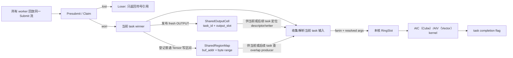
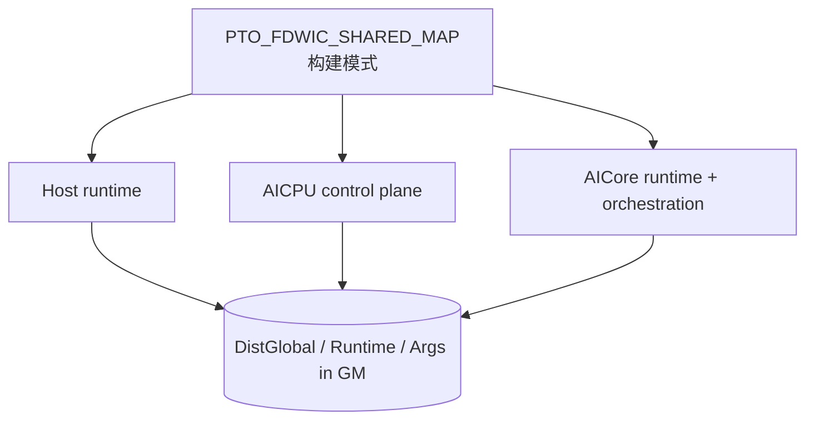
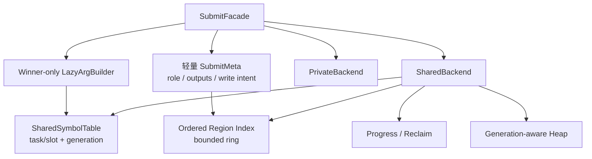

# A5 FDWIC Shared TensorMap 分支架构审查记录

本文审查
[`poursoul/simpler:fdwic-shared-tensormap`](https://github.com/poursoul/simpler/tree/fdwic-shared-tensormap)
在 A5 FDWIC runtime 中实现的 shared TensorMap 方案，并与当前分支 standalone
方案比较。本文用于后续开发决策，不表示目标分支已经合入，也不把分支文档中的
实验记录自动当成当前分支的性能结论；当前分支 S0～S3.1 的实际实施证据另记于
第 15 节。当前继续开发和验收的后端范围固定为 CPU/CCEC。

## 1. 审查快照与证据口径

| 项目 | 本次固定值 |
| ---- | ---------- |
| 审查日期 | 2026-07-24 |
| 目标提交 | `2866ad73b4f15a4f6fa292af5b7d546e8f972f8d` |
| 当前分支提交 | `1726a774826b20f14fbd8c8fcfb54cdbc525f49f` |
| 两分支 merge-base | `599703f5b153a3a0fd2a3516dff4efd49be3f00a` |
| shared 功能序列首提交 | `67d9d186` |
| 首提交父提交 | `f5da1a2e` |
| 重点审查差异 | `f5da1a2e..2866ad73`，42 个文件 |

目标分支和当前分支在较早位置已经分叉。若直接审查
`HEAD...poursoul/fdwic-shared-tensormap`，会把 131 个文件的两边独立演进都
误算成 shared TensorMap 改动。因此本文以 shared 功能序列的父提交
`f5da1a2e` 为功能基线，同时用当前分支
`docs/fully_distributed_within_core.md` 第 12 章校准预期协议。

本文使用四种证据标记：

- **代码事实**：可由目标提交源码直接证明；
- **本次验证**：本机执行过编译探针或 Git 检查；
- **分支记录**：目标分支文档记录的 sim、上板或性能结果，本次没有重跑；
- **审查推断**：由并发顺序和状态不变式推出，仍应由定向测试验证。

本次没有修改目标 worktree，没有重跑 A5/A5sim 全量用例，也没有复测目标分支
性能。实际执行了 private/shared 布局探针和 profile-off 头文件编译探针。

## 2. 先给结论

这份实现不是“把现有 per-core TensorMap 换成一份共享 ring”，而是一套
**性能优先的双通道依赖协议**：

1. fresh `OUTPUT` 使用 `(producer_task_id, output_slot)` 直接索引
   `SharedOutputCell`；
2. 普通 Tensor 或既有 Tensor 的重叠写依赖使用 append-only
   `SharedRegionMap`；
3. shared API 支持把 Claim 提到重参数构造之前；PA 调用点把完整参数构造放入
   `tok.won` 分支，loser 只返回符号引用。其他调用点若在 presubmit 前已经构造
   `L0TaskArgs`，并不会自动获得这部分收益。

这个方向有真实价值。尤其是 winner-first、PA loser 轻路径、fresh output 的
O(1) 符号定位、显式 DCache flush/invalidate，以及 MIX follower 由 winner
统一解析输入的基础机制，都值得复用。

但它目前还不适合作为最终 shared TensorMap 整体移植，主要阻断点是：

1. private/shared 会生成 ABI 不兼容的三镜像，但构建缓存身份没有包含模式；
2. writer intent 是调用方可选 API，真实 PA 的 INOUT 路径没有使用它；
3. shared heap、region map 和 task table 没有 generation、reclaim 和可证明的
   有界复用协议；
4. shared 模式下 `fatal_set()` 恒为 false，容量错误可能退化成永久轮询；
5. shared output 每 task 物理上限为 8，但公共接口允许构造最多 32 个输出。

因此建议是：

> 不整段 cherry-pick。先复用“winner-first + 符号引用 + 显式缓存维护”的设计
> 资产，再把构建身份、写入顺序、generation/reclaim、错误传播和容量断言补成
> 可证明的协议，最后迁移 PA。

## 3. 目标分支的实际逻辑架构

### 3.1 它是两个索引，不是一张共享 TensorMap



核心状态位于
`src/a5/runtime/fully_distributed_within_core/runtime/dist_engine/common/state.h`：

| 状态 | 组织方式 | 当前语义 |
| ---- | -------- | -------- |
| `shared_outputs[kFlagCap]` | task id 直达数组 | fresh output descriptor 与最新 writer |
| `SharedOutputCell::published[8]` | 每项独占 cacheline | descriptor 发布完成标志 |
| `SharedOutputCell::last_writer[8]` | 每项独占 cacheline | INPUT/INOUT 的 writer 链 |
| `SharedRegionMap::buckets` | 8192 个桶头 | 普通 Tensor 地址哈希 |
| `SharedRegionMap::entries` | 65536 个 append-only entry | 重叠 byte range 及 producer |
| `shared_heap_cursor[8]` | task id 分片 | winner 输出 heap 分配 |
| `tasks[kFlagCap]` | 65536 个 task cell | 完成、vend、依赖准备标志 |

因此“shared map”这个名字容易造成误解：

- fresh output 根本不进入 region map；
- region map 不是 ring，没有 per-slot `seq`，没有回收；
- task id 达到 `kFlagCap=65536` 时直接报错，不支持代际复用；
- 零输出 task 仍必须发布 task completion；它只是不需要发布
  `SharedOutputCell` 或 region delta，因为实现里没有全局 map append 前沿。

### 3.2 fresh output 快路径

producer winner 的关键顺序在
`runtime/dist_engine/aicore/submit_core.h:668-759`：

```text
reserve shared heap
  -> for each output:
       materialize Tensor descriptor
       copy descriptor to SharedOutputCell.tensors[slot]
       CCEC flush descriptor + DSB
       fetch_max(last_writer, producer_task_id)
  -> after all outputs: store_barrier
  -> for each output:
       release publish published[slot] = producer_task_id
```

在 PA 这类把参数构造放到 `tok.won` 后的调用点，loser 不构造
`TensorCreateInfo` 和完整参数，只通过 `rt_submit_loser(tok, output_count)`
返回 `FdwicOutputRef`。`shared_symbol_smoke` 和 `submit_dependency_smoke`
部分 wrapper 在 presubmit 前已有完整 `args`，不能把这项收益外推到所有调用点。
引用本身包含 `producer_task_id`、`output_slot` 和有限的一维 view 信息。

consumer winner 的行为是：

- `INPUT`：读取 `last_writer`，无有效 writer 时回退到原 producer；
- `INOUT` / `OUTPUT_EXISTING`：对 `last_writer` 做
  `atomic_exchange(current_task_id)`，返回旧 writer 作为 fanin；
- resolve：等待指定 `published[slot]`，invalidate descriptor cacheline，
  再把 Tensor descriptor 拷入执行侧 `RingSlot` 或 `BuiltSubtask`。

相较统一 region lookup，这条路径的优势明确：

- 索引为 O(1)，没有桶扫描；
- loser 不必等待全局 task 发布前缀；
- descriptor 身份与逻辑 writer 分开；
- producer materialize 较晚时，`fetch_max` 不会覆盖已经到达的更大 writer。

### 3.3 普通 Tensor 的 region 慢路径

普通 Tensor 的地址依赖由
`submit_core.h:854-940` 处理：

1. 按 buffer 地址选 bucket；
2. 遍历单向 entry 链；
3. 对每个 entry 做 CCEC invalidate；
4. 在重叠区间中选择 `producer < current_task_id` 的最大 producer；
5. writer 使用 `high_water.fetch_add()` 取得永久 entry；
6. 通过 bucket 的 `-2` sentinel 独占插入，再 flush entry 并发布新桶头。

它是 append-only 表，不是当前文档第 12 章描述的
ring-per-bucket：

- lookup 窗口是所有已插入的 `< N` producer，不是 `[N-H, N)`；
- 没有 `head`、generation、per-slot `seq` 或 min-progress reclaim；
- 同一 buffer 的长写链会让 bucket 扫描不断变深；
- 容量耗尽后只能 `set_fatal()`。

`insert_lock` 字段和全局 lock helper 仍存在，但实际插入使用的是每 bucket
sentinel。它目前是死字段候选；应先完成 Host/AICPU/AICore 三镜像的 ABI、
初始化和布局审计，再单独决定清理或补充用途，不能顺手删除。

### 3.4 region intent 是可选调用协议

目标分支为写依赖增加了
`rt_presubmit_*_with_region_intent()`：

```mermaid
sequenceDiagram
    participant W as task N winner
    participant L as task N losers
    participant S as shared dependency state

    L->>S: wait deps_prepared[N]
    W->>W: collect fanin
    W->>W: register writer regions
    W->>S: publish deps_prepared[N]
    S-->>L: wait released; writer intent visible
    W->>W: continue winner build
    L->>L: continue replay
```

意图是防止 task N 的 losers 在 N 的 writer 尚未登记时继续跑到 task N+1。
但该语义没有收进 runtime 的统一入口，而是由 orchestration/codegen 判断是否
调用：

- `submit_dependency_smoke` 的 wrapper 会扫描参数 tag 并选择 intent API；
- PA 的 QK/SF/PV/Update 都调用普通 `rt_presubmit_*`；
- PA Update 甚至在 presubmit 之后、且仅在 winner 分支内才构造四个 INOUT。

这意味着 PA 无法在 Claim 前依据尚未构造的参数发布 writer intent。目标分支
计划文档也承认该能力仍依赖 codegen 显式接入。

### 3.5 MIX/joint 路径

最新代码已补上一部分 shared MIX 基础机制：

1. anchor winner 先收集 fanin 并 resolve shared descriptor；
2. fanin ready 后才发布 follower 的 `BuiltSubtask`；
3. follower 直接消费 winner 已解析的 payload，shared follower fanin 清零；
4. `joint_launch_expected/drained` 防止最终退出早于迟到的 follower launch；
5. 所有参与 lane 完成后仍只发布一个 task completion。

`0f9862a2` 和 `d618589f` 修正了 winner 侧 shared-ref resolve 以及
launch/drain 门控，但还不能称为完整闭环。目标分支文档仍列有 MIX output
publisher、MIX INOUT/OUTPUT_EXISTING、连续 MIX、容量/反压和完整 stress
缺口。准确结论是：基础 handoff 已存在，部分关键路径已修正，通用语义和压力
验证仍未完成。

### 3.6 初始化和运行生命周期

主要生命周期路径已经接通：

- host 在 runtime 创建/setup 路径预留并清零固定 runtime arena；
- AICPU register 重置 cursor、task cell、shared output flag、region bucket、
  heap cursor、joint counter、fatal 和 replay 状态；
- AICore attach 重置本核 slot/counter；
- AICPU 唤醒 worker 前 flush runtime arena；
- executor 结束后复位控制状态。

每轮 executor 正确性应依赖 AICPU 对 publication flag、bucket、high-water 等
控制状态的复位，不能依赖“每轮一定重新执行 host 全量 memset”。陈旧
descriptor/entry 本体没有逐项清零，但控制状态复位后，正常路径不会在重新发布
前消费它们。error、容量耗尽和跨代复用生命周期仍没有闭环。

非 Submit 热区有一个明显成本：AICPU 每轮会 flush 固定 1056 MiB
（约 1.1 GB）的 `dist_global` arena。它不应混进约 5 ms Submit 指标，但会
影响 case 启动时间。

## 4. 开发视图与构建边界

### 4.1 三镜像必须是同一模式

A5 FDWIC 是三个独立程序共同解释 GM ABI：



宏默认值为 0，位于 `runtime/pto_types.h:69-71`。clean build 时，
环境变量 `CXXFLAGS=-DPTO_FDWIC_SHARED_MAP=1` 原则上能传播到：

- direct sim/host/orchestration 编译；
- A5 onboard AICore 的 CCEC 自定义命令；
- AICPU 和 runtime CMake target。

但它仍只是 ambient `CXXFLAGS`，不是显式的 runtime variant。任何一个镜像
漏掉宏，都将用不同字段偏移解释同一块 GM。

### 4.2 private/shared ABI 实测

本次用目标提交真实头文件编译了两个布局探针：

| 类型或字段 | private | shared |
| ---------- | ------: | -----: |
| `TensorRef` | 16 B | 24 B |
| `L0TaskArgs` | 1,024 B | 1,280 B |
| `L2TaskArgs` | 3,840 B | 4,864 B |
| `RingSlot` | 4,864 B | 5,440 B |
| `DistCore` | 9,231,488 B | 8,464,832 B |
| `DistGlobal` | 1,007,102,208 B | 1,080,630,976 B |
| `Runtime` | 69,952 B | 70,976 B |
| `DistCore::slots` 偏移 | 823,424 | 64 |
| `DistGlobal::heap_base` 偏移 | 4,197,504 | 143,176,000 |
| `DistGlobal::cores` 偏移 | 10,101,504 | 166,429,120 |

变化来自：

- shared 的 `kPrivateSlots` 从 4 增至 14；
- shared 移除 `DistCore::map`；
- shared 在 `DistGlobal` 中插入约 128 MiB output table、region map、heap
  和 joint 状态；
- `TensorRef` union 增加 `FdwicOutputRef`。

固定 arena `0x42000000` 只保证两种布局各自不越界，不表示 ABI 相同。若把当前
private map 和 shared 状态机械组成一个 superset，估算会比现有 arena 多约
62.3 MiB，因此“直接保留两套所有字段”并不是合理修法。

更合适的结构是固定小型控制头：

```text
DistRuntimeHeader {
    magic
    abi_version
    map_mode
    profile_mode
    state_size
    backend_state_ptr
}

backend_state_ptr -> PrivateBackendState 或 SharedBackendState
```

或者把两种模式作为完全独立、带 mode/ABI tag 的 artifact family。两种办法都
比当前“字段偏移变化但无握手”可靠。

### 4.3 构建缓存会制造混合镜像

`simpler_setup/runtime_builder.py:307-329` 的 baseline runtime 缓存 stamp
只有 Git HEAD，输出目录也不包含 shared/profile 模式。与此同时，
per-callable AICore stale state 已包含 `CXXFLAGS`。

因此同一 commit 下先编 private、再改 `CXXFLAGS` 编 shared 时，可能出现：

```text
baseline Host/AICPU = 旧 private artifact
per-callable AICore = 新 shared artifact
```

目标分支文档要求切模式前手工删除
`build/cache/a5/{sim,onboard}`，正说明当前构建身份不完整。手工清缓存可以帮助
实验，但不能成为架构正确性条件。

### 4.4 profile 与 map 模式当前不正交

本次对以下两个组合做了头文件编译：

- `PTO_FDWIC_SHARED_MAP=0, PTO2_PROFILING=0`；
- `PTO_FDWIC_SHARED_MAP=1, PTO2_PROFILING=0`。

两者都在 `pto_types.h:906-908` 失败，`L0TaskArgs` 和 L2 Arg 对 64 取模均为
32。原因是 `DumpArgSelection` 被条件编译去除后，固定 padding 没有同步调整。

这与 `docs/profiling_levels.md` 给出的 profile-off 构建方式不一致，也说明
测试矩阵没有覆盖 `{private, shared} × {profile on, off}`。

## 5. 与预期架构的逐项比较

这里的“预期”由两部分组成：

1. 用户要求：以宏保留 private/shared 双模式，先保证 private 基线；
2. 当前 `docs/fully_distributed_within_core.md:1272-2068` 的协议约束：
   task-order 发布、`[N-H,N)` 查找、generation、progress/reclaim 和有界反压。

| 维度 | 原预期 | 目标分支实际实现 | 评价 |
| ---- | ------ | ---------------- | ---- |
| 默认模式 | private | 宏默认 0 | 符合 |
| 切换方式 | 明确构建模式 | ambient `CXXFLAGS` | 形式符合，工程不完整 |
| 上层 API | facade 内切后端 | public 返回类型和 submit 协议都变化 | 差异较大 |
| loser 路径 | 尽量轻 | API 支持；PA 做到 winner-only 构参 | PA 路径优于朴素预期 |
| fresh output | 可走快路径 | task/slot 直达表 | 值得保留 |
| 普通区域依赖 | 统一有界 ring | append-only bucket 链 | 不符合 |
| writer 顺序 | runtime 自动保证 task order | 可选 intent API | 不符合 |
| 发布前沿 | 零 entry task 也推进 | 没有全局 map 前沿 | 架构不同 |
| lookup 窗口 | `[N-H,N)` | 所有已发布且 `<N` 的 entry | 不符合 |
| generation/reuse | per-slot seq | 以 65536 task 硬上限规避 | 不符合 |
| reclaim | min progress 驱动 | region/output table 不回收 | 不符合 |
| heap 复用 | generation + 有界反压 | shard cursor + task frontier | 证明不足 |
| cache 可见性 | 显式 flush/invalidate | descriptor/region 已实现 | 基本符合 |
| MIX | winner 发布、follower 消费 | resolve/launch 基础机制已实现 | 部分符合，尚未闭环 |
| ABI | 稳定头或明确隔离 | 两套布局、无 mode 握手 | 不符合 |
| profile 正交 | 四组合可构建 | profile-off 两模式均失败 | 不符合 |
| A5/A5sim | 同一模式定义 | clean build 可传播，路径不同 | 部分符合 |

### 5.1 哪些差异是合理取舍

不能因为它不等于统一 ring，就把所有差异都判为错误：

- PA 的 fresh output 占主路径，用符号直达表避开 region 扫描是合理的分层；
- Claim 前移使调用点可以消掉 loser 参数构造；PA 已这样使用，但 runtime
  不会自动改写 presubmit 前已经构造的 `args`；
- descriptor identity 与 `last_writer` 分离，适合表达 fresh output 的后续 INOUT；
- 编译期产生两套后端也可以接受，前提是 artifact identity 和 ABI tag 完整；
- 零输出 task 仍发布 completion，但在直达表中无需发布空 map delta，这是
  该结构自然得出的结论。

原先“一个巨大稳定 superset ABI”的设想也应修正：实测尺寸表明机械 superset
会突破当前 arena。应追求的是**稳定控制 ABI + 模式后端隔离**，不是所有数据
字段永远同时驻留。

### 5.2 哪些差异不能只解释成性能取舍

以下内容会改变正确性或构建确定性，不能用“PA 当前能跑”代替协议证明：

- writer task 到达顺序与 `atomic_exchange(last_writer)` 顺序不一致；
- heap 物理区间复用没有 generation；
- region map 永久增长；
- shared fatal 无法被等待方观察；
- build cache 可能混合 private/shared 镜像；
- 公共 output_count 与物理数组上限不一致。

## 6. 正确性与可维护性风险

### 6.1 P0：移植前必须解决

#### P0-1 构建模式未进入 artifact 身份

三镜像 ABI 不同，但 baseline cache key、输出目录和 runtime 握手都没有
shared/profile 维度。错误组合不会明确失败，而会读写错误偏移。

**建议**：先把 mode/profile 加入所有 cache key、输出目录和 ABI header，再做
任何 runtime 移植。

#### P0-2 PA 绕过 writer-intent 顺序

shared ref writer 使用无条件
`atomic_exchange(last_writer, current_task_id)`。假设后 task M 的 winner 先于
前 task N 到达：

```text
M exchange: last_writer = M，返回旧 producer
N exchange: last_writer = N，返回 M
```

N 会依赖“未来”的 M，writer 链也被较小 task id 覆盖。producer 的
`fetch_max` 只防止 producer 晚 materialize 覆盖更晚 writer，不能解决
writer-vs-writer 的乱序。

pure INPUT 还有同源风险：它直接读取当前 `last_writer`，没有
`writer < current_task_id` 过滤，也没有历史版本。若未来 writer M 先更新，
较早 reader N 可能直接依赖未来 M，而不是 N 时刻应看到的前一 writer。

普通 region 也有同类窗口：后 task lookup 时，较早 writer 的 entry 可能尚未
insert，`producer < N` 过滤无法补回不存在的历史项。

PA Update 使用普通 presubmit，且只有 winner 才在 Claim 后构造 INOUT 参数，
所以现有 intent barrier 没有参与 PA。这个问题需要定向交错测试，不应由普通
golden 多次通过来推翻。

#### P0-3 启用 shared heap wrap 时缺少可证明复用条件

heap 按 `task_id % 8` 选 shard，再用 `fetch_add` 分配。cursor 第一圈之后仅等待
`frontier >= task_id-H`，但没有记录即将覆盖的物理区间属于哪个 task/generation。

winner materialize 顺序可以和 task id 顺序不同，因此“当前 task 已跨 H 窗口”
不能直接证明该物理区间的上一任已经无人引用。当前只检查单 task 输出不超过
shard span，也没有证明 H 窗口内同 shard 累计 live bytes 一定装得下。

对“启用 wrap 或长期复用”的实现，这是移植前 P0。若第一阶段明确禁止 wrap，
并在容量边界可靠终止，则该项可以降为通用化前 P1，但不能在没有 generation
证明时悄悄复用。

#### P0-4 fatal 写入后等待方仍看不到

`runtime_state.h:40-47` 在 shared 模式下让 `fatal_set()` 固定返回 false，而
`set_fatal()` 仍写 `g_dist.fatal`。task cap、region cap、heap retry 或 resolve
错误发生后，其他核可能继续轮询，无法可靠结束。

#### P0-5 输出上限 8 与接口上限 32 不一致

`SharedOutputCell` 的三个数组长度都是 8，但：

- `SharedTaskOutputs::add_output_ref()` 只检查 `MAX_TENSOR_ARGS`；
- `rt_count_outputs()` 可以返回大于 8；
- materialize 按实际 output ordinal 直接索引 shared cell。

第 9 个 output 起可能越界，且发生在后续 resolve 的 8 上限断言之前。

### 6.2 P1：通用化前补齐

| 风险 | 代码事实或待证点 | 建议验证 |
| ---- | ---------------- | -------- |
| task/region 容量 | task 上限 65536；region 是 65536 entry，不是 65536 task | 多区域 task 的 cap 边界 |
| external RAW | owner 无效的 external pure INPUT 确定跳过 region lookup | 查 API 禁令；无禁令则补 RAW |
| region 合并读 | lookup 只返回一个最大 producer，可能漏掉另一不重叠 writer | 两 writer + 横跨两区 reader |
| fanin 截断 | 第 17 个不同 producer 被静默丢弃 | 17 producer golden + 明确报错 |
| scalar data access | shared 下 `get/set_tensor_data` 不等待 producer | orchestration 读取前 task scalar |
| generic submit | shared 的 `dist_submit_impl()` 直接 assert | 建立统一 facade 或编译期禁用 |
| dummy submit | dummy 不分配 task id、依赖或 completion | 明确其 shared 语义 |
| view | `FdwicOutputRef::view()` 只允许 1D | 多维/嵌套 view |
| view 并行度 | `last_writer` 粒度为整个 output slot，不区分不重叠子 view | 两子 view 并行写的依赖图 |
| atomic 顺序 | CCEC wrapper 丢弃 `memorder` 参数 | 查 A5 ISA 文档并做微基准 |
| initial value | 写输出 data 后未见同等级显式 data flush | 上板 producer/consumer 可见性测试 |

external RAW 的代码行为已经明确：owner 无效的 external pure INPUT 会跳过
region lookup。待证的是公共 API 是否明确禁止“external Tensor 先作为 INOUT，
后作为 pure INPUT”。若没有该禁令，这就是语义缺口，不只是测试不足。

region map 还有一个独立的表达能力问题：假设 task A、B 分别写同一 buffer 的
两个不重叠子区，task C 再读取横跨两区的范围；如果 A、B 之间没有传递依赖，
lookup 只返回最大 producer B，不能保证 C 同时等待 A。应在决定 region 数据
结构前先用定向 golden 固定“一个读取区间是否允许需要多个 producer”的语义。

shared-ref view 则偏向保守：`last_writer` 的粒度是整个
`(producer_task_id, output_slot)`，两个不重叠一维子 view 的写也会串在同一
writer 链上。它通常不破坏结果，但会比普通 region byte-range 语义损失并行度。

### 6.3 P2：性能和工程清理

- `SharedRegionMap` 同桶链越长，lookup 的 invalidate + DSB 次数越多；
- shared 模式把私有 slot 从 4 增到 14，`drain_phase_b()` 的扫描地板上升；
- cursor 分片减少相邻 task 的 cacheline 冲突，但同一 task 的所有候选仍竞争
  一个 atomic；
- 同一个 shared ref 重复出现时，descriptor resolve/invalidate 可能重复；
- shared heap 同时付出 shard cursor 和全局 vend 两次原子更新；
- 1056 MiB runtime arena 的全量 reset/flush 影响启动；
- `worker_state.h` 中巨大的 fallback `DistGlobal` 会增加 BSS/虚拟地址压力；
- 宏分散在 runtime API、state 和多个业务 orchestration 中，后续维护成本高。

## 7. 性能证据应该怎样解读

目标分支文档记录：

- shared PA Case1 上板生成过
  `outputs/TestPagedAttentionUnroll_Case1_20260723_150651/merged_swimlane.json`；
- 脚本记录的 `global_span_us` 为 `2285.352 us`；
- 按需 EfDrain 前后约为 `2.540 ms -> 2.318 ms`；
- 错误的全局 prefix 退出方案曾把约 `2.3 ms` 劣化到约 `7.2 ms`。

这些是**分支记录**，不是本次验证。目标分支没有提交对应 raw/swimlane artifact，
所以本次无法重新计算事件数、统计窗口和 instrumentation 开销。

它也不能直接与当前分支约 5 ms 的 PA 基线相减，原因包括：

- 两分支从较早提交分叉，runtime 和 PA orchestration 不同；
- target 使用 winner-first shared API，当前基线仍有另一套观察代码；
- 目标脚本的 `global_span_us` 是所有 `ph == "X"` 事件的最早开始到最晚结束，
  不是严格的“首个 Submit 入口到最后一个 Submit 返回”；
- 目标数字来自带 L2 swimlane 的 shared ELF，不能与当前 perf-clock、普通
  swimlane 或 atomic-swimlane ELF 互减；
- 目标记录缺少可复算 raw 证据。

合理表述只能是：

> 目标分支记录表明该结构有较强性能潜力，尤其 loser 轻路径已经改变了复杂度；
> 但不能据此宣称相对当前 5 ms 基线获得确定百分比收益。

目标提交的多个 commit message 还分别记录了 `2285.352`、`2299.227`、
`2330.192` 和 `2293.923 us`。这些是不同提交的单次作者记录，不是同一版本的
重复样本，不能据此计算 median、min/max 或置信区间。

时钟口径也不能混用：目标泳道的 SYS_CNT raw tick 为 1 ns，换算基准为
1 GHz；这不是 scalar core 主频。约 1.65 GHz 是本机校准得到的 PMU cycle
频率。converter 已按 raw metadata 换算 SYS_CNT，不能再用 1.65 GHz 对目标
分支的 2.3 ms 做二次缩放。

迁移时仍应固定三条互不混算的证据链：

1. `perf-clock`：决定候选保留或撤销；
2. `swimlane`：解释业务区域和 atomic 变化；
3. `submit-pmu`：辅助解释 scalar busy、I-cache request/miss。

三种 ELF 只做同类前后对照，不能跨构建直接相减。

## 8. 测试证据与证明边界

### 8.1 已有覆盖

| 测试 | 数量/平台 | 主要覆盖 |
| ---- | --------- | -------- |
| `shared_symbol_smoke` | 11 例：7 个 sim-only、4 个 manual A5 | AIC/AIV 跨角色、双输出 slot1、heap shard、dual AIV |
| `submit_dependency_smoke` | 84 例：38 sim、45 A5、1 双平台；46 manual | INOUT、overlap/view、alloc、heap、DCCI、长链 |
| `simple_orch_smoke` | 24 例：12 个 sim-only、12 个 A5-only；14 个 manual | joint、WonSlot、基础 orchestration |
| `benchmark_bgemm` | 7 例；当前只算 private/default 相关基线 | orchestration 未适配 shared 新 API，不能算 shared 覆盖 |
| PA | 3 例均声明双平台；Case2/3 为 manual | 真实业务 golden；Case1 是分支性能工作负载 |

前三类 smoke 和 PA 调用生产 runtime，不是脱离实现的模型测试，这是优点。
`benchmark_bgemm` 仍直接使用 shared 宏下不存在的旧 submit API，当前只能列作
private/default 相关工作负载，不能包装成 shared 集成证据。

### 8.2 当前证据仍不能证明什么

1. Python case 没有设置或断言 `PTO_FDWIC_SHARED_MAP=1`。宏默认 0，
   `shared_symbol_smoke` 还有 private fallback；测试名字本身不能证明产物是
   shared build。
2. 可信的 shared 结果依赖外部 `CXXFLAGS` 和手工 clean cache。
3. 许多 A5 case 标记为 manual；默认 CI 不等于执行了硬件矩阵。
4. delayed region intent 的 mode 32/33 只有 sim，没有对应 A5 case。
5. sim 不能证明 A5 非一致缓存、DCCI/DSB 和原子竞争语义。
6. 没有生产协议的确定性交错单测，也没有负向容量测试。

至少还缺：

- 9 个 output；
- 17 个不同 fanin；
- task/region cap 边界；
- heap shard 多次 wrap；
- stale generation ref；
- writer task 逆序到达；
- reader task 与未来 writer 逆序到达；
- 两个独立 writer 后的合并区域 reader；
- external INOUT 后 pure INPUT；
- fatal 后所有核有限时间退出；
- shared/profile 四组合构建；
- private/shared 镜像 mode 不一致时的显式拒绝。

## 9. 目标分支文档自身的一致性

两份设计文档各有价值：

- `high_perf_shared_map_plan.md` 较准确地记录了 winner-first 目标、手工 clean
  cache、task cap 和 intent 仍依赖 codegen 等限制；
- `current_shared_map_runtime_design.md` 对数据结构和性能演进写得很完整。

但后者不能完全作为最新代码真相：

- 开头称 MIX 未闭环的总判断仍成立；最新两个提交缩小了 follower
  resolve/launch 方面的具体缺口，但没有完成通用 MIX 语义；
- 第 9 部分引用的一批短 commit id 在当前目标提交对象库中不存在，可能来自
  rebase 前历史，无法直接追溯；
- 文档对 `last_writer` 的顺序解释默认了 writer 按 task id 到达，没有覆盖 PA
  绕过 intent 的实际调用方式；
- 性能数字只有文字记录，没有随分支提交 raw artifact。

后续开发文档应固定“代码提交 + 原始证据目录 + 生成命令”，避免设计说明和实际
分支继续漂移。

## 10. 建议的目标架构

建议保留双通道思想，但把它放入一个有统一正确性底座的结构：



关键设计点：

1. **统一 facade**：业务代码不直接散布 private/shared 的返回类型和流程宏。
2. **轻量元数据与重参数分离**：Claim 前能获得 role、output_count 和写意图，
   winner 后才构造完整 `L0TaskArgs`。
3. **fresh symbol 作为优化层**：继续保留 O(1) task/slot 定位；完整 resolve
   仍可能等待 published，并执行 invalidate、DSB 和 descriptor copy。
4. **writer 顺序由 runtime 保证**：不能让调用方选择是否正确。
5. **有界 region backend**：使用 task-order delta + per-slot generation，
   或另一套能证明 writer 全序的协议。
6. **统一 progress/reclaim**：region、symbol generation、heap 复用共享同一组
   可证明的活跃窗口约束。
7. **稳定控制 ABI**：mode/version/size 可在 Host、AICPU、AICore 启动时互检。

writer intent 的实现需要在开发前明确二选一：

- **方案 A，推荐**：轻量 `SubmitMeta` 在 Claim 前表达写集合，由 runtime 按
  task id 发布 dependency delta；零 delta 也推进 sequencer。
- **方案 B**：设计 per-object 的有序 writer CAS/版本协议，证明乱序 winner
  最终仍形成 task-id 顺序。

当前无条件 `atomic_exchange(last_writer)` 加可选 intent barrier 不能作为最终
方案。

## 11. 分阶段移植计划

每一阶段独立提交，上一阶段验证通过后再进入下一阶段。实施顺序固定为：

> 先在 `tests/atomic_probe/pa_scheduler` 完整证明，再迁移到
> `src/a5/runtime/fully_distributed_within_core` 和真实 PA。standalone 尚未
> 闭环时，不允许用“顺便对接真实路径”扩大修改面。

### 阶段 S0：standalone 构建身份和 ABI

**状态：已完成；当时的临时 shared fail-closed 门禁已在 S2 删除。**

- `run.sh` 增加 first-class `--tensormap private|shared`，默认 private；
- CCEC、AscendC、CPU 构建都显式传
  `PTO_FDWIC_SHARED_MAP=0/1`，产物目录包含 backend、mode 和诊断 variant；
- CCEC host、AIC/AIV、callback runtime、callback finish 必须属于同一模式；
- `RunConfig` 使用原有尾部空间保存 magic/version/mode/`sizeof(SchedulerState)`；
- CCEC swimlane、submit-pmu manifest 都记录模式并校验整套产物；
- 修复 PMU 配置使用 `reserved[4]` 越过 `RunConfig`、覆盖
  `WinnerWorkloadConfig::mode` 的问题，改为独立 cache-line sidecar。

**Gate**：默认 private 的 CPU b1 全断言不变；脚本语法检查通过；S0 当时
shared backend 尚未接入，必须在编译期明确失败；故意混用模式或校验和必须在
启动前失败。S2 接入真实 shared sidecar 后只删除临时 fail-closed，模式隔离和
混用拒绝继续保留。

### 阶段 S1：standalone private map 先同构为 ring

**状态：已完成。**

- 保持 `TensorMap=823312 B`、`WorkerState=9231296 B`，并保持 standalone
  private DistCore 中 map、ring slot 和 payload 的既有 size/offset；
- 把 private linked map 改为 128 buckets × 128 slots 的
  ring-per-bucket，总 entry 容量仍为 16,384；
- `MapEntry` 保持 48 B，后 16 B 只作 ABI 保留，本阶段不引入 shared seq；
- private 仍然每 worker 独占，不引入 atomic，不同时改构参、heap 或输出引用；
- 每桶 `head/tail` 为普通 `uint64_t`；`AdvanceTensorMap` 用逐 task 精确计数
  推进 logical live window，`RetireBucket` 在该桶下一次 lookup/insert 时
  惰性推进物理 head；
- lookup 扫描全部合法槽并取最大 producer，保留
  `producer >= alive_floor` 边界；
- 用统一的逻辑记录 `(buffer_addr, lo, hi, producer)` 作为后续
  private/shared 对比口径；
- insert/register 逐层返回 bool；满桶不覆写、不推进 tail，由 Submit 发布
  fatal，禁止静默漏依赖。

**Gate**：逐 task fanin 与旧 private 一致；Case1 保持每 batch 5 条 fanin、
每 worker 每 batch 4 次 region insert；定向覆盖窗口边界、同地址区间重叠、
retire、容量耗尽和复用；容量不足必须显式失败，不能静默漏依赖。当前这些
检查均已通过，详细验证记录见第 15 节。

### 阶段 S2：standalone shared 有序 ring

**状态：已完成全核强一致正确性基线；其性能问题已由后续 S2.5 定向处理。**

第一版 shared 只切换 map 的副本数、写入主体和并发纪律，暂时保留 eager 构参和
每核 private heap，避免在一个提交里同时改三个协议面：

- 在完整 production prefix、standalone controls 和 `results` 后追加 64B 对齐、
  2,119,808 bytes 的 shared sidecar，不移动 WorkerState 或既有控制/结果 offset；
- sidecar 保存连续 task commit 前沿、全局 reclaim 前沿、96 条每核 progress、
  128 组分离 cache line 的 head/tail 和 16,384 个共享槽；
- shared 只有 winner 追加 region，零 insert task 也必须提交空 delta；这里的
  winner-only 不包括构参和 Materialize，它们在 S2 仍由所有 worker eager 执行；
- task N lookup 前所有 worker 必须观察到前 N 个 task 连续 commit；winner 完成
  整 task append 后发布 N+1，loser 等待 N+1，随后所有 worker 精确发布 progress=N；
- lookup 只接受 `producer ∈ [max(0, N-H), N)`；
- slot 的 payload 和绝对 `seq` 各占一条 cache line。writer 先失效旧 seq，
  写 payload 并 DCache flush，再发布 seq/tail；reader 原子读 seq、invalidate
  payload、拷贝快照、再次原子读 seq，双检失败即协议错误；
- reclaim 由 `min(core_progress)-H-1` 单调推动；
- 整 task 在任何写入前完成容量预检，普通容量不足保持 all-or-nothing；
  overflow/fatal 对所有等待者可见，等待路径带 watchdog，并可协作 drain；
- host D2H 后独立验证 commit/progress、bucket cursor、seq/payload/hash、
  producer 和最终逻辑窗口，不依赖 device 汇总计数自证。

**Gate**：每 task 恰好一次 commit，最终 sequencer 等于 task_count；逆序 winner、
慢核 progress、零 entry task、seq wrap、future/stale 过滤、tiny-cap overflow
全部通过；private/shared 的规范化 logical-map signature 和全局 dependency
signature 一致。CPU b1/b256 与 CCEC A5 b1/b256 已通过该 Gate；详细证据和
性能边界见第 15 节。

### 阶段 S2.5：ordered-winner reclaim

**状态：已完成 CPU/CCEC b1/b256 闭环；后续实现按当前开发范围不再以
AscendC 为阶段出口。**

S2.5 只改变 sequencer 与 reclaim，不提前混入 fresh symbol、winner-only
Materialize 或 shared heap：

- 只有 task N 的 winner 等待 `committed_tasks == N` 并读取 shared map；
  loser 不再等待 N/N+1，也不发布 per-core progress；
- winner 完成本 task lookup 后，以当前 exact turn 推导
  `reclaim_upto=max(-1,N-H-1)`；因此 sidecar 删除 96 条 progress line，
  从 2,119,808 bytes 缩减为 2,113,664 bytes；
- reclaim refresh 首先验证 exact turn，陈旧、未来或试图回退 reclaim 的
  actor 在任何共享写入前失败；
- 整 task preflight 后若仍容量不足，立即 fatal。当前 turn 的可回收边界
  已经固定，不再等待不可能扩大该边界的慢核进度；
- 零 entry task 仍由唯一 winner 推进 commit 和 reclaim，保证 task-order
  sequencer 连续。

**Gate**：b256 精确达到 `committed_tasks=1280`、
`reclaim_upto=1214`、1,024 次 append、52 条逻辑 live entry；依赖签名
`b7d985d6edb07078` 与逻辑 map 签名 `556bec7ec8d0f323` 均保持不变。
定向测试覆盖 ordered reclaim 边界、逆序 actor、零 entry、三圈绝对 seq、
满桶及“回收 stale 后仍满”的 all-or-nothing。验证和性能数据见第 15 节。

### 阶段 S3：standalone fresh symbol 与 winner-only

S3 继续拆成两个独立提交，不能同时改变引用 ABI 和分配主体。

**S3.1 状态：已完成 CPU/CCEC b1/b256 闭环。**

S3.1 已按参考实现接入 16B `FdwicOutputRef`、8B
`SharedTaskOutputs` 和每 task 2,048B 的 `SharedOutputCell`：

- 本小步仍保留所有 worker 构参和 Materialize，只有 winner 把 8 类 fresh
  output descriptor 发布到 shared cell；
- symbol resolver 只接收 plain ref；INPUT 读取 `last_writer`，三个 Alloc
  INOUT 以返回旧值的 Exchange 声明当前 writer；
- symbol 与 `manual_dep=true` 的 output view 都跳过 region lookup/register，
  因而 Case1 shared region insert 已从 4/batch 精确变成 0；
- 仍保留 S2.5 ordered winner turn，避免把当前 Case1 的单 writer 事实误推广成
  任意多个 INOUT writer 都可乱序。

**S3.1 Gate**：b1/b256 fresh descriptor 发布为 8/2,048，symbol INPUT
load 为 5/1,280，symbol INOUT Exchange 为 3/768，region insert 为 0/0，
fanin 仍为 5/1,280；依赖边和规范化 writer 签名保持与 private 一致。
CPU private/shared b1/b256、定向 sanitizer、Python 100 项和 CCEC
private/shared b1/b256 均通过。此步没有引入 generation、deferred resolve、
shared heap 或 winner-only Materialize；详细结果见第 15 节。

**S3.2 状态：S3.2a shared heap/winner-only Materialize 与 S3.2b
winner-only 重构参均已分别完成 CPU/CCEC 闭环。**

S3.2 继续拆开验证分配主体与构参主体。第一小步只把 Materialize 和堆分配
收敛到 winner，所有 worker 仍保持 S3.1 的 eager 构参；第二小步再把
QK/SF/PV/UP 的重参数构造收敛到 winner，Alloc 保留全核轻参数路径。
shared heap 首版使用 8 shard 绝对递增分配，默认 b256 每 shard 需求
25,821,184B，小于 32MiB shard span；临近 wrap 时显式失败，不能用尚未
证明的 generation 覆盖旧 descriptor。

**S3.2a Gate**：private 工作量计数保持原值；shared 全局 Materialize output
从 b1/b256 的 768/196,608 精确降为 8/2,048，shared heap vend 为
806,912/206,569,472 bytes，region insert 保持 0；CPU 定向测试和 CCEC
A5 b1 当前最终 ELF 已通过；CCEC b256 的规模证据在非法输入预检加固前已
通过，最终 ELF 按后续只跑 b1 的约定没有重复消耗上板时间。

**S3.2b Gate**：shared 的 Alloc 仍保留全员 3 个静态 Output 参数，
QK/SF/PV/UP 的 reset、view/CreateInfo、tensor/scalar 添加只由 winner
执行。全局每 batch 精确闭合为 307 tensor args、9 scalar args、4 reset、
2 view、2 dynamic CreateInfo；Materialize 仍为 8 个 output。CPU guard-page
锁定公共 split-finish loser 路径不访问上一 task 的陈旧 args；CCEC 侧
另由 winner 分支源码审计和 b1 集成回归取证。CCEC split private/shared
均完成编译，shared split 与 inline Materialize/Register 分别通过 b1
运行门禁。

### 阶段 S4：standalone CPU/CCEC 验收

- CPU 用于确定性交错、ABA、容量和逻辑 differential 测试，不作为 A5 性能证据；
- CCEC 先做 b1 正确性和泳道，再做一次 b256 阶段出口验证；
- 性能继续分开使用 `perf-clock`、`swimlane`、`submit-pmu` 三条证据链；
- 新增等待轮询使用聚合记录，不能把约 300 MiB raw 继续无界放大。

**Gate**：private/shared 产生同一 PA Case1 task/fanin/kernel/completion 拓扑，
shared 没有 future/stale 依赖、silent overflow 或永久等待；同构 `perf-clock`
结果达到可迁移标准。目标分支的 2.3 ms 只作为潜力参考，不作验收阈值。

#### S4.1 独立 `perf-clock` 证据链

2026-07-24 先补齐了此前缺失的 standalone 低扰动性能构建。它不是在
swimlane ELF 上运行时传 `--no-swimlane`：后者仍会保留各阶段
`TraceTimestamp` 和 atomic 包围计时。新变体使用独立
`PA_BUILD_PERF_CLOCK=1`，并在编译期统一消去：

- 普通阶段记录、PollBatch、atomic 开始/结束时间及返回依赖观察；
- phase-profile 累计；
- submit-PMU counter reader 与 owner；
- Kernel/Commit、startup/final lifecycle 和 ClockBaseline 计时。

首个 Submit 在 `BeginCallbackSubmit()` 已确定 task 0 后、EfDrain 前调用
专用 `PerfClockNow()`；末个 Submit 在 register/winner 或 loser 尾动作、
`submits++` 之后、返回前调用第二次。结果继续复用既有
`WorkerResult::submit_begin/submit_end/submits`，没有扩大 trace buffer 或
增加逐 Submit 记录。shared exact-turn 与 startup 屏障的时间 watchdog
仍保留：每个等待窗口会先读取一次超时起点，之后每 1024 次未完成轮询
复查一次。它是正确性超时，不属于新增性能观察，因而本实现只声称
“每核两个专用性能边界”，不声称最终 ELF 物理上只会读取两次系统时钟。

构建身份 ABI 从 3 升到 4，并复用 `PmuProbeConfig` 的一个保留槽加入
`swimlane=1 / submit-pmu=2 / perf-clock=3` 握手。这样即使绕过
`run.sh` 和 manifest，host/kernel 变体不一致也会在解释 worker 状态前
fail-closed。CCEC perf-clock 保持现有 split-finish 形状，只生成
host/kernel 两件套；最终 ELF 不得含 `WritePollBatchRecordRaw`，也不放置
会改变后续热函数 I-cache 对齐的可执行 marker。CPU 使用独立产物目录，并逐线程断言专用
性能时钟恰好调用 2 次、全局共 192 次；CPU 仍不作为 A5 性能证据。

本小步先按既定规则只做 b1 门禁：

| 门禁 | 结果 |
| --- | --- |
| CPU private/shared perf-clock 严格构建 | 系统 g++ 13.3.0 下全部独立自测 PASS |
| CPU private/shared b1 real-compute | 96 核、每核 5 Submit、专用读钟 192/192、全部语义与数值断言 PASS |
| CCEC private/shared mixed ELF | split caller/runtime/finish、无 trace writer、LOCAL helper、无残留 relocation、manifest 全部 PASS |
| CCEC private b1 real-compute | 最终代码全部断言 PASS；单个结构样本 `66.620 us` |
| CCEC shared b1 real-compute | 最终代码全部断言 PASS；单个结构样本 `81.714 us` |
| 既有普通构建回归 | CPU private 与 CCEC private swimlane b1 全部断言 PASS |
| 既有 submit-PMU 回归 | CCEC private `none` 构建、96 核身份/窗口、PMU 清理与 b1 语义全部 PASS |
| 变体交叉运行负向门禁 | perf-clock host 搭配 swimlane kernel 被 ABI4 `build_variant` 握手拒绝 |

两个 CCEC 数值来自不同 ELF 的各一个独立 b1 进程，只证明边界和产物可用，
不能据此判断 shared 快慢。正式性能结论仍需冻结两份 perf-clock ELF 后做
平衡顺序的 b256 private/shared 配对；swimlane 与 submit-PMU 只负责解释，
不得和 perf-clock 的绝对时间互减。当前 S4 尚未因为这两个 b1 样本而宣告完成。
本阶段只实现和验收 CCEC、CPU 两条路径，不新增 AscendC perf-clock。

#### S4.2 `perf-clock` 规模门禁否定全局 exact-turn

冻结 `bb482001` 对应的 private/shared CCEC perf-clock 两份 ELF 后，先按
`private -> shared -> shared -> private` 做独立进程交错。b1 全部语义断言
通过：

| 模式 | 两个独立 b1 样本 | 平均值 |
| --- | --- | ---: |
| private | `65.808 us`、`67.343 us` | `66.576 us` |
| shared | `77.823 us`、`78.893 us` | `78.358 us` |

shared b1 平均多约 `11.783 us`，即 `17.7%`。这个结果只说明短序列差异
方向稳定，不能替代规模门禁。

同一组冻结 ELF 随后只做一轮 b256 ABBA。private 两次均通过，分别为
`3.810849 ms` 和 `4.920407 ms`；shared 两次都不是性能样本：

| shared 样本 | watchdog 退出 | `committed_tasks` | 语义 |
| --- | ---: | ---: | --- |
| 第一次 | `2.006839 s` | 19 | FAIL |
| 第二次 | `2.008819 s` | 29 | FAIL |

两个失败都恰好命中 2 秒 watchdog。96 个 worker 全部未完成，最快与最慢
worker 的 Submit 进度相差 116，且很多 future winner 已经取得 Claim。
因此这不是普通的 Claim 漏选，而是当前结构形成了 winner convoy：

1. 分片 Claim 允许快核提前取得 future task；
2. winner 随后在原调用栈等待全局 `committed_tasks == task_id`；
3. shared loser 不等待并继续前冲，最终更多 winner 占住 worker；
4. CCEC `SpinHint()` 为空，所有 future winner 持续对同一 cache line 发
   atomic load，下一 turn 的 winner受到严重争用和饥饿；
5. Case1 的 region ring 明明恒为空，shared heap、descriptor 发布、symbol
   resolve 和 register 仍被放进同一条全局串行链。

参考分支的高性能设计已经明确禁止该结构：fresh output 按
`(producer_task_id, output_slot)` 独立发布，consumer 只等待自己实际消费的
symbol；ordinary region 才进入 bucket 局部协议，不能在 shared winner
入口统一等待全局发布前缀。当前 standalone exact-turn 既与该目标冲突，
也已被 b256 反例否定，不能迁移到真实 simpler。

后续修正按以下独立小步推进：

1. 先把 fresh descriptor 提前到 winner 物化后独立发布，并让 symbol
   resolver 只等待实际 producer slot；保留 watchdog 和逐字段校验；
2. 把 shared heap 的 8-shard FetchAdd 改成允许合法并发 allocator，
   删除只在“全局唯一 writer”前提下成立的预检快照与回滚；
3. PA Case1 的 region entry 数必须继续严格为 0，并绕过全局 ordered
   sequencer；非空 region 在 bucket 局部并发协议完成前显式拒绝；
4. 依次通过 CPU 定向测试、CCEC b1、CCEC b256 语义与签名，再重新做
   private/shared perf-clock 交错比较。

S4 因此保持未完成。当前优先级是修复 shared 长序列活性，而不是根据失败的
b256 运行估算性能；本阶段范围仍只有 CCEC 与 CPU。

### 阶段 R0：迁移真实 simpler

只有 S0～S4 全部闭环后，才按已验证结构依次迁移：

1. 真实构建身份、缓存隔离和 CPU/CCEC ABI 握手；
2. private ring 同构化；
3. shared ordered ring 与统一 facade；
4. PA winner-only/fresh symbol/shared heap；
5. MIX 与 A5 非一致缓存语义；
6. PA Case1 a5sim golden；
7. PA Case1 A5 b1；
8. `perf-clock` 多轮配对，随后用 `swimlane`、`submit-pmu` 解释变化；
9. private 默认路径完整回归。

真实路径的每一步都应能追溯到 standalone 已通过的协议测试；不得直接
cherry-pick 参考分支的 append-only map、可选 writer intent 或无 generation
heap。

## 12. 可直接复用与不应直接复用的清单

### 12.1 建议复用

- Claim-first API，以及 PA 已验证的 winner-only 重参数构造方式；
- loser 返回符号 output ref 的轻路径；
- `(task_id, output_slot)` fresh output 快路径；
- descriptor 普通写后 flush，consumer invalidate 后读取；
- `last_writer` 与 immutable descriptor 分离；
- wrong-role worker 跳过无意义 Claim；
- 空 EfDrain 按需跳过；
- MIX winner 先 resolve、再发布 follower 的基础 handoff；
- shared/private 默认隔离，private 保持默认。

### 12.2 不应原样复用

- 仅靠 ambient `CXXFLAGS` 切 ABI；
- 仅靠手工删除 cache 防止混合镜像；
- 业务 orchestration 大量散布 `#if PTO_FDWIC_SHARED_MAP`；
- 调用方可选的 `_with_region_intent` 正确性入口；
- append-only `SharedRegionMap`；
- 65536 task 的无 generation 直达大表；
- 无 generation 的 heap shard wrap；
- shared `fatal_set() == false`；
- output_count 手填且不校验；
- 第 17 个 fanin 静默丢弃；
- 没有 raw artifact 支撑的性能结论。

## 13. 本次验证命令摘要

目标分支以独立 ref 和 detached worktree 审查，没有切换当前开发分支。

功能差异范围：

```bash
git diff --stat f5da1a2e..2866ad73
git log --oneline f5da1a2e..2866ad73
```

布局探针分别使用：

```bash
g++ -std=c++17 -D__CPU_SIM ... -o /tmp/fdwic_layout_private
g++ -std=c++17 -D__CPU_SIM -DPTO_FDWIC_SHARED_MAP=1 \
  ... -o /tmp/fdwic_layout_shared
```

profile-off 最小复现：

```bash
printf '#include "pto_types.h"\n' |
  g++ -std=c++17 -D__CPU_SIM -DPTO2_PROFILING=0 \
    -I... -x c++ -fsyntax-only -
```

shared 组合再增加 `-DPTO_FDWIC_SHARED_MAP=1`。两次返回码均为 1，失败位置为
`pto_types.h:906-908`，断言实际值均为 `(32 == 0)`。

## 14. 后续决策摘要

S0～S3.1 已先在 standalone 回答了构建身份、private/shared 可比逻辑结果、
region writer 顺序、ordered reclaim 和当前固定 task 上限内的 fresh symbol
发布/消费问题；S3.2 仍需回答 winner-only Materialize 与 shared heap：

1. 三镜像如何证明自己属于同一个 map/profile ABI？
2. private/shared 如何基于同构 ring 生成可比较的逻辑依赖结果？
3. 任意 winner 到达顺序下，writer 链如何仍严格遵守 task 顺序？
4. region、symbol 和 heap 如何在有界内存中安全复用并可靠终止？

前三项已经由模式握手、ordered ring、plain symbol resolver、host 独立验证和
跨模式签名闭环；第四项不能拿当前 per-worker heap 冒充答案。S3.1 的
`shared_outputs[1280]` 不取模、不复用 task id，因而本阶段有意没有引入
generation 或 deferred resolve。S3.2 与 standalone CPU/CCEC 验收全部闭环后，
目标分支的 winner-first、符号快路径和 shared heap 才适合进入真实代码。否则
即使某次 PA 上板更快，也只能说明特定 workload 没触发协议边界，不能说明
shared TensorMap 已经具备可维护、可扩展的架构。

## 15. 当前分支实施记录

### 2026-07-24：S0 模式身份与 ABI

本阶段只修改 `tests/atomic_probe/pa_scheduler`，没有修改
`src/a5/runtime/fully_distributed_within_core` 或真实 PA。

已完成：

- `run.sh` 增加 `--tensormap private|shared`，默认 private，并从 benchmark
  参数中消费该选项；
- CPU/CCEC 产物按 `<backend>/<mode>/<variant>` 隔离；
- CCEC swimlane 与 submit-pmu 使用同一 manifest schema，固定
  mode、variant、phase 和完整运行件 SHA256；
- `RunConfig` 在原有 16B 尾部写入 magic、ABI version、mode 和
  `sizeof(SchedulerState)`，device 在解释 worker 状态前核对；
- 发现并修复旧 PMU `reserved[4]` 越界：原数组只有四项，索引 4 实际落入
  相邻 `WinnerWorkloadConfig::mode`；现已迁到独立 64B
  `PmuProbeConfig`；
- S0 当时在 shared backend 尚未接入时保留编译期门禁，不生成伪 shared
  产物；S2 已用真实 sidecar 替换该门禁，这不是当前运行限制。

验证结果：

| 检查 | 结果 |
| ---- | ---- |
| CPU private build + PollBatch 自测 | PASS |
| CPU private b1 smoke | 全部语义断言 PASS |
| CCEC private swimlane 编译 | PASS |
| CCEC private submit-pmu none 编译 | PASS |
| 两类 CCEC manifest/SHA256 启动前校验 | PASS |
| S0 历史 shared CPU fail-closed，且无 executable | PASS；该门禁已在 S2 删除 |
| 重复/非法 mode、缺失 shared 产物负测 | PASS |
| standalone Python 回归（用户 `.venv`） | 100 passed |
| 四个 shell 脚本 `bash -n` | PASS |
| `git diff --check` | PASS |

本阶段没有运行 A5/A5sim。S0 不改变 TensorMap 算法，也不声称有性能收益；
CCEC 编译只证明三镜像能够用同一模式构建。S1 已在后续阶段中完成，
见下节。

### 2026-07-24：S1 standalone private ring-per-bucket

本阶段仍只修改 `tests/atomic_probe/pa_scheduler`，没有修改
`src/a5/runtime/fully_distributed_within_core`、真实 PA 或其他 simpler
runtime 路径。

实现布局：

| 项目 | S1 布局或语义 |
| ---- | ---- |
| bucket / slot | 128 buckets × 128 slots，总容量 16,384 |
| `MapEntry` | 48 B；前 32 B 为 region + producer，后 16 B 仅 ABI 保留 |
| `TensorMap` | 823,312 B，保持原 size |
| `WorkerState` | 9,231,296 B，map/slot/payload 后续 offset 不变 |
| private 并发纪律 | 单 worker 独占；普通 `uint64_t head/tail`，无 atomic/seq |
| 逻辑回收 | `task_entry_counts[1024]` 精确维护 `live_count`，同步推进 `alive_floor/cleaned_upto` |
| 物理回收 | lookup/insert 访问桶时执行 lazy `RetireBucket` |
| lookup | 扫描全部合法槽，过滤 `producer < alive_floor`，取最大重叠 producer |
| overflow | bool 逐层返回；不覆写、不推进 tail，Submit 设置 fatal |

保持整个 `TensorMap` 大小的同时，head/tail 放在旧 entries 后；30 KiB ABI
保留区让 `task_entry_counts` 继续位于旧 `task_heads` offset，四个控制字仍
位于原尾部 16 B。shared 所需的 per-slot seq 没有借用 `MapEntry` 保留区，
避免尚未验证的并发协议污染 private 基线。

`H=64` 的 PA Case1 最多只有 52 个 logical live entry，因此当前每桶 128
槽不会溢出；这个上界只服务当前 Case1。通用图和 shared 模式仍必须根据活跃
跨度单独证明容量，不能把本结论外推为固定配置。

验证结果：

| 检查 | 结果 |
| ---- | ---- |
| private ring 独立 ABI/区间/retire/wrap/overflow/differential | PASS |
| 独立测试 ASan/UBSan | PASS |
| CPU private build + PollBatch 自测 | PASS |
| CPU private b1 smoke 全部调度语义断言 | PASS |
| CPU private b256、零计算、关闭泳道的完整语义回归 | PASS |
| CCEC private swimlane 三镜像、mixed ELF 与 manifest 编译 | PASS |
| `git diff --check` | PASS |

A5 本轮均使用 CCEC private、关闭泳道、`real-compute`。两组 b1 来自同一
构建变体，比较 Submit host span；这些小样本只用于检查明显回退：

| 样本 | `submit_span_us` |
| ---- | ----: |
| S0 b1 median | 64.173 |
| S1 b1 median | 61.666 |
| S1 b256 单次 | 3,862.246 |

b1 只有小样本，2.507 us 差值不能解释成稳定性能收益；当前只能得出
private ring 没有表现出回退。b256 只作协议和规模回归记录，不是性能基线。
后续是否保留性能结论仍由相同 ELF 口径的多轮配对测试决定，不能与带泳道、
submit-pmu 或真实 PA 的绝对时间直接相减。

### 2026-07-24：S2 standalone shared ordered ring

本阶段仍严格限定在 `tests/atomic_probe/pa_scheduler`，没有修改
`src/a5/runtime/fully_distributed_within_core`、真实 PA 或其他 simpler
runtime 路径。S2 的目标是先得到可证明、可失败终止、可与 private 比较的
shared region map 正确性基线，不在同一阶段同时改 winner-only 构参、fresh
symbol 或 shared heap。

#### 数据布局与发布协议

shared 构建在完整 production prefix、standalone controls 和 `results` 之后
追加 `SharedTensorMapSidecar`。它为 64B 对齐、2,119,808 bytes，既有
`WorkerState`、`RunConfig` 和结果 offset 均不移动：

| sidecar 项 | 数量与语义 |
| ---- | ---- |
| `committed_tasks` | 连续发布的 task 数；初始 0，task N 完成后为 N+1 |
| `reclaim_upto` | 可回收 producer 的 inclusive 上界；初始 -1 |
| `core_progress` | 96 条独占 atomic cache line；每核精确记录最后观察完的 task |
| bucket state | 128 个桶；head/tail 各占独立 64B cache line |
| region slot | 128×128=16,384 个；64B payload 与 64B 绝对 `seq` 分离 |

S2 仍保留 compete-first eager 参数构造、所有核 Materialize 和 per-worker
heap。“winner-only”只发生在共享 region 写入：每个 task 只有 winner 收集
register entries 并追加，零 entry task 也必须发布一次空 commit。所有 worker
遵守同一 task 顺序边界：

1. task N 的 lookup 前等待 `committed_tasks >= N`，确认前 N 个 task
   已连续发布；
2. winner 在持有 N 的 append turn 时先预检整 task 容量，再追加全部 entry，
   最后以返回值参与判断的 Exchange 把 commit 从 N 推进到 N+1；
3. loser 等待 N+1，winner 直接使用自己的发布结果；随后每个 worker 都把
   本核 progress 从 N-1 精确推进到 N。

lookup 只接受 `producer ∈ [max(0, N-H), N)`，从协议上同时排除 stale 与
future producer。slot 复用不只依赖环下标：writer 先把旧绝对 `seq` 失效，
对 payload 执行 invalidate、普通字段写和 DCache flush，再发布新 `seq` 与
tail；reader 执行“第一次原子读 `seq` → DCache invalidate payload → 拷贝
本地快照 → 第二次原子读 `seq`”。CCEC/AscendC 的 region hook 逐 cache line
执行 `dcci` 并以 `dsb` 收口；CPU hook 只模拟顺序。两次 seq 不等、payload
非法或 cursor 破坏都属于协议错误，不能静默当成 lookup miss。

reclaim candidate 按 `min(core_progress)-H-1` 计算并只允许单调推进。append
在写任何槽之前检查本 task 的全部目标桶、容量和预期旧 seq；容量暂时不足时
等待慢核 progress，并在循环中协作 drain。预检可以先推进已经满足 reclaim
条件的 bucket head；这只清除已过期历史，不会发布当前 task 的部分 entry，
所以普通容量不足仍保持当前 task 的 all-or-nothing。协议破坏、fatal 或
watchdog 会让运行显式失败。

#### host 独立校验与跨模式签名

host 初始化 sidecar 后将它作为独立 H2D 区段传输；运行后再独立 D2H。最终
校验不信任 device 汇总字段，而是直接遍历 sidecar，检查：

- `committed_tasks == task_count`，且 96 条 progress 都等于最后一个 task；
- reclaim 不回退且不越过由最终 progress 推导出的上界；
- 每桶 `0 <= tail-head <= 128`，每个 live slot 的 `seq` 与绝对 cursor
  一致；
- payload 区间、producer、reserved 和地址 hash 都合法；
- 最终逻辑窗口只保留预期 UP entries，entry 数和 producer 分布准确。

private 与 shared 都按
`(bucket, buffer_addr, lo, hi, producer)` 生成同一规范化逻辑 map 签名；
每条 PA fanin 又按 `(consumer, producer)` 生成与存储布局无关的依赖边签名。
签名不是替代逐字段断言，而是在上述独立校验之后锁定两种实现生成了同一逻辑
结果。

#### 验证证据

| 场景 | 结果 | dependency signature | logical map signature |
| ---- | ---- | ---- | ---- |
| CPU private/shared b1 | 全部语义与终态断言 PASS | `5cb454393ed48dcb` | `3a3d526c9b23c3db` |
| CPU private/shared b256 | 全部语义与终态断言 PASS | `b7d985d6edb07078` | `556bec7ec8d0f323` |
| CCEC A5 private/shared b1 | 全部语义与终态断言 PASS | `5cb454393ed48dcb` | `3a3d526c9b23c3db` |
| CCEC A5 private/shared b256 | 全部语义与终态断言 PASS | `b7d985d6edb07078` | `556bec7ec8d0f323` |
| AscendC A5 shared b1 | 全部语义与终态断言 PASS；Submit `231.884 us` | `5cb454393ed48dcb` | `3a3d526c9b23c3db` |

定向 shared ring 用例还覆盖零 entry ordered commit、同桶多 entry、多桶
lookup、`[N-H,N)` 边界、慢核 reclaim、三圈 seq 复用、确定性 ABA 注入、
满桶预检 all-or-nothing、逆序 actor 到达和逻辑 tuple differential，并通过
ASan/UBSan。CPU 在这里证明的是原子调用顺序、状态机、容量和逻辑差分；
它不具备 A5 非一致缓存，不能证明设备 DCache/DCCI 或 A5 原子竞争行为。
CCEC 上板 b1/b256 与 AscendC shared b1 PASS 才是当前设备缓存协议的验证证据。

#### 性能边界与已撤回实验

同源 CCEC `--no-swimlane` 构建各取一个 b256 单进程单次诊断：

| 模式 | `submit_span` |
| ---- | ----: |
| private | 3.816830 ms |
| shared S2 | 68.796708 ms |

这不是多轮性能统计，不能把 64.979878 ms 差值细分成某条指令的稳定成本；
但数量级差异已经足以说明 S2 这套“96 核逐 task commit 前后强一致”只能作为
正确性基线，性能不可接受，不能直接迁移到真实 simpler。

曾做过一次过程实验：只让 winner 承担 commit 前等待，b1 得到 76.558 us；
同一改法在 b256 只推进到 `committed_tasks=819` 就触发 watchdog。该结果证明
简单删除 loser 的前置顺序边界会破坏长序列活性，不能当成性能优化。实验代码
已完整撤回，不属于 S2 提交，也不改变上述 private/shared 正确性签名。

S2/S2.5 shared sidecar 的原子调用会落入既有 Submit 与业务阶段 span，但还没有
逐条接入 atomic 泳道 wrapper。因此现阶段泳道不能用来声称“shared 协议原子
已经全量可见”；这项观察能力留到后续独立小步补齐。本阶段的正确性证据来自
host 对 sidecar 的逐字段校验、依赖边签名和规范化 logical-map 签名。

### 2026-07-24：S2.5 ordered-winner reclaim

S2 的 b1 过程实验已经提示 loser 全局等待很重，但直接让 loser 前跑后，
`min(core_progress)` 仍由最慢核决定，b256 最终停在 commit 819。S2.5 没有
把该失败补丁原样恢复，而是重新建立只依赖 ordered winner 的回收证明：

1. shared map 的唯一 reader/writer 是 task winner；
2. winner N 只在 `committed_tasks == N` 时进入 lookup，commit N 证明
   所有更早 winner 已结束 map 访问；
3. winner N 完成本 task lookup 后，未来 task 的合法查询下界为 N-H；
4. 因而当前 turn 可以回收 `producer <= N-H-1`，不需要等待 loser replay
   或 96 核 progress。

落地改动严格限定在该证明内：

- PrepareMap 只有 winner 等 exact turn；如果看到 commit 已越过 N，按重复或
  迟到 actor 显式失败，不能把 `>=` 当成成功；
- loser 在 Register 不再读写 shared sidecar；
- `SharedRefreshReclaimForTask()` 先核对 exact turn，再以 signed 64-bit
  计算 `max(-1,N-H-1)`；candidate 回退、陈旧 actor 和 future actor 都在
  任何共享写入前失败；
- 删除 `core_progress[96]`，sidecar 从 2,119,808 bytes 缩至
  2,113,664 bytes；bucket 和 slot offset 分别变为 128、16,512；
- preflight 仍可以发布已经安全的 stale-head 回收，但容量检查失败时不发布
  当前 task 的 payload、seq、tail 或 commit。exact turn 的回收上界已经
  固定，容量仍不足时直接 fatal，不再无意义地 spin/drain 到 watchdog；
- 零 entry task 仍 refresh reclaim 并提交 N+1，保持 sequencer 连续。

#### 正确性与活性结果

定向 ring 用例更新为 ordered-turn 口径，覆盖：

- `N=0`、`N=H`、`N=H+1` 和 Case1 最后 task 的 reclaim 边界；
- 零 entry commit、陈旧/future actor、reclaim 回退拒绝；
- 同桶三圈绝对 seq、ABA 注入、逆序 actor 到达；
- 满桶 all-or-nothing，以及合法回收 stale head 后仍然满的失败路径。

CPU private/shared b1/b256、ASan/UBSan、leak 检查和 100 项 Python 测试均
通过。CCEC A5 shared b1/b256 的关键结果为：

| 场景 | Submit | commit/reclaim | append/live | dependency/map signature |
| ---- | ----: | ---- | ---- | ---- |
| b1 | 74.683 us | `5 / -1` | `4 / 4` | `5cb454393ed48dcb` / `3a3d526c9b23c3db` |
| b256 | 26.556193 ms | `1280 / 1214` | `1024 / 52` | `b7d985d6edb07078` / `556bec7ec8d0f323` |

b256 本轮观察到的 `physical_entries=142` 大于逻辑 live 52 并非泄漏：
bucket head 只在
该桶下次被触达时惰性推进，host 仍按 `logical_floor=1215` 过滤旧 producer。
历史 append 总数取 tail 求和，物理驻留取 `tail-head`，逻辑窗口按 producer
过滤，三者不能混用。

与 S2 同源 CCEC 单样本相比，b1 从 248.477 us 降到 74.683 us，b256 从
68.796708 ms 降到 26.556193 ms，后者下降约 61.4%。这些不是多轮稳定性能
统计，不能继续拆成单条 atomic 的稳定成本；但 b256 已完整跨过此前的 819
停点，并保持所有逻辑签名不变，足以证明 ordered-winner reclaim 同时恢复
活性并消除了主要结构性等待。相对 private b256 3.816830 ms 仍有明显差距，
下一阶段应转向 fresh-output symbol 与 winner-only Materialize，不把 S2.5
误写成性能终态。

### 2026-07-24：S3.1 fresh-output symbol

本阶段只在 standalone 中迁移 fresh-output symbol，没有同时改变分配主体。
开发和验收范围明确为 CPU/CCEC。

#### ABI 与状态布局

shared 模式新增的稳定引用与返回句柄为：

| 类型/状态 | 当前布局 |
| --- | --- |
| `FdwicOutputRef` | 16B；保存 producer、output slot 和预留的一维 view 字段 |
| `SharedTaskOutputs` | 8B；保存 producer 和连续 output count |
| `SharedOutputCell` | 2,048B；8 个 publish line、8 个 writer line、8 个 descriptor |
| `shared_outputs` | 1,280 个 cell，共 2,621,440B，按 task id 直接寻址 |

`shared_outputs` 追加在 S2.5 的 region ring 之后，offset 为 2,113,664。
因此 shared sidecar 从 S2.5 的 2,113,664B 扩为 4,735,104B；region ring 的
committed/reclaim、bucket 和 slot offset 均未改变。完整 shared
`SchedulerState` 在 CPU 非 split 构建中为 1,011,851,072B，在 CCEC split
构建中为 1,011,857,216B。构建身份 ABI 版本同步推进到 2，host/device
继续核对 mode、版本和完整 state size。

这里没有 generation：standalone 最多 1,280 个 task，输出表不取模，也不
复用 task id。它是本阶段明确的有界条件，不应被外推为真实 runtime 的长期
复用方案。

#### 发布、解析与 writer 链

所有 worker 仍执行 eager 构参、Materialize 和 per-worker private heap
分配；b1/b256 的全局 Materialize output 数仍是 768/196,608。只有 ordered
winner 持有 task N 的 exact turn 后执行以下动作：

1. 只读预检本 task 全部 output slot 的 source、`published` 和
   `last_writer`；
2. 用 FetchMax 把全部 `last_writer` 从 -1 初始化为 N；
3. 将已经物化的 descriptor 复制到 `shared_outputs[N]` 并逐个 flush；
4. store barrier 后发布每个 `published`；
5. 提交空/非空 region delta，把 `committed_tasks` 从 N 推进为 N+1。

预检失败时没有共享写入；预留阶段的异常旧值会撤回本 task 已预留的前槽。
发布位 Exchange 若在 exact-turn 契约外观察到异常旧值，则冷路径撤回全部
published/last_writer 并清空、flush 本 task descriptor。因此不同 descriptor
的重复发布和后槽异常都不会污染既有 descriptor 或留下多输出 task 的部分
控制状态。

consumer 只接受 flags/view 全零的 plain `FdwicOutputRef`。第一遍先校验
全部引用，读取每个 symbol 的 `published`，并只对 `INPUT` 读取
`last_writer`；它不修改 writer、payload、统计或输出 fanin。全部通过后才对
`INOUT`/`OUTPUT_EXISTING` 执行返回旧值的 Exchange、复制 descriptor，并
一次性发布计数与 fanin。
writer 必须处于 `[0,current_task)`，同一 task 的重复写引用会被拒绝，再通过
既有 `AddFanin` 去重。带 view 的引用目前显式失败，没有 deferred resolve
或静默回退。

实现过程中实际遇到 CCEC 编译器拒绝 `[[block_local]]` runtime state 包含
非平凡构造函数。正确修复不是使用 `block-local-init` 绕过，而是让
`FdwicOutputRef` 和 `SharedTaskOutputs` 保持 trivial POD，以显式
`InvalidSharedOutputRef()` 工厂构造非法值，并用 trivial
`static_assert` 固化约束。

#### 与 private TensorMap 的可比口径

PA Case1 的 fresh symbol 和 `manual_dep=true` output view 都跳过 shared
region lookup/register，所以 S3.1 的 shared region raw ring 为空：

- b1/b256 的 region append、physical entry、logical entry 均为 0；
- raw 空表签名固定为 `14650fb0739d0383`；
- ordered commit/reclaim 继续由每 task 的空 delta 推进，b256 终态为
  `committed_tasks=1280`、`reclaim_upto=1214`。

private 仍在 region ring 中保存三个 Alloc writer 和 manual output view。
因此不能直接比较两种 raw 表。host 使用同一规范化 writer 口径：shared 从
实际回读的三个 Alloc symbol cell 投影最终 writer，再按 Case1 约定补入
manual output view；private 使用其 raw logical writer。两者按相同
bucket/order 计算后必须得到同一签名：

| 规模 | dependency signature | normalized writer signature |
| --- | --- | --- |
| b1 | `5cb454393ed48dcb` | `3a3d526c9b23c3db` |
| b256 | `b7d985d6edb07078` | `556bec7ec8d0f323` |

其中 fresh-symbol writer 来自 shared 执行终态的独立校验；manual view
则是约定补齐，不是从 shared 执行态独立取证。因此该签名证明的是 PA Case1
已观测 fresh-symbol writer 与约定 manual-view 投影的一致性，不声称
shared raw region 与 private raw region 具有相同物理内容，也不把它作为
manual view 单项对等证据。

#### 正确性与性能结果

门禁结果：

- CPU private/shared b1、b256：全部调度、输出、fanin、map 和终态断言 PASS；
- 新增 shared symbol 定向测试与 shared ring：ASan/UBSan/leak PASS；
- standalone Python：100 项 PASS；
- CCEC shared `submit-pmu none` b1：调度、symbol、PMU owner
  restore/cleanup 全部 PASS；
- CCEC private/shared b1、b256：全部断言 PASS。

shared symbol 计数严格闭合：

| 规模 | published outputs | INPUT loads | INOUT exchanges |
| --- | ---: | ---: | ---: |
| b1 | 8 | 5 | 3 |
| b256 | 2,048 | 1,280 | 768 |

同一阶段取得的 CCEC 单进程单次结果为：

| 模式 | b1 Submit | b256 Submit |
| --- | ---: | ---: |
| private | 73.318 us | 3.808011 ms |
| shared S3.1（fail-closed 修正后） | 86.552 us | 27.094219 ms |

S2.5 shared b256 的同类单样本为 26.556193 ms。S3.1 在正确性审计前曾取得
23.562916 ms，但当时重复发布和后置非法引用的失败路径可能留下部分共享
状态；补齐全量发布预检与两遍 resolver 后，最终同类单样本为
27.094219 ms。相对 S2.5 约 +2.03%，但这不是多轮稳定性能基线，不能据此
宣称稳定回退；
被撤销的 23.562916 ms 也不能作为有效 S3.1 基线。当前所有 worker 仍重复
Materialize 和 private heap 分配。S3.2 应继续以独立提交收敛 winner-only
Materialize 与 shared heap，不在该步夹带 generation、deferred view 或真实
simpler 迁移。

### 2026-07-25：S3.2a shared heap 与 winner-only Materialize

本小步只改变 shared 模式的输出物化和 heap 主体，所有 worker 的
`BuildCallbackSubmitArgs` 仍保持 eager。这样可以先证明物理地址、发布顺序
和 loser 空路径，再在下一提交单独衡量重构参收敛，避免两个性能变量混算。
private 的 Materialize、per-worker ring heap、HeapGuard 和构参计数均未改变。

#### 顺序与分配协议

shared winner 在 Materialize 前等待
`committed_tasks == task_id`，并一直持有 exact turn 到 descriptor 发布、
region 空/非空 delta 写入和 commit 完成。这个顺序同时保证：

1. 同一 task 只有 winner 读取 `TaskArgs`、写 payload 和物化 descriptor；
2. loser 仍闭合 split-finish、固定阶段和 Submit 计数，但不读取 args，
   不触碰 shared heap/map，也不发布输出；
3. 同 shard 的 task 以 task id 顺序推进，host 可以独立重建确定的物理地址；
4. consumer 在后继 task 收集 fanin 前，必定先观察到 producer 的 descriptor
   和连续 commit。

shared sidecar 在 S3.1 output table 后追加 8 条 cache-line cursor 和 1 条
aggregate vend。当前 ABI 为：

| 项目 | 数值 |
| --- | ---: |
| `shared_heap_cursor` offset | 4,735,104B |
| `shared_heap_vend` offset | 4,735,616B |
| `SharedTensorMapSidecar` | 4,735,680B |
| CPU non-split `SchedulerState` | 1,011,851,648B |
| CCEC split `SchedulerState` | 1,011,857,792B |
| 构建身份 ABI | 3 |

heap 被均分为 8 个 1KiB 对齐的物理 shard。每个非空 output task 先在
`task_id % 8` 的 cursor 上 FetchAdd，再推进 aggregate vend；零输出 UP
只读取当前 vend，不执行 RMW。`aggregate_vend` 是所有 shard 已分配字节之和，
不是物理地址，不能拿来替代 shard base。首版不 wrap：任何 cursor 或 vend
越界都在写入前失败。两个 FetchAdd 若观察到与 exact-turn 预检不同的旧值，
冷路径恢复预检快照并返回失败；该无条件恢复只在“没有合法并发 allocator”
的 exact-turn 契约下成立。

这里的回滚边界只覆盖 reserve 内部两个原子操作观测到异常旧值的情形。
一旦 reserve 成功，后续 resolver、append 或 descriptor build 异常会设置
整轮 terminal fatal，并保留已经推进的分配状态供 host 取证；当前协议没有
把一次 Submit 包装成可回收 heap 的完整事务，不能把它描述为全路径回滚。

shared 不再调用 private `HeapGuard`。旧 guard 使用 per-worker 单调 ring
坐标，而 shared cursor/vend 属于全局分片坐标，混用会制造错误等待。host
分别验证两种地址口径：

- shared 实际 descriptor 必须匹配 8-shard 物理地址；
- 跨 private/shared 的 normalized writer signature 仍投影到同一连续
  canonical 地址，只比较业务 writer 拓扑，不把物理分片差异误判为语义差异。

#### 预检与失败不污染

winner 在任一 cursor 推进前校验参数数量、builder error、空 result、
Output 引用类型、CreateInfo rank/dtype/连续布局、shape/stride 上界和
`heap_base + heap_size` 地址可表达性。shape 乘积直接按 `TensorDesc`
的 32-bit stride 上界检查；最初的通用 64-bit 乘法溢出写法会使 CCEC
生成设备 ELF 不提供的 `__multi3`，因此不能保留。

CPU 新增两个独立定向门禁：

- shared heap reserve：b1/b256 精确分片、对齐、满 shard、零输出、
  vend/cursor 的负值/未对齐/越界、aggregate 容量耗尽，以及零/非零快照上的
  cursor/vend 原子异常回滚；
- shared Materialize：合法 QK 物化、shape 乘积和 stride 溢出、非法计数、
  builder error、非空 result、错误/空 CreateInfo 引用、非法 tag 和 heap
  地址溢出；所有失败都必须保持 cursor、vend 与 worker heap 快照不变。

host 还要求 `(claim_wins == 0) == (final_heap_next == 0)`，防止纯 loser
误写任一看似合法的 aggregate prefix 后仍通过。shared 的 profile-phase
oracle 同步改为 `HeapGuard=0`；private 仍为 `4*batches`。

#### 当前闭环结果

| 规模 | 8 个 shard cursor | aggregate vend | Materialize outputs |
| --- | --- | ---: | ---: |
| b1 | `10240,524288,264192,8192,0,0,0,0` | 806,912B | 8 |
| b256 | 每 shard 25,821,184B | 206,569,472B | 2,048 |

CPU private/shared 严格构建、shared b1/b256、profile-phase 和新增定向用例
全部通过；CCEC private/shared 两种 ELF 均完成链接与 manifest 校验，shared
A5 b1 的全部调度、symbol、heap、descriptor、依赖和签名断言通过。
最终加固后的 b1 `real-compute-count=1` Submit 单样本为 92.412us，只是正确性
运行，不与历史默认 workload 性能相减。加固非法输入预检前还执行过一次
CCEC b256 `scalar-nop-count=1`，Submit 为 58.371217ms，8 个 cursor 均为
25,821,184B、vend 为 206,569,472B，全部语义断言通过；后续改动只增加
reserve 前的拒绝条件和 host 断言，按只跑 b1 的约定未把该数字冒充最终
ELF 复测值。

当前 atomic 泳道不是 shared 协议全量清单：exact-turn 的 load，以及 shared
heap cursor/vend 的 Load/FetchAdd/Exchange 直接调用 `Ops`，尚未进入既有
`AtomicSite` wrapper。它们已经计入 Submit/阶段总时间和 host 终态校验，
但现有 atomic trace 不能用于拆分这几项单指令成本。

S3.2a 到此仍保留所有 worker eager 构参；随后由独立的 S3.2b 提交收敛
QK/SF/PV/UP 重构参。

### 2026-07-25：S3.2b winner-only 重构参

本小步不再改 heap、Materialize、symbol、ordered commit 或 ticket ABI，
只改变 shared 的 `BuildCallbackSubmitArgs()` 调用主体：

- Alloc 继续由所有 worker 构造 3 个静态 Output 参数，用于对齐参考
  `alloc_tensors(args)` 调用形状，并把本小步变量限定在四个重构参 task；
- QK/SF/PV/UP 只有 `claim.won` 时才执行 reset、view/CreateInfo 构造以及
  tensor/scalar 参数添加；
- private 的五类 task 仍由所有 worker eager 构参，执行路径不变；
- output symbol 继续在构参分支前由所有 worker 独立声明，故 loser 后续
  orchestration 不依赖 winner 私有 descriptor。

Alloc 全员构参不是 standalone 符号协议的永久要求。这里是与参考路径对齐
和单变量验证策略，后续若要收敛 Alloc，必须另做提交和计数门禁，不能把它
伪装成 S3.2b 的顺手修改。

#### 精确计数

设单 worker 的 Alloc/QK/SF/PV/UP 获胜次数为 `A/Q/S/P/U`，batch 数为 `B`：

| 计数 | shared 逐核期望 |
| --- | ---: |
| context read | `B` |
| view | `Q + U` |
| dynamic CreateInfo | `Q + S` |
| reset | `Q + S + P + U` |
| tensor args | `3B + 4Q + 4S + 4P + 7U` |
| scalar args | `2Q + 3S + 2P + 2U` |
| Materialize outputs | `3A + Q + 3S + P` |

每类 task 全局恰有 `B` 个 winner，因此 shared 全局每 batch 为
`context=96, view=2, dynamic=2, reset=4, tensor=307, scalar=9,
materialized=8`。b1 即 `96/2/2/4/307/9/8`。host 按逐核 wins 核对，
既能防止全局总数碰巧相等，也能发现某个 loser 意外恢复构参。

#### stale args 与 split-finish 门禁

split ABI 仍要求传非空 `&args`。每批 Alloc 会先在所有 worker 上
`ConstructTaskArgs()`，所以 heavy-task loser 传入的是生命周期有效但内容
属于上一 task 的陈旧对象，不是空指针或悬空对象。shared finish 中
Materialize、fanin/register 和 winner build 的每个 args 读取都由 winner
分支支配。

CPU 新增 guard-page 定向测试：在匿名页上建立 `TaskArgs` 后填入毒值并设为
`PROT_NONE`，再让 Alloc/QK/SF/PV/UP 五个 loser 逐一通过真实
`FinishSplitCallbackSubmitFromRuntime()`。测试同时要求 finish 次数为 5、
protocol error/materialized/map insert/fatal 全为 0；任何 args 字段读取都会
立即触发失败。约 1 GiB 的 `SchedulerState` 只用 `MAP_NORESERVE` 建立稀疏
虚拟对象，不提交无关物理页。

#### 当前闭环结果

- CPU private/shared 严格构建和 b1 完整语义回归通过；
- guard-page split-finish loser 定向测试通过；
- CCEC private/shared split swimlane 两种 ELF 均完成 AIC/AIV 链接、符号
  和 manifest 校验；
- shared inline-finish 的 submit-PMU Materialize/Register 两种 ELF 均完成
  编译，并分别执行 A5 b1，PMU owner 恢复和全部语义/计数断言通过；
- shared split CCEC A5 b1 的 symbol、heap、descriptor、依赖、前端计数和
  real-compute 输出断言通过，`real-compute-count=1` Submit 单样本为
  98.664us。

以上 b1 数字只证明最终 S3.2b ELF 可执行，不与 S3.2a 的单样本相减，也不
宣称 winner-only 构参已经获得稳定性能收益。性能判断仍须使用同一
`perf-clock` 构建做配对多轮；swimlane 与 submit-PMU 只负责解释。
