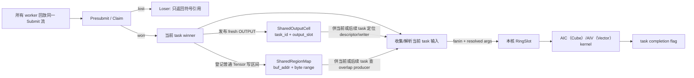
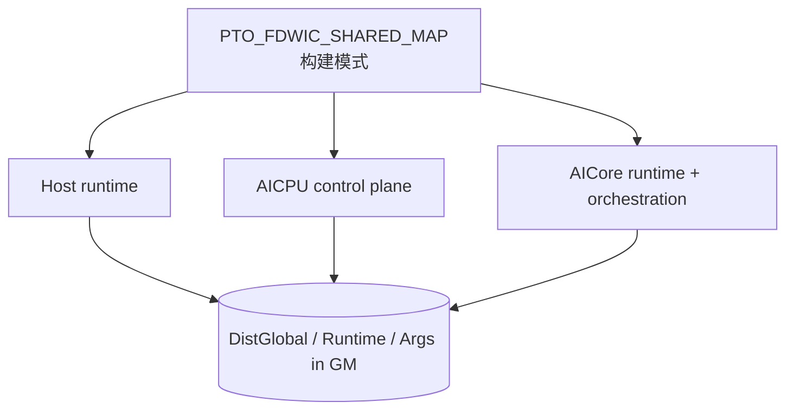
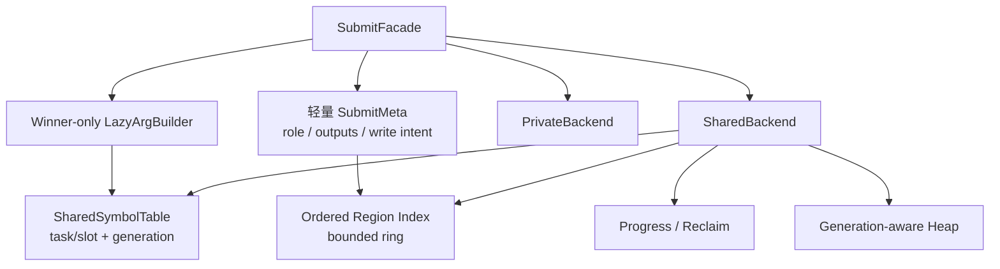

# A5 FDWIC Shared TensorMap 分支架构审查记录

本文审查
[`poursoul/simpler:fdwic-shared-tensormap`](https://github.com/poursoul/simpler/tree/fdwic-shared-tensormap)
在 A5 FDWIC runtime 中实现的 shared TensorMap 方案，并与当前分支 standalone
方案比较。本文用于后续开发决策，不表示目标分支已经合入，也不把分支文档中的
实验记录自动当成当前分支的性能结论；当前分支 S0～S4.14 的实际实施证据另记于
第 15 节。当前继续开发和验收的后端范围固定为 CPU/CCEC。

后续每个实现小步都必须先对照参考提交：可直接复用的机制要说明复用位置；
有意不同的顺序、ABI、失败语义或性能取舍要在本文记录证据和复核条件，不能只
留在代码或会话里。参考代码“基本流程已跑通”本身是正向证据；暂不照搬某项
机制只表示当前小步需要隔离变量，不表示否定其架构价值。

## 1. 审查快照与证据口径

| 项目 | 本次固定值 |
| ---- | ---------- |
| 审查日期 | 2026-07-24 |
| 目标提交 | `2866ad73b4f15a4f6fa292af5b7d546e8f972f8d` |
| 当前分支提交 | `1726a774826b20f14fbd8c8fcfb54cdbc525f49f` |
| 两分支 merge-base | `599703f5b153a3a0fd2a3516dff4efd49be3f00a` |
| shared 功能序列首提交 | `67d9d186` |
| 首提交父提交 | `f5da1a2e` |
| 重点审查差异 | `f5da1a2e..2866ad73`，42 个文件 |

目标分支和当前分支在较早位置已经分叉。若直接审查
`HEAD...poursoul/fdwic-shared-tensormap`，会把 131 个文件的两边独立演进都
误算成 shared TensorMap 改动。因此本文以 shared 功能序列的父提交
`f5da1a2e` 为功能基线，同时用当前分支
`docs/fully_distributed_within_core.md` 第 12 章校准预期协议。

本文使用四种证据标记：

- **代码事实**：可由目标提交源码直接证明；
- **本次验证**：本机执行过编译探针或 Git 检查；
- **分支记录**：目标分支文档记录的 sim、上板或性能结果，本次没有重跑；
- **审查推断**：由并发顺序和状态不变式推出，仍应由定向测试验证。

本次没有修改目标 worktree，没有重跑 A5/A5sim 全量用例，也没有复测目标分支
性能。实际执行了 private/shared 布局探针和 profile-off 头文件编译探针。

## 2. 先给结论

这份实现不是“把现有 per-core TensorMap 换成一份共享 ring”，而是一套
**性能优先的双通道依赖协议**：

1. fresh `OUTPUT` 使用 `(producer_task_id, output_slot)` 直接索引
   `SharedOutputCell`；
2. 普通 Tensor 或既有 Tensor 的重叠写依赖使用 append-only
   `SharedRegionMap`；
3. shared API 支持把 Claim 提到重参数构造之前；PA 调用点把完整参数构造放入
   `tok.won` 分支，loser 只返回符号引用。其他调用点若在 presubmit 前已经构造
   `L0TaskArgs`，并不会自动获得这部分收益。

这个方向有真实价值。尤其是 winner-first、PA loser 轻路径、fresh output 的
O(1) 符号定位、显式 DCache flush/invalidate，以及 MIX follower 由 winner
统一解析输入的基础机制，都值得复用。

但它目前还不适合作为最终 shared TensorMap 整体移植，主要阻断点是：

1. private/shared 会生成 ABI 不兼容的三镜像，但构建缓存身份没有包含模式；
2. writer intent 是调用方可选 API，真实 PA 的 INOUT 路径没有使用它；
3. shared heap、region map 和 task table 没有 generation、reclaim 和可证明的
   有界复用协议；
4. shared 模式下 `fatal_set()` 恒为 false，容量错误可能退化成永久轮询；
5. shared output 每 task 物理上限为 8，但公共接口允许构造最多 32 个输出。

因此建议是：

> 不整段 cherry-pick。先复用“winner-first + 符号引用 + 显式缓存维护”的设计
> 资产，再把构建身份、写入顺序、generation/reclaim、错误传播和容量断言补成
> 可证明的协议，最后迁移 PA。

## 3. 目标分支的实际逻辑架构

### 3.1 它是两个索引，不是一张共享 TensorMap



核心状态位于
`src/a5/runtime/fully_distributed_within_core/runtime/dist_engine/common/state.h`：

| 状态 | 组织方式 | 当前语义 |
| ---- | -------- | -------- |
| `shared_outputs[kFlagCap]` | task id 直达数组 | fresh output descriptor 与最新 writer |
| `SharedOutputCell::published[8]` | 每项独占 cacheline | descriptor 发布完成标志 |
| `SharedOutputCell::last_writer[8]` | 每项独占 cacheline | INPUT/INOUT 的 writer 链 |
| `SharedRegionMap::buckets` | 8192 个桶头 | 普通 Tensor 地址哈希 |
| `SharedRegionMap::entries` | 65536 个 append-only entry | 重叠 byte range 及 producer |
| `shared_heap_cursor[8]` | task id 分片 | winner 输出 heap 分配 |
| `tasks[kFlagCap]` | 65536 个 task cell | 完成、vend、依赖准备标志 |

因此“shared map”这个名字容易造成误解：

- fresh output 根本不进入 region map；
- region map 不是 ring，没有 per-slot `seq`，没有回收；
- task id 达到 `kFlagCap=65536` 时直接报错，不支持代际复用；
- 零输出 task 仍必须发布 task completion；它只是不需要发布
  `SharedOutputCell` 或 region delta，因为实现里没有全局 map append 前沿。

### 3.2 fresh output 快路径

producer winner 的关键顺序在
`runtime/dist_engine/aicore/submit_core.h:668-759`：

```text
reserve shared heap
  -> for each output:
       materialize Tensor descriptor
       copy descriptor to SharedOutputCell.tensors[slot]
       CCEC flush descriptor + DSB
       fetch_max(last_writer, producer_task_id)
  -> after all outputs: store_barrier
  -> for each output:
       release publish published[slot] = producer_task_id
```

在 PA 这类把参数构造放到 `tok.won` 后的调用点，loser 不构造
`TensorCreateInfo` 和完整参数，只通过 `rt_submit_loser(tok, output_count)`
返回 `FdwicOutputRef`。`shared_symbol_smoke` 和 `submit_dependency_smoke`
部分 wrapper 在 presubmit 前已有完整 `args`，不能把这项收益外推到所有调用点。
引用本身包含 `producer_task_id`、`output_slot` 和有限的一维 view 信息。

consumer winner 的行为是：

- `INPUT`：读取 `last_writer`，无有效 writer 时回退到原 producer；
- `INOUT` / `OUTPUT_EXISTING`：对 `last_writer` 做
  `atomic_exchange(current_task_id)`，返回旧 writer 作为 fanin；
- resolve：等待指定 `published[slot]`，invalidate descriptor cacheline，
  再把 Tensor descriptor 拷入执行侧 `RingSlot` 或 `BuiltSubtask`。

这里的两个目标槽只有 ABI 形状相似，resolve 时机并不相同：普通
`RingSlot` 会先 try-resolve，并允许未就绪引用留到执行前；winner follower
构造 `BuiltSubtask` 时则同步阻塞解析，当前 mask 固定为 0。

相较统一 region lookup，这条路径的优势明确：

- 索引为 O(1)，没有桶扫描；
- loser 不必等待全局 task 发布前缀；
- descriptor 身份与逻辑 writer 分开；
- producer materialize 较晚时，`fetch_max` 不会覆盖已经到达的更大 writer。

### 3.3 普通 Tensor 的 region 慢路径

普通 Tensor 的地址依赖由
`submit_core.h:854-940` 处理：

1. 按 buffer 地址选 bucket；
2. 遍历单向 entry 链；
3. 对每个 entry 做 CCEC invalidate；
4. 在重叠区间中选择 `producer < current_task_id` 的最大 producer；
5. writer 使用 `high_water.fetch_add()` 取得永久 entry；
6. 通过 bucket 的 `-2` sentinel 独占插入，再 flush entry 并发布新桶头。

它是 append-only 表，不是当前文档第 12 章描述的
ring-per-bucket：

- lookup 窗口是所有已插入的 `< N` producer，不是 `[N-H, N)`；
- 没有 `head`、generation、per-slot `seq` 或 min-progress reclaim；
- 同一 buffer 的长写链会让 bucket 扫描不断变深；
- 容量耗尽后只能 `set_fatal()`。

`insert_lock` 字段和全局 lock helper 仍存在，但实际插入使用的是每 bucket
sentinel。它目前是死字段候选；应先完成 Host/AICPU/AICore 三镜像的 ABI、
初始化和布局审计，再单独决定清理或补充用途，不能顺手删除。

### 3.4 region intent 是可选调用协议

目标分支为写依赖增加了
`rt_presubmit_*_with_region_intent()`：

```mermaid
sequenceDiagram
    participant W as task N winner
    participant L as task N losers
    participant S as shared dependency state

    L->>S: wait deps_prepared[N]
    W->>W: collect fanin
    W->>W: register writer regions
    W->>S: publish deps_prepared[N]
    S-->>L: wait released; writer intent visible
    W->>W: continue winner build
    L->>L: continue replay
```

意图是防止 task N 的 losers 在 N 的 writer 尚未登记时继续跑到 task N+1。
但该语义没有收进 runtime 的统一入口，而是由 orchestration/codegen 判断是否
调用：

- `submit_dependency_smoke` 的 wrapper 会扫描参数 tag 并选择 intent API；
- PA 的 QK/SF/PV/Update 都调用普通 `rt_presubmit_*`；
- PA Update 甚至在 presubmit 之后、且仅在 winner 分支内才构造四个 INOUT。

这意味着 PA 无法在 Claim 前依据尚未构造的参数发布 writer intent。目标分支
计划文档也承认该能力仍依赖 codegen 显式接入。

### 3.5 MIX/joint 路径

最新代码已补上一部分 shared MIX 基础机制：

1. anchor winner 先收集 fanin 并 resolve shared descriptor；
2. fanin ready 后才发布 follower 的 `BuiltSubtask`；
3. follower 直接消费 winner 已解析的 payload，shared follower fanin 清零；
4. `joint_launch_expected/drained` 防止最终退出早于迟到的 follower launch；
5. 所有参与 lane 完成后仍只发布一个 task completion。

`0f9862a2` 和 `d618589f` 修正了 winner 侧 shared-ref resolve 以及
launch/drain 门控，但还不能称为完整闭环。目标分支文档仍列有 MIX output
publisher、MIX INOUT/OUTPUT_EXISTING、连续 MIX、容量/反压和完整 stress
缺口。准确结论是：基础 handoff 已存在，部分关键路径已修正，通用语义和压力
验证仍未完成。

### 3.6 初始化和运行生命周期

主要生命周期路径已经接通：

- host 在 runtime 创建/setup 路径预留并清零固定 runtime arena；
- AICPU register 重置 cursor、task cell、shared output flag、region bucket、
  heap cursor、joint counter、fatal 和 replay 状态；
- AICore attach 重置本核 slot/counter；
- AICPU 唤醒 worker 前 flush runtime arena；
- executor 结束后复位控制状态。

每轮 executor 正确性应依赖 AICPU 对 publication flag、bucket、high-water 等
控制状态的复位，不能依赖“每轮一定重新执行 host 全量 memset”。陈旧
descriptor/entry 本体没有逐项清零，但控制状态复位后，正常路径不会在重新发布
前消费它们。error、容量耗尽和跨代复用生命周期仍没有闭环。

非 Submit 热区有一个明显成本：AICPU 每轮会 flush 固定 1056 MiB
（约 1.1 GB）的 `dist_global` arena。它不应混进约 5 ms Submit 指标，但会
影响 case 启动时间。

## 4. 开发视图与构建边界

### 4.1 三镜像必须是同一模式

A5 FDWIC 是三个独立程序共同解释 GM ABI：



宏默认值为 0，位于 `runtime/pto_types.h:69-71`。clean build 时，
环境变量 `CXXFLAGS=-DPTO_FDWIC_SHARED_MAP=1` 原则上能传播到：

- direct sim/host/orchestration 编译；
- A5 onboard AICore 的 CCEC 自定义命令；
- AICPU 和 runtime CMake target。

但它仍只是 ambient `CXXFLAGS`，不是显式的 runtime variant。任何一个镜像
漏掉宏，都将用不同字段偏移解释同一块 GM。

### 4.2 private/shared ABI 实测

本次用目标提交真实头文件编译了两个布局探针：

| 类型或字段 | private | shared |
| ---------- | ------: | -----: |
| `TensorRef` | 16 B | 24 B |
| `L0TaskArgs` | 1,024 B | 1,280 B |
| `L2TaskArgs` | 3,840 B | 4,864 B |
| `RingSlot` | 4,864 B | 5,440 B |
| `DistCore` | 9,231,488 B | 8,464,832 B |
| `DistGlobal` | 1,007,102,208 B | 1,080,630,976 B |
| `Runtime` | 69,952 B | 70,976 B |
| `DistCore::slots` 偏移 | 823,424 | 64 |
| `DistGlobal::heap_base` 偏移 | 4,197,504 | 143,176,000 |
| `DistGlobal::cores` 偏移 | 10,101,504 | 166,429,120 |

变化来自：

- shared 的 `kPrivateSlots` 从 4 增至 14；
- shared 移除 `DistCore::map`；
- shared 在 `DistGlobal` 中插入约 128 MiB output table、region map、heap
  和 joint 状态；
- `TensorRef` union 增加 `FdwicOutputRef`。

固定 arena `0x42000000` 只保证两种布局各自不越界，不表示 ABI 相同。若把当前
private map 和 shared 状态机械组成一个 superset，估算会比现有 arena 多约
62.3 MiB，因此“直接保留两套所有字段”并不是合理修法。

更合适的结构是固定小型控制头：

```text
DistRuntimeHeader {
    magic
    abi_version
    map_mode
    profile_mode
    state_size
    backend_state_ptr
}

backend_state_ptr -> PrivateBackendState 或 SharedBackendState
```

或者把两种模式作为完全独立、带 mode/ABI tag 的 artifact family。两种办法都
比当前“字段偏移变化但无握手”可靠。

### 4.3 构建缓存会制造混合镜像

`simpler_setup/runtime_builder.py:307-329` 的 baseline runtime 缓存 stamp
只有 Git HEAD，输出目录也不包含 shared/profile 模式。与此同时，
per-callable AICore stale state 已包含 `CXXFLAGS`。

因此同一 commit 下先编 private、再改 `CXXFLAGS` 编 shared 时，可能出现：

```text
baseline Host/AICPU = 旧 private artifact
per-callable AICore = 新 shared artifact
```

目标分支文档要求切模式前手工删除
`build/cache/a5/{sim,onboard}`，正说明当前构建身份不完整。手工清缓存可以帮助
实验，但不能成为架构正确性条件。

### 4.4 profile 与 map 模式当前不正交

本次对以下两个组合做了头文件编译：

- `PTO_FDWIC_SHARED_MAP=0, PTO2_PROFILING=0`；
- `PTO_FDWIC_SHARED_MAP=1, PTO2_PROFILING=0`。

两者都在 `pto_types.h:906-908` 失败，`L0TaskArgs` 和 L2 Arg 对 64 取模均为
32。原因是 `DumpArgSelection` 被条件编译去除后，固定 padding 没有同步调整。

这与 `docs/profiling_levels.md` 给出的 profile-off 构建方式不一致，也说明
测试矩阵没有覆盖 `{private, shared} × {profile on, off}`。

## 5. 与预期架构的逐项比较

这里的“预期”由两部分组成：

1. 用户要求：以宏保留 private/shared 双模式，先保证 private 基线；
2. 当前 `docs/fully_distributed_within_core.md:1272-2068` 的协议约束：
   task-order 发布、`[N-H,N)` 查找、generation、progress/reclaim 和有界反压。

| 维度 | 原预期 | 目标分支实际实现 | 评价 |
| ---- | ------ | ---------------- | ---- |
| 默认模式 | private | 宏默认 0 | 符合 |
| 切换方式 | 明确构建模式 | ambient `CXXFLAGS` | 形式符合，工程不完整 |
| 上层 API | facade 内切后端 | public 返回类型和 submit 协议都变化 | 差异较大 |
| loser 路径 | 尽量轻 | API 支持；PA 做到 winner-only 构参 | PA 路径优于朴素预期 |
| fresh output | 可走快路径 | task/slot 直达表 | 值得保留 |
| 普通区域依赖 | 统一有界 ring | append-only bucket 链 | 不符合 |
| writer 顺序 | runtime 自动保证 task order | 可选 intent API | 不符合 |
| 发布前沿 | 零 entry task 也推进 | 没有全局 map 前沿 | 架构不同 |
| lookup 窗口 | `[N-H,N)` | 所有已发布且 `<N` 的 entry | 不符合 |
| generation/reuse | per-slot seq | 以 65536 task 硬上限规避 | 不符合 |
| reclaim | min progress 驱动 | region/output table 不回收 | 不符合 |
| heap 复用 | generation + 有界反压 | shard cursor + task frontier | 证明不足 |
| cache 可见性 | 显式 flush/invalidate | descriptor/region 已实现 | 基本符合 |
| MIX | winner 发布、follower 消费 | resolve/launch 基础机制已实现 | 部分符合，尚未闭环 |
| ABI | 稳定头或明确隔离 | 两套布局、无 mode 握手 | 不符合 |
| profile 正交 | 四组合可构建 | profile-off 两模式均失败 | 不符合 |
| A5/A5sim | 同一模式定义 | clean build 可传播，路径不同 | 部分符合 |

### 5.1 哪些差异是合理取舍

不能因为它不等于统一 ring，就把所有差异都判为错误：

- PA 的 fresh output 占主路径，用符号直达表避开 region 扫描是合理的分层；
- Claim 前移使调用点可以消掉 loser 参数构造；PA 已这样使用，但 runtime
  不会自动改写 presubmit 前已经构造的 `args`；
- descriptor identity 与 `last_writer` 分离，适合表达 fresh output 的后续 INOUT；
- 编译期产生两套后端也可以接受，前提是 artifact identity 和 ABI tag 完整；
- 零输出 task 仍发布 completion，但在直达表中无需发布空 map delta，这是
  该结构自然得出的结论。

原先“一个巨大稳定 superset ABI”的设想也应修正：实测尺寸表明机械 superset
会突破当前 arena。应追求的是**稳定控制 ABI + 模式后端隔离**，不是所有数据
字段永远同时驻留。

### 5.2 哪些差异不能只解释成性能取舍

以下内容会改变正确性或构建确定性，不能用“PA 当前能跑”代替协议证明：

- writer task 到达顺序与 `atomic_exchange(last_writer)` 顺序不一致；
- heap 物理区间复用没有 generation；
- region map 永久增长；
- shared fatal 无法被等待方观察；
- build cache 可能混合 private/shared 镜像；
- 公共 output_count 与物理数组上限不一致。

## 6. 正确性与可维护性风险

### 6.1 P0：移植前必须解决

#### P0-1 构建模式未进入 artifact 身份

三镜像 ABI 不同，但 baseline cache key、输出目录和 runtime 握手都没有
shared/profile 维度。错误组合不会明确失败，而会读写错误偏移。

**建议**：先把 mode/profile 加入所有 cache key、输出目录和 ABI header，再做
任何 runtime 移植。

#### P0-2 PA 绕过 writer-intent 顺序

shared ref writer 使用无条件
`atomic_exchange(last_writer, current_task_id)`。假设后 task M 的 winner 先于
前 task N 到达：

```text
M exchange: last_writer = M，返回旧 producer
N exchange: last_writer = N，返回 M
```

N 会依赖“未来”的 M，writer 链也被较小 task id 覆盖。producer 的
`fetch_max` 只防止 producer 晚 materialize 覆盖更晚 writer，不能解决
writer-vs-writer 的乱序。

pure INPUT 还有同源风险：它直接读取当前 `last_writer`，没有
`writer < current_task_id` 过滤，也没有历史版本。若未来 writer M 先更新，
较早 reader N 可能直接依赖未来 M，而不是 N 时刻应看到的前一 writer。

普通 region 也有同类窗口：后 task lookup 时，较早 writer 的 entry 可能尚未
insert，`producer < N` 过滤无法补回不存在的历史项。

PA Update 使用普通 presubmit，且只有 winner 才在 Claim 后构造 INOUT 参数，
所以现有 intent barrier 没有参与 PA。这个问题需要定向交错测试，不应由普通
golden 多次通过来推翻。

#### P0-3 启用 shared heap wrap 时缺少可证明复用条件

heap 按 `task_id % 8` 选 shard，再用 `fetch_add` 分配。cursor 第一圈之后仅等待
`frontier >= task_id-H`，但没有记录即将覆盖的物理区间属于哪个 task/generation。

winner materialize 顺序可以和 task id 顺序不同，因此“当前 task 已跨 H 窗口”
不能直接证明该物理区间的上一任已经无人引用。当前只检查单 task 输出不超过
shard span，也没有证明 H 窗口内同 shard 累计 live bytes 一定装得下。

对“启用 wrap 或长期复用”的实现，这是移植前 P0。若第一阶段明确禁止 wrap，
并在容量边界可靠终止，则该项可以降为通用化前 P1，但不能在没有 generation
证明时悄悄复用。

#### P0-4 fatal 写入后等待方仍看不到

`runtime_state.h:40-47` 在 shared 模式下让 `fatal_set()` 固定返回 false，而
`set_fatal()` 仍写 `g_dist.fatal`。task cap、region cap、heap retry 或 resolve
错误发生后，其他核可能继续轮询，无法可靠结束。

#### P0-5 输出上限 8 与接口上限 32 不一致

`SharedOutputCell` 的三个数组长度都是 8，但：

- `SharedTaskOutputs::add_output_ref()` 只检查 `MAX_TENSOR_ARGS`；
- `rt_count_outputs()` 可以返回大于 8；
- materialize 按实际 output ordinal 直接索引 shared cell。

第 9 个 output 起可能越界，且发生在后续 resolve 的 8 上限断言之前。

### 6.2 P1：通用化前补齐

| 风险 | 代码事实或待证点 | 建议验证 |
| ---- | ---------------- | -------- |
| task/region 容量 | task 上限 65536；region 是 65536 entry，不是 65536 task | 多区域 task 的 cap 边界 |
| external RAW | owner 无效的 external pure INPUT 确定跳过 region lookup | 查 API 禁令；无禁令则补 RAW |
| region 合并读 | lookup 只返回一个最大 producer，可能漏掉另一不重叠 writer | 两 writer + 横跨两区 reader |
| fanin 截断 | 第 17 个不同 producer 被静默丢弃 | 17 producer golden + 明确报错 |
| scalar data access | shared 下 `get/set_tensor_data` 不等待 producer | orchestration 读取前 task scalar |
| generic submit | shared 的 `dist_submit_impl()` 直接 assert | 建立统一 facade 或编译期禁用 |
| dummy submit | dummy 不分配 task id、依赖或 completion | 明确其 shared 语义 |
| view | `FdwicOutputRef::view()` 只允许 1D | 多维/嵌套 view |
| view 并行度 | `last_writer` 粒度为整个 output slot，不区分不重叠子 view | 两子 view 并行写的依赖图 |
| atomic 顺序 | CCEC wrapper 丢弃 `memorder` 参数 | 查 A5 ISA 文档并做微基准 |
| initial value | 写输出 data 后未见同等级显式 data flush | 上板 producer/consumer 可见性测试 |

external RAW 的代码行为已经明确：owner 无效的 external pure INPUT 会跳过
region lookup。待证的是公共 API 是否明确禁止“external Tensor 先作为 INOUT，
后作为 pure INPUT”。若没有该禁令，这就是语义缺口，不只是测试不足。

region map 还有一个独立的表达能力问题：假设 task A、B 分别写同一 buffer 的
两个不重叠子区，task C 再读取横跨两区的范围；如果 A、B 之间没有传递依赖，
lookup 只返回最大 producer B，不能保证 C 同时等待 A。应在决定 region 数据
结构前先用定向 golden 固定“一个读取区间是否允许需要多个 producer”的语义。

shared-ref view 则偏向保守：`last_writer` 的粒度是整个
`(producer_task_id, output_slot)`，两个不重叠一维子 view 的写也会串在同一
writer 链上。它通常不破坏结果，但会比普通 region byte-range 语义损失并行度。

### 6.3 P2：性能和工程清理

- `SharedRegionMap` 同桶链越长，lookup 的 invalidate + DSB 次数越多；
- shared 模式把私有 slot 从 4 增到 14，`drain_phase_b()` 的扫描地板上升；
- cursor 分片减少相邻 task 的 cacheline 冲突，但同一 task 的所有候选仍竞争
  一个 atomic；
- 同一个 shared ref 重复出现时，descriptor resolve/invalidate 可能重复；
- shared heap 同时付出 shard cursor 和全局 vend 两次原子更新；
- 1056 MiB runtime arena 的全量 reset/flush 影响启动；
- `worker_state.h` 中巨大的 fallback `DistGlobal` 会增加 BSS/虚拟地址压力；
- 宏分散在 runtime API、state 和多个业务 orchestration 中，后续维护成本高。

## 7. 性能证据应该怎样解读

目标分支文档记录：

- shared PA Case1 上板生成过
  `outputs/TestPagedAttentionUnroll_Case1_20260723_150651/merged_swimlane.json`；
- 脚本记录的 `global_span_us` 为 `2285.352 us`；
- 按需 EfDrain 前后约为 `2.540 ms -> 2.318 ms`；
- 错误的全局 prefix 退出方案曾把约 `2.3 ms` 劣化到约 `7.2 ms`。

这些是**分支记录**，不是本次验证。目标分支没有提交对应 raw/swimlane artifact，
所以本次无法重新计算事件数、统计窗口和 instrumentation 开销。

它也不能直接与当前分支约 5 ms 的 PA 基线相减，原因包括：

- 两分支从较早提交分叉，runtime 和 PA orchestration 不同；
- target 使用 winner-first shared API，当前基线仍有另一套观察代码；
- 目标脚本的 `global_span_us` 是所有 `ph == "X"` 事件的最早开始到最晚结束，
  不是严格的“首个 Submit 入口到最后一个 Submit 返回”；
- 目标数字来自带 L2 swimlane 的 shared ELF，不能与当前 perf-clock、普通
  swimlane 或 atomic-swimlane ELF 互减；
- 目标记录缺少可复算 raw 证据。

合理表述只能是：

> 目标分支记录表明该结构有较强性能潜力，尤其 loser 轻路径已经改变了复杂度；
> 但不能据此宣称相对当前 5 ms 基线获得确定百分比收益。

目标提交的多个 commit message 还分别记录了 `2285.352`、`2299.227`、
`2330.192` 和 `2293.923 us`。这些是不同提交的单次作者记录，不是同一版本的
重复样本，不能据此计算 median、min/max 或置信区间。

时钟口径也不能混用：目标泳道的 SYS_CNT raw tick 为 1 ns，换算基准为
1 GHz；这不是 scalar core 主频。约 1.65 GHz 是本机校准得到的 PMU cycle
频率。converter 已按 raw metadata 换算 SYS_CNT，不能再用 1.65 GHz 对目标
分支的 2.3 ms 做二次缩放。

迁移时仍应固定三条互不混算的证据链：

1. `perf-clock`：决定候选保留或撤销；
2. `swimlane`：解释业务区域和 atomic 变化；
3. `submit-pmu`：辅助解释 scalar busy、I-cache request/miss。

三种 ELF 只做同类前后对照，不能跨构建直接相减。

## 8. 测试证据与证明边界

### 8.1 已有覆盖

| 测试 | 数量/平台 | 主要覆盖 |
| ---- | --------- | -------- |
| `shared_symbol_smoke` | 11 例：7 个 sim-only、4 个 manual A5 | AIC/AIV 跨角色、双输出 slot1、heap shard、dual AIV |
| `submit_dependency_smoke` | 84 例：38 sim、45 A5、1 双平台；46 manual | INOUT、overlap/view、alloc、heap、DCCI、长链 |
| `simple_orch_smoke` | 24 例：12 个 sim-only、12 个 A5-only；14 个 manual | joint、WonSlot、基础 orchestration |
| `benchmark_bgemm` | 7 例；当前只算 private/default 相关基线 | orchestration 未适配 shared 新 API，不能算 shared 覆盖 |
| PA | 3 例均声明双平台；Case2/3 为 manual | 真实业务 golden；Case1 是分支性能工作负载 |

前三类 smoke 和 PA 调用生产 runtime，不是脱离实现的模型测试，这是优点。
`benchmark_bgemm` 仍直接使用 shared 宏下不存在的旧 submit API，当前只能列作
private/default 相关工作负载，不能包装成 shared 集成证据。

### 8.2 当前证据仍不能证明什么

1. Python case 没有设置或断言 `PTO_FDWIC_SHARED_MAP=1`。宏默认 0，
   `shared_symbol_smoke` 还有 private fallback；测试名字本身不能证明产物是
   shared build。
2. 可信的 shared 结果依赖外部 `CXXFLAGS` 和手工 clean cache。
3. 许多 A5 case 标记为 manual；默认 CI 不等于执行了硬件矩阵。
4. delayed region intent 的 mode 32/33 只有 sim，没有对应 A5 case。
5. sim 不能证明 A5 非一致缓存、DCCI/DSB 和原子竞争语义。
6. 没有生产协议的确定性交错单测，也没有负向容量测试。

至少还缺：

- 9 个 output；
- 17 个不同 fanin；
- task/region cap 边界；
- heap shard 多次 wrap；
- stale generation ref；
- writer task 逆序到达；
- reader task 与未来 writer 逆序到达；
- 两个独立 writer 后的合并区域 reader；
- external INOUT 后 pure INPUT；
- fatal 后所有核有限时间退出；
- shared/profile 四组合构建；
- private/shared 镜像 mode 不一致时的显式拒绝。

## 9. 目标分支文档自身的一致性

两份设计文档各有价值：

- `high_perf_shared_map_plan.md` 较准确地记录了 winner-first 目标、手工 clean
  cache、task cap 和 intent 仍依赖 codegen 等限制；
- `current_shared_map_runtime_design.md` 对数据结构和性能演进写得很完整。

但后者不能完全作为最新代码真相：

- 开头称 MIX 未闭环的总判断仍成立；最新两个提交缩小了 follower
  resolve/launch 方面的具体缺口，但没有完成通用 MIX 语义；
- 第 9 部分引用的一批短 commit id 在当前目标提交对象库中不存在，可能来自
  rebase 前历史，无法直接追溯；
- 文档对 `last_writer` 的顺序解释默认了 writer 按 task id 到达，没有覆盖 PA
  绕过 intent 的实际调用方式；
- 性能数字只有文字记录，没有随分支提交 raw artifact。

后续开发文档应固定“代码提交 + 原始证据目录 + 生成命令”，避免设计说明和实际
分支继续漂移。

## 10. 建议的目标架构

建议保留双通道思想，但把它放入一个有统一正确性底座的结构：



关键设计点：

1. **统一 facade**：业务代码不直接散布 private/shared 的返回类型和流程宏。
2. **轻量元数据与重参数分离**：Claim 前能获得 role、output_count 和写意图，
   winner 后才构造完整 `L0TaskArgs`。
3. **fresh symbol 作为优化层**：继续保留 O(1) task/slot 定位；完整 resolve
   仍可能等待 published，并执行 invalidate、DSB 和 descriptor copy。
4. **writer 顺序由 runtime 保证**：不能让调用方选择是否正确。
5. **有界 region backend**：使用 task-order delta + per-slot generation，
   或另一套能证明 writer 全序的协议。
6. **统一 progress/reclaim**：region、symbol generation、heap 复用共享同一组
   可证明的活跃窗口约束。
7. **稳定控制 ABI**：mode/version/size 可在 Host、AICPU、AICore 启动时互检。

writer intent 的实现需要在开发前明确二选一：

- **方案 A，推荐**：轻量 `SubmitMeta` 在 Claim 前表达写集合，由 runtime 按
  task id 发布 dependency delta；零 delta 也推进 sequencer。
- **方案 B**：设计 per-object 的有序 writer CAS/版本协议，证明乱序 winner
  最终仍形成 task-id 顺序。

当前无条件 `atomic_exchange(last_writer)` 加可选 intent barrier 不能作为最终
方案。

## 11. 分阶段移植计划

每一阶段独立提交，上一阶段验证通过后再进入下一阶段。实施顺序固定为：

> 先在 `tests/atomic_probe/pa_scheduler` 完整证明，再迁移到
> `src/a5/runtime/fully_distributed_within_core` 和真实 PA。standalone 尚未
> 闭环时，不允许用“顺便对接真实路径”扩大修改面。

### 阶段 S0：standalone 构建身份和 ABI

**状态：已完成；当时的临时 shared fail-closed 门禁已在 S2 删除。**

- `run.sh` 增加 first-class `--tensormap private|shared`，默认 private；
- CCEC、AscendC、CPU 构建都显式传
  `PTO_FDWIC_SHARED_MAP=0/1`，产物目录包含 backend、mode 和诊断 variant；
- CCEC host、AIC/AIV、callback runtime、callback finish 必须属于同一模式；
- `RunConfig` 使用原有尾部空间保存 magic/version/mode/`sizeof(SchedulerState)`；
- CCEC swimlane、submit-pmu manifest 都记录模式并校验整套产物；
- 修复 PMU 配置使用 `reserved[4]` 越过 `RunConfig`、覆盖
  `WinnerWorkloadConfig::mode` 的问题，改为独立 cache-line sidecar。

**Gate**：默认 private 的 CPU b1 全断言不变；脚本语法检查通过；S0 当时
shared backend 尚未接入，必须在编译期明确失败；故意混用模式或校验和必须在
启动前失败。S2 接入真实 shared sidecar 后只删除临时 fail-closed，模式隔离和
混用拒绝继续保留。

### 阶段 S1：standalone private map 先同构为 ring

**状态：已完成。**

- 保持 `TensorMap=823312 B`、`WorkerState=9231296 B`，并保持 standalone
  private DistCore 中 map、ring slot 和 payload 的既有 size/offset；
- 把 private linked map 改为 128 buckets × 128 slots 的
  ring-per-bucket，总 entry 容量仍为 16,384；
- `MapEntry` 保持 48 B，后 16 B 只作 ABI 保留，本阶段不引入 shared seq；
- private 仍然每 worker 独占，不引入 atomic，不同时改构参、heap 或输出引用；
- 每桶 `head/tail` 为普通 `uint64_t`；`AdvanceTensorMap` 用逐 task 精确计数
  推进 logical live window，`RetireBucket` 在该桶下一次 lookup/insert 时
  惰性推进物理 head；
- lookup 扫描全部合法槽并取最大 producer，保留
  `producer >= alive_floor` 边界；
- 用统一的逻辑记录 `(buffer_addr, lo, hi, producer)` 作为后续
  private/shared 对比口径；
- insert/register 逐层返回 bool；满桶不覆写、不推进 tail，由 Submit 发布
  fatal，禁止静默漏依赖。

**Gate**：逐 task fanin 与旧 private 一致；Case1 保持每 batch 5 条 fanin、
每 worker 每 batch 4 次 region insert；定向覆盖窗口边界、同地址区间重叠、
retire、容量耗尽和复用；容量不足必须显式失败，不能静默漏依赖。当前这些
检查均已通过，详细验证记录见第 15 节。

### 阶段 S2：standalone shared 有序 ring

**状态：已完成全核强一致正确性基线；其性能问题已由后续 S2.5 定向处理。**

第一版 shared 只切换 map 的副本数、写入主体和并发纪律，暂时保留 eager 构参和
每核 private heap，避免在一个提交里同时改三个协议面：

- 在完整 production prefix、standalone controls 和 `results` 后追加 64B 对齐、
  2,119,808 bytes 的 shared sidecar，不移动 WorkerState 或既有控制/结果 offset；
- sidecar 保存连续 task commit 前沿、全局 reclaim 前沿、96 条每核 progress、
  128 组分离 cache line 的 head/tail 和 16,384 个共享槽；
- shared 只有 winner 追加 region，零 insert task 也必须提交空 delta；这里的
  winner-only 不包括构参和 Materialize，它们在 S2 仍由所有 worker eager 执行；
- task N lookup 前所有 worker 必须观察到前 N 个 task 连续 commit；winner 完成
  整 task append 后发布 N+1，loser 等待 N+1，随后所有 worker 精确发布 progress=N；
- lookup 只接受 `producer ∈ [max(0, N-H), N)`；
- slot 的 payload 和绝对 `seq` 各占一条 cache line。writer 先失效旧 seq，
  写 payload 并 DCache flush，再发布 seq/tail；reader 原子读 seq、invalidate
  payload、拷贝快照、再次原子读 seq，双检失败即协议错误；
- reclaim 由 `min(core_progress)-H-1` 单调推动；
- 整 task 在任何写入前完成容量预检，普通容量不足保持 all-or-nothing；
  overflow/fatal 对所有等待者可见，等待路径带 watchdog，并可协作 drain；
- host D2H 后独立验证 commit/progress、bucket cursor、seq/payload/hash、
  producer 和最终逻辑窗口，不依赖 device 汇总计数自证。

**Gate**：每 task 恰好一次 commit，最终 sequencer 等于 task_count；逆序 winner、
慢核 progress、零 entry task、seq wrap、future/stale 过滤、tiny-cap overflow
全部通过；private/shared 的规范化 logical-map signature 和全局 dependency
signature 一致。CPU b1/b256 与 CCEC A5 b1/b256 已通过该 Gate；详细证据和
性能边界见第 15 节。

### 阶段 S2.5：ordered-winner reclaim

**状态：已完成 CPU/CCEC b1/b256 闭环；后续实现按当前开发范围不再以
AscendC 为阶段出口。**

S2.5 只改变 sequencer 与 reclaim，不提前混入 fresh symbol、winner-only
Materialize 或 shared heap：

- 只有 task N 的 winner 等待 `committed_tasks == N` 并读取 shared map；
  loser 不再等待 N/N+1，也不发布 per-core progress；
- winner 完成本 task lookup 后，以当前 exact turn 推导
  `reclaim_upto=max(-1,N-H-1)`；因此 sidecar 删除 96 条 progress line，
  从 2,119,808 bytes 缩减为 2,113,664 bytes；
- reclaim refresh 首先验证 exact turn，陈旧、未来或试图回退 reclaim 的
  actor 在任何共享写入前失败；
- 整 task preflight 后若仍容量不足，立即 fatal。当前 turn 的可回收边界
  已经固定，不再等待不可能扩大该边界的慢核进度；
- 零 entry task 仍由唯一 winner 推进 commit 和 reclaim，保证 task-order
  sequencer 连续。

**Gate**：b256 精确达到 `committed_tasks=1280`、
`reclaim_upto=1214`、1,024 次 append、52 条逻辑 live entry；依赖签名
`b7d985d6edb07078` 与逻辑 map 签名 `556bec7ec8d0f323` 均保持不变。
定向测试覆盖 ordered reclaim 边界、逆序 actor、零 entry、三圈绝对 seq、
满桶及“回收 stale 后仍满”的 all-or-nothing。验证和性能数据见第 15 节。

### 阶段 S3：standalone fresh symbol 与 winner-only

S3 继续拆成两个独立提交，不能同时改变引用 ABI 和分配主体。

**S3.1 状态：已完成 CPU/CCEC b1/b256 闭环。**

S3.1 已按参考实现接入 16B `FdwicOutputRef`、8B
`SharedTaskOutputs` 和每 task 2,048B 的 `SharedOutputCell`：

- 本小步仍保留所有 worker 构参和 Materialize，只有 winner 把 8 类 fresh
  output descriptor 发布到 shared cell；
- symbol resolver 只接收 plain ref；INPUT 读取 `last_writer`，三个 Alloc
  INOUT 以返回旧值的 Exchange 声明当前 writer；
- symbol 与 `manual_dep=true` 的 output view 都跳过 region lookup/register，
  因而 Case1 shared region insert 已从 4/batch 精确变成 0；
- 仍保留 S2.5 ordered winner turn，避免把当前 Case1 的单 writer 事实误推广成
  任意多个 INOUT writer 都可乱序。

**S3.1 Gate**：b1/b256 fresh descriptor 发布为 8/2,048，symbol INPUT
load 为 5/1,280，symbol INOUT Exchange 为 3/768，region insert 为 0/0，
fanin 仍为 5/1,280；依赖边和规范化 writer 签名保持与 private 一致。
CPU private/shared b1/b256、定向 sanitizer、Python 100 项和 CCEC
private/shared b1/b256 均通过。此步没有引入 generation、deferred resolve、
shared heap 或 winner-only Materialize；详细结果见第 15 节。

以上是 S3.1 当时的实现与门禁，不是当前协议。S4.5 已把 symbol 解析改成
只读，把 INOUT writer 更新移动到本地执行状态成功建立之后，并用返回旧值的
FetchMax 做构建后提交；当前统计名也已改为 `inout_writer_commits`。

**S3.2 状态：S3.2a shared heap/winner-only Materialize 与 S3.2b
winner-only 重构参均已分别完成 CPU/CCEC 闭环。**

S3.2 继续拆开验证分配主体与构参主体。第一小步只把 Materialize 和堆分配
收敛到 winner，所有 worker 仍保持 S3.1 的 eager 构参；第二小步再把
QK/SF/PV/UP 的重参数构造收敛到 winner，Alloc 保留全核轻参数路径。
shared heap 首版使用 8 shard 绝对递增分配，默认 b256 每 shard 需求
25,821,184B，小于 32MiB shard span；临近 wrap 时显式失败，不能用尚未
证明的 generation 覆盖旧 descriptor。

**S3.2a Gate**：private 工作量计数保持原值；shared 全局 Materialize output
从 b1/b256 的 768/196,608 精确降为 8/2,048，shared heap vend 为
806,912/206,569,472 bytes，region insert 保持 0；CPU 定向测试和 CCEC
A5 b1 当前最终 ELF 已通过；CCEC b256 的规模证据在非法输入预检加固前已
通过，最终 ELF 按后续只跑 b1 的约定没有重复消耗上板时间。

**S3.2b Gate**：shared 的 Alloc 仍保留全员 3 个静态 Output 参数，
QK/SF/PV/UP 的 reset、view/CreateInfo、tensor/scalar 添加只由 winner
执行。全局每 batch 精确闭合为 307 tensor args、9 scalar args、4 reset、
2 view、2 dynamic CreateInfo；Materialize 仍为 8 个 output。CPU guard-page
锁定公共 split-finish loser 路径不访问上一 task 的陈旧 args；CCEC 侧
另由 winner 分支源码审计和 b1 集成回归取证。CCEC split private/shared
均完成编译，shared split 与 inline Materialize/Register 分别通过 b1
运行门禁。

### 阶段 S4：standalone CPU/CCEC 验收

- CPU 用于确定性交错、ABA、容量和逻辑 differential 测试，不作为 A5 性能证据；
- CCEC 先做 b1 正确性和泳道，再做一次 b256 阶段出口验证；
- 性能继续分开使用 `perf-clock`、`swimlane`、`submit-pmu` 三条证据链；
- 新增等待轮询使用聚合记录，不能把约 300 MiB raw 继续无界放大。

**Gate**：private/shared 产生同一 PA Case1 task/fanin/kernel/completion 拓扑，
shared 没有 future/stale 依赖、silent overflow 或永久等待；同构 `perf-clock`
结果达到可迁移标准。目标分支的 2.3 ms 只作为潜力参考，不作验收阈值。

#### S4.1 独立 `perf-clock` 证据链

2026-07-24 先补齐了此前缺失的 standalone 低扰动性能构建。它不是在
swimlane ELF 上运行时传 `--no-swimlane`：后者仍会保留各阶段
`TraceTimestamp` 和 atomic 包围计时。新变体使用独立
`PA_BUILD_PERF_CLOCK=1`，并在编译期统一消去：

- 普通阶段记录、PollBatch、atomic 开始/结束时间及返回依赖观察；
- phase-profile 累计；
- submit-PMU counter reader 与 owner；
- Kernel/Commit、startup/final lifecycle 和 ClockBaseline 计时。

首个 Submit 在 `BeginCallbackSubmit()` 已确定 task 0 后、EfDrain 前调用
专用 `PerfClockNow()`；末个 Submit 在 register/winner 或 loser 尾动作、
`submits++` 之后、返回前调用第二次。结果继续复用既有
`WorkerResult::submit_begin/submit_end/submits`，没有扩大 trace buffer 或
增加逐 Submit 记录。S4.1 当时的 shared exact-turn 与 startup 屏障都保留
时间 watchdog；S4.6 已删除前者，当前只剩 per-slot symbol 等实际等待和
startup 屏障使用同类 watchdog。每个等待窗口先读取一次超时起点，之后每
1024 次未完成轮询复查一次。它是正确性超时，不属于新增性能观察，因而只声称
“每核两个专用性能边界”，不声称最终 ELF 物理上只会读取两次系统时钟。

构建身份 ABI 从 3 升到 4，并复用 `PmuProbeConfig` 的一个保留槽加入
`swimlane=1 / submit-pmu=2 / perf-clock=3` 握手。这样即使绕过
`run.sh` 和 manifest，host/kernel 变体不一致也会在解释 worker 状态前
fail-closed。CCEC perf-clock 保持现有 split-finish 形状，只生成
host/kernel 两件套；最终 ELF 不得含 `WritePollBatchRecordRaw`，也不放置
会改变后续热函数 I-cache 对齐的可执行 marker。CPU 使用独立产物目录，并逐线程断言专用
性能时钟恰好调用 2 次、全局共 192 次；CPU 仍不作为 A5 性能证据。

本小步先按既定规则只做 b1 门禁：

| 门禁 | 结果 |
| --- | --- |
| CPU private/shared perf-clock 严格构建 | 系统 g++ 13.3.0 下全部独立自测 PASS |
| CPU private/shared b1 real-compute | 96 核、每核 5 Submit、专用读钟 192/192、全部语义与数值断言 PASS |
| CCEC private/shared mixed ELF | split caller/runtime/finish、无 trace writer、LOCAL helper、无残留 relocation、manifest 全部 PASS |
| CCEC private b1 real-compute | 最终代码全部断言 PASS；单个结构样本 `66.620 us` |
| CCEC shared b1 real-compute | 最终代码全部断言 PASS；单个结构样本 `81.714 us` |
| 既有普通构建回归 | CPU private 与 CCEC private swimlane b1 全部断言 PASS |
| 既有 submit-PMU 回归 | CCEC private `none` 构建、96 核身份/窗口、PMU 清理与 b1 语义全部 PASS |
| 变体交叉运行负向门禁 | perf-clock host 搭配 swimlane kernel 被 ABI4 `build_variant` 握手拒绝 |

两个 CCEC 数值来自不同 ELF 的各一个独立 b1 进程，只证明边界和产物可用，
不能据此判断 shared 快慢。正式性能结论仍需冻结两份 perf-clock ELF 后做
平衡顺序的 b256 private/shared 配对；swimlane 与 submit-PMU 只负责解释，
不得和 perf-clock 的绝对时间互减。当前 S4 尚未因为这两个 b1 样本而宣告完成。
本阶段只实现和验收 CCEC、CPU 两条路径，不新增 AscendC perf-clock。

#### S4.2 `perf-clock` 规模门禁否定全局 exact-turn

冻结 `bb482001` 对应的 private/shared CCEC perf-clock 两份 ELF 后，先按
`private -> shared -> shared -> private` 做独立进程交错。b1 全部语义断言
通过：

| 模式 | 两个独立 b1 样本 | 平均值 |
| --- | --- | ---: |
| private | `65.808 us`、`67.343 us` | `66.576 us` |
| shared | `77.823 us`、`78.893 us` | `78.358 us` |

shared b1 平均多约 `11.783 us`，即 `17.7%`。这个结果只说明短序列差异
方向稳定，不能替代规模门禁。

同一组冻结 ELF 随后只做一轮 b256 ABBA。private 两次均通过，分别为
`3.810849 ms` 和 `4.920407 ms`；shared 两次都不是性能样本：

| shared 样本 | watchdog 退出 | `committed_tasks` | 语义 |
| --- | ---: | ---: | --- |
| 第一次 | `2.006839 s` | 19 | FAIL |
| 第二次 | `2.008819 s` | 29 | FAIL |

两个失败都恰好命中 2 秒 watchdog。96 个 worker 全部未完成，最快与最慢
worker 的 Submit 进度相差 116，且很多 future winner 已经取得 Claim。
因此这不是普通的 Claim 漏选，而是当前结构形成了 winner convoy：

1. 分片 Claim 允许快核提前取得 future task；
2. winner 随后在原调用栈等待全局 `committed_tasks == task_id`；
3. shared loser 不等待并继续前冲，最终更多 winner 占住 worker；
4. CCEC `SpinHint()` 为空，所有 future winner 持续对同一 cache line 发
   atomic load，下一 turn 的 winner受到严重争用和饥饿；
5. Case1 的 region ring 明明恒为空，shared heap、descriptor 发布、symbol
   resolve 和 register 仍被放进同一条全局串行链。

参考分支的高性能设计已经明确禁止该结构：fresh output 按
`(producer_task_id, output_slot)` 独立发布，consumer 只等待自己实际消费的
symbol；ordinary region 才进入 bucket 局部协议，不能在 shared winner
入口统一等待全局发布前缀。当前 standalone exact-turn 既与该目标冲突，
也已被 b256 反例否定，不能迁移到真实 simpler。

后续修正按以下独立小步推进：

1. 先把 fresh descriptor 提前到 winner 物化后独立发布，并让 symbol
   resolver 只等待实际 producer slot；保留 watchdog 和逐字段校验；
2. 把 shared heap 的 8-shard FetchAdd 改成允许合法并发 allocator，
   删除只在“全局唯一 writer”前提下成立的预检快照与回滚；
3. PA Case1 的 region entry 数必须继续严格为 0，并绕过全局 ordered
   sequencer；非空 region 在 bucket 局部并发协议完成前显式拒绝；
4. 依次通过 CPU 定向测试、CCEC b1、CCEC b256 语义与签名，再重新做
   private/shared perf-clock 交错比较。

S4 因此保持未完成。当前优先级是修复 shared 长序列活性，而不是根据失败的
b256 运行估算性能；本阶段范围仍只有 CCEC 与 CPU。

#### S4.3 fresh symbol 从全局 ordered commit 中拆出

第一项结构修正只拆 fresh descriptor 的发布与消费，不同时改 shared heap
或 region ring，避免把多个并发协议混进一个提交。以下顺序是 S4.3 当时的
中间状态，随后已由 S4.5 的“构建后封口”协议替代：

- winner 完成 descriptor 物化后，立即按 `(producer_task_id, output_slot)`
  发布 `TensorDesc`、`last_writer` 和 `published`；
- `AppendSharedTaskOrdered()` 不再代发 fresh symbol，只保留 ordinary region
  delta 与旧全局 commit；
- consumer 解析真实 `FdwicOutputRef` 时先读取对应 `published` cell。已就绪
  快路径只做一次 atomic load；只有首次观察到 `-1` 才读取 watchdog 起点，
  随后只轮询该 producer/slot，每 1,024 次复查 fatal 和 2 秒超时；
- 任意非 `-1` 且非预期 producer 的值都按协议错误 fail-closed，不能退回
  ordinary region 查找掩盖 symbol 状态破坏。

S4.3 当时的 descriptor 发布继续落在 `Materialize` 业务区间。泳道的
`TracePhase::Materialize` 与 submit-PMU 的 `materialize` 起止点同步覆盖
descriptor 构造、DCCI flush 和 `published` 原子发布，避免分段泳道已经计入
发布、I-cache 窗口却提前关闭的边界错位。

CPU 新增确定性延迟发布测试：publisher 必须等 consumer 已经至少观察一次
未发布状态后才执行发布；consumer 随后必须完成多次读取、取得正确 descriptor
与 producer fanin，且 ordinary lookup 为 0、fatal 保持 0。该测试与既有
shared symbol、ordered ring、heap、Materialize、loser stale-args 自测全部
通过，CPU shared b1 的依赖签名、heap 终态和规范化 writer 签名也全部闭合。

CCEC 使用最终代码完成以下 b1 门禁：

| 构建 | 结果 |
| --- | --- |
| shared perf-clock real-compute | 全部语义与输出断言 PASS；单个可执行性样本 `81.801 us` |
| shared submit-PMU materialize | 96/96 PMU 边界、phase shadow、owner restore/cleanup 与全部语义断言 PASS |

submit-PMU 样本中 `materialize` 为 480 次固定边界，phase time 占完整 Submit
PMU 窗口约 7.69%；该数字只验证新边界可采集且完整闭合，不用于判断结构收益。
本小步仍保留 winner 入口的全局 exact-turn，因此没有声称 S4.2 的 b256
convoy 已解决，也不运行会重复证明旧失败结构的 b256。下一小步先把 8-shard
heap 改成合法并发分配，再单独移除 PA Case1 的空 region 全局 sequencer。
在移除 exact-turn 前还必须补齐两项协议：`last_writer` 的 per-symbol 有序
更新，以及 producer 已发布 descriptor、但后续 fanin/register 失败时的
terminal abort 闭环。当前 per-slot wait 不能单独替代全局 sequencer。
本步只对 CCEC 与 CPU 做专项实现和验证，未做 AscendC 适配或验证。

S4.5 已进一步把 `published` 收紧为“producer Submit 已封口”，因此当前
Materialize 只负责 reserve 和 descriptor 构造；writer 提交、turn 释放和
最终 descriptor 发布位于 WinnerBuild/Commit 之后。当前边界与门禁见
S4.5，不应继续用本节的 S4.3 中间顺序解释最新 ELF。

#### S4.4 shared 8-shard heap 建立并发合法性

第二项结构修正只改变 allocator、CPU 定向测试和 host oracle，暂不移动
`FinishCallbackSubmitBody()` 中 Materialize 前的 exact-turn。这样先证明
heap 本身允许并发，再单独处理仍依赖 task 顺序的 `last_writer` 与发布后
失败终止协议。

新的 no-wrap allocator 契约为：

1. `task_id % 8` 只决定 shard，物理 `task_base` 由该 shard cursor 的
   `FetchAdd` 返回旧值决定；
2. 前置 Load 只拒绝当时已经可见的负值、未对齐、容量耗尽等损坏状态，
   不能要求后续 FetchAdd old 与该快照相等；
3. `shared_heap_vend` 是另一条独立 FetchAdd 的全局已分配字节前缀，不是
   物理地址，也不是 task-id prefix；cursor 与 vend 的线性化顺序可以不同；
4. 零输出 task 不执行 RMW，只读取当时 vend，因此在 empty/tiny heap 上
   合法返回 0；多个零输出 task 也可以观察到相同 vend；
5. 可用总容量为
   `align_down(heap_size / 8, 1 KiB) * 8`，原始 heap 的分片尾部不能被 vend
   当成容量；
6. 若容量竞争在 cursor FetchAdd 后才暴露，本次返回 false 并由上层把整轮
   置为 terminal fatal。越界 cursor 作为现场保留，绝不能 Exchange 回预检
   快照或用负 FetchAdd 回滚，否则会覆盖其他 winner 的合法区间。

CPU heap 定向测试由旧的“异常 old value 必须回滚”改为真实并发契约：

- 64 个线程使用 1～4 KiB 变长 reserve，同时覆盖 8 个 shard；排序后每个
  shard 的物理区间必须唯一、无重叠且无空洞；
- 非零 reserve 的 aggregate vend 返回值转换成全局字节区间后也必须唯一
  且无空洞；零输出 Load 可重复同一 prefix；
- 用 `HeapInterleaveOps` 定向注入 cursor 已推进、vend 尚未推进的原子交错，
  证明两条原子序可以解耦并在静止后重新闭合；
- 用同一注入器模拟 shard 尾部容量竞争，验证失败者保留 overrun、竞争者
  进度不被回滚；
- 额外覆盖 empty zero-output、tiny heap zero-output、excluded heap tail、
  满 shard、负值、未对齐、溢出及 b1/b256 最终业务字节分布。

host 不再用 `ExpectedSharedTaskBase(task_id)` 重建并发物理地址。它从每个
已发布 task 的首个 descriptor 反推实际 task base，验证 task 内 output
偏移/shape/size 后，结合 PA Case1 的预期 output 字节数计算逐 output 1 KiB
对齐 reserve span，再按 shard 对所有区间排序并要求从 shard 起点连续覆盖。
当前不是从任意 descriptor 形状重新推导通用 reserve 大小；结论只覆盖
Case1。最终必须三向闭合：

```text
descriptor-derived task base + expected Case1 aligned span == actual cursor
    == expected PA aligned reserve bytes
sum(expected Case1 aligned reserve span) == sum(cursor)
    == actual aggregate vend == expected aligned reserve total
```

shared `TaskCell::vend` 只要求覆盖本 task 自身非零 reserve、对齐且不超过最终
vend；allocator helper 可为 0，S4.4～S4.5 的 exact-turn 完整流程实际为
非零；S4.6 删除 turn 后，零输出 task 的 winner 快照也可合法为 0。worker
的 `final_heap_next` 不再与 task-id prefix
集合比较：纯 loser 必须为 0，赢过非零输出 task 的 worker 必须非零且至少
覆盖本核自身 reserve 总量。跨 private/shared 的 normalized writer signature
仍使用 canonical 连续地址，但只有实际 descriptor/cursor/vend 校验通过后
才允许计算，不能让规范化签名掩盖物理错址。

当前门禁：

- CPU private/shared 严格构建与全部公共自测 PASS；
- CPU shared b1 的 heap、descriptor、依赖、writer 签名与 real-compute
  输出全部 PASS；
- shared heap 并发定向测试在 ASan/UBSan/leak 检查下 PASS。
- CCEC shared perf-clock mixed ELF 构建与 b1 全部断言 PASS；新 descriptor
  非重叠覆盖 oracle、cursor/vend、规范化签名和 real-compute 输出均闭合，
  最终工作树单个可执行性样本为 `81.699 us`。

本小步的完整运行仍被旧 exact-turn 串行保护，因此这些结果证明的是
“allocator 与 oracle 已允许合法并发”，不声称 A5 已发生同 shard 乱序。
b1 四个非零输出 task 还恰好落在四个不同 shard；真正移除 turn 后必须用
CCEC b256 覆盖多个同-shard reserve，并验证运行中实际产生的任意物理次序，
不能预设单次运行必然出现乱序。本步只对 CCEC 与 CPU 做专项实现和验证，
未做 AscendC 适配或验证。

#### S4.5 shared symbol 构建后封口

第三项结构修正只处理 symbol 的业务提交点与失败闭环，仍暂时保留 exact
turn。目标是先证明“可执行状态成功建立”与“允许后继消费”之间存在唯一、
可审计的封口顺序，再在 S4.6 删除全局 sequencer。

PA Case1 当前采用固定 symbol 拓扑：

- QK0 的 fresh output 只由 SF 消费；
- SF0 只由 PV 消费；
- SF1、SF2 和 PV0 只由 UP 消费；
- Alloc0、Alloc1、Alloc2 由 UP 以 INOUT 消费；
- 当前不存在一个 fresh symbol 被多个后继 writer 连续改写的链。

这不是通用 shared TensorMap 保证。为防止把固定拓扑误推广，当前 resolver
要求每个 Input/Inout/OutputExisting 所见 `last_writer` 精确等于
`FdwicOutputRef.producer_task_id`。`CollectSharedFanin()` 的第一遍只等待并
读取 producer slot、验证引用和重复写引用、构造 fanin；全部成功后才复制
descriptor 与提交读取统计，不再在解析阶段改写 writer。

winner 的正常顺序现在固定为：

```text
Wait exact turn
  -> Materialize：reserve shared heap，构造本地 descriptor
  -> CollectSharedFanin：只读解析 symbol
  -> PrepareSharedTaskOrdered：准备空 ordinary-region delta，不释放 turn
  -> CompleteTask(Alloc) / BuildWinner(QK/SF/PV/UP)
  -> CommitSharedFaninWriters：FetchMax 提交 INOUT writer
  -> ReleaseSharedTaskTurn：推进 committed_tasks
  -> PublishSharedTaskOutputs：复制、flush、barrier、发布 producer slot
```

turn 必须持有到 writer commit 完成；否则另一个 future writer 可能先推进同一
symbol。turn 在最终 output publish 前释放是有意设计：下一 task 即使取得
turn，也必须在自己实际依赖的 `(producer,slot).published` 上等待。因此
`published=N` 现在明确表示 producer 的本地执行状态已经建立，且它消费的
writer 已完成提交，而不再只是“descriptor 已物化”。

`CommitSharedFaninWriters()` 使用返回旧值的 FetchMax，并要求旧值精确等于
producer。失败后不执行负向 RMW 回滚：该 RMW 已经线性化，且多 symbol
提交不是事务；盲目写回旧值会伪造原子历史并抹掉终止现场。实现保留该现场、
广播 fatal，并使整轮结果失效。多 INOUT task 若在后项失败，前项已成功的
commit 同样保留；
统计 `shared_symbol_inout_commits` 只计成功项，host 输出
`inout_writer_commits`。`WorkerResult` 的 896B 大小和该字段 888 偏移不变。

PA Case1 的普通 region entry 必须严格为 0。Register 仍执行共享引用过滤，
但任何非零 `shared_entry_count` 都立即失败；当前 empty delta 只为下一阶段
移除 sequencer 保留对照，不把实际 region 业务悄悄接入全局 turn。

构建后封口失败时，QK/SF/PV/UP 已占用的本地执行 slot 会由
`DiscardBuiltTask()` 撤销，避免 FinalDrain 执行一个未完成 shared 封口的任务。
Alloc 的 `CompleteTask()` 已发布 ready flag，无法事务性撤回；该路径只会由
shared invariant 损坏触发，fatal 使整轮无效，不能局部回滚后继续调度。
final publication 异常会清除本 producer cell 的 published/writer/descriptor，
但 writer commit 的 terminal 现场不回滚。

CPU 定向测试覆盖：

- 只读解析不修改 writer，显式 commit 才推进 writer；
- 不属于当前 Case1 的 `producer -> INOUT -> 后继 INPUT` 链被显式拒绝；
- writer 缺失、future writer、多 INOUT 中途失败和重复写引用；
- 构建 slot 撤销；
- writer 提交失败、turn release 失败、turn 释放后 publication 失败和成功
  封口四种顺序；异常 release 会恢复观测到的旧前沿，不能覆盖或倒退；
- 真实 `FinishCallbackSubmitBody()` 下的 Alloc/QK publication 故障与 UP
  第二个 writer commit 故障，分别核对 fatal、不可逆 Alloc ready、turn、
  slot、task flag、统计和保留现场。

最新 `test_shared_output_symbols` 与 `test_shared_loser_finish` 均通过
ASan/UBSan/leak；CPU private/shared 严格构建和 b1 全部断言 PASS。
CCEC shared perf-clock、submit-PMU materialize、submit-PMU register 与
swimlane 四种 ELF 均完成构建和 A5 b1：

| 证据链 | 结果 |
| --- | --- |
| perf-clock | 全部语义、依赖、heap、writer 与 real-compute 断言 PASS；最终冷失败加固后单次可执行性样本 `80.032 us` |
| submit-PMU materialize | 480 次边界闭合；phase time 约占 Submit `3.56%`；owner restore/cleanup PASS |
| submit-PMU register | 480 次边界闭合；phase time 约占 Submit `1.16%`；owner restore/cleanup PASS |
| swimlane | 4,265 条阶段记录、0 drop；atomic 逻辑/物理批量记录闭合；单次结构样本 `100.249 us` |

这些数值来自不同观测 ELF，只用于证明各自边界可执行，不能相互做绝对时间
加减，也不用于宣称 S4.5 性能收益。Materialize/Register/泳道样本采于最终
turn-release 冷失败恢复前；该加固不改变三个业务边界，最终 CCEC 编译与
perf-clock b1 已再次通过，但没有把旧观测数冒充成最终 ELF 的性能结果。
S4.5 仍保留全局 exact turn 和每 task 空 region commit，因此没有声称 S4.2
的 b256 convoy 已修复。S4.6 将只删除 PA Case1 热路径上的
`WaitForSharedTaskTurn()`、空 region prepare/release 及对应 host 期望，再用
CPU/CCEC b1/b256 证明 per-slot 依赖协议能够独立闭环。

##### 与参考分支的继承和有意差异

参考提交 `2866ad73` 已经跑通 shared TensorMap 基本流程，且其目标更接近
真实 runtime；因此当前 standalone 不是另起炉灶。已经直接继承或保持同构的
机制包括：

- `FdwicOutputRef(producer,slot)` 直接寻址，以及每 task 物理 cell 配置 8 个
  output slot；
- `published`、`last_writer`、descriptor 三块分离且控制字独占 cache line；
- consumer 只等待自己消费的 slot，就绪后 invalidate 再复制 descriptor；
- fresh symbol 绕过 ordinary region map；
- 8 个 shared heap shard cursor 加一条 aggregate vend，并以原子分配支持
  不同 winner 并发。

这些机制分别可在参考分支
`common/state.h:305-322,356-360`、
`common/runtime_state.h:78-80`、
`aicore/submit_core.h:626-656,788-821` 找到；standalone 的对应实现位于
`pa_model.h`、`pa_shared_heap.h` 和
`pa_scheduler_core.h:875-1194`。它们是后续迁移真实 simpler 时优先复用的
公共骨架，不因当前发现局部问题而推翻。

当前与参考实现存在以下有意差异：

| 主题 | 参考提交的实际实现 | standalone 当前意见与边界 |
| --- | --- | --- |
| output 数量门禁 | `common/state.h:305-315` 的物理 cell 只有 8 个 slot，但 `runtime/pto_types.h:119-124` 的 `SharedTaskOutputs::add_output_ref()` 只按 `MAX_TENSOR_ARGS` 检查，`pto_orchestration_api.h:42-48` 又按调用方 count 循环。当前 PA 每 task 最多 3 个 output，基本流程不会触发不一致 | `pa_frontend.h:97-105` 在句柄追加时显式限制 `kSharedOutputMaxPerTask=8`，最终发布再次核对 count。迁移必须保留 API/存储同上限门禁，不能因参考 PA 当前规模没越界而照搬这一处接口缝隙 |
| output 发布时机 | `submit_core.h:743-758` 在 Materialize 内复制/flush descriptor、初始化 writer 并发布；`submit_runtime.h:524-552` 随后才进入 Register/Fanin/Build | S4.5 先采用 Build/Complete → writer FetchMax → release turn → `published`；S4.6 删除 turn 后为 Build/Complete → writer FetchMax → `published`。这样 `published` 直接表示可执行状态已建立，失败闭环更清楚；但它可能延迟 consumer，最终真实路径是否保持该顺序必须由 perf-clock 配对决定，不能仅凭 standalone 偏好否定参考快路径 |
| 引用解析位置与执行槽 ABI | 参考 `common/state.h:126-140,153-167` 在 `RingSlot` 和 `BuiltSubtask` 的 ABI 中都保留 `shared_ref_mask/shared_refs`。但当前 HEAD 只有普通 `RingSlot` 路径真正延迟解析：`submit_core.h:990-1001` 先 try-resolve，未就绪引用由 `113-121,216-218` 在执行前等待。winner follower 自 `0f9862a2` 起在 `489-499` 构造 `BuiltSubtask` 时同步调用阻塞式 resolver，并把 mask 固定为 0；不能把字段存在误写成该路径也已 deferred。实测 `RingSlot` 因 shared 形态从 4,864B 增至 5,440B。presubmit 还复用 64B task cell 中的 `deps_prepared`，并在 `DistGlobal` 增加每 worker `prepared_deps`（`common/state.h:292-296,389`） | standalone S4.8 仍在 `CollectSharedFanin()` 内完成 eager publication 等待，但已采用参考 ready-ref 的优点：验证后从 shared cell 直写既有 `LocalSlot`，不再经过 `TaskPayload`。它保持 4,824B slot ABI和 Submit 内集中失败点，却仍会阻塞 producer publication。PA Case1 是普通单-lane slot，参考 deferred resolve 仍是已跑通且很有价值的下一候选；但 standalone 不应为了表面对齐给未使用的 `BuiltSubtask` 增加冗余状态。迁移时还要同时量 Submit 缩短、GM slot 搬运/I-cache、slot 容量与执行前失败语义 |
| writer intent | `submit_runtime.h:302-311` 在 fanin 收集时用 Exchange claim writer，旧值为负则以 producer 作为 fanin；producer 在 `submit_core.h:748-750` 用 FetchMax 初始化，因此不会把已经提前写入的更大 writer 倒退。`345-385,493-507` 还提供 presubmit intent，让唯一 winner 预备依赖、loser 等待。`submit_dependency_smoke` 会调用该 API，但真实 PA 的 `paged_attention_orch.cpp:345` 当前仍调用普通 `rt_presubmit_aiv_task` | “Exchange claim + producer FetchMax”是参考代码很有价值的通用机制，允许 writer intent 早于 descriptor 发布并表达多级 writer 链；不能把“intent API/烟测可用”误写成“参考 PA 已接入该 API”。当前固定 PA Case1 先等待 published、要求 `writer==producer`，再 post-build FetchMax，限制更保守也可能产生性能差。迁移真实 simpler 时应重点配对验证参考组合，并补齐发布后失败和多 writer 顺序证明，而不是把 Case1 限制推广成通用设计 |
| symbol view | `submit_core.h:810-820,840-849` 已处理一维 view flags | standalone ABI 保留字段但 plain ref 之外显式失败；当前 Case1 的 output view 走 `manual_dep`，未提供足够业务用例证明 shared-symbol view。真实迁移需要复用参考 view 语义并增加边界测试 |
| heap 复用 | `submit_core.h:630-651` 支持 shard 取模、等待 H 窗口和最多 64 次 wrap 调整 | standalone b256 有界容量足够，先使用绝对 no-wrap cursor，避免在 generation/复用条件未证明时覆盖旧 descriptor。参考的 wrap 思路应保留为长期方案，但不能只移植取模而省略复用证明 |
| output cell 生命周期 | `runtime_state.h:78-80` 的地址计算带 `task_id & (kFlagCap-1)`，但 `submit_core.h:576-587` 拒绝单轮 `task_id >= kFlagCap`，`control_plane.h:62-68` 在每轮启动时重置全部 cell | 寻址形式不同，但参考与 standalone 当前都依赖“单轮 task id 有界”而不是 generation 实现跨代复用。standalone 直接按最多 1,280 个 task 寻址。真实长期 runtime 若要在同一轮跨 cap，双方都必须补 generation 或等价协议；不能把参考代码中的按位与本身解释成已经支持 ABA-safe 复用 |
| ordinary region | 参考 `state.h:324-343` 和 `submit_core.h:861-929` 使用全局 high-water、bucket 链和 append-only entry，无 H reclaim/绝对 seq；presubmit intent 可提前登记非 symbol INOUT。standalone `pa_model.h:730-763`、`pa_shared_tensormap.h` 使用 per-bucket head/tail ring、绝对 seq 双检和 H reclaim | standalone PA Case1 的 region entry 被严格证明为 0；S4.6 已绕过这条用不到的热路径，但不宣称保留的 ring 原型已成为通用并发 region 算法。真实迁移仍应复用参考的 symbol/region 分流思想，再根据长期容量、回收、ABA 和并发登记证据选择或重构数据结构 |
| 异常路径 | 参考 Materialize 依赖唯一 producer 等业务不变量，writer/published 原子返回值不逐项检查；且 `runtime_state.h:40-47` 在 shared 模式把 `fatal_set()` 固定为 false，即等待方不会消费已写入的 fatal | standalone 增加全量预检、terminal fatal、slot 撤销和故障注入，但不是全事务回滚：output publication 的 cell 可在冷失败清理，writer FetchMax 与 heap FetchAdd 则保留 terminal 现场。真实迁移必须先修复 fatal 广播可见性；诊断逻辑是否原样保留则应冷路径外提并由 perf-clock 判断成本 |

因此当前结论不是“standalone 顺序优于参考实现”，而是：参考分支已经验证了
per-slot symbol、writer intent、shared heap 和 region 分流的架构方向；
standalone 负责把当前 PA Case1 的成功/失败边界逐项证明清楚。两边发生差异
时必须像上表一样记录证据、适用拓扑和性能复核条件。后续若数据证明参考分支
的提前发布或 intent 路径在同等正确性门禁下更快，应回收 standalone 的保守
中间实现，而不是为了维护已写代码拒绝更优方案。

#### S4.6 PA Case1 去除全局 sequencer

本步只删除已经被证明恒为空的全局串行路径，不顺带重写 symbol writer、
发布时机或普通 region 算法。源码变更边界为：

- `FinishCallbackSubmitBody()` 不再调用 `WaitForSharedTaskTurn()`；
- Register 用 `ValidateEmptySharedRegistration()` 只读核对
  `SharedOutputRef` 和 `manual_dep`，发现任意非空 ordinary-region writer
  立即 fail-closed，不再构造空 `SharedRegionValue[]`；
- 删除 Case1 调用的 `PrepareSharedTaskOrdered()` /
  `ReleaseSharedTaskTurn()`，构建后封口收敛为
  `CommitSharedFaninWriters()` → `PublishSharedTaskOutputs()`；
- `committed_tasks/reclaim_upto`、全部 region bucket/slot 必须保持初始化
  状态；worker 的 map 摘要同样全部为 0；
- 通用 ordered-ring 原语和隔离自测继续保留，供未来非空 ordinary region
  研究，但不再把该自测当成 PA Case1 运行证据。

这项删除由固定业务 DAG 支撑，而不是把全局顺序拍脑袋换成“没有顺序”：

```text
Alloc ────────────────┐
QK -> SF -> PV ───────┼-> UP
          └───────────┘
```

host oracle 固定核对每 batch 五条依赖：
`SF←QK`、`PV←SF`、`UP←SF/PV/Alloc`；symbol resolver 又要求
`producer_task_id < consumer_task_id`，所以当前图无环。descriptor 就绪由
每个 `(producer,slot).published` 保证，真正 kernel 执行仍由 slot fanin
对应的 task completion flag 保证。8-shard no-wrap allocator 不依赖 task
顺序；UP 对三个 Alloc symbol 分别是唯一 writer，不需要全局 turn 排序多个
writer。

泳道暂时保留每 Submit 一条 `PrepareMap`，但它是
`begin=end=materialize_end` 的零时长结构 marker：不额外读钟、不访问
sidecar，只为复用当前 raw schema、固定记录数和 analyzer 的 required-phase
契约。perf-clock 与 submit-PMU 不实例化该 trace 写入。若未来要彻底删除
marker，必须同时模式化 raw metadata、host record oracle、converter 和
analyzer；这不属于本次协议小步，不能为追求表面整洁扩大修改面。

CPU 定向测试和提交前只读审查新增以下直接证据：

- `committed_tasks=0` 时，future QK task 6 可直接完成完整 split-finish、
  BuildWinner 和 output publication，task 0～5 无需先推进全局前沿；
- shared symbol writer 与 `manual_dep` Local/GM writer 通过空 region 验证，
  非 `manual_dep` Local/GM writer 和越界 register mask 在 ordinary-region
  append 前失败；Materialize 和 fanin 仍可能在此前访问 shared heap 或读取
  region bucket，因此不能把该门禁误写成 sidecar 零访问；
- 预置 `fatal` 模拟另一核已经广播终止态，winner 在 heap reserve、slot、
  completion 和 symbol 任一副作用前退出；这只保留旧 exact-turn 成功出口
  原有的终止态检查，不恢复 global sequencer，也不新增 atomic 泳道记录；
- host 复用既有 raw 扫描逐核闭合
  `Claim -> Materialize -> PrepareMap -> Submit` 身份和严格递增 task
  序列，要求 shared `PrepareMap` 的起止都锚定 matching
  `Materialize.end`、flags/aux 合法且每 Submit 恰一条；尾部数量再由既有
  逐核 Submit 数和精确记录数闭合，不增加 raw 字段。

当前结果：

| 门禁 | 结果 |
| --- | --- |
| shared 严格构建及 symbol/split-finish/ring/heap/materialize 自测 | PASS |
| shared b1 scalar-nop0 / real-compute | 全部语义、descriptor、writer、heap 与计算结果 PASS |
| shared b256 scalar-nop0 | 1,280 tasks 全部完成，原 2 秒 convoy 未复现 |
| b256 symbol/依赖 | published 2,048，input loads 1,280，writer commits 768，fanin edges 1,280 |
| b256 region 终态 | committed 0，reclaim -1，bucket/slot 全空 |
| b256 heap | 8 shard 各 25,821,184B，总 vend 206,569,472B |
| private b1/b256 宏隔离 | 全部断言 PASS |
| shared b1 raw → converter → exclusive analyzer | 记录数精确、0 drop、转换与分析 PASS |
| ASan/UBSan/leak | 最新 symbol 与完整 split-finish/故障路径均 PASS |
| CCEC shared b1 real-compute | 最终 terminal-fatal 门禁 ELF 全部语义与 4 个 active tile PASS；perf-clock 单样本 70.279 us |
| CCEC shared b256 scalar-nop0 | 提交前审查前的 S4.6 ELF：96 核全部活跃，1,280 tasks 完成；perf-clock 单样本 3,228.844 us |
| CCEC shared b256 real-compute | 提交前审查前的 S4.6 ELF：192 个 active tile 全部 PASS；perf-clock 单样本 5,982.840 us |
| CCEC private b1 real-compute / b256 scalar-nop0 | 全部断言 PASS；单样本 70.707 us / 3,300.478 us |
| CCEC shared swimlane b1 | 最终 ELF 4,168 records，expected 4,168，0 drop；零时长 marker、converter/analyzer PASS |
| CCEC shared submit-PMU register b1 | 480 calls 精确；phase time share 0.8020%；owner restore/cleanup PASS |

最终 shared 泳道位于
`outputs/pa_scheduler_shared_swimlane_20260725_062217_2130280/ccec/`。
`PrepareMap` 记录仍在，但所有该 phase 的 begin/end 相同；host 总记录数、
raw marker validator、converter 与 exclusive analyzer 均闭合。其中
converter/analyzer 负责结构配对，host validator 额外保证 shared marker
严格为零时长、匹配同 task 的 `Materialize.end`，并按每核 task 0..N-1
顺序出现。

##### 与参考分支的继续对齐和暂不照搬

参考提交本身没有 PA 全局 exact-turn，因此 S4.6 是向参考架构靠拢：fresh
symbol 只按 per-slot 状态同步，ordinary region 走另一套结构。以下两点是
参考实现已经跑通、且可能比 standalone 更有性能价值的机制，但本步有意不
混入：

1. 参考 `submit_core.h:994-1001` 允许未就绪 ref 留在 ring slot，执行前再
   resolve；standalone 当前仍在 `CollectSharedFanin()` 内阻塞 Submit。
   deferred resolve 可能缩短 Submit，但会改变 slot payload 与执行前失败
   边界，必须另做一小步和 perf-clock 配对。
2. 参考 consumer 在 `submit_runtime.h:302-311` 用 Exchange 声明 writer，
   producer 再在 `submit_core.h:748-750` 用 FetchMax 初始化，允许 writer
   intent 先于 producer publish。standalone 当前只支持 Case1 单后继 writer
   并在 Build 后提交。参考组合是通用多级 writer 链的重要候选，不能因为
   standalone 当前故障闭环更保守就忽略；也不能在没有补齐多 writer 顺序、
   fatal 可见性和发布后失败测试前直接照搬。

所以本步的意见差异不是反对参考方案，而是把变量隔离：先证明删除 global
sequencer 本身，再分别测 deferred resolve 和提前 writer intent。当前
CCEC b256 已证明 A5 DCache/DCCI、per-slot 等待、writer commit 和真实
计算能够在无全局前沿时闭合。3.229 ms/5.983 ms 与历史 exact-turn 数字来自
不同阶段的独立 ELF，只能说明 convoy 已从结构和活性上消失，不能直接当成
纯 sequencer 的稳定净收益；后续性能结论仍用冻结 ELF 做配对多轮。本阶段
只覆盖 CPU 与 CCEC，不做 AscendC。

##### S4.7 冻结配对与后续参考机制验证顺序

S4.7 在 clean 提交 `dc22d076` 上连续构建 private/shared CCEC perf-clock，
随后复制为只读冻结件；循环内没有重编译。private/shared mixed ELF 的
`.text + .rodata` 分别为 126,052B/133,208B，kernel SHA256 分别为
`f64b87e...1c46a`/`a414beb...d7402`。冻结路径为：

```text
outputs/perf_clock_freeze_dc22d076_20260725_065902/
```

每个 batches 先运行不计入统计的 warm-up ABBA，再运行
`ABBA/BAAB` 交替的 6 个正式 block；每个 block 各含两个 private 和 shared
独立进程，所以每模式有 12 个正式样本。56 个进程全部闭合模式、负载、
manifest 和语义断言，正式样本结果如下：

| batches | 模式 | 最小值 | 中位数 | 最大值 |
| ---: | --- | ---: | ---: | ---: |
| 1 | private | 62.923 us | 66.557 us | 70.749 us |
| 1 | shared | 64.641 us | 65.361 us | 70.824 us |
| 256 | private | 4,072.002 us | 5,003.790 us | 5,726.435 us |
| 256 | shared | 6,050.200 us | 7,209.016 us | 7,622.198 us |

配对差值以每 block 的
`mean(shared 两样本) - mean(private 两样本)` 计算。b1 的差值中位数为
`-0.458 us`，范围 `-1.414～+0.084 us`，没有固定成本退化；b256 六个
block 全部是 shared 更慢，差值中位数 `+2,149.766 us`，范围
`+1,491.463～+3,000.363 us`，相对差中位数 `+43.430%`。原始 56 份日志、
逐样本 JSON 和配对摘要保存在冻结目录的
`runs/paired_real_compute/`。

因此 S4.6 的准确结论是：global convoy 和活性问题已经消失，但 shared
consumer 在 Submit 内等待 producer `published` 的规模效应仍然显著。
`[METRIC] fanin_loads` 只统计 task completion flag 轮询，不包含
`WaitForSharedOutputPublished()` 的 direct `Ops::Load`；b256 shared 该字段
更小不能解释成总等待更少。

最新 shared b1 诊断样本中，QK/SF/PV/UP 的 Fanin 约为
`2.031/10.708/30.913/44.673 us`。它与上述 perf-clock 使用不同 ELF，
只能定性支持 publication 等待方向，不能做数值相减。当前每 batch 发布
8 个 descriptor、消费 5 个纯 INPUT，并提交 3 个 UP INOUT writer；b256
对应 2,048/1,280/768。

冻结后的低风险到高风险顺序固定为：

1. **ready ref 直接落 slot**：published 等待和 writer 语义不变，只把
   descriptor 的搬运从
   `shared cell -> TaskPayload -> LocalSlot` 缩成
   `shared cell -> LocalSlot`。这一步不增加 slot ABI、不改 atomic，先单独
   判断 2,048 个 shared ref 的 128B 中间复制是否值得删除。
2. **只延迟纯 INPUT**：shared-only `LocalSlot` 增加 mask/ref；已经 published
   的 ref 仍直接解析，未发布的纯 INPUT 才随 slot 进入执行前 resolver。
   INOUT/OUTPUT_EXISTING 保持 eager 等待和 Build 后 FetchMax，避免把 resolve
   时机与 writer 协议混成一个变量。
3. **按数据调整在途容量**：只有 RingBackpressure 证明确有需要时才单独改变
   slot 数。standalone 当前 4 slot、实际最多 2 个可用，参考 shared 为
   14 slot；不能与 deferred resolve 同笔修改，否则无法归因。
4. **迁移真实 simpler**：以上边界一旦在 standalone 闭合，就复用参考分支
   已跑通的普通 `RingSlot` resolver 骨架进入真实路径，不继续在 standalone
   扩展当前 PA 不使用的通用 MIX 或多 writer 能力。

deferred 版本必须新增故障门禁：fanin flag 已 ready 但 published 缺失/错误
时立即 fatal；resolver 失败后清空 slot 且 `occupied_count` 只减一次；不得
执行 kernel 或发布 completion；多 ref mask、非法 ref、view、slot 复用和
延迟 publisher 都要覆盖。参考 `submit_core.h:216-219` 的
`execute_slot()` 在 resolver 返回 false 时直接返回，而后续 drain 仍会减少
occupied 计数，slot 本体没有在该点清除；基本 PA 成功流程不会触发，但该冷
失败路径不能原样照搬。

提前 writer intent 暂不排在真实 PA 迁移之前。当前 Case1 没有多级 writer
链，提前移动 b256 的 768 次 RMW 不会减少 atomic 数量，UP 后也没有新的
consumer 可被提前解锁。将来研究时还必须把“winner fanin 阶段的
Exchange(last_writer)”与可选 presubmit
`deps_prepared/prepared_deps` barrier 分开；参考真实 PA 目前只用了前者，
后者主要由 smoke 接入。逆序 writer、未来 writer 越过早期 reader、多 symbol
部分提交、fatal 释放 loser 和 task-id 复用没有证明前，不能把 Case1 的单
后继事实推广成通用协议。

deferred 还可能只是把工作从 Submit 移到执行/FinalDrain。后续配对除了
`first-submit-begin -> last-submit-end` 主值，还要用不含泳道/PMU 的独立
干净边界核对 finish/最终 drain；若 Submit 降低而后者等量增加，只能记为
工作后移，不能记成整体性能收益。参考 `RingSlot` 从 4,864B 增至 5,440B，
每槽多 576B；相应 GM 搬运、slot 容量和 I-cache 代价都要实测，不能由源码
大小推断。

### 阶段 R0：迁移真实 simpler

只有 S0～S4.7 全部闭环后，才按已验证结构依次迁移：

1. 真实构建身份、缓存隔离和 CPU/CCEC ABI 握手；
2. private ring 同构化；
3. shared facade 与经独立证明的 ordinary-region backend；当前 ordered
   ring 只是隔离原型，不能重新接成 PA 全局 sequencer；
4. PA winner-only/fresh symbol/shared heap；
5. MIX 与 A5 非一致缓存语义；
6. PA Case1 a5sim golden；
7. PA Case1 A5 b1；
8. `perf-clock` 多轮配对，随后用 `swimlane`、`submit-pmu` 解释变化；
9. private 默认路径完整回归。

真实路径的每一步都应能追溯到 standalone 已通过的协议测试；不得直接
cherry-pick 参考分支的 append-only map、可选 writer intent 或无 generation
heap。

## 12. 可直接复用与不应直接复用的清单

### 12.1 建议复用

- Claim-first API，以及 PA 已验证的 winner-only 重参数构造方式；
- loser 返回符号 output ref 的轻路径；
- `(task_id, output_slot)` fresh output 快路径；
- descriptor 普通写后 flush，consumer invalidate 后读取；
- `last_writer` 与 immutable descriptor 分离；
- wrong-role worker 跳过无意义 Claim；
- 空 EfDrain 按需跳过；
- MIX winner 先 resolve、再发布 follower 的基础 handoff；
- shared/private 默认隔离，private 保持默认。

### 12.2 不应原样复用

- 仅靠 ambient `CXXFLAGS` 切 ABI；
- 仅靠手工删除 cache 防止混合镜像；
- 业务 orchestration 大量散布 `#if PTO_FDWIC_SHARED_MAP`；
- 调用方可选的 `_with_region_intent` 正确性入口；
- append-only `SharedRegionMap`；
- 65536 task 的无 generation 直达大表；
- 无 generation 的 heap shard wrap；
- shared `fatal_set() == false`；
- output_count 手填且不校验；
- 第 17 个 fanin 静默丢弃；
- 没有 raw artifact 支撑的性能结论。

## 13. 本次验证命令摘要

目标分支以独立 ref 和 detached worktree 审查，没有切换当前开发分支。

功能差异范围：

```bash
git diff --stat f5da1a2e..2866ad73
git log --oneline f5da1a2e..2866ad73
```

布局探针分别使用：

```bash
g++ -std=c++17 -D__CPU_SIM ... -o /tmp/fdwic_layout_private
g++ -std=c++17 -D__CPU_SIM -DPTO_FDWIC_SHARED_MAP=1 \
  ... -o /tmp/fdwic_layout_shared
```

profile-off 最小复现：

```bash
printf '#include "pto_types.h"\n' |
  g++ -std=c++17 -D__CPU_SIM -DPTO2_PROFILING=0 \
    -I... -x c++ -fsyntax-only -
```

shared 组合再增加 `-DPTO_FDWIC_SHARED_MAP=1`。两次返回码均为 1，失败位置为
`pto_types.h:906-908`，断言实际值均为 `(32 == 0)`。

## 14. S4.6 阶段决策摘要与当时尚未闭环的问题

截至 S4.6，standalone 已经证明：

1. private/shared 构建身份、产物目录、manifest 和 host/device ABI 不能混用；
2. private ring 以及 shared PA Case1 的 per-slot symbol、8-shard no-wrap
   heap、winner-only 构参/物化能够生成可比较的依赖和 writer 签名；
3. 固定 Case1 DAG 在没有 global sequencer 时可在 CPU/CCEC b1、b256 闭合；
4. 构建后 writer commit 与 output publication 的正常/终止边界已由故障注入
   固化。

这些结论只覆盖固定 PA Case1，尤其不能改写成“任意 winner 到达顺序下的通用
多级 writer 链已解决”。进入真实 simpler 前仍有以下独立问题：

1. **非空 ordinary region**：现有 ordered ring 只是隔离原型，PA 热路径没有
   接入；需在参考 append-only map、当前绝对 seq ring 或新方案之间用真实
   容量、回收、ABA 和并发登记证据做选择。
2. **resolve 时机**：standalone 在 Submit 的 `CollectSharedFanin()` 阻塞，
   参考实现把 shared ref 保留到 ring slot 并在执行前 resolve。后者可能更快，
   但会扩大 slot ABI并改变执行前失败边界，必须独立验证。
3. **通用 writer intent**：当前只支持 Case1 单后继 writer；参考的 consumer
   Exchange + producer FetchMax 以及 presubmit intent 能表达多级链，但还需
   补 fatal 可见性、多个 writer 顺序和 publication 失败测试。
4. **跨代复用**：`shared_outputs[1280]` 和 no-wrap heap 只覆盖当前单轮上限，
   没有 generation，也不能从参考代码的 task-id 取模推断已经 ABA-safe。
5. **真实路径终止语义**：参考 shared `fatal_set()` 当前不会广播，迁移前必须
   修正；standalone 的诊断与冷失败逻辑是否保留则由 perf-clock 判断成本。
6. **性能定案**：先冻结 private/shared perf-clock ELF 做配对多轮，再决定
   是否采用参考的提前发布、deferred resolve 与 writer intent；泳道和 PMU
   只解释变化，不直接与 perf-clock 数字相减。

因此迁移目标是复用参考分支已跑通的架构骨架，并把上述未证明部分拆成独立
小步；不能重新接回已经被 S4.2/S4.6 否定的 PA 全局 sequencer，也不能因
standalone 当前故障门禁更完整就排斥参考实现的高性能路径。

## 15. 当前分支实施记录

### 2026-07-24：S0 模式身份与 ABI

本阶段只修改 `tests/atomic_probe/pa_scheduler`，没有修改
`src/a5/runtime/fully_distributed_within_core` 或真实 PA。

已完成：

- `run.sh` 增加 `--tensormap private|shared`，默认 private，并从 benchmark
  参数中消费该选项；
- CPU/CCEC 产物按 `<backend>/<mode>/<variant>` 隔离；
- CCEC swimlane 与 submit-pmu 使用同一 manifest schema，固定
  mode、variant、phase 和完整运行件 SHA256；
- `RunConfig` 在原有 16B 尾部写入 magic、ABI version、mode 和
  `sizeof(SchedulerState)`，device 在解释 worker 状态前核对；
- 发现并修复旧 PMU `reserved[4]` 越界：原数组只有四项，索引 4 实际落入
  相邻 `WinnerWorkloadConfig::mode`；现已迁到独立 64B
  `PmuProbeConfig`；
- S0 当时在 shared backend 尚未接入时保留编译期门禁，不生成伪 shared
  产物；S2 已用真实 sidecar 替换该门禁，这不是当前运行限制。

验证结果：

| 检查 | 结果 |
| ---- | ---- |
| CPU private build + PollBatch 自测 | PASS |
| CPU private b1 smoke | 全部语义断言 PASS |
| CCEC private swimlane 编译 | PASS |
| CCEC private submit-pmu none 编译 | PASS |
| 两类 CCEC manifest/SHA256 启动前校验 | PASS |
| S0 历史 shared CPU fail-closed，且无 executable | PASS；该门禁已在 S2 删除 |
| 重复/非法 mode、缺失 shared 产物负测 | PASS |
| standalone Python 回归（用户 `.venv`） | 100 passed |
| 四个 shell 脚本 `bash -n` | PASS |
| `git diff --check` | PASS |

本阶段没有运行 A5/A5sim。S0 不改变 TensorMap 算法，也不声称有性能收益；
CCEC 编译只证明三镜像能够用同一模式构建。S1 已在后续阶段中完成，
见下节。

### 2026-07-24：S1 standalone private ring-per-bucket

本阶段仍只修改 `tests/atomic_probe/pa_scheduler`，没有修改
`src/a5/runtime/fully_distributed_within_core`、真实 PA 或其他 simpler
runtime 路径。

实现布局：

| 项目 | S1 布局或语义 |
| ---- | ---- |
| bucket / slot | 128 buckets × 128 slots，总容量 16,384 |
| `MapEntry` | 48 B；前 32 B 为 region + producer，后 16 B 仅 ABI 保留 |
| `TensorMap` | 823,312 B，保持原 size |
| `WorkerState` | 9,231,296 B，map/slot/payload 后续 offset 不变 |
| private 并发纪律 | 单 worker 独占；普通 `uint64_t head/tail`，无 atomic/seq |
| 逻辑回收 | `task_entry_counts[1024]` 精确维护 `live_count`，同步推进 `alive_floor/cleaned_upto` |
| 物理回收 | lookup/insert 访问桶时执行 lazy `RetireBucket` |
| lookup | 扫描全部合法槽，过滤 `producer < alive_floor`，取最大重叠 producer |
| overflow | bool 逐层返回；不覆写、不推进 tail，Submit 设置 fatal |

保持整个 `TensorMap` 大小的同时，head/tail 放在旧 entries 后；30 KiB ABI
保留区让 `task_entry_counts` 继续位于旧 `task_heads` offset，四个控制字仍
位于原尾部 16 B。shared 所需的 per-slot seq 没有借用 `MapEntry` 保留区，
避免尚未验证的并发协议污染 private 基线。

`H=64` 的 PA Case1 最多只有 52 个 logical live entry，因此当前每桶 128
槽不会溢出；这个上界只服务当前 Case1。通用图和 shared 模式仍必须根据活跃
跨度单独证明容量，不能把本结论外推为固定配置。

验证结果：

| 检查 | 结果 |
| ---- | ---- |
| private ring 独立 ABI/区间/retire/wrap/overflow/differential | PASS |
| 独立测试 ASan/UBSan | PASS |
| CPU private build + PollBatch 自测 | PASS |
| CPU private b1 smoke 全部调度语义断言 | PASS |
| CPU private b256、零计算、关闭泳道的完整语义回归 | PASS |
| CCEC private swimlane 三镜像、mixed ELF 与 manifest 编译 | PASS |
| `git diff --check` | PASS |

A5 本轮均使用 CCEC private、关闭泳道、`real-compute`。两组 b1 来自同一
构建变体，比较 Submit host span；这些小样本只用于检查明显回退：

| 样本 | `submit_span_us` |
| ---- | ----: |
| S0 b1 median | 64.173 |
| S1 b1 median | 61.666 |
| S1 b256 单次 | 3,862.246 |

b1 只有小样本，2.507 us 差值不能解释成稳定性能收益；当前只能得出
private ring 没有表现出回退。b256 只作协议和规模回归记录，不是性能基线。
后续是否保留性能结论仍由相同 ELF 口径的多轮配对测试决定，不能与带泳道、
submit-pmu 或真实 PA 的绝对时间直接相减。

### 2026-07-24：S2 standalone shared ordered ring

本阶段仍严格限定在 `tests/atomic_probe/pa_scheduler`，没有修改
`src/a5/runtime/fully_distributed_within_core`、真实 PA 或其他 simpler
runtime 路径。S2 的目标是先得到可证明、可失败终止、可与 private 比较的
shared region map 正确性基线，不在同一阶段同时改 winner-only 构参、fresh
symbol 或 shared heap。

#### 数据布局与发布协议

shared 构建在完整 production prefix、standalone controls 和 `results` 之后
追加 `SharedTensorMapSidecar`。它为 64B 对齐、2,119,808 bytes，既有
`WorkerState`、`RunConfig` 和结果 offset 均不移动：

| sidecar 项 | 数量与语义 |
| ---- | ---- |
| `committed_tasks` | 连续发布的 task 数；初始 0，task N 完成后为 N+1 |
| `reclaim_upto` | 可回收 producer 的 inclusive 上界；初始 -1 |
| `core_progress` | 96 条独占 atomic cache line；每核精确记录最后观察完的 task |
| bucket state | 128 个桶；head/tail 各占独立 64B cache line |
| region slot | 128×128=16,384 个；64B payload 与 64B 绝对 `seq` 分离 |

S2 仍保留 compete-first eager 参数构造、所有核 Materialize 和 per-worker
heap。“winner-only”只发生在共享 region 写入：每个 task 只有 winner 收集
register entries 并追加，零 entry task 也必须发布一次空 commit。所有 worker
遵守同一 task 顺序边界：

1. task N 的 lookup 前等待 `committed_tasks >= N`，确认前 N 个 task
   已连续发布；
2. winner 在持有 N 的 append turn 时先预检整 task 容量，再追加全部 entry，
   最后以返回值参与判断的 Exchange 把 commit 从 N 推进到 N+1；
3. loser 等待 N+1，winner 直接使用自己的发布结果；随后每个 worker 都把
   本核 progress 从 N-1 精确推进到 N。

lookup 只接受 `producer ∈ [max(0, N-H), N)`，从协议上同时排除 stale 与
future producer。slot 复用不只依赖环下标：writer 先把旧绝对 `seq` 失效，
对 payload 执行 invalidate、普通字段写和 DCache flush，再发布新 `seq` 与
tail；reader 执行“第一次原子读 `seq` → DCache invalidate payload → 拷贝
本地快照 → 第二次原子读 `seq`”。CCEC/AscendC 的 region hook 逐 cache line
执行 `dcci` 并以 `dsb` 收口；CPU hook 只模拟顺序。两次 seq 不等、payload
非法或 cursor 破坏都属于协议错误，不能静默当成 lookup miss。

reclaim candidate 按 `min(core_progress)-H-1` 计算并只允许单调推进。append
在写任何槽之前检查本 task 的全部目标桶、容量和预期旧 seq；容量暂时不足时
等待慢核 progress，并在循环中协作 drain。预检可以先推进已经满足 reclaim
条件的 bucket head；这只清除已过期历史，不会发布当前 task 的部分 entry，
所以普通容量不足仍保持当前 task 的 all-or-nothing。协议破坏、fatal 或
watchdog 会让运行显式失败。

#### host 独立校验与跨模式签名

host 初始化 sidecar 后将它作为独立 H2D 区段传输；运行后再独立 D2H。最终
校验不信任 device 汇总字段，而是直接遍历 sidecar，检查：

- `committed_tasks == task_count`，且 96 条 progress 都等于最后一个 task；
- reclaim 不回退且不越过由最终 progress 推导出的上界；
- 每桶 `0 <= tail-head <= 128`，每个 live slot 的 `seq` 与绝对 cursor
  一致；
- payload 区间、producer、reserved 和地址 hash 都合法；
- 最终逻辑窗口只保留预期 UP entries，entry 数和 producer 分布准确。

private 与 shared 都按
`(bucket, buffer_addr, lo, hi, producer)` 生成同一规范化逻辑 map 签名；
每条 PA fanin 又按 `(consumer, producer)` 生成与存储布局无关的依赖边签名。
签名不是替代逐字段断言，而是在上述独立校验之后锁定两种实现生成了同一逻辑
结果。

#### 验证证据

| 场景 | 结果 | dependency signature | logical map signature |
| ---- | ---- | ---- | ---- |
| CPU private/shared b1 | 全部语义与终态断言 PASS | `5cb454393ed48dcb` | `3a3d526c9b23c3db` |
| CPU private/shared b256 | 全部语义与终态断言 PASS | `b7d985d6edb07078` | `556bec7ec8d0f323` |
| CCEC A5 private/shared b1 | 全部语义与终态断言 PASS | `5cb454393ed48dcb` | `3a3d526c9b23c3db` |
| CCEC A5 private/shared b256 | 全部语义与终态断言 PASS | `b7d985d6edb07078` | `556bec7ec8d0f323` |
| AscendC A5 shared b1 | 全部语义与终态断言 PASS；Submit `231.884 us` | `5cb454393ed48dcb` | `3a3d526c9b23c3db` |

定向 shared ring 用例还覆盖零 entry ordered commit、同桶多 entry、多桶
lookup、`[N-H,N)` 边界、慢核 reclaim、三圈 seq 复用、确定性 ABA 注入、
满桶预检 all-or-nothing、逆序 actor 到达和逻辑 tuple differential，并通过
ASan/UBSan。CPU 在这里证明的是原子调用顺序、状态机、容量和逻辑差分；
它不具备 A5 非一致缓存，不能证明设备 DCache/DCCI 或 A5 原子竞争行为。
CCEC 上板 b1/b256 与 AscendC shared b1 PASS 才是当前设备缓存协议的验证证据。

#### 性能边界与已撤回实验

同源 CCEC `--no-swimlane` 构建各取一个 b256 单进程单次诊断：

| 模式 | `submit_span` |
| ---- | ----: |
| private | 3.816830 ms |
| shared S2 | 68.796708 ms |

这不是多轮性能统计，不能把 64.979878 ms 差值细分成某条指令的稳定成本；
但数量级差异已经足以说明 S2 这套“96 核逐 task commit 前后强一致”只能作为
正确性基线，性能不可接受，不能直接迁移到真实 simpler。

曾做过一次过程实验：只让 winner 承担 commit 前等待，b1 得到 76.558 us；
同一改法在 b256 只推进到 `committed_tasks=819` 就触发 watchdog。该结果证明
简单删除 loser 的前置顺序边界会破坏长序列活性，不能当成性能优化。实验代码
已完整撤回，不属于 S2 提交，也不改变上述 private/shared 正确性签名。

S2/S2.5 shared sidecar 的原子调用会落入既有 Submit 与业务阶段 span，但还没有
逐条接入 atomic 泳道 wrapper。因此现阶段泳道不能用来声称“shared 协议原子
已经全量可见”；这项观察能力留到后续独立小步补齐。本阶段的正确性证据来自
host 对 sidecar 的逐字段校验、依赖边签名和规范化 logical-map 签名。

### 2026-07-24：S2.5 ordered-winner reclaim

S2 的 b1 过程实验已经提示 loser 全局等待很重，但直接让 loser 前跑后，
`min(core_progress)` 仍由最慢核决定，b256 最终停在 commit 819。S2.5 没有
把该失败补丁原样恢复，而是重新建立只依赖 ordered winner 的回收证明：

1. shared map 的唯一 reader/writer 是 task winner；
2. winner N 只在 `committed_tasks == N` 时进入 lookup，commit N 证明
   所有更早 winner 已结束 map 访问；
3. winner N 完成本 task lookup 后，未来 task 的合法查询下界为 N-H；
4. 因而当前 turn 可以回收 `producer <= N-H-1`，不需要等待 loser replay
   或 96 核 progress。

落地改动严格限定在该证明内：

- PrepareMap 只有 winner 等 exact turn；如果看到 commit 已越过 N，按重复或
  迟到 actor 显式失败，不能把 `>=` 当成成功；
- loser 在 Register 不再读写 shared sidecar；
- `SharedRefreshReclaimForTask()` 先核对 exact turn，再以 signed 64-bit
  计算 `max(-1,N-H-1)`；candidate 回退、陈旧 actor 和 future actor 都在
  任何共享写入前失败；
- 删除 `core_progress[96]`，sidecar 从 2,119,808 bytes 缩至
  2,113,664 bytes；bucket 和 slot offset 分别变为 128、16,512；
- preflight 仍可以发布已经安全的 stale-head 回收，但容量检查失败时不发布
  当前 task 的 payload、seq、tail 或 commit。exact turn 的回收上界已经
  固定，容量仍不足时直接 fatal，不再无意义地 spin/drain 到 watchdog；
- 零 entry task 仍 refresh reclaim 并提交 N+1，保持 sequencer 连续。

#### 正确性与活性结果

定向 ring 用例更新为 ordered-turn 口径，覆盖：

- `N=0`、`N=H`、`N=H+1` 和 Case1 最后 task 的 reclaim 边界；
- 零 entry commit、陈旧/future actor、reclaim 回退拒绝；
- 同桶三圈绝对 seq、ABA 注入、逆序 actor 到达；
- 满桶 all-or-nothing，以及合法回收 stale head 后仍然满的失败路径。

CPU private/shared b1/b256、ASan/UBSan、leak 检查和 100 项 Python 测试均
通过。CCEC A5 shared b1/b256 的关键结果为：

| 场景 | Submit | commit/reclaim | append/live | dependency/map signature |
| ---- | ----: | ---- | ---- | ---- |
| b1 | 74.683 us | `5 / -1` | `4 / 4` | `5cb454393ed48dcb` / `3a3d526c9b23c3db` |
| b256 | 26.556193 ms | `1280 / 1214` | `1024 / 52` | `b7d985d6edb07078` / `556bec7ec8d0f323` |

b256 本轮观察到的 `physical_entries=142` 大于逻辑 live 52 并非泄漏：
bucket head 只在
该桶下次被触达时惰性推进，host 仍按 `logical_floor=1215` 过滤旧 producer。
历史 append 总数取 tail 求和，物理驻留取 `tail-head`，逻辑窗口按 producer
过滤，三者不能混用。

与 S2 同源 CCEC 单样本相比，b1 从 248.477 us 降到 74.683 us，b256 从
68.796708 ms 降到 26.556193 ms，后者下降约 61.4%。这些不是多轮稳定性能
统计，不能继续拆成单条 atomic 的稳定成本；但 b256 已完整跨过此前的 819
停点，并保持所有逻辑签名不变，足以证明 ordered-winner reclaim 同时恢复
活性并消除了主要结构性等待。相对 private b256 3.816830 ms 仍有明显差距，
下一阶段应转向 fresh-output symbol 与 winner-only Materialize，不把 S2.5
误写成性能终态。

### 2026-07-24：S3.1 fresh-output symbol

本阶段只在 standalone 中迁移 fresh-output symbol，没有同时改变分配主体。
开发和验收范围明确为 CPU/CCEC。

#### ABI 与状态布局

shared 模式新增的稳定引用与返回句柄为：

| 类型/状态 | 当前布局 |
| --- | --- |
| `FdwicOutputRef` | 16B；保存 producer、output slot 和预留的一维 view 字段 |
| `SharedTaskOutputs` | 8B；保存 producer 和连续 output count |
| `SharedOutputCell` | 2,048B；8 个 publish line、8 个 writer line、8 个 descriptor |
| `shared_outputs` | 1,280 个 cell，共 2,621,440B，按 task id 直接寻址 |

`shared_outputs` 追加在 S2.5 的 region ring 之后，offset 为 2,113,664。
因此 shared sidecar 从 S2.5 的 2,113,664B 扩为 4,735,104B；region ring 的
committed/reclaim、bucket 和 slot offset 均未改变。完整 shared
`SchedulerState` 在 CPU 非 split 构建中为 1,011,851,072B，在 CCEC split
构建中为 1,011,857,216B。构建身份 ABI 版本同步推进到 2，host/device
继续核对 mode、版本和完整 state size。

这里没有 generation：standalone 最多 1,280 个 task，输出表不取模，也不
复用 task id。它是本阶段明确的有界条件，不应被外推为真实 runtime 的长期
复用方案。

#### 发布、解析与 writer 链

所有 worker 仍执行 eager 构参、Materialize 和 per-worker private heap
分配；b1/b256 的全局 Materialize output 数仍是 768/196,608。只有 ordered
winner 持有 task N 的 exact turn 后执行以下动作：

1. 只读预检本 task 全部 output slot 的 source、`published` 和
   `last_writer`；
2. 用 FetchMax 把全部 `last_writer` 从 -1 初始化为 N；
3. 将已经物化的 descriptor 复制到 `shared_outputs[N]` 并逐个 flush；
4. store barrier 后发布每个 `published`；
5. 提交空/非空 region delta，把 `committed_tasks` 从 N 推进为 N+1。

预检失败时没有共享写入；预留阶段的异常旧值会撤回本 task 已预留的前槽。
发布位 Exchange 若在 exact-turn 契约外观察到异常旧值，则冷路径撤回全部
published/last_writer 并清空、flush 本 task descriptor。因此不同 descriptor
的重复发布和后槽异常都不会污染既有 descriptor 或留下多输出 task 的部分
控制状态。

consumer 只接受 flags/view 全零的 plain `FdwicOutputRef`。第一遍先校验
全部引用，读取每个 symbol 的 `published`，并只对 `INPUT` 读取
`last_writer`；它不修改 writer、payload、统计或输出 fanin。全部通过后才对
`INOUT`/`OUTPUT_EXISTING` 执行返回旧值的 Exchange、复制 descriptor，并
一次性发布计数与 fanin。
writer 必须处于 `[0,current_task)`，同一 task 的重复写引用会被拒绝，再通过
既有 `AddFanin` 去重。带 view 的引用目前显式失败，没有 deferred resolve
或静默回退。

实现过程中实际遇到 CCEC 编译器拒绝 `[[block_local]]` runtime state 包含
非平凡构造函数。正确修复不是使用 `block-local-init` 绕过，而是让
`FdwicOutputRef` 和 `SharedTaskOutputs` 保持 trivial POD，以显式
`InvalidSharedOutputRef()` 工厂构造非法值，并用 trivial
`static_assert` 固化约束。

#### 与 private TensorMap 的可比口径

PA Case1 的 fresh symbol 和 `manual_dep=true` output view 都跳过 shared
region lookup/register，所以 S3.1 的 shared region raw ring 为空：

- b1/b256 的 region append、physical entry、logical entry 均为 0；
- raw 空表签名固定为 `14650fb0739d0383`；
- ordered commit/reclaim 继续由每 task 的空 delta 推进，b256 终态为
  `committed_tasks=1280`、`reclaim_upto=1214`。

private 仍在 region ring 中保存三个 Alloc writer 和 manual output view。
因此不能直接比较两种 raw 表。host 使用同一规范化 writer 口径：shared 从
实际回读的三个 Alloc symbol cell 投影最终 writer，再按 Case1 约定补入
manual output view；private 使用其 raw logical writer。两者按相同
bucket/order 计算后必须得到同一签名：

| 规模 | dependency signature | normalized writer signature |
| --- | --- | --- |
| b1 | `5cb454393ed48dcb` | `3a3d526c9b23c3db` |
| b256 | `b7d985d6edb07078` | `556bec7ec8d0f323` |

其中 fresh-symbol writer 来自 shared 执行终态的独立校验；manual view
则是约定补齐，不是从 shared 执行态独立取证。因此该签名证明的是 PA Case1
已观测 fresh-symbol writer 与约定 manual-view 投影的一致性，不声称
shared raw region 与 private raw region 具有相同物理内容，也不把它作为
manual view 单项对等证据。

#### 正确性与性能结果

门禁结果：

- CPU private/shared b1、b256：全部调度、输出、fanin、map 和终态断言 PASS；
- 新增 shared symbol 定向测试与 shared ring：ASan/UBSan/leak PASS；
- standalone Python：100 项 PASS；
- CCEC shared `submit-pmu none` b1：调度、symbol、PMU owner
  restore/cleanup 全部 PASS；
- CCEC private/shared b1、b256：全部断言 PASS。

shared symbol 计数严格闭合：

| 规模 | published outputs | INPUT loads | INOUT exchanges |
| --- | ---: | ---: | ---: |
| b1 | 8 | 5 | 3 |
| b256 | 2,048 | 1,280 | 768 |

同一阶段取得的 CCEC 单进程单次结果为：

| 模式 | b1 Submit | b256 Submit |
| --- | ---: | ---: |
| private | 73.318 us | 3.808011 ms |
| shared S3.1（fail-closed 修正后） | 86.552 us | 27.094219 ms |

S2.5 shared b256 的同类单样本为 26.556193 ms。S3.1 在正确性审计前曾取得
23.562916 ms，但当时重复发布和后置非法引用的失败路径可能留下部分共享
状态；补齐全量发布预检与两遍 resolver 后，最终同类单样本为
27.094219 ms。相对 S2.5 约 +2.03%，但这不是多轮稳定性能基线，不能据此
宣称稳定回退；
被撤销的 23.562916 ms 也不能作为有效 S3.1 基线。当前所有 worker 仍重复
Materialize 和 private heap 分配。S3.2 应继续以独立提交收敛 winner-only
Materialize 与 shared heap，不在该步夹带 generation、deferred view 或真实
simpler 迁移。

### 2026-07-25：S3.2a shared heap 与 winner-only Materialize

本小步只改变 shared 模式的输出物化和 heap 主体，所有 worker 的
`BuildCallbackSubmitArgs` 仍保持 eager。这样可以先证明物理地址、发布顺序
和 loser 空路径，再在下一提交单独衡量重构参收敛，避免两个性能变量混算。
private 的 Materialize、per-worker ring heap、HeapGuard 和构参计数均未改变。

#### 顺序与分配协议

shared winner 在 Materialize 前等待
`committed_tasks == task_id`，并一直持有 exact turn 到 descriptor 发布、
region 空/非空 delta 写入和 commit 完成。这个顺序同时保证：

1. 同一 task 只有 winner 读取 `TaskArgs`、写 payload 和物化 descriptor；
2. loser 仍闭合 split-finish、固定阶段和 Submit 计数，但不读取 args，
   不触碰 shared heap/map，也不发布输出；
3. 同 shard 的 task 以 task id 顺序推进，host 可以独立重建确定的物理地址；
4. consumer 在后继 task 收集 fanin 前，必定先观察到 producer 的 descriptor
   和连续 commit。

shared sidecar 在 S3.1 output table 后追加 8 条 cache-line cursor 和 1 条
aggregate vend。当前 ABI 为：

| 项目 | 数值 |
| --- | ---: |
| `shared_heap_cursor` offset | 4,735,104B |
| `shared_heap_vend` offset | 4,735,616B |
| `SharedTensorMapSidecar` | 4,735,680B |
| CPU non-split `SchedulerState` | 1,011,851,648B |
| CCEC split `SchedulerState` | 1,011,857,792B |
| 构建身份 ABI | 3 |

heap 被均分为 8 个 1KiB 对齐的物理 shard。每个非空 output task 先在
`task_id % 8` 的 cursor 上 FetchAdd，再推进 aggregate vend；零输出 UP
只读取当前 vend，不执行 RMW。`aggregate_vend` 是所有 shard 已分配字节之和，
不是物理地址，不能拿来替代 shard base。首版不 wrap：任何 cursor 或 vend
越界都在写入前失败。两个 FetchAdd 若观察到与 exact-turn 预检不同的旧值，
冷路径恢复预检快照并返回失败；该无条件恢复只在“没有合法并发 allocator”
的 exact-turn 契约下成立。

这里的回滚边界只覆盖 reserve 内部两个原子操作观测到异常旧值的情形。
一旦 reserve 成功，后续 resolver、append 或 descriptor build 异常会设置
整轮 terminal fatal，并保留已经推进的分配状态供 host 取证；当前协议没有
把一次 Submit 包装成可回收 heap 的完整事务，不能把它描述为全路径回滚。

shared 不再调用 private `HeapGuard`。旧 guard 使用 per-worker 单调 ring
坐标，而 shared cursor/vend 属于全局分片坐标，混用会制造错误等待。host
分别验证两种地址口径：

- shared 实际 descriptor 必须匹配 8-shard 物理地址；
- 跨 private/shared 的 normalized writer signature 仍投影到同一连续
  canonical 地址，只比较业务 writer 拓扑，不把物理分片差异误判为语义差异。

#### 预检与失败不污染

winner 在任一 cursor 推进前校验参数数量、builder error、空 result、
Output 引用类型、CreateInfo rank/dtype/连续布局、shape/stride 上界和
`heap_base + heap_size` 地址可表达性。shape 乘积直接按 `TensorDesc`
的 32-bit stride 上界检查；最初的通用 64-bit 乘法溢出写法会使 CCEC
生成设备 ELF 不提供的 `__multi3`，因此不能保留。

CPU 新增两个独立定向门禁：

- shared heap reserve：b1/b256 精确分片、对齐、满 shard、零输出、
  vend/cursor 的负值/未对齐/越界、aggregate 容量耗尽，以及零/非零快照上的
  cursor/vend 原子异常回滚；
- shared Materialize：合法 QK 物化、shape 乘积和 stride 溢出、非法计数、
  builder error、非空 result、错误/空 CreateInfo 引用、非法 tag 和 heap
  地址溢出；所有失败都必须保持 cursor、vend 与 worker heap 快照不变。

host 还要求 `(claim_wins == 0) == (final_heap_next == 0)`，防止纯 loser
误写任一看似合法的 aggregate prefix 后仍通过。shared 的 profile-phase
oracle 同步改为 `HeapGuard=0`；private 仍为 `4*batches`。

#### 当前闭环结果

| 规模 | 8 个 shard cursor | aggregate vend | Materialize outputs |
| --- | --- | ---: | ---: |
| b1 | `10240,524288,264192,8192,0,0,0,0` | 806,912B | 8 |
| b256 | 每 shard 25,821,184B | 206,569,472B | 2,048 |

CPU private/shared 严格构建、shared b1/b256、profile-phase 和新增定向用例
全部通过；CCEC private/shared 两种 ELF 均完成链接与 manifest 校验，shared
A5 b1 的全部调度、symbol、heap、descriptor、依赖和签名断言通过。
最终加固后的 b1 `real-compute-count=1` Submit 单样本为 92.412us，只是正确性
运行，不与历史默认 workload 性能相减。加固非法输入预检前还执行过一次
CCEC b256 `scalar-nop-count=1`，Submit 为 58.371217ms，8 个 cursor 均为
25,821,184B、vend 为 206,569,472B，全部语义断言通过；后续改动只增加
reserve 前的拒绝条件和 host 断言，按只跑 b1 的约定未把该数字冒充最终
ELF 复测值。

S3.2a 当时的 atomic 泳道不是 shared 协议全量清单：exact-turn 的 load，
以及 shared heap cursor/vend 的 Load/FetchAdd/Exchange 直接调用 `Ops`，
尚未进入既有 `AtomicSite` wrapper。S4.6 已删除 exact-turn load；heap、
symbol writer/published 仍未进入 wrapper。它们已经计入 Submit/阶段总时间
和 host 终态校验，但现有 atomic trace 不能用于拆分这些单指令成本。

S3.2a 到此仍保留所有 worker eager 构参；随后由独立的 S3.2b 提交收敛
QK/SF/PV/UP 重构参。

### 2026-07-25：S3.2b winner-only 重构参

本小步不再改 heap、Materialize、symbol、ordered commit 或 ticket ABI，
只改变 shared 的 `BuildCallbackSubmitArgs()` 调用主体：

- Alloc 继续由所有 worker 构造 3 个静态 Output 参数，用于对齐参考
  `alloc_tensors(args)` 调用形状，并把本小步变量限定在四个重构参 task；
- QK/SF/PV/UP 只有 `claim.won` 时才执行 reset、view/CreateInfo 构造以及
  tensor/scalar 参数添加；
- private 的五类 task 仍由所有 worker eager 构参，执行路径不变；
- output symbol 继续在构参分支前由所有 worker 独立声明，故 loser 后续
  orchestration 不依赖 winner 私有 descriptor。

Alloc 全员构参不是 standalone 符号协议的永久要求。这里是与参考路径对齐
和单变量验证策略，后续若要收敛 Alloc，必须另做提交和计数门禁，不能把它
伪装成 S3.2b 的顺手修改。

#### 精确计数

设单 worker 的 Alloc/QK/SF/PV/UP 获胜次数为 `A/Q/S/P/U`，batch 数为 `B`：

| 计数 | shared 逐核期望 |
| --- | ---: |
| context read | `B` |
| view | `Q + U` |
| dynamic CreateInfo | `Q + S` |
| reset | `Q + S + P + U` |
| tensor args | `3B + 4Q + 4S + 4P + 7U` |
| scalar args | `2Q + 3S + 2P + 2U` |
| Materialize outputs | `3A + Q + 3S + P` |

每类 task 全局恰有 `B` 个 winner，因此 shared 全局每 batch 为
`context=96, view=2, dynamic=2, reset=4, tensor=307, scalar=9,
materialized=8`。b1 即 `96/2/2/4/307/9/8`。host 按逐核 wins 核对，
既能防止全局总数碰巧相等，也能发现某个 loser 意外恢复构参。

#### stale args 与 split-finish 门禁

split ABI 仍要求传非空 `&args`。每批 Alloc 会先在所有 worker 上
`ConstructTaskArgs()`，所以 heavy-task loser 传入的是生命周期有效但内容
属于上一 task 的陈旧对象，不是空指针或悬空对象。shared finish 中
Materialize、fanin/register 和 winner build 的每个 args 读取都由 winner
分支支配。

CPU 新增 guard-page 定向测试：在匿名页上建立 `TaskArgs` 后填入毒值并设为
`PROT_NONE`，再让 Alloc/QK/SF/PV/UP 五个 loser 逐一通过真实
`FinishSplitCallbackSubmitFromRuntime()`。测试同时要求 finish 次数为 5、
protocol error/materialized/map insert/fatal 全为 0；任何 args 字段读取都会
立即触发失败。约 1 GiB 的 `SchedulerState` 只用 `MAP_NORESERVE` 建立稀疏
虚拟对象，不提交无关物理页。

#### 当前闭环结果

- CPU private/shared 严格构建和 b1 完整语义回归通过；
- guard-page split-finish loser 定向测试通过；
- CCEC private/shared split swimlane 两种 ELF 均完成 AIC/AIV 链接、符号
  和 manifest 校验；
- shared inline-finish 的 submit-PMU Materialize/Register 两种 ELF 均完成
  编译，并分别执行 A5 b1，PMU owner 恢复和全部语义/计数断言通过；
- shared split CCEC A5 b1 的 symbol、heap、descriptor、依赖、前端计数和
  real-compute 输出断言通过，`real-compute-count=1` Submit 单样本为
  98.664us。

以上 b1 数字只证明最终 S3.2b ELF 可执行，不与 S3.2a 的单样本相减，也不
宣称 winner-only 构参已经获得稳定性能收益。性能判断仍须使用同一
`perf-clock` 构建做配对多轮；swimlane 与 submit-PMU 只负责解释。

### 2026-07-25：S4.3～S4.5 从提前发布收敛到构建后封口

S4.2 的 b256 活性反例证明全局 exact turn 不能成为最终架构，但不能据此把
所有顺序一次性删除。这里按三个独立提交逐层解除旧前提：

1. S4.3 先让 consumer 只等待实际 `(producer,slot)`，把 fresh symbol 的
   消费从全局 committed prefix 中拆开；当时 descriptor 仍在 Materialize
   内提前发布；
2. S4.4 再把 8-shard allocator 改成真正允许 FetchAdd 合法并发，host 从
   实际 descriptor 重建物理区间，不再按 task id 猜地址；
3. S4.5 最后把 descriptor 发布移动到本地执行状态建立、INOUT writer 提交
   之后，使 `published` 成为 producer Submit 的最终封口。

S4.5 同时把 ordered append 拆成 `PrepareSharedTaskOrdered()` 与
`ReleaseSharedTaskTurn()`。前者只准备 ordinary-region delta，后者只推进
`committed_tasks`；这样 writer commit 仍在 exact turn 内完成，而后继 task
取得 turn 后只能等待 producer 的最终 publish。Materialize 和 Register 的
PMU/泳道边界随业务职责同步调整：Materialize 只覆盖 reserve/descriptor，
Register 覆盖空 region prepare，不把 writer commit 和最终 publish 混进
I-cache 局部窗口。

resolver 的当前契约为“全量只读校验，再复制 descriptor”；writer 的当前
契约为“Build/Complete 成功后，用 FetchMax 返回旧值做精确 producer
提交”。早期 S3.1 的 resolver 内 Exchange 已成为历史实现，不能用其计数名
或失败回滚语义解释当前 ELF。

本阶段没有扩大 `WorkerResult` 或 trace record。原字段改名为
`shared_symbol_inout_commits` 后仍位于 888 偏移，结构总长仍为 896B；泳道
继续复用既有 WinnerBuild/Commit 与阶段记录。失败路径通过已有 fatal 加一个
本地 slot 撤销 helper 闭合，没有新增逐 atomic 区域字段。

完成的验证包括：

- CPU shared symbol 定向测试、真实 split-finish 故障注入和
  ASan/UBSan/leak；
- CPU private/shared 严格构建及 b1，证明 shared 宏分支没有改写 private；
- CCEC shared perf-clock、submit-PMU materialize/register、swimlane 的
  mixed ELF 构建与 A5 b1；
- 96 核、8 个 descriptor、5 次 symbol input load、3 次 inout writer
  commit、5 条 fanin 边、8-shard cursor/vend、规范化 writer 签名与
  real-compute 输出全部闭合。

提交前审查还加固了两个只在 invariant 损坏时进入的分支：ordered commit
的 Exchange 旧值不匹配时恢复原前沿，避免覆盖/倒退；本地 occupied 计数若
已经损坏，仍先清除失败 slot 再返回计数异常。对应测试覆盖重复/越级 commit、
turn-release 故障、损坏计数和 Alloc completion 已不可逆的 publication 故障。

S4.5 的结论是封口基础协议已经可用，不是最终性能结论。下一提交只处理
PA Case1 恒为空的全局 sequencer；非空 ordinary region 的通用并发算法仍未
实现，不能借 S4.6 的 Case1 结果宣称已经支持。

### 2026-07-25：S4.6 从 PA Case1 热路径移除全局 sequencer

本阶段严格沿用 S4.5 已证明的 Build 后封口，不改发布时机、不引入参考分支
的 deferred resolve，也不改 writer intent。唯一协议变量是删除每个 winner
对 `committed_tasks==task_id` 的等待、空 region prepare 和 turn release。

实现完成后，shared winner 的业务顺序为：

```text
Materialize shared descriptor
  -> CollectSharedFanin 等待并读取实际 per-slot symbol
  -> ValidateEmptySharedRegistration
  -> CompleteTask / BuildWinner
  -> CommitSharedFaninWriters
  -> PublishSharedTaskOutputs
```

host 不再按 task 数推导 shared reclaim；它要求 sequencer、bucket 和 slot
保持初始化状态。worker 的 `map_alive_floor/map_cleaned_upto` 也改为 0，
而跨 private/shared 的 normalized writer signature 仍使用逻辑 floor 做
规范化投影。两者在源码注释和断言中分开，避免再次把比较坐标冒充物理
sidecar 状态。

实现过程中查档发现现有 analyzer 把 `PrepareMap` 列为 required phase。
本步没有为此新增 mode 字段或分叉 converter，而是在 shared swimlane 中
复用 `materialize_end` 写零时长 marker。它不读取 SYS_CNT、不访问 region
控制字；perf-clock/submit-PMU 中模板实例化为 false。这样维持原 raw schema
和六条每 Submit 固定记录，也没有扩大约 400MB 的 trace buffer。

新增或修正的定向门禁包括：

- future task 6 在全局前沿为 0 时完成完整 QK finish 和 publication；
- shared symbol、manual-dep Local/GM writer、非 manual-dep Local/GM
  ordinary writer 与非法 register mask 的空 region 判断；
- 预置 `fatal` 模拟另一核已广播终止态，winner 在 heap reserve、slot、
  completion 和 symbol 任一副作用前退出；
- writer failure、writer 成功后 publication failure、publication preflight
  failure 和成功封口均证明 sequencer 不变；
- Alloc/QK publication 与 UP 第二 writer 故障的完整 finish 继续核对
  fatal、不可逆 ready、slot 撤销和 terminal writer 现场；
- 最新 symbol 与 split-finish 用例通过 ASan/UBSan/leak。

CPU 回归结果：

| 构建/负载 | 结果 |
| --- | --- |
| shared/private perf-clock 严格构建 | 公共自测全部 PASS |
| shared PrepareMap raw-marker 负向自测 | 非零时长、task 序列/身份/flags/aux 漂移、Materialize 锚点错误、缺失和重复记录均被拒绝 |
| shared b1 scalar-nop0 / real-compute | 96 worker 全部语义、descriptor、writer、heap 与计算结果 PASS |
| shared b256 scalar-nop0 | 1,280 task 完成，published/input/writer/fanin 为 2,048/1,280/768/1,280，region 保持初始化状态 |
| private b1/b256 scalar-nop0 | 全部断言 PASS，证明 shared 宏分支未改写 private |
| shared b1 raw 后处理 | 3,089/3,089 records，0 drop；零时长 PrepareMap 门禁、converter、exclusive analyzer PASS |

A5 上板结果：

| 构建/负载 | 结果 |
| --- | --- |
| shared perf-clock b1 real-compute | 最终 terminal-fatal 门禁 ELF 为 70.279 us，语义与 4 个 active tile PASS |
| shared perf-clock b256 scalar-nop0 | 提交前审查前的 S4.6 ELF 为 3,228.844 us，96 核活跃，全部 1,280 task PASS |
| shared perf-clock b256 real-compute | 提交前审查前的 S4.6 ELF 为 5,982.840 us，192 个 active tile PASS |
| private perf-clock b1 real-compute | 70.707 us，全部断言 PASS |
| private perf-clock b256 scalar-nop0 | 3,300.478 us，全部断言 PASS |
| shared swimlane b1 real-compute | 最终 ELF 4,168/4,168 records，0 drop，零时长 marker、转换与排他分析 PASS |
| shared submit-PMU register b1 | 480 calls，phase share 0.8020%，owner cleanup PASS |

b256 shared 同时闭合 published 2,048、symbol input load 1,280、writer commit
768、fanin edge 1,280、8 shard 各 25,821,184B、总 vend 206,569,472B，
且 `committed=0/reclaim=-1/region=empty`。这些证据共同证明原 global
convoy 已消失，不依赖某个固定毫秒阈值。

参考提交没有 global sequencer，并采用 consumer Exchange + producer
FetchMax 的 writer intent。它还在普通 `RingSlot` 路径把未 resolve 的 ref
留到执行前；但当前 winner follower 会在构造 `BuiltSubtask` 时同步等待，
`shared_ref_mask` 保持 0，所以不能把 ordinary-slot 的能力外推成参考 PA
winner 路径已经 deferred。`RingSlot/BuiltSubtask` ABI 都保留
`shared_ref_mask/shared_refs`，writer intent 另引入
`deps_prepared/prepared_deps`；这些机制有明确性能价值，也有 GM 搬运、I-cache
和槽容量成本。当前不照搬的原因是隔离变量和补齐失败边界，不是认为参考代码
没有价值；冻结 ELF 后应先确认实际命中的 slot 路径，再用数据决定复用并删除
standalone 的保守过程态。

### 2026-07-25：S4.7 冻结 S4.6 并完成 private/shared 配对

提交 `dc22d076` 后工作树 clean；private/shared CCEC perf-clock 从同一 HEAD
连续重建，manifest 和 host/kernel SHA256 在冻结前、运行前与 56 轮结束后
均通过。冻结件、完整日志和机器可读汇总位于：

```text
outputs/perf_clock_freeze_dc22d076_20260725_065902/
```

正式口径为 b1、b256 各 6 个 ABBA/BAAB block，每模式 12 个独立进程样本；
每个规模另有 4 个不计入统计的 warm-up。b1 配对差值中位数
`-0.458 us`，没有稳定 fixed cost；b256 private/shared 样本中位数为
`5,003.790/7,209.016 us`，六个 block 的 shared-private 差值全部为正，
配对差中位数 `+2,149.766 us`（`+43.430%`）。

这轮把先前不同 ELF 的单样本疑问收敛成了同一提交、冻结产物和固定负载的
稳定结论：去 sequencer 修复了 convoy 和正确性活性，但 shared 的规模化
Submit 仍有约 2.15ms 中位差。下一步先做不改变 atomic/slot ABI 的 ready-ref
直落 slot，再只对纯 INPUT 验证 deferred resolve；不先改 writer intent，也
不把参考 MIX `BuiltSubtask` 的同步 resolve 误写成普通 `RingSlot` 的
deferred 行为。

### 2026-07-25：S4.8 ready shared descriptor 直写 LocalSlot

#### 参考实现中复用的机制

参考分支的 `dist_try_resolve_shared_output_ref()` 把已经发布的 descriptor
直接写入 `RingSlot::tensors[i]`；只有尚未发布的普通 RingSlot 引用才写入
`shared_ref_mask/shared_refs`，留到 kernel 前解析。这一“ready ref 不经过
submit payload”的数据路径是可直接复用的优点：descriptor 最终本来就必须
成为 slot 的独立快照，中间 4 KiB `TaskPayload` 并不承载额外协议语义。

standalone 当前没有原样照搬参考代码的两个部分：

- 本阶段不引入 deferred mask/ref，也不扩大 `LocalSlot`。先只消除 ready
  路径的冗余搬运，避免把直写收益与延迟解析、更多在途 slot 混在一起；
- 不增加参考 helper 中的第二次 `published` atomic load。当前生产链由
  `MaterializeTask()` 先校验 producer 对应业务 task 的声明 output 上限，
  `CollectSharedFanin()` 再完成 acquire 等待、plain-view、物理 slot、
  `published` 和 `last_writer` 校验；在合法、非 fatal 的成功发布路径中，
  fresh output descriptor 随后不再改写。紧接着进入同一 winner 的 Build
  阶段时重读控制字只增加观察不到新状态的 atomic 成本。

以上差异不是否定参考实现。参考代码同时支持“ready 或 deferred”两条
RingSlot 路径，所以 try-resolve 必须自行判断 publication；standalone
S4.8 仍是纯 eager 前提，两者的 helper 责任不同。后续 S4.9 验证纯 INPUT
deferred 时，必须重新引入执行前 acquire 校验，不能把 S4.8 的前置条件
外推到未等待的引用。

参考 builder 先复制普通参数和 Output，再单独覆盖 shared ref；standalone
为保持现有 builder 接口，先把 shared ref 直写 slot，再由
`PopulateSlotPayload()` 填普通参数和 Output。两类索引互斥，正确性等价，
但写流顺序可能影响 cache 行为；是否有净收益由同一 perf-clock 配对判定，
不能仅凭少一次拷贝就预设结论。

参考实现和 standalone 都允许多 output 发布中的冷故障回滚此前短暂发布的
descriptor；一旦发生，整轮由 terminal fatal 作废。S4.8 没有新增这个窗口，
旧 eager payload copy 也不能把它变成可恢复事务；额外一次 `published` 重读
同样无法证明读后不会回滚。因此本阶段保持既有 terminal 语义，不为故障注入
给正常热路径增加 atomic。

#### 单一变量与实现边界

S4.7 每个 shared ref 有两次 128B descriptor 搬运：

```text
published SharedOutputCell
  -> CollectSharedFanin: TaskPayload scratch
  -> PopulateSlotPayload: LocalSlot
```

S4.8 改为：

```text
CollectSharedFanin: 只做全量协议校验和 fanin 收集
  -> BuildWinner: invalidate published descriptor 并直写 LocalSlot
  -> PopulateSlotPayload: 只把 slot descriptor 地址写入 dispatch args
```

PA Case1 每 batch 有 8 个 shared refs，因此删除 8 次 shared-cell 到
TaskPayload 的 128B 中间拷贝；b256 共删除 2,048 次，即 256 KiB
descriptor 写入及其对应读取。`shared_symbol_input_loads` 在第一遍验证中
先累计到局部量，只有所有引用成功后才一次提交；这样保留 late-failure
all-or-nothing，同时删除原来仅为提交该统计而执行的第二遍 tensor 扫描。

分段观察口径也随实现职责变化：剩余的一次 invalidate + descriptor copy
从 `Fanin` 移到 `WinnerBuild`。因此新泳道可能表现为 Fanin 缩短而
WinnerBuild 增长；这只表示工作归属移动，净收益仍由无泳道、无 PMU 的
perf-clock 完整 Submit 配对决定。

这一步明确没有改变：

- `published` 等待、fanin、INOUT writer FetchMax 和最终封口顺序；
- `TaskPayload`、`LocalSlot`、`SubmitContext`、`WorkerResult` 或 trace ABI；
- `slot_tensor_copies=19*batches`、`input_loads=5*batches`、
  `writer_commits=3*batches` 的既有统计口径；
- private 构建的数据路径。

公共 frontend 原有的五参 compatibility builder 仍允许“调用方预填
TaskPayload”后构建 slot。生产 `BuildWinner` 通过编译期模板参数选择
direct-to-slot 实例；CCEC 不承担运行时布尔分支，兼容接口也没有被静默
改写。没有增加新的 profiling 字段或 raw 记录。

#### 正确性门禁

CPU 定向测试覆盖：

- 普通 INPUT、INOUT 和延迟 publication 均保持整个 TaskPayload poison
  不变，最终 LocalSlot descriptor 和 dispatch args 精确；
- 真实 `FinishCallbackSubmitBody -> Collect -> Register -> BuildWinner`
  正向链证明生产接线，而不是只测试独立 helper；
- “合法 INPUT 后跟非法 future ref”不会泄露局部 input 计数或 fanin；
- 原有“合法 INOUT 后跟非法 ref”继续证明 writer、payload、统计和 fanin
  均无半次提交；
- compatibility builder 仍能从预填 payload 构建正确 descriptor；
- private/shared 严格 CPU 构建、shared/private b1、symbol 与完整
  split-finish 用例均通过，两个定向用例通过 ASan/UBSan/leak。

CCEC shared perf-clock 完成 AIC/AIV 编译、mixed ELF 链接和 manifest 校验；
A5 b1 默认 real-compute 的 96 核语义、8/5/3 symbol 计数、5 条 fanin、
shared heap、writer signature 和输出 tile 全部 PASS，Submit 单样本
70.265us。该单样本只作为最终 ELF 正确性门禁；性能结论必须继续与冻结的
S4.6 shared ELF 做同负载 ABBA/BAAB 配对，不能和 private 或历史单样本直接
相减。

#### 冻结配对结果与下一步收紧

S4.8 代码提交为 `2514ef10`。从该 clean commit 重建 shared perf-clock，
冻结 host/kernel/manifest 后，与 `dc22d076` 的 S4.6 shared 冻结件交错
运行。b1、b256 各先跑 4 个不计入统计的 warm-up，再跑 6 个
ABBA/BAAB block；每模式每规模 12 个正式样本，56 个独立进程全部通过
负载身份和完整语义门禁。冻结信息、日志和机器可读汇总位于：

```text
outputs/perf_clock_freeze_2514ef10_20260725_074116/
```

| 规模 | S4.6 中位数 | S4.8 中位数 | block 配对差中位数 | 配对差范围 | S4.8 更慢 block |
| --- | ---: | ---: | ---: | ---: | ---: |
| b1 | 66.214us | 66.332us | +0.825us（+1.244%） | -3.283～+2.418us | 4/6 |
| b256 | 7,117.583us | 7,313.766us | -121.994us（-1.654%） | -1,462.169～+1,311.427us | 2/6 |

b1 没有稳定 fixed-cost 方向。b256 虽有 4/6 block 为 S4.8 更快，配对差
中位数约 -122us，但极差约 2.77ms；S4.8 样本中位数更高，而样本均值
7,233.971us 又略低于 S4.6 的 7,249.306us。波动远大于候选差值，因此只能
记为“没有证明稳定提速，也没有证明稳定回退”，不能把机械上少 256 KiB
中转直接写成性能收益。

统一用 `size -A` 核对后，S4.8 mixed ELF `.text=134,456B`，S4.6 为
132,920B，纯代码增加 1,536B；两者 `.rodata` 均为 288B，所以
`.text + .rodata` 也同样增加 1,536B。`nm -S` 将增量定位到 split finish
AIC/AIV，分别 +752/+780B，合计 1,532B，剩余 4B 来自布局对齐。当前
helper 在 BuildWinner 中另扫一次 tensor，随后
`PopulateSlotPayload()` 又遍历全部 tensor。下一小步先在不改协议/ABI的
前提下把 direct copy 折叠进既有 slot 填充扫描，单独核对 CCEC `.text` 和
配对方向；解释这项代码布局成本后，再进入纯 INPUT deferred resolve。

### 2026-07-25：S4.8b 把 ready descriptor 直写融合进既有 slot 扫描

S4.8 已消除 `SharedOutputCell -> TaskPayload -> LocalSlot` 的中间搬运，但
实现上仍由 `CopyValidatedSharedDescriptorsToSlot()` 先独立扫描全部 tensor，
随后 `PopulateSlotPayload()` 再扫描一次普通参数和 Output。S4.8b 不改变
协议，只把前者的 invalidate 和 128B copy 合并到后者已有的逐 tensor 分支：

```text
BuildWinner
  -> PopulateSlotPayload 单次扫描
       普通参数/Output：沿用 TaskPayload -> LocalSlot
       ready shared ref：SharedOutputCell -> LocalSlot
```

生产 shared builder 以编译期模板参数选择 direct 分支，并显式接收非空
`SharedTensorMapSidecar&`；private 保留原函数签名和实现。五参兼容入口仍
走“调用方已填 TaskPayload”的 false 实例，`if constexpr` 在编译期删除
shared map 访问，不增加运行时判断。这样既没有为公共接口引入可空 map
约定，也没有把 shared 模板扩散到 private 构建。

这一融合使每个 shared ref 的 invalidation/copy 与 slot 参数指针建立发生
在同一索引分支。不同索引写入互不重叠，因而相对 S4.8 只改变独立扫描与
代码布局，不改变以下内容：

- `Materialize -> CollectSharedFanin -> Register -> BuildWinner` 的协议边界；
- acquire 等待、published/last_writer 校验、INOUT writer 和最终发布顺序；
- `TaskPayload`、`LocalSlot`、sidecar、result 和 trace ABI；
- `slot_tensor_copies`、8/5/3 shared symbol 计数和 5 条 fanin；
- compatibility builder 与 private 数据路径。

CPU shared/private perf-clock 严格构建和 b1 全部通过；shared symbol 的普通
与 split-finish 用例通过 ASan/UBSan/leak。CCEC shared/private 均完成
AIC/AIV 编译、mixed ELF 链接和 manifest 校验。shared mixed ELF 的
`.text` 从 S4.8 的 134,456B 降至 134,200B，减少 256B；split finish
AIC/AIV 主体分别减少 96B 和 88B。A5 shared b1 默认 real-compute 为
65.734us，96 核语义、8/5/3 symbol、5 条 fanin、heap、writer signature
和输出 tile 全部 PASS。该 b1 单样本仍只作为正确性门禁，不能据此声称
相对 S4.8 的性能收益；冻结后的 b256 配对与参考分支同口径对照另行记录。

### 2026-07-25：S4.8b 与参考 shared 分支的同机近似对照

#### 对照来源和环境适配

参考实现固定为 `fdwic-shared-tensormap` 的 `2866ad73`，shared 编译开关
查档确认是：

```bash
CXXFLAGS='-DPTO_FDWIC_SHARED_MAP=1'
```

参考 checkout 原始 Case1 写死 `block_dim=36`，而本机 device 0 报告
`cube=32/vector=64`，所以只在 `/tmp` 测试配置中临时改为 32；这也使实际
worker 拓扑与 standalone 的 32 AIC + 64 AIV 对齐。参考提交还没有旧驱动
`CPU_TOPO=65534` 的兼容分支，因此临时移入当前 simpler 已有的
“ACL AICPU 核数与 OCCUPY 位图相等才允许平铺拓扑”host fallback。该补丁
只决定 AICPU 线程可见性，不进入 AICore Submit/shared TensorMap 热路径。

构建过程还复用了 CANN 9.1 自带 `llvm-strip` 处理 AArch64 dispatcher，
因为参考脚本会错误地让 x86 `/usr/bin/strip` 处理该 so 并硬失败。PTO-ISA
直接复用本机完全相同的 `ddafa8da9c760ecd13fe9fe2833d6ee55fb20bd8`
checkout。以上均是让旧参考提交在本机启动的工具链或平台适配，不是性能
实现移植。

参考 PA Case1 使用 batch=256、每 batch 5 个 Alloc/QK/SF/PV/UP task，
真实执行 4 类 PA kernel，并开启 level-4 L2 泳道。用例 golden 通过；
原始和合并泳道冻结在：

```text
tests/atomic_probe/pa_scheduler/outputs/
  reference_compare_2866ad73_20260725_082426/
```

#### 时间结果和口径限制

standalone `d0042690` 从 clean shared perf-clock ELF 先跑 3 次 warm-up，
再跑 12 个独立 b256 real-compute 进程。正式样本的首个 Submit 起点到
最后一个 Submit 返回为：

| 数据 | min | median | max | mean |
| --- | ---: | ---: | ---: | ---: |
| standalone perf-clock | 4.031ms | 6.874ms | 7.721ms | 6.580ms |

参考分支本机泳道有 97,500 条 X 事件，所有事件最早起点到最晚终点为
2.541ms。表面上它比 standalone 中位数少 4.334ms，standalone/reference
约为 2.70 倍；参考文档此前在 device 6 的单次记录为 2.285～2.330ms，
本机这次约慢 11%。

这个差值只能用来判断优化方向，不能当作严格方案收益：

- standalone 窗口是每核 task0 的 Submit 边界到 task1279 的 Submit 尾动作，
  且 perf-clock 编译期去掉泳道、atomic trace 和 PMU；
- 参考 2.541ms 是全部已记录 X 事件的 global span，既包含 Kernel、Commit
  和末端 drain，又不包含未打点的 orchestration 构参；
- 参考执行真实 PA kernel/内存流，standalone 使用
  `real-compute/6,28,4,1` 的引擎负载模型；
- 参考分支没有现成 first-to-last Submit 计时，不能把现有逐调用
  `prof_submit_task` 累计冒充 wall window。

尽管绝对值不能直接相减，重计算负载并不是当前 2.7 倍表面差异的合理主因。
standalone b1 泳道的 QK/SF/PV/UP 分别约
42.062/53.712/28.658/3.332us；参考本机 256 个同类真实 kernel 的中位数
分别为 47.131/54.857/29.370/1.742us。三个重任务在参考中反而略慢或接近，
说明需要优先审查 scheduler 协议，而不是继续盲调 NOP/compute 次数。

#### 已确认的结构性差异

1. **参考在 shared Alloc 前先做唯一候选过滤。**
   参考实际 Claim 为 49,408 次，精确等于
   `256 + 2×256×32 + 2×256×64`。standalone 为 73,728 次，多出的
   `24,320 = 256×(96-1)` 全是 Alloc 的非候选竞争。参考在候选判断失败后
   立即返回，既不发 Claim atomic，也不进入 Materialize/Submit 主体。
   但参考的 orchestration 已在调用 `dist_alloc_outputs_impl()` 前构造好
   三个 Output 参数；standalone 的全员 Alloc 轻构参对应这个调用方成本，
   不能误写成参考早退一并删除。这项可直接复用的优点首先是内部
   winner-first 过滤，不是删掉调用方参数。

2. **参考 shared 正常完成不推进全局 frontier。**
   `complete_executed_task()` 只在 private 宏分支调用
   `advance_frontier()`；本次 PA Case1/b256 容量内的 8 个 32MiB shard
   没有触发 wrap，fanin 直接依赖 per-task flag，所以正常路径不需要连续
   完成前沿。参考实现允许未来回绕，并在复用慢路径按需推进回收前沿。
   standalone 本次仍执行 1,280 次 initial load、32,861 次 flag load 和
   31,581 次 FetchMax，共 65,722 个 frontier atomic，占自身
   `submit_completion_ops=176,930` 的 37.1%。这不是参考实现的细枝末节，
   而是当前 standalone 尚未剥离的 private ring 时代协议。

3. **参考 shared 把私有 ring 从 4 槽扩到 14 槽。**
   standalone 保持 4 个 `LocalSlot`，扣除 2 个协议预留后普通任务只有
   2 槽；参考 14 槽同样扣除 2 个预留后仍有 12 槽。参考编译期
   移除每核 private TensorMap 后，即使 `RingSlot` 因 deferred ref 从
   4,864B 增到 5,440B，仍为每核配置 14 槽。更深的在途窗口能减少
   RingBackpressure，并让构建与真实 kernel 更充分重叠。这部分有状态体积、
   槽回收和执行顺序风险，不能与前两项一次合并验证。

4. **参考对未发布 INPUT 使用执行前 deferred resolve。**
   本机参考泳道实际出现 491 条 Resolve 区间，并完成 2,048 次 descriptor
   copy/invalidate，证明 ready/deferred 两条路径都命中。standalone 仍在
   `CollectSharedFanin()` 中同步等 publication；本次 perf-clock 有
   34,920 次 fanin load，其中 25,457 次 not-ready。standalone 随后又在
   slot 执行前检查 fanin flag，因此 eager 等待既限制提交超前，也没有替代
   执行门禁。S4.8b 只对齐了 ready descriptor 直写，没有对齐 deferred。

5. **两者的 shared 输出分配方向已经接近，但状态裁剪程度不同。**
   两者都按 task shard 预留 output heap，也都让 ready descriptor 直接落
   slot。standalone 仍保留大块 per-worker private TensorMap/TaskPayload
   形态和 4 槽 ABI；参考把 shared 编译期状态作为整体重新布局。后续不能只
   比一条 copy 指令就声称两套架构已经对等。

#### 对后续顺序的影响

本次对照改变后续优先级。纯 INPUT deferred 仍是目标，但在它之前已有两项
更小、参考代码和本机计数都直接支持的变量：

1. shared no-wrap PA 先停止每 task frontier helping，并把 host 断言改为
   “flag 全 ready、frontier 保持初始化”；单独做 CPU/CCEC/A5 和 frozen
   perf-clock 配对；
2. shared Alloc 先只过滤 95/96 actor 的 Claim，保持调用方全员轻构参和
   现有观察边界；验证后再单独把非候选早退前移到 EfDrain 之前；
3. 再独立比较 4→14 或分档 ring 深度，不能和 deferred 同时改；
4. 最后接纯 INPUT deferred resolve，保留 INOUT writer 等待和完整故障门禁。

这个顺序不是照抄参考提交：shared heap 一旦允许 wrap，frontier 或等价
generation/reclaim 协议仍必须恢复；14 槽也必须按本机状态预算验证。复用的
是已被参考实跑证明的主路径机制，差异和限制继续在本文件逐阶段记录。

### 2026-07-25：S4.9 shared no-wrap 完成路径停止推进 private frontier

#### 采用参考机制，但明确收窄适用边界

参考 `2866ad73` 的 `complete_executed_task()` 在 shared 构建中不调用
`advance_frontier()`。逐条审计 standalone 后确认，当前 shared Case1
同样满足这一前提：

- fanin 只 acquire-load producer 的 per-task `flag`；
- kernel 和 Alloc 完成都先发布 `vend`，经 store barrier 后发布 `flag`；
- shared Materialize 使用 8 个不回绕 shard，容量不足是 terminal failure；
- shared BuildWinner/Alloc 已不调用 private `HeapGuard`；
- 最终退出依赖 replay barrier、本核 slot 清空和 fanin ready，不读 frontier。

因此 S4.9 只在 `PTO_FDWIC_SHARED_MAP=1` 时编译期去掉
`CompleteTask()` 末尾的 `AdvanceFrontier()` 调用。vend、barrier、flag、
`AdvanceFrontier` 实现、AtomicSite 编号、`SchedulerState::frontier` 和
`WorkerResult` ABI 全部保留；private 仍执行原协议。这里不同意把参考代码的
“shared 不推进 frontier”无条件推广为通用结论：参考实现在 shared heap
真正回绕的慢路径仍会推进回收前沿，standalone 以后若允许 wrap 或 task-cell
复用，也必须恢复 frontier 或等价 generation/reclaim 协议。

host oracle 按模式闭合：

- shared 每核和聚合的 initial/update/terminal 三类计数必须全为 0，
  `state.frontier` 必须保持初值 `-1`；
- private 继续要求 initial/terminal 与完成数相等、update 不少于 task 数，
  最终 frontier 为 `task_count - 1`；
- shared 失败诊断改为输出 8 个 shard cursor、aggregate vend 和容量状态，
  不再用只对 private ring 有意义的 `frontier-H` 解释回收。

新增 shared 定向测试直接调用 `CompleteTask()`，分别锁定 vend、flag 已发布，
frontier 仍为 `-1`，三个 frontier 计数和 CAS retry 均为 0。没有新增
profiling 字段或 raw 记录。

#### 正确性与初步性能结果

CPU shared/private 的 strict `-Werror` 构建和 b1/b256 均 PASS。shared
完整运行的三个 frontier 计数严格为 0；private 的旧计数身份和最终值保持
不变。CCEC shared/private perf-clock 均完成 AIC/AIV 编译、mixed ELF 链接和
manifest 校验。S4.9 shared perf-clock `.text` 为 129,080B，相对
`d0042690` 冻结件的 134,200B 减少 5,120B（3.815%）；`.rodata` 大小均为
288B，但内容会随代码布局控制表变化，不能写成逐字节相同。四个 AIC/AIV
orchestration/finish 主函数合计减少 4,880B，其余 240B 来自链接布局/对齐。
A5 默认 real-compute：

- shared b1 为 65.563us，private b1 为 66.801us，均通过 96 核、fanin、
  heap/TensorMap 签名和真实输出 tile 门禁；
- shared b256 单样本为 3.218ms，`frontier_initial/frontier_flag/`
  `frontier_ready_fetch_max/frontier_terminal` 全为 0，全部语义门禁 PASS；
- shared b1 atomic 泳道 4,130 条 raw 记录、849 条 atomic 物理记录、零丢失，
  不再出现 FrontierInitial/FrontierFlag/FrontierMax/HeapFrontier 调用，
  completion vend/flag 发布仍各 5 次；private b1 泳道继续得到
  `initial/flag/FetchMax/terminal = 5/10/5/5`，trace 闭合且零丢失。

#### 冻结配对和参考时间对照

S4.9 代码提交为 `e8320280`。从该 clean commit 重建并冻结
host/kernel/manifest，再与仓内标记的 `d0042690` 冻结件交错运行；manifest
本身只固化 mode/variant/phase 和文件 SHA，不单独证明 Git provenance。
两版各先预热 2 次，再跑 6 个交替 ABBA/BAAB block，每版共 12 个正式
b256 独立进程，所有运行均通过完整语义门禁。冻结件和逐轮日志位于：

```text
outputs/perf_clock_freeze_e8320280_20260725_090120/
outputs/perf_clock_pair_e8320280_vs_d0042690_20260725_090233/
```

| 版本 | min | median | mean | max | 标准差 |
| --- | ---: | ---: | ---: | ---: | ---: |
| `d0042690` | 3.233ms | 7.495ms | 6.938ms | 8.562ms | 1.635ms |
| `e8320280` | 3.229ms | 3.243ms | 3.243ms | 3.265ms | 0.013ms |

样本中位数减少 4.252ms（56.74%）。6/6 个 block 均为 S4.9 更快；
每 block 两个样本先求均值后，配对差中位数为
`-4.155ms / -56.19%`。旧版仍偶发 3.233ms 快样本，但大多数运行进入
5～8.6ms 长路径；S4.9 的 12 个正式样本全部落在 36us 窄区间。结合基线
取证轮记录并被删除的 65,722 次动态 frontier atomic，可以确认该候选在本轮
同口径配置下有效，而不仅是一次幸运样本；本轮样本中的旧版长尾随修改消失，
与全局前沿竞争的机制判断一致，但 12+12 个样本不能单独证明旧版全部长尾都
来自 frontier。

参考分支本机 97,500 条泳道事件的 global span 为 2.541ms。当前 S4.9 中位数
仍多 0.702ms，standalone/reference 约 1.276 倍；相比 S4.8b 的表面
2.70 倍已经显著靠近。这个 27.6% 剩余差值仍不是严格收益口径，因为参考值
不是 first-to-last Submit perf-clock，并且两边 ELF、构参覆盖和执行模型不同。
它只用于决定下一步优先级：先迁移参考分支已证明的 Alloc 唯一候选早退，
再单独评估 ring 深度和纯 INPUT deferred resolve，不能把三项一起修改。

### 2026-07-25：S4.10a 先收敛 shared Alloc 的 Claim 候选

#### 为什么没有机械照搬参考的候选公式

参考 `2866ad73` 使用 `alloc_cursor[3 lanes][8 shards]`，其候选是：

```text
shard = task_id & 7
target_lane = task_id % 3
target_block = shard % num_blocks
```

同一个 `(lane, shard)` cursor 始终由同一物理 worker 按本地 task 顺序
推进。standalone 为保持当前生产基线 ABI，仍是单层
`alloc_cursor[4]`。如果只复制 `task_id % 3` 的 lane 规则，同一 4-shard
cursor 会被不同 worker 推进；快 worker 可能先把后续 task atomicMax 到
cursor，慢 worker 再处理较早 task 时会观察到 `old >= task_id`，导致较早
task 永久没有 winner。

因此本阶段保留 4-shard 状态布局，把每个 shard 固定绑定到一个 worker：

| shard | block/lane | standalone worker |
| ---: | --- | ---: |
| 0 | block 0 / AIC lane 0 | 0 |
| 1 | block 1 / AIV0 lane 1 | 34 |
| 2 | block 2 / AIV1 lane 2 | 37 |
| 3 | block 3 / AIC lane 0 | 3 |

设备拓扑固定为 32 AIC + 64 AIV，因此热路径直接使用
`target_block=shard`、`target_lane=shard%3`，不新增 GM `num_blocks`
读取或动态除法。`static_assert(kCursorShards <= kAicWorkers)` 锁定每个
cursor 都有物理 block owner。这个映射保留了参考实现真正重要的单调性
不变量，但没有伪称两边 cursor ABI 已相同。

#### 本小步明确保留和删除的内容

候选判断只放在 shared `Claim()` 的 Alloc 分支内：

- 非候选仍进入 EfDrain 和 Claim span，但 `attempted=false`，不发
  `ClaimMax`；
- 唯一候选继续对原 `alloc_cursor[task_id%4]` 执行 atomicMax；
- 全员仍建立相同 shared output handles、构造三个 Alloc Output 参数、
  进入 generic finish 并闭合 Materialize/PrepareMap/Register/Submit；
- `submits`、split-finish 调用次数、PMU 窗口和普通泳道固定记录数不变；
- private 完全保持 96-worker Alloc 竞争。

固定 owner 按本地顺序执行时必须赢。若出现 `attempted && !won`，说明 cursor
继承了旧状态或已经被越序推进；把它当普通 replay 会让本 task 永久没有
completion owner，因此 shared Alloc 在 Claim 记录闭合后立即广播 fatal。

本阶段没有增加 WorkerResult、TraceRecord 或 raw 字段。新增纯 CPU 定向测试
逐 task 枚举唯一候选、锁定 `[0,34,37,3]` owner 表、验证同 shard 的
`0→20→40` 连续 Claim 均获胜、非候选不改 cursor，并构造 `20→0` 反例证明
为什么 candidate loss 必须终止。host 又逐 worker 复算候选次数，防止只看
全局 49,408 而漏掉 owner 分布错误。

#### 正确性和单轮观测

CPU shared/private strict 构建及 b1/b256 全部 PASS。Claim 次数精确闭合为：

| 模式 | b1 | b256 |
| --- | ---: | ---: |
| shared | 193 | 49,408 |
| private | 288 | 73,728 |

shared b256 相对旧实现删除
`73,728 - 49,408 = 24,320 = 95×256` 次 Alloc `ClaimMax`；winner、
四个 cursor 终值、全部 completion、8-shard heap、symbol 8/5/3 计数、
依赖签名和输出 tile 均不变。CCEC shared/private 的 swimlane 与 perf-clock
均完成 AIC/AIV 编译、mixed ELF、导出符号和 manifest 门禁。

A5 shared b1 atomic 泳道有 4,026 条 raw 记录、0 drop；其中
`ClaimMax` 恰为 193 条，普通 Claim/EfDrain/Materialize/PrepareMap/
Register/Submit 仍各 480 条，证明本小步只删 atomic，没有偷偷改变阶段
边界。产物位于：

```text
outputs/pa_scheduler_shared_swimlane_20260725_101155_2313002/
```

A5 shared b256 的一轮普通构建为 3.417ms，perf-clock 为 3.300ms；
private b256 分别为 3.884ms 和 3.630ms。所有语义门禁通过。这些是构建与
正确性阶段的单样本，不能与 S4.9 的 12 样本中位数直接相减。当前 shared
perf-clock `.text=129,336B`，相对 S4.9 的 129,080B 增加 256B；下一提交
会冻结本阶段 clean ELF，与 `e8320280` 做交错配对后再判断这 24,320 次
atomic 消减是否转化为稳定墙钟收益。

#### S4.10a 冻结配对：atomic 次数下降，但完整 Submit 稳定回退

S4.10a 实现提交为 `e83283f6`。从 clean 提交重新构建并冻结 shared
perf-clock 三件套，与 S4.9 的 `e8320280` 冻结件运行完全相同的 device 0、
b256、`real-compute/6,28,4,1`。每版先运行 2 个不计入统计的 warm-up，
再运行 6 个交替 ABBA/BAAB block；每版共 12 个正式独立进程，全部通过
shared heap、symbol、依赖、输出 tile 和构建身份门禁。产物和机器可读结果
位于：

```text
outputs/perf_clock_freeze_e83283f6_20260725_102242/
outputs/perf_clock_pair_e83283f6_vs_e8320280_20260725_102404/
```

| 版本 | 最小值 | 中位数 | 均值 | 最大值 | 样本标准差 |
| --- | ---: | ---: | ---: | ---: | ---: |
| `e8320280` | 3.217ms | 3.252ms | 3.248ms | 3.269ms | 0.017ms |
| `e83283f6` | 3.259ms | 3.296ms | 3.295ms | 3.321ms | 0.018ms |

6/6 个 block 都是 S4.10a 更慢。每个 block 内先分别对两个样本求均值，
候选减基线的配对差中位数为 `+49.152us / +1.514%`，范围为
`+19.811～+71.417us`。因此本轮必须把结果记为稳定回退，不能因为
`ClaimMax` 数量更少就宣称优化有效。

两版的全局 task/kernel 数、依赖签名、heap/symbol 终态和数值输出门禁均
通过；winner 落点与动态轮询量并不相同。配对日志可核实以下伴随变化：

- `claims` 从 73,728 精确降到 49,408，少 24,320；代表原定的 atomic
  消减确实生效；
- 12 个正式样本的 `max_wins_per_worker` 从基线 32～37 增至
  候选 75～81。S4.10a 的 4-shard 固定 owner 把 256 个 Alloc winner 集中到
  4 个 worker，而参考
  `[lane][8]` 候选可落到最多 24 个 `(block,lane)` owner；这是两种架构
  不能混称等价的直接证据；
- `fanin_loads` 从基线 22,958～23,349（中位数 23,181）变为候选
  20,225～21,357（中位数 20,598）；real-compute 活跃输出 tile 则从
  189～192 变为 186～189。它们说明固定 Alloc owner 已经改变后续任务
  winner 分布和依赖就绪时机，即使全局任务数和数值结果仍然正确；
- mixed ELF `.text` 从 129,080B 增至 129,336B。AIC/AIV orchestration
  主体分别增加 48B/120B，其余 88B 是链接布局和对齐的净变化；
  `.rodata` 大小仍为 288B。

perf-clock 不能把 49us 唯一归因到 winner 集中或代码布局，因此这里只把
这些数据列为已证实的伴随变化，不把相关性写成单一因果。更重要的是，本小步
仍让 95 个非候选执行 EfDrain、普通阶段空包围和 generic finish，只消除了
Claim atomic，没有取得参考实现“候选判断失败后立即返回”的主体裁剪。

下一小步继续保持单一变量：在相同 4-shard owner 规则上把 shared Alloc
非候选早退前移，删除其 EfDrain、Claim 后半段和 generic finish，同时保留
调用方已经构造的三个 Output 参数，并为所有 actor 建立
`PrepareSharedTaskOutputs/shared_result` 符号句柄，保证非候选返回后仍能
为后续 QK/SF/PV/UP 建立输入引用。外层 `submits` 和 perf-clock 首末边界
继续覆盖完整 5-task 回放；split-finish calls/task-id sum、普通
trace/profile 和局部 PMU phase 调用数则按真实跳过的非候选精确减少，并同步
修改 host/analyzer oracle，不增加 raw 字段。

完整早退版必须同时对照两条基线：与 `e83283f6` 配对只隔离早退本身的增量，
最终保留判据必须是与 `e8320280` 配对后取得净收益。若它仍不能抵消本轮
回退，就撤销整个 S4.10 候选方案，而不是为了 atomic 数字好看而保留回退
代码。后续若要采用参考的 24-owner 分散方式，必须单独修改 cursor ABI 和
host oracle，不能塞进本次早退验证。

### 2026-07-25：S4.10b 完整早退验证及 S4.10 架构撤销

#### 完整早退版实际改了什么

S4.10b 提交 `f41e2833` 没有继续改 cursor ABI，而是在 S4.10a 的
4-shard/4-owner 映射上验证参考分支另一项关键差异：shared Alloc 非候选在
准备好稳定 output handle 后立即返回。具体边界为：

1. 每个 worker 仍创建逻辑 task，外层 `submits` 仍累计 `5×batches`；
2. 调用方仍构造三个 Alloc Output 参数，所有 actor 都执行
   `PrepareSharedTaskOutputs`，因此后续 task 的 symbol 引用不依赖 owner
   是否已经跑完；
3. 非 owner 不再进入 EfDrain、Claim 和 generic finish；
4. owner 继续执行完整路径，并保持 vend、flag、barrier、heap 和真实计算
   语义；
5. first/last perf-clock 与完整 Submit PMU 边界仍覆盖全部逻辑 Submit；
   普通泳道和局部 PMU 只记录实际 full-path 调用。

因此 b256 的 full-path 调用数从 122,880 降为 98,560：

```text
92 个非 owner × 1,024 + 4 个 owner × 1,088 = 98,560
```

为避免把跳过的逻辑 Alloc 伪装成有普通阶段记录，converter 和 exclusive
analyzer 一度支持精确的 shared 稀疏 task 集合；首个被跳过的 Alloc 归入
OrchestrationSetup，后续跳过项归入 BetweenSubmitResidual。没有增加
TraceRecord/raw 列，仅在 metadata 透传 `tensor_map_mode`。private 仍要求
每核完整连续 task stream。

#### 正确性取证

完整早退版完成了以下门禁：

- 95 项 converter/analyzer/PMU Python 测试全部通过；
- CPU shared/private strict 构建以及 b1/b4/b256 通过；
- CCEC shared/private 的 swimlane、perf-clock、五种 submit-PMU phase，
  共 14/14 构建通过；
- A5 shared b1 泳道有 3,458 条 raw、零 drop，EfDrain/Claim/Materialize/
  PrepareMap/Register/Submit 各 385 条，ClaimMax 为 193 条；
- A5 shared b256 claim PMU 精确得到 92 核各 1,024 次、4 核各 1,088 次，
  合计 98,560；
- shared/private 的 heap、TensorMap signature、symbol 8/5/3、依赖签名、
  split-finish、任务 id 和真实输出 tile 门禁均通过。

这些结果证明 early-return 和稀疏观察工具在功能上自洽。它们不证明性能
收益，最终仍必须服从冻结 ELF 的成对墙钟结果。

#### 两级配对结果

clean `f41e2833` 冻结件 manifest 和 SHA 均在运行前复核，kernel
`.text=130,104B`。每组比较都先各预热 2 次，再做 6 个交替
ABBA/BAAB block，每版 12 个正式 b256 独立进程：

| 对照 | 基线 min/median/max | S4.10b min/median/max | block 配对差中位数 | 结论 |
| --- | --- | --- | ---: | --- |
| S4.10a `e83283f6` | 3.265/3.292/3.316ms | 3.257/3.310/3.336ms | `+17.885us / +0.543%` | 1/6 block 更快 |
| S4.9 `e8320280` | 3.222/3.250/3.276ms | 3.271/3.315/3.348ms | `+62.879us / +1.934%` | 0/6 block 更快 |

原始数据：

```text
outputs/perf_clock_pair_f41e2833_vs_e83283f6_20260725_112141/
outputs/perf_clock_pair_f41e2833_vs_e8320280_20260725_112548/
```

S4.10a 本身相对 S4.9 已回退约 49us，S4.10b 相对 S4.10a 又回退约
18us；两段增量与最终相对 S4.9 的约 63us 回退方向和量级一致。与此同时，
`.text` 从 S4.9 的 129,080B 增至 S4.10a 的 129,336B，再增至
S4.10b 的 130,104B；固定 4-owner 也使 winner 明显集中。代码尺寸、
winner 分布、fanin 和活跃 tile 都是已观测到的伴随变量，但当前证据不能把
约 63us 唯一归因于其中任何一个。

#### 保留与撤销决定

按实施前声明的规则，最终判断必须比较 S4.10b 与 S4.9，而不是用 ClaimMax
从 73,728 降至 49,408 代替墙钟收益。由于 6/6 block 稳定回退约 1.93%，
本轮撤销：

- S4.10a 的 4-owner 固定 Alloc 候选；
- S4.10b 的非候选完整早退；
- 为该稀疏 full-path 形态增加的 converter/analyzer/PMU 分支和测试。

实现恢复到 S4.9 的 96-worker Alloc Claim 与完整连续观测路径。本文保留
S4.10 的设计和失败证据，因为参考分支的唯一候选思想仍有架构价值；真正
值得重试的方向是同步迁移多 lane×多 shard cursor、分散到更多 owner，再
作为独立阶段验证，而不是在单层 4-shard ABI 上继续叠加局部条件分支。

#### 撤销后的等价性与上板回归

撤销完成后，除本记录和 atomic 记录外，工作树与 S4.9 `e8320280`
逐字节一致。回归结果为：

- 用户 `.venv` 下 PMU/converter/exclusive analyzer 共 85 项测试通过；
- CPU shared/private strict 构建与 b1/b256 回放通过；
- CCEC shared/private 的普通、perf-clock 共 4/4 构建通过；
- shared perf-clock `.text=129,080B`、`.rodata=288B`，重建
  host/kernel SHA 与 `e8320280` 冻结件完全一致；
- A5 shared b1、shared b256、private b1 的真实计算与全部语义门禁通过；
- A5 shared b256 perf-clock 单轮 3.233ms，Claim=73,728，
  `active_workers=96`、`max_wins_per_worker=35`，四类 frontier 计数仍为 0。

严格的源码与 ELF 等价证明已恢复 S4.9 实现身份；3.233ms 单轮仅验证设备上
的性能量级，没有被拿来替代此前冻结件 12+12 样本的保留/撤销判据。

### 2026-07-25：S4.11 候选收敛到 pure INPUT deferred resolve

#### 不把参考的 14 slot 当成当前 Case1 优化

重新核对后，参考 shared 的 14 和 standalone 的 4 都是每核 kernel 执行
slot 数，不是 ordinary-region TensorMap ring 深度。当前 4 slot 扣除两个
BlockWon 预留后有两个普通 slot；参考 14 slot 则有 12 个普通 slot。但当前
Case1 和参考 PA 都只提交单 lane task，standalone 也没有实现 BlockWon
执行路径。

更关键的是，S4.9 冻结配对中 12/12 个正式 b256 样本均为
`RingBp=0`。当前两个可用 slot 已经没有容量等待，把 4 改成 14 不会删除
任何已观测开销，反而会：

- 把 `DrainReady()` 和 `FindFreeSlot()` 的扫描上限从 4 增至 14；
- 每核增加十个 4,824B slot，并移动 WorkerState 后续字段；
- 破坏 standalone 固定的 production prefix 和 `kRealDistGlobalBytes`；
- 把状态布局、代码生成和扫描成本混进容量实验，无法解释因果。

因此本阶段不实现、不编译也不上板比较 4→14。只有未来接入多 lane
BlockWon、实测持续出现 RingBp，或整体迁移参考 shared DistCore ABI 时，
才重新建立独立容量实验。

#### pure INPUT 为什么是下一项单变量

S4.9 的 pure INPUT 当前走：

```text
Submit 内等待 shared-output published
→ invalidate/copy 128B descriptor 到 LocalSlot
→ 执行前再次等待 producer task flag
→ Kernel
```

前一个等待只保证 descriptor 已发布，后一个 flag 才保证 producer kernel
数据完成。参考路径在 Build 时先 try-resolve：ready 就直接复制，未发布就把
句柄随 slot 保存；drain 在 fanin flag ready 后、Kernel 前完成解析。

参考泳道的 491 个 Resolve task 中，若只延迟 pure INPUT，仍覆盖 490 个，
约 99.8%；共可延迟 872 个实际未就绪 pure INPUT ref，同时把 720 个
INOUT deferred 排除在本轮之外。全量 b256 逻辑图有 1,280 个 pure INPUT
descriptor：SF 256、PV 256、UP 768。由此可在不迁移 writer intent 的前提下
验证绝大部分调度超前价值。

本阶段边界固定为：

- 只有 plain `SharedOutputRef + Input` 可 deferred；
- INOUT/OutputExisting 继续在 Submit 内等待 publication、校验
  `last_writer==producer`，并保持
  `BuildWinner → FetchMax writer commit → publish outputs`；
- deferred INPUT 仍把原 producer 加入 fanin，不能删除执行门禁；
- resolver 必须位于 fanin flag ready 后、Kernel 前；
- 非法 ref、错误 published/writer 或解析失败必须广播 fatal、只释放一次
  slot，禁止 Kernel 和 completion；
- 不改 Claim、shared heap、ordinary region、slot 数、trace/raw、PMU 和
  private 路径。

#### standalone 复用现有 slot 存储，不扩 production prefix

参考 production ABI 在 RingSlot 中有独立
`shared_ref_mask/shared_refs[32]`；机械照搬会让 standalone 每个 slot
增加约 520B，并移动固定的 WorkerState/DistGlobal 边界。这会使性能差异
同时包含 GM 状态体积和缓存布局，不适合作为单变量验证。

standalone 首版采用等价协议、不同存储编码：

- 复用 `LocalSlot.function_padding` 的 4B 保存 32-bit deferred mask；
- 某 tensor 未解析时，其 `slot.tensors[i]` 本来还没有有效 descriptor，
  用 `buffer_addr/buffer_size` 两个既有 `uint64_t` 暂存完整 16B
  `FdwicOutputRef`；
- pack/unpack 使用显式位运算，不用跨类型指针别名；
- resolver 先把两个 word 解码到局部 ref，再 invalidate/copy 完整 128B
  descriptor 原地覆盖；既有 `slot.args[i]=&slot.tensors[i]` 无需重建；
- 每次 Build 先清 mask，成功 resolve、正常释放和失败释放都清 mask，
  防止 slot 复用继承旧状态。

这样 `sizeof(LocalSlot)==4,824B`、WorkerState 全部 offset 和完整
production prefix 保持不变。它只用于 standalone 隔离验证 deferred 协议，
不能伪称等同参考的 typed slot ABI；若候选有效，迁移真实 simpler 时应复用
其已有 typed storage，并重新做性能配对。

#### 实施与保留门槛

先用 CPU 定向测试覆盖 ready/deferred 混合、多 mask 位、pack/unpack、
延迟发布、错误 publication/writer、INOUT 仍 eager、slot 脏状态复用以及
失败不执行 Kernel/Completion；再跑 CPU shared/private b1/b256 和
CCEC shared/private 构建。A5 先做 b1/b256 语义门禁，最后冻结 clean
perf-clock ELF，与 S4.9 `e8320280` 做相同 ABBA/BAAB 配对。

主判据仍是完整 Submit；同时用同口径正常构建检查最终 drain/完整 launch。
若 Submit 变短但最终 drain 等量变长，只能记录为工作后移。只有正确性闭合且
冻结配对取得净收益才保留；否则像 S4.10 一样完整撤销。

#### S4.11 实现、两轮冻结配对与撤销结论

S4.11a 曾按上述边界完整实现 pure INPUT deferred resolve：

- `CollectSharedFanin()` 不再在 Submit 内同步等待 pure INPUT
  publication，仍保留 producer fanin；
- Build 对 ready descriptor 直接复制，对未发布引用复用
  `LocalSlot.function_padding` 与 TensorDesc 前 16B 保存 mask/ref；
- Drain 在 fanin ready 后、Kernel 前确认 publication/writer 并复制完整
  descriptor；INOUT/OutputExisting 始终保持 eager；
- `LocalSlot==4,824B`、WorkerState offset、slot 数、raw/PMU/trace ABI、
  Claim、heap 和 ordinary region 均未改变。

定向审查还发现并修复了失败收敛缺口：resolver 终止状态必须同时被 EfDrain、
RingBackpressure 和 FinalDrain 消费；远端 fatal 在持续无进展时低频检查，
清槽后禁止 BuildWinner 继续建 slot。测试覆盖 ready/delayed 混合、bit31、
越界 mask、脏 slot、非法 publication/writer、INOUT eager、成功/失败
Drain，以及两个满 slot 依赖失败 task 的终止收敛。CPU shared/private、
CCEC normal/perf-clock、A5 shared b1/b256 与 private b1 均通过；b256
继续精确保持 2,048 次 output publication、1,280 个 logical INPUT、
768 次 INOUT writer commit，以及依赖/heap/writer 签名。

第一版 clean 提交为 `b516409e`。它把 resolver 内联到 14 个调用点，使
shared perf-clock mixed `.text` 从 S4.9 的 129,080B 增至 157,496B。
与 `e8320280` 做同一 device 0、b256、`real-compute/6,28,4,1`、2 次
warm-up/版本、6 个 ABBA/BAAB block 后：

| 版本 | 中位数 | 均值 | 标准差 | block 胜负 | 配对差中位数 |
| --- | ---: | ---: | ---: | ---: | ---: |
| S4.9 `e8320280` | 3.247ms | 3.248ms | 0.010ms | - | - |
| S4.11a `b516409e` | 3.259ms | 3.261ms | 0.034ms | 2 快 / 4 慢 | `+11.105us / +0.342%` |

符号与 DWARF 审计证明四个大函数和四份
`ConvergeFatalStall` 解释 99.68% 的 `.text` 增量，其中 14 份 resolver
约占 14.6KB。S4.11b `6275e328` 因此只增加 mask guard 并把 resolver
固定 noinline；重建后精确得到 AIC/AIV orchestration/finish 共 4 份
904B helper，perf-clock `.text` 降至 144,440B。协议没有变化，CPU/CCEC/
A5 门禁再次通过。第二轮同口径配对为：

| 版本 | 中位数 | 均值 | 标准差 | block 胜负 | 配对差中位数 |
| --- | ---: | ---: | ---: | ---: | ---: |
| S4.9 `e8320280` | 3.2452ms | 3.2436ms | 0.0150ms | - | - |
| S4.11b `6275e328` | 3.2451ms | 3.2484ms | 0.0334ms | 1 快 / 5 慢 | `+10.326us / +0.318%` |

冻结件与逐样本证据位于：

```text
outputs/perf_clock_freeze_b516409e_20260725_123109/
outputs/perf_clock_pair_b516409e_vs_e8320280_20260725_123124/
outputs/perf_clock_freeze_6275e328_20260725_124242/
outputs/perf_clock_pair_6275e328_vs_e8320280_20260725_124301/
```

两轮方向一致：代码体积收敛有效，但没有把 deferred 协议转化为稳定完整
Submit 收益。候选 normal/perf-clock 单样本还稳定出现约 88～93 次 RingBp，
而 S4.9 冻结样本为 0。这证明提交确实更早把未就绪任务放进两个可用 slot，
同时把同步 publication 等待转化成了 slot 背压；它是已观测到的伴随机制，
不能据此把约 10us 回退唯一归因给 RingBp、函数调用或 I-cache。

按实施前声明的门槛，本提交完整撤销 S4.11 代码，恢复 S4.9 eager pure
INPUT 路径；保留本节设计、正确性补强和失败证据。若未来重试，不能再把
deferred 当作独立必胜优化：应在参考 typed ref storage 与更深执行 slot
已经就位后，将“deferred + 容量”作为明确耦合的架构候选重新冻结配对；
也不能因为参考使用 14 slot 就在当前 eager 基线上单独扩大状态。

撤销后四个实现/测试文件与 `e8320280` 逐字节一致。CPU shared/private
strict 与 b256、用户 `.venv` 下 100 项观测工具测试、CCEC
shared/private normal/perf-clock 4/4 构建，以及 A5 shared b1/b256、
private b1 real-compute 均通过。shared b256 恢复 `RingBp=0`，1,280 task
和 192 active tile 完整正确。

恢复后的 shared perf-clock `.text=129,080B`；当前 host/kernel 与 S4.9
冻结件分别做 SHA256 和 `cmp`，两者均逐字节相同。A5 shared b256 普通
构建单样本为 3.344ms，仅作恢复量级检查；S4.11 撤销依据仍是上面两轮
12+12 冻结配对，而不是这一次运行。

### 2026-07-25：S4.12 先裁掉 shared loser 的空 finish 外壳

#### 重新核对参考调用链后的优先级修正

S4.10 和 S4.11 撤销后，重新逐行核对参考提交 `2866ad73` 的
`pto_orchestration_api.h` 与 `submit_runtime.h`。参考 shared 路径把一次
kernel submit 拆为：

```text
rt_presubmit_task()
  -> EfDrain
  -> role/candidate 路由
  -> Claim
  -> SubmitToken

winner -> rt_submit_winner(tok, args)
          -> Materialize/Register/Fanin/Build
loser  -> rt_submit_loser(tok, output_count)
          -> 只按 (task_id, output_count) 返回 SharedTaskOutputs
```

参考源码在 shared 宏下根本不编译 `dist_submit_loser_impl()`；loser 不会
为了闭合一个通用接口再进入 Materialize、Register 或 split finish。其稳定
返回值来自 task/output-slot 符号，而不是 winner 的物理 descriptor。

standalone 当前已经做到了“kernel winner 才构造重参数”，但 Claim loser
在 `PrepareSharedTaskOutputs()` 之后仍构造 `CallbackSubmitTicket`，调用
`FinishCallbackSubmitBody()`。在 perf-clock 构建里，大部分 trace/PMU
模板会被编译删除，然而 generic finish 的控制流、跨 TU 调用和若干空阶段
仍真实存在。b256 每核回放 1,280 个逻辑 task，96 核共有：

```text
逻辑 Submit       = 96 × 1,280 = 122,880
唯一 winner       = 1,280
当前 loser finish = 122,880 - 1,280 = 121,600
```

这项差异比下一步直接修改 cursor ABI 更适合作为独立候选：

- 不改变 Claim 候选集合、winner 分布和任何 atomic 次数；
- 不改变 shared heap、symbol、fanin、slot 或 WorkerState；
- 不引入 S4.10 已观测到的 4-owner winner 集中；
- 不重上 S4.11 的 deferred 协议，也不依赖尚未证明的 slot 深度。

因此把原计划中的 `alloc_cursor[3][8]` 后移一阶段。这个调整来自参考源码
调用链，而不是根据单次时间猜测。

#### S4.12a 的固定边界

本阶段只裁 shared loser 的 **Claim 之后、generic finish 之前** 的空路径：

1. 所有 worker 仍执行现有 EfDrain 和 Claim；Alloc 仍由 96 核竞争，
   QK/PV 仍由 32 个 AIC 竞争，SF/UP 仍由 64 个 AIV 竞争；
2. 每个 actor 都先建立相同的 `SharedTaskOutputs`，保证后续 orchestration
   得到完全一致的 `(task_id, output_slot)`；
3. Alloc 的三个静态 Output 参数仍由所有 actor 构造，因为参考
   `alloc_tensors(args)` 的参数构造发生在 inner submit 入口外；不能借
   loser 早退偷删这部分调用方成本；
4. kernel loser 不构重参数，并在稳定符号建立后直接做逻辑收尾；只有
   1,280 个 winner 进入 `FinishCallbackSubmitBody()` 和 split finish；
5. 每核 `submits` 仍必须等于 `5*batches`。若末个 UP 是本核 loser，
   早退路径仍负责记录该核最后一个 Submit 的 perf-clock/PMU 结束边界；
6. private 路径逐字节保持原控制流，不共享 shared 的早退分支。

成功路径不为这项优化增加新的 fatal load，也不新增 raw 字段。异常路径
仍是有限回放：任何 winner 或既有协议检查发布 fatal 后，本轮结果整体
无效；loser 快返不能发布 descriptor、task flag 或 completion，因而不会
把错误路径误提交为可执行任务。

#### 观察口径必须跟真实路径一起收敛

不能为了让旧工具继续看到整齐矩形而给 loser 伪造零时长
Materialize/Register/Submit。S4.12a 的泳道应真实呈现：

| 阶段 | b256 预计调用数 |
| --- | ---: |
| 逻辑 Submit | 122,880 |
| EfDrain | 122,880 |
| Claim span | 122,880 |
| 实际 ClaimMax | 73,728 |
| Materialize/PrepareMap/Register/Submit span | 1,280 |
| split finish | 1,280 |

`submit-pmu none` 仍覆盖每核完整 orchestration/Submit 窗口；`claim` 和
`efdrain` 局部变体仍覆盖所有逻辑 task；`materialize` 和 `register`
只覆盖 winner。converter/exclusive analyzer 根据已有 Claim winner
信息接受这种稀疏主体，不新增 device 记录字段。泳道空白继续归入既有
`BetweenSubmitResidual`，不能另造 loser replay 区域扩大 raw。

#### 正确性、性能门禁和后续顺序

实现后先用 CPU 定向锁定：

- 五类 loser 都返回正确 output symbol，且不改变 heap、publication、
  writer、slot、completion 和依赖状态；
- Alloc loser 仍精确构造三项静态 Output 参数；
- split finish 调用数和 task-id 和只等于本核 winner 集合，逻辑 submits
  仍为完整 `5*batches`；
- 末 task loser 仍闭合首末性能边界；
- private 的 eager loser finish 与原计数不变。

随后运行 Python converter/analyzer/PMU 测试、CPU shared/private b1/b256、
CCEC shared/private normal/perf-clock/submit-PMU 构建以及 A5 shared
b1/b256 和 private b1。clean 实现提交冻结后，与 S4.9 `e8320280` 使用
同一 device、两次预热、六个 ABBA/BAAB block 做 12+12 正式配对。

只有正确性闭合且完整 Submit 取得稳定净收益才保留 S4.12a。若无收益则
完整撤销，不以“少了 121,600 次函数调用”替代墙钟结果。若保留，再分开
验证：

1. S4.12b：把 single-lane wrong-role 判断前移，减少无资格 actor 的
   Claim/EfDrain 外壳；
2. S4.13：参考的 `alloc_cursor[3 lanes][8 shards]` 与 24-owner 映射；
3. 再比较 kernel cursor 8/16 分片；
4. 最后用独立四格实验评估 eager/deferred 与 4/14 slot 的耦合关系。

上述四项不能合成一个提交，否则无法判断收益来自 loser 裁剪、winner
分布、cursor cacheline 冲突还是在途容量。

#### S4.12a 实测结论：路径正确，但墙钟中性，已撤销

候选提交 `b2fe435f` 按上述边界完成了 shared loser 快返。CPU guard-page
测试证明 loser 在构造稳定输出引用后不再读取 TaskArgs 后半区；Host
oracle、split finish、raw 泳道、局部 PMU 和 Python 工具也都收敛为
winner-only 的 Materialize/PrepareMap/Register/Submit。验证覆盖：

- 用户 `.venv` 下 114 项 converter、exclusive analyzer 和 PMU 测试；
- CPU private/shared b1、shared b256 及 perf-clock；
- CCEC private/shared 的 swimlane、perf-clock 和五种 submit-PMU，
  共 14 种构建；
- A5 shared/private b1 泳道，以及 shared Materialize/Register PMU；
  b1 的五个 winner 分散在五个核，其余 91 核为合法零调用。

这些结果证明路径与观察契约正确，但不能替代性能门槛。候选 shared
perf-clock `.text` 从 S4.9 的 129,080B 增至 130,360B。冻结
`e8320280` 与 `b2fe435f` 后，在同一 device 上各预热两次，再执行六个
ABBA/BAAB 区组；每版包含 12 个独立 b256 正式进程，范围均为
`real-compute 6,28,4,1`、`two-16`，计时边界为首个 Submit 起点到最后
一个 Submit 返回：

| 指标 | S4.9 `e8320280` | S4.12a `b2fe435f` |
| --- | ---: | ---: |
| 正式样本数 | 12 | 12 |
| 最小值 | 3,213.912us | 3,210.795us |
| 中位数 | 3,243.442us | 3,242.090us |
| 均值 | 3,241.991us | 3,240.591us |
| 最大值 | 3,279.896us | 3,256.256us |
| 标准差 | 16.733us | 14.042us |

候选均值表面快 1.400us（约 0.043%），但六个区组恰好 3 快、3 慢，
区组配对差中位数仅为 `-0.477us / -0.015%`。该差异远小于样本波动，
只能判定为中性，不能宣称减少 121,600 次源码级 generic finish 调用带来
了可测收益。原始日志与机器可读汇总位于：

```text
outputs/perf_clock_pair_e8320280_vs_b2fe435f_20260725_135812/
```

因此按预先声明的净收益门槛撤销 `b2fe435f`，同时撤销为稀疏 loser
泳道和 PMU 新增的工具分支。撤销后重新构建的 Host 与 S4.9 冻结件 SHA
一致；device ELF 的完整文件因调试/符号信息存在构建差异，但实际执行的
`.text=129,080B` 与 `.rodata=288B` 均逐字节一致。后续不再开展
S4.12b，因为它仍只裁剪同一类空外壳；撤销时确定的下一候选是会改变共享
状态访问形状的 `alloc_cursor[3][8]`，其正确性、winner 分布和性能在
下节作为独立阶段重新验证。

### 2026-07-25：S4.13 `3×8` Alloc cursor 功能闭合但性能中性，已撤销

#### 参考实现、候选边界与正确性

重新按提交核对参考分支后，确认 shared Alloc 的最终形态由两个提交组成：

- `0350b558` 把 `DistGlobal::alloc_cursor` 改成三条物理 lane、每条八个
  shard，并在 Claim 中按 `task_id%3` 选择 lane；
- `076f1265` 再按 `task_id&7` 选择 shard、按
  `shard%num_blocks` 选择唯一 block，并把非候选早退前移到 EfDrain 之前。

S4.13 候选 `327de856` 只迁移 `3×8` cursor 和 24-owner Claim 拓扑，
不同时迁移 pre-EfDrain 早退、cube/vector cursor、slot 深度、延迟解析或
shared heap。standalone 固定 32 个 mixed block，八个 shard 均小于 block
数，因此映射精确为：

```text
lane  = task_id % 3
shard = task_id & 7
block = shard
```

新 cursor 追加在 shared-only sidecar 尾部，既有 production prefix、
region、output 和 heap 字段 offset 不动；这只声明访问拓扑与参考一致，
不伪称参考 `DistGlobal` 字节布局一致。全部 96 个 actor 仍保留 EfDrain、
Claim span、参数构造、generic finish、Submit、perf-clock 和 PMU 边界，
非 owner 只在 Claim 内返回 `attempted=false`。固定 owner 若发起 FetchMax
后仍未获胜会发布 fatal，避免把状态未复位或越序推进静默解释成 Replay。

物理 Claim 从 `288B` 降到 `193B`，所以 b256 从 73,728 精确降到
49,408，删除 24,320 次 Alloc `ClaimMax`。256 个 Alloc winner 分散到
24 个 owner，其中 16 个 owner 各 11 个、8 个 owner 各 10 个；这与
S4.10 集中到四个 owner 的候选不同。

新增定向测试覆盖唯一 owner、物理 worker 映射、非 owner 零 FetchMax、
同 cursor 的 `0→120→240`、`120→0` 乱序 fatal，以及 QK/SF 仍使用原
cube/vector cursor。功能门禁包括：

- 用户 `.venv` 下 100 项 Python 测试；
- CPU shared/private strict 构建，shared b1/b24/b256 与 private
  b1/b256 完整回放；
- CCEC shared/private 的 swimlane、perf-clock 和五种 submit-PMU，
  共 14 种构建及 manifest SHA；
- A5 shared b1 atomic 泳道、shared b24 perf-clock 和 private b1
  perf-clock。

shared b1 raw 共 4,034 条且零丢失；193 条 `ClaimMax` 与 Claim
attempted 一一闭合，按 Alloc/QK/SF/PV/UP 分为 `1/32/64/32/64`，
全部是 `return_ready` 边界。候选 shared perf-clock `.text=129,592B`，
比 S4.9 增加 512B，`.rodata` 同为 288B。功能取证泳道位于：

```text
outputs/pa_scheduler_shared_swimlane_20260725_143815_2563482/ccec/
```

#### 冻结配对与撤销判定

clean 候选冻结在：

```text
outputs/perf_clock_freeze_327de856_20260725_145606/
```

与 S4.9 `e8320280` 在同一 device 0 上各预热两次，再执行六个
ABBA/BAAB 区组；每版 12 个正式 b256 独立进程，均使用
`real-compute 6,28,4,1`、`two-16`，计时范围为首个 Submit 起点到最后
一个 Submit 返回。全部样本都满足 `active_workers=96`、`RingBp=0` 和
完整语义断言。

| 指标 | S4.9 `e8320280` | S4.13 `327de856` |
| --- | ---: | ---: |
| ClaimMax | 73,728 | 49,408 |
| 最小值 | 3,224.547us | 3,219.012us |
| 中位数 | 3,242.079us | 3,244.868us |
| 均值 | 3,247.788us | 3,245.274us |
| 最大值 | 3,284.128us | 3,268.426us |
| 标准差 | 19.917us | 15.907us |
| `max_wins_per_worker` 范围 | 29～42 | 27～32 |

候选均值表面快 2.514us，但中位数慢 2.789us；六个区组恰好 3 快、3 慢，
区组配对差中位数为 `+3.666us / +0.113%`。winner 集中度和 atomic 次数
都按设计下降，但完整 Submit 没有稳定同向收益。按实施前声明的门槛，
`0～3/6` 区组更快且配对差中位数非负时直接撤销，不启动第二轮，也不叠加
参考的 pre-EfDrain 早退来掩盖本候选结果。

原始日志、逐样本表和机器可读汇总位于：

```text
outputs/perf_clock_pair_327de856_vs_e8320280_20260725_145751/
```

因此完整撤销 `327de856` 的 source、ABI、测试和当前行为文档，恢复 S4.9
的四 shard/96-worker Alloc Claim。保留本节作为负结果：`3×8`/24-owner
确实解决了 S4.10 的 winner 集中并消减 24,320 次 return-ready FetchMax，
但在当前代码布局和调度路径中仍不足以形成可测净收益。以后若研究参考的
pre-EfDrain 早退，必须把它作为新的独立候选相对 S4.9 冻结配对，不能把
本轮 atomic 消减记成已保留的性能优化。

撤销后，非文档源码与 `e8320280` 逐字节一致；用户 `.venv` 下 100 项
Python 测试、CPU shared strict/perf-clock 构建和 b256 完整回放再次通过。
重建的 shared perf-clock Host 与 S4.9 冻结件 SHA 完全相同；device ELF
因调试/符号节存在构建差异，但实际执行的 `.text=129,080B` 和
`.rodata=288B` 内容逐字节一致。因此当前运行身份确实回到 S4.9，而不是
只在源码表面删除了候选分支。

### 2026-07-25：S4.14a shared Vector cursor 迁址对照

#### 为什么不能直接照搬参考的 `cube=8/vector=16`

重新逐提交审查参考历史与本仓旧实验后，得到以下边界：

- 参考 `e49f73a3` 把 cube/vector/alloc 一起从四分片改为八分片，同时还
  修改延迟 shared ref 解析、BlockWon drain、fatal/frontier 和 trace；
- 参考 `0350b558` 再把 vector 从八分片改为十六分片，但同一提交还引入
  `alloc_cursor[3][8]` 并删除 shared completion frontier；
- 本仓 `2e92da17` 记录的 A5 sweep 也让 cube/vector/alloc 三类 cursor
  同时选择 `G=1/4/8/16`。standalone 的 `G4→G8` 虽然是
  `-176.631us/-4.632%`、7/7 配对更快，但 fanin loads 同时从
  29,504 降到 24,601，不能把收益归因给某一类 cursor；真实 simpler
  的 `G4→G8` 只有三个样本且为 `+0.526%`，只能判定没有可辨认变化。

因此参考配置只证明可运行形态，不能作为独立收益证据。进一步审查还确认：
若直接把 shared Vector 从 production prefix 的四分片改成 sidecar
八分片，会同时改变 cursor 地址、页/cache 映射和分片数，仍不能把结果
单独归因给 `4→8`。

S4.14 因而拆成两步。S4.14a 只做迁址对照：sidecar 预留八条物理
cache line，但 active shards 保持 4，SF/UP 仍按 `%4` 映射。
Cube、Alloc、private、frontier、task 图、观察器和 Claim 候选集合全部
不变。后续 S4.14b 才在相同 sidecar 地址、物理容量和代码骨架下只把
有效分片数和取模从 4 改为 8。

选择 Vector 作为后续首个分片候选，是因为 b256 中 SF/UP 固定执行：

```text
64 AIV × 2 tasks/batch × 256 batches = 32,768 ClaimMax
```

而 QK/PV 的 Cube ClaimMax 为 16,384 次。S4.14a 尚未改变分片，所以
四条 active Vector cursor 每条仍承担 8,192 次 ClaimMax，另外四条
物理线保持 -1。未来 S4.14b 才会把每条流量降到 4,096，但即使届时也
不会减少：

- 总计 32,768 次 Vector ClaimMax；
- 每个 SF/UP task 的 64 路同地址竞争；
- 73,728 次全局 ClaimMax；
- winner、fanin、completion 或 kernel 数量。

本阶段只量同样四分片从 prefix 搬到 sidecar 的影响，不把它描述成
atomic 次数消减或分片收益。

#### ABI 与实现边界

production prefix 的 `cube_cursor[4]`、`vector_cursor[4]` 和
`alloc_cursor[4]` 均不移动。shared-only sidecar 尾部追加完整的
`shared_vector_cursor[8]`，SF/UP 在 shared 编译中按
`task_id % kSharedVectorCursorShards` 访问当前四条 active line；
这与 S4.9 的 `%4` 源码运算形态一致。private 继续使用 prefix
`vector_cursor[4]`。这样保持 private 与现有 production offset 冻结，
也为下一步同址 `4→8` 建立严格对照；不伪称 sidecar 地址等于参考
`DistGlobal` 地址。

sidecar 从 4,735,680B 增至 4,736,192B，既有 region/output/heap 字段
offset 均不变。Host 仍通过 `SharedSidecarBytes()` 整块 H2D/D2H；
每轮把新八条 cursor 初始化为 -1，终态 oracle 要求：

- 四条 active cursor 精确等于 b1/b256 最终 task 高水位，另外四条
  始终为 -1；
- 旧 prefix `vector_cursor[4]` 在 shared 中始终为 -1；
- Cube/Alloc 仍按原四分片达到精确终值。

没有新增 trace、PMU、WorkerResult、span 或 atomic 记录字段。

#### 候选正确性取证

新增 CPU 定向测试不只读取最终值，还在每次 attempted 后核对 FetchMax
地址并累计次数。它锁定：

- task 2 与 task 14 迁址后仍同属 sidecar shard 2，证明映射仍为四分片；
- AIC 对 SF/UP 不发 FetchMax，shared Vector 不触碰旧 prefix；
- Cube/Alloc 继续访问 production-prefix 四分片；
- b256 每个 SF/UP 恰有 64 个 AIV attempted 和一个 winner，合计
  32,768 次 Vector ClaimMax；四条 active 高水位与四条 inactive -1
  精确闭合。

这里的定向用例按顺序模拟路由、地址与计数；真正的并发唯一 winner 由
完整 CPU 96-worker b1/b256 回放验证，不能把两种证据混成一个结论。

当前已通过：

- 用户 `/home/q00473782/.venv` 下 100 项 Python converter/analyzer/PMU
  回归；
- CPU shared 全部定向测试、shared b1/b256 完整回放，以及 private
  strict/perf-clock 回归；
- CCEC private/shared 的 swimlane、perf-clock 和五种 submit-PMU，
  共 14 种构建，全部 manifest 校验通过；
- A5 shared b1 perf-clock 与 atomic 泳道，heap/TensorMap、依赖签名、
  completion、真实计算输出和新 cursor oracle 全部通过。

b1 最终源码泳道共有 4,127 条 raw、零丢失；288 条 `ClaimMax` 仍按
Alloc/QK/SF/PV/UP 精确分为 `96/32/64/32/64`，flags 均为
`0x53 return_ready`。证据位于：

```text
outputs/pa_scheduler_shared_swimlane_20260725_155729_2638154/ccec/
```

迁址对照 shared perf-clock `.text=129,080B`、`.rodata=288B`，大小与 S4.9
相同。private device 的 `.text=125,752B`、`.rodata=300B` 与已有
`dc22d076` 冻结件内容逐字节一致；完整 ELF 只因调试节/对齐多 16B。
private Host 当前使用用户 GCC15，而旧冻结件使用 GCC13.3，因此不把 Host
全文件差异误写成 shared 代码泄漏。

#### 预声明门槛与冻结配对结果

正确性结果本身不代表已有收益。S4.14a 提交为 `e24e579c` 后冻结
clean shared perf-clock ELF，并相对 S4.9 `e8320280` 在 device0 上各预热
两次，再执行六个 ABBA/BAAB 区组、每版 12 个独立 b256 正式进程。

测量前固定迁址对照的数值门槛。首轮六区组按候选减基线计算：

- 任何语义失败，或配对中位数 `>= +0.2%` 且仅 `0～2/6` 区组更快：
  判回退并撤销 sidecar；
- 配对中位数 `<= -0.2%` 且 `6/6` 更快：只把收益记给迁址；
- 配对中位数落在 `(-0.2%, +0.2%)` 且 `2～4/6` 更快：判中性，
  可作为 S4.14b 的同址对照；
- 其他边界组合追加第二轮六区组。

若追加到十二区组，只在 `<=-0.2%` 且至少 `10/12` 更快时判改善；
只在绝对中位差 `<0.2%` 且 `5～7/12` 更快时判中性；其他组合均视为
不适合继续叠加的迁址结果并撤销。这样不会在看到数据后临时放宽“中性”。

S4.14b 使用互斥六区组门槛：任何语义失败、0～3/6 更快或配对差中位数
`>=0` 时直接撤销；6/6 更快且中位数 `<=-0.2%` 时直接保留；其余负向
边界才追加第二轮。合并十二个区组后，仅在至少 10/12 更快且中位数
`<=-0.2%` 时保留，其他结果全部撤销。只有 Vector `4→8` 最终保留后，
才相对新冻结基线单独测试 Cube `4→8`，再测试 Vector `8→16`。任何
一步失败都回到上一冻结基线，不能堆叠后再猜收益来源。

正式六区组结果如下。表中差值均为区组内候选两次均值减去基线两次均值，
不是把两边各 12 个总体中位数直接相减：

| 区组 | S4.9 均值 | S4.14a 均值 | 差值 | 百分差 |
| ---: | ---: | ---: | ---: | ---: |
| 1 | 3,254.115us | 3,085.436us | -168.680us | -5.184% |
| 2 | 3,247.635us | 3,088.239us | -159.396us | -4.908% |
| 3 | 3,255.936us | 3,064.637us | -191.299us | -5.875% |
| 4 | 3,232.131us | 3,072.167us | -159.964us | -4.949% |
| 5 | 3,270.661us | 3,071.275us | -199.387us | -6.096% |
| 6 | 3,239.886us | 3,082.049us | -157.837us | -4.872% |
| 配对中位数 | - | - | **-164.322us** | **-5.066%** |

候选 6/6 区组更快且幅度远超过预声明的 `-0.2%`，因此按门槛直接保留
S4.14a，不追加第二轮。S4.9 的 12 个正式样本中位数为 3,249.714us，
S4.14a 为 3,073.963us；这两个总体中位数仅描述分布，不替代上表的配对
主指标。

28 个独立进程日志经过二次审计，每份都有 42 条 PASS 断言，并统一满足：

- 两版 manifest 身份均为 shared/perf-clock/none，Host 与 kernel SHA
  与各自冻结清单一致；
- 73,728 次 ClaimMax、96 个 active worker、RingBp=0；
- 依赖边 1,280、签名 `b7d985d6edb07078`，QK/SF/PV/UP 各 256 次；
- `global_end_tick - global_start_tick == global_span_ticks`，且 1ns
  SYS_CNT tick 精确对应 `[METRIC] submit_span_us`；
- execution、semantic、postprocess 和真实计算输出全部 PASS。

证据目录：

```text
outputs/perf_clock_freeze_e24e579c_20260725_160026/
outputs/perf_clock_pair_e24e579c_vs_e8320280_20260725_160507/
```

当前证据能归因的是“shared Vector 保持四分片并整体迁到 sidecar”，不能
进一步断言是哪一级 cache、atomic 单元或地址映射带来的收益。新增的 512B
位于 `SchedulerState` 最后；`shared_map` 本就是最后一个字段，所以没有
移动 production prefix、standalone controls、results 或任何既有 shared
字段。额外 H2D/D2H 字节也发生在首末 Submit 窗外。由此当前 standalone
shared 性能基线前移到 `e24e579c`。

下一步 S4.14b 只允许把 `kSharedVectorCursorShards` 从 4 改为 8。
sidecar offset、物理容量、state 大小、初始化、Host 传输和寻址表达式均
冻结不动。若 S4.14b 相对 S4.14a 通过自身门槛，仍需再相对 S4.9 核对
最终净收益，避免把迁址容忍和分片变化叠加后只看局部比较。

### 2026-07-25：S4.14b shared Vector cursor 同址八分片候选

#### 唯一运行时变量

S4.14a 已把 sidecar 地址效应单独量清。S4.14b 以 `e24e579c` 为冻结
基线，只把：

```cpp
kSharedVectorCursorShards = 4
```

改为：

```cpp
kSharedVectorCursorShards = 8
```

`Claim()` 仍使用同一条
`task_id % kSharedVectorCursorShards` 表达式。sidecar 字段 offset
4,735,680B、物理容量 8、`SchedulerState` 大小、Host 初始化和 H2D/D2H
跨度均不变；private、Cube、Alloc、heap、TensorMap、fanin、completion、
观察器和构建身份协议也不动。因此候选 perf-clock 相对 S4.14a 的 device
热路径差异只应来自有效取模范围 4→8。

b256 的总调用和每 task 竞争面保持：

```text
Vector ClaimMax = 64 AIV × 2 tasks/batch × 256 = 32,768
全局 ClaimMax = 73,728
每个 SF/UP = 64 个 attempted、1 个 winner
```

变化只在跨 task 的物理线分布：四分片时每线 8,192 次，八分片时每线
4,096 次。单个 task 的 64 个 AIV 仍竞争同一条线，所以不能把本候选描述成
每 task fan-in 缩小或 atomic 次数消减。

#### 正确性与性能门槛

定向测试同步改为验证 task 2 落 sidecar shard 2、task 14 落 shard 6，
并对 b256 的每一次 attempted FetchMax 核对 `task_id%8` 实际地址。
Host 终态 oracle 从 task 序列重新推导八条高水位；旧 prefix Vector 必须
仍全为 -1，Cube/Alloc 仍为 production-prefix 四分片。

候选提交前必须完成：

- CPU shared 定向测试和 96-worker b1/b256 完整回放；
- 用户 `.venv` 下 100 项观察工具回归；
- CCEC private/shared 的 swimlane、perf-clock 和五种 submit-PMU，
  manifest 全部校验；
- private device 执行节与既有冻结件一致；
- A5 shared b1 perf-clock 与 atomic 泳道，Claim 分布和全部业务 oracle
  闭合。

性能只使用提交后的冻结 shared perf-clock ELF，与 `e24e579c` 做相同
device0、b256、`real-compute 6,28,4,1`、two-16 配对。首轮六区组
门槛按以下互斥顺序执行：

- 任何语义失败、0～3/6 更快或配对百分差中位数 `>=0`：直接撤销；
- 6/6 更快且配对百分差中位数 `<=-0.2%`：直接保留；
- 其余负向边界，即 4～5/6 且中位数 `<0`，或 6/6 但中位数在
  `(-0.2%,0)`：追加第二轮六区组。

合并十二个区组后，只在至少 10/12 更快且配对百分差中位数
`<=-0.2%` 时保留，其他结果全部撤销。

当前正确性证据已经闭合：

- CPU shared 定向测试显式验证 task 2/14 分别落 shard 2/6，b256 每条
  sidecar 线恰有 4,096 次 attempted；shared b1/b256 完整回放通过；
- 用户 `/home/q00473782/.venv` 下 100 项 Python 测试通过；
- CCEC private/shared 的 14 种构建与 manifest 全部通过；shared
  perf-clock `.text=129,080B`、`.rodata=288B`，与 S4.14a 大小相同；
- private perf-clock `.text=125,752B`、`.rodata=300B` 的内容 SHA
  与 `dc22d076` 冻结件逐字节一致；
- A5 shared b1 perf-clock 为 65.435us，全部语义与真实计算输出 PASS；
- 最终 atomic 泳道 raw 4,120 条、drop=0，288 条 ClaimMax 仍按
  Alloc/QK/SF/PV/UP 分为 `96/32/64/32/64`，flags 全为
  `0x53 return_ready`。

另做了编译确定性审计：从提交 `e24e579c` 重新导出源码并重建
perf-clock，`.text/.rodata` 与冻结件逐字节一致，证明 CCEC 本轮可复现。
S4.14b 的 `.rodata` 与 S4.14a 仍逐字节一致，`.text` 大小相同但有
50,103 个字节位置变化。这不是发现了额外源码业务改动，而是静态常量
4→8 经内联和链接后引发的编译布局连锁变化。因此正式配对衡量的是
“生产形态的静态八分片构建”整体效果；即使出现收益，也不能只凭该数字
把它进一步拆成 atomic 竞争收益与 I-cache/代码布局收益。若需要机制取证，
可另做同 ELF selector 辅助实验，但不能用带运行时 selector 的绝对时间
替代静态 perf-clock 定案。

最终源码泳道证据位于：

```text
outputs/pa_scheduler_shared_swimlane_20260725_163417_2671540/ccec/
```

这些结果只证明八分片实现与观察契约闭合，不提前填写性能结论。必须先提交
并冻结 clean ELF，再执行上述配对。
