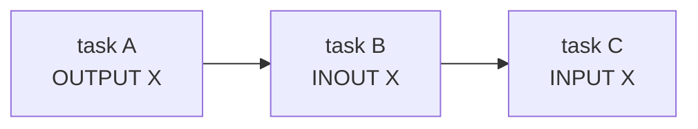
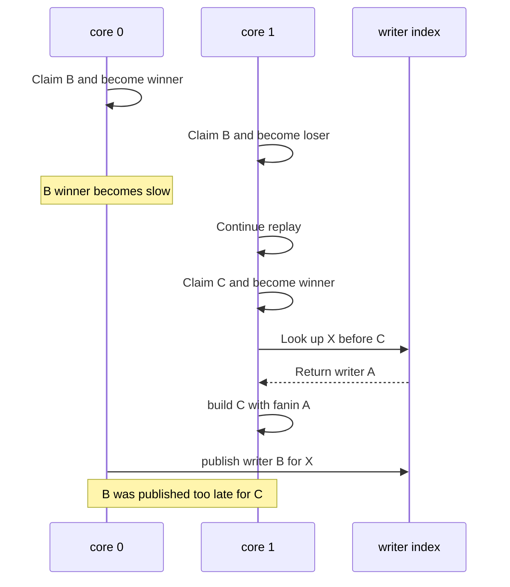
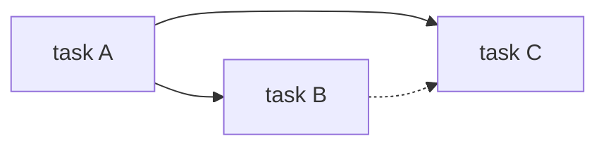
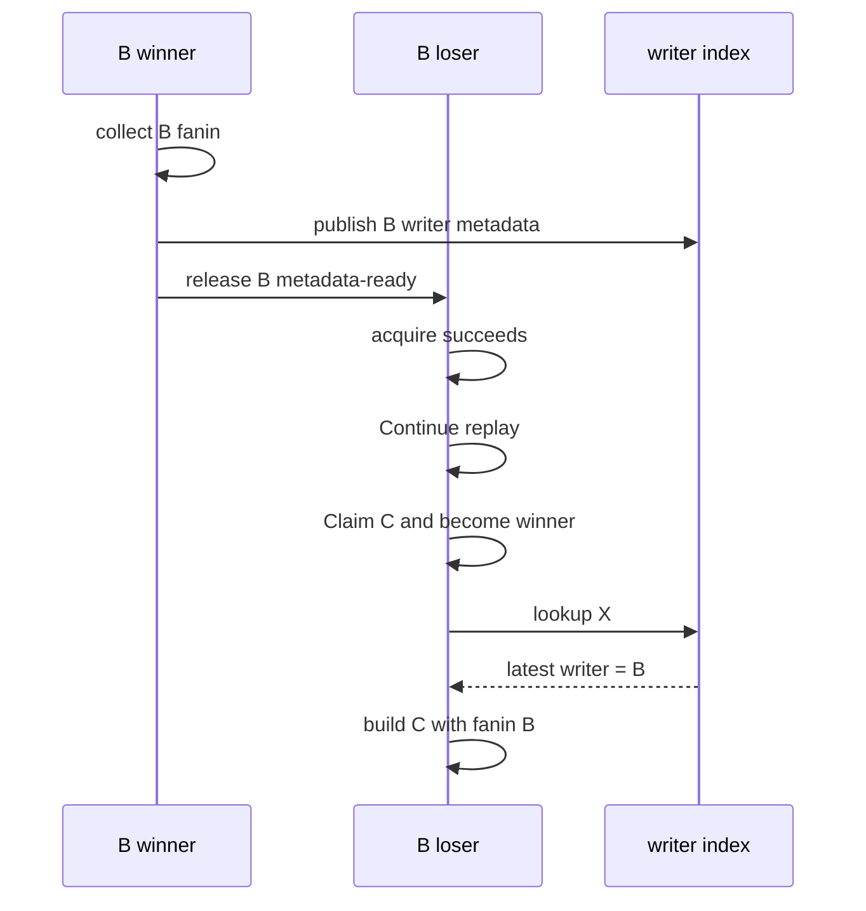

# Shared TensorMap 复写意图的正确性与高性能协议

> 状态：问题分析和方案探索。§2.2 描述当前实现；§4 的候选方案
> 尚未实现，必须经过 A5 onboard 测量后才能定案。

本文分析 Shared TensorMap 下的一个具体竞态：较早的复写 task 已经
Claim，但它的 writer 元数据还没有发布；另一个核却已经回放到较晚
的 reader task，因而在 lookup 时漏掉这个 writer。

本文按问题语义命名，不沿用会随评审文档调整的 `P0-x` 编号。当前
[`shared_tensormap_record.md`](shared_tensormap_record.md) 中的 P0-2 已经是
shared heap wrap 问题；本文对应其 §3.4 的 region-intent 保证边界。

## 1. 结论与范围

设 task id 满足 `A < B < C`：

- task A 创建 Tensor X；
- task B 以 `INOUT` 或 `OUTPUT_EXISTING` 复写 X；
- task C 以 `INPUT` 读取 X。

正确依赖必须是：



用户描述的竞态成立，也正是当前“writer 元数据就绪”闸门要阻止的
问题。当且仅当所有复写都强制经过这个闸门时，现有实现对这个
场景是正确的。

真正值得继续研究的不是“能否加一个等待”，而是如何同时满足：

1. C 一定依赖 B；
2. B 的执行 winner 变慢时，其他 replay core 不被整体挡住；
3. fresh `OUTPUT` / 纯 `INPUT` 主路径仍保持 shared-loser 近似
   do-nothing；
4. 不引入新的 global exact-turn 或 global publish-prefix convoy。

“较早 reader 读到 future writer”是另一个历史查询问题。它可以通过
版本历史、版本化句柄或禁止相应语义独立解决，不是本文的性能主线。

PA 当前 `q_loop == 1` 的用例也不是本问题的证据：该参数在语义上是
`OUTPUT`，只是当前用例标成了 `INOUT`。应先修正用例约束，再为真正的
复写链单独设计正确性和性能测试。

## 2. 竞态与当前修复

### 2.1 没有发布约束时如何漏依赖

task id 只规定了逻辑顺序，不保证各 winner 完成 lookup/register 的物理
顺序。下图中，core 0 赢得 B，core 1 输掉 B 后继续回放并赢得 C：



得到的错误依赖图是：



图中虚线 `B -.-> C` 表示应当存在但实际没有建立的依赖。

C 只等待 A 的 completion flag，因而可能与 B 并行，甚至在 B 之前读 X。
问题不在于 Tensor 数据的 cache 可见性，而在于 C 构建依赖图时根本没有
得到 B 这条边。

对任意 reader N，查询结果必须满足：

```text
producer(N, X) = max { W | W < N and W writes an overlapping part of X }
```

要使该公式可计算，lookup 之前必须满足以下两者之一：

- 所有可能相交的较早 writer 意图已经发布；
- lookup 能识别“较早 writer 尚未发布”，并延后或重试。

只做 task-id 过滤不能修复这个场景。`producer < N` 可以排除 future
writer，却无法区分“B 不存在”和“B 存在但还没发布”。

### 2.2 当前“winner 发布、loser 过门”为什么正确

当前流程是：

1. B 先完成 Claim，产生一个 winner 和多个 loser；
2. B winner 收集 B 自己的 fanin；
3. B winner 更新 X 的最新 writer 状态，或追加 B 的 region writer 记录；
4. B winner 以 release 语义发布“B 的依赖元数据已就绪”；
5. B loser 只有以 acquire 语义观察到就绪状态后，才能继续到 C。

其中第 2、3 步在两类 Tensor 上的具体逻辑不同：

| X 的表示 | B winner 对 X 做什么 | C 如何得到 B |
| -------- | --------------------- | --------------- |
| shared 符号 ref | 将最新 writer 从 A 换成 B，A 成为 B 的 fanin | 读到最新 writer B |
| ordinary region | 查到较早重叠 writer A，再追加 B 的区间记录 | 取小于 C 的最新重叠 writer B |

因此，任何能进入 C 的核都已经观察到 B 的 writer 元数据：



这个协议发布的是“B 的依赖元数据已就绪”，不是“B 的 kernel
已执行完”。C 真正执行前仍由 fanin task flag 等待 B 完成。

当前 loser 在等待时会尝试 drain 已有工作，因此不是绝对空转。但是
它仍然禁止该核继续 replay 和 Claim 后续 task；当可 drain 的工作耗尽后，
才会退化为对同一就绪标记的轮询。

## 3. 性能问题的本质

现有协议把三件不同的事绑在了 B winner 的同一个发布点上：

| 工作 | 谁真正需要 | C 查询前必须完成吗 |
| ---- | ------------ | ---------------------- |
| 声明“B 会写 X” | 后续 X 的 reader/writer | 是 |
| 计算 B 自己的全部 fanin | B winner | 否 |
| materialize、build 和 execute B | B winner / executor | 否 |

当前就绪标记在前两项都完成后才发布。因此一个本来只需要很小的
writer-intent 记录，会让所有 B loser 间接等待 B 的全部 fanin 收集。

如果复写 task 很密集，这会形成 replay frontier：

```text
writer B0 prepared -> all losers pass
writer B1 prepared -> all losers pass
...
```

主要代价是：

- 同步范围过大：与 X 无关的核也不能越过 B；
- 关键路径过长：发布被绑定到 B winner 的 fanin 收集；
- 复写密集时，可用的 run-ahead 和 Claim 并行度被逐个截断；
- 多个 loser 可能集中读取同一个 B 元数据就绪 cache line。

最终方案不应用一个 global task-id publish prefix 代替当前 marker。那只是把
“所有 loser 等 B”改成“所有后续 lookup winner 等最慢的较早 task”，无关
Tensor 之间仍然会发生 head-of-line blocking。fresh-output exact-slot 路径更不应
等待全局前缀。

同样，不能只做“先 lookup，之后看情况重试”。没有 writer announcement
或 completeness marker 时，C 无法知道自己看到的 A 是正确结果还是暂时结果。